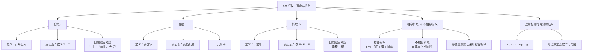

**相关笔记：** [[8.2 真值函项性：简单陈述与复合陈述]] | [[8.4 条件陈述与实质蕴涵]]

> [!abstract] 概览
> 本节详细讲解三种基本逻辑算子——**合取**（Conjunction, $·$）、**否定**（Negation, $\sim$）和**析取**（Disjunction, $∨$）——的定义、真值表及使用规则。合取仅在两个分支都为真时为真；否定将真值反转；析取仅在两个分支都为假时为假。本节还区分了==相容析取==（Inclusive Disjunction）与==不相容析取==（Exclusive Disjunction），并说明逻辑标点符号如何消除复合陈述中的结构歧义。

## 一、知识结构总览

## 二、核心思想与证明技巧

> [!tip] 合取（Conjunction, $·$）
> **定义：** 合取陈述 $p · q$（读作"$p$ 并且 $q$"）断言 $p$ 和 $q$ 都为真。
>
> **真值表：**
>
> | $p$ | $q$ | $p · q$ |
> |:---:|:---:|:---:|
> | T | T | **T** |
> | T | F | F |
> | F | T | F |
> | F | F | F |
>
> **关键规则：** 合取为真==当且仅当==两个合取支都为真。只要有一个合取支为假，整个合取就为假。
>
> **自然语言对应：** "并且"、"而且"、"但是"、"然而"、"同时"等都可以表达合取关系。注意，自然语言中的"但是"虽然带有转折语气，但在逻辑上等价于"并且"——逻辑只关心真值，不关心语气。

> [!tip] 否定（Negation, $\sim$）
> **定义：** 否定陈述 $\sim p$（读作"并非 $p$"）断言 $p$ 不为真，即 $\sim p$ 的真值与 $p$ 相反。
>
> **真值表：**
>
> | $p$ | $\sim p$ |
> |:---:|:---:|
> | T | **F** |
> | F | **T** |
>
> **关键规则：** 否定是==真值反转算子==——真变假，假变真。这是唯一的真值反转方式，因此 $\sim(\sim p) \equiv p$（双重否定律）。
>
> **一元性：** 否定只作用于==紧邻的==一个陈述。$\sim p · q$ 表示 $(\sim p) · q$（先否定 $p$，再与 $q$ 合取），而非 $\sim(p · q)$（否定整个合取）。两者的真值可能完全不同。

> [!tip] 析取（Disjunction, $∨$）
> **定义：** 析取陈述 $p ∨ q$（读作"$p$ 或者 $q$"）断言 $p$ 和 $q$ 中至少有一个为真。
>
> **真值表：**
>
> | $p$ | $q$ | $p ∨ q$ |
> |:---:|:---:|:---:|
> | T | T | **T** |
> | T | F | **T** |
> | F | T | **T** |
> | F | F | F |
>
> **关键规则：** 析取为假==当且仅当==两个析取支都为假。只要有一个析取支为真，整个析取就为真。
>
> **相容性：** 命题逻辑中的析取是==相容析取==（inclusive "or"），即允许 $p$ 和 $q$ 同时为真。这与日常语言中有时使用的"要么……要么……"（不相容析取）不同。

> [!def] De Morgan 定律
> 否定与合取、析取之间满足 De Morgan 定律：
> $$\sim(p · q) \equiv \sim p ∨ \sim q$$
> $$\sim(p ∨ q) \equiv \sim p · \sim q$$
>
> 这两条定律是后续逻辑等价变换和证明中的重要工具。

## 三、补充理解与易混淆点

### 补充理解

> [!info] Boole 的类代数与逻辑联结词
> **来源：** Boole, G. (1854). *An Investigation of the Laws of Thought*.
>
> George Boole 在《思维的规律研究》中开创性地将逻辑推理代数化。Boole 的核心洞见是：逻辑运算可以像代数运算一样用符号表示和演算。在他的系统中，合取对应于==类的交集==（$x · y$ 表示同时属于类 $x$ 和类 $y$ 的元素），析取对应于==类的并集==（$x + y$ 表示属于类 $x$ 或类 $y$ 的元素），否定对应于==类的补集==（$1 - x$ 表示不属于类 $x$ 的元素）。Boole 的类代数不仅为逻辑联结词提供了直观的集合论解释，还使得逻辑推理可以像解代数方程一样进行形式化操作。这一思想直接催生了布尔代数，成为现代数字电路设计和计算机科学的理论基石。

> [!info] 相容析取与不相容析取的哲学争论
> **来源：** Quine, W.V.O. (1951). *Mathematical Logic*, §5.
>
> W.V.O. Quine 在《数理逻辑》中深入讨论了相容析取（inclusive "or"）与不相容析取（exclusive "or"）的关系。Quine 指出，虽然在日常语言中"或者"有时暗示不相容（如"你要么喝茶，要么喝咖啡"），但==不相容析取可以用相容析取和否定来定义==：不相容析取 $p \underline{∨} q$ 等价于 $(p ∨ q) · \sim(p · q)$，即"$p$ 或 $q$，但不同时"。因此，不相容析取并非基本逻辑算子，它可以从相容析取、合取和否定中派生出来。Quine 据此论证，将相容析取作为基本逻辑算子是充分的，这一选择具有==理论上的经济性==（ontological economy）。

### 易混淆点

> [!warning] 误区："析取就是不相容析取"
> ❌ **错误理解：** 逻辑中的"或"（$∨$）意味着"要么 $p$ 要么 $q$，但不能同时"，即不相容析取。
>
> ✅ **正确理解：** 命题逻辑中的析取 $p ∨ q$ 是==相容析取==，它允许 $p$ 和 $q$ 同时为真。$p ∨ q$ 为真只要 $p$ 和 $q$ 中至少有一个为真。
>
> **辨析：** 这是一个非常常见的误解。在日常语言中，"或者"有时确实暗示排他性（如菜单上"汤或沙拉"通常意味着二选一）。但在逻辑学中，$∨$ 的标准定义是相容的。当 $p = T, q = T$ 时，$p ∨ q = T$，这是相容析取与不相容析取的关键区别。如果需要表达不相容析取，必须显式地写成 $(p ∨ q) · \sim(p · q)$。

> [!warning] 误区："否定是否定整个命题"
> ❌ **错误理解：** 否定算子 $\sim$ 总是否定它后面的整个命题或表达式。
>
> ✅ **正确理解：** 否定算子 $\sim$ 只作用于==紧邻的==一个陈述。如果没有括号，$\sim$ 的作用范围仅限于紧跟其后的最小单位。
>
> **辨析：** 考虑 $\sim p · q$ 与 $\sim(p · q)$ 的区别：
> - $\sim p · q = (\sim p) · q$：先否定 $p$，再与 $q$ 合取。例如 $p = F, q = F$ 时：$(\sim F) · F = T · F = F$
> - $\sim(p · q)$：先计算 $p · q$，再否定结果。例如 $p = F, q = F$ 时：$\sim(F · F) = \sim F = T$
>
> 两者在 $p = F, q = F$ 时真值不同（$F$ vs $T$），说明==括号对否定作用范围的决定性影响==。在书写符号表达式时，必须谨慎使用括号来明确否定的作用范围。

## 四、习题精选

> [!todo] 习题概览
>
> | 题号 | 来源 | 核心考点 | 难度 |
> |:---:|:---:|:---:|:---:|
> | 1 | Copi §8.3 | 合取、否定、析取的真值表计算 | ⭐⭐ |
> | 2 | Copi §8.3 | 否定作用范围与括号 | ⭐⭐ |
> | 3 | Copi §8.3 | 相容析取与不相容析取的区分 | ⭐ |

### 题1：真值表计算

> [!problem] 题目
> 令 $p = T, q = F, r = T$。求以下各表达式的真值：
> (a) $p · (q ∨ r)$
> (b) $\sim(p · q) ∨ r$
> (c) $\sim p · \sim q · r$

> [!faq]- 解答
>
> 已知 $p = T, q = F, r = T$。
>
> **(a)** $p · (q ∨ r)$
> - 先算括号内：$q ∨ r = F ∨ T = T$
> - 再算合取：$p · T = T · T = \boxed{T}$
>
> **(b)** $\sim(p · q) ∨ r$
> - 先算括号内：$p · q = T · F = F$
> - 再算否定：$\sim F = T$
> - 最后算析取：$T ∨ r = T ∨ T = \boxed{T}$
>
> **(c)** $\sim p · \sim q · r$
> - $\sim p = \sim T = F$
> - $\sim q = \sim F = T$
> - $F · T · r = F · T · T = \boxed{F}$（合取中有一个为假则整体为假）
>
> $\blacksquare$

> [!tip] 解题思路提示
> 1. 先确定各命题变项的真值
> 2. 从最内层括号开始，逐步向外计算
> 3. 注意否定的作用范围——只作用于紧邻的陈述
> 4. 合取中只要有一个为假，整体就为假

### 题2：否定作用范围

> [!problem] 题目
> 请说明 $\sim p ∨ q$ 与 $\sim(p ∨ q)$ 在什么情况下真值不同，并给出一个具体的真值赋值使两者真值不同。

> [!faq]- 解答
>
> **$\sim p ∨ q$** 的含义：$\sim p ∨ q = (\sim p) ∨ q$，即"并非 $p$，或者 $q$"。
>
> **$\sim(p ∨ q)$** 的含义：$\sim(p ∨ q)$，即"并非（$p$ 或 $q$）"，等价于 $\sim p · \sim q$（由 De Morgan 定律）。
>
> **真值表对比：**
>
> | $p$ | $q$ | $\sim p$ | $\sim p ∨ q$ | $p ∨ q$ | $\sim(p ∨ q)$ |
> |:---:|:---:|:---:|:---:|:---:|:---:|
> | T | T | F | T | T | F |
> | T | F | F | **F** | T | **F** |
> | F | T | T | T | T | F |
> | F | F | T | **T** | F | **T** |
>
> 当 $p = T, q = F$ 时：$\sim p ∨ q = F ∨ F = F$，而 $\sim(p ∨ q) = \sim(T ∨ F) = \sim T = F$。两者相同。
>
> 当 $p = F, q = F$ 时：$\sim p ∨ q = T ∨ F = T$，而 $\sim(p ∨ q) = \sim(F ∨ F) = \sim F = T$。两者相同。
>
> 实际上，令 $p = T, q = T$：$\sim p ∨ q = F ∨ T = T$，而 $\sim(p ∨ q) = \sim(T ∨ T) = \sim T = F$。
>
> **因此，当 $p = T, q = T$ 时，$\sim p ∨ q = T$ 而 $\sim(p ∨ q) = F$，两者真值不同。**
>
> $\blacksquare$

> [!tip] 解题思路提示
> 1. 用括号明确两个表达式的结构差异
> 2. 构造完整的真值表对比两者
> 3. 在真值表中找到真值不同的行
> 4. 也可以用 De Morgan 定律将 $\sim(p ∨ q)$ 转化为 $\sim p · \sim q$ 来理解差异

### 题3：相容析取与不相容析取

> [!problem] 题目
> 以下自然语言陈述中的"或"是相容的还是不相容的？请将每个陈述符号化。
> (a) 这道题的答案是对或错。
> (b) 他要么是法国人，要么是德国人。
> (c) 请出示护照或身份证。

> [!faq]- 解答
>
> (a) **不相容析取。** 一道题的答案不可能同时既对又错（在经典二值逻辑中）。符号化为 $p \underline{∨} q$，即 $(p ∨ q) · \sim(p · q)$，其中 $p$ = "答案是对的"，$q$ = "答案是错的"。
>
> (b) **不相容析取。** 在通常语境下，一个人的国籍是唯一的，不可能同时是法国人又是德国人。符号化为 $p \underline{∨} q$，即 $(p ∨ q) · \sim(p · q)$，其中 $p$ = "他是法国人"，$q$ = "他是德国人"。
>
> (c) **相容析取。** 一个人可以同时出示护照和身份证，两者都出示也满足要求。符号化为 $p ∨ q$，其中 $p$ = "出示护照"，$q$ = "出示身份证"。
>
> **注意：** 虽然日常语言中的"或"有时暗示不相容性，但==命题逻辑中的 $∨$ 默认是相容的==。如果需要表达不相容析取，必须显式写出 $(p ∨ q) · \sim(p · q)$。
>
> $\blacksquare$

> [!tip] 解题思路提示
> 1. 分析语境中两个选项是否可以同时成立
> 2. 如果可以同时成立，则是相容析取（$p ∨ q$）
> 3. 如果不能同时成立，则是不相容析取（$(p ∨ q) · \sim(p · q)$）
> 4. 注意语境依赖性——同一个"或"在不同语境下可能有不同解读

## 五、视频学习指南

> [!info] 视频资源
>
> | 资源名称 | 讲者/来源 | 主题 | 时长 |
> |:---|:---|:---|:---:|
> | *Truth Tables: Conjunction and Disjunction* | Khan Academy | 合取与析取真值表 | ~10 min |
> | *Negation in Propositional Logic* | Wireless Philosophy | 否定算子详解 | ~7 min |
> | *Exclusive vs. Inclusive OR* | Kevin deLaplante | 相容与不相容析取 | ~12 min |

## 六、教材原文

> [!quote]
> "The dot symbolizes the conjunction of two statements, and the wedge symbolizes their disjunction. The conjunction is true only when both conjuncts are true; the disjunction is false only when both disjuncts are false. The tilde is the symbol for negation, which simply reverses the truth value of the statement to which it is prefixed."
>
> —— Copi, *Introduction to Logic*, 15th ed., §8.3

## 参见 Wiki

- [[析取三段论]]
- [[假言三段论]]

#学习/逻辑学/命题逻辑Ⅰ
