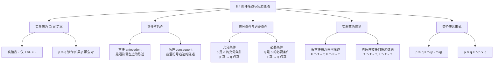

**相关笔记：** [[8.3 合取、否定与析取]] | [[8.5 论证形式与运用逻辑类推进行的反驳]]

> [!abstract] 概览
> 本节深入讨论条件陈述（Conditional Statement）及其逻辑表示——**实质蕴涵**（Material Implication, $⊃$）。核心内容包括：实质蕴涵的真值表定义（仅当 $T ⊃ F = F$）、前件（Antecedent）与后件（Consequent）的概念、充分条件与必要条件的区分、==实质蕴涵悖论==（Paradoxes of Material Implication）及其哲学解读，以及实质蕴涵的三种等价表达形式：$p ⊃ q \equiv \sim(p · \sim q) \equiv \sim p ∨ q$。

## 一、知识结构总览

## 二、核心思想与证明技巧

> [!tip] 实质蕴涵（Material Implication, $⊃$）的定义
> **定义：** 实质蕴涵 $p ⊃ q$（读作"如果 $p$ 那么 $q$"）是一个真值函项联结词，其真值表如下：
>
> | $p$ | $q$ | $p ⊃ q$ |
> |:---:|:---:|:---:|
> | T | T | **T** |
> | T | F | **F** |
> | F | T | T |
> | F | F | T |
>
> **核心规则：** 实质蕴涵为假==当且仅当==前件为真且后件为假（$T ⊃ F = F$）。在所有其他情况下，实质蕴涵都为真。
>
> **直觉理解：** "如果 $p$ 那么 $q$"承诺的是：当 $p$ 为真时，$q$ 也必须为真。如果 $p$ 为真但 $q$ 为假，这个承诺就被违反了（蕴涵为假）。但如果 $p$ 本身为假，那么这个承诺没有被触发——无论 $q$ 是什么，蕴涵都不算被违反（为真）。

> [!tip] 充分条件与必要条件
> 在条件陈述 $p ⊃ q$ 中：
> - $p$ 是 $q$ 的**充分条件**（Sufficient Condition）：$p$ 的成立足以保证 $q$ 的成立
> - $q$ 是 $p$ 的**必要条件**（Necessary Condition）：$p$ 的成立需要 $q$ 的成立作为前提
>
> **记忆方法：**
> - "充分" = "足够了"——有 $p$ 就够了，不需要别的
> - "必要" = "必须有"——没有 $q$ 就不行，$q$ 是必需的
>
> **示例：** "如果天下雨（$p$），那么地会湿（$q$）"
> - 天下雨是地湿的==充分条件==（下雨足以使地湿）
> - 地湿是天下雨的==必要条件==（如果天下雨了，地必定湿了；地不湿说明没下雨）
>
> **注意：** 充分条件不一定是必要条件，必要条件也不一定是充分条件。天下雨是地湿的充分条件，但不是必要条件（地湿还可能因为洒水车）。

> [!tip] 实质蕴涵的三种等价形式
> 以下三个表达式在真值函项上完全等价：
>
> $$p ⊃ q \equiv \sim(p · \sim q) \equiv \sim p ∨ q$$
>
> **逐一验证：**
>
> | $p$ | $q$ | $p ⊃ q$ | $\sim q$ | $p · \sim q$ | $\sim(p · \sim q)$ | $\sim p$ | $\sim p ∨ q$ |
> |:---:|:---:|:---:|:---:|:---:|:---:|:---:|:---:|
> | T | T | T | F | F | T | F | T |
> | T | F | F | T | T | F | F | F |
> | F | T | T | F | F | T | T | T |
> | F | F | T | T | F | T | T | T |
>
> 三列完全一致，证实等价性。
>
> **直觉解释：**
> - $\sim(p · \sim q)$："并非（$p$ 真而 $q$ 假）"——这正是"如果 $p$ 那么 $q$"的核心含义
> - $\sim p ∨ q$："非 $p$，或 $q$"——要么 $p$ 不成立，要么 $q$ 成立，这覆盖了除 $p$ 真 $q$ 假之外的所有情况

> [!tip] 实质蕴涵悖论
> 实质蕴涵的真值表导致两个看似反直觉的真命题：
>
> **悖论一：假前件蕴涵任何陈述**
> $$F ⊃ q = T$$
> 当 $p$ 为假时，无论 $q$ 是什么，$p ⊃ q$ 都为真。例如，"如果 $2 + 2 = 5$，那么月球是奶酪做的"在实质蕴涵的意义下为真。
>
> **悖论二：真后件被任何陈述蕴涵**
> $$p ⊃ T = T$$
> 当 $q$ 为真时，无论 $p$ 是什么，$p ⊃ q$ 都为真。例如，"如果猪会飞，那么 $2 + 2 = 4$"在实质蕴涵的意义下为真。
>
> **关键理解：** 这些"悖论"并不是逻辑错误——它们是真命题。它们之所以反直觉，是因为日常语言中的"如果-那么"通常暗示前件和后件之间存在某种==内容上的关联==（因果关系、语义关联等），而实质蕴涵==只关心真值==，不关心内容关联。实质蕴涵是对条件关系的==最小化==真值函项刻画。

## 三、补充理解与易混淆点

### 补充理解

> [!info] C.I. Lewis 的严格蕴涵与模态逻辑
> **来源：** Lewis, C.I. (1912). "Implication and the Algebra of Logic".
>
> Clarence Irving Lewis 在 1912 年的论文中对实质蕴涵提出了尖锐批评，认为它未能捕捉到日常推理中"蕴涵"的真正含义。Lewis 指出，实质蕴涵悖论表明 $p ⊃ q$ 并不要求 $p$ 和 $q$ 之间有任何==逻辑上的必然联系==。为此，Lewis 提出了==严格蕴涵==（Strict Implication）的概念，记作 $p \prec q$，定义为：$p \prec q$ 当且仅当 $p ⊃ q$ 在==所有可能世界中==都为真（即 $\Box(p ⊃ q)$，其中 $\Box$ 是必然性算子）。严格蕴涵要求前件和后件之间存在逻辑上的必然联系，从而避免了实质蕴涵悖论。Lewis 的工作直接催生了==模态逻辑==（Modal Logic）这一重要的逻辑学分支，后来的模态逻辑发展出了丰富的系统（如 S4、S5），广泛应用于哲学、计算机科学和语言学。

> [!info] 实质蕴涵悖论的哲学辩护
> **来源：** Russell, B. (1903). *The Principles of Mathematics*, §16.
>
> Bertrand Russell 在《数学原理》中对实质蕴涵悖论进行了有力的哲学辩护。Russell 认为，"如果 $p$ 那么 $q$"在日常语言中的用法本身就包含了实质蕴涵的含义——当我们说"如果 $p$ 那么 $q$"时，我们确实在断言"并非（$p$ 真而 $q$ 假）"。Russell 指出，实质蕴涵悖论之所以令人困惑，是因为我们习惯性地将"蕴涵"与"推出"（entailment）或"因果"（causation）混为一谈。他论证道：==实质蕴涵是蕴涵概念的最弱形式==，任何更强的蕴涵概念（如严格蕴涵、因果蕴涵）都必须以实质蕴涵为基础。在数学推理中，我们实际上使用的就是实质蕴涵——数学证明中的"如果……则……"并不要求前件和后件之间有因果联系，只要求当前件为真时后件不能为假。Russell 的这一辩护为实质蕴涵在数学和逻辑中的核心地位奠定了哲学基础。

### 易混淆点

> [!warning] 误区："实质蕴涵就是日常语言中的'如果-那么'"
> ❌ **错误理解：** 实质蕴涵 $p ⊃ q$ 完全等价于日常语言中的"如果 $p$ 那么 $q$"，两者含义完全相同。
>
> ✅ **正确理解：** 实质蕴涵是日常"如果-那么"的==真值函项抽象==。它只保留了"并非（前件真而后件假）"这一核心真值特征，但==不包含==日常蕴涵中常见的因果关联、内容相关性或时间顺序等额外含义。
>
> **辨析：** 日常语言中的"如果-那么"至少包含以下额外要素：
> - **因果关联：** "如果天下雨，那么地会湿"暗示下雨是地湿的原因
> - **内容相关性：** 前件和后件在内容上通常有某种语义联系
> - **时间顺序：** 前件通常描述先发生的事件
>
> 实质蕴涵 $p ⊃ q$ 不包含以上任何要素。它只关心真值：$p ⊃ q$ 为假当且仅当 $p = T$ 且 $q = F$。因此，"如果 $2 + 2 = 5$，那么月球是奶酪做的"在实质蕴涵下为真（因为前件为假），但在日常语言中这毫无意义。

> [!warning] 误区："实质蕴涵悖论是逻辑错误"
> ❌ **错误理解：** 实质蕴涵悖论（如"假命题蕴涵任何命题"）说明实质蕴涵的定义有缺陷，是一种逻辑错误。
>
> ✅ **正确理解：** 实质蕴涵悖论是==真命题==，它们只是在直觉上令人困惑，而非逻辑错误。这些"悖论"揭示了日常蕴涵概念与实质蕴涵之间的差距。
>
> **辨析：** "悖论"一词在这里容易引起误解。实质蕴涵悖论不是矛盾（contradiction），而是==反直觉的真命题==。它们之所以为真，是实质蕴涵定义的直接推论：
> - $F ⊃ q = T$：当前件为假时，"如果 $p$ 那么 $q$"的承诺没有被触发，因此不算被违反
> - $p ⊃ T = T$：当后件为真时，无论前件如何，结论都是对的，因此蕴涵成立
>
> 如果拒绝接受这些结果，就必须修改实质蕴涵的定义，但任何修改都会失去命题逻辑的简洁性和完备性。Lewis 的严格蕴涵是一种替代方案，但它引入了模态概念（必然性），增加了系统的复杂度。在数学和大多数形式推理中，实质蕴涵仍然是==最实用==的选择。

## 四、习题精选

> [!todo] 习题概览
>
> | 题号 | 来源 | 核心考点 | 难度 |
> |:---:|:---:|:---:|:---:|
> | 1 | Copi §8.4 | 实质蕴涵真值表与等价形式 | ⭐⭐ |
> | 2 | Copi §8.4 | 充分条件与必要条件的识别 | ⭐ |
> | 3 | Copi §8.4 | 实质蕴涵悖论的理解 | ⭐⭐ |

### 题1：实质蕴涵的等价形式

> [!problem] 题目
> 证明 $p ⊃ q \equiv \sim p ∨ q$，即用真值表验证这两个表达式在所有赋值下真值相同。

> [!faq]- 解答
>
> 构造真值表：
>
> | $p$ | $q$ | $p ⊃ q$ | $\sim p$ | $\sim p ∨ q$ |
> |:---:|:---:|:---:|:---:|:---:|
> | T | T | T | F | T |
> | T | F | F | F | F |
> | F | T | T | T | T |
> | F | F | T | T | T |
>
> 比较第三列和第五列，两者在所有四种赋值下完全一致：
> - $p = T, q = T$：$T ⊃ T = T$，$\sim T ∨ T = F ∨ T = T$ ✓
> - $p = T, q = F$：$T ⊃ F = F$，$\sim T ∨ F = F ∨ F = F$ ✓
> - $p = F, q = T$：$F ⊃ T = T$，$\sim F ∨ T = T ∨ T = T$ ✓
> - $p = F, q = F$：$F ⊃ F = T$，$\sim F ∨ F = T ∨ F = T$ ✓
>
> 因此，$p ⊃ q \equiv \sim p ∨ q$ 得证。
>
> $\blacksquare$

> [!tip] 解题思路提示
> 1. 列出所有命题变项的真值组合（$n$ 个变项有 $2^n$ 种组合）
> 2. 分别计算两个表达式在各组合下的真值
> 3. 逐行比较，确认所有行都一致
> 4. 也可以用 $\sim(p · \sim q)$ 作为中间步骤来理解等价性

### 题2：充分条件与必要条件

> [!problem] 题目
> 对以下每个条件陈述，指出前件和后件，并判断前件是后件的充分条件、必要条件、两者兼是、还是两者都不是：
> (a) 如果一个数能被 6 整除，那么它能被 2 整除。
> (b) 如果一个人是单身汉，那么他是未婚的。
> (c) 如果天下雨，那么我会带伞。

> [!faq]- 解答
>
> (a) "如果一个数能被 6 整除，那么它能被 2 整除。"
> - 前件 $p$：一个数能被 6 整除
> - 后件 $q$：它能被 2 整除
> - $p$ 是 $q$ 的==充分条件==：能被 6 整除足以保证能被 2 整除（因为 $6 = 2 × 3$）
> - $p$ 不是 $q$ 的==必要条件==：能被 2 整除不要求能被 6 整除（如 4 能被 2 整除但不能被 6 整除）
>
> (b) "如果一个人是单身汉，那么他是未婚的。"
> - 前件 $p$：一个人是单身汉
> - 后件 $q$：他是未婚的
> - $p$ 是 $q$ 的==充分条件==：是单身汉足以保证未婚
> - $p$ 也是 $q$ 的==必要条件==（在定义上）：未婚的成年男性就是单身汉
> - 因此，$p$ 是 $q$ 的==充分且必要条件==（$p \equiv q$）
>
> (c) "如果天下雨，那么我会带伞。"
> - 前件 $p$：天下雨
> - 后件 $q$：我会带伞
> - $p$ 是 $q$ 的==充分条件==（按说话人的意图）：下雨足以让我带伞
> - $p$ 不是 $q$ 的==必要条件==：我可能因为其他原因带伞（如防晒）
> - 注意：这是一个经验性陈述，而非逻辑真理，其真值取决于事实
>
> $\blacksquare$

> [!tip] 解题思路提示
> 1. 识别"如果"后面的部分为前件，"那么"后面的部分为后件
> 2. 检验"前件真 → 后件必真"是否成立（充分条件）
> 3. 检验"后件假 → 前件必假"是否成立（必要条件）
> 4. 注意区分逻辑真理（如(b)）和经验性陈述（如(c)）

### 题3：实质蕴涵悖论

> [!problem] 题目
> 以下两个陈述在实质蕴涵的意义下是真还是假？请解释为什么这些结果虽然正确，但可能违反直觉。
> (a) 如果 $1 > 2$，那么地球是平的。
> (b) 如果猪会飞，那么 $2 + 2 = 4$。

> [!faq]- 解答
>
> **(a)** "如果 $1 > 2$，那么地球是平的。"
> - 前件 $p$："$1 > 2$"——这是一个**假**陈述
> - 后件 $q$："地球是平的"——这也是一个**假**陈述
> - 根据实质蕴涵真值表：$F ⊃ F = \boxed{T}$
> - **结果：真。**
>
> **(b)** "如果猪会飞，那么 $2 + 2 = 4$。"
> - 前件 $p$："猪会飞"——这是一个**假**陈述
> - 后件 $q$："$2 + 2 = 4$"——这是一个**真**陈述
> - 根据实质蕴涵真值表：$F ⊃ T = \boxed{T}$
> - **结果：真。**
>
> **为什么反直觉？**
>
> (a) 的反直觉之处在于：前件和后件都是假的，且两者之间没有任何内容上的关联，但蕴涵却为真。直觉上，我们觉得"从错误的命题推出错误的结论"不应该是有效的。
>
> (b) 的反直觉之处在于：前件（猪会飞）与后件（$2 + 2 = 4$）之间毫无关系，但蕴涵却为真。直觉上，我们期望"如果-那么"的前后件之间有某种逻辑或因果联系。
>
> **实质蕴涵的辩护：** 这两个结果之所以为真，是因为实质蕴涵只关心"是否出现前件真而后件假的情况"。在(a)中，前件为假，所以蕴涵的承诺没有被触发；在(b)中，后件为真，所以无论前件如何，结论都是对的。==实质蕴涵是一种"无罪推定"——除非被证明违反（前件真后件假），否则蕴涵成立。==
>
> $\blacksquare$

> [!tip] 解题思路提示
> 1. 分别确定前件和后件的真值
> 2. 查阅实质蕴涵真值表得出结果
> 3. 分析为什么结果违反直觉——通常是因为日常蕴涵期望内容关联
> 4. 用"无罪推定"类比来理解实质蕴涵的逻辑

## 五、视频学习指南

> [!info] 视频资源
>
> | 资源名称 | 讲者/来源 | 主题 | 时长 |
> |:---|:---|:---|:---:|
> | *Conditionals and Material Implication* | Khan Academy | 实质蕴涵基础 | ~12 min |
> | *The Paradoxes of Material Implication* | Wireless Philosophy | 实质蕴涵悖论详解 | ~10 min |
> | *Sufficient and Necessary Conditions* | Gary Hatfield | 充分条件与必要条件 | ~15 min |

## 六、教材原文

> [!quote]
> "The material implication $p ⊃ q$ is false only when its antecedent is true and its consequent is false. In all other cases it is true. This definition captures the minimal truth-functional content of the conditional statement 'if p then q,' although it does not capture the richer causal or content connections that ordinary language conditionals often convey."
>
> —— Copi, *Introduction to Logic*, 15th ed., §8.4

## 参见 Wiki

- [[假言三段论]]
- [[有效性]]
- [[实质蕴涵]]：实质蕴涵的完整概念页
- [[析取三段论]]

#学习/逻辑学/命题逻辑Ⅰ
