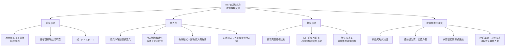

**相关笔记：** [[8.4 条件陈述与实质蕴涵]] | [[8.6 "无效"和"有效"的精确含义]]

> [!abstract] 概览
> 本节引入**论证形式**（argument form）和**特征形式**（specific form）的核心概念，并介绍一种重要的反驳技术——**运用逻辑类推进行的反驳**（refutation by logical analogy）。核心知识点包括：
> - **论证形式**：用陈述变元 $p, q, r$ 等替换论证中的组成陈述后得到的模式
> - **代入例**（substitution instance）：用具体陈述替换变元后得到的论证
> - **特征形式**：揭示论证完整逻辑结构的形式，是判定有效性的关键
> - **逻辑类推反驳法**：构造一个同形式但前提真结论假的论证来证明原论证无效
> - ==有效论证形式只能有有效的代入例==，但无效论证形式可以有有效的代入例

---

## 一、知识结构总览

---

## 二、核心思想与证明技巧

> [!tip] 核心思想
> ==论证的有效性取决于其形式，而非其内容==。这是现代符号逻辑的基石性原则。一个论证是否有效，完全由其逻辑结构（形式）决定，与其中涉及的具体命题内容无关。因此，要判定一个论证是否有效，我们可以：
> 1. 提取其论证形式（特别是特征形式）
> 2. 检查该形式是否有效
> 3. 如果形式无效，则原论证无效

### 论证形式的定义

> [!def] 定义：论证形式
> **论证形式**（argument form）是通过==用陈述变元（statement variables）替换论证中的组成陈述==而得到的逻辑模式。陈述变元通常用小写字母 $p, q, r, s$ 等表示，它们充当"占位符"，可以被任何具体陈述替换。
>
> **关键规则：** 替换时只替换组成陈述（简单陈述），**保留所有逻辑联结词**（$\sim, \cdot, \vee, \supset, \equiv$）和推理结构（前提排列、∴符号）不变。

**示例：**

| 具体论证 | 论证形式 |
|:---------|:---------|
| 如果天下雨，地面就会湿。天下雨。∴ 地面会湿。 | $p \supset q, p, \therefore q$ |
| 如果他是学生，他就必须考试。他是学生。∴ 他必须考试。 | $p \supset q, p, \therefore q$ |

这两个论证具有==相同的论证形式==，因此它们具有相同的有效性状态。

### 代入例（Substitution Instance）

> [!def] 定义：代入例
> **代入例**（substitution instance）是用具体陈述一致地替换论证形式中的陈述变元后得到的论证。"一致地"意味着==同一个变元在形式中的所有出现都必须被同一个陈述替换==。

**示例：** 论证形式 $p \supset q, p, \therefore q$ 的代入例：
- 用"天下雨"替换 $p$，"地面湿"替换 $q$：如果天下雨，地面湿。天下雨。∴ 地面湿。
- 用"$2+2=4$"替换 $p$，"雪是白的"替换 $q$：如果 $2+2=4$，那么雪是白的。$2+2=4$。∴ 雪是白的。

> [!tip] 重要定理
> ==有效论证形式的所有代入例都是有效论证==。但无效论证形式**不一定**只有无效的代入例——无效论证形式也可以有有效的代入例（此时有效性来自内容，而非形式）。

### 特征形式（Specific Form）

> [!def] 定义：特征形式
> **特征形式**（specific form）是==揭示论证完整逻辑结构==的论证形式。一个论证可以被抽象为不同层次的形式，但只有特征形式才能完整地揭示其逻辑结构，是判定有效性的关键。

**示例：** 考虑论证"如果天下雨且刮风，地面就会湿。天下雨。∴ 地面会湿。"

| 抽象层次 | 形式 | 说明 |
|:---------|:-----|:-----|
| 最抽象 | $p, q, \therefore r$ | 丢失了太多结构信息 |
| 中间层次 | $p \supset r, q, \therefore r$ | 仍不完整 |
| ==特征形式== | $(p \cdot q) \supset r, p, \therefore r$ | ==完整揭示逻辑结构== |

### 运用逻辑类推进行的反驳

> [!def] 定义：逻辑类推反驳法
> **运用逻辑类推进行的反驳**（refutation by logical analogy）是一种证明论证无效的方法。其核心策略是：==构造一个与原论证具有相同形式（特征形式），但前提明显为真而结论明显为假的论证==。由于有效论证形式不可能有前提真结论假的代入例，因此只要找到一个这样的代入例，就证明了原论证的形式是无效的，从而原论证也是无效的。

**操作步骤：**

1. **提取原论证的特征形式**
2. **用新的陈述替换变元**，使得所有前提都为真，而结论为假
3. **展示新论证**，指出其前提为真、结论为假
4. **得出结论**：由于两个论证具有相同形式，而新论证是无效的（前提真结论假），因此原论证也是无效的

> [!example] 示例
> **原论证：** 如果我是一个学生，我就必须学习。我不是学生。∴ 我不需要学习。
>
> **反驳：** 构造同形式的论证——
> "如果一只动物是狗，它就是哺乳动物。一只猫不是狗。∴ 这只猫不是哺乳动物。"
>
> 前提1为真（狗确实是哺乳动物），前提2为真（猫不是狗），但结论为假（猫是哺乳动物）。因此该形式无效，原论证也无效。

---

## 三、补充理解与易混淆点

### 补充理解

> [!info] 补充1：亚里士多德《前分析篇》中的形式有效性思想
> **来源：** Aristotle. (c. 350 BCE). *Prior Analytics*, Book I, Chapters 4-6.
>
> 亚里士多德在《前分析篇》中首次系统地阐述了形式有效性的思想，这是逻辑学作为一门独立学科的起点。亚里士多德的核心洞察是：==一个三段论的有效性完全取决于其形式（格与式），而非其内容==。他通过将三段论的词项替换为字母（如 A、B、C）来抽象出三段论的形式结构，并系统地考察了所有可能的三段论形式，从中筛选出有效的形式。
>
> 亚里士多德的方法本质上就是一种"形式化"方法：通过忽略具体内容、只关注形式结构来判断推理的正确性。这一思想与现代命题逻辑中的论证形式概念一脉相承——只是亚里士多德关注的是词项之间的包含关系（三段论），而现代命题逻辑关注的是命题之间的真值函项关系。亚里士多德的工作表明，"有效性取决于形式"这一原则早在两千多年前就已经被确立为逻辑学的核心原则。

> [!info] 补充2：逻辑类推与司法论证
> **来源：** Wigmore, J. H. (1937). *The Science of Judicial Proof*, 3rd ed. Boston: Little, Brown.
>
> 威格莫尔（John Henry Wigmore）在其经典著作《司法证明的科学》中详细讨论了逻辑类推在法律论证中的应用。在司法实践中，==逻辑类推反驳法是一种非常重要的论证评估工具==。律师和法官经常通过构造"平行案例"（parallel cases）来检验某个法律推理的有效性：如果对方的推理形式在另一个明显荒谬的案例中导致错误结论，那么该推理形式就是无效的。
>
> 威格莫尔指出，这种方法在"遵循先例"（stare decisis）的法律体系中尤为重要。当法官需要判断一个先例是否适用于当前案件时，关键在于两个案件是否具有"相同的推理形式"。如果对方声称先例适用于当前案件，但通过逻辑类推可以构造一个同形式的论证导致荒谬结论，那么先例就不适用于当前案件。这种方法实际上就是逻辑类推反驳法在法律领域的具体应用。

### 易混淆点

> [!warning] 误区：同形式的论证一定具有相同的有效性
> ❌ **错误理解：** 如果两个论证具有相同的形式，那么它们一定同时有效或同时无效。
> ✅ **正确理解：** ==有效论证形式的所有代入例都是有效的==，但无效论证形式**可以有**有效的代入例。一个论证可能是有效的，即使它的某个更抽象的形式是无效的——关键在于==特征形式==是否有效。
> **辨析：** 例如，论证"如果 $2+2=4$，那么雪是白的。$2+2=4$。∴ 雪是白的。"是有效的（前提真，结论真，且形式 $p \supset q, p, \therefore q$ 有效），但如果将其抽象为 $p, q, \therefore r$（这不是特征形式），这个更抽象的形式是无效的。因此，判断有效性必须基于特征形式，而非任意抽象层次的形式。

> [!warning] 误区：特征形式有效意味着论证一定可靠
> ❌ **错误理解：** 如果论证的特征形式是有效的，那么该论证就是可靠的（sound）。
> ✅ **正确理解：** 特征形式有效只意味着论证是**有效的**（valid），但==有效不等于可靠==。可靠性要求论证有效**且**所有前提为真。一个论证可以具有有效的特征形式，但如果其前提中有假的，它就不是可靠的。
> **辨析：** 例如，"如果猪会飞，那么 $1+1=3$。猪会飞。∴ $1+1=3$。"——特征形式 $p \supset q, p, \therefore q$ 是有效的，但前提"猪会飞"为假，因此论证有效但不可靠。参见 [[有效性-vs-可靠性]]。

---

## 四、习题精选

> [!todo] 习题概览
> | 题号 | 来源 | 核心考点 | 难度 |
> |:-----|:-----|:---------|:-----|
> | 1 | 自编 | 提取论证的特征形式 | ⭐⭐ |
> | 2 | 自编 | 运用逻辑类推反驳无效论证 | ⭐⭐⭐ |
> | 3 | 自编 | 区分论证形式与特征形式 | ⭐⭐ |

### 题1：提取特征形式

> [!problem] 题目
> 请提取以下论证的特征形式：
>
> "如果天气好并且我有空闲时间，我就去公园。天气好。∴ 我去公园。"

> [!faq]- 解答
> **[步骤1]** 识别简单陈述（组成陈述）：
> - $p$：天气好
> - $q$：我有空闲时间
> - $r$：我去公园
>
> **[步骤2]** 用变元替换组成陈述，保留逻辑联结词：
> - 前提1：如果 $p$ 并且 $q$，那么 $r$ → $(p \cdot q) \supset r$
> - 前提2：$p$
> - 结论：$r$
>
> **[步骤3]** 写出特征形式：
> $$(p \cdot q) \supset r, \quad p, \quad \therefore r$$
>
> **[步骤4]** 验证：这是该论证的特征形式，因为它完整地揭示了论证的逻辑结构。注意，不能进一步将 $(p \cdot q)$ 替换为单个变元，否则会丢失"天气好"和"我有空闲时间"作为合取支的结构信息。
>
> $\blacksquare$

### 题2：逻辑类推反驳

> [!problem] 题目
> 以下论证是否有效？请运用逻辑类推反驳法进行判定。
>
> "如果一个人是医生，那么他有职业。如果一个人是律师，那么他有职业。这个人既不是医生也不是律师。∴ 这个人没有职业。"

> [!faq]- 解答
> **[步骤1]** 提取特征形式：
> - $p$：一个人是医生
> - $q$：一个人有职业
> - $r$：一个人是律师
> - 前提1：$p \supset q$
> - 前提2：$r \supset q$
> - 前提3：$\sim p \cdot \sim r$
> - 结论：$\sim q$
>
> 特征形式：$p \supset q, \; r \supset q, \; \sim p \cdot \sim r, \; \therefore \sim q$
>
> **[步骤2]** 构造同形式的反驳论证：
> - 用"猫"替换 $p$，"哺乳动物"替换 $q$，"狗"替换 $r$
> - 前提1（真）：如果一只动物是猫，那么它是哺乳动物。
> - 前提2（真）：如果一只动物是狗，那么它是哺乳动物。
> - 前提3（真）：这匹马既不是猫也不是狗。
> - 结论（假）：∴ 这匹马不是哺乳动物。
>
> **[步骤3]** 判定：前提全部为真，但结论为假（马是哺乳动物）。因此该特征形式是无效的，原论证也是无效的。
>
> **[步骤4]** 错误分析：原论证犯了"否定前件"的变体错误——$p \supset q$ 只说明"如果 $p$ 则 $q$"，并不说明"只有 $p$ 才 $q$"。一个人可以既不是医生也不是律师，但仍然是教师、工程师等，仍然有职业。
>
> $\blacksquare$

### 题3：区分论证形式与特征形式

> [!problem] 题目
> 以下论证可以被抽象为哪些不同的形式？哪一个是特征形式？
>
> "如果天下雨，那么如果刮风，地面就会湿。天下雨。∴ 地面会湿。"

> [!faq]- 解答
> **[步骤1]** 识别简单陈述：
> - $p$：天下雨
> - $q$：刮风
> - $r$：地面会湿
>
> **[步骤2]** 列出不同抽象层次的形式：
>
> | 抽象层次 | 形式 | 是否为特征形式 |
> |:---------|:-----|:---------------|
> | 最抽象 | $p, q, \therefore r$ | 否，丢失了所有联结词信息 |
> | 中间层次 | $p \supset q, p, \therefore r$ | 否，将条件句内部结构丢失 |
> | ==特征形式== | $p \supset (q \supset r), \; p, \; \therefore r$ | ==是==，完整揭示了嵌套条件结构 |
>
> **[步骤3]** 验证特征形式的有效性：
> - 当 $p$ 为真时，$p \supset (q \supset r)$ 要求 $q \supset r$ 为真
> - 但 $q \supset r$ 为真时，$q$ 为真则 $r$ 为真，$q$ 为假时 $r$ 可真可假
> - 因此，当 $p$ 为真、$q$ 为假、$r$ 为假时：前提1为真（$T \supset (F \supset F) = T \supset T = T$），前提2为真（$p = T$），结论为假（$r = F$）
> - ==该特征形式是无效的==
>
> **[步骤4]** 结论：该论证的特征形式是 $p \supset (q \supset r), \; p, \; \therefore r$，且该形式是无效的。原论证也是无效的——"天下雨"和"如果刮风地面会湿"并不能保证地面一定会湿（因为可能没有刮风）。
>
> $\blacksquare$

> [!tip] 解题思路提示
> 1. **提取特征形式时**，先识别所有简单陈述（组成陈述），再逐一用变元替换，确保保留所有逻辑联结词
> 2. **构造逻辑类推反驳时**，选择直觉上明显为真或为假的陈述来替换变元，使前提真结论假一目了然
> 3. **区分特征形式时**，从最具体的抽象开始逐步检查：是否保留了所有联结词？是否保留了所有简单陈述的区分？==特征形式是保留最多结构信息的形式==

---

## 五、视频学习指南

> [!info] 视频资源
> | 资源 | 链接 | 对应内容 | 备注 |
> |:-----|:-----|:---------|:-----|
> | Wireless Philosophy: Logical Arguments | [链接](https://www.youtube.com/watch?v=Jq2LJYcTJ0E) | 论证形式与有效性 | 英文，适合入门 |
> | Kevin deLaplante: Critical Thinking | [链接](https://www.youtube.com/watch?v=sG8Wb9K4sYk) | 逻辑类推反驳法 | 英文，含实例演示 |

---

## 六、教材原文

> [!quote] 教材原文
> **来源：** 逻辑学导论 第15版，第8章第5节
>
> **论证形式的定义：**
> 论证形式是通过用陈述变元一致地替换论证中的组成陈述而得到的模式。任何论证都是某个论证形式的代入例。
>
> **特征形式：**
> 每个论证都有多种论证形式，但其中只有一种是特征形式——即最完整地揭示论证逻辑结构的形式。特征形式是判定论证有效性的关键。
>
> **逻辑类推反驳法：**
> 要证明一个论证无效，可以构造一个具有相同形式但前提为真结论为假的论证。这种方法之所以有效，是因为如果论证形式是有效的，它就不可能有前提真结论假的代入例。因此，只要找到这样一个代入例，就证明了该形式是无效的。
>
> **有效论证形式的关键性质：**
> 有效论证形式只能有有效的代入例。但无效论证形式不一定只有无效的代入例——它也可以有有效的代入例。

---

## 参见 Wiki

- [[有效性]] — 有效性的定义与判定方法
- [[直言三段论]] — 三段论的形式有效性判定
- [[三段论的式与格]] — 三段论的形式分类体系
- [[有效性-vs-可靠性]] — 有效性与可靠性的对比分析

#学习/逻辑学/命题逻辑Ⅰ
