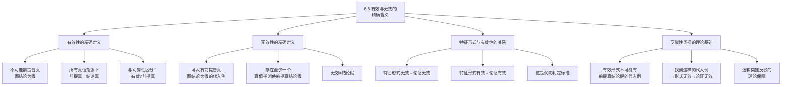

**相关笔记：** [[8.5 论证形式与运用逻辑类推进行的反驳]] | [[8.7 根据真值表验证论证：完备的真值表方法]]

> [!abstract] 概览
> 本节对"有效"（valid）和"无效"（invalid）这两个逻辑学核心概念给出精确的形式化定义，为后续的真值表检验方法奠定理论基础。核心知识点包括：
> - **有效性的精确定义**：==不可能==前提皆真而结论为假
> - **无效性的精确定义**：==可以有==前提皆真而结论为假的代入例
> - **特征形式与有效性的关系**：特征形式无效 → 论证无效；特征形式有效 → 论证有效
> - **反驳性类推的理论基础**：为什么构造一个前提真结论假的同形式论证就能证明原论证无效

---

## 一、知识结构总览

---

## 二、核心思想与证明技巧

> [!tip] 核心思想
> 有效性和无效性的精确含义是整个命题逻辑判定体系的基石。==有效性是一个"不可能性"概念——它断言某种情况（前提真而结论假）不可能发生==；无效性则是一个"可能性"概念——它只要求某种情况**有可能**发生。理解"不可能"和"可以有"这两个关键措辞的精确含义，是掌握逻辑判定方法的前提。

### 有效性的精确定义

> [!def] 定义：有效性（Valid）
> 一个论证形式是**有效的**（valid），当且仅当==不可能==出现所有前提为真而结论为假的情况。等价地说，在所有可能的真值指派下，如果所有前提都为真，则结论也必然为真。
>
> 形式化表述：论证形式 $P_1, P_2, \ldots, P_n, \therefore C$ 是有效的，当且仅当不存在任何一个真值指派 $v$，使得 $v(P_1) = T, v(P_2) = T, \ldots, v(P_n) = T$，而 $v(C) = F$。

**关键措辞解析：**

| 措辞 | 含义 | 常见误解 |
|:-----|:-----|:---------|
| "不可能" | 在**所有**真值指派下都不会发生 | 不是"在大多数情况下不会发生" |
| "前提皆真" | **所有**前提同时为真 | 不是"至少一个前提为真" |
| "结论为假" | 结论为假 | 不是"结论不为真"（在二值逻辑中等价） |

### 无效性的精确定义

> [!def] 定义：无效性（Invalid）
> 一个论证形式是**无效的**（invalid），当且仅当==可以有==前提皆真而结论为假的代入例。等价地说，存在至少一个真值指派，使得所有前提为真而结论为假。
>
> 形式化表述：论证形式 $P_1, P_2, \ldots, P_n, \therefore C$ 是无效的，当且仅当存在至少一个真值指派 $v$，使得 $v(P_1) = T, v(P_2) = T, \ldots, v(P_n) = T$，而 $v(C) = F$。

**关键措辞解析：**

| 措辞 | 含义 | 常见误解 |
|:-----|:-----|:---------|
| "可以有" | **至少存在一个**代入例满足条件 | 不是"所有代入例都满足条件" |
| "代入例" | 用具体陈述替换变元后得到的论证 | 不是"任意一个代入例" |

### 特征形式与有效性的关系

> [!tip] 核心定理
> 特征形式与论证有效性之间存在==双向判定关系==：
>
> 1. **如果论证的特征形式是无效的，则论证是无效的。**（因为无效形式可以有无效的代入例，而特征形式是最完整的结构抽象）
> 2. **如果论证的特征形式是有效的，则论证是有效的。**（因为有效形式的所有代入例都是有效的）
>
> 这意味着：==要判定一个论证是否有效，只需判定其特征形式是否有效==。这正是真值表方法的理论基础。

### 反驳性类推的理论基础

逻辑类推反驳法（[[8.5 论证形式与运用逻辑类推进行的反驳]]）的有效性现在可以得到精确的理论解释：

> [!tip] 为什么逻辑类推反驳有效？
> 1. 如果我们构造了一个与原论证具有**相同特征形式**的论证，且该论证的前提为真、结论为假
> 2. 这意味着该特征形式存在一个"前提真结论假"的代入例
> 3. 根据无效性的定义，==存在这样的代入例就说明该形式是无效的==
> 4. 根据特征形式与有效性的关系，==特征形式无效则论证无效==
> 5. 因此，原论证是无效的

---

## 三、补充理解与易混淆点

### 补充理解

> [!info] 补充1：有效性概念的哲学基础——Tarski 的逻辑后承理论
> **来源：** Tarski, A. (1936). "On the Concept of Logical Consequence", *Logic, Semantics, Metamathematics*, 2nd ed., Hackett, 1983, pp. 409-420.
>
> 塔斯基（Alfred Tarski）在1936年的经典论文中给出了"逻辑后承"（logical consequence）的精确语义定义，这是现代逻辑学中有效性概念的哲学基础。塔斯基的定义可以表述为：句子 $\varphi$ 是句子集 $\Gamma$ 的逻辑后承（记作 $\Gamma \models \varphi$），当且仅当==在每一个使得 $\Gamma$ 中所有句子都为真的解释（模型）中，$\varphi$ 也为真==。
>
> 这个定义与 Copi 的"不可能前提真而结论假"完全一致，但塔斯基的工作将其提升到了元逻辑的层面。塔斯基特别强调了两点：第一，"逻辑后承"是一个==语义概念==，它依赖于真值和解释的概念；第二，有效性是==形式性的==——它只依赖于表达式的逻辑形式，而非其内容。塔斯基的定义为后来的模型论奠定了基础，也直接支撑了本节中"特征形式有效→论证有效"的判定方法。

> [!info] 补充2："不可能"的逻辑含义——Copi 的符号逻辑阐释
> **来源：** Copi, I. M. (1954). *Symbolic Logic*, 1st ed. New York: Macmillan, §3.
>
> Copi 在其《符号逻辑》著作中对有效性定义中的"不可能"一词进行了深入的哲学分析。Copi 指出，这里的"不可能"不是物理意义上的不可能（如"一个人不可能同时出现在两个地方"），也不是技术意义上的不可能（如"用尺规不可能三等分任意角"），而是==逻辑意义上的不可能==——即"在所有逻辑可能的真值指派中都不会发生"。
>
> 在命题逻辑的框架下，"逻辑不可能"可以通过真值表来精确刻画：一个命题（或命题组合）是逻辑不可能的，当且仅当在真值表的所有行中，该命题（或命题组合）都取假值。因此，"不可能前提皆真而结论为假"等价于"在真值表中不存在任何一行使得所有前提为真而结论为假"。这正是完备真值表方法（[[8.7 根据真值表验证论证：完备的真值表方法]]）的理论基础——通过穷举所有可能的真值指派来检验"不可能性"。

### 易混淆点

> [!warning] 误区：有效 = 结论为真
> ❌ **错误理解：** 如果一个论证是有效的，那么它的结论一定是真的。
> ✅ **正确理解：** 有效性只保证==如果前提为真，结论不可能为假==。但前提本身可能为假，此时结论可以为假。例如，"如果猪会飞，那么 $1+1=3$。猪会飞。∴ $1+1=3$。"——这个论证是有效的（形式为 $p \supset q, p, \therefore q$），但结论为假（因为前提"猪会飞"为假）。
> **辨析：** 有效性是关于前提与结论之间**关系**的属性，而非关于结论**本身**的属性。要保证结论为真，需要论证==可靠==（有效 + 所有前提为真），而不仅仅是有效。参见 [[有效性-vs-可靠性]]。

> [!warning] 误区：无效 = 结论为假
> ❌ **错误理解：** 如果一个论证是无效的，那么它的结论一定是假的。
> ✅ **正确理解：** 无效只意味着==存在至少一个真值指派使得前提真而结论假==，但这并不意味着结论在所有情况下都为假。一个无效论证的结论完全可以为真——只是结论为真不是由前提逻辑地保证的。例如，"北京是中国的首都。∴ 雪是白色的。"——这个论证是无效的（前提与结论之间没有逻辑联系），但结论确实为真。
> **辨析：** 无效论证的结论可以为真（碰巧为真）、可以为假（因推理错误），也可以在某些情况下为真、某些情况下为假。无效性只告诉我们"前提真不能保证结论真"，而不对结论本身的真假做出任何断言。

---

## 四、习题精选

> [!todo] 习题概览
> | 题号 | 来源 | 核心考点 | 难度 |
> |:-----|:-----|:---------|:-----|
> | 1 | 自编 | 理解有效性的"不可能"含义 | ⭐⭐ |
> | 2 | 自编 | 区分有效性与结论真假 | ⭐⭐ |
> | 3 | 自编 | 运用特征形式判定有效性 | ⭐⭐⭐ |

### 题1：理解"不可能"的含义

> [!problem] 题目
> 以下论证是否有效？请根据有效性的精确定义进行判断，并说明理由。
>
> 论证A：如果天下雨，地面就会湿。天下雨。∴ 地面会湿。
>
> 论证B：如果天下雨，地面就会湿。地面湿了。∴ 天下雨了。

> [!faq]- 解答
> **[步骤1]** 提取论证A的特征形式：$p \supset q, \; p, \; \therefore q$
>
> **[步骤2]** 检验论证A的有效性：穷举所有真值指派——
>
> | $p$ | $q$ | $p \supset q$ | 判定 |
> |:----:|:----:|:----:|:-----|
> | T | T | T | 前提全T，结论T ✓ |
> | T | F | F | 前提2为T但前提1为F，不满足"前提皆真" |
> | F | T | T | 前提2为F，不满足"前提皆真" |
> | F | F | T | 前提2为F，不满足"前提皆真" |
>
> 在唯一一个前提皆真的行中（$p=T, q=T$），结论也为真。==不存在前提皆真而结论假的行==，因此论证A是==有效的==。
>
> **[步骤3]** 提取论证B的特征形式：$p \supset q, \; q, \; \therefore p$
>
> **[步骤4]** 检验论证B的有效性：——
>
> | $p$ | $q$ | $p \supset q$ | 判定 |
> |:----:|:----:|:----:|:-----|
> | T | T | T | 前提全T，结论T ✓ |
> | T | F | F | 前提1为F，不满足"前提皆真" |
> | F | T | T | ==前提全T，结论F ✗== |
> | F | F | T | 前提2为F，不满足"前提皆真" |
>
> 在第三行（$p=F, q=T$）中，前提皆真但结论为假。==存在前提皆真而结论假的行==，因此论证B是==无效的==。这就是"肯定后件谬误"。
>
> $\blacksquare$

### 题2：有效性与结论真假

> [!problem] 题目
> 判断以下论证的有效性，并说明结论的真假与有效性之间的关系。
>
> "如果 $2+2=5$，那么月亮是奶酪做的。$2+2=5$。∴ 月亮是奶酪做的。"

> [!faq]- 解答
> **[步骤1]** 提取特征形式：$p \supset q, \; p, \; \therefore q$
>
> **[步骤2]** 判定有效性：特征形式 $p \supset q, p, \therefore q$ 是==肯定前件式==（Modus Ponens），这是一个有效的论证形式。因此该论证是==有效的==。
>
> **[步骤3]** 分析前提和结论的真假：
> - 前提1"如果 $2+2=5$，那么月亮是奶酪做的"：前件为假，条件句为真（实质蕴涵的定义：$F \supset F = T$）
> - 前提2"$2+2=5$"：假
> - 结论"月亮是奶酪做的"：假
>
> **[步骤4]** 核心教训：
> - 该论证是==有效的==（形式正确），但==不可靠==（前提有假）
> - 结论为假，但这并不违反有效性——因为有效性只保证"前提真时结论不可能假"，而这里前提本身为假
> - ==有效论证的结论可以为假==（当有假前提时），这正是有效性与结论真假之间关系的核心要点
>
> $\blacksquare$

### 题3：特征形式与有效性判定

> [!problem] 题目
> 以下论证的特征形式是什么？它是有效的还是无效的？
>
> "如果一个人努力学习，他就能通过考试。如果一个人能通过考试，他就能毕业。∴ 如果一个人努力学习，他就能毕业。"

> [!faq]- 解答
> **[步骤1]** 识别简单陈述：
> - $p$：一个人努力学习
> - $q$：一个人能通过考试
> - $r$：一个人能毕业
>
> **[步骤2]** 提取特征形式：
> - 前提1：$p \supset q$
> - 前提2：$q \supset r$
> - 结论：$p \supset r$
>
> 特征形式：$p \supset q, \; q \supset r, \; \therefore p \supset r$
>
> **[步骤3]** 判定有效性：穷举所有真值指派——
>
> | $p$ | $q$ | $r$ | $p \supset q$ | $q \supset r$ | $p \supset r$ | 判定 |
> |:----:|:----:|:----:|:----:|:----:|:----:|:-----|
> | T | T | T | T | T | T | ✓ |
> | T | T | F | T | F | F | 前提2为F |
> | T | F | T | F | T | T | 前提1为F |
> | T | F | F | F | T | F | 前提1为F |
> | F | T | T | T | T | T | ✓ |
> | F | T | F | T | F | T | 前提2为F |
> | F | F | T | T | T | T | ✓ |
> | F | F | F | T | T | T | ✓ |
>
> 在所有前提皆真的行中（第1、5、7、8行），结论都为真。==不存在前提皆真而结论假的行==，因此该论证形式是==有效的==。
>
> **[步骤4]** 识别：这是==假言三段论==（Hypothetical Syllogism），是命题逻辑中最基本的有效论证形式之一。参见 [[假言三段论]]。
>
> $\blacksquare$

> [!tip] 解题思路提示
> 1. **判定有效性时**，始终牢记有效性的定义："不可能前提皆真而结论为假"——即穷举所有真值指派后，检查是否存在"前提全T结论F"的行
> 2. **区分有效性与结论真假**：有效性是关于推理形式的属性，结论真假是关于命题内容的属性，两者完全独立
> 3. **运用特征形式判定**：先提取特征形式，再检验该形式是否有效——这是系统化判定论证有效性的标准方法

---

## 五、视频学习指南

> [!info] 视频资源
> | 资源 | 链接 | 对应内容 | 备注 |
> |:-----|:-----|:---------|:-----|
> | Wireless Philosophy: Validity | [链接](https://www.youtube.com/watch?v=kKmOoY5QaTE) | 有效性概念详解 | 英文，配合1.6节一起看 |
> | Gary N. Curtis: Validity | [链接](https://www.fallacyfiles.org/glossary.html) | 有效性术语表 | 综合参考 |

---

## 六、教材原文

> [!quote] 教材原文
> **来源：** 逻辑学导论 第15版，第8章第6节
>
> **有效性的精确定义：**
> 一个论证形式是有效的，当且仅当它不可能有真前提和假结论。也就是说，在所有可能的真值指派下，如果所有前提都为真，则结论也必然为真。
>
> **无效性的精确定义：**
> 一个论证形式是无效的，当且仅当它至少有一个代入例具有真前提和假结论。也就是说，存在至少一个真值指派，使得所有前提为真而结论为假。
>
> **特征形式与有效性的关系：**
> 如果一个论证的特征形式是有效的，那么该论证就是有效的。如果一个论证的特征形式是无效的，那么该论证就是无效的。因此，要判定一个论证的有效性，只需判定其特征形式的有效性。
>
> **反驳性类推的理论基础：**
> 逻辑类推反驳法之所以有效，是因为：如果我们能构造一个与原论证具有相同特征形式的论证，且该论证有真前提和假结论，那么该特征形式就是无效的（因为它有一个前提真结论假的代入例），从而原论证也是无效的。

---

## 参见 Wiki

- [[有效性]] — 有效性的定义、七种真值组合与判定方法
- [[直言三段论]] — 三段论的形式有效性判定
- [[有效性-vs-可靠性]] — 有效性与可靠性的对比分析

#学习/逻辑学/命题逻辑Ⅰ
