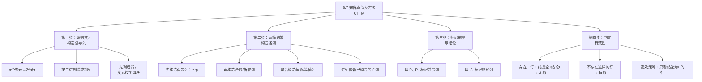

**相关笔记：** [[8.6 "无效"和"有效"的精确含义]] | [[8.8 一些常见的论证形式]]

> [!abstract] 概览
> 本节介绍命题逻辑中判定论证有效性的核心方法——**完备真值表方法**（Complete Truth-Table Method, CTTM）。这是一种机械化的、穷尽性的判定程序。核心知识点包括：
> - **引导列构造规则**：$n$ 个不同变元 → $2^n$ 行，按二进制递减排列
> - **从简到繁的列构造顺序**：先构造简单子列，再构造复合列
> - **标记与判定规则**：标记前提 $P_1, P_2, \ldots$ 和结论 $\therefore$，检查是否存在"前提全T结论F"的行
> - **高效策略**：只需关注结论为F的行，如果这些行中前提不全为T，则论证有效

---

## 一、知识结构总览

---

## 二、核心思想与证明技巧

> [!tip] 核心思想
> 完备真值表方法是一种==穷尽性判定程序==：它列举出所有可能的真值指派（即所有可能的"世界"），然后逐一检查在每一个"世界"中，如果前提都为真，结论是否也为真。如果在所有"世界"中，前提真都保证结论真，则论证有效；只要找到一个"世界"中前提真但结论假，论证就无效。这种方法是==判定性的==（decidable）——对于任何有限变元的论证，它总能在有限步骤内给出确定的答案。

### 第一步：构造引导列

> [!def] 定义：引导列
> **引导列**（guide columns）是真值表最左边的若干列，每列对应论证中的一个不同陈述变元。引导列列出了所有可能的真值组合。

**构造规则：**

1. **确定变元数量** $n$：识别论证形式中有多少个不同的陈述变元
2. **计算行数**：$2^n$ 行（每个变元有T/F两个取值，$n$ 个变元共有 $2^n$ 种组合）
3. **排列顺序**：按==二进制递减==排列
   - 第一个变元：前一半为T，后一半为F
   - 第二个变元：每四分之一交替
   - 第三个变元：每八分之一交替
   - 以此类推

**示例：3个变元 $p, q, r$ → $2^3 = 8$ 行**

| 行号 | $p$ | $q$ | $r$ |
|:----:|:---:|:---:|:---:|
| 1 | T | T | T |
| 2 | T | T | F |
| 3 | T | F | T |
| 4 | T | F | F |
| 5 | F | T | T |
| 6 | F | T | F |
| 7 | F | F | T |
| 8 | F | F | F |

> [!tip] 记忆技巧
> 引导列的排列规律：第一个变元"变化最慢"（一半T一半F），最后一个变元"变化最快"（逐行交替）。这恰好是==二进制数从 $2^n - 1$ 递减到 $0$ 的排列==。

### 第二步：从简到繁构造各列

> [!def] 构造原则
> 构造真值表列的顺序遵循==从简到繁==的原则：先构造只依赖于引导列的简单列（如否定列），再构造依赖于已构造列的复合列。==每一列只能依赖于其左边已经构造好的列==。

**典型构造顺序：**

1. **引导列**：$p, q, r$（最左边的变元列）
2. **否定列**：$\sim p, \sim q, \sim r$（只依赖于引导列）
3. **合取/析取列**：$p \cdot q, \; p \vee q$（依赖于引导列和/或否定列）
4. **蕴涵/等值列**：$p \supset q, \; p \equiv q$（依赖于前面的列）
5. **更复杂的复合列**：$(p \cdot q) \supset r$（依赖于合取列和引导列）

> [!warning] 注意
> 不要从左到右按论证中陈述的出现顺序构造列。正确的做法是==从简到繁==，先构造所有子列，再构造依赖子列的复合列。

### 第三步：标记前提与结论

- 在每个前提列的顶部标记 $P_1, P_2, P_3, \ldots$
- 在结论列的顶部标记 $\therefore$

### 第四步：判定有效性

> [!def] 判定规则
> - **无效**：如果真值表中==存在至少一行==，使得所有前提列（$P_1, P_2, \ldots$）都为T，而结论列（$\therefore$）为F
> - **有效**：如果真值表中==不存在==这样的行

> [!tip] 高效策略
> ==不需要检查每一行==。只需关注结论为F的行——如果结论为F的行中，至少有一行所有前提都为T，则论证无效；如果结论为F的行中，所有行的前提都不全为T（即至少有一个前提为F），则论证有效。这是因为：如果结论为T的行中前提也为T，这并不违反有效性（有效性只要求"前提真时结论不可能假"）。

### 完整示例

> [!example] 示例：验证肯定前件式
> 论证形式：$p \supset q, \; p, \; \therefore q$
>
> | 步骤 | $p$ | $q$ | $p \supset q$ | $p$ | $\therefore q$ |
> |:----:|:---:|:---:|:---:|:---:|:---:|
> | 1 | T | T | T | T | T |
> | 2 | T | F | F | T | F |
> | 3 | F | T | T | F | T |
> | 4 | F | F | T | F | F |
> | | 引导列 | 引导列 | $P_1$ | $P_2$ | C |
>
> - 第2行：$P_1 = F$，不满足"前提皆真"
> - 第4行：$P_2 = F$，不满足"前提皆真"
> - 第1行：前提全T，结论T ✓
> - 第3行：$P_2 = F$，不满足"前提皆真"
> - ==不存在前提皆真而结论假的行→论证有效==

---

## 三、补充理解与易混淆点

### 补充理解

> [!info] 补充1：Post 对真值表方法完备性的证明
> **来源：** Post, E. L. (1921). "Introduction to a General Theory of Elementary Propositions", *American Journal of Mathematics*, Vol. 43, No. 3, pp. 163-185.
>
> 埃米尔·波斯特（Emil Post）在1921年的博士论文中首次严格证明了真值表方法的==完备性==（completeness）和==可靠性==（soundness）。完备性意味着：如果一个论证形式是有效的（在所有模型中都保真），那么真值表方法一定能判定它为有效。可靠性意味着：如果真值表方法判定一个论证形式为有效，那么它确实是有效的。
>
> Post 的工作表明，真值表方法不仅仅是一种实用的检验工具，它具有坚实的数学基础。Post 还证明了：对于命题逻辑而言，==真值表方法是判定性的==（decidable）——对于任何有限变元的论证形式，总能在有限步骤内给出确定的判定结果。这一性质在更强大的逻辑系统（如一阶谓词逻辑）中不再成立——丘奇-图灵定理表明，一阶逻辑的有效性问题是不可判定的。

> [!info] 补充2：真值表与计算机科学——Shannon 的开关电路分析
> **来源：** Shannon, C. E. (1938). "A Symbolic Analysis of Relay and Switching Circuits", *Transactions of the American Institute of Electrical Engineers*, Vol. 57, pp. 713-723.
>
> 克劳德·香农（Claude Shannon）在其1938年的硕士论文中（后来发表为上述论文）开创性地将布尔代数和真值表方法应用于==继电器和开关电路的分析与设计==。香农证明了电路中的开关状态（开/关）可以完美地对应于命题逻辑中的真值（T/F），而电路的连接方式（串联/并联）可以对应于逻辑联结词（合取/析取）。
>
> 香农的工作使得真值表方法成为数字电路设计的核心工具：通过构造真值表，工程师可以系统地分析电路的功能，验证电路的正确性，并优化电路设计。这一工作被认为是==信息论和数字计算机科学的奠基性贡献之一==。今天，真值表方法仍然是计算机科学教育中的基础内容，也是数字逻辑设计、程序验证等领域的重要工具。

### 易混淆点

> [!warning] 误区：真值表的行数等于变元数
> ❌ **错误理解：** 3个变元的真值表有3行。
> ✅ **正确理解：** $n$ 个变元的真值表有 $2^n$ 行。3个变元有 $2^3 = 8$ 行，4个变元有 $2^4 = 16$ 行。行数随变元数==指数增长==，这也是完备真值表方法在变元较多时计算量急剧增加的原因。
> **辨析：** 行数 = $2^n$（每个变元2种取值，$n$ 个变元的所有组合），而非 $n$。当变元数为10时，行数已达到 $2^{10} = 1024$ 行。

> [!warning] 误区：构造真值表就是从左到右按顺序构造
> ❌ **错误理解：** 真值表的列应该按照论证中陈述的出现顺序从左到右构造。
> ✅ **正确理解：** 真值表的列应该==从简到繁==构造——先构造只依赖于引导列的简单列（如否定列），再构造依赖于已构造列的复合列。每一列的计算只能依赖于其左边已经构造完成的列。
> **辨析：** 例如，要构造 $(p \cdot q) \supset r$ 列，必须先构造 $p \cdot q$ 列（合取列），而合取列又依赖于引导列 $p$ 和 $q$。如果直接从左到右按论证顺序构造，可能会遇到"需要引用尚未构造的列"的情况。

---

## 四、习题精选

> [!todo] 习题概览
> | 题号 | 来源 | 核心考点 | 难度 |
> |:-----|:-----|:---------|:-----|
> | 1 | 自编 | 用完备真值表验证析取三段论 | ⭐⭐ |
> | 2 | 自编 | 用完备真值表验证否定后件谬误 | ⭐⭐⭐ |
> | 3 | 自编 | 运用高效策略快速判定 | ⭐⭐ |

### 题1：验证析取三段论

> [!problem] 题目
> 请用完备真值表方法验证以下论证形式的有效性：
>
> $$p \vee q, \quad \sim p, \quad \therefore q$$

> [!faq]- 解答
> **[步骤1]** 识别变元：$p, q$（2个变元 → $2^2 = 4$ 行）
>
> **[步骤2]** 构造引导列和否定列：
>
> | 行号 | $p$ | $q$ | $\sim p$ |
> |:----:|:---:|:---:|:---:|
> | 1 | T | T | F |
> | 2 | T | F | F |
> | 3 | F | T | T |
> | 4 | F | F | T |
>
> **[步骤3]** 构造析取列并标记前提与结论：
>
> | 行号 | $p$ | $q$ | $P_1: p \vee q$ | $P_2: \sim p$ | $\therefore q$ |
> |:----:|:---:|:---:|:---:|:---:|:---:|
> | 1 | T | T | T | F | T |
> | 2 | T | F | T | F | F |
> | 3 | F | T | T | T | T |
> | 4 | F | F | F | T | F |
>
> **[步骤4]** 判定：
> - 第1行：$P_2 = F$，不满足"前提皆真"
> - 第2行：$P_2 = F$，不满足"前提皆真"
> - 第3行：前提全T（$P_1 = T, P_2 = T$），结论T ✓
> - 第4行：$P_1 = F$，不满足"前提皆真"
>
> ==不存在前提皆真而结论假的行→论证有效==。这是==析取三段论==（Disjunctive Syllogism），参见 [[析取三段论]]。
>
> $\blacksquare$

### 题2：验证否定后件谬误

> [!problem] 题目
> 请用完备真值表方法验证以下论证形式的有效性：
>
> $$p \supset q, \quad q, \quad \therefore p$$

> [!faq]- 解答
> **[步骤1]** 识别变元：$p, q$（2个变元 → $2^2 = 4$ 行）
>
> **[步骤2]** 构造完整真值表：
>
> | 行号 | $p$ | $q$ | $P_1: p \supset q$ | $P_2: q$ | $\therefore p$ |
> |:----:|:---:|:---:|:---:|:---:|:---:|
> | 1 | T | T | T | T | T |
> | 2 | T | F | F | F | T |
> | 3 | F | T | T | T | ==F== |
> | 4 | F | F | T | F | F |
>
> **[步骤3]** 判定：
> - 第3行：$P_1 = T, P_2 = T$（前提皆真），但结论 $p = F$
> - ==存在前提皆真而结论假的行（第3行）→论证无效==
>
> **[步骤4]** 分析：这是==肯定后件谬误==（Affirming the Consequent）。第3行（$p = F, q = T$）是一个反例：即使"如果 $p$ 则 $q$"为真且 $q$ 为真，$p$ 也可能为假——因为 $q$ 为真可能是由其他原因导致的，而非由 $p$ 导致的。
>
> $\blacksquare$

### 题3：高效策略快速判定

> [!problem] 题目
> 请运用"只看结论为F的行"的高效策略，快速判定以下论证形式的有效性：
>
> $$p \supset (q \supset r), \quad p \supset q, \quad \therefore p \supset r$$

> [!faq]- 解答
> **[步骤1]** 识别变元：$p, q, r$（3个变元 → $2^3 = 8$ 行）
>
> **[步骤2]** 运用高效策略：结论为 $p \supset r$，结论为F的条件是 $p = T, r = F$。因此只需检查 $p = T, r = F$ 的行：
>
> - 第2行：$p = T, q = T, r = F$
>   - $P_1: p \supset (q \supset r) = T \supset (T \supset F) = T \supset F = F$
>   - $P_2: p \supset q = T \supset T = T$
>   - 前提不全为T（$P_1 = F$），不违反有效性
>
> - 第4行：$p = T, q = F, r = F$
>   - $P_1: p \supset (q \supset r) = T \supset (F \supset F) = T \supset T = T$
>   - $P_2: p \supset q = T \supset F = F$
>   - 前提不全为T（$P_2 = F$），不违反有效性
>
> **[步骤3]** 结论为F的行只有第2行和第4行，在这两行中前提都不全为T。因此==不存在前提皆真而结论假的行→论证有效==。
>
> **[步骤4]** 识别：这是==假言三段论的一种变体==。实际上，$p \supset (q \supset r)$ 逻辑等价于 $(p \cdot q) \supset r$，因此该论证等价于 $(p \cdot q) \supset r, \; p \supset q, \; \therefore p \supset r$。参见 [[假言三段论]]。
>
> $\blacksquare$

> [!tip] 解题思路提示
> 1. **构造引导列时**，先数清变元数量，按二进制递减排列，确保不遗漏任何真值组合
> 2. **构造复合列时**，严格遵循"从简到繁"的顺序——先构造所有子列，再构造依赖子列的复合列
> 3. **运用高效策略时**，先确定结论为F的条件，只检查这些行中前提是否全为T，可以大幅减少计算量

---

## 五、视频学习指南

> [!info] 视频资源
> | 资源 | 链接 | 对应内容 | 备注 |
> |:-----|:-----|:---------|:-----|
> | Wireless Philosophy: Truth Tables | [链接](https://www.youtube.com/watch?v=9gHBClbmGwI) | 真值表构造方法 | 英文，含完整示例 |
> | TrevTutor: Propositional Logic | [链接](https://www.youtube.com/watch?v=JV0JgEHtTlY) | 用真值表验证论证 | 英文，系列教程 |

---

## 六、教材原文

> [!quote] 教材原文
> **来源：** 逻辑学导论 第15版，第8章第7节
>
> **完备真值表方法：**
> 要检验一个论证形式的有效性，可以构造一个完备的真值表，列出所有可能的真值指派，然后检查是否存在一行使得所有前提为真而结论为假。如果存在这样的行，论证形式是无效的；如果不存在，论证形式是有效的。
>
> **引导列的构造：**
> 引导列列出了所有变元的所有可能的真值组合。n个变元需要2^n行。排列顺序按二进制递减。
>
> **列的构造顺序：**
> 从简到繁。先构造否定列，再构造合取和析取列，最后构造蕴涵和等值列。每一列只能依赖于其左边已经构造好的列。
>
> **判定规则：**
> 如果存在一行使得所有前提为真而结论为假，论证无效。如果不存在这样的行，论证有效。高效策略：只需关注结论为假的行。

---

## 参见 Wiki

- [[有效性]] — 有效性的定义与判定方法
- [[假言三段论]] — 假言三段论的形式与验证
- [[真值表]]：真值表的完整概念页
- [[析取三段论]] — 析取三段论的形式与验证

#学习/逻辑学/命题逻辑Ⅰ
