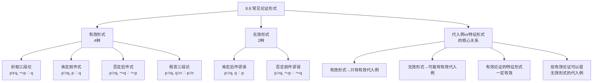

**相关笔记：** [[8.7 根据真值表验证论证：完备的真值表方法]] | [[8.9 陈述形式与实质等值]]

> [!abstract] 概览
> 本节系统梳理命题逻辑中最常见的六种论证形式——四种有效形式和两种无效形式。这些形式是日常推理和学术论证中反复出现的基本模式。核心知识点包括：
> - **有效形式（4种）**：析取三段论、肯定前件式（Modus Ponens）、否定后件式（Modus Tollens）、假言三段论
> - **无效形式（2种）**：肯定后件谬误（Fallacy of Affirming the Consequent）、否定前件谬误（Fallacy of Denying the Antecedent）
> - **代入例与特征形式的关系**：有效论证可以是无效形式的代入例，但==有效形式只能有有效的代入例==

---

## 一、知识结构总览

---

## 二、核心思想与证明技巧

> [!tip] 核心思想
> 掌握常见论证形式是提高逻辑分析能力的关键。==有效形式是"保真"的推理模式——只要前提为真，结论就不可能为假==；无效形式则不保真，即使前提全为真，结论也可能为假。特别需要注意的是：一个论证可能碰巧是有效的（前提真结论真），但其特征形式却是无效的——此时论证的有效性来自内容而非形式，不具有普遍性。

### 四种有效论证形式

#### 1. 析取三段论（Disjunctive Syllogism）

> [!def] 定义：析取三段论
> **析取三段论**（Disjunctive Syllogism, DS）的形式为：
> $$p \vee q, \quad \sim p, \quad \therefore q$$
>
> 直觉理解：如果两个选项中至少有一个为真（$p \vee q$），而其中一个为假（$\sim p$），那么另一个必定为真（$q$）。

**真值表验证：**

| $p$ | $q$ | $p \vee q$ | $\sim p$ | $\therefore q$ |
|:---:|:---:|:---:|:---:|:---:|
| T | T | T | F | T |
| T | F | T | F | F |
| F | T | T | T | T |
| F | F | F | T | F |

前提皆真的行只有第3行（$p=F, q=T$），结论为T。==有效==。参见 [[析取三段论]]。

#### 2. 肯定前件式（Modus Ponens）

> [!def] 定义：肯定前件式
> **肯定前件式**（Modus Ponens, MP）也称"肯定前件假言推理"，形式为：
> $$p \supset q, \quad p, \quad \therefore q$$
>
> 直觉理解：如果"如果 $p$ 则 $q$"为真，且 $p$ 确实为真，那么 $q$ 必定为真。

**真值表验证：**

| $p$ | $q$ | $p \supset q$ | $\therefore q$ |
|:---:|:---:|:---:|:---:|
| T | T | T | T |
| T | F | F | F |
| F | T | T | T |
| F | F | T | F |

前提皆真的行只有第1行（$p=T, q=T$），结论为T。==有效==。

#### 3. 否定后件式（Modus Tollens）

> [!def] 定义：否定后件式
> **否定后件式**（Modus Tollens, MT）也称"否定后件假言推理"，形式为：
> $$p \supset q, \quad \sim q, \quad \therefore \sim p$$
>
> 直觉理解：如果"如果 $p$ 则 $q$"为真，但 $q$ 为假，那么 $p$ 必定为假（因为如果 $p$ 为真，$q$ 就不可能为假）。

**真值表验证：**

| $p$ | $q$ | $p \supset q$ | $\sim q$ | $\therefore \sim p$ |
|:---:|:---:|:---:|:---:|:---:|
| T | T | T | F | F |
| T | F | F | T | F |
| F | T | T | F | T |
| F | F | T | T | T |

前提皆真的行只有第4行（$p=F, q=F$），结论 $\sim p = T$。==有效==。

#### 4. 假言三段论（Hypothetical Syllogism）

> [!def] 定义：假言三段论
> **假言三段论**（Hypothetical Syllogism, HS）也称"连锁假言推理"或"传递律"，形式为：
> $$p \supset q, \quad q \supset r, \quad \therefore p \supset r$$
>
> 直觉理解：如果 $p$ 蕴涵 $q$，且 $q$ 蕴涵 $r$，那么 $p$ 蕴涵 $r$。这是蕴涵关系的==传递性==。

**真值表验证（高效策略）：** 结论 $p \supset r$ 为F的条件是 $p=T, r=F$。只需检查 $p=T, r=F$ 的行：

| $p$ | $q$ | $r$ | $p \supset q$ | $q \supset r$ | $\therefore p \supset r$ |
|:---:|:---:|:---:|:---:|:---:|:---:|
| T | T | F | T | F | F |
| T | F | F | F | T | F |

- 第2行（$p=T, q=T, r=F$）：$P_2 = F$，前提不全为T
- 第4行（$p=T, q=F, r=F$）：$P_1 = F$，前提不全为T

==不存在前提皆真而结论假的行→有效==。参见 [[假言三段论]]。

### 两种无效论证形式

#### 5. 肯定后件谬误（Fallacy of Affirming the Consequent）

> [!def] 定义：肯定后件谬误
> **肯定后件谬误**（Fallacy of Affirming the Consequent）的形式为：
> $$p \supset q, \quad q, \quad \therefore p$$
>
> 直觉理解：从"如果 $p$ 则 $q$"和"$q$ 为真"推出"$p$ 为真"是错误的——$q$ 为真可能由其他原因导致，不一定是 $p$ 导致的。

**反例（第3行）：**

| $p$ | $q$ | $p \supset q$ | $q$ | $\therefore p$ |
|:---:|:---:|:---:|:---:|:---:|
| F | T | T | T | ==F== |

第3行：前提皆真（$p \supset q = T, q = T$），但结论 $p = F$。==无效==。

> [!example] 示例
> "如果下雨，地面会湿。地面湿了。∴ 下雨了。"——地面湿可能是因为洒水车、水管破裂等原因，不一定是因为下雨。这就是肯定后件谬误。

#### 6. 否定前件谬误（Fallacy of Denying the Antecedent）

> [!def] 定义：否定前件谬误
> **否定前件谬误**（Fallacy of Denying the Antecedent）的形式为：
> $$p \supset q, \quad \sim p, \quad \therefore \sim q$$
>
> 直觉理解：从"如果 $p$ 则 $q$"和"$p$ 为假"推出"$q$ 为假"是错误的——$q$ 可能在 $p$ 为假的情况下仍然为真（由其他原因导致）。

**反例（第3行）：**

| $p$ | $q$ | $p \supset q$ | $\sim p$ | $\therefore \sim q$ |
|:---:|:---:|:---:|:---:|:---:|
| F | T | T | T | ==F== |

第3行：前提皆真（$p \supset q = T, \sim p = T$），但结论 $\sim q = F$。==无效==。

> [!example] 示例
> "如果是鸟，就会飞。蝙蝠不是鸟。∴ 蝙蝠不会飞。"——蝙蝠虽然不是鸟，但蝙蝠确实会飞。这就是否定前件谬误。参见 [[三段论谬误]]。

### 代入例与特征形式的关系

> [!tip] 核心定理
> 理解代入例与特征形式的关系是避免混淆的关键：
>
> 1. ==有效形式的所有代入例都是有效的==——如果论证形式有效，那么无论用什么具体陈述替换变元，得到的论证都是有效的
> 2. ==无效形式可以有有效的代入例==——如果论证形式无效，某些代入例碰巧可能是有效的（前提真结论真），但这种有效性来自内容而非形式
> 3. ==有效论证的特征形式一定有效==——如果一个论证是有效的，那么揭示其完整逻辑结构的特征形式一定是有效的
> 4. ==有效论证可以是无效形式的代入例==——一个有效论证如果被抽象为一个比特征形式更粗略的形式，那个更粗略的形式可能是无效的

**关键区分表：**

| 陈述 | 正确性 | 说明 |
|:-----|:-------|:-----|
| 有效形式的所有代入例都有效 | ✅ 正确 | 有效形式保真 |
| 无效形式的所有代入例都无效 | ❌ 错误 | 无效形式可以有有效代入例 |
| 有效论证的特征形式一定有效 | ✅ 正确 | 特征形式完整揭示结构 |
| 有效论证的任何形式都有效 | ❌ 错误 | 比特征形式更粗略的形式可能无效 |

---

## 三、补充理解与易混淆点

### 补充理解

> [!info] 补充1：中世纪逻辑学家对有效形式的命名
> **来源：** Peter of Spain. (c. 1230). *Tractatus* (Summulae Logicales).
>
> 中世纪逻辑学家对许多常见的有效论证形式进行了系统命名，这些拉丁文名称至今仍在逻辑学中使用。西班牙的彼得（Peter of Spain，后来的教皇约翰二十一世）在其著作《逻辑纲要》中收录了这些名称。其中最重要的包括：
>
> - **Modus Ponens**（肯定前件式）：拉丁语意为"肯定的方式"，指通过肯定前件来肯定后件
> - **Modus Tollens**（否定后件式）：拉丁语意为"否定的方式"，指通过否定后件来否定前件
> - **Modus Tollendo Ponens**（析取三段论）：拉丁语意为"通过否定来肯定"，指通过否定析取式的一个支来肯定另一个支
> - **Modus Ponendo Tollens**：拉丁语意为"通过肯定来否定"，指通过肯定一个支来否定另一个支（适用于不相容析取）
>
> 这些中世纪命名不仅具有历史价值，而且在现代逻辑学教育和实践中仍然被广泛使用。它们简洁地概括了每种推理形式的操作方式，便于记忆和引用。

> [!info] 补充2：肯定后件谬误的认知心理学研究
> **来源：** Evans, J. St. B. T. (1982). *The Psychology of Deductive Reasoning*. London: Routledge & Kegan Paul.
>
> 认知心理学家约翰·埃文斯（Jonathan Evans）的研究表明，==肯定后件谬误是人类推理中最常见的系统性错误之一==。在实验中，即使受过逻辑训练的受试者，在面对肯定后件的结构时也经常错误地判定其为有效。
>
> 埃文斯提出了"信念偏见"（belief bias）理论来解释这一现象：人们在评估论证的有效性时，往往不自觉地受到论证**内容**的影响。如果论证的结论与受试者的既有信念一致，受试者就更倾向于判定论证为有效，即使其形式实际上是无效的。例如，"如果一个人是医生，那么他有医学知识。张三有医学知识。∴ 张三是医生。"——许多人会判定这个论证有效，因为结论"张三是医生"在直觉上是合理的，但论证的形式（肯定后件）实际上是无效的。
>
> 这一研究提醒我们：==判定论证的有效性必须基于形式而非内容==。这也是为什么学习形式逻辑如此重要——它为我们提供了一种超越直觉和信念偏见的、系统化的推理评估工具。

### 易混淆点

> [!warning] 误区：肯定前件式 = 否定后件式
> ❌ **错误理解：** 肯定前件式和否定后件式是同一种推理形式。
> ✅ **正确理解：** 它们是==两种不同的有效形式==，操作方式完全不同：
> - **肯定前件式**（MP）：$p \supset q, \; p, \; \therefore q$——通过==肯定前件==来肯定后件
> - **否定后件式**（MT）：$p \supset q, \; \sim q, \; \therefore \sim p$——通过==否定后件==来否定前件
>
> 两者的共同点：都从一个条件句和一个与条件句某一部分相关的陈述出发，推出关于另一部分的结论。但操作方向不同：MP 是"顺着"蕴涵方向推理（从前件到后件），MT 是"逆着"蕴涵方向推理（从后件的否定到前件的否定）。
> **辨析：** MP 和 MT 是一对"互补"的有效形式——MP 处理前件为真的情况，MT 处理后件为假的情况。与之对应的无效形式则分别是肯定后件谬误和否定前件谬误。

> [!warning] 误区：有效论证的特征形式一定有效，所以任何形式都有效
> ❌ **错误理解：** 如果一个论证是有效的，那么它的任何论证形式都是有效的。
> ✅ **正确理解：** ==有效论证的特征形式一定有效==，但有效论证可以被抽象为比特征形式更粗略的形式，那些更粗略的形式可能是无效的。例如，论证"如果天下雨，地面湿。天下雨。∴ 地面湿。"是有效的，其特征形式 $p \supset q, p, \therefore q$ 也是有效的。但如果将其抽象为 $p, q, \therefore r$（这不是特征形式），这个更粗略的形式是无效的。
> **辨析：** 关键在于区分"特征形式"（最完整地揭示逻辑结构的形式）和"任意形式"（可能丢失结构信息的更抽象的形式）。只有特征形式才能准确反映论证的有效性。同时要注意：==有效论证可以是无效形式的代入例==——这意味着有效性来自特征形式，而非来自更粗略的抽象形式。

---

## 四、习题精选

> [!todo] 习题概览
> | 题号 | 来源 | 核心考点 | 难度 |
> |:-----|:-----|:---------|:-----|
> | 1 | 自编 | 识别论证形式并判定有效性 | ⭐⭐ |
> | 2 | 自编 | 区分有效形式与无效形式 | ⭐⭐⭐ |
> | 3 | 自编 | 代入例与特征形式的关系 | ⭐⭐⭐ |

### 题1：识别论证形式

> [!problem] 题目
> 请识别以下论证的特征形式，并指出它属于本节介绍的哪种常见形式（如果属于的话）。
>
> (a) "如果气温降到零度以下，水管就会冻裂。气温没有降到零度以下。∴ 水管没有冻裂。"
>
> (b) "如果一个人是诚实的人，他就不会说谎。他说谎了。∴ 他不是诚实的人。"

> [!faq]- 解答
> **[步骤1]** 分析 (a)：
> - $p$：气温降到零度以下
> - $q$：水管会冻裂
> - 特征形式：$p \supset q, \; \sim p, \; \therefore \sim q$
> - 这是==否定前件谬误==（Fallacy of Denying the Antecedent），是一种==无效形式==
> - 反例：气温没有降到零度以下，但水管可能因为其他原因（如施工损坏、老化等）而冻裂
>
> **[步骤2]** 分析 (b)：
> - $p$：一个人是诚实的人
> - $q$：他不会说谎
> - 特征形式：$p \supset q, \; \sim q, \; \therefore \sim p$
> - 这是==否定后件式==（Modus Tollens），是一种==有效形式==
> - 验证：如果"诚实→不说谎"为真，而"他说谎了"（$\sim q$），那么"他不是诚实的人"（$\sim p$）必然为真
>
> $\blacksquare$

### 题2：区分有效形式与无效形式

> [!problem] 题目
> 以下四个论证中，哪些是有效的，哪些是无效的？请指出每种论证属于哪种常见形式。
>
> (a) $p \vee q, \; \sim q, \; \therefore p$
>
> (b) $p \supset q, \; p, \; \therefore q$
>
> (c) $p \supset q, \; \sim p, \; \therefore \sim q$
>
> (d) $p \supset q, \; \sim q, \; \therefore \sim p$

> [!faq]- 解答
> **[步骤1]** 分析各论证：
>
> | 论证 | 形式 | 常见名称 | 有效性 | 说明 |
> |:-----|:-----|:---------|:-------|:-----|
> | (a) | $p \vee q, \; \sim q, \; \therefore p$ | 析取三段论（变体） | ==有效== | 否定析取的一个支，肯定另一个支 |
> | (b) | $p \supset q, \; p, \; \therefore q$ | 肯定前件式（MP） | ==有效== | 肯定前件，推出后件 |
> | (c) | $p \supset q, \; \sim p, \; \therefore \sim q$ | 否定前件谬误 | ==无效== | 否定前件不能推出否定后件 |
> | (d) | $p \supset q, \; \sim q, \; \therefore \sim p$ | 否定后件式（MT） | ==有效== | 否定后件，推出否定前件 |
>
> **[步骤2]** 关键对比：
> - (b) vs (c)：同样是 $p \supset q$ 作为前提，(b) 肯定前件 $p$（有效），(c) 否定前件 $\sim p$（无效）
> - (c) vs (d)：同样是处理否定，(c) 否定前件（无效），(d) 否定后件（有效）
> - ==肯定前件和否定后件是有效的，否定前件和肯定后件是无效的==
>
> **[步骤3]** 记忆口诀：==前肯后否有效，前否后肯无效==（"前"指前件，"后"指后件；"肯"指肯定，"否"指否定）。
>
> $\blacksquare$

### 题3：代入例与特征形式的关系

> [!problem] 题目
> 考虑以下论证：
>
> "如果 $2+2=4$，那么雪是白色的。$2+2=4$。∴ 雪是白色的。"
>
> (a) 这个论证是有效的吗？
> (b) 它的特征形式是什么？该特征形式有效吗？
> (c) 它是否也是某个无效形式的代入例？如果是，是哪个？

> [!faq]- 解答
> **[步骤1]** 分析有效性：
> - 前提1"如果 $2+2=4$，那么雪是白色的"：前件为真，后件为真，条件句为真
> - 前提2"$2+2=4$"：真
> - 结论"雪是白色的"：真
> - 该论证是==有效的==（前提真结论真，且形式正确）
>
> **[步骤2]** 提取特征形式：
> - $p$：$2+2=4$
> - $q$：雪是白色的
> - 特征形式：$p \supset q, \; p, \; \therefore q$
> - 这是==肯定前件式（MP）==，==有效==
>
> **[步骤3]** 检查是否是无效形式的代入例：
> - 如果将论证抽象为 $p, q, \therefore r$（这不是特征形式），这个形式是==无效的==
> - 该论证确实是无效形式 $p, q, \therefore r$ 的代入例
> - 但这不影响论证的有效性——因为==有效论证可以是无效形式的代入例==（当该无效形式不是特征形式时）
>
> **[步骤4]** 核心教训：
> - 一个论证可以同时是有效形式（特征形式）和无效形式（更粗略形式）的代入例
> - 判定有效性的唯一标准是==特征形式==是否有效
> - 无效形式有有效代入例，这并不矛盾——因为无效形式只是"可以有"无效代入例，而非"只有"无效代入例
>
> $\blacksquare$

> [!tip] 解题思路提示
> 1. **识别论证形式时**，先提取特征形式（保留所有联结词），再与六种常见形式比对
> 2. **区分有效与无效形式时**，牢记"前肯后否有效，前否后肯无效"的口诀
> 3. **分析代入例与特征形式的关系时**，注意区分"特征形式"（决定有效性）和"更粗略的形式"（可能与有效性无关）

---

## 五、视频学习指南

> [!info] 视频资源
> | 资源 | 链接 | 对应内容 | 备注 |
> |:-----|:-----|:---------|:-----|
> | Wireless Philosophy: Modus Ponens | [链接](https://www.youtube.com/watch?v=2JgDBsAgRkE) | 肯定前件式与否定后件式 | 英文，含动画讲解 |
> | Wireless Philosophy: Logical Fallacies | [链接](https://www.youtube.com/watch?v=6A7iMYOq2hE) | 肯定后件谬误与否定前件谬误 | 英文，配合动画演示 |
> | Kevin deLaplante: Valid Arguments | [链接](https://www.youtube.com/watch?v=sG8Wb9K4sYk) | 有效论证形式总览 | 英文，系列教程 |

---

## 六、教材原文

> [!quote] 教材原文
> **来源：** 逻辑学导论 第15版，第8章第8节
>
> **有效论证形式：**
> - 析取三段论（Disjunctive Syllogism）：$p \vee q, \sim p, \therefore q$
> - 肯定前件式（Modus Ponens）：$p \supset q, p, \therefore q$
> - 否定后件式（Modus Tollens）：$p \supset q, \sim q, \therefore \sim p$
> - 假言三段论（Hypothetical Syllogism）：$p \supset q, q \supset r, \therefore p \supset r$
>
> **无效论证形式（形式谬误）：**
> - 肯定后件谬误（Affirming the Consequent）：$p \supset q, q, \therefore p$
> - 否定前件谬误（Denying the Antecedent）：$p \supset q, \sim p, \therefore \sim q$
>
> **代入例与特征形式：**
> 有效论证形式的所有代入例都是有效的。但无效论证形式不一定只有无效的代入例。有效论证的特征形式一定有效，但有效论证可以是无效形式的代入例（当该无效形式不是特征形式时）。

---

## 参见 Wiki

- [[假言三段论]] — 假言三段论的完整概念页
- [[析取三段论]] — 析取三段论的完整概念页
- [[有效性]] — 有效性的定义与判定方法
- [[三段论谬误]] — 三段论中常见的形式谬误

#学习/逻辑学/命题逻辑Ⅰ
