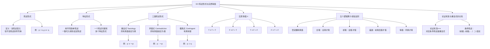

**相关笔记：** [[8.8 一些常见的论证形式]] | [[8.10 逻辑等价]]

> [!abstract] 概览
> 本节引入**陈述形式**（statement form）与**实质等值**（material equivalence）两个核心概念，并在此基础上对陈述形式进行三分类：**重言式**（tautology）、**矛盾式**（contradiction）和**偶真式**（contingent statement）。本节还阐述了论证有效性与重言式之间的深刻联系——一个论证是有效的，当且仅当其对应的条件陈述是一个重言式。核心知识点包括：
> - **陈述形式**：含陈述变元但不含陈述的符号串
> - **特征形式**：用不同简单陈述一致代入可得到给定陈述的形式
> - **三类陈述形式**：重言式（$p \lor \sim p$）、矛盾式（$p \cdot \sim p$）、偶真式（有真有假）
> - **实质等值**（$\equiv$）：两陈述真值相同则为真
> - **五个逻辑算子经验法则**与**论证有效 $\leftrightarrow$ 条件陈述为重言式**

---

## 一、知识结构总览

---

## 二、核心思想与证明技巧

### 陈述形式与特征形式

> [!def] 陈述形式（Statement Form）
> **陈述形式**是一个==含有陈述变元但不含有任何具体陈述==的符号串。陈述变元（如 $p, q, r$）是占位符，可以被任何简单陈述代入。例如，$p \supset q$、$p \lor \sim q$、$(p \cdot q) \supset r$ 都是陈述形式。

> [!def] 特征形式（Specific Form）
> 一个给定陈述的**特征形式**是指：==用不同的简单陈述一致地代入陈述变元后，能够得到该给定陈述的陈述形式==。所谓"一致代入"，是指同一个变元在形式中的所有出现位置都必须替换为同一个简单陈述。

> [!example] 示例
> 考虑陈述"如果天下雨，那么地会湿"（$R \supset W$）：
> - $p \supset q$ 是它的一个特征形式（用 $R$ 代入 $p$，用 $W$ 代入 $q$）
> - $p \supset (q \lor r)$ 也是它的一个特征形式（用 $R$ 代入 $p$，用 $W$ 代入 $q$，但 $r$ 未被使用——这不是一致代入的有效特征形式）
>
> 注意：一个陈述可以有多个特征形式，其中==最简洁的==（不含多余变元的）称为该陈述的特征形式。

### 三类陈述形式

> [!tip] 核心分类
> 根据在所有可能的真值指派下的表现，陈述形式被分为三类：

**1. 重言式（Tautology）**

> [!def] 重言式
> **重言式**是==在所有可能的真值指派下都为真==的陈述形式。无论其组成部分取什么真值，整个陈述形式始终为真。

经典例子：$p \lor \sim p$（排中律）

| $p$ | $\sim p$ | $p \lor \sim p$ |
|:---:|:---:|:---:|
| T | F | **T** |
| F | T | **T** |

**2. 矛盾式（Contradiction）**

> [!def] 矛盾式
> **矛盾式**是==在所有可能的真值指派下都为假==的陈述形式。无论其组成部分取什么真值，整个陈述形式始终为假。

经典例子：$p \cdot \sim p$（矛盾律的否定形式）

| $p$ | $\sim p$ | $p \cdot \sim p$ |
|:---:|:---:|:---:|
| T | F | **F** |
| F | T | **F** |

**3. 偶真式（Contingent Statement）**

> [!def] 偶真式
> **偶真式**是==在某些真值指派下为真、在另一些真值指派下为假==的陈述形式。偶真式的真值取决于其组成部分的具体真值。

经典例子：$p \supset q$

| $p$ | $q$ | $p \supset q$ |
|:---:|:---:|:---:|
| T | T | **T** |
| T | F | **F** |
| F | T | **T** |
| F | F | **T** |

### 实质等值（Material Equivalence）

> [!def] 实质等值
> **实质等值**用符号 $\equiv$ 表示，是一个二元真值函项联结词。$p \equiv q$ 为真，==当且仅当 $p$ 和 $q$ 具有相同的真值==。

实质等值的真值表：

| $p$ | $q$ | $p \equiv q$ |
|:---:|:---:|:---:|
| T | T | **T** |
| T | F | **F** |
| F | T | **F** |
| F | F | **T** |

记忆口诀：==同真同假则等值为真，一真一假则等值为假==。

### 五个逻辑算子经验法则

> [!tip] 五个逻辑算子的"经验法则"
> 在构造真值表时，以下经验法则可以快速判断复合陈述的真值：
>
> 1. **否定（$\sim$）**：==翻转真值==——真变假，假变真
> 2. **合取（$\cdot$）**：==全真才真==——只要有一个合取支为假，整个合取为假
> 3. **析取（$\lor$）**：==全假才假==——只要有一个析取支为真，整个析取为真
> 4. **蕴涵（$\supset$）**：==前真后假才假==——只有前件为真且后件为假时，蕴涵为假
> 5. **等值（$\equiv$）**：==同真才真==——两个部分真值相同时为真，不同时为假

### 论证有效性与重言式的关系

> [!tip] 核心定理：论证有效 ⟺ 条件陈述为重言式
> 这是本节最重要的理论结果。给定一个论证，将其所有前提的合取作为前件、结论作为后件，构造一个条件陈述：
>
> $$(\text{前提}_1 \cdot \text{前提}_2 \cdot \ldots \cdot \text{前提}_n) \supset \text{结论}$$
>
> 那么：==该论证是有效的，当且仅当这个条件陈述是一个重言式==。

> [!example] 验证实例
> 验证肯定前件式（Modus Ponens）的有效性：
>
> 前提1：$p \supset q$，前提2：$p$，结论：$q$
>
> 构造条件陈述：$[(p \supset q) \cdot p] \supset q$
>
> | $p$ | $q$ | $p \supset q$ | $(p \supset q) \cdot p$ | $[(p \supset q) \cdot p] \supset q$ |
> |:---:|:---:|:---:|:---:|:---:|
> | T | T | T | T | **T** |
> | T | F | F | F | **T** |
> | F | T | T | F | **T** |
> | F | F | T | F | **T** |
>
> 最后一列全为 T，因此条件陈述是重言式，肯定前件式是有效的。

---

## 三、补充理解与易混淆点

### 补充理解

> [!info] 补充1：Wittgenstein 论重言式与逻辑真理
> **来源：** Wittgenstein, L. (1921). *Tractatus Logico-Philosophicus*, 6.1.
>
> 维特根斯坦在《逻辑哲学论》中提出了关于重言式的深刻哲学分析。他认为，==重言式是"命题逻辑中的极限情况"==——它对世界什么也没有说，因为它不排除任何可能的事态。重言式的真值条件是穷尽的：在所有可能世界中都为真，因此它没有对现实做出任何实质性的断言。然而，维特根斯坦同时指出，重言式并非无意义的——它们展示了==逻辑命题的结构特征==，是逻辑真理的载体。正如他在 6.1 中所写："重言式所显示的是它被称为重言式——即语言的逻辑。"这一观点深刻影响了后来的逻辑经验主义运动，也解释了为什么重言式在逻辑系统中具有特殊地位：它们虽然不传递关于世界的经验信息，但却是所有有效推理的基石。

> [!info] 补充2：Peirce 论偶真陈述与经验科学
> **来源：** Peirce, C.S. (1878). "How to Make Our Ideas Clear", *Popular Science Monthly*, 12, 286-302.
>
> 皮尔士（Charles Sanders Peirce）在其经典论文中区分了逻辑真理与经验真理，这一区分与偶真式的概念密切相关。皮尔士认为，==偶真陈述的真值取决于事实，而非取决于逻辑形式==——它们的真或假不能仅凭逻辑分析确定，必须通过经验观察来判定。这一观点将偶真陈述与经验科学的研究对象联系起来：科学中的假说和理论都是偶真陈述，其真值需要通过实验和观察来检验。皮尔士进一步指出，偶真陈述的"偶然性"恰恰是科学探究的动力——如果所有陈述都是重言式（必然为真）或矛盾式（必然为假），那么科学探究就失去了意义。因此，==偶真陈述是经验科学和逻辑学之间的桥梁==：逻辑学告诉我们如何从已知推导未知，但"已知"本身的内容来自经验，这些经验内容都以偶真陈述的形式表达。

### 易混淆点

> [!warning] 误区：重言式 = 废话
> ❌ **错误理解：** 重言式在所有情况下都为真，因此它什么也没说，等同于"废话"（如"明天下雨或者不下雨"毫无信息量）。
> ✅ **正确理解：** 重言式确实是"空洞的"（vacuous）——它不传递关于世界的经验信息——但它是==逻辑真理的载体==，是所有有效推理的基石。重言式的价值不在于告诉我们世界"是什么"，而在于展示==命题之间的逻辑结构关系==。例如，$p \supset p$ 虽然看似"废话"，但它表达了同一律这一基本的逻辑原理。
> **辨析：** "废话"是一个日常语言中的贬义评价，而"重言式"是一个精确的逻辑概念。重言式在逻辑系统中具有不可替代的地位——没有重言式，就没有有效推理的标准。

> [!warning] 误区：实质等值 = 逻辑等价
> ❌ **错误理解：** 只要两个陈述在某个具体情况下具有相同的真值，就可以说它们是"等价的"，可以互相替换。
> ✅ **正确理解：** **实质等值**（material equivalence）只要求两个陈述在==当前特定真值指派下==具有相同的真值（$p \equiv q$ 为真当且仅当 $p$ 和 $q$ 同真或同假）。而**逻辑等价**（logical equivalence）是一个更强的概念——它要求两个陈述形式在==所有可能的真值指派下==都具有相同的真值，即 $p \equiv q$ 本身是一个重言式。只有逻辑等价的两个陈述才能在论证中安全地互相替换。
> **辨析：** 实质等值关注的是"这一次"两个陈述是否碰巧同真或同假；逻辑等价关注的是"每一次"两个陈述是否必然同真或同假。例如，"今天下雨"和"今天刮风"可能碰巧同时为真（实质等值为真），但它们显然不是逻辑等价的——在另一种情况下，可能下雨但不刮风。

---

## 四、习题精选

> [!todo] 习题概览
> | 题号 | 来源 | 核心考点 | 难度 |
> |:---:|:---|:---------|:---:|
> | 1 | 自编 | 判断陈述形式的类型（重言式/矛盾式/偶真式） | ⭐⭐ |
> | 2 | 自编 | 构造条件陈述并用真值表验证论证有效性 | ⭐⭐⭐ |
> | 3 | 自编 | 区分实质等值与逻辑等价 | ⭐⭐ |

### 题1：判断陈述形式的类型

> [!problem] 题目
> 用真值表判断以下陈述形式分别属于重言式、矛盾式还是偶真式：
>
> (a) $p \supset (p \lor q)$
>
> (b) $(p \cdot \sim p)$
>
> (c) $(p \supset q) \equiv (\sim q \supset \sim p)$

> [!faq]- 解答
> **(a) $p \supset (p \lor q)$**
>
> | $p$ | $q$ | $p \lor q$ | $p \supset (p \lor q)$ |
> |:---:|:---:|:---:|:---:|
> | T | T | T | **T** |
> | T | F | T | **T** |
> | F | T | T | **T** |
> | F | F | F | **T** |
>
> 最后一列全为 T，因此 $p \supset (p \lor q)$ 是==重言式==。
>
> **(b) $(p \cdot \sim p)$**
>
> | $p$ | $\sim p$ | $p \cdot \sim p$ |
> |:---:|:---:|:---:|
> | T | F | **F** |
> | F | T | **F** |
>
> 最后一列全为 F，因此 $p \cdot \sim p$ 是==矛盾式==。
>
> **(c) $(p \supset q) \equiv (\sim q \supset \sim p)$**
>
> | $p$ | $q$ | $p \supset q$ | $\sim q$ | $\sim p$ | $\sim q \supset \sim p$ | $(p \supset q) \equiv (\sim q \supset \sim p)$ |
> |:---:|:---:|:---:|:---:|:---:|:---:|:---:|
> | T | T | T | F | F | T | **T** |
> | T | F | F | T | F | F | **T** |
> | F | T | T | F | T | T | **T** |
> | F | F | T | T | T | T | **T** |
>
> 最后一列全为 T，因此 $(p \supset q) \equiv (\sim q \supset \sim p)$ 是==重言式==。这说明逆否命题与原命题是逻辑等价的。
>
> $\blacksquare$

> [!tip] 解题思路提示
> 1. 列出所有命题变元的全部真值组合（$n$ 个变元需要 $2^n$ 行）
> 2. 按照从简单到复杂的顺序逐步计算各列的真值
> 3. 检查最终结果列：全 T 为重言式，全 F 为矛盾式，有 T 有 F 为偶真式
> 4. 注意不要遗漏任何真值组合——这是最常见的错误

### 题2：用条件陈述验证论证有效性

> [!problem] 题目
> 以下论证是否有效？请通过构造对应的条件陈述并用真值表验证。
>
> 前提1：$p \supset q$
> 前提2：$\sim q$
> 结论：$\sim p$

> [!faq]- 解答
> **[步骤1]** 构造条件陈述：
>
> 将前提的合取作为前件，结论作为后件：
> $$[(p \supset q) \cdot \sim q] \supset \sim p$$
>
> **[步骤2]** 构造真值表：
>
> | $p$ | $q$ | $p \supset q$ | $\sim q$ | $(p \supset q) \cdot \sim q$ | $\sim p$ | $[(p \supset q) \cdot \sim q] \supset \sim p$ |
> |:---:|:---:|:---:|:---:|:---:|:---:|:---:|
> | T | T | T | F | F | F | **T** |
> | T | F | F | T | F | F | **T** |
> | F | T | T | F | F | T | **T** |
> | F | F | T | T | T | T | **T** |
>
> **[步骤3]** 判断：
>
> 最后一列全为 T，条件陈述是重言式，因此该论证是==有效的==。
>
> 这正是==否定后件式（Modus Tollens）==，是命题逻辑中最基本的有效论证形式之一。
>
> $\blacksquare$

> [!tip] 解题思路提示
> 1. 首先构造条件陈述：$(\text{前提}_1 \cdot \text{前提}_2 \cdot \ldots) \supset \text{结论}$
> 2. 列出所有变元的真值组合
> 3. 逐步计算各列真值，注意运算顺序（先括号内，再否定，再合取/析取，最后蕴涵）
> 4. 检查最终列是否全为 T——全 T 则论证有效，有任何 F 则论证无效

### 题3：区分实质等值与逻辑等价

> [!problem] 题目
> 设 $p$ 为真，$q$ 为真。判断以下各对陈述之间的实质等值是否成立，以及它们是否逻辑等价：
>
> (a) $p$ 和 $q$
>
> (b) $p \lor q$ 和 $p \cdot q$
>
> (c) $p \supset q$ 和 $\sim p \lor q$

> [!faq]- 解答
> **(a) $p$ 和 $q$**
>
> - 实质等值：$p \equiv q$ = T $\equiv$ T = **T**（成立）
> - 逻辑等价：$p \equiv q$ 不是重言式（当 $p$ 为 T、$q$ 为 F 时，$p \equiv q$ = F），因此 $p$ 和 $q$ **不是逻辑等价的**
>
> **(b) $p \lor q$ 和 $p \cdot q$**
>
> - 实质等值：$p \lor q$ = T $\lor$ T = T，$p \cdot q$ = T $\cdot$ T = T，$(p \lor q) \equiv (p \cdot q)$ = T $\equiv$ T = **T**（成立）
> - 逻辑等价：当 $p$ = T、$q$ = F 时，$p \lor q$ = T 但 $p \cdot q$ = F，此时等值为假，因此**不是逻辑等价的**
>
> **(c) $p \supset q$ 和 $\sim p \lor q$**
>
> - 实质等值：$p \supset q$ = T $\supset$ T = T，$\sim p \lor q$ = F $\lor$ T = T，$(p \supset q) \equiv (\sim p \lor q)$ = T $\equiv$ T = **T**（成立）
> - 逻辑等价：构造真值表验证：
>
> | $p$ | $q$ | $p \supset q$ | $\sim p$ | $\sim p \lor q$ | $(p \supset q) \equiv (\sim p \lor q)$ |
> |:---:|:---:|:---:|:---:|:---:|:---:|
> | T | T | T | F | T | **T** |
> | T | F | F | F | F | **T** |
> | F | T | T | T | T | **T** |
> | F | F | T | T | T | **T** |
>
> 最后一列全为 T，因此 $p \supset q$ 和 $\sim p \lor q$ 是==逻辑等价的==。这就是实质蕴涵的定义：$p \supset q \equiv \sim p \lor q$。
>
> $\blacksquare$

> [!tip] 解题思路提示
> 1. 实质等值只看当前真值指派下两个陈述是否同真或同假
> 2. 逻辑等价需要构造完整的真值表，检查所有真值组合下等值是否都为真
> 3. 如果两个陈述逻辑等价，则它们一定在当前指派下实质等值——但反之不成立
> 4. 记住：逻辑等价是实质等值的"强化版"

---

## 五、视频学习指南

> [!info] 视频资源
> | 资源名称 | 主题 | 语言 | 备注 |
> |:---|:---|:---:|:---|
> | Wireless Philosophy: Truth Tables | 真值表与陈述形式分类 | EN | 配合动画讲解 |
> | Crash Course Philosophy: Logical Operators | 五个逻辑算子的真值表 | EN | 适合入门 |
> | Michael Genesereth: Symbolic Logic | 重言式与论证有效性 | EN | 斯坦福大学课程 |

---

## 六、教材原文

> [!quote] 教材原文
> **来源：** 逻辑学导论 第15版，第8章第9节
>
> **陈述形式：** 含有陈述变元但不含陈述的符号串。陈述变元是占位符。特征形式是用不同简单陈述一致代入后得到给定陈述的形式。
>
> **三类陈述形式：** 重言式在所有真值组合下为真（如 $p \lor \sim p$）；矛盾式在所有真值组合下为假（如 $p \cdot \sim p$）；偶真式在某些组合下为真、在另一些组合下为假。
>
> **实质等值：** $p \equiv q$ 为真当且仅当 $p$ 和 $q$ 有相同真值。T≡T=T, F≡F=T, T≡F=F, F≡T=F。
>
> **五个逻辑算子经验法则：** 否定翻转真值；合取全真才真；析取全假才假；蕴涵前真后假才假；等值同真才真。
>
> **论证有效性与重言式：** 一个论证是有效的，当且仅当其对应条件陈述（前提合取蕴涵结论）是重言式。

---

## 参见 Wiki

- [[有效性]] — 论证有效性的定义，本节揭示了有效性与重言式之间的深刻联系
- [[假言三段论]] — 常见的有效论证形式，可通过条件陈述-重言式方法验证
- [[重言式与矛盾式]]：重言式与矛盾式的完整概念页
- [[析取三段论]] — 另一个基本的有效论证形式，同样可通过真值表验证

#学习/逻辑学/命题逻辑Ⅰ
