**相关笔记：** [[7.8 二难推论]] | [[9.1 有效性的形式证明|9.1 命题逻辑Ⅱ概览]]

> [!abstract] 概览
> 第8章是命题逻辑的入门篇章，系统引入了符号语言的构建方法与真值函项语义。全章从符号逻辑的历史渊源出发（[[8.1 现代逻辑及其符号语言]]），依次建立真值与真值函项性的核心概念（[[8.2 真值函项性：简单陈述与复合陈述]]），详解五种逻辑算子的真值表定义（[[8.3 合取、否定与析取]]、[[8.4 条件陈述与实质蕴涵]]），然后转向论证形式与有效性理论（[[8.5 论证形式与运用逻辑类推进行的反驳]]、[[8.6 "无效"和"有效"的精确含义]]），介绍完备真值表检验方法（[[8.7 根据真值表验证论证：完备的真值表方法]]），梳理六种常见论证形式（[[8.8 一些常见的论证形式]]），最后讨论陈述形式的分类与逻辑等价关系（[[8.9 陈述形式与实质等值]]、[[8.10 逻辑等价]]），并以三大思想法则收束全章（[[8.11 三大"思想法则"：逻辑的原理]]）。

---

## 一、全章知识框架

```mermaid
graph TB
    CH["第08章 命题逻辑Ⅰ"]

    CH --> S1["8.1 符号语言"]
    CH --> S2["8.2 真值函项性"]
    CH --> S3["8.3 合取/否定/析取"]
    CH --> S4["8.4 实质蕴涵"]
    CH --> S5["8.5 论证形式与逻辑类推"]
    CH --> S6["8.6 有效/无效的精确含义"]
    CH --> S7["8.7 真值表验证方法"]
    CH --> S8["8.8 常见论证形式"]
    CH --> S9["8.9 陈述形式与实质等值"]
    CH --> S10["8.10 逻辑等价"]
    CH --> S11["8.11 三大思想法则"]

    S1 --> S1a["历史脉络<br/>Leibniz→Boole→Frege→Russell"]
    S1 --> S1b["符号语言三大优势<br/>消除歧义·精确表达·机械检验"]
    S1 --> S1c["逻辑标点符号<br/>括号消除结构歧义"]

    S2 --> S2a["真值：T/F 二值"]
    S2 --> S2b["简单陈述 vs 复合陈述"]
    S2 --> S2c["真值函项性<br/>复合陈述真值由部分决定"]
    S2 --> S2d["五种逻辑算子<br/>· ∨ ⊃ ≡ ～"]

    S3 --> S3a["合取 · ：仅 T·T=T"]
    S3 --> S3b["否定 ～ ：真值反转"]
    S3 --> S3c["析取 ∨ ：仅 F∨F=F<br/>默认相容析取"]

    S4 --> S4a["蕴涵 ⊃ ：仅 T⊃F=F"]
    S4 --> S4b["前件/后件<br/>充分条件/必要条件"]
    S4 --> S4c["蕴涵悖论<br/>假前件蕴涵任何·真后件被任何蕴涵"]
    S4 --> S4d["三种等价形式<br/>p⊃q ≡ ～(p·～q) ≡ ～p∨q"]

    S5 --> S5a["论证形式与特征形式"]
    S5 --> S5b["代入例"]
    S5 --> S5c["逻辑类推反驳法<br/>同形式·前提真·结论假"]

    S6 --> S6a["有效：不可能前提真结论假"]
    S6 --> S6b["无效：可以有前提真结论假"]
    S6 --> S6c["特征形式双向判定"]

    S7 --> S7a["引导列：n变元→2^n行"]
    S7 --> S7b["从简到繁构造列"]
    S7 --> S7c["判定：存在前提全T结论F行→无效"]

    S8 --> S8a["有效×4<br/>DS·MP·MT·HS"]
    S8 --> S8b["无效×2<br/>肯定后件·否定前件"]

    S9 --> S9a["重言式·矛盾式·偶真式"]
    S9 --> S9b["实质等值 ≡<br/>同真同假则T"]
    S9 --> S9c["论证有效 ⟺ 条件陈述为重言式"]

    S10 --> S10a["逻辑等价 vs 实质等值"]
    S10 --> S10b["De Morgan 定律"]
    S10 --> S10c["双重否定律"]
    S10 --> S10d["蕴涵等价·双条件分解"]

    S11 --> S11a["同一原理 p⊃p"]
    S11 --> S11b["不矛盾原理 ～(p·～p)"]
    S11 --> S11c["排中原理 p∨～p"]
    S11 --> S11d["现代视角：系统假设<br/>非经典逻辑"]
```



---

## 二、核心知识点汇总

### 2.1 符号逻辑发展时间线

| 时期 | 人物 | 核心贡献 |
|:-----|:-----|:---------|
| 1666 | **Leibniz** | 提出"通用演算"与"通用特征"理想，设想机械化推理 |
| 1847-1854 | **Boole** | 将逻辑代数化，建立布尔代数，合取/析取/否定对应类的交/并/补 |
| 1847 | **De Morgan** | 提出 De Morgan 定律，开创关系逻辑研究 |
| 1879 | **Frege** | 发表《概念文字》，引入量词，建立第一个谓词逻辑形式系统，现代逻辑诞生 |
| 1910-1913 | **Russell & Whitehead** | 合著《数学原理》，系统化现代符号逻辑，试图将数学建立在逻辑基础上 |

### 2.2 五种逻辑算子真值表汇总

| 算子 | 符号 | 名称 | 元数 | 真值规则 | 口诀 |
|:----:|:----:|:-----|:----:|:---------|:-----|
| 合取 | $·$ | Conjunction | 二元 | 仅 T·T=T | ==全真才真== |
| 析取 | $∨$ | Disjunction | 二元 | 仅 F∨F=F | ==全假才假== |
| 蕴涵 | $⊃$ | Implication | 二元 | 仅 T⊃F=F | ==前真后假才假== |
| 等值 | $≡$ | Equivalence | 二元 | 同真同假=T | ==同真才真== |
| 否定 | $～$ | Negation | 一元 | 真值反转 | ==翻转真值== |

### 2.3 实质蕴涵的三种等价形式

$$p \supset q \;\equiv\; \sim(p \cdot \sim q) \;\equiv\; \sim p \lor q$$

> [!tip] 蕴涵悖论速记
> - **假前件蕴涵任何陈述**：$F \supset q = T$
> - **真后件被任何陈述蕴涵**：$p \supset T = T$
>
> 实质蕴涵是条件关系的==最小化真值函项刻画==，只关心"是否出现前件真而后件假"，不关心内容关联。

### 2.4 有效性定义

> [!def] 有效与无效
> - **有效**：==不可能==出现所有前提为真而结论为假的情况
> - **无效**：==可以有==前提皆真而结论为假的代入例（即存在至少一个真值指派使前提全T结论F）
>
> 特征形式与有效性之间存在==双向判定关系==：特征形式有效则论证有效，特征形式无效则论证无效。

### 2.5 完备真值表方法步骤

| 步骤 | 操作 | 要点 |
|:----:|:-----|:-----|
| 1 | 识别变元，构造引导列 | $n$ 个变元 → $2^n$ 行，按二进制递减排列 |
| 2 | 从简到繁构造各列 | 先否定列 → 合取/析取列 → 蕴涵/等值列 |
| 3 | 标记前提 $P_1, P_2, \ldots$ 与结论 $\therefore$ | 明确区分前提列与结论列 |
| 4 | 判定有效性 | 存在"前提全T结论F"行 → 无效；不存在 → 有效 |

> [!tip] 高效策略
> ==只需关注结论为F的行==。如果结论为F的行中前提都不全为T，则论证有效，无需检查结论为T的行。

### 2.6 六种常见论证形式

| 类型 | 名称 | 形式 | 有效性 | 记忆口诀 |
|:----:|:-----|:-----|:------:|:---------|
| 有效 | 析取三段论 DS | $p \lor q,\; \sim p,\; \therefore q$ | 有效 | 否定一支，肯定另一支 |
| 有效 | 肯定前件式 MP | $p \supset q,\; p,\; \therefore q$ | 有效 | 肯定前件 → 肯定后件 |
| 有效 | 否定后件式 MT | $p \supset q,\; \sim q,\; \therefore \sim p$ | 有效 | 否定后件 → 否定前件 |
| 有效 | 假言三段论 HS | $p \supset q,\; q \supset r,\; \therefore p \supset r$ | 有效 | 蕴涵的传递性 |
| 无效 | 肯定后件谬误 | $p \supset q,\; q,\; \therefore p$ | 无效 | 后件真不保证前件真 |
| 无效 | 否定前件谬误 | $p \supset q,\; \sim p,\; \therefore \sim q$ | 无效 | 前件假不保证后件假 |

> [!warning] 核心记忆法
> ==前肯后否有效，前否后肯无效==。肯定前件（MP）和否定后件（MT）是有效操作；否定前件和肯定后件是无效操作。

### 2.7 陈述形式三分类

| 类型 | 定义 | 经典例子 | 真值表特征 |
|:-----|:-----|:---------|:-----------|
| **重言式** Tautology | 所有真值指派下都为真 | $p \lor \sim p$（排中律） | 最后一列全T |
| **矛盾式** Contradiction | 所有真值指派下都为假 | $p \cdot \sim p$ | 最后一列全F |
| **偶真式** Contingent | 有真有假 | $p \supset q$ | 最后一列有T有F |

> [!def] 论证有效性的重言式判据
> 一个论证是有效的，==当且仅当==其对应的条件陈述 $(\text{前提}_1 \cdot \text{前提}_2 \cdot \ldots) \supset \text{结论}$ 是==重言式==。

### 2.8 逻辑等价关系表

| 等价关系 | 公式 | 名称 |
|:---------|:-----|:-----|
| 双重否定律 | $p \;\equiv\; \sim\sim p$ | 否定是可逆操作 |
| De Morgan 第一律 | $\sim(p \lor q) \;\equiv\; \sim p \cdot \sim q$ | 否定析取得合取 |
| De Morgan 第二律 | $\sim(p \cdot q) \;\equiv\; \sim p \lor \sim q$ | 否定合取得析取 |
| 实质蕴涵等价一 | $p \supset q \;\equiv\; \sim(p \cdot \sim q)$ | 蕴涵 = 并非前真后假 |
| 实质蕴涵等价二 | $p \supset q \;\equiv\; \sim p \lor q$ | 蕴涵 = 非前件或后件 |
| 双条件分解 | $p \equiv q \;\equiv\; (p \supset q) \cdot (q \supset p)$ | 双条件 = 双向蕴涵的合取 |
| 逆否等价 | $p \supset q \;\equiv\; \sim q \supset \sim p$ | 原命题等价于逆否命题 |

> [!tip] De Morgan 定律操作口诀
> ==否定号"穿入"括号时，$\lor$ 变 $·$，$·$ 变 $\lor$==。可推广到任意有限个陈述。

### 2.9 三大思想法则

| 原理 | 公式 | 含义 | 真值表 |
|:-----|:-----|:-----|:-------|
| 同一原理 | $p \supset p$ | 任何陈述蕴涵自身 | 全T（重言式） |
| 不矛盾原理 | $\sim(p \cdot \sim p)$ | 陈述不能同时为真又为假 | 全T（重言式） |
| 排中原理 | $p \lor \sim p$ | 陈述要么为真要么为假 | 全T（重言式） |

> [!info] 现代视角
> 三大原理在经典逻辑中是重言式，但它们不是"思想的绝对法则"，而是经典逻辑系统的==基本假设==。直觉主义逻辑拒斥排中律，量子逻辑拒斥分配律，多值逻辑引入第三种真值——不同逻辑系统可以选择不同的基本假设。

---

## 三、学习脉络

全章的学习遵循一条清晰的递进路径：

```
符号语言（为什么需要符号化）
    ↓
真值函项性（符号化的语义基础：真值与真值函项）
    ↓
五种算子（用符号精确表达逻辑关系）
    ↓
论证形式（从具体论证中提取逻辑结构）
    ↓
有效性定义（形式化判定"好推理"的标准）
    ↓
真值表检验（机械化的有效性判定方法）
    ↓
常见论证形式（识别日常推理中的有效/无效模式）
    ↓
陈述形式分类与逻辑等价（深化对逻辑结构的理解）
    ↓
三大思想法则（回溯到逻辑系统的公理基础）
```

> [!tip] 学习建议
> - **8.1-8.4** 是"语言层"：学会用符号表达命题和逻辑关系，==务必熟记五种算子的真值表==
> - **8.5-8.8** 是"推理层"：学会判定论证的有效性，==务必掌握四种有效形式和两种无效形式的区分==
> - **8.9-8.11** 是"元理论层"：理解逻辑系统的深层结构，==务必掌握逻辑等价关系和三大原理==

---

## 四、跨章关联

### 4.1 命题逻辑 vs 直言三段论（第6-7章）

| 维度 | 命题逻辑（第8章） | 直言三段论（第6-7章） |
|:-----|:------------------|:----------------------|
| 分析单位 | ==命题==（作为整体） | ==词项==（主项/谓项） |
| 核心工具 | 真值表、逻辑算子 | 文氏图、三段论规则 |
| 适用范围 | 处理命题间的真值函项关系 | 处理词项间的包含/排斥关系 |
| 判定方法 | 完备真值表（机械判定） | 规则检验 + 文氏图 |

> [!info] 互补关系
> 命题逻辑和三段论逻辑各自覆盖了不同类型的有效推理。有些论证在三段论逻辑中无法分析但在命题逻辑中可以（如假言三段论），反之亦然。第9-10章的谓词逻辑将统一这两种视角。

### 4.2 具体关联映射

| 第8章概念 | 关联章节 | 关联说明 |
|:----------|:---------|:---------|
| Modus Ponens（肯定前件式） | [[7.8 二难推论]] | 假言三段论是 MP 的链式推广 |
| Modus Tollens（否定后件式） | 第7章 假言三段论 | MT 是条件推理的基本有效形式 |
| 析取三段论 DS | 第7章 析取三段论 | 命题逻辑用真值表精确验证了第7章的直观规则 |
| De Morgan 定律 | [[5.4 质、量与周延性|换质换位]] | De Morgan 定律是换质换位操作的逻辑基础 |
| 三大思想法则 | [[1.1 什么是逻辑学|逻辑学基本概念]] | 同一律、矛盾律、排中律是第1章引入的逻辑学基本概念的精确化 |
| 实质蕴涵 | 第7章 条件陈述 | 第7章对条件陈述的日常分析在第8章获得了精确的真值表定义 |
| 有效性概念 | [[1.6 有效性与真实性|有效性与可靠性]] | 第8章给出了"不可能前提真结论假"的精确形式化定义 |

---

## 五、复习题

### 题1：符号化 → 真值表 → 判定有效性

> [!problem] 题目
> 给定以下论证：
>
> "如果公司盈利并且市场稳定，那么股价上涨。公司盈利。∴ 股价上涨。"
>
> (a) 将该论证符号化，写出其特征形式。
> (b) 构造完备真值表，判定该论证是否有效。
> (c) 如果无效，指出哪一行是反例；如果有效，说明它属于哪种常见论证形式。

> [!faq]- 解答
> **(a) 符号化与特征形式**
>
> 识别简单陈述：
> - $p$：公司盈利
> - $q$：市场稳定
> - $r$：股价上涨
>
> 特征形式：
> $$(p \cdot q) \supset r, \quad p, \quad \therefore r$$
>
> **(b) 完备真值表**
>
> | 行号 | $p$ | $q$ | $r$ | $p \cdot q$ | $P_1: (p \cdot q) \supset r$ | $P_2: p$ | $\therefore r$ |
> |:----:|:---:|:---:|:---:|:---:|:---:|:---:|:---:|
> | 1 | T | T | T | T | T | T | T |
> | 2 | T | T | F | T | ==F== | T | ==F== |
> | 3 | T | F | T | F | T | T | T |
> | 4 | T | F | F | F | T | T | F |
> | 5 | F | T | T | F | T | F | T |
> | 6 | F | T | F | F | T | F | F |
> | 7 | F | F | T | F | T | F | T |
> | 8 | F | F | F | F | T | F | F |
>
> **(c) 判定**
>
> 第2行：$P_1 = F$，不满足"前提皆真"。
> 第3行：$P_1 = T, P_2 = T$（前提皆真），结论 $r = T$ ✓
> 第4行：$P_1 = T, P_2 = T$（前提皆真），结论 $r = F$ ✗
>
> ==第4行是反例==：当 $p = T, q = F, r = F$ 时，前提皆真但结论为假。因此该论证是==无效的==。
>
> **错误分析**：原论证犯了类似于"否定前件谬误"的变体错误——$(p \cdot q) \supset r$ 只说明"盈利且稳定"足以使股价上涨，但前提只给出了"盈利"（缺少"市场稳定"），不能保证股价上涨。盈利但市场不稳定时，股价可能不涨。
>
> $\blacksquare$

### 题2：验证逻辑等价 → 运用等价关系化简

> [!problem] 题目
> 给定以下两个陈述形式：
>
> $S_1: \sim(p \supset q)$
>
> $S_2: p \cdot \sim q$
>
> (a) 用真值表验证 $S_1$ 和 $S_2$ 是否逻辑等价。
> (b) 如果等价，运用本章所学的等价关系，通过逐步推导（而非真值表）证明 $S_1 \equiv S_2$。
> (c) 用自然语言解释这个等价关系的含义。

> [!faq]- 解答
> **(a) 真值表验证**
>
> | $p$ | $q$ | $p \supset q$ | $S_1: \sim(p \supset q)$ | $\sim q$ | $S_2: p \cdot \sim q$ | $S_1 \equiv S_2$ |
> |:---:|:---:|:---:|:---:|:---:|:---:|:---:|
> | T | T | T | F | F | F | **T** |
> | T | F | F | ==T== | T | ==T== | **T** |
> | F | T | T | F | F | F | **T** |
> | F | F | T | F | T | F | **T** |
>
> 最后一列全为 T，因此 $S_1$ 和 $S_2$ 是==逻辑等价的==。
>
> **(b) 逐步推导证明**
>
> $$\sim(p \supset q)$$
>
> 第一步：运用实质蕴涵的等价定义 $p \supset q \equiv \sim p \lor q$，将蕴涵转换为析取：
> $$\equiv \sim(\sim p \lor q)$$
>
> 第二步：运用 De Morgan 第二定律 $\sim(A \lor B) \equiv \sim A \cdot \sim B$：
> $$\equiv \sim\sim p \cdot \sim q$$
>
> 第三步：运用双重否定律 $\sim\sim p \equiv p$：
> $$\equiv p \cdot \sim q$$
>
> 因此 $\sim(p \supset q) \equiv p \cdot \sim q$，证毕。
>
> **(c) 自然语言解释**
>
> "$\sim(p \supset q)$"的含义是"并非（如果 $p$ 则 $q$）"，即"如果 $p$ 则 $q$"这个条件陈述不成立。
>
> 根据实质蕴涵的定义，"如果 $p$ 则 $q$"为假当且仅当 $p$ 为真且 $q$ 为假。因此，"并非（如果 $p$ 则 $q$）"等价于"$p$ 为真且 $q$ 为假"，即 $p \cdot \sim q$。
>
> **直觉理解**：要反驳"如果下雨则地湿"，只需要指出一个具体情况——"下雨了但地没湿"（$p \cdot \sim q$）。这正是 $\sim(p \supset q) \equiv p \cdot \sim q$ 的日常含义。
>
> $\blacksquare$

---

## 六、笔记索引

| 节号 | 笔记标题 | 核心主题 | 关键概念 |
|:----:|:---------|:---------|:---------|
| 8.1 | [[8.1 现代逻辑及其符号语言]] | 符号逻辑的历史与动机 | Leibniz→Boole→Frege→Russell；符号语言三大优势；逻辑标点符号 |
| 8.2 | [[8.2 真值函项性：简单陈述与复合陈述]] | 真值函项语义基础 | 真值T/F；简单vs复合陈述；真值函项性；五种算子分类 |
| 8.3 | [[8.3 合取、否定与析取]] | 三种基本算子 | 合取 $·$（全真才真）；否定 $～$（翻转）；析取 $∨$（全假才假）；相容vs不相容析取 |
| 8.4 | [[8.4 条件陈述与实质蕴涵]] | 条件关系的真值函项刻画 | 蕴涵 $⊃$（前真后假才假）；前件/后件；充分/必要条件；蕴涵悖论 |
| 8.5 | [[8.5 论证形式与运用逻辑类推进行的反驳]] | 论证形式与反驳技术 | 论证形式；代入例；特征形式；逻辑类推反驳法 |
| 8.6 | [[8.6 "无效"和"有效"的精确含义]] | 有效性的形式化定义 | 有效：不可能前提真结论假；无效：可以有前提真结论假 |
| 8.7 | [[8.7 根据真值表验证论证：完备的真值表方法]] | 真值表检验方法 | 引导列；从简到繁；判定规则；高效策略 |
| 8.8 | [[8.8 一些常见的论证形式]] | 六种常见论证形式 | 有效×4（DS/MP/MT/HS）；无效×2（肯定后件/否定前件） |
| 8.9 | [[8.9 陈述形式与实质等值]] | 陈述形式分类与等值 | 重言式/矛盾式/偶真式；实质等值 $≡$；论证有效⟺条件陈述为重言式 |
| 8.10 | [[8.10 逻辑等价]] | 逻辑等价关系 | 逻辑等价vs实质等值；De Morgan；双重否定；蕴涵等价；双条件分解 |
| 8.11 | [[8.11 三大"思想法则"：逻辑的原理]] | 逻辑系统的公理基础 | 同一原理 $p⊃p$；不矛盾原理 $～(p·～p)$；排中原理 $p∨～p$；非经典逻辑 |

---

## 参见 Wiki

- [[有效性]] — 有效性的定义与判定方法
- [[假言三段论]] — 假言三段论的形式与验证
- [[析取三段论]] — 析取三段论的形式与验证
- [[直言三段论]] — 第6-7章的词项逻辑体系

#学习/逻辑学/第08章/章节汇总
