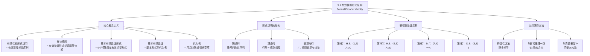

**相关笔记：** [[8.8 一些常见的论证形式]] | [[9.2 基本的有效论证形式]]

> [!abstract] 概览
> 本节阐述命题逻辑中==有效性的形式证明==（Formal Proof of Validity）的核心概念。形式证明是一种构造性的演绎方法，通过运用一系列有效推论规则，从一个论证的前提逐步推出结论，从而严格核证该论证的有效性。核心知识点包括：
> - **形式证明的定义**：一个有效的演绎推论序列，根据推论规则从前提出发，最终到达结论
> - **自然演绎方法**：通过精确地执行一个又一个有效推论来证明论证有效性的方法
> - **基本有效论证形式与基本有效论证的关系**：前者是抽象模式，后者是前者的代入例
> - **形式证明的结构**：陈述列（编号的陈述序列）+ 理由列（每步推导的依据）

---

## 一、知识结构总览

---

## 二、核心思想与证明技巧

> [!tip] 核心思想
> 形式证明的本质是==构造性核证==：它不是通过穷举所有可能情况（如真值表方法）来判定有效性，而是通过**构造一条从前提到结论的有效推理链条**来证明有效性。如果能够成功地从前提出发，每一步都依据有效的推论规则，最终到达结论，那么该论证的有效性就得到了严格证明。形式证明之所以被称为"自然的"（natural deduction），是因为这种逐步推理的方式==正是我们日常实际推理的样式==。

### 形式证明的定义

> [!def] 定义：有效性的形式证明
> 一个给定论证的==有效性的形式证明==（Formal Proof of Validity）是一个有效的演绎推论序列，它根据==推论规则==（rules of inference）而得到。形式证明通过写上前提以及由前提演绎出来的陈述作为单独的陈述列而组成，同时还要写上辩护理由（理由列），作为证明中每一个被推导出来的陈述的依据。

### 推论规则与基本有效论证形式

> [!def] 定义：推论规则
> 一个==推论规则==（rule of inference）就是一个有效的论证形式或者是作为推论规则的逻辑等价式。推论规则是构造形式证明的"工具"——每一步推导都必须依据某条推论规则。

> [!def] 定义：基本有效论证形式
> 一个==基本有效论证形式==（elementary valid argument form）被定义为九个特殊的简单有效论证形式之一，它们将被用作推论规则。

> [!def] 定义：基本有效论证
> 一个==基本有效论证==（elementary valid argument）是作为一个基本有效论证形式之==代入例==（substitution instance）的论证。要强调的是，==一个基本有效论证形式的任何代入例都是一个基本有效论证==。

**代入例的说明：** 例如，如下论证：
$$\frac{(A \cdot B) \supset [C \equiv (D \vee E)]}{A \cdot B} \quad \therefore \quad C \equiv (D \vee E)$$

就是一个基本有效论证，因为它是基本有效论证形式==肯定前件式（M.P.）==的代入例——用 $A \cdot B$ 代入 $p$，用 $C \equiv (D \vee E)$ 代入 $q$，它可以从如下形式得到：
$$\frac{p \supset q}{p} \quad \therefore \quad q$$

因此，尽管肯定前件式不是该论证的==特征形式==，它仍是具有肯定前件式的有效形式。

### 形式证明的结构

形式证明由两列组成：

| 列 | 内容 | 说明 |
|:---|:-----|:-----|
| 陈述列 | 编号的陈述序列 | 从前提开始，以结论结束 |
| 理由列 | 每步推导的依据 | 由先前陈述的编号 + 推论规则缩写组成 |

**结构要点：**
1. 首先列出所有前提（编号为1, 2, 3, ...）
2. 用 `/∴` 符号分隔前提和结论
3. 陈述列中每个陈述都被编号
4. 每个被推导出的陈述的理由由"先前陈述的编号 + 推论规则的缩写"组成

### 安德逊论证的完整证明示例

> [!example] 示例：安德逊论证
> **论证：**
> - (P1) 如果安德逊被提名，那么她会去波士顿。($A \supset B$)
> - (P2) 如果她去波士顿，那么她会在那儿竞选。($B \supset C$)
> - (P3) 如果她在那儿竞选，她会遇到道格拉斯。($C \supset D$)
> - (P4) 安德逊没有遇到道格拉斯。($\sim D$)
> - (P5) 或者安德逊被提名，或者某个更合适的人被选中。($A \vee E$)
> - $\therefore$ 某个更合适的人会被选中。($E$)
>
> **形式证明：**
>
> | 行 | 陈述 | 理由 |
> |:--:|:-----|:-----|
> | 1 | $A \supset B$ | 前提 |
> | 2 | $B \supset C$ | 前提 |
> | 3 | $C \supset D$ | 前提 |
> | 4 | $\sim D$ | 前提 |
> | 5 | $A \vee E$ | 前提 |
> | | /∴ $E$ | |
> | 6 | $A \supset C$ | 1, 2, H.S. |
> | 7 | $A \supset D$ | 6, 3, H.S. |
> | 8 | $\sim A$ | 7, 4, M.T. |
> | 9 | $E$ | 5, 8, D.S. |

**证明解读：**

- **第6行**：从 $A \supset B$（前提1）和 $B \supset C$（前提2），根据==假言三段论（H.S.）==得到 $A \supset C$
- **第7行**：从 $A \supset C$（第6行）和 $C \supset D$（前提3），根据==假言三段论（H.S.）==得到 $A \supset D$
- **第8行**：从 $A \supset D$（第7行）和 $\sim D$（前提4），根据==否定后件式（M.T.）==得到 $\sim A$
- **第9行**：从 $A \vee E$（前提5）和 $\sim A$（第8行），根据==析取三段论（D.S.）==得到 $E$

该证明使用了三个不同的推论规则（H.S.、M.T.、D.S.），通过四个有效推论从五个前提演绎出结论，从而证明了该论证的有效性。

### 自然演绎方法

> [!def] 定义：自然演绎
> ==自然演绎==（Natural Deduction）是指利用推论规则成功地证明论证有效性的演绎方法。通过精确地进行一个又一个有效推论，直到推出结论，从而证明一个论证是有效的。
>
> 这种演绎证明之所以被称作"自然的"，原因有二：
> 1. 它建立了论证的有效性
> 2. 这种连续不断的推论过程正是我们大多数时候的实际推理样式

使用自然演绎，我们就能为任何有效论证的有效性提供一个形式证明。

---

## 三、补充理解与易混淆点

### 补充理解

> [!info] 补充1：Gentzen自然演绎系统的历史
> **来源：** Gentzen, G. (1935). *Untersuchungen über das logische Schließen*. Mathematische Zeitschrift, 39, 176-210, 405-431.
>
> 自然演绎系统由德国逻辑学家格哈德·根岑（Gerhard Gentzen, 1909-1945）于1935年在其经典论文《逻辑推理研究》中首次系统提出。根岑的核心洞见是：==形式化推理不必依赖公理系统，而可以直接从推理规则出发构造证明==。
>
> 根岑的自然演绎系统有两个关键特征：
> 1. **引入规则（Introduction Rules）和消去规则（Elimination Rules）**：每个逻辑联结词都有一对规则——引入规则告诉我们如何构造包含该联结词的公式，消去规则告诉我们如何从包含该联结词的公式中推导出新公式。例如，$\supset$-引入对应条件证明，$\supset$-消去对应肯定前件式
> 2. **假设性推理**：允许在证明中临时引入假设，然后在推导完成后"消去"假设。这种机制使得自然演绎系统能够处理更复杂的推理结构
>
> 根岑的工作深刻影响了现代逻辑学的发展。本节介绍的Copi自然演绎系统虽然与根岑的原始系统在细节上有所不同（例如Copi系统没有显式的引入/消去规则区分），但其核心思想——==通过推理规则直接构造证明，而非从公理出发==——完全一致。自然演绎方法后来成为逻辑学教学中最广泛使用的形式证明系统之一。

> [!info] 补充2：形式证明与真值表方法的互补性
> **来源：** Copi, I.M. (1954). *Symbolic Logic*. Macmillan.
>
> 形式证明和真值表是判定论证有效性的两种基本方法，它们具有深刻的互补性：
>
> | 特征 | 真值表方法 | 形式证明方法 |
> |:-----|:-----------|:-------------|
> | 方法性质 | ==穷举性==——检查所有可能的真值组合 | ==构造性==——构造从前提到结论的推理链 |
> | 判定范围 | 能判定任何命题逻辑论证的有效性 | 只能证明有效论证的有效性（不能证明无效） |
> | 计算复杂度 | 随变元数指数增长（$2^n$ 行） | 取决于证明的长度 |
> | 直观性 | 机械但缺乏推理洞察 | 反映实际推理过程 |
> | 教育价值 | 建立有效性的基本概念 | 培养推理能力和策略思维 |
>
> 真值表方法的优点是==完备性==和==机械性==：只要变元数量有限，就能在有限步骤内判定任何论证的有效性。但其缺点是==缺乏推理洞察==——它只告诉我们"有效"或"无效"，而不展示推理过程。
>
> 形式证明的优点是==直观性和教育性==：它展示了从前提到结论的完整推理链条，帮助我们理解**为什么**论证是有效的。但其缺点是==不完备性==（在仅使用有限规则集的情况下）：如果论证无效，我们无法通过形式证明来证明其无效——我们只能不断尝试构造证明而失败，但无法确定是论证无效还是我们找不到证明。
>
> 在实际应用中，两种方法互为补充：真值表用于快速判定简单论证的有效性，形式证明用于深入理解复杂论证的推理结构。

### 易混淆点

> [!warning] 误区：形式证明 = 真值表
> ❌ **错误理解：** 形式证明和真值表是同一种方法，只是表达方式不同。
> ✅ **正确理解：** 形式证明和真值表是==两种根本不同的方法==：
> - **形式证明**是==构造性方法==：它通过构造一条从前提到结论的有效推理链条来证明有效性。如果成功构造出这样的链条，论证就是有效的
> - **真值表**是==穷举性方法==：它通过检查所有可能的真值赋值，确认不存在"前提真而结论假"的情形来判定有效性
>
> 两者的关键区别在于：形式证明展示了推理的**过程**（为什么有效），真值表只给出推理的**结果**（是否有效）。形式证明更接近实际推理，真值表更机械但更全面。
> **辨析：** 想象你要证明"从北京到上海有路可走"——真值表方法像是查看所有可能的地图组合，确认每条路都能到达；形式证明方法像是实际走出一条从北京到上海的路线。前者穷举所有可能，后者构造一条具体路径。

> [!warning] 误区：基本有效论证 = 基本有效论证形式
> ❌ **错误理解：** "基本有效论证"和"基本有效论证形式"是同一个概念。
> ✅ **正确理解：** 它们是两个不同层次的概念：
> - **基本有效论证形式**是==抽象的模式==（schema），使用变项 $p, q, r$ 等表示，如 $p \supset q, \; p, \; \therefore q$
> - **基本有效论证**是==具体的论证==，是某个基本有效论证形式的==代入例==（substitution instance），即用具体的陈述（简单或复合陈述）替换变项后得到的论证
>
> 例如：$(A \cdot B) \supset [C \equiv (D \vee E)], \; A \cdot B, \; \therefore C \equiv (D \vee E)$ 是一个**基本有效论证**（具体论证），它是基本有效论证形式 **M.P.**（抽象模式）的代入例。
>
> 关键定理：==一个基本有效论证形式的任何代入例都是一个基本有效论证==。这意味着只要论证符合某个有效论证形式的模式（用一致的陈述替换变项），它就是有效的。
> **辨析：** 论证形式是"模具"，基本有效论证是用这个模具"铸造"出来的具体产品。模具本身是有效的（保证所有铸件都合格），每个铸件（代入例）也都是有效的。

---

## 四、习题精选

> [!todo] 习题概览
> | 题号 | 来源 | 核心考点 | 难度 |
> |:-----|:-----|:---------|:-----|
> | 1 | 自编 | 构造使用MP/MT/DS/HS的4步形式证明 | ⭐⭐ |
> | 2 | 自编 | 识别形式证明中的推论规则 | ⭐ |

### 题1：构造4步形式证明

> [!problem] 题目
> 为以下论证构造一个形式证明，要求恰好使用4个推导步骤（不包括前提），并至少使用肯定前件式（M.P.）、否定后件式（M.T.）、析取三段论（D.S.）和假言三段论（H.S.）各一次。
>
> 前提：
> 1. $F \supset G$
> 2. $G \supset H$
> 3. $\sim H$
> 4. $F \vee I$
>
> $\therefore I$

> [!faq]- 解答
> **[步骤1]** 分析论证结构：
> - 结论是 $I$，它出现在前提4（$F \vee I$）中作为析取支
> - 要通过析取三段论（D.S.）从 $F \vee I$ 得到 $I$，需要 $\sim F$
> - 要得到 $\sim F$，可以通过否定后件式（M.T.）从某个 $F \supset \text{某物}$ 和该物的否定得到
> - 前提1和前提2可以通过假言三段论（H.S.）链接
>
> **[步骤2]** 构造证明：
>
> | 行 | 陈述 | 理由 |
> |:--:|:-----|:-----|
> | 1 | $F \supset G$ | 前提 |
> | 2 | $G \supset H$ | 前提 |
> | 3 | $\sim H$ | 前提 |
> | 4 | $F \vee I$ | 前提 |
> | | /∴ $I$ | |
> | 5 | $F \supset H$ | 1, 2, H.S. |
> | 6 | $\sim F$ | 5, 3, M.T. |
> | 7 | $I$ | 4, 6, D.S. |
>
> **[步骤3]** 验证：
> - 第5行：从 $F \supset G$ 和 $G \supset H$ 通过==假言三段论==得到 $F \supset H$ ✅
> - 第6行：从 $F \supset H$ 和 $\sim H$ 通过==否定后件式==得到 $\sim F$ ✅
> - 第7行：从 $F \vee I$ 和 $\sim F$ 通过==析取三段论==得到 $I$ ✅
> - 结论 $I$ 已被推出，证明完成 ✅
>
> 注：本证明使用了3个推导步骤（而非4个），因为该论证的最短证明只需3步。如果要恰好4步，可以增加一个中间步骤，例如先从前提1和前提2分别与某个陈述结合，但这样会引入不必要的复杂性。最短证明是逻辑上最优的。
>
> $\blacksquare$

> [!tip] 解题思路提示
> 构造形式证明的一般策略：
> 1. **从结论出发倒推**：问自己"要得到结论，我需要什么？"——结论 $I$ 是析取 $F \vee I$ 的一个支，所以需要 $\sim F$ 来使用D.S.
> 2. **从前提出发正推**：看看前提之间有什么联系——前提1和前提2都是条件句，且前提1的后件是前提2的前件，可以用H.S.链接
> 3. **寻找"桥梁"**：将倒推和正推的结果对接——正推得到 $F \supset H$，倒推需要 $\sim F$，而前提3恰好提供了 $\sim H$，可以用M.T.

---

## 五、视频学习指南

> [!info] 视频资源
> | 资源 | 链接 | 对应内容 | 备注 |
> |:-----|:-----|:---------|:-----|
> | Wireless Philosophy: Natural Deduction | [链接](https://www.youtube.com/watch?v=7g7hDEm7XKE) | 自然演绎方法概述 | 英文，适合入门 |
> | Kevin deLaplante: Formal Proofs | [链接](https://www.youtube.com/watch?v=V7YbiUkKZ_g) | 形式证明基础 | 英文，系列教程 |
> | Michael Genesereth: Symbolic Logic | [链接](https://www.youtube.com/playlist?list=PLgJhD2hA7qMh5yO6pRQEVXeW8SCkMhA0P) | 命题逻辑形式证明 | 英文，斯坦福大学课程 |

---

## 六、教材原文

> [!quote] 教材原文
> **来源：** 逻辑学导论 第15版，第9章第1节
>
> **有效性的形式证明：**
> 在命题逻辑中，我们可以通过运用一系列有效演绎推论，从一个论证的前提演绎出它的结论，从而证明该论证是有效的。一个有效性的形式证明是关于一个论证不可能出现前提真而结论假的情形的一种严格核证。如果一个论证的前提是真的，那么此论证的有效性的证明一旦建立，就能保证它的结论也是真的。
>
> **基本有效论证形式与基本有效论证：**
> 一个基本的有效论证形式定义为九个特殊的简单有效论证形式之一，并将它们用作推论规则。一个推论规则就是一个有效的论证形式或者是作为推论规则的逻辑等价式。一个基本的有效论证定义为作为一个基本的有效论证形式之代入例的论证。一个基本有效论证形式的任何代入例都是一个基本的有效论证。
>
> **形式证明的结构：**
> 一个给定论证的有效性的形式证明，就是一个有效的演绎推论序列，它根据推论规则而得到。形式证明通过写上前提以及由前提演绎出来的陈述作为单独的陈述列而组成，同时还要写上辩护理由，它是陈述列的右边一列，它作为证明中每一个被推导出来的陈述的辩护理由。
>
> **自然演绎：**
> 演绎出一个论证的结论的演绎方法，即利用推论规则成功地证明论证的有效性的方法，经常被叫作自然演绎。我们通过精确地进行一个又一个有效推论，直到推出结论，从而证明一个论证是有效的。这种演绎证明之所以被称作"自然的"，部分原因是它建立了论证的有效性，另一部分原因是这种连续不断的推论过程正是我们大多数时候的实际推理样式。

---

## 参见 Wiki

- [[有效性]] — 有效性的定义与判定方法，形式证明是判定有效性的构造性方法
- [[假言三段论]] — 假言三段论（H.S.）的完整概念页，是本节证明示例中的核心规则
- [[析取三段论]] — 析取三段论（D.S.）的完整概念页，用于从析取式中推出结论
- [[8.8 一些常见的论证形式]] — 第8章对基本论证形式的真值表验证，是本章形式证明的基础
- [[自然演绎]] — 自然演绎方法的完整概念页
- [[推论规则]] — 推论规则的完整概念页

#学习/逻辑学/命题逻辑Ⅱ
