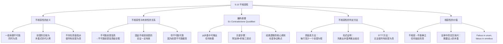

**相关笔记：** [[9.9 简化的真值表方法]] | [[9.11 条件证明]]

> [!abstract] 概览
> 本节探讨==不相容性==（Inconsistency）这一关键概念，揭示一个令人惊讶的逻辑事实：==如果一组前提互不相容，则任何结论都可以有效地从这些前提中推出==。核心知识点包括：
> - **不相容命题集的定义**：一组命题不可能同时为真
> - **不相容性与有效性的关系**：不相容前提使论证有效（但不可靠）
> - **Ex Contradictione Quodlibet**：从矛盾中可推出任何命题（==爆炸原理==）
> - **不相容性的判定方法**：真值表方法与形式证明方法
> - **相容性的价值**：为什么在推理和论证中相容性如此重要

---

## 一、知识结构总览

---

## 二、核心思想与证明技巧

> [!tip] 核心思想
> 不相容性是逻辑学中一个极为重要的概念。==一组命题是不相容的，当且仅当不存在任何真值指派能使它们同时为真==。不相容性的一个深刻推论是：任何具有不相容前提的论证都是有效的——因为既然前提不可能同时为真，自然也就不可能出现"前提皆真而结论为假"的情况。这意味着==从矛盾中可以推出任何命题==，这就是著名的"爆炸原理"（Ex Contradictione Quodlibet）。

### 不相容性的定义

> [!def] 定义：不相容性（Inconsistency）
> 一组命题 $\{P_1, P_2, \ldots, P_n\}$ 是==不相容的==（inconsistent），当且仅当==不存在==任何真值指派使得 $P_1, P_2, \ldots, P_n$ 同时为真。等价地说，这组命题的合取 $P_1 \cdot P_2 \cdot \ldots \cdot P_n$ 是一个==矛盾式==（contradiction）的代入例。

**形式化表述：** 命题集 $\Gamma$ 是不相容的，当且仅当不存在真值指派 $v$，使得对所有 $P \in \Gamma$，$v(P) = T$。

### 不相容性与有效性的关系

> [!tip] 核心定理：不相容前提使论证有效
> 如果一个论证的前提集是不相容的，则该论证==一定有效==。
>
> **证明逻辑：**
> 1. 有效性要求：不可能前提皆真而结论为假
> 2. 不相容意味着：不可能前提皆真
> 3. 既然前提不可能皆真，那么"前提皆真且结论为假"更不可能
> 4. 因此，论证是有效的
>
> 但请注意：这样的论证==不可能可靠==，因为可靠性还要求前提皆为真，而不相容的前提不可能都真。

### 爆炸原理的证明机制

> [!example] 爆炸原理的标准证明模式
> 给定矛盾前提 $S$ 和 $\sim S$，要推出任意结论 $M$：
>
> | 行号 | 陈述 | 理由 |
> |:----:|:-----|:-----|
> | 1 | $S$ | 前提 |
> | 2 | $\sim S$ | 前提 |
> | 3 | $S \lor M$ | 1, Add.（附加律） |
> | 4 | $M$ | 3, 2, D.S.（析取三段论） |
>
> **关键步骤解析：**
> - 第3行：利用==附加律==（Addition），从 $S$ 得到 $S \lor M$——将任意命题 $M$ 附加到已知为真的陈述上
> - 第4行：利用==析取三段论==（Disjunctive Syllogism），从 $S \lor M$ 和 $\sim S$ 得到 $M$——既然 $S$ 不成立（$\sim S$ 为真），$S \lor M$ 中的 $M$ 必须成立
>
> 这个证明模式表明：==只要有矛盾，任何命题都可以被推出==。

### 不相容性的判定方法

> [!tip] 判定不相容性的三种方法
> 1. **真值表方法**：构造完备真值表，检查是否存在一行使所有前提为真。如果不存在，则前提不相容。
> 2. **形式证明方法**：从前提出发，如果能推出形如 $q \cdot \sim q$ 的矛盾，则前提不相容。
> 3. **STTT方法**（[[9.9 简化的真值表方法]]）：尝试使所有前提为真，如果无法做到，则前提不相容。

### 一个经典的不相容论证示例

> [!example] 飞机降落论证
> | 行号 | 陈述 | 理由 |
> |:----:|:-----|:-----|
> | 1 | $A \supset B$ | 前提 |
> | 2 | $\sim A \supset C$ | 前提 |
> | 3 | $\sim(B \lor C)$ | 前提 |
> | / | $\therefore D$ | 结论 |
> | 4 | $\sim B \cdot \sim C$ | 3, De M. |
> | 5 | $\sim B$ | 4, Simp. |
> | 6 | $\sim A$ | 1, 5, M.T. |
> | 7 | $C$ | 2, 6, M.P. |
> | 8 | $\sim C \cdot \sim B$ | 4, Com. |
> | 9 | $\sim C$ | 8, Simp. |
> | 10 | $C \lor D$ | 7, Add. |
> | 11 | $D$ | 10, 9, D.S. |
>
> 第7行和第9行分别断言了 $C$ 和 $\sim C$，揭示了前提中的==不相容性==。一旦矛盾被明确表达，通过附加律和析取三段论就可以推出任何结论（这里是 $D$）。

---

## 三、补充理解与易混淆点

### 补充理解

> [!info] 补充1：爆炸原理（Ex Falso Quodlibet）在经典逻辑中的地位
> **来源：** Priest, G. (1979). "The Logic of Paradox", *Journal of Philosophical Logic*, Vol. 8, pp. 219-241.
>
> 爆炸原理（Ex Falso Quodlibet，意为"从虚假中可推出任何事物"），也称为 Ex Contradictione Sequitur Quodlibet（"从矛盾中可推出任何事物"），是==经典逻辑==的一个核心原则。该原理断言：从一组矛盾的前提中，可以有效地推出任何命题。形式化地说，如果 $\Gamma \vdash p$ 且 $\Gamma \vdash \sim p$，则对于任意命题 $q$，有 $\Gamma \vdash q$。
>
> Priest 在其"悖论逻辑"（Logic of Paradox）中对此原理提出了挑战。Priest 认为，某些真值间隙（truth-value gaps）或真值过剩（truth-value gluts）——即一个命题同时为真和为假——在自然语言和某些哲学论证中是真实存在的。如果接受真值过剩的可能性，那么爆炸原理就不再成立，因为并非所有矛盾都能推出任意命题。Priest 的==双面真理论==（Dialetheism）允许某些命题同时为真和为假，从而拒绝爆炸原理。这一争论在当代哲学逻辑中仍然是一个活跃的研究领域，涉及==相干逻辑==（Relevance Logic）和==次协调逻辑==（Paraconsistent Logic）等非经典逻辑系统。

> [!info] 补充2：相容性（Consistency）在公理化理论中的重要性
> **来源：** Godel, K. (1931). "Uber formal unentscheidbare Satze der Principia Mathematica und verwandter Systeme I", *Monatshefte fur Mathematik und Physik*, Vol. 38, pp. 173-198.
>
> 哥德尔（Kurt Godel）在1931年的不朽论文中证明了两个深刻的定理，其中第一个==不完备性定理==直接涉及相容性的概念。哥德尔证明了：任何包含基本算术的==相容的==形式系统都包含不可判定的命题——即在该系统中既不能被证明也不能被否证的命题。
>
> 这意味着==相容性==是形式系统的最基本要求之一。如果一个形式系统是不相容的，那么根据爆炸原理，该系统中的一切命题都可以被证明，这使得该系统变得毫无意义（trivial）。哥德尔的第二不完备性定理进一步表明：一个包含基本算术的相容形式系统==不能在其自身内部证明自身的相容性==。这一结果深刻地揭示了形式系统的内在局限性，也凸显了相容性概念在数学基础和逻辑哲学中的核心地位。在本节中，Copi 指出"不相容陈述意谓太多——在蕴涵任何东西这个意义上说，它们意谓着所有东西"，这与哥德尔的结果形成了深刻的呼应。

### 易混淆点

> [!warning] 误区：不相容的前提使论证有效 = 论证是好的论证
> ❌ **错误理解：** 如果一个论证是有效的，那么它就是一个好的论证，可以用来确立结论的真。
> ✅ **正确理解：** 不相容前提确实使论证==有效==（形式上正确），但该论证==不可能可靠==（因为前提不可能都真），因此==不能确立任何结论的真==。一个有效但不可靠的论证在认识论上毫无价值——它不能告诉我们关于世界的任何信息。
> **辨析：** 有效性只是论证质量的==必要条件==，而非==充分条件==。一个好的论证需要同时满足有效性和可靠性（所有前提为真）。不相容前提的论证虽然有效，但由于前提本身至少有一个为假，它不能为结论提供任何实质性的支持。正如 Copi 所指出的："如此贫乏的前提怎么能使它所属的论证有效呢？"——答案在于有效性只关心形式结构，不关心前提的实际真假。

> [!warning] 误区：不相容性 = 矛盾式
> ❌ **错误理解：** 不相容性和矛盾式是同一个概念。
> ✅ **正确理解：** ==不相容性是命题集的性质==，指的是一组命题不可能同时为真；而==矛盾式是单个陈述的性质==，指的是一个陈述在所有真值指派下都为假。虽然不相容命题集的合取是矛盾式的代入例，但这两个概念属于不同的逻辑层次。
> **辨析：**
> - **不相容性**：描述的是==多个命题之间的关系==。例如，$\{A, \sim A\}$ 是一个不相容的命题集。
> - **矛盾式**：描述的是==单个命题的真值性质==。例如，$A \cdot \sim A$ 是一个矛盾式。
> - 联系：命题集 $\{P_1, P_2, \ldots, P_n\}$ 是不相容的，当且仅当合取 $P_1 \cdot P_2 \cdot \ldots \cdot P_n$ 是矛盾式的代入例。参见 [[重言式与矛盾式]]。

---

## 四、习题精选

> [!todo] 习题概览
> | 题号 | 来源 | 核心考点 | 难度 |
> |:-----|:-----|:---------|:-----|
> | 1 | 自编 | 证明不相容前提集可以推出任意结论 | ⭐⭐⭐ |
> | 2 | 自编 | 判定命题集的不相容性 | ⭐⭐ |

### 题1：证明不相容前提集可以推出任意结论

> [!problem] 题目
> 给定以下不相容的前提集，请构造形式证明，证明可以推出任意结论 $Q$：
>
> 前提1：$P \supset R$
> 前提2：$R \supset \sim P$
> 前提3：$P$
>
> 结论：$Q$（任意命题）

> [!faq]- 解答
> **[步骤1]** 先证明前提集是不相容的——从前提中推出矛盾：
>
> | 行号 | 陈述 | 理由 |
> |:----:|:-----|:-----|
> | 1 | $P \supset R$ | 前提 |
> | 2 | $R \supset \sim P$ | 前提 |
> | 3 | $P$ | 前提 |
> | 4 | $R$ | 1, 3, M.P. |
> | 5 | $\sim P$ | 2, 4, M.P. |
>
> 第3行和第5行构成矛盾 $P \cdot \sim P$，证明前提集不相容。
>
> **[步骤2]** 利用爆炸原理推出任意结论 $Q$：
>
> | 行号 | 陈述 | 理由 |
> |:----:|:-----|:-----|
> | 6 | $P \lor Q$ | 3, Add. |
> | 7 | $Q$ | 6, 5, D.S. |
>
> **[步骤3]** 完整证明：
>
> | 行号 | 陈述 | 理由 |
> |:----:|:-----|:-----|
> | 1 | $P \supset R$ | 前提 |
> | 2 | $R \supset \sim P$ | 前提 |
> | 3 | $P$ | 前提 |
> | 4 | $R$ | 1, 3, M.P. |
> | 5 | $\sim P$ | 2, 4, M.P. |
> | 6 | $P \lor Q$ | 3, Add. |
> | 7 | $Q$ | 6, 5, D.S. |
>
> **核心机制：** 第4-5行揭示了前提中的矛盾（$R$ 和 $\sim P$，而由 $P$ 和 $P \supset R$ 可得 $R$，由 $R$ 和 $R \supset \sim P$ 可得 $\sim P$，但 $P$ 已被断言）。一旦得到矛盾，通过==附加律==（第6行）和==析取三段论==（第7行）就可以推出任何结论 $Q$。
>
> $\blacksquare$

### 题2：判定命题集的不相容性

> [!problem] 题目
> 判断以下命题集是否相容。如果是不相容的，请用形式证明说明。
>
> 命题集：$\{A \supset B, \; B \supset C, \; A, \; \sim C\}$

> [!faq]- 解答
> **[步骤1]** 尝试构造形式证明，看是否能推出矛盾：
>
> | 行号 | 陈述 | 理由 |
> |:----:|:-----|:-----|
> | 1 | $A \supset B$ | 前提 |
> | 2 | $B \supset C$ | 前提 |
> | 3 | $A$ | 前提 |
> | 4 | $\sim C$ | 前提 |
> | 5 | $B$ | 1, 3, M.P. |
> | 6 | $C$ | 2, 5, M.P. |
>
> **[步骤2]** 第4行得到 $\sim C$，第6行得到 $C$，构成矛盾 $C \cdot \sim C$。
>
> **[结论]** 该命题集是==不相容的==。从 $A$ 和 $A \supset B$ 可推出 $B$，从 $B$ 和 $B \supset C$ 可推出 $C$，但 $\sim C$ 已被断言。因此 $C$ 和 $\sim C$ 同时被推出，矛盾。
>
> **[补充]** 由于该命题集不相容，根据本节的核心定理，以该命题集为前提的任何论证都是有效的（尽管不可靠）。
>
> $\blacksquare$

> [!tip] 解题思路提示
> 1. **证明不相容前提集推出任意结论**：关键步骤是先从前提中推出矛盾（$q \cdot \sim q$），然后利用附加律（Add.）将想要的结论附加到矛盾的一边，再用析取三段论（D.S.）消去矛盾的另一边
> 2. **判定不相容性**：从前提出发进行推演，如果能推出 $p$ 和 $\sim p$，则前提集不相容。也可以用真值表方法：如果不存在任何一行使所有前提为真，则前提集不相容
> 3. **理解爆炸原理**：记住核心模式——矛盾 + 附加律 + 析取三段论 = 任意结论

---

## 五、视频学习指南

> [!info] 视频资源
> | 资源 | 链接 | 对应内容 | 备注 |
> |:-----|:-----|:---------|:-----|
> | Wireless Philosophy: Consistency | [链接](https://www.youtube.com/watch?v=FGn5Wm5aKMI) | 相容性概念 | 英文，基础概念讲解 |
> | Carneades.org: Explosion Principle | [链接](https://www.youtube.com/watch?v=XrNzE8GKYqo) | 爆炸原理详解 | 英文，配合本节理解 |

---

## 六、教材原文

> [!quote] 教材原文
> **来源：** 逻辑学导论 第15版，第9章第10节
>
> **不相容性与有效性：**
> "如果一个论证能够所有前提为真而结论为假，该论证就是无效的。相反，一个论证是有效的，就不可能出现前提皆真而结论为假。这就是'有效性'的定义，它也有一个怪异的推论：任何前提不相容的论证一定有效。"
>
> **爆炸原理：**
> "由此可见，如果一组前提不相容，这些前提就会有效地得出任何结论，而不论它们如何不相干。"
>
> **不相容性的后果：**
> "不相容陈述并不是'没有意义的'，它们的麻烦正好相反：其意谓太多。在蕴涵任何东西这个意义上说，它们意谓着所有东西。如果所有东西都被断言，那么被断言的有一半肯定是假的，因为每个陈述都有一个否定。"
>
> **古老难题的解答：**
> "一个不可抗拒的力量遇到一个不可移动的物体，会发生什么事？这个描述含有一个矛盾。给定这种不相容的前提，任何结论都可有效地推出。因此，对这一问题的正确回答是'任何事'！"

---

## 参见 Wiki

- [[有效性]] — 有效性的定义、不可能前提皆真而结论为假
- [[重言式与矛盾式]] — 矛盾式的定义与性质
- [[可靠性]] — 可靠性 = 有效性 + 所有前提为真
- [[不相容性]] — 不相容性的完整概念页

#学习/逻辑学/命题逻辑Ⅱ
