**相关笔记：** [[9.10 不相容性]] | [[9.12 间接证明]]

> [!abstract] 概览
> 本节介绍==条件证明==（Conditional Proof, C.P.）这一强大的证明技术。与19个推论规则不同，C.P.不是一条简单的推论规则，而是一种==通过假设前件、推导后件来证明条件陈述==的技术性方法。核心知识点包括：
> - **CP规则的核心机制**：假设 $p$ → 推导 $q$ → 消去假设得到 $p \supset q$
> - **CP的辩护**：通过==输出律==（Exportation）建立论证I与论证II的等价性
> - **CP的步骤**：假设、辖域线、推演、消去
> - **嵌套CP**：在一个条件证明内部嵌套另一个条件证明
> - **CP的扩展应用**：非条件结论、等值结论、重言式的证明

---

## 一、知识结构总览

```mermaid
graph TB
    A["9.11 条件证明"] --> B["CP的辩护与理论基础"]
    A --> C["CP的基本步骤"]
    A --> D["嵌套条件证明"]
    A --> E["CP的扩展应用"]
    A --> F["重言式的条件证明"]

    B --> B1["论证I: P ∴ A⊃C"]
    B --> B2["论证II: P, A ∴ C"]
    B --> B3["输出律建立等价性：<br/>P⊃(A⊃C) ≡ (P·A)⊃C"]
    B --> B4["证明论证II有效<br/>→论证I也有效"]

    C --> C1["假设结论的前件<br/>作为临时前提"]
    C --> C2["用垂直辖域线<br/>标记假设范围"]
    C --> C3["在辖域内用19个<br/>规则推演后件"]
    C --> C4["消去假设得到<br/>条件陈述p⊃q"]
    C --> C5["辖域内的陈述<br/>不能在域外使用"]

    D --> D1["外层CP假设A"]
    D --> D2["内层CP假设B"]
    D --> D3["每层CP有独立的<br/>辖域线和结论"]
    D --> D4["从内到外逐层消去假设"]

    E --> E1["析取结论：<br/>～A∨F ≡ A⊃F"]
    E --> E2["否定合取结论：<br/>～(A·～F) ≡ A⊃F"]
    E --> E3["等值结论：<br/>C≡G ≡ (C⊃G)·(G⊃C)"]

    F --> F1["无前提假设<br/>直接假设前件"]
    F --> F2["证明条件式<br/>重言式最有效的方法"]
    F --> F3["例如：(Q⊃R)⊃<br/>[(P⊃Q)⊃(P⊃R)]"]
```

---

## 二、核心思想与证明技巧

> [!tip] 核心思想
> 条件证明（C.P.）的核心思想是：==要证明一个条件陈述 $p \supset q$，只需假设 $p$ 为真，然后从前提和假设中推导出 $q$，最后消去假设，得到 $p \supset q$==。这种方法之所以有效，是因为它利用了输出律（Exportation）所建立的等价关系：$P \supset (A \supset C)$ 与 $(P \cdot A) \supset C$ 是逻辑等价的。C.P.不仅能大幅缩短证明的长度，还能使证明的思路更加自然和直观。

### CP规则的辩护

> [!tip] CP规则的逻辑辩护
> CP规则的合理性可以通过以下等价关系来建立：
>
> **论证I：** 前提 $P$，结论 $A \supset C$
>
> **论证II：** 前提 $P, A$，结论 $C$
>
> 论证I是有效的 $\iff$ 条件陈述 $P \supset (A \supset C)$ 是重言式。
>
> 根据==输出律==（Exportation），$P \supset (A \supset C) \equiv (P \cdot A) \supset C$。
>
> 而 $(P \cdot A) \supset C$ 是重言式 $\iff$ 论证II是有效的。
>
> 因此，论证I有效 $\iff$ 论证II有效。如果我们能证明论证II有效（即从 $P$ 和 $A$ 推出 $C$），也就证明了论证I有效（即从 $P$ 推出 $A \supset C$）。

### CP的基本步骤

> [!example] CP证明的标准格式
> 考虑论证：$(A \lor B) \supset (C \cdot D), \; (D \lor E) \supset F, \; \therefore A \supset F$
>
> | 行号 | 陈述 | 理由 |
> |:----:|:-----|:-----|
> | 1 | $(A \lor B) \supset (C \cdot D)$ | 前提 |
> | 2 | $(D \lor E) \supset F$ | 前提 |
> | / | $\therefore A \supset F$ | |
> | 3 | $\vert A$ | /$\therefore F$（假设，C.P.） |
> | 4 | $\vert A \lor B$ | 3, Add. |
> | 5 | $\vert C \cdot D$ | 1, 4, M.P. |
> | 6 | $\vert D \cdot C$ | 5, Com. |
> | 7 | $\vert D$ | 6, Simp. |
> | 8 | $\vert D \lor E$ | 7, Add. |
> | 9 | $\vert F$ | 2, 8, M.P. |
> | 10 | $A \supset F$ | 3-9, C.P. |
>
> **步骤解析：**
> 1. **假设**（第3行）：写下结论 $A \supset F$ 的前件 $A$，用垂直辖域线标记
> 2. **推演**（第4-9行）：在辖域内，仅使用19个推论规则从前提和假设中推导
> 3. **消去**（第10行）：当后件 $F$ 被推出后，终止辖域线，写出条件陈述 $A \supset F$
> 4. **理由标注**：在消去行写上"3-9, C.P."，表示第3到第9行构成了一个条件证明

### 辖域线的严格规则

> [!warning] 辖域线的关键规则
> ==条件证明中假设辖域内推出的陈述，不能在辖域外使用==。这是因为辖域内的陈述依赖于假设，而假设只是临时前提，不是真正的前提。
>
> 例如，在上面的证明中：
> - 第8行的 $D \lor E$ 是在假设 $A$ 的辖域内推出的
> - 如果在辖域外（第11行）写 $F$，理由为"2, 8, M.P."，这是==错误的==
> - 因为 $D \lor E$ 的推导依赖于假设 $A$，不能仅从前提中得出
>
> 但是，条件证明的==结论==（如第10行的 $A \supset F$）是在辖域外的，可以自由使用。

### 嵌套条件证明

> [!example] 嵌套CP示例
> 论证：$A \supset (B \supset C), \; B \supset (C \supset D), \; \therefore A \supset (B \supset D)$
>
> | 行号 | 陈述 | 理由 |
> |:----:|:-----|:-----|
> | 1 | $A \supset (B \supset C)$ | 前提 |
> | 2 | $B \supset (C \supset D)$ | 前提 |
> | / | $\therefore A \supset (B \supset D)$ | |
> | 3 | $\vert A$ | /$\therefore B \supset D$（A.C.P.） |
> | 4 | $\vert\vert B$ | /$\therefore D$（A.C.P.） |
> | 5 | $\vert\vert B \supset C$ | 1, 3, M.P. |
> | 6 | $\vert\vert C$ | 5, 4, M.P. |
> | 7 | $\vert\vert C \supset D$ | 2, 4, M.P. |
> | 8 | $\vert\vert D$ | 7, 6, M.P. |
> | 9 | $\vert B \supset D$ | 4-8, C.P. |
> | 10 | $A \supset (B \supset D)$ | 3-9, C.P. |
>
> **嵌套规则：**
> - 外层CP假设 $A$，目标是推出 $B \supset D$
> - 内层CP假设 $B$，目标是推出 $D$
> - 每层CP有自己的辖域线，内层在外层之内
> - 从内到外逐层消去假设

### CP在非条件结论论证中的应用

> [!tip] CP的扩展策略
> 当结论不是条件陈述时，可以利用逻辑等价将其转化为条件陈述，然后使用CP：
>
> | 原始结论 | 等价变换 | CP目标 |
> |:---------|:---------|:-------|
> | $\sim A \lor F$ | $\sim A \lor F \equiv A \supset F$（实质蕴涵律） | 假设 $A$，推出 $F$ |
> | $\sim(A \cdot \sim F)$ | $\sim(A \cdot \sim F) \equiv \sim A \lor F \equiv A \supset F$ | 假设 $A$，推出 $F$ |
> | $C \equiv G$ | $C \equiv G \equiv (C \supset G) \cdot (G \supset C)$ | 两个连续的CP |
>
> **等值结论的证明策略：** 先用一个CP证明 $C \supset G$，再用另一个CP证明 $G \supset C$，最后用合取律得到 $(C \supset G) \cdot (G \supset C)$，再据实质等值律得到 $C \equiv G$。

### 用CP证明重言式

> [!example] 用CP证明重言式
> 证明 $(Q \supset R) \supset [(P \supset Q) \supset (P \supset R)]$ 是重言式：
>
> | 行号 | 陈述 | 理由 |
> |:----:|:-----|:-----|
> | 1 | $\vert Q \supset R$ | /$\therefore (P \supset Q) \supset (P \supset R)$（A.C.P.） |
> | 2 | $\vert\vert P \supset Q$ | /$\therefore P \supset R$（A.C.P.） |
> | 3 | $\vert\vert\vert P$ | /$\therefore R$（A.C.P.） |
> | 4 | $\vert\vert\vert Q$ | 2, 3, M.P. |
> | 5 | $\vert\vert\vert R$ | 1, 4, M.P. |
> | 6 | $\vert\vert P \supset R$ | 3-5, C.P. |
> | 7 | $\vert (P \supset Q) \supset (P \supset R)$ | 2-6, C.P. |
> | 8 | $(Q \supset R) \supset [(P \supset Q) \supset (P \supset R)]$ | 1-7, C.P. |
>
> 这是==假言三段论==的重言式形式，用三重嵌套CP仅需8行即可证明。

---

## 三、补充理解与易混淆点

### 补充理解

> [!info] 补充1：条件证明与演绎定理的关系
> **来源：** Herbrand, J. (1930). "Recherches sur la theorie de la demonstration", *Comptes Rendus des Seances de l'Academie des Sciences*, Vol. 191, pp. 118-121.
>
> 埃尔布朗（Jacques Herbrand）在1930年的论文中首次明确表述了后来被称为"==演绎定理=="（Deduction Theorem）的重要元定理。演绎定理断言：如果 $\Gamma \cup \{A\} \vdash B$，则 $\Gamma \vdash A \supset B$。这恰好是条件证明规则的理论基础。
>
> 演绎定理在形式系统中的意义是深远的。它建立了一种==语法推演与逻辑蕴涵之间的桥梁==：如果在一个前提集中加入假设 $A$ 后可以推出 $B$，那么不加入 $A$ 也能推出 $A \supset B$。这意味着条件证明不仅仅是一种"技巧"，而是==演绎系统的内在结构性质==的体现。Copi 在本节中通过输出律对CP的辩护，本质上就是演绎定理在命题逻辑中的一个具体实例。Herbrand 的工作后来被赫尔伯特（Hilbert）和伯奈斯（Bernays）等人进一步发展，成为元逻辑理论的核心组成部分。

> [!info] 补充2：条件证明在直觉主义逻辑中的地位
> **来源：** Heyting, A. (1930). "Die formalen Regeln der intuitionistischen Logik", *Sitzungsberichte der Preussischen Akademie der Wissenschaften*, pp. 42-56.
>
> 海廷（Arend Heyting）在1930年建立了第一个完整的==直觉主义命题逻辑==的形式系统。在直觉主义逻辑中，条件证明（演绎定理）==完全成立==，但间接证明（归谬法）的适用范围受到了限制。
>
> 直觉主义逻辑拒绝==排中律==（$p \lor \sim p$）和==双重否定消去==（$\sim\sim p \supset p$），这意味着某些在经典逻辑中可以通过间接证明（IP）完成的证明，在直觉主义逻辑中无法完成。然而，条件证明在直觉主义逻辑中仍然完全有效——如果我们假设 $A$ 并推出了 $B$，我们就可以得到 $A \supset B$。这一事实凸显了CP与IP之间的一个重要区别：==CP比IP更"基础"==，它在更多的逻辑系统中成立。这也解释了为什么在 Copi 的系统中，IP可以从CP推导出来（即IP是冗余的），但CP不能从其他规则中推导出来。

### 易混淆点

> [!warning] 误区：CP假设辖域内的陈述可以在辖域外自由使用
> ❌ **错误理解：** 条件证明中假设辖域内推出的任何陈述都可以在证明的后续步骤中使用。
> ✅ **正确理解：** ==CP假设辖域内推出的陈述严格限于该CP子证明内部，不能在辖域线终止后使用==。只有CP的结论（即消去假设后得到的条件陈述）可以在辖域外使用。
> **辨析：** 辖域线的作用就是标记"临时前提"的有效范围。例如，假设 $A$ 后推出的 $D \lor E$ 依赖于假设 $A$，不能仅从原始前提中得出，因此不能在CP结束后使用。但CP的结论 $A \supset F$ 是仅从原始前提中得出的（不依赖于假设 $A$），可以在后续证明中自由使用。这一规则与编程语言中变量的作用域概念非常相似。

> [!warning] 误区：CP = 肯定前件式（Modus Ponens）
> ❌ **错误理解：** 条件证明就是肯定前件式，两者是同一回事。
> ✅ **正确理解：** ==CP是一种证明技术（策略），而肯定前件式（M.P.）是一条推论规则（工具）==。CP的目标是**构造**一个条件陈述 $p \supset q$，而M.P.是在已知 $p \supset q$ 和 $p$ 时**应用**来得到 $q$。
> **辨析：**
> - **CP**：回答"如何**证明** $p \supset q$？"——通过假设 $p$，推导 $q$
> - **M.P.**：回答"已知 $p \supset q$ 和 $p$，如何**得到** $q$？"——直接推出 $q$
> - CP的证明过程中**会使用**M.P.（如本节示例中多次使用M.P.），但CP本身不是M.P.
> - CP是一种"元级别"的技术，它改变了证明的结构（引入假设和辖域），而M.P.是在给定结构内的一步推理

---

## 四、习题精选

> [!todo] 习题概览
> | 题号 | 来源 | 核心考点 | 难度 |
> |:-----|:-----|:---------|:-----|
> | 1 | 自编 | 用CP证明论证有效性（含嵌套CP） | ⭐⭐⭐ |
> | 2 | 自编 | 用CP证明重言式 | ⭐⭐⭐ |

### 题1：用CP证明论证的有效性（含嵌套CP）

> [!problem] 题目
> 用条件证明方法证明以下论证的有效性：
>
> 前提1：$A \supset (B \supset C)$
> 前提2：$B \supset (C \supset D)$
> 结论：$A \supset (B \supset D)$

> [!faq]- 解答
> **[分析]** 结论是 $A \supset (B \supset D)$，这是一个嵌套的条件陈述。需要使用双重嵌套CP：外层假设 $A$ 推出 $B \supset D$，内层假设 $B$ 推出 $D$。
>
> | 行号 | 陈述 | 理由 |
> |:----:|:-----|:-----|
> | 1 | $A \supset (B \supset C)$ | 前提 |
> | 2 | $B \supset (C \supset D)$ | 前提 |
> | / | $\therefore A \supset (B \supset D)$ | |
> | 3 | $\vert A$ | /$\therefore B \supset D$（A.C.P.） |
> | 4 | $\vert\vert B$ | /$\therefore D$（A.C.P.） |
> | 5 | $\vert\vert B \supset C$ | 1, 3, M.P. |
> | 6 | $\vert\vert C$ | 5, 4, M.P. |
> | 7 | $\vert\vert C \supset D$ | 2, 4, M.P. |
> | 8 | $\vert\vert D$ | 7, 6, M.P. |
> | 9 | $\vert B \supset D$ | 4-8, C.P. |
> | 10 | $A \supset (B \supset D)$ | 3-9, C.P. |
>
> **证明解析：**
> - 外层CP（第3-9行）：假设 $A$，目标是 $B \supset D$
> - 内层CP（第4-8行）：假设 $B$，目标是 $D$
> - 第5行：从前提1和假设 $A$，通过M.P.得到 $B \supset C$
> - 第6行：从 $B \supset C$ 和假设 $B$，通过M.P.得到 $C$
> - 第7行：从前提2和假设 $B$，通过M.P.得到 $C \supset D$
> - 第8行：从 $C \supset D$ 和 $C$，通过M.P.得到 $D$
> - 第9行：消去内层假设，得到 $B \supset D$
> - 第10行：消去外层假设，得到最终结论 $A \supset (B \supset D)$
>
> $\blacksquare$

### 题2：用CP证明重言式

> [!problem] 题目
> 用条件证明方法证明以下陈述是重言式：
>
> $(W \supset X) \supset [(X \supset Y) \supset (W \supset Y)]$

> [!faq]- 解答
> **[分析]** 这是一个条件式的重言式，需要三重嵌套CP。整体结构为 $A \supset (B \supset (C \supset D))$，其中 $A = W \supset X$，$B = X \supset Y$，$C = W$，$D = Y$。
>
> | 行号 | 陈述 | 理由 |
> |:----:|:-----|:-----|
> | 1 | $\vert W \supset X$ | /$\therefore (X \supset Y) \supset (W \supset Y)$（A.C.P.） |
> | 2 | $\vert\vert X \supset Y$ | /$\therefore W \supset Y$（A.C.P.） |
> | 3 | $\vert\vert\vert W$ | /$\therefore Y$（A.C.P.） |
> | 4 | $\vert\vert\vert X$ | 1, 3, M.P. |
> | 5 | $\vert\vert\vert Y$ | 2, 4, M.P. |
> | 6 | $\vert\vert W \supset Y$ | 3-5, C.P. |
> | 7 | $\vert (X \supset Y) \supset (W \supset Y)$ | 2-6, C.P. |
> | 8 | $(W \supset X) \supset [(X \supset Y) \supset (W \supset Y)]$ | 1-7, C.P. |
>
> **证明解析：** 这是==假言三段论==（Hypothetical Syllogism）的重言式形式。通过三重嵌套CP，仅用8行就完成了证明。核心思路是：假设 $W \supset X$ 和 $X \supset Y$ 后，再假设 $W$，就可以通过两次M.P.（先得 $X$，再得 $Y$）推出 $Y$。
>
> $\blacksquare$

> [!tip] 解题思路提示
> 1. **识别CP的适用场景**：当结论（或目标陈述）是条件陈述时，优先考虑使用CP
> 2. **嵌套CP的策略**：对于嵌套的条件结论 $A \supset (B \supset C)$，从外到内逐层假设——先假设 $A$，再假设 $B$
> 3. **非条件结论的转化**：利用实质蕴涵律（Impl.）将析取和否定的合取转化为条件陈述，再使用CP
> 4. **重言式证明**：无前提时，直接假设整个条件陈述的前件，然后推导后件

---

## 五、视频学习指南

> [!info] 视频资源
> | 资源 | 链接 | 对应内容 | 备注 |
> |:-----|:-----|:---------|:-----|
> | Kevin deLaplante: Conditional Proof | [链接](https://www.youtube.com/watch?v=H0jQfCXJqGk) | 条件证明基础 | 英文，配合本节理解 |
> | Carneades.org: Conditional Proof | [链接](https://www.youtube.com/watch?v=H0jQfCXJqGk) | CP规则详解 | 英文，含多个示例 |

---

## 六、教材原文

> [!quote] 教材原文
> **来源：** 逻辑学导论 第15版，第9章第11节
>
> **条件证明的定义：**
> "条件证明(C.P.)不同于其他规则，它没有简单的公式，而是一种技术性的方法。我们可以通过假设条件陈述的前件，并从假设中推导出后件，从而得到一个条件陈述。"
>
> **CP的辩护：**
> "论证I是有效的当且仅当论证II是有效的。因此，我们可以通过在论证I的前提中加入A，然后通过19个推论规则推导出一系列的陈述来推演C。以这种方式，我们证明了论证II的有效性，从而也就证明了论证I的有效性。"
>
> **辖域线的规则：**
> "为条件证明而引入的假设的辖域是有穷的。在条件证明(C.P.)的整个过程中，在假设辖域内做出的推论仅限于该C.P.子证明，不能在条件证明范围之外使用。"
>
> **CP的优势：**
> "条件证明的步骤是自然的，容易掌握和展现出来。条件证明并不能取代这19个规则，但掌握条件证明之后，它将是对逻辑工具强有力的补充。"

---

## 参见 Wiki

- [[有效性]] — 有效性的定义与判定
- [[实质蕴涵]] — 实质蕴涵律，CP等价变换的基础
- [[重言式与矛盾式]] — 用CP证明重言式
- [[条件证明]] — 条件证明的完整概念页

#学习/逻辑学/命题逻辑Ⅱ
