**相关笔记：** [[9.11 条件证明]] | [[9.13 可靠性论证与笃证性论证的辨别]]

> [!abstract] 概览
> 本节介绍==间接证明==（Indirect Proof, I.P.），也称==归谬法==（Reductio ad Absurdum）。间接证明通过假设结论的否定，推导出矛盾，从而确立结论的真。核心知识点包括：
> - **IP规则的核心机制**：假设 $\sim p$ → 推导矛盾 $q \cdot \sim q$ → 消去假设得到 $p$
> - **IP的辩护**：三种情形下IP都能证明论证的有效性
> - **IP与CP的关系**：IP可以从CP推导出来，因此IP是==冗余的==
> - **嵌套IP**：在CP或另一个IP内部嵌入间接子证明
> - **用IP证明重言式**：假设重言式的否定，推出矛盾
> - **IP vs CP的选择策略**：条件式重言式用CP更高效，其他情形用IP更简洁

---

## 一、知识结构总览

```mermaid
graph TB
    A["9.12 间接证明"] --> B["IP的辩护与理论基础"]
    A --> C["IP的基本步骤"]
    A --> D["IP的三种有效情形"]
    A --> E["嵌套间接证明"]
    A --> F["IP的冗余性"]
    A --> G["重言式的证明策略"]

    B --> B1["假设结论的否定～C"]
    B --> B2["从前提+假设推出矛盾<br/>q·～q"]
    B --> B3["消去假设得到结论C"]
    B --> B4["也叫归谬法<br/>Reductio ad Absurdum"]

    C --> C1["写下结论的否定<br/>作为IP假设"]
    C --> C2["用垂直辖域线<br/>标记假设范围"]
    C --> C3["在辖域内推导<br/>明确的矛盾"]
    C --> C4["消去假设得到<br/>想要的结论"]

    D --> D1["情形A：相容前提+偶真结论<br/>假设与前提矛盾"]
    D --> D2["情形B：相容前提+重言结论<br/>假设本身是矛盾式"]
    D --> D3["情形C：不相容前提<br/>前提本身包含矛盾"]

    E --> E1["IP嵌入CP内部"]
    E --> E2["IP嵌入另一个IP内部"]
    E --> E3["辖域规则同样适用：<br/>域内陈述不能在域外使用"]

    F --> F1["IP可从CP+爆炸原理<br/>推导出来"]
    F --> F2["IP比CP多约4行"]
    F --> F3["IP是冗余的但更方便"]

    G --> G1["条件式重言式：<br/>用CP更高效"]
    G --> G2["非条件式重言式：<br/>用IP更简洁"]
    G --> G3["例如：G∨～G<br/>用IP只需4行"]
```

---

## 二、核心思想与证明技巧

> [!tip] 核心思想
> 间接证明（I.P.）的核心思想是：==要证明陈述 $p$，假设它的否定 $\sim p$，然后从前提和假设中推导出一个明确的矛盾 $q \cdot \sim q$。由于矛盾不可能为真，假设 $\sim p$ 必须被拒绝，因此 $p$ 成立==。这种方法也被称为"归谬法"（Reductio ad Absurdum），因为它是通过将假设"归为荒谬"（即推导出矛盾）来确立结论的。IP与[[9.11 条件证明|条件证明]]一样，使用假设和辖域线，但IP的假设是结论的否定，目标是推导矛盾。

### IP规则的辩护

> [!tip] IP合理性的三种情形
> 一个论证 $P_1, P_2, \therefore C$ 是有效的，当且仅当 $(P_1 \cdot P_2) \cdot \sim C$ 是矛盾式。IP之所以有效，是因为存在三种情形使得这个合取成为矛盾式：
>
> **情形A：相容前提 + 偶真结论**
> - IP假设 $\sim C$ 与相容前提矛盾
> - 矛盾来源于假设与前提的冲突
> - 例如：$F \supset G, F, \therefore G$ —— 假设 $\sim G$ 后，从前提可得 $G$，产生矛盾 $G \cdot \sim G$
>
> **情形B：相容前提 + 重言结论**
> - IP假设 $\sim C$ 本身就是矛盾式（因为重言式的否定是矛盾式）
> - 矛盾来源于假设自身的矛盾性
> - 例如：$F \supset G, F, \therefore H \lor \sim H$ —— 假设 $\sim(H \lor \sim H)$ 本身就是矛盾式
>
> **情形C：不相容前提**
> - 前提本身已包含矛盾，添加任何假设都能推出矛盾
> - 矛盾来源于前提的不相容性
> - 例如：$F \supset G, F, \sim G, \therefore R$ —— 前提本身不相容（$F$ 和 $\sim G$ 矛盾）

### IP的基本步骤

> [!example] IP证明的标准格式
> 考虑论证：$A \supset (B \cdot C), \; (B \lor D) \supset E, \; D \lor A, \; \therefore E$
>
> | 行号 | 陈述 | 理由 |
> |:----:|:-----|:-----|
> | 1 | $A \supset (B \cdot C)$ | 前提 |
> | 2 | $(B \lor D) \supset E$ | 前提 |
> | 3 | $D \lor A$ | 前提 |
> | / | $\therefore E$ | |
> | 4 | $\vert \sim E$ | /$\therefore E$（A.I.P.） |
> | 5 | $\vert \sim(B \lor D)$ | 2, 4, M.T. |
> | 6 | $\vert \sim B \cdot \sim D$ | 5, De M. |
> | 7 | $\vert \sim D$ | 6, Simp. |
> | 8 | $\vert A$ | 3, 7, D.S. |
> | 9 | $\vert B \cdot C$ | 1, 8, M.P. |
> | 10 | $\vert B$ | 9, Simp. |
> | 11 | $\vert \sim B$ | 6, Simp. |
> | 12 | $\vert B \cdot \sim B$ | 10, 11, Conj. |
> | 13 | $E$ | 4-12, I.P. |
>
> **步骤解析：**
> 1. **假设**（第4行）：写下结论 $E$ 的否定 $\sim E$，用垂直辖域线标记
> 2. **推演**（第5-12行）：在辖域内，从前提和假设中推导出明确的矛盾 $B \cdot \sim B$
> 3. **消去**（第13行）：终止辖域线，写出结论 $E$
> 4. **理由标注**：在消去行写上"4-12, I.P."

### IP与CP的对比

> [!example] 同一论证的直接证明 vs 间接证明
> 论证：$(H \supset I) \cdot (J \supset K), \; H \lor J, \; \therefore I \lor K$
>
> **直接证明**需要15步，而**间接证明**只需8步：
>
> | 行号 | 陈述 | 理由 |
> |:----:|:-----|:-----|
> | 1 | $(H \supset I) \cdot (J \supset K)$ | 前提 |
> | 2 | $H \lor J$ | 前提 |
> | / | $\therefore I \lor K$ | |
> | 3 | $\vert \sim(I \lor K)$ | /$\therefore I \lor K$（A.I.P.） |
> | 4 | $\vert \sim I \cdot \sim K$ | 3, De M. |
> | 5 | $\vert \sim I$ | 4, Simp. |
> | 6 | $\vert \sim K$ | 4, Simp. |
> | 7 | $\vert \sim H$ | 1, 5, M.T. |
> | 8 | $\vert \sim J$ | 1, 6, M.T. |
> | 9 | $\vert \sim H \cdot \sim J$ | 7, 8, Conj. |
> | 10 | $\vert \sim(H \lor J)$ | 9, De M. |
> | 11 | $I \lor K$ | 3-10, I.P. |

### 嵌套间接证明

> [!example] CP中嵌入IP
> 论证：$C \supset (M \supset D), \; D \supset V, \; (D \supset A) \cdot \sim A, \; \therefore M \supset \sim C$
>
> | 行号 | 陈述 | 理由 |
> |:----:|:-----|:-----|
> | 1 | $C \supset (M \supset D)$ | 前提 |
> | 2 | $D \supset V$ | 前提 |
> | 3 | $(D \supset A) \cdot \sim A$ | 前提 |
> | / | $\therefore M \supset \sim C$ | |
> | 4 | $\vert M$ | /$\therefore \sim C$（A.C.P.） |
> | 5 | $\vert\vert C$ | /$\therefore C$（A.I.P.） |
> | 6 | $\vert\vert M \supset D$ | 1, 5, M.P. |
> | 7 | $\vert\vert D$ | 6, 4, M.P. |
> | 8 | $\vert\vert D \supset A$ | 3, Simp. |
> | 9 | $\vert\vert A$ | 8, 7, M.P. |
> | 10 | $\vert\vert \sim A$ | 3, Simp. |
> | 11 | $\vert\vert A \cdot \sim A$ | 9, 10, Conj. |
> | 12 | $\vert \sim C$ | 5-11, I.P. |
> | 13 | $M \supset \sim C$ | 4-12, C.P. |
>
> **嵌套规则：** 外层是CP（假设 $M$），内层是IP（假设 $C$）。注意第6行的 $M \supset D$ 在IP辖域内，IP结束后不能在域外使用。

### IP的冗余性

> [!tip] IP可以从CP推导出来
> IP相对于CP加19个推论规则是==冗余的==。要证明这一点，考虑如何用CP来完成一个IP证明：
>
> 给定论证 $P_1, P_2, \therefore E$，用CP证明：
> 1. 假设 $\sim E$（作为CP的假设）
> 2. 从前提和 $\sim E$ 中推出矛盾 $B \cdot \sim B$
> 3. 利用附加律得到 $B \lor E$
> 4. 利用析取三段论从 $B \lor E$ 和 $\sim B$ 得到 $E$
> 5. 消去CP假设，得到 $\sim E \supset E$
> 6. 利用实质蕴涵律：$\sim E \supset E \equiv \sim\sim E \lor E \equiv E \lor E$
> 7. 利用重言律：$E \lor E \equiv E$
>
> 因此，IP可以看作是CP的一个缩写——IP比CP少约4行，但本质上IP的所有工作都可以用CP来完成。

### 重言式的证明策略

> [!tip] IP vs CP：重言式证明的选择
> | 重言式类型 | 推荐方法 | 原因 |
> |:-----------|:---------|:-----|
> | 条件式重言式（如 $(Q \supset R) \supset [(P \supset Q) \supset (P \supset R)]$） | ==CP== | 直接假设前件，自然推导后件 |
> | 非条件式重言式（如 $G \lor \sim G$） | ==IP== | 假设否定，直接推出矛盾 |
> | 析取式重言式（如 $(A \supset B) \lor (B \supset A)$） | ==IP== | 假设否定后自然产生矛盾 |
>
> **示例：用IP证明 $G \lor \sim G$ 是重言式**
>
> | 行号 | 陈述 | 理由 |
> |:----:|:-----|:-----|
> | 1 | $\vert \sim(G \lor \sim G)$ | /$\therefore G \lor \sim G$（A.I.P.） |
> | 2 | $\vert \sim G \cdot \sim\sim G$ | 1, De M. |
> | 3 | $\vert G \cdot \sim G$ | 2, D.N. |
> | 4 | $G \lor \sim G$ | 1-3, I.P. |
>
> 仅需4行！

---

## 三、补充理解与易混淆点

### 补充理解

> [!info] 补充1：归谬法（Reductio ad Absurdum）从古希腊到现代的演变
> **来源：** Hintikka, J. (1979). "The Logic of Science as Model-Oriented Logic", *Synthese*, Vol. 40, pp. 225-242.
>
> 归谬法（Reductio ad Absurdum，简称 RAA）是西方逻辑学和数学中最古老、最强大的证明方法之一。其起源可以追溯到==古希腊数学==，欧几里得在《几何原本》中大量使用了这种方法。例如，欧几里得证明"素数有无穷多个"就是通过假设素数只有有限个，然后推导出矛盾来完成的。
>
> 在哲学上，归谬法被==苏格拉底==广泛应用于其辩证法中——通过接受对话者的前提，推导出荒谬的结论，从而迫使对话者放弃错误的前提。在现代逻辑中，Hintikka 指出，间接证明与"模型导向的逻辑"（model-oriented logic）有着深刻的联系：间接证明的本质是表明"不存在使得前提为真而结论为假的模型"，这与语义学的有效性定义直接对应。Copi 在本节中对IP的三种情形的详细辩护，正是这一古老方法在现代形式逻辑框架中的精确表述。

> [!info] 补充2：间接证明在数学中的经典应用
> **来源：** Hardy, G.H. (1929). "Mathematical Proof", *Mind*, Vol. 38, pp. 1-25.
>
> 哈代（G.H. Hardy）在其经典论文"数学证明"中深入讨论了间接证明在数学中的地位和作用。Hardy 指出，间接证明（反证法）是数学家最常用的证明策略之一，许多重要的数学定理——如==$\sqrt{2}$ 的无理性==、==素数的无穷性==、==实数的不可数性==（Cantor对角线法）——都是通过间接证明建立的。
>
> Hardy 特别强调了一个有趣的现象：虽然间接证明在逻辑上与直接证明等价（正如本节中 Copi 指出IP可以从CP推导出来），但数学家在实际研究中往往发现间接证明更加自然和直观。这是因为间接证明允许数学家从一个"假设的目标"出发进行探索，而不是需要事先知道证明的完整路径。Hardy 写道："数学家宁愿用归谬法证明一个定理，也不愿用直接证明，因为归谬法给了他更多的自由。"这一观察与本节中 Copi 对IP和CP的比较完全一致：IP虽然冗余，但使用起来往往更方便。

### 易混淆点

> [!warning] 误区：间接证明（IP）与反证法是不同的方法
> ❌ **错误理解：** 间接证明（IP）和反证法是两种不同的证明方法，它们有不同的逻辑基础。
> ✅ **正确理解：** ==IP和反证法本质上是同一种方法==，只是名称不同。在数学中通常称为"反证法"或"归谬法"（Reductio ad Absurdum），在逻辑学中 Copi 称之为"间接证明"（Indirect Proof, I.P.）。它们的核心机制完全相同：假设结论的否定，推导矛盾，从而确立结论。
> **辨析：** 在某些逻辑教材中，"反证法"特指假设结论为假来证明结论为真，而"归谬法"特指假设某个命题为真来证明它为假。但在 Copi 的体系中，这两种用法统一在IP规则之下——无论假设的是 $\sim p$ 来得到 $p$，还是假设 $p$ 来得到 $\sim p$，都是间接证明的应用。IP比这些传统术语更加精确和系统化。

> [!warning] 误区：IP可以从CP推导 = IP没有用
> ❌ **错误理解：** 既然IP可以从CP推导出来（即IP是冗余的），那么IP就没有存在的必要，应该总是使用CP。
> ✅ **正确理解：** IP虽然可以从CP推导出来，但==IP通常比CP更短、更直观==。IP是CP的一种"缩写"，它省去了CP中矛盾出现后还需要利用附加律和析取三段论来得到结论的额外步骤。在证明非条件式陈述（如重言式 $G \lor \sim G$）时，IP尤其高效。
> **辨析：** IP的冗余性是一个==理论结果==，表明19个推论规则加CP已经构成了一个完备的系统。但IP的==实践价值==在于它提供了更短的证明和更直观的思路。正如Copi所指出的："间接证明允许比条件证明更短的证明。基于此，我们把间接证明增加到逻辑工具中来。"选择IP还是CP，应该根据具体论证的结构来决定——条件式结论优先用CP，其他情形优先用IP。

---

## 四、习题精选

> [!todo] 习题概览
> | 题号 | 来源 | 核心考点 | 难度 |
> |:-----|:-----|:---------|:-----|
> | 1 | 自编 | 用IP证明重言式 | ⭐⭐⭐ |
> | 2 | 自编 | 用IP证明论证的有效性 | ⭐⭐⭐ |

### 题1：用IP证明重言式

> [!problem] 题目
> 用间接证明方法证明以下陈述是重言式：
>
> $(A \supset B) \lor (B \supset A)$

> [!faq]- 解答
> **[分析]** 这个重言式是析取式的，不是条件式的，因此用IP比CP更高效。假设它的否定，看是否能推出矛盾。
>
> | 行号 | 陈述 | 理由 |
> |:----:|:-----|:-----|
> | 1 | $\vert \sim[(A \supset B) \lor (B \supset A)]$ | /$\therefore (A \supset B) \lor (B \supset A)$（A.I.P.） |
> | 2 | $\vert \sim(A \supset B) \cdot \sim(B \supset A)$ | 1, De M. |
> | 3 | $\vert \sim(A \supset B)$ | 2, Simp. |
> | 4 | $\vert \sim(B \supset A)$ | 2, Simp. |
> | 5 | $\vert \sim(\sim A \lor B)$ | 3, Impl. |
> | 6 | $\vert A \cdot \sim B$ | 5, De M. |
> | 7 | $\vert \sim(\sim B \lor A)$ | 4, Impl. |
> | 8 | $\vert B \cdot \sim A$ | 7, De M. |
> | 9 | $\vert A$ | 6, Simp. |
> | 10 | $\vert \sim A$ | 8, Simp. |
> | 11 | $\vert A \cdot \sim A$ | 9, 10, Conj. |
> | 12 | $(A \supset B) \lor (B \supset A)$ | 1-11, I.P. |
>
> **证明解析：**
> - 第1行：假设整个析取式的否定
> - 第2-4行：利用德摩根律分解否定，得到两个条件的否定
> - 第5-6行：$\sim(A \supset B)$ 即 $A$ 为真且 $B$ 为假
> - 第7-8行：$\sim(B \supset A)$ 即 $B$ 为真且 $A$ 为假
> - 第9-10行：同时得到 $A$ 和 $\sim A$，构成矛盾
>
> 这个重言式表达了经典逻辑的一个重要性质：==任意两个命题之间，至少有一个蕴涵另一个==。这被称为"==线性序原理=="（Linearity Principle），它在直觉主义逻辑中不成立。
>
> $\blacksquare$

### 题2：用IP证明论证的有效性

> [!problem] 题目
> 用间接证明方法证明以下论证的有效性：
>
> 前提1：$(V \supset \sim W) \cdot (X \supset Y)$
> 前提2：$(\sim W \supset Z) \cdot (Y \supset \sim A)$
> 前提3：$(Z \supset \sim B) \cdot (\sim A \supset C)$
> 前提4：$V \cdot X$
> 结论：$\sim B \cdot C$

> [!faq]- 解答
> **[分析]** 结论是 $\sim B \cdot C$，其否定是 $\sim(\sim B \cdot C)$，即 $B \lor \sim C$。用IP假设结论的否定，然后推导矛盾。
>
> | 行号 | 陈述 | 理由 |
> |:----:|:-----|:-----|
> | 1 | $(V \supset \sim W) \cdot (X \supset Y)$ | 前提 |
> | 2 | $(\sim W \supset Z) \cdot (Y \supset \sim A)$ | 前提 |
> | 3 | $(Z \supset \sim B) \cdot (\sim A \supset C)$ | 前提 |
> | 4 | $V \cdot X$ | 前提 |
> | / | $\therefore \sim B \cdot C$ | |
> | 5 | $\vert \sim(\sim B \cdot C)$ | /$\therefore \sim B \cdot C$（A.I.P.） |
> | 6 | $\vert B \lor \sim C$ | 5, De M. |
> | 7 | $\vert V$ | 4, Simp. |
> | 8 | $\vert V \supset \sim W$ | 1, Simp. |
> | 9 | $\vert \sim W$ | 8, 7, M.P. |
> | 10 | $\vert \sim W \supset Z$ | 2, Simp. |
> | 11 | $\vert Z$ | 10, 9, M.P. |
> | 12 | $\vert Z \supset \sim B$ | 3, Simp. |
> | 13 | $\vert \sim B$ | 12, 11, M.P. |
> | 14 | $\vert \sim C$ | 6, 13, D.S. |
> | 15 | $\vert X$ | 4, Com., Simp. |
> | 16 | $\vert X \supset Y$ | 1, Com., Simp. |
> | 17 | $\vert Y$ | 16, 15, M.P. |
> | 18 | $\vert Y \supset \sim A$ | 2, Com., Simp. |
> | 19 | $\vert \sim A$ | 18, 17, M.P. |
> | 20 | $\vert \sim A \supset C$ | 3, Com., Simp. |
> | 21 | $\vert C$ | 20, 19, M.P. |
> | 22 | $\vert C \cdot \sim C$ | 21, 14, Conj. |
> | 23 | $\sim B \cdot C$ | 5-22, I.P. |
>
> **证明解析：**
> - 第5-6行：假设结论的否定，利用德摩根律转化为 $B \lor \sim C$
> - 第7-13行：从前提中逐步推导出 $\sim B$（$V \to \sim W \to Z \to \sim B$）
> - 第14行：利用析取三段论，从 $B \lor \sim C$ 和 $\sim B$ 得到 $\sim C$
> - 第15-21行：从前提中逐步推导出 $C$（$X \to Y \to \sim A \to C$）
> - 第22行：$C$ 和 $\sim C$ 构成矛盾
> - 第23行：消去IP假设，得到结论
>
> $\blacksquare$

> [!tip] 解题思路提示
> 1. **IP的适用场景**：当结论不是条件陈述时，优先考虑IP；当需要证明重言式且该重言式不是条件式时，IP通常更高效
> 2. **IP假设的选择**：要证明 $p$，假设 $\sim p$；要证明 $\sim p$，假设 $p$
> 3. **矛盾的目标**：在IP中，目标是推出任何形如 $q \cdot \sim q$ 的矛盾——不需要是特定的矛盾，任何矛盾都可以
> 4. **IP vs CP的选择**：条件式结论用CP，非条件式结论用IP；但两者都可以完成任何有效论证的证明

---

## 五、视频学习指南

> [!info] 视频资源
> | 资源 | 链接 | 对应内容 | 备注 |
> |:-----|:-----|:---------|:-----|
> | Wireless Philosophy: Reductio ad Absurdum | [链接](https://www.youtube.com/watch?v=xXzCfRJqMEk) | 归谬法基础 | 英文，哲学视角 |
> | Carneades.org: Indirect Proof | [链接](https://www.youtube.com/watch?v=0P03wPFe0V8) | IP规则详解 | 英文，配合本节理解 |

---

## 六、教材原文

> [!quote] 教材原文
> **来源：** 逻辑学导论 第15版，第9章第12节
>
> **间接证明的定义：**
> "在一个间接证明中，我们假设一个陈述～p（或p），演绎出矛盾形式q·～q，以及有效地推出此假设的否定p（或～p）。"
>
> **IP的合理性：**
> "一个论证是有效的，当且仅当，它的前提的合取与结论的否定——(P1·P2)·～C——是一个矛盾式。如果我们假定一个论证的结论是假的，而通过其前提和假设隐含地有效推得矛盾，我们因此就证明了此论证是有效的。"
>
> **IP与CP的关系：**
> "尽管间接证明有一点短，但它相对于条件证明加到19个推论规则来说却不值得一提，它是冗余的。一个间接证明可以视作条件证明的缩写。"
>
> **重言式证明的策略：**
> "重言式的间接证明是关于重言式的最短和最简单的证明。然而，当重言式是一个条件陈述的时候，一个条件证明通常比一个间接证明更为高效。"

---

## 参见 Wiki

- [[有效性]] — 有效性的定义与判定
- [[重言式与矛盾式]] — 重言式和矛盾式的定义
- [[可靠性]] — 可靠性论证与有效论证的区分
- [[间接证明]] — 间接证明（归谬法）的完整概念页

#学习/逻辑学/命题逻辑Ⅱ
