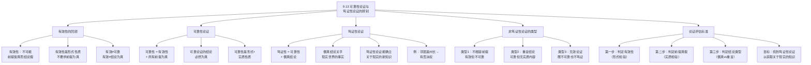

**相关笔记：** [[9.12 间接证明]] | [[8.6 有效和无效的精确含义]]

> [!abstract] 概览
> 本节是第9章的总结性一节，对==可靠性论证==（Sound Arguments）与==笃证性论证==（Demonstrative Arguments）进行精确区分。核心知识点包括：
> - **可靠性（Soundness）**：==有效 + 所有前提为真==
> - **有效性（Validity）**：不要求前提为真，只要求不可能前提皆真而结论为假
> - **笃证性论证（Demonstrative Arguments）**：==可靠性论证 + 偶真结论==
> - **三种非笃证性论证**：不相容前提的论证、重言结论的论证、无效论证
> - **论证评估的标准体系**：如何辨别一个论证是否是可靠性论证和笃证性论证

---

## 一、知识结构总览

---

## 二、核心思想与证明技巧

> [!tip] 核心思想
> 本节的核心思想是：==并非所有有效论证都能为我们提供关于现实世界的知识==。一个论证要真正"证明"或"论证"某个关于现实的结论，它必须同时满足三个条件：(1) 有效的推理形式；(2) 所有前提为真；(3) 结论是偶真陈述（而非重言式）。只有同时满足这三个条件的论证——即==笃证性论证==（Demonstrative Arguments）——才能真正帮助我们认识世界。本节通过系统分析有效论证的不同类型，建立了论证评估的完整标准体系。

### 有效性的回顾

> [!def] 定义：有效性（Validity）
> 一个论证是==有效的==（valid），当且仅当==不可能==出现所有前提为真而结论为假的情况。
>
> 有效性是一个==纯形式性质==——它只关注前提与结论之间的逻辑关系，不关心前提和结论的实际真假。参见 [[8.6 有效和无效的精确含义]]。

### 可靠性的定义

> [!def] 定义：可靠性（Soundness）
> 一个论证是==可靠的==（sound），当且仅当：
> 1. 该论证是==有效的==（valid）
> 2. 该论证的==所有前提都为真==
>
> 可靠性 = 有效性 + 前提的真实性。可靠性不仅是一个形式性质，还涉及前提的==实质内容==。

**可靠性的关键推论：**
- 如果一个论证是可靠的，则它的结论==必然为真==
- 如果一个论证不可靠，可能是因为它无效，也可能是因为它有假前提
- 一个论证不可能既有效又可靠，同时结论为假

### 笃证性论证的定义

> [!def] 定义：笃证性论证（Demonstrative Argument）
> 一个论证是==笃证性的==（demonstrative），当且仅当：
> 1. 该论证是==可靠的==（有效 + 所有前提为真）
> 2. 该论证的结论是==偶真陈述==（contingent statement）
>
> 笃证性论证 = 可靠性论证 + 偶真结论。

**偶真陈述与重言式的区别：**
- ==偶真陈述==（contingent statement）：在某些真值指派下为真，在其他指派下为假——它关乎现实世界的具体事实
- ==重言式==（tautology）：在所有真值指派下都为真——它不提供关于现实世界的任何信息

### 为什么笃证性论证如此重要

> [!tip] 笃证性论证的认识论价值
> 笃证性论证是逻辑学中==最有认识论价值==的论证类型，因为：
>
> 1. **它能确立关于现实的新知识**：偶真结论对应着现实世界中的具体事实，通过笃证性论证，我们可以从已知事实推导出先前未知的事实
> 2. **它具有说服力**：因为前提为真且推理有效，结论必然为真，任何人接受前提就必须接受结论
> 3. **它是科学推理和法律论证的理想模型**：在科学实验和法律审判中，我们追求的就是从真实的前提出发，通过有效的推理，得出关于现实的可靠结论
>
> 例如：如果某人知道她的邻居是伊利诺伊州的州长（偶真前提），并且知道伊利诺伊州的州长有宪法权力否决立法机构通过的法案（偶真前提），她就可以通过有效的推理得出结论：她的邻居有否决权（偶真结论）。这就是一个笃证性论证——它使她获得了关于现实的新知识。

### 三种非笃证性论证

> [!warning] 不是笃证性论证的三种类型
> **类型1：具有不相容前提的有效论证**
> - 有效（因为前提不可能皆真，所以不可能前提皆真而结论假）
> - 不可靠（因为前提不可能都真）
> - 不是笃证性的（因为不可靠）
> - 例：$A \supset B, \; \sim A \supset C, \; \sim(B \lor C), \; \therefore D$（参见 [[9.10 不相容性]]）
>
> **类型2：具有重言结论的有效论证**
> - 有效（因为结论不可能为假）
> - 可以是可靠的（如果前提都为真）
> - ==不是笃证性的==（因为结论是重言式，不提供关于现实的信息）
> - 例：$F \supset G, \; F, \; \therefore H \lor \sim H$
>
> **类型3：无效论证**
> - 无效
> - 不可靠
> - 不是笃证性的

### 论证评估的完整标准

> [!tip] 论证评估的三步法
> | 步骤 | 检验内容 | 方法 | 结果 |
> |:-----|:---------|:-----|:-----|
> | 第一步 | ==有效性== | 真值表、形式证明、STTT | 有效 / 无效 |
> | 第二步 | ==前提真假== | 经验检验、事实核查 | 全真 / 有假 |
> | 第三步 | ==结论类型== | 真值分析 | 偶真 / 重言 |
>
> **最终判定：**
> - 有效 + 前提全真 + 偶真结论 = ==笃证性论证==（最有价值）
> - 有效 + 前提全真 + 重言结论 = ==可靠但非笃证性==（结论无实质内容）
> - 有效 + 前提有假 = ==有效但不可靠==（不能确立结论）
> - 无效 = ==无效论证==（推理形式有缺陷）

---

## 三、补充理解与易混淆点

### 补充理解

> [!info] 补充1：Soundness与Validity在哲学论证中的区分
> **来源：** Audi, R. (2010). *Epistemology: A Contemporary Introduction*, 3rd ed. Routledge, Chapter 6.
>
> Audi 在其认识论教材中深入讨论了论证评估的标准体系，特别强调了有效性（Validity）与可靠性（Soundness）在哲学论证中的区分。Audi 指出，在哲学讨论中，人们经常犯的一个错误是==将有效性与可靠性混为一谈==——一个论证可能具有完美的逻辑形式（有效），但如果它的前提是可疑的或虚假的，这个论证就不能为结论提供任何实质性的支持。
>
> Audi 进一步区分了两种不同的"好论证"：一种是==形式上好的论证==（有效论证），另一种是==实质上好的论证==（可靠论证）。在哲学中，许多深刻的争论恰恰是关于前提的真假，而非关于推理形式的有效性。例如，关于上帝存在的本体论论证，其推理形式是有效的，但争论的焦点在于其前提是否为真。Audi 的分析与本节中 Copi 的区分完全一致：Copi 通过引入"笃证性论证"的概念，进一步细化了论证评估的标准——不仅要求论证有效和可靠，还要求结论是偶真陈述，才能真正提供关于现实世界的知识。

> [!info] 补充2：论证评估的标准体系
> **来源：** Govier, T. (2010). *A Practical Study of Argument*, 7th ed. Wadsworth, Chapter 2.
>
> Govier 在其实用论证研究教材中建立了一个==多层次的论证评估标准体系==，这与本节中 Copi 的分析形成了有益的互补。Govier 指出，评估一个论证需要考虑多个维度：
>
> 1. **逻辑维度**（Logical Dimension）：论证的推理形式是否有效？——对应 Copi 的"有效性"
> 2. **实质维度**（Material Dimension）：论证的前提是否为真？——对应 Copi 的"可靠性"中的前提检验
> 3. **辩证维度**（Dialectical Dimension）：论证是否回应了相关的反对意见？
> 4. **修辞维度**（Rhetorical Dimension）：论证的表达是否清晰、有说服力？
>
> Govier 特别强调，一个好的论证评估不应该只停留在逻辑维度。即使一个论证在逻辑上是完美的（有效且可靠），如果它的结论是重言式（如"明天或者下雨或者不下雨"），这个论证在实质上也是空洞的。这与 Copi 在本节中引入"笃证性论证"概念的动机完全一致：==我们需要区分那些真正能提供新知识的论证和那些虽然逻辑上无懈可击但实质上空洞的论证==。

### 易混淆点

> [!warning] 误区：有效性（形式性质）= 可靠性（形式+实质性质）
> ❌ **错误理解：** 如果一个论证是有效的，那么它就是可靠的，结论也是真的。
> ✅ **正确理解：** ==有效性是纯形式性质==，只保证"如果前提为真，结论不可能为假"；==可靠性是形式加实质性质==，不仅要求推理形式有效，还要求所有前提都为真。一个论证可以有效但不可靠（当有假前提时），也可以可靠但无实质内容（当结论是重言式时）。
> **辨析：** 用一个类比来理解：有效性就像"如果输入正确，程序一定能输出正确结果"——这是程序（推理形式）的属性；可靠性就像"程序确实输出了正确结果"——这还要求输入（前提）是正确的。Copi 在本节中进一步指出，即使论证可靠（程序正确且输入正确），如果输出是"1=1"这样的重言式，它也没有提供任何有用的新信息。只有笃证性论证才真正提供了关于现实的新知识。参见 [[有效性-vs-可靠性]]。

> [!warning] 误区：笃证性论证 = 有效性论证
> ❌ **错误理解：** 笃证性论证就是有效性论证，两者没有区别。
> ✅ **正确理解：** ==笃证性论证是有效性论证的一个严格子集==。一个笃证性论证必须同时满足三个条件：(1) 有效；(2) 所有前提为真；(3) 结论是偶真陈述。而一个有效性论证只需要满足条件(1)。
> **辨析：** 以下是几种有效但非笃证性的论证：
> - **不相容前提的有效论证**：有效但不可靠（条件2不满足），如 $S, \sim S, \therefore M$
> - **重言结论的可靠论证**：可靠但非笃证性（条件3不满足），如 $F \supset G, F, \therefore H \lor \sim H$
> - **有假前提的有效论证**：有效但不可靠（条件2不满足），如"如果猪会飞，那么1+1=3。猪会飞。∴ 1+1=3。"
>
> 笃证性论证的三个条件缺一不可。Copi 在本节末尾明确指出："如果我们的目标是弄清现实如何，我们就不应该被结论为重言式的论证说服，也不应该被具有不相容前提的有效论证说服。相反，人们应该只考虑笃证性论证。"

---

## 四、习题精选

> [!todo] 习题概览
> | 题号 | 来源 | 核心考点 | 难度 |
> |:-----|:-----|:---------|:-----|
> | 1 | 自编 | 判断论证是有效的还是可靠的 | ⭐⭐ |
> | 2 | 自编 | 区分可靠性论证与笃证性论证 | ⭐⭐⭐ |

### 题1：判断论证的有效性与可靠性

> [!problem] 题目
> 判断以下论证是否有效，是否可靠，并说明理由。
>
> **论证A：**
> 前提1：所有人都是会死的。
> 前提2：苏格拉底是人。
> 结论：苏格拉底是会死的。
>
> **论证B：**
> 前提1：如果天下雨，地面就会湿。
> 前提2：天下雨了。
> 前提3：地面没有湿。
> 结论：因此，1+1=3。

> [!faq]- 解答
> **论证A的分析：**
>
> **[步骤1]** 判定有效性：
> - 特征形式：$p \supset q, \; p, \; \therefore q$（肯定前件式）
> - 肯定前件式是有效的论证形式
> - 因此，论证A是==有效的==
>
> **[步骤2]** 判定可靠性：
> - 前提1"所有人都是会死的"：真（偶真陈述）
> - 前提2"苏格拉底是人"：真（偶真陈述）
> - 所有前提为真
> - 因此，论证A是==可靠的==
>
> **[步骤3]** 判定笃证性：
> - 结论"苏格拉底是会死的"：偶真陈述（关乎现实世界的事实）
> - 因此，论证A是==笃证性论证==
>
> ---
>
> **论证B的分析：**
>
> **[步骤1]** 判定有效性：
> - 前提1：$R \supset W$（如果天下雨，地面湿）
> - 前提2：$R$（天下雨了）
> - 前提3：$\sim W$（地面没有湿）
> - 前提1和前提2可以推出 $W$（M.P.），但前提3是 $\sim W$
> - 前提集 $\{R \supset W, R, \sim W\}$ 是==不相容的==
> - 根据不相容性原理（[[9.10 不相容性]]），任何不相容前提的论证都是有效的
> - 因此，论证B是==有效的==
>
> **[步骤2]** 判定可靠性：
> - 前提1：真
> - 前提2：取决于实际情况（假设为真）
> - 前提3：与前提1和2矛盾，不可能同时为真
> - 前提集不相容，至少有一个前提为假
> - 因此，论证B是==不可靠的==
>
> **[步骤3]** 结论：
> - 论证B有效但不可靠，因此不是笃证性论证
> - 这正是本节所强调的：不相容前提使论证有效，但不能确立任何结论的真
>
> $\blacksquare$

### 题2：区分可靠性论证与笃证性论证

> [!problem] 题目
> 以下论证是可靠的吗？是笃证性的吗？请说明理由。
>
> **论证C：**
> 前提1：水在标准大气压下100度沸腾。
> 前提2：当前是标准大气压。
> 结论：水在100度沸腾或者水不在100度沸腾。
>
> **论证D：**
> 前提1：如果一个人是伊利诺伊州的州长，那么他有否决权。
> 前提2：布鲁斯-劳纳是伊利诺伊州的州长。
> 结论：布鲁斯-劳纳有否决权。

> [!faq]- 解答
> **论证C的分析：**
>
> **[步骤1]** 判定有效性：
> - 结论 $B \lor \sim B$ 是重言式
> - 任何具有重言结论的论证都是有效的（因为结论不可能为假）
> - 因此，论证C是==有效的==
>
> **[步骤2]** 判定可靠性：
> - 前提1：真（偶真陈述）
> - 前提2：取决于实际情况（假设为真）
> - 所有前提为真
> - 因此，论证C是==可靠的==
>
> **[步骤3]** 判定笃证性：
> - 结论"水在100度沸腾或者水不在100度沸腾"：==重言式==
> - 重言式在所有情况下都为真，不提供关于现实世界的任何具体信息
> - 因此，论证C==可靠但非笃证性==
>
> **核心教训：** 即使前提都是真的，如果结论是重言式，论证也不能提供关于现实的新知识。这正是 Copi 在本节中所强调的："一个重言式不是'真的'，因为它可以从任何真前提中推出，它的'不真'是因为它只对应着现实中的某个事态。"
>
> ---
>
> **论证D的分析：**
>
> **[步骤1]** 判定有效性：
> - 特征形式：$p \supset q, \; p, \; \therefore q$（肯定前件式）
> - 肯定前件式是有效的论证形式
> - 因此，论证D是==有效的==
>
> **[步骤2]** 判定可靠性：
> - 前提1：真（伊利诺伊州宪法确实赋予州长否决权）
> - 前提2：取决于实际情况（假设为真）
> - 所有前提为真
> - 因此，论证D是==可靠的==
>
> **[步骤3]** 判定笃证性：
> - 结论"布鲁斯-劳纳有否决权"：==偶真陈述==（关乎现实世界的具体事实）
> - 因此，论证D是==笃证性论证==
>
> **核心教训：** 笃证性论证使我们能够从已知事实中学习到新的关于现实的知识。如果某人只知道前提2（布鲁斯-劳纳是州长），通过学习前提1（州长有否决权），她就能通过这个笃证性论证得出一个新的偶真结论（布鲁斯-劳纳有否决权）。
>
> $\blacksquare$

> [!tip] 解题思路提示
> 1. **三步评估法**：先判定有效性（形式检验），再判定前提真假（实质检验），最后判定结论类型（偶真 vs 重言）
> 2. **有效性的快速判定**：检查特征形式是否是已知的有效论证形式；检查前提是否不相容（不相容则一定有效）；检查结论是否是重言式（重言结论则一定有效）
> 3. **可靠性的判定**：有效性 + 前提全真 = 可靠。注意：不相容前提的论证不可能可靠
> 4. **笃证性的判定**：可靠性 + 偶真结论 = 笃证性。重言结论的可靠论证不是笃证性的

---

## 五、视频学习指南

> [!info] 视频资源
> | 资源 | 链接 | 对应内容 | 备注 |
> |:-----|:-----|:---------|:-----|
> | Wireless Philosophy: Soundness | [链接](https://www.youtube.com/watch?v=B2bKFOE2fzA) | 可靠性概念详解 | 英文，配合1.6节和本节 |
> | Gary N. Curtis: Soundness | [链接](https://www.fallacyfiles.org/glossary.html) | 有效性vs可靠性 | 英文，综合参考 |

---

## 六、教材原文

> [!quote] 教材原文
> **来源：** 逻辑学导论 第15版，第9章第13节
>
> **可靠性的定义：**
> "回想一下，一个有效的演绎论证不可能前提皆真而结论为假。根据定义，可以得到：如果一个有效的演绎论证的前提皆真，那么它的结论一定是真的。当我们从其他真陈述中通过演绎得到一个陈述为真时，就是从一个或多个偶真陈述有效地推出了一个偶真陈述。这样的论证既是有效的，又是可靠的。"
>
> **笃证性论证的定义：**
> "如果一个可靠性论证的结论是偶真的（正如9.12节中的论证VI一样，它有相容的前提），它是一个具有偶真结论的笃证性论证。偶真陈述对应着现实；通过学习现实偶真陈述，我们就学习到了关于现实的东西。"
>
> **重言结论的可靠论证的局限：**
> "具有重言结论的可靠性论证，比如论证X，没有也不可能建立起它的结论的真。一个重言式不是'真的'，因为它可以从任何真前提中推出，它的'不真'是因为它只对应着现实中的某个事态。一个重言式是真的，不管现实中怎么样，因此，重言结论没有告诉我们任何关于现实的东西。"
>
> **本节的最终结论：**
> "如果我们的目标是弄清现实如何，我们就不应该被结论为重言式的论证说服，也不应该被具有不相容前提的有效论证说服。相反，人们应该只考虑笃证性论证，即具有相容前提与偶真结论的有效论证。"

---

## 参见 Wiki

- [[有效性]] — 有效性的定义、不可能前提皆真而结论为假
- [[可靠性]] — 可靠性 = 有效性 + 所有前提为真
- [[论证]] — 论证的基本结构与评估标准
- [[有效性-vs-可靠性]] — 有效性与可靠性的对比分析

#学习/逻辑学/命题逻辑Ⅱ
