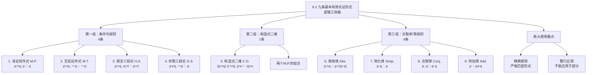

**相关笔记：** [[9.1 有效性的形式证明]] | [[9.3 有效性形式证明示例]]

> [!abstract] 概览
> 本节系统介绍构造形式证明所需的==九条基本推论规则==（Rules of Inference），它们都是基本的有效论证形式，构成形式证明的"逻辑工具箱"。这九条规则分为两组：本节介绍的第一组（基本有效论证形式），以及后续将介绍的第二组（基本逻辑等价式）。核心知识点包括：
> - **规则1-4**（已在8.8节引入）：肯定前件式(M.P.)、否定后件式(M.T.)、假言三段论(H.S.)、析取三段论(D.S.)
> - **规则5-9**（本节新增）：构造式二难(C.D.)、吸收律(Abs.)、简化律(Simp.)、合取律(Conj.)、附加律(Add.)
> - **两大使用要点**：精确使用（严格匹配形式）+ 整行应用（规则只能应用于整个陈述）

---

## 一、知识结构总览

---

## 二、核心思想与证明技巧

> [!tip] 核心思想
> 九条基本有效论证形式是构造形式证明的全部"工具"。可以将它们想象为一个逻辑学家的工具箱——每条规则是一件特定的工具，针对特定的推理任务。==推论规则必须被精确地使用==：每个陈述变项都必须用相同的陈述一致并且准确地替换，不允许有任何形式的捷径和搪塞。同时，==推论规则只能应用于作为推论前提的整个陈述==，而不能应用于这些陈述的部分分支陈述。这两大约束是保证形式证明严格性的基石。

### 九条基本有效论证形式详解

#### 规则1：肯定前件式（Modus Ponens, M.P.）

> [!def] 定义：肯定前件式
> $$p \supset q, \quad p, \quad \therefore \; q$$
>
> **缩写：** M.P.
>
> **直觉解释：** 如果"如果 $p$ 则 $q$"为真，且 $p$ 确实为真，那么 $q$ 必定为真。这是最基本、最直观的有效推理形式——"肯定前件，则肯定后件"。

**代入例：** 给定 $(C \vee D) \supset (J \vee K)$ 和 $(C \vee D)$，通过肯定前件式可以推出 $(J \vee K)$。但注意：不能推出 $(K \vee J)$——即使它可能为真，因为它与基本论证形式的模式不精确匹配。

#### 规则2：否定后件式（Modus Tollens, M.T.）

> [!def] 定义：否定后件式
> $$p \supset q, \quad \sim q, \quad \therefore \; \sim p$$
>
> **缩写：** M.T.
>
> **直觉解释：** 如果"如果 $p$ 则 $q$"为真，但 $q$ 为假，那么 $p$ 必定为假。因为如果 $p$ 为真，$q$ 就不可能为假——既然 $q$ 确实为假，$p$ 就不可能是真的。"否定后件，则否定前件"。

#### 规则3：假言三段论（Hypothetical Syllogism, H.S.）

> [!def] 定义：假言三段论
> $$p \supset q, \quad q \supset r, \quad \therefore \; p \supset r$$
>
> **缩写：** H.S.
>
> **直觉解释：** 蕴涵关系具有传递性。如果 $p$ 蕴涵 $q$，且 $q$ 蕴涵 $r$，那么 $p$ 蕴涵 $r$。可以将多个条件句"链接"成一个更长的条件推理链。

#### 规则4：析取三段论（Disjunctive Syllogism, D.S.）

> [!def] 定义：析取三段论
> $$p \vee q, \quad \sim p, \quad \therefore \; q$$
>
> **缩写：** D.S.
>
> **直觉解释：** 如果两个选项中至少有一个为真（$p \vee q$），而其中一个为假（$\sim p$），那么另一个必定为真（$q$）。这是排除法推理的基础。

#### 规则5：构造式二难（Constructive Dilemma, C.D.）

> [!def] 定义：构造式二难
> $$(p \supset q) \cdot (r \supset s), \quad p \vee r, \quad \therefore \; q \vee s$$
>
> **缩写：** C.D.
>
> **直觉解释：** 构造式二难本质上是==两个肯定前件式论证的结合==。给定两个条件句 $p \supset q$ 和 $r \supset s$，以及两个前件中至少有一个为真（$p \vee r$），则可以有效地推出两个后件中至少有一个为真（$q \vee s$）。
>
> **推理机制：**
> - 如果 $p$ 为真，则由 $p \supset q$ 推出 $q$（第一个M.P.）
> - 如果 $r$ 为真，则由 $r \supset s$ 推出 $s$（第二个M.P.）
> - 既然 $p \vee r$，则 $q \vee s$

#### 规则6：吸收律（Absorption, Abs.）

> [!def] 定义：吸收律
> $$p \supset q, \quad \therefore \; p \supset (p \cdot q)$$
>
> **缩写：** Abs.
>
> **直觉解释：** 任何陈述 $p$ 总能蕴涵它自身。因此，如果我们知道 $p \supset q$，则我们可以有效地推出 $p$ 既蕴涵它自身又蕴涵 $q$。吸收律的实用价值在于：==它能将 $p$ 带到蕴涵号的另一边==，这在有的时候甚至是至关重要的。吸收律使得同一原理（$p \supset p$）总是可供我们使用。

#### 规则7：简化律（Simplification, Simp.）

> [!def] 定义：简化律
> $$p \cdot q, \quad \therefore \; p$$
>
> **缩写：** Simp.
>
> **直觉解释：** 如果两个陈述 $p$ 和 $q$ 的合取 $(p \cdot q)$ 为真，那么合取支中的任何一个都为真。简化律将 $p$ 从合取陈述中"提取"出来，单独立起来。
>
> **注意：** 简化律的基本论证形式只得出结论 $p$（左支）为真。如果需要将 $q$ 从合取陈述中推出，可以将 $q$ 放到 $p$ 所处的位置上，然后利用同一个简化律规则。

#### 规则8：合取律（Conjunction, Conj.）

> [!def] 定义：合取律
> $$p, \quad q, \quad \therefore \; p \cdot q$$
>
> **缩写：** Conj.
>
> **直觉解释：** 如果已知两个陈述 $p$ 和 $q$ 分别为真，则能将它们置于一个合取陈述 $p \cdot q$ 中来表达。合取律是简化律的"逆操作"——简化律从合取中提取一个支，合取律将两个独立的陈述合并为合取。

#### 规则9：附加律（Addition, Add.）

> [!def] 定义：附加律
> $$p, \quad \therefore \; p \vee q$$
>
> **缩写：** Add.
>
> **直觉解释：** 如果一个析取陈述的其中一个析取支为真，则该析取陈述必定为真。因此，如果 $p$ 为真，则对任何 $q$，$p \vee q$ 都为真——无论附加的陈述 $q$ 是什么，无论它多么荒诞或错误。
>
> **经典示例：** 我们知道密歇根在佛罗里达的北面，因此我们知道或者密歇根在佛罗里达的北面或者月亮是由新鲜奶酪做的。事实上，我们知道或者密歇根在佛罗里达的北面或者 $2+2=5$。==附加陈述的真假对我们所构造的析取陈述的真值没有影响==。

### 九条规则汇总表

| 编号 | 名称 | 缩写 | 符号形式 | 直觉 |
|:----:|:-----|:----:|:---------|:-----|
| 1 | 肯定前件式 | M.P. | $p \supset q, \; p \; \therefore q$ | 肯定前件则肯定后件 |
| 2 | 否定后件式 | M.T. | $p \supset q, \; \sim q \; \therefore \sim p$ | 否定后件则否定前件 |
| 3 | 假言三段论 | H.S. | $p \supset q, \; q \supset r \; \therefore p \supset r$ | 蕴涵的传递性 |
| 4 | 析取三段论 | D.S. | $p \vee q, \; \sim p \; \therefore q$ | 排除一个，肯定另一个 |
| 5 | 构造式二难 | C.D. | $(p \supset q) \cdot (r \supset s), \; p \vee r \; \therefore q \vee s$ | 两个M.P.的结合 |
| 6 | 吸收律 | Abs. | $p \supset q \; \therefore p \supset (p \cdot q)$ | 将p带到蕴涵号右边 |
| 7 | 简化律 | Simp. | $p \cdot q \; \therefore p$ | 从合取中提取一个支 |
| 8 | 合取律 | Conj. | $p, \; q \; \therefore p \cdot q$ | 将两个陈述合并为合取 |
| 9 | 附加律 | Add. | $p \; \therefore p \vee q$ | 真命题析取任何命题仍为真 |

### 两大使用要点

> [!warning] 要点一：精确使用
> 基本论证形式必须被==精确地==使用。运用肯定前件式证明有效性的论证就必须具有形式 $p \supset q, \; p, \; \therefore q$。每个陈述变项都必须用相同的陈述（简单或复合陈述）一致并且准确地替换。例如，给定 $(C \vee D) \supset (J \vee K)$ 和 $(C \vee D)$，通过肯定前件式可以推出 $(J \vee K)$，但是通过肯定前件式==不能==推出 $(K \vee J)$，即使它可能为真。

> [!warning] 要点二：整行应用
> 基本有效论证形式必须被应用到==作为推论前提的整个陈述==上，而不能应用到这些陈述的部分分支陈述上。例如，如果给定 $[(X \cdot Y)] \supset Z \cdot T$，我们==无法==利用简化律有效地得出 $X$。虽然 $X$ 是合取陈述的一个合取支，但这个合取陈述只是更复杂的复合陈述的一部分。简化律只适用于整个合取陈述——通过简化律，我们可以有效地推出 $[(X \cdot Y)] \supset Z$，但==不能==推出 $T$（因为它不是合取陈述的左支）。

---

## 三、补充理解与易混淆点

### 补充理解

> [!info] 补充1：Modus Ponens在哲学论证中的应用
> **来源：** Prior, A.N. (1955). *Formal Logic*. Clarendon Press.
>
> 肯定前件式（Modus Ponens）不仅是逻辑学中最基本的推理规则，也是哲学论证中最广泛使用的推理模式。A.N.普赖尔（Arthur Norman Prior）在其著作《形式逻辑》中详细分析了Modus Ponens在哲学史上的核心地位：
>
> 1. **亚里士多德三段论中的隐性使用：** 亚里士多德的直言三段论虽然表面上不使用命题逻辑的符号，但其有效式（如Barbara：所有M是P，所有S是M，∴ 所有S是P）的底层逻辑结构中蕴含着肯定前件式的推理模式。当我们将直言命题转化为条件句形式（如"如果是S则是P"），三段论就变成了条件推理链，其中每一步都是肯定前件式的应用
>
> 2. **笛卡尔"我思故我在"的分析：** 笛卡尔著名的"Cogito ergo sum"（我思故我在）可以被分析为一个肯定前件式的推理：如果我在思考，那么我存在；我在思考；∴ 我存在。虽然这个分析是否准确在哲学界仍有争议，但它展示了肯定前件式在哲学论证中的普遍性
>
> 3. **道德哲学中的应用：** 在功利主义伦理学中，"如果行为A能最大化幸福，则A是道德上正确的；行为A能最大化幸福；∴ A是道德上正确的"——这是一个典型的肯定前件式推理。几乎所有的规范性论证都包含肯定前件式的结构
>
> 普赖尔指出，==肯定前件式之所以如此基本，是因为它直接反映了条件陈述的本质含义==：$p \supset q$ 为真意味着"在 $p$ 为真的情况下，$q$ 也为真"，而肯定前件式正是将这一承诺付诸实践——当 $p$ 确实为真时，$q$ 必须为真。

> [!info] 补充2：Constructive Dilemma与古代逻辑的关系
> **来源：** Bocheński, I.M. (1961). *A History of Formal Logic*. University of Notre Dame Press.
>
> 约瑟夫·博亨斯基（Joseph M. Bocheński）在其权威著作《形式逻辑史》中指出，构造式二难（Constructive Dilemma）有着悠久的哲学历史，可以追溯到古希腊时期：
>
> 1. **"二难推理"名称的由来：** "Dilemma"一词源于希腊语 $\delta\iota\lambda\eta\mu\mu\alpha$（di-lemma），意为"双重命题"或"两难处境"。在古代修辞学中，二难论证是一种强有力的辩论技巧——论证者向对手呈现两个（或多个）选项，无论对手选择哪一个，都会导致对其不利的结论
>
> 2. **斯多葛学派的贡献：** 古希腊斯多葛学派（Stoics，约公元前300年-公元200年）是命题逻辑的先驱。他们系统研究了包括二难推理在内的各种推理模式。斯多葛逻辑学家克里西普斯（Chrysippus, c. 279-206 BC）已经认识到二难推理的有效性，并将其纳入其逻辑体系中
>
> 3. **中世纪的发展：** 中世纪逻辑学家对二难推理进行了更精细的分类。他们区分了"简单构造式二难"（Simple Constructive Dilemma，两个条件句的后件相同）和"复杂构造式二难"（Complex Constructive Dilemma，两个条件句的后件不同）。本节介绍的构造式二难属于复杂构造式二难
>
> 4. **经典哲学案例：** 伊壁鸠鲁（Epicurus）的"罪恶问题"就是一个著名的二难论证：如果上帝愿意阻止邪恶但不能，则上帝是无能的；如果上帝能阻止邪恶但不愿意，则上帝是恶意的；上帝或者愿意但不能，或者能但不愿意；∴ 上帝或者是无能的，或者是恶意的。这个论证的结构正是构造式二难
>
> 博亨斯基的研究表明，==构造式二难不仅是一个有效的逻辑推理形式，更是人类辩论和哲学思考中历史最悠久的论证策略之一==。

### 易混淆点

> [!warning] 误区：肯定前件式(M.P.) = 肯定后件谬误
> ❌ **错误理解：** "如果 $p$ 则 $q$"，已知 $q$ 为真，所以 $p$ 为真——这是有效的推理（肯定前件式）。
> ✅ **正确理解：** 从 $p \supset q$ 和 $q$ 推出 $p$ 是==肯定后件谬误==（Fallacy of Affirming the Consequent），是==无效的==。肯定前件式（M.P.）的正确形式是：从 $p \supset q$ 和 $p$ 推出 $q$。
>
> **关键区分：**
> | 推理形式 | 名称 | 有效性 | 说明 |
> |:---------|:-----|:-------|:-----|
> | $p \supset q, \; p \; \therefore q$ | ==肯定前件式（M.P.）== | ==有效== | 肯定前件→肯定后件 |
> | $p \supset q, \; q \; \therefore p$ | 肯定后件谬误 | 无效 | 肯定后件不能肯定前件 |
>
> **直觉理解：** "如果下雨则地面湿"（$p \supset q$）。已知下雨了（$p$），推出地面湿（$q$）——有效。但已知地面湿了（$q$），推出下雨了（$p$）——无效（地面湿可能是因为洒水车）。
> **辨析：** M.P. 是"顺着"蕴涵方向推理（从前件到后件），肯定后件谬误是试图"逆着"蕴涵方向推理（从后件到前件）——后者之所以无效，是因为 $q$ 可能有多种原因，不一定是 $p$ 导致的。

> [!warning] 误区：否定后件式(M.T.) = 否定前件谬误
> ❌ **错误理解：** "如果 $p$ 则 $q$"，已知 $p$ 为假，所以 $q$ 为假——这是有效的推理（否定后件式）。
> ✅ **正确理解：** 从 $p \supset q$ 和 $\sim p$ 推出 $\sim q$ 是==否定前件谬误==（Fallacy of Denying the Antecedent），是==无效的==。否定后件式（M.T.）的正确形式是：从 $p \supset q$ 和 $\sim q$ 推出 $\sim p$。
>
> **关键区分：**
> | 推理形式 | 名称 | 有效性 | 说明 |
> |:---------|:-----|:-------|:-----|
> | $p \supset q, \; \sim q \; \therefore \sim p$ | ==否定后件式（M.T.）== | ==有效== | 否定后件→否定前件 |
> | $p \supset q, \; \sim p \; \therefore \sim q$ | 否定前件谬误 | 无效 | 否定前件不能否定后件 |
>
> **直觉理解：** "如果是鸟则会飞"（$p \supset q$）。已知蝙蝠不会飞（$\sim q$），推出蝙蝠不是鸟（$\sim p$）——有效。但已知蝙蝠不是鸟（$\sim p$），推出蝙蝠不会飞（$\sim q$）——无效（蝙蝠确实会飞）。
> **辨析：** M.T. 是"逆着"蕴涵方向推理但操作正确（否定后件来否定前件），否定前件谬误是"逆着"蕴涵方向推理但操作错误（否定前件来否定后件）。==$p \supset q$ 只告诉我们"如果 $p$ 则 $q$"，没有说"只有 $p$ 才 $q$"==——$q$ 可能在 $p$ 为假时仍然为真。

---

## 四、习题精选

> [!todo] 习题概览
> | 题号 | 来源 | 核心考点 | 难度 |
> |:-----|:-----|:---------|:-----|
> | 1 | 自编 | 识别给定论证使用的推论规则 | ⭐⭐ |
> | 2 | 自编 | 区分有效规则与形式谬误 | ⭐⭐⭐ |

### 题1：识别推论规则

> [!problem] 题目
> 以下论证都是基本有效论证。请指出每个论证中结论由以从前提得出所依据的推论规则（从九条基本规则中选择）。
>
> (a) $(A \cdot B) \supset C, \quad \therefore (A \cdot B) \supset [(A \cdot B) \cdot C]$
>
> (b) $M \supset N, \quad M, \quad \therefore N$
>
> (c) $P \vee Q, \quad \sim P, \quad \therefore Q$
>
> (d) $(A \supset B) \cdot (C \supset D), \quad A \vee C, \quad \therefore B \vee D$
>
> (e) $X \cdot Y, \quad \therefore X$

> [!faq]- 解答
> **[步骤1]** 分析各论证：
>
> | 论证 | 推论规则 | 分析 |
> |:-----|:---------|:-----|
> | (a) $(A \cdot B) \supset C, \; \therefore (A \cdot B) \supset [(A \cdot B) \cdot C]$ | ==吸收律（Abs.）== | 用 $(A \cdot B)$ 替换 $p$，$C$ 替换 $q$，符合 $p \supset q \; \therefore p \supset (p \cdot q)$ |
> | (b) $M \supset N, \; M, \; \therefore N$ | ==肯定前件式（M.P.）== | 用 $M$ 替换 $p$，$N$ 替换 $q$，符合 $p \supset q, \; p \; \therefore q$ |
> | (c) $P \vee Q, \; \sim P, \; \therefore Q$ | ==析取三段论（D.S.）== | 用 $P$ 替换 $p$，$Q$ 替换 $q$，符合 $p \vee q, \; \sim p \; \therefore q$ |
> | (d) $(A \supset B) \cdot (C \supset D), \; A \vee C, \; \therefore B \vee D$ | ==构造式二难（C.D.）== | 用 $A$ 替换 $p$，$B$ 替换 $q$，$C$ 替换 $r$，$D$ 替换 $s$，符合 $(p \supset q) \cdot (r \supset s), \; p \vee r \; \therefore q \vee s$ |
> | (e) $X \cdot Y, \; \therefore X$ | ==简化律（Simp.）== | 用 $X$ 替换 $p$，$Y$ 替换 $q$，符合 $p \cdot q \; \therefore p$ |
>
> $\blacksquare$

> [!tip] 解题思路提示
> 识别推论规则的步骤：
> 1. **数前提数量**：1个前提 → Abs./Simp./Add.；2个前提 → M.P./M.T./H.S./D.S./C.D./Conj.
> 2. **看主要联结词**：含 $\supset$ → M.P./M.T./H.S./Abs.；含 $\vee$ → D.S./Add./C.D.；含 $\cdot$ → Simp./Conj.
> 3. **匹配精确模式**：将论证中的具体陈述替换为变项，看是否与九条规则之一精确匹配

---

## 五、视频学习指南

> [!info] 视频资源
> | 资源 | 链接 | 对应内容 | 备注 |
> |:-----|:-----|:---------|:-----|
> | Wireless Philosophy: Rules of Inference | [链接](https://www.youtube.com/watch?v=7g7hDEm7XKE) | 推论规则概述 | 英文，配合动画讲解 |
> | Kevin deLaplante: Valid Argument Forms | [链接](https://www.youtube.com/watch?v=sG8Wb9K4sYk) | 九条基本规则详解 | 英文，系列教程 |
> | Gary N. Curtis: Propositional Logic | [链接](https://www.fallacyfiles.org/) | 命题逻辑规则参考 | 综合参考网站 |

---

## 六、教材原文

> [!quote] 教材原文
> **来源：** 逻辑学导论 第15版，第9章第2节
>
> **九条基本有效论证形式：**
>
> 1. 肯定前件式（M.P.）：$p \supset q, \; p \; \therefore q$
> 2. 否定后件式（M.T.）：$p \supset q, \; \sim q \; \therefore \sim p$
> 3. 假言三段论（H.S.）：$p \supset q, \; q \supset r \; \therefore p \supset r$
> 4. 析取三段论（D.S.）：$p \vee q, \; \sim p \; \therefore q$
> 5. 构造式二难（C.D.）：$(p \supset q) \cdot (r \supset s), \; p \vee r \; \therefore q \vee s$
> 6. 吸收律（Abs.）：$p \supset q \; \therefore p \supset (p \cdot q)$
> 7. 简化律（Simp.）：$p \cdot q \; \therefore p$
> 8. 合取律（Conj.）：$p, \; q \; \therefore p \cdot q$
> 9. 附加律（Add.）：$p \; \therefore p \vee q$
>
> **两大使用要点：**
> 第一，它们必须被精确地使用。运用肯定前件式证明有效性的论证就必须具有形式 $p \supset q, p$，所以 $q$。每个陈述变项都必须用相同的陈述一致并且准确地替换。
>
> 第二，这些基本的有效论证形式必须被应用到作为推论前提的整个陈述上，而不能应用到这些陈述的部分分支陈述上。简化律只适用于整个合取陈述；通过简化律得到的陈述，其结论必须是这个合取陈述的左支。

---

## 参见 Wiki

- [[假言三段论]] — 假言三段论（H.S.）的完整概念页，蕴涵传递性
- [[析取三段论]] — 析取三段论（D.S.）的完整概念页，排除法推理
- [[有效性]] — 有效性的定义与判定方法，九条规则是判定有效性的工具
- [[推论规则|肯定前件式]] — 肯定前件式（M.P.）的完整概念页
- [[推论规则|否定后件式]] — 否定后件式（M.T.）的完整概念页
- [[推论规则|构造式二难]] — 构造式二难（C.D.）的完整概念页
- [[推论规则]] — 推论规则的完整概念页

#学习/逻辑学/命题逻辑Ⅱ
