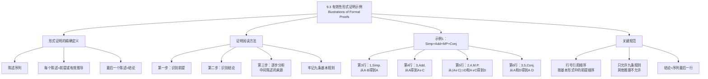

**相关笔记：** [[9.2 基本的有效论证形式]] | [[9.4 有效性形式证明的构造]]

> [!abstract] 概览
> 本节通过多个完整的形式证明示例，帮助读者获得对构建形式证明的"感觉"。核心知识点包括：
> - **形式证明的精确定义**：一个陈述序列，每个陈述或者是前提，或者是根据先前陈述经过有效推导而得到，最后一个陈述为结论
> - **证明阅读技巧**：从已知前提出发，逐步识别每一步所使用的推论规则
> - **行号引用规范**：理由列中按照不同前提在基本有效形式中的顺序来写行号
> - **工具箱约束**：证明中每一行都必须通过九个基本有效论证形式之一得到辩护

---

## 一、知识结构总览



---

## 二、核心思想与证明技巧

> [!tip] 核心思想
> 阅读和理解形式证明是构造形式证明的前提。本节的核心方法是：==面对一个完整的证明序列，逐步分析每一行是如何从前面的行中推导出来的==。第一步不是要想出这样的证明，而是要理解和领会这些证明。在每个例子中，都有一系列陈述呈现在我们面前，该序列中的每个陈述或者是一个前提，或者利用九个基本有效论证形式能从它前面的陈述中推出。

### 形式证明的精确定义

> [!def] 定义：有效性的形式证明
> 一个论证有效性的==形式证明==是一个陈述序列，其中的每个陈述或者是该论证的==前提==，或者是根据序列中的先前陈述经过==有效推导==而得到的陈述，使得该序列中的最后一个陈述为该论证的==结论==。

### 示例1：简化律 + 附加律 + 肯定前件式 + 合取律

> [!example] 示例1
> **论证：**
> 1. $A \cdot B$
> 2. $(A \vee C) \supset D$
>
> $\therefore A \cdot D$
>
> **完整形式证明：**
>
> | 行 | 陈述 | 理由 |
> |:--:|:-----|:-----|
> | 1 | $A \cdot B$ | 前提 |
> | 2 | $(A \vee C) \supset D$ | 前提 |
> | | /∴ $A \cdot D$ | |
> | 3 | $A$ | 1, Simp. |
> | 4 | $A \vee C$ | 3, Add. |
> | 5 | $D$ | 2, 4, M.P. |
> | 6 | $A \cdot D$ | 3, 5, Conj. |

**逐步解读：**

**[第3行]** $A$：从第1行 $A \cdot B$，通过==简化律（Simp.）==得到。因为 $A \cdot B$ 为真意味着 $A$ 和 $B$ 都为真，所以可以从中提取 $A$。理由列写"1, Simp."。

**[第4行]** $A \vee C$：从第3行 $A$，通过==附加律（Add.）==得到。附加律说如果 $p$ 为真，则无论 $q$ 的真假是什么，$p \vee q$ 都为真。这里用 $A$ 替换 $p$，$C$ 替换 $q$。理由列写"3, Add."。

**[第5行]** $D$：$D$ 在第2行中作为条件陈述 $(A \vee C) \supset D$ 的后件出现。我们在第4行已经证明出 $(A \vee C)$ 为真，现在使用==肯定前件式（M.P.）==，将它与第2行的条件陈述结合来证明 $D$。理由列写"2, 4, M.P."。

**[第6行]** $A \cdot D$：$A$ 在第3行已被证明为真，$D$ 在第5行也被证明为真。因此我们能够有效地将二者结合，使用==合取律（Conj.）==。理由列写"3, 5, Conj."。

$A \cdot D$ 是论证的结论，因此它也是构成这个证明的序列中的最后一个陈述。证明完成。

### 行号引用规范

> [!tip] 行号引用规范
> 如果需要指涉一个由两个前提组成的论证（例如M.P.或D.S.），则在右边的理由中要==按照不同前提在基本有效形式中的顺序来写==。
>
> 例如，在M.P.的基本形式 $p \supset q, \; p \; \therefore q$ 中，条件句 $p \supset q$ 在前，前件 $p$ 在后。因此，示例1中第5行的理由是"2, 4, M.P."——第2行（条件句）在前，第4行（前件）在后。
>
> 同理，在D.S.的基本形式 $p \vee q, \; \sim p \; \therefore q$ 中，析取式 $p \vee q$ 在前，否定式 $\sim p$ 在后。

### 工具箱约束

> [!warning] 重要约束
> 所有证明中的每一行都必须通过九个基本有效论证形式之一得到辩护。==无论其他推理看起来如何可信，都不允许在证明中使用==。形式证明的严格性正是其效力的来源——如果证明正确，则对由此得出的推理的有效性就不存在任何一点怀疑。

---

## 三、补充理解与易混淆点

### 补充理解

> [!info] 补充1：证明策略中的"向前链"与"向后链"
> **来源：** Anderson, D. & Belnap, N. (1975). *Entailment*, Vol. 1. Princeton University Press.
>
> 安德森和贝尔纳普在《蕴涵》第一卷中深入分析了形式证明中的两种基本策略：
>
> 1. **向前链（Forward Chaining）**：从已知的前提出发，运用推论规则逐步推出新的陈述，直到到达结论。这种策略是"数据驱动"的——它问"从我已经知道的东西中，我还能推出什么？"
>
> 2. **向后链（Backward Chaining）**：从结论出发，问"要得到这个结论，我需要什么前提？"然后递归地分析这些前提的来源，直到回溯到给定的前提。这种策略是"目标驱动"的——它问"我需要什么才能得到我想要的？"
>
> 在实际证明构造中，两种策略通常是==交替使用==的：
> - 先用向后链确定大致方向（"我需要什么"）
> - 再用向前链填充具体步骤（"我能从已知前提推出什么"）
>
> 示例1中的证明过程就体现了这种交替：
> - **向后链**：结论是 $A \cdot D$（合取），需要 $A$ 和 $D$ 分别为真。$A$ 可以从前提1（$A \cdot B$）通过Simp.得到。$D$ 需要从前提2（$(A \vee C) \supset D$）通过M.P.得到，这需要 $A \vee C$，而 $A \vee C$ 可以通过Add.从 $A$ 得到
> - **向前链**：从 $A \cdot B$ 得到 $A$（Simp.），从 $A$ 得到 $A \vee C$（Add.），从 $(A \vee C) \supset D$ 和 $A \vee C$ 得到 $D$（M.P.），从 $A$ 和 $D$ 得到 $A \cdot D$（Conj.）
>
> 安德森和贝尔纳普强调，==熟练的证明构造者能够在向前链和向后链之间自如切换==，这种能力是逻辑训练的核心目标之一。

> [!info] 补充2：形式证明中的"子目标"分解技术
> **来源：** Fitch, F.B. (1952). *Symbolic Logic*. Ronald Press.
>
> 弗雷德里克·菲奇（Frederic Fitch）在其著作《符号逻辑》中提出了一种系统的证明构造方法——"子目标分解"技术。这种方法的核心思想是：
>
> 1. **将最终目标分解为子目标**：如果结论是 $A \cdot D$，则子目标是分别证明 $A$ 和 $D$
> 2. **对每个子目标递归分解**：要证明 $D$，需要 $(A \vee C) \supset D$ 和 $A \vee C$；要证明 $A \vee C$，需要 $A$；要证明 $A$，需要 $A \cdot B$
> 3. **检查子目标是否已被前提满足**：$A \cdot B$ 正好是前提1，因此分解完成
> 4. **将分解路径反转为证明序列**：按照分解的逆序写出证明步骤
>
> 菲奇的子目标分解技术可以表示为一棵"目标树"：
> ```
> 目标：A·D
> ├── 子目标1：A ← Simp. ← A·B（前提1）✓
> └── 子目标2：D ← M.P. ← (A∨C)⊃D（前提2）+ A∨C
>                              └── A∨C ← Add. ← A（已得）✓
> ```
>
> 这种方法的优势在于：==它将复杂的证明任务分解为一系列简单的、可独立处理的子任务==，降低了证明构造的认知负担。菲奇指出，虽然这种方法最初需要更多的"元推理"（关于证明结构的推理），但随着练习，子目标分解会变得越来越自动化，最终成为直觉性的证明策略。

### 易混淆点

> [!warning] 误区：证明中的行号引用 = 前提编号
> ❌ **错误理解：** 理由列中引用的数字就是前提的编号（如"1, 2"总是指前提1和前提2）。
> ✅ **正确理解：** 理由列中引用的数字是==证明序列中的行号==，不限于前提。任何已经被正确推出的陈述都可以被后续步骤引用，无论它是前提还是中间推导出的陈述。
>
> 例如，在示例1中：
> - 第5行的理由"2, 4, M.P."——其中"2"是前提2，但"4"是==中间推导出的陈述==（第4行 $A \vee C$），不是前提
> - 第6行的理由"3, 5, Conj."——其中"3"和"5"都是==中间推导出的陈述==，不是前提
>
> **辨析：** 行号是证明序列中所有陈述的统一编号系统。前提只是序列中编号靠前的陈述，中间推导出的陈述同样可以被引用。关键原则是：==只能引用出现在当前行之前的行==。

> [!warning] 误区：推论规则可以应用于陈述的部分
> ❌ **错误理解：** 如果某行包含一个合取陈述，即使它不是整行的主要联结词，也可以用简化律提取其合取支。
> ✅ **正确理解：** ==推论规则只能应用于作为推论前提的整个陈述==，不能应用于这些陈述的部分分支陈述。
>
> 例如，给定陈述 $[(X \cdot Y)] \supset Z \cdot T$：
> - 可以通过简化律推出 $[(X \cdot Y)] \supset Z$——因为整个陈述是一个合取（以 $\cdot$ 为主联结词），简化律提取其左支 ✅
> - ==不能==通过简化律推出 $X$——因为 $X$ 只是合取支 $X \cdot Y$ 的一个部分，而 $X \cdot Y$ 本身只是条件陈述的前件，不是整行陈述 ❌
> - ==不能==通过简化律推出 $T$——因为 $T$ 虽然是合取陈述的右支，但简化律只能提取==左支== ❌
>
> **辨析：** 推论规则操作的是"整行陈述"，不是"陈述的某个部分"。判断一个规则能否应用，要看该规则的模式是否与==整行陈述的结构==匹配，而不是与行中某个子公式的结构匹配。==微小的差别就会毁掉整个论证的效力==。

---

## 四、习题精选

> [!todo] 习题概览
> | 题号 | 来源 | 核心考点 | 难度 |
> |:-----|:-----|:---------|:-----|
> | 1 | 自编 | 完成给定部分证明（填空） | ⭐⭐ |
> | 2 | 自编 | 阅读并验证完整证明 | ⭐⭐ |

### 题1：完成部分证明（填空）

> [!problem] 题目
> 以下是一个不完整的形式证明。请为编了号但不是前提的每行写出理由（行号 + 规则缩写），使证明完整。
>
> | 行 | 陈述 | 理由 |
> |:--:|:-----|:-----|
> | 1 | $(M \supset N) \cdot (O \supset P)$ | 前提 |
> | 2 | $M \vee O$ | 前提 |
> | 3 | $\sim N$ | 前提 |
> | | /∴ $P$ | |
> | 4 | $M \supset N$ | ? |
> | 5 | $\sim M$ | ? |
> | 6 | $O$ | ? |
> | 7 | $O \supset P$ | ? |
> | 8 | $P$ | ? |

> [!faq]- 解答
> **[步骤1]** 分析第4行：$M \supset N$
> - $M \supset N$ 是第1行 $(M \supset N) \cdot (O \supset P)$ 的左合取支
> - 从合取中提取左支 → ==简化律（Simp.）==
> - 理由：**1, Simp.**
>
> **[步骤2]** 分析第5行：$\sim M$
> - 已知 $M \supset N$（第4行）和 $\sim N$（前提3）
> - 从条件句和后件的否定推出前件的否定 → ==否定后件式（M.T.）==
> - 理由：**4, 3, M.T.**
>
> **[步骤3]** 分析第6行：$O$
> - 已知 $M \vee O$（前提2）和 $\sim M$（第5行）
> - 从析取式和其中一个支的否定推出另一个支 → ==析取三段论（D.S.）==
> - 理由：**2, 5, D.S.**
>
> **[步骤4]** 分析第7行：$O \supset P$
> - $O \supset P$ 是第1行 $(M \supset N) \cdot (O \supset P)$ 的右合取支
> - 从合取中提取左支（将 $O \supset P$ 放在 $p$ 的位置）→ ==简化律（Simp.）==
> - 理由：**1, Simp.**
>
> **[步骤5]** 分析第8行：$P$
> - 已知 $O \supset P$（第7行）和 $O$（第6行）
> - 从条件句和前件推出后件 → ==肯定前件式（M.P.）==
> - 理由：**7, 6, M.P.**
>
> **完整证明：**
>
> | 行 | 陈述 | 理由 |
> |:--:|:-----|:-----|
> | 1 | $(M \supset N) \cdot (O \supset P)$ | 前提 |
> | 2 | $M \vee O$ | 前提 |
> | 3 | $\sim N$ | 前提 |
> | | /∴ $P$ | |
> | 4 | $M \supset N$ | 1, Simp. |
> | 5 | $\sim M$ | 4, 3, M.T. |
> | 6 | $O$ | 2, 5, D.S. |
> | 7 | $O \supset P$ | 1, Simp. |
> | 8 | $P$ | 7, 6, M.P. |
>
> $\blacksquare$

> [!tip] 解题思路提示
> 完成部分证明的步骤：
> 1. **从上到下逐行分析**：看每个被推导出的陈述与前面哪些行有关系
> 2. **识别联结词模式**：该陈述是某个合取的支？某个条件句的后件？某个析取的支？
> 3. **匹配九条规则**：找到唯一匹配的规则（通常只有一条规则能解释从A和B得到C）
> 4. **注意行号顺序**：对于两个前提的规则（M.P./M.T./D.S./H.S./C.D./Conj.），按照基本形式中的前提顺序写行号

---

## 五、视频学习指南

> [!info] 视频资源
> | 资源 | 链接 | 对应内容 | 备注 |
> |:-----|:-----|:---------|:-----|
> | Wireless Philosophy: Natural Deduction Proofs | [链接](https://www.youtube.com/watch?v=7g7hDEm7XKE) | 自然演绎证明示例 | 英文，配合动画讲解 |
> | Kevin deLaplante: Proof Examples | [链接](https://www.youtube.com/watch?v=sG8Wb9K4sYk) | 形式证明示例详解 | 英文，系列教程 |
> | Michael Genesereth: Proof Techniques | [链接](https://www.youtube.com/playlist?list=PLgJhD2hA7qMh5yO6pRQEVXeW8SCkMhA0P) | 证明技巧与策略 | 英文，斯坦福大学课程 |

---

## 六、教材原文

> [!quote] 教材原文
> **来源：** 逻辑学导论 第15版，第9章第3节
>
> **形式证明的定义：**
> 我们已经将一个论证有效性的形式证明定义如下：它是一个陈述序列，其中的每个陈述或者是该论证的前提，或者是根据序列中的先前陈述经过有效推导而得到的陈述，使得该序列中的最后一个陈述为该论证的结论。我们的目标就是要构造这样的一个序列，来证明所面对的论证的有效性。
>
> **证明阅读方法：**
> 第一步不是要想出这样的证明，而是要理解和领会这些证明。在每个例子中，都有一系列陈述呈现在我们面前。该序列中的每个陈述或者是一个前提，或者利用9.1节中的某个基本有效论证能从它前面的陈述中推出。如果一个证明中每一步所依赖的推论规则并没有给出，则我们知道证明中所有不是前提的行都可以从前面的陈述中演绎得出。为了理解这些演绎推出，需要牢记九个基本的有效论证。
>
> **行号引用规范：**
> 如果我们需要指涉一个由两个前提组成的论证（例如M.P.或者D.S.），则我们在右边的根据中要按照不同前提在基本有效形式中的顺序来写。
>
> **工具箱约束：**
> 这个例子以及后面的练习中，所有证明中的每一行都能通过我们逻辑工具箱中的某个基本有效论证形式得到辩护。无论其他推理看起来如何可信，都不允许在证明中使用。

---

## 参见 Wiki

- [[有效性]] — 有效性的定义与判定方法
- [[假言三段论]] — 假言三段论（H.S.）的完整概念页
- [[推论规则|肯定前件式]] — 肯定前件式（M.P.）的完整概念页
- [[推论规则|否定后件式]] — 否定后件式（M.T.）的完整概念页
- [[析取三段论]] — 析取三段论（D.S.）的完整概念页
- [[9.2 基本的有效论证形式]] — 九条基本规则的完整介绍

#学习/逻辑学/命题逻辑Ⅱ
