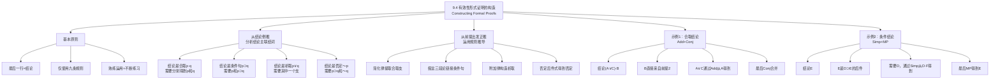

**相关笔记：** [[9.3 有效性形式证明示例]] | [[9.5 构造更复杂的形式证明]]

> [!abstract] 概览
> 本节转向演绎逻辑的核心任务——==从形式上证明实际有效的论证的有效性==。此前我们研究的是如何给已有的证明补充理由，现在需要从零开始构造证明。核心知识点包括：
> - **证明构造的基本原则**：任何证明序列的最后一行总是正在证明的论证的结论
> - **从结论倒推策略**：分析结论的主联结词，确定需要哪些中间陈述
> - **从前提出发正推策略**：从前提出发，看能推出哪些有用的中间陈述
> - **正推与倒推的结合**：将两种策略对接，完成证明

---

## 一、知识结构总览

---

## 二、核心思想与证明技巧

> [!tip] 核心思想
> 构造形式证明是一项需要策略的技能。成功不仅需要对九条规则的熟练掌握，还需要在设计证明的过程中能熟练地调用所需规则。本节介绍的核心策略是：==从结论倒推（分析结论的结构）与从前提出发正推（运用规则推导）相结合==。这种"双向夹击"的方法能够有效地缩小搜索空间，快速找到证明路径。需要时刻谨记：==任何证明序列的最后一行总是正在证明的论证的结论==。

### 从结论倒推策略

从结论倒推是构造证明最重要的策略。其核心方法是==分析结论的主联结词==，确定要得到结论需要哪些中间陈述：

| 结论的形式 | 主联结词 | 需要什么 | 可用规则 |
|:-----------|:---------|:---------|:---------|
| $p \cdot q$ | 合取 | 分别得到 $p$ 和 $q$ | Conj. |
| $p \vee q$ | 析取 | 得到 $p$ 或 $q$ 之一 | Add. |
| $p \supset q$ | 蕴涵 | 通常需要其他路径 | H.S./Abs. |
| $\sim p$ | 否定 | 需要 $p \supset \text{某物}$ 和该物的否定 | M.T. |

> [!tip] 倒推策略详解
> **步骤1：** 看结论的主联结词是什么
> **步骤2：** 问"要得到这个结论，我需要什么？"
> **步骤3：** 对每个需要的中间陈述，重复步骤1-2
> **步骤4：** 直到回溯到某个给定的前提

### 从前提出发正推策略

从前提出发正推是倒推策略的补充。其核心方法是==看前提之间有什么联系==，运用规则推出可能有用的中间陈述：

| 前提的类型 | 可用的规则 | 推出什么 |
|:-----------|:-----------|:---------|
| 合取 $p \cdot q$ | Simp. | $p$ 或 $q$ |
| 条件句 $p \supset q$ | 与 $p$ 结合用M.P.，与 $\sim q$ 结合用M.T. | $q$ 或 $\sim p$ |
| 析取 $p \vee q$ | 与 $\sim p$ 或 $\sim q$ 结合用D.S. | $q$ 或 $p$ |
| 两个条件句 $p \supset q$ 和 $q \supset r$ | H.S. | $p \supset r$ |

### 示例1：合取结论的证明

> [!example] 示例1
> **论证：**
> 1. $A$
> 2. $B$
>
> $\therefore (A \vee C) \cdot B$
>
> **证明策略分析：**
> - **倒推**：结论 $(A \vee C) \cdot B$ 是一个合取，需要分别得到 $(A \vee C)$ 和 $B$
> - $B$ 已经是前提2，可以直接使用
> - $(A \vee C)$ 可以通过附加律从 $A$ 得到，而 $A$ 是前提1
> - **正推**：从 $A$（前提1）通过Add.得到 $A \vee C$；将 $A \vee C$ 与 $B$（前提2）通过Conj.合并
>
> **完整形式证明：**
>
> | 行 | 陈述 | 理由 |
> |:--:|:-----|:-----|
> | 1 | $A$ | 前提 |
> | 2 | $B$ | 前提 |
> | | /∴ $(A \vee C) \cdot B$ | |
> | 3 | $A \vee C$ | 1, Add. |
> | 4 | $(A \vee C) \cdot B$ | 3, 2, Conj. |

### 示例2：条件句后件的证明

> [!example] 示例2
> **论证：**
> 1. $D \supset E$
> 2. $D \cdot F$
>
> $\therefore E$
>
> **证明策略分析：**
> - **倒推**：结论 $E$ 是前提1（$D \supset E$）的后件。如果能确定 $D$ 为真，则可以通过肯定前件式得到 $E$
> - $D$ 的真可以通过简化律从前提2（$D \cdot F$）得到
> - **正推**：从 $D \cdot F$（前提2）通过Simp.得到 $D$；从 $D \supset E$（前提1）和 $D$（第3行）通过M.P.得到 $E$
>
> **完整形式证明：**
>
> | 行 | 陈述 | 理由 |
> |:--:|:-----|:-----|
> | 1 | $D \supset E$ | 前提 |
> | 2 | $D \cdot F$ | 前提 |
> | | /∴ $E$ | |
> | 3 | $D$ | 2, Simp. |
> | 4 | $E$ | 1, 3, M.P. |

### 证明构造的一般流程

> [!tip] 证明构造的一般流程
> 1. **明确结论**：始终记住要证明的结论是什么
> 2. **倒推分析**：分析结论的主联结词，确定需要哪些中间陈述
> 3. **正推探索**：从前提出发，看能推出哪些可能有用的陈述
> 4. **对接路径**：将倒推需要的陈述与正推得到的陈述对接
> 5. **写出证明**：按照从前提到结论的顺序写出完整的证明序列
> 6. **验证每步**：检查每一步是否都严格依据某条推论规则

---

## 三、补充理解与易混淆点

### 补充理解

> [!info] 补充1：证明构造中的启发式方法
> **来源：** Prawitz, D. (1965). *Natural Deduction*. Almqvist & Wiksell.
>
> 达格·普拉维茨（Dag Prawitz）在其经典著作《自然演绎》中对证明构造的启发式方法进行了系统研究。普拉维茨提出了几个重要的启发式原则：
>
> 1. **"看结论"原则（Look at the Conclusion）**：这是最重要的启发式。在开始构造证明之前，先仔细分析结论的逻辑结构。结论的主联结词通常决定了证明的最后一步应该使用哪条规则。例如，如果结论是合取，最后一步很可能是Conj.；如果结论是某个条件句的后件，最后一步很可能是M.P.
>
> 2. **"消除复杂度"原则（Reduce Complexity）**：在倒推过程中，每一步都应该试图降低问题的复杂度——将一个复杂的证明目标分解为更简单的子目标。例如，将"证明 $A \cdot B$"分解为"证明 $A$"和"证明 $B$"就是降低复杂度
>
> 3. **"使用所有前提"原则（Use All Premises）**：如果一个前提在证明中没有被使用，这通常意味着证明可能有问题——要么证明不正确，要么存在更简单的证明路径。当然，这不是绝对的规则（有些前提可能是冗余的），但它是一个有用的检查手段
>
> 4. **"避免死胡同"原则（Avoid Dead Ends）**：如果某条推理路径产生了与目标无关的陈述，应该及时放弃并尝试其他路径。普拉维茨指出，==经验丰富的证明构造者能够快速识别死胡同，因为他们对九条规则的能力和局限有深刻的理解==
>
> 普拉维茨的启发式方法本质上是将证明构造从一种"盲目搜索"转化为一种"有策略的搜索"，大大提高了证明构造的效率。

> [!info] 补充2：形式证明与数学证明的类比
> **来源：** Lakatos, I. (1976). *Proofs and Refutations*. Cambridge University Press.
>
> 伊姆雷·拉卡托斯（Imre Lakatos）在《证明与反驳》中深刻分析了形式证明与数学证明之间的关系。虽然拉卡托斯主要关注数学证明的哲学性质，但其洞见对理解命题逻辑中的形式证明也很有启发：
>
> 1. **证明是"论证序列"**：无论是形式逻辑中的证明还是数学中的证明，其核心结构都是一个"从前提到结论的论证序列"。形式证明将这一结构==显式化==——每一步都必须标注理由；数学证明则更多依赖==隐式的推理步骤==，读者需要自己填补逻辑跳跃
>
> 2. **"证明分析"的价值**：拉卡托斯强调，理解一个证明（证明分析）比仅仅知道一个证明的结论更有价值。这与本节的方法一致：==先学会阅读和理解证明，再学会构造证明==。通过分析已有的证明，我们可以学习证明策略和技巧
>
> 3. **证明的"严格性"与"灵活性"**：形式证明的严格性（每步都必须依据规则）看似限制了证明的灵活性，但实际上==这种严格性使得证明可以被机械地验证==，消除了歧义和争议。数学证明虽然不如形式证明严格，但在成熟的数学领域中，大多数推理步骤都可以（至少在原则上）被形式化
>
> 4. **从简单到复杂的渐进学习**：拉卡托斯指出，数学理解是通过从简单到复杂的渐进过程获得的。本节的方法正是如此：先处理只需两个附加陈述的简单证明，逐步过渡到需要更多步骤的复杂证明。==这种渐进方法符合人类认知的自然规律==。

### 易混淆点

> [!warning] 误区：从结论倒推 = 反向推理
> ❌ **错误理解：** 从结论倒推就是"反向推理"——从结论推出前提。这意味着如果倒推成功，就证明了结论蕴含前提，而不是前提蕴含结论。
> ✅ **正确理解：** 从结论倒推是一种==分析策略==，不是推理方向。倒推的目的是==确定需要哪些中间陈述==，而不是进行实际的推理。实际的推理方向始终是==从前提到结论==（正向的）。
>
> **关键区分：**
> - **倒推（分析策略）**：问"要得到 $E$，我需要什么？"→ 需要 $D$ 和 $D \supset E$。这只是==规划证明路径==，不是实际推理
> - **正推（实际推理）**：从 $D \supset E$ 和 $D$ 推出 $E$。这是==执行证明步骤==，是实际的推理
>
> 最终写出的证明序列永远是正方向的（从前提到结论），倒推只是在"草稿纸"上进行的策略分析。
> **辨析：** 倒推就像规划旅行路线——你先看目的地在哪里，然后反推应该走哪条路。但实际旅行时，你仍然是正向走的。规划（倒推）和执行（正推）是两个不同的层面。

> [!warning] 误区：证明策略可以替代规则
> ❌ **错误理解：** 只要策略正确，可以灵活变通规则的用法，不需要严格匹配规则的模式。
> ✅ **正确理解：** ==证明策略的灵活性与规则的严格性是两个不同层面的事情==。策略层面可以灵活（选择先倒推还是先正推、选择哪条路径），但一旦确定了某一步要使用某条规则，该规则的应用必须==严格匹配==其基本形式。
>
> 例如，策略上你可以选择"先通过简化律从合取中提取左支"或"先通过假言三段论链接两个条件句"——这是策略的灵活性。但一旦你选择使用简化律，就必须严格匹配 $p \cdot q \; \therefore p$ 的形式——这是规则的严格性。
>
> **辨析：** 策略回答"做什么"（which rule to use, which path to follow），规则回答"怎么做"（how to apply the rule correctly）。策略可以灵活选择，规则必须严格遵守。==微小的差别就会毁掉整个论证的效力==。

---

## 四、习题精选

> [!todo] 习题概览
> | 题号 | 来源 | 核心考点 | 难度 |
> |:-----|:-----|:---------|:-----|
> | 1 | 自编 | 为给定论证设计证明策略并执行 | ⭐⭐ |
> | 2 | 自编 | 两步证明的构造 | ⭐ |

### 题1：设计证明策略并执行

> [!problem] 题目
> 为以下论证设计证明策略（说明倒推和正推的分析过程），然后写出完整的形式证明。
>
> 前提：
> 1. $G \supset H$
> 2. $G \cdot I$
>
> $\therefore H \cdot I$

> [!faq]- 解答
> **[步骤1]** 倒推分析：
> - 结论 $H \cdot I$ 是一个合取，主联结词是 $\cdot$
> - 要通过合取律（Conj.）得到 $H \cdot I$，需要分别得到 $H$ 和 $I$
> - $H$ 可以从前提1（$G \supset H$）通过肯定前件式得到，这需要 $G$
> - $I$ 可以从前提2（$G \cdot I$）通过简化律得到
> - $G$ 可以从前提2（$G \cdot I$）通过简化律得到
>
> **[步骤2]** 正推分析：
> - 从前提2（$G \cdot I$）通过简化律可以得到 $G$ 和 $I$
> - 从前提1（$G \supset H$）和 $G$ 通过肯定前件式可以得到 $H$
> - 从 $H$ 和 $I$ 通过合取律可以得到 $H \cdot I$
>
> **[步骤3]** 完整形式证明：
>
> | 行 | 陈述 | 理由 |
> |:--:|:-----|:-----|
> | 1 | $G \supset H$ | 前提 |
> | 2 | $G \cdot I$ | 前提 |
> | | /∴ $H \cdot I$ | |
> | 3 | $G$ | 2, Simp. |
> | 4 | $H$ | 1, 3, M.P. |
> | 5 | $I$ | 2, Simp. |
> | 6 | $H \cdot I$ | 4, 5, Conj. |
>
> **[步骤4]** 验证：
> - 第3行：从 $G \cdot I$ 通过Simp.得到 $G$ ✅
> - 第4行：从 $G \supset H$ 和 $G$ 通过M.P.得到 $H$ ✅
> - 第5行：从 $G \cdot I$ 通过Simp.得到 $I$ ✅
> - 第6行：从 $H$ 和 $I$ 通过Conj.得到 $H \cdot I$ ✅
> - 结论 $H \cdot I$ 已被推出，证明完成 ✅
>
> $\blacksquare$

> [!tip] 解题思路提示
> 构造证明的"双向夹击"法：
> 1. **先倒推**：看结论是什么形式，确定最后一步需要什么规则
> 2. **再正推**：看前提能推出什么有用的中间陈述
> 3. **找桥梁**：将倒推需要的陈述与正推得到的陈述对接
> 4. **写证明**：按照从前提到结论的顺序写出完整证明
> 5. **最后验证**：检查每一步是否严格匹配某条规则

---

## 五、视频学习指南

> [!info] 视频资源
> | 资源 | 链接 | 对应内容 | 备注 |
> |:-----|:-----|:---------|:-----|
> | Wireless Philosophy: Proof Strategy | [链接](https://www.youtube.com/watch?v=7g7hDEm7XKE) | 证明策略概述 | 英文，配合动画讲解 |
> | Kevin deLaplante: Constructing Proofs | [链接](https://www.youtube.com/watch?v=sG8Wb9K4sYk) | 证明构造方法 | 英文，系列教程 |
> | Michael Geneseroth: Proof Construction | [链接](https://www.youtube.com/playlist?list=PLgJhD2hA7qMh5yO6pRQEVXeW8SCkMhA0P) | 证明构造技巧 | 英文，斯坦福大学课程 |

---

## 六、教材原文

> [!quote] 教材原文
> **来源：** 逻辑学导论 第15版，第9章第4节
>
> **证明构造的核心任务：**
> 我们现在转向演绎逻辑的一个核心任务：从形式上证明实际有效的论证的有效性。在前面几节中，我们研究了只需要加上每一步的根据来进行完善的形式证明。然而，此后我们遇到的都是需要我们构造出形式证明的论证。有些论证的形式证明很容易，但还有一些论证的形式论证则比较复杂。但是无论所需要的证明是简短还是复杂冗长，所有情形中依据的推理规则都是我们已经拥有的工具。而成功需要对这些规则的熟练掌握，仅仅是具备这些规则是不够的，还需要在设计证明的过程中能熟练地调用所需规则。
>
> **基本原则：**
> 需要时刻谨记的是，任何证明序列的最后一行总是正在证明的论证的结论。
>
> **示例1的策略分析：**
> 该论证的结论 $(A \vee C) \cdot B$ 是一个合取陈述，我们很快可以看到第二个析取支 $B$ 正好是出现在第2行的前提，可以直接拿来用。现在所需要的就是析取陈述 $(A \vee C)$，它与 $B$ 相结合就能完成该证明。$(A \vee C)$ 很容易从第1行的前提 $A$ 中得出；附加律断言对任何给定其真值为真的陈述 $p$ 都可以（析取地）加上任意陈述 $q$。

---

## 参见 Wiki

- [[有效性]] — 有效性的定义与判定方法，形式证明是判定有效性的核心工具
- [[推论规则]] — 九条基本推论规则的完整参考
- [[自然演绎|证明策略]] — 形式证明构造中的策略方法
- [[自然演绎]] — 自然演绎方法的完整概念页

#学习/逻辑学/命题逻辑Ⅱ
