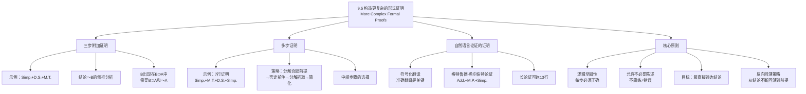

**相关笔记：** [[9.4 有效性形式证明的构造]] | [[9.6 扩展推论规则：替换规则]]

> [!abstract] 概览
> 本节进阶到需要更多步骤的复杂形式证明。核心知识点包括：
> - **三步附加证明**：在前提后只添加三行即可完成的证明，涉及Simp.+D.S.+M.T.的组合使用
> - **多步证明**：需要七行甚至更多行的证明，涉及多种规则的组合策略
> - **自然语言论证的符号化与证明**：将日常语言论证翻译为符号语言后构造形式证明
> - **逻辑坚固性原则**：证明中每个陈述都必须正确地得出，但允许包含不必要的中间陈述
> - **从结论反向回溯的策略**：通过怎样的陈述能推出结论？这些陈述又需要怎样的陈述被推出？

---

## 一、知识结构总览

---

## 二、核心思想与证明技巧

> [!tip] 核心思想
> 复杂证明与简单证明的过程是一样的：目标都是将证明序列的最后一个陈述构造成该论证的结论，推理的规则也都是我们仅有的那些逻辑工具。区别在于：复杂证明需要==更多的中间步骤==和==更精细的策略规划==。在大多数情形下，设计某个论证的形式证明都需要一些行动策略，使得我们能运用规则达到所寻求的结论。思考如下问题总会是有益的：==通过怎样的陈述能推出结论？这些陈述又需要通过怎样的陈述被推出？如此，从结论不断反向回溯到给定的前提==。

### 三步附加证明示例

> [!example] 示例1：三步附加证明
> **论证：**
> 1. $A \vee (B \supset A)$
> 2. $\sim A \cdot C$
>
> $\therefore \sim B$
>
> **策略分析：**
> - **倒推**：结论是 $\sim B$。$B$ 在前提中出现在哪里？作为第一个前提之分支假言陈述 $(B \supset A)$ 的前件。如何得到 $\sim B$？如果能证明 $B \supset A$ 和 $\sim A$ 都为真，则通过否定后件式（M.T.）就能从 $B \supset A$ 推出 $\sim B$
> - **正推**：$\sim A$ 可以通过简化律从 $\sim A \cdot C$ 得到；然后可以将 $\sim A$ 应用到 $A \vee (B \supset A)$ 上，通过析取三段论推出 $(B \supset A)$
>
> **完整形式证明：**
>
> | 行 | 陈述 | 理由 |
> |:--:|:-----|:-----|
> | 1 | $A \vee (B \supset A)$ | 前提 |
> | 2 | $\sim A \cdot C$ | 前提 |
> | | /∴ $\sim B$ | |
> | 3 | $\sim A$ | 2, Simp. |
> | 4 | $B \supset A$ | 1, 3, D.S. |
> | 5 | $\sim B$ | 4, 3, M.T. |

**逐步解读：**

- **第3行** $\sim A$：通过==简化律（Simp.）==从第2行 $\sim A \cdot C$ 得到
- **第4行** $B \supset A$：通过==析取三段论（D.S.）==从第1行 $A \vee (B \supset A)$ 和第3行 $\sim A$ 得到——否定析取的一个支 $A$，肯定另一个支 $B \supset A$
- **第5行** $\sim B$：通过==否定后件式（M.T.）==从第4行 $B \supset A$ 和第3行 $\sim A$ 得到——否定后件 $A$（即 $\sim A$），否定前件 $B$（即 $\sim B$）

### 多步证明示例

> [!example] 示例2：七行证明
> **论证：**
> 1. $A \supset B$
> 2. $A \vee (C \cdot D)$
> 3. $\sim B \cdot \sim E$
>
> $\therefore C$
>
> **策略分析：**
> - **倒推**：结论是 $C$。$C$ 出现在前提2的析取支 $(C \cdot D)$ 中。要得到 $C$，需要先得到 $C \cdot D$，然后通过简化律提取 $C$。要得到 $C \cdot D$，需要通过析取三段论从 $A \vee (C \cdot D)$ 中得到，这需要 $\sim A$
> - **正推**：$\sim B$ 可以通过简化律从 $\sim B \cdot \sim E$ 得到；$\sim A$ 可以通过否定后件式从 $A \supset B$ 和 $\sim B$ 得到
>
> **完整形式证明：**
>
> | 行 | 陈述 | 理由 |
> |:--:|:-----|:-----|
> | 1 | $A \supset B$ | 前提 |
> | 2 | $A \vee (C \cdot D)$ | 前提 |
> | 3 | $\sim B \cdot \sim E$ | 前提 |
> | | /∴ $C$ | |
> | 4 | $\sim B$ | 3, Simp. |
> | 5 | $\sim A$ | 1, 4, M.T. |
> | 6 | $C \cdot D$ | 2, 5, D.S. |
> | 7 | $C$ | 6, Simp. |

**逐步解读：**

- **第4行** $\sim B$：通过==简化律（Simp.）==从第3行 $\sim B \cdot \sim E$ 得到
- **第5行** $\sim A$：通过==否定后件式（M.T.）==从第1行 $A \supset B$ 和第4行 $\sim B$ 得到
- **第6行** $C \cdot D$：通过==析取三段论（D.S.）==从第2行 $A \vee (C \cdot D)$ 和第5行 $\sim A$ 得到
- **第7行** $C$：通过==简化律（Simp.）==从第6行 $C \cdot D$ 得到

### 自然语言论证的符号化与证明

> [!example] 示例3：自然语言论证
> **论证：** 如果或者格特鲁德或者希尔伯特赢，那么简和凯丽丝都输。格特鲁德赢。因此，简输。
>
> **缩写：** G：格特鲁德赢；H：希尔伯特赢；J：简输；K：凯丽丝输
>
> **符号化：**
> 1. $(G \vee H) \supset (J \cdot K)$
> 2. $G$
>
> $\therefore J$
>
> **完整形式证明：**
>
> | 行 | 陈述 | 理由 |
> |:--:|:-----|:-----|
> | 1 | $(G \vee H) \supset (J \cdot K)$ | 前提 |
> | 2 | $G$ | 前提 |
> | | /∴ $J$ | |
> | 3 | $G \vee H$ | 2, Add. |
> | 4 | $J \cdot K$ | 1, 3, M.P. |
> | 5 | $J$ | 4, Simp. |

**逐步解读：**

- **第3行** $G \vee H$：通过==附加律（Add.）==从第2行 $G$ 得到——已知 $G$ 为真，所以 $G \vee H$ 为真
- **第4行** $J \cdot K$：通过==肯定前件式（M.P.）==从第1行 $(G \vee H) \supset (J \cdot K)$ 和第3行 $G \vee H$ 得到
- **第5行** $J$：通过==简化律（Simp.）==从第4行 $J \cdot K$ 得到

### 逻辑坚固性原则

> [!tip] 逻辑坚固性原则
> 在一个形式证明的设计过程中，我们偶尔会发现有被正确推出并且加到了证明序列之中的陈述是不需要的。关于这种情况，有几个重要原则：
>
> 1. **不简练的证明不一定是错误的证明**：如果不需要的陈述被保留了，并且证明是运用其他被正确推出的陈述而精确建构的，则包含不必要陈述这一点并没有使该证明成为错误的
> 2. **逻辑坚固性是最关键的目标**：一个坚固的证明，每一个陈述都必须是正确地得出的，即其结论是通过一个证明运用推论规则的不间断论证链条与前提相连的
> 3. **倾向于简洁的证明**：逻辑学家趋向于较短的、在推论规则允许前提下最为直接地达到结论的证明。但在构造一个较复杂的证明时，如果发现某些早先的陈述是不必要地推出的，则允许这样的陈述存在
> 4. **一个坚固的形式证明，即便没有可能构造出的另一个证明那样清晰简洁，却仍然是一个证明**

---

## 三、补充理解与易混淆点

### 补充理解

> [!info] 补充1：证明复杂性与逻辑系统表达力的关系
> **来源：** Shoenfield, J.R. (1967). *Mathematical Logic*. Addison-Wesley.
>
> 约瑟夫·舍恩菲尔德（Joseph Shoenfield）在其经典著作《数理逻辑》中深入分析了证明复杂性与逻辑系统表达力之间的关系。舍恩菲尔德指出：
>
> 1. **证明长度与系统强度的关系**：一个逻辑系统的"强度"（strength）部分体现在它能用多短的证明证明某些命题。更强的系统通常能用更短的证明证明相同的命题，因为它们拥有更多的推论规则和公理。本章目前只使用九条基本规则，因此某些证明可能较长；在引入更多规则（如替换规则）后，同样的论证可能需要更少的步骤
>
> 2. **最短证明不一定最容易找到**：舍恩菲尔德证明了一个重要定理：==确定一个给定命题的最短证明是一个计算上非常困难的问题==（在技术上，它是NP完全的）。这意味着虽然我们总是倾向于较短的证明，但找到最短证明本身可能比找到一个（可能较长的）正确证明更困难
>
> 3. **证明复杂性理论**：舍恩菲尔德的工作催生了"证明复杂性理论"这一分支，研究不同证明系统证明同一命题所需的步骤数差异。这一理论不仅在逻辑学中有理论价值，在计算机科学（特别是验证理论和自动定理证明）中也有重要应用
>
> 4. **对学习的启示**：舍恩菲尔德的分析表明，==在学习形式证明时，不应该过分追求最短证明==。找到一个正确的、逻辑坚固的证明比找到一个最短的证明更重要。随着对规则的熟练度提高，更简洁的证明会自然而然地出现。

> [!info] 补充2：自动定理证明的历史
> **来源：** Newell, A. & Simon, H.A. (1956). *The Logic Theory Machine*. RAND Corporation.
>
> 艾伦·纽厄尔（Allen Newell）和赫伯特·西蒙（Herbert A. Simon）于1956年开发了"逻辑理论机"（Logic Theory Machine），这是==人类历史上第一个自动定理证明程序==。这一开创性工作对理解形式证明的构造过程有深刻启示：
>
> 1. **证明搜索的本质**：逻辑理论机的工作原理是==系统性地搜索可能的证明路径==——它尝试将命题的各个部分与已知的公理和定理进行匹配，运用替换和推理规则生成新的表达式，直到找到目标命题。这与人类构造证明的过程惊人地相似：我们也是在"搜索"一条从前提到结论的路径
>
> 2. **启发式搜索 vs 穷举搜索**：纽厄尔和西蒙发现，纯粹的穷举搜索（尝试所有可能的路径）在实践中是不可行的——即使对于简单的命题，可能的路径数量也会迅速增长到天文数字。他们引入了==启发式方法==（heuristics）来指导搜索方向，例如"优先尝试简化表达式"、"优先使用最近推导出的陈述"等。这些启发式方法与本章介绍的证明策略（倒推、正推、分析结论主联结词）本质上是相同的
>
> 3. **"证明"的创造性**：逻辑理论机有时能找到比人类数学家已知的更短的证明。例如，它为罗素和怀特海《数学原理》中的某些定理找到了更优雅的证明。这表明，==形式证明的构造既有机械性的一面，也有创造性的一面==——即使是一个"机械的"搜索程序，也能发现人类未曾注意到的证明路径
>
> 4. **对逻辑学习的启示**：自动定理证明的历史告诉我们，==构造形式证明是一项可以通过系统方法掌握的技能==。虽然初学者可能觉得证明构造像"猜谜"，但实际上存在系统化的策略和方法（如本章介绍的倒推-正推结合策略），通过练习可以逐渐内化为直觉。

### 易混淆点

> [!warning] 误区：证明长度 = 证明难度
> ❌ **错误理解：** 需要更多步骤的证明一定更难，需要更少步骤的证明一定更容易。
> ✅ **正确理解：** ==证明长度与证明难度之间没有简单的正比关系==。有时一个短证明需要更多的洞察力（因为需要发现一条非显而易见的路径），而一个长证明可能只是机械地执行一系列显而易见的步骤。
>
> **举例说明：**
> - **短但难**：某些论证只需要2-3步就能证明，但需要发现一个巧妙的代入或规则组合。如果看不到这个组合，可能长时间无法完成证明
> - **长但易**：某些论证需要7-8步，但每一步都是显而易见的（如反复使用Simp.和Conj.），只要耐心执行就能完成
>
> **影响证明难度的因素：**
> 1. **策略的隐蔽性**：需要发现的策略越不直观，证明越难
> 2. **中间步骤的选择**：当存在多个可能的中间路径时，选择正确路径的难度
> 3. **规则的组合方式**：某些规则组合比其他组合更难想到
> 4. **嵌套结构的深度**：需要处理的嵌套逻辑结构越深，证明越难
>
> **辨析：** 证明难度更像"迷宫的难度"——不是由迷宫的长度决定的，而是由路径选择的复杂性和死胡同的数量决定的。一个长而直的走廊比一个短而曲折的迷宫更容易通过。

> [!warning] 误区：多步证明中的中间步骤可以随意选择
> ❌ **错误理解：** 在多步证明中，只要每一步都正确地使用某条规则，中间步骤的选择不影响证明的正确性，所以可以随意选择。
> ✅ **正确理解：** 虽然从正确性的角度看，任何正确推出的中间陈述都可以出现在证明中（逻辑坚固性原则），但从==效率和可理解性==的角度看，中间步骤的选择至关重要。
>
> **中间步骤选择的指导原则：**
> 1. **目标导向**：每一步都应该朝着结论的方向前进，而不是漫无目的地推导
> 2. **避免死胡同**：如果某条路径产生的陈述与结论无关，应该及时放弃
> 3. **优先使用"高价值"规则**：某些规则（如M.T.和D.S.）在证明中特别有用，因为它们能产生否定陈述或分解复杂结构
> 4. **保持"工作记忆"简洁**：不要引入太多不必要的中间陈述，否则会使得后续的路径选择更加困难
>
> **辨析：** 想象你在解一个数学方程——虽然你可以在解题过程中做任何正确的代数变形，但聪明的做法是每一步都朝着"解出 $x$"的目标前进。形式证明中的中间步骤选择也是同样的道理。

---

## 四、习题精选

> [!todo] 习题概览
> | 题号 | 来源 | 核心考点 | 难度 |
> |:-----|:-----|:---------|:-----|
> | 1 | 自编 | 构造6步以上的形式证明 | ⭐⭐⭐ |
> | 2 | 自编 | 自然语言论证的符号化与证明 | ⭐⭐⭐ |

### 题1：构造6步以上的形式证明

> [!problem] 题目
> 为以下论证构造一个完整的形式证明。
>
> 前提：
> 1. $(P \supset Q) \cdot (R \supset S)$
> 2. $P \vee R$
> 3. $\sim Q$
> 4. $S \supset T$
>
> $\therefore T$

> [!faq]- 解答
> **[步骤1]** 倒推分析：
> - 结论是 $T$。$T$ 在前提4（$S \supset T$）中作为后件出现
> - 要通过M.P.得到 $T$，需要 $S$
> - $S$ 在前提1的 $(R \supset S)$ 中作为后件出现
> - 要通过M.P.得到 $S$，需要 $R$
> - $R$ 可以通过D.S.从前提2（$P \vee R$）得到，这需要 $\sim P$
> - $\sim P$ 可以通过M.T.从 $P \supset Q$（前提1的左支）和 $\sim Q$（前提3）得到
>
> **[步骤2]** 正推路径：
> - 从前提1通过Simp.得到 $P \supset Q$
> - 从 $P \supset Q$ 和 $\sim Q$ 通过M.T.得到 $\sim P$
> - 从 $P \vee R$ 和 $\sim P$ 通过D.S.得到 $R$
> - 从前提1通过Simp.得到 $R \supset S$
> - 从 $R \supset S$ 和 $R$ 通过M.P.得到 $S$
> - 从 $S \supset T$ 和 $S$ 通过M.P.得到 $T$
>
> **[步骤3]** 完整形式证明：
>
> | 行 | 陈述 | 理由 |
> |:--:|:-----|:-----|
> | 1 | $(P \supset Q) \cdot (R \supset S)$ | 前提 |
> | 2 | $P \vee R$ | 前提 |
> | 3 | $\sim Q$ | 前提 |
> | 4 | $S \supset T$ | 前提 |
> | | /∴ $T$ | |
> | 5 | $P \supset Q$ | 1, Simp. |
> | 6 | $\sim P$ | 5, 3, M.T. |
> | 7 | $R$ | 2, 6, D.S. |
> | 8 | $R \supset S$ | 1, Simp. |
> | 9 | $S$ | 8, 7, M.P. |
> | 10 | $T$ | 4, 9, M.P. |
>
> **[步骤4]** 验证：
> - 第5行：从 $(P \supset Q) \cdot (R \supset S)$ 通过Simp.得到 $P \supset Q$ ✅
> - 第6行：从 $P \supset Q$ 和 $\sim Q$ 通过M.T.得到 $\sim P$ ✅
> - 第7行：从 $P \vee R$ 和 $\sim P$ 通过D.S.得到 $R$ ✅
> - 第8行：从 $(P \supset Q) \cdot (R \supset S)$ 通过Simp.得到 $R \supset S$ ✅
> - 第9行：从 $R \supset S$ 和 $R$ 通过M.P.得到 $S$ ✅
> - 第10行：从 $S \supset T$ 和 $S$ 通过M.P.得到 $T$ ✅
> - 结论 $T$ 已被推出，证明完成 ✅
>
> 该证明共10行（包括4个前提和6个推导步骤），使用了Simp.、M.T.、D.S.、M.P.四种规则。
>
> $\blacksquare$

> [!tip] 解题思路提示
> 构造复杂证明的"反向回溯"法：
> 1. **从结论出发**：问"要得到 $T$，我需要什么？"→ 需要 $S$ 和 $S \supset T$
> 2. **继续回溯**：问"要得到 $S$，我需要什么？"→ 需要 $R$ 和 $R \supset S$
> 3. **继续回溯**：问"要得到 $R$，我需要什么？"→ 需要 $\sim P$ 和 $P \vee R$
> 4. **继续回溯**：问"要得到 $\sim P$，我需要什么？"→ 需要 $P \supset Q$ 和 $\sim Q$
> 5. **检查前提**：$S \supset T$、$P \vee R$、$\sim Q$ 都是前提 ✅；$P \supset Q$ 和 $R \supset S$ 可以从前提1通过Simp.得到 ✅
> 6. **反转路径写出证明**：按照回溯的逆序，从前提到结论写出证明

---

## 五、视频学习指南

> [!info] 视频资源
> | 资源 | 链接 | 对应内容 | 备注 |
> |:-----|:-----|:---------|:-----|
> | Wireless Philosophy: Complex Proofs | [链接](https://www.youtube.com/watch?v=7g7hDEm7XKE) | 复杂证明构造 | 英文，配合动画讲解 |
> | Kevin deLaplante: Advanced Proofs | [链接](https://www.youtube.com/watch?v=sG8Wb9K4sYk) | 多步证明策略 | 英文，系列教程 |
> | Michael Geneseroth: Propositional Proofs | [链接](https://www.youtube.com/playlist?list=PLgJhD2hA7qMh5yO6pRQEVXeW8SCkMhA0P) | 命题逻辑证明进阶 | 英文，斯坦福大学课程 |

---

## 六、教材原文

> [!quote] 教材原文
> **来源：** 逻辑学导论 第15版，第9章第5节
>
> **复杂证明的策略：**
> 在大多数情形下，设计某个论证的形式证明都需要一些行动策略，使得我们能运用规则达到所寻求的结论。思考如下问题总会是有益的：通过怎样的陈述能推出结论？这些陈述又需要通过怎样的陈述被推出？如此，从结论不断反向回溯到给定的前提。
>
> **逻辑坚固性原则：**
> 在一个形式证明的设计过程中，我们偶尔会发现有被正确推出并且加到了证明序列之中的陈述是不需要的。在这种情形下，最好的策略通常是重写证明，排除掉不需要的陈述。然而，如果不需要的陈述被保留了，并且证明是运用其他被正确推出的陈述而精确建构的，则包含不必要陈述这一点并没有使该证明（虽然不简练）成为错误的。逻辑学家趋向于较短的、在推论规则允许前提下最为直接地达到结论的证明。逻辑坚固性是最关键的目标。一个坚固的证明，每一个陈述都必须是正确地得出的。
>
> **自然语言论证的证明：**
> 研究逻辑的目标是评价自然语言中的论证。如果遇到日常对话中的论证，可以通过如下步骤来证明其是有效的：首先将其中的陈述翻译为我们的符号语言，进而构建对这个符号化了的翻译的形式证明。在为日常语言中的论证做形式证明的过程中，最为重要的是对日常论证中条理不清的陈述的符号化翻译要准确无误，否则，我们就可能处理的是一个与原来论证完全不同的论证，这样，任何证明都将是无用的。

---

## 参见 Wiki

- [[有效性]] — 有效性的定义与判定方法
- [[推论规则]] — 九条基本推论规则的完整参考
- [[自然演绎|证明策略]] — 形式证明构造中的策略方法
- [[自然演绎]] — 自然演绎方法的完整概念页
- [[有效性|逻辑坚固性]] — 逻辑坚固性原则的完整概念页

#学习/逻辑学/命题逻辑Ⅱ
