**相关笔记：** [[8.10 逻辑等价]] | [[9.7 自然演绎系统]]

> [!abstract] 概览
> 本节引入==替换规则==（Rules of Replacement），将推论规则从9条扩展到19条。替换规则的本质是：==在任何真值函项复合陈述中，一个分支陈述可以被与其逻辑等价的陈述替换==，整个陈述的真值保持不变。核心知识点包括：
> - **10条替换规则**：De Morgan律(De M)、交换律(Com)、结合律(Assoc)、分配律(Dist)、双重否定律(DN)、易位律(Trans)、实质蕴涵律(Impl)、实质等值律(Equiv)、输出律(Exp)、重言律(Taut)
> - **替换规则与基本论证规则的关键区别**：替换规则可应用于==子表达式==，基本规则只能应用于==整行==
> - **替换规则的逻辑基础**：所有10条替换规则都是==重言的双条件陈述==（逻辑等价式）

---

## 一、知识结构总览

```mermaid
graph TB
    A["9.6 扩展推论规则：替换规则<br/>Rules of Replacement"] --> B["核心原理：逻辑等价式<br/>可互相替换"]
    A --> C["10条替换规则"]
    A --> D["关键区别：替换规则<br/>vs 基本论证规则"]
    A --> E["应用：完整证明示例"]

    C --> C1["10. De Morgan律 De M"]
    C --> C2["11. 交换律 Com"]
    C --> C3["12. 结合律 Assoc"]
    C --> C4["13. 分配律 Dist"]
    C --> C5["14. 双重否定律 DN"]
    C --> C6["15. 易位律 Trans"]
    C --> C7["16. 实质蕴涵律 Impl"]
    C --> C8["17. 实质等值律 Equiv"]
    C --> C9["18. 输出律 Exp"]
    C --> C10["19. 重言律 Taut"]

    C1 --> C1a["~(p·q) ≡ (~p∨~q)"]
    C1 --> C1b["~(p∨q) ≡ (~p·~q)"]
    C2 --> C2a["p·q ≡ q·p"]
    C2 --> C2b["p∨q ≡ q∨p"]
    C3 --> C3a["p·(q·r) ≡ (p·q)·r"]
    C3 --> C3b["p∨(q∨r) ≡ (p∨q)∨r"]
    C4 --> C4a["p·(q∨r) ≡ (p·q)∨(p·r)"]
    C4 --> C4b["p∨(q·r) ≡ (p∨q)·(p∨r)"]
    C5 --> C5a["p ≡ ~~p"]
    C6 --> C6a["p⊃q ≡ ~q⊃~p"]
    C7 --> C7a["p⊃q ≡ ~p∨q"]
    C8 --> C8a["p≡q ≡ (p⊃q)·(q⊃p)"]
    C8 --> C8b["p≡q ≡ (p·q)∨(~p·~q)"]
    C9 --> C9a["p⊃(q⊃r) ≡ (p·q)⊃r"]
    C10 --> C10a["p ≡ p∨p"]
    C10 --> C10b["p ≡ p·p"]

    D --> D1["替换规则：逻辑等价式<br/>可应用于子表达式"]
    D --> D2["基本规则：有效论证形式<br/>只能应用于整行"]
    D --> D3["替换规则支持<br/>部分替换和全部替换"]
    D --> D4["基本规则只支持<br/>从整行推出整行"]

    E --> E1["示例论证证明<br/>~D⊃(~E⊃~F), ~(F·~D)⊃~G ∴ G⊃E"]
    E --> E2["第3行：Trans替换子表达式"]
    E --> E3["第4行：Exp替换整行"]
    E --> E4["第5行：Com替换子表达式"]
    E --> E5["第6行：Trans替换整行"]
    E --> E6["第7行：H.S.基本规则<br/>只能用于整行"]
```

---

## 二、核心思想与证明技巧

> [!tip] 核心思想
> 替换规则的核心原理是==逻辑等价的可替换性==（Substitutivity of Logical Equivalence）：在任何真值函项复合陈述中，如果一个分支陈述被另一个与其==逻辑等价==的陈述替换，整个复合陈述的真值保持不变。这意味着替换规则既可以应用于==整个陈述==（全部替换），也可以应用于==陈述的某个子表达式==（部分替换），这是替换规则与前面9条基本论证规则的根本区别。

### 为什么需要替换规则？

仅用9条基本论证规则，许多有效的真值函项论证无法被证明。例如：

> [!example] 动机示例
> 考察论证：
> - (P1) $D \supset C$
> - (P2) $A \supset \sim C$
> - $\therefore D \supset \sim A$
>
> 该论证显然有效，但仅用9条基本规则无法证明。因为结论中的 $\sim A$ 需要从前提中"提取"出来，而基本规则只能对整行操作，无法触及行内的子表达式。替换规则（特别是易位律 Trans 和实质蕴涵律 Impl）使我们能够对子表达式进行等价变换，从而完成证明。

### 10条替换规则详解

#### 10. De Morgan律 (De M.)

> [!def] De Morgan律
> **De Morgan律**有两个变体，分别处理合取的否定和析取的否定：
> - 变体一：$\sim(p \cdot q) \equiv (\sim p \lor \sim q)$ —— 对合取的否定等价于合取支否定的析取
> - 变体二：$\sim(p \lor q) \equiv (\sim p \cdot \sim q)$ —— 对析取的否定等价于析取支否定的合取

**直觉理解：** "并非两人都去了"等价于"或者张三没去，或者李四没去"；"并非张三或李四去了"等价于"张三没去且李四没去"。

#### 11. 交换律 (Com.)

> [!def] 交换律
> **交换律**允许交换合取或析取陈述中支陈述的顺序：
> - $p \cdot q \equiv q \cdot p$
> - $p \lor q \equiv q \lor p$

**实用价值：** 配合简化律(Simp.)使用。简化律只能从合取陈述中推出左合取支，但通过交换律可以先交换左右合取支，再使用简化律推出右合取支。

#### 12. 结合律 (Assoc.)

> [!def] 结合律
> **结合律**允许重新分组合取或析取陈述：
> - $p \cdot (q \cdot r) \equiv (p \cdot q) \cdot r$
> - $p \lor (q \lor r) \equiv (p \lor q) \lor r$

**直觉理解：** 三个陈述都为真，无论怎么分组合取，结果都一样；三个陈述中至少一个为真，无论怎么分组析取，结果都一样。

#### 13. 分配律 (Dist.)

> [!def] 分配律
> **分配律**是10条替换规则中最不直观但仍然正确的一条，有两个变体：
> - 变体一：$p \cdot (q \lor r) \equiv (p \cdot q) \lor (p \cdot r)$ —— 合取对析取的分配
> - 变体二：$p \lor (q \cdot r) \equiv (p \lor q) \cdot (p \lor r)$ —— 析取对合取的分配

**直觉理解（变体一）：** "p成立，且q或r至少一个成立"等价于"p和q都成立，或者p和r都成立"。只有p为真且q、r至少一个为真时，两边才同时为真。

#### 14. 双重否定律 (D.N.)

> [!def] 双重否定律
> **双重否定律**断言任何陈述逻辑等价于其否定的否定：
> - $p \equiv \sim\sim p$

**直觉理解：** 否定的否定就是肯定。"不是没有去"等价于"去了"。

#### 15. 易位律 (Trans.)

> [!def] 易位律
> **易位律**允许将条件陈述前后件互换并分别取否定：
> - $p \supset q \equiv \sim q \supset \sim p$

**直觉理解：** "如果下雨则地湿"等价于"如果地不湿则没有下雨"。易位律表达了==否定后件式==（M.T.）的逻辑力量——如果 $p \supset q$ 为真且 $\sim q$ 为真，则 $\sim p$ 必为真。

#### 16. 实质蕴涵律 (Impl.)

> [!def] 实质蕴涵律
> **实质蕴涵律**将条件陈述转化为析取陈述：
> - $p \supset q \equiv \sim p \lor q$

**直觉理解：** "$p$ 蕴涵 $q$"意味着"或者 $p$ 为假，或者 $q$ 为真"。这与[[8.4 条件陈述与实质蕴涵]]中实质蕴涵的定义完全一致。

**实用价值：** 当需要将条件陈述和析取陈述结合处理时，此规则极为重要。如果两个陈述一个是析取形式、一个是蕴涵形式，可以用此规则统一它们的形式。

#### 17. 实质等值律 (Equiv.)

> [!def] 实质等值律
> **实质等值律**有两个变体，表达实质等值（$\equiv$）的两种等价含义：
> - 变体一：$p \equiv q \equiv (p \supset q) \cdot (q \supset p)$ —— 实质等值等价于互相蕴涵
> - 变体二：$p \equiv q \equiv (p \cdot q) \lor (\sim p \cdot \sim q)$ —— 实质等值等价于同真或同假

**直觉理解：** 两个陈述实质等值，当且仅当它们互相蕴涵（变体一），也当且仅当它们具有相同的真值（变体二）。

#### 18. 输出律 (Exp.)

> [!def] 输出律
> **输出律**（Exportation）处理合取前件的条件陈述：
> - $p \supset (q \supset r) \equiv (p \cdot q) \supset r$

**直觉理解：** "如果p，那么如果q则r"等价于"如果p且q，则r"。输出律将嵌套的条件陈述"展开"为具有合取前件的条件陈述，或将合取前件"折叠"为嵌套结构。

#### 19. 重言律 (Taut.)

> [!def] 重言律
> **重言律**有两个版本，分别处理析取和合取：
> - $p \equiv p \lor p$ —— 任何陈述与自身的析取等价于自身
> - $p \equiv p \cdot p$ —— 任何陈述与自身的合取等价于自身

**实用价值：** 当推理得到 $p \lor p$ 或 $p \cdot p$ 时，可以用重言律化简为 $p$。例如，从 $A \supset \sim A$ 出发，通过 Impl. 得到 $\sim A \lor \sim A$，再通过 Taut. 就得到 $\sim A$。

### 替换规则与基本论证规则的关键区别

> [!warning] 核心区别
> | 特征 | 替换规则（10条） | 基本论证规则（9条） |
> |:-----|:-----------------|:-------------------|
> | 逻辑形式 | 逻辑等价式（双条件陈述） | 有效论证形式 |
> | 应用范围 | 可应用于==整个陈述或子表达式== | 只能应用于==整个陈述（整行）== |
> | 替换方向 | 双向的（等价式两边可互换） | 单向的（只能从前提推出结论） |
> | 典型标记 | 如 `3, D.N.` | 如 `1, 2, M.P.` |

**关键示例说明：**

- **替换规则可应用于子表达式：** 从 $(A \cdot B) \supset C$，可以用输出律(Exp.)得到 $A \supset (B \supset C)$（替换整个陈述）；也可以从 $[(A \cdot B) \supset C] \lor D$ 中用输出律替换左析取支，得到 $[A \supset (B \supset C)] \lor D$（替换子表达式）。
- **基本规则不能应用于子表达式：** 从 $G \supset (F \cdot \sim D)$，**不能**用简化律(Simp.)推出 $F$，因为 $F \cdot \sim D$ 不是一整行，而是条件陈述的后件。如果 $G$ 为假而 $F$ 也为假，则 $G \supset (F \cdot \sim D)$ 为真但 $F$ 为假。

### 完整证明示例

> [!example] 综合证明示例
> 论证：
> - (P1) $\sim D \supset (\sim E \supset \sim F)$
> - (P2) $\sim(F \cdot \sim D) \supset \sim G$
> - $\therefore G \supset E$
>
> | 行号 | 陈述 | 理由 |
> |:-----|:-----|:-----|
> | 1 | $\sim D \supset (\sim E \supset \sim F)$ | 前提 |
> | 2 | $\sim(F \cdot \sim D) \supset \sim G$ | 前提 |
> | 3 | $\sim D \supset (F \supset E)$ | 1, Trans.（替换子表达式 $\sim E \supset \sim F$） |
> | 4 | $(\sim D \cdot F) \supset E$ | 3, Exp.（替换整个陈述） |
> | 5 | $(F \cdot \sim D) \supset E$ | 4, Com.（替换子表达式 $\sim D \cdot F$） |
> | 6 | $G \supset (F \cdot \sim D)$ | 2, Trans.（替换整个陈述） |
> | 7 | $G \supset E$ | 6, 5, H.S.（基本规则，只能用于整行） |
>
> **分析：** 第3、5行展示了替换规则应用于子表达式；第4、6行展示了替换规则应用于整行；第7行的假言三段论(H.S.)是基本规则，只能对第6行和第5行的整行进行操作。

---

## 三、补充理解与易混淆点

### 补充理解

> [!info] 补充1：替换规则的布尔代数基础
> **来源：** Boole, G. (1854). *An Investigation of the Laws of Thought*. Walton and Maberly.
>
> 替换规则的数学基础可以追溯到乔治-布尔（George Boole）在1854年出版的《思维的规律研究》。布尔创立了==布尔代数==（Boolean Algebra），将逻辑推理转化为代数运算。在布尔代数中：
>
> - 合取($\cdot$)对应乘法，析取($\lor$)对应加法，否定($\sim$)对应补运算
> - De Morgan律、交换律、结合律、分配律在布尔代数中都是基本定理
> - 双重否定律对应补运算的对合性（$\overline{\overline{x}} = x$）
>
> 这意味着替换规则不仅仅是逻辑学的发明，它们具有深厚的代数基础。布尔的工作将逻辑从哲学的领域带入了数学的领域，为后来的数字电路设计和计算机科学奠定了理论基础。理解替换规则的布尔代数本质，有助于从更抽象的层面把握这些规则的统一性——它们都是布尔代数中恒等式（identity）的逻辑表达。

> [!info] 补充2：替换规则在数字电路设计中的应用
> **来源：** Shannon, C.E. (1938). *A Symbolic Analysis of Relay and Switching Circuits*. Transactions of the American Institute of Electrical Engineers.
>
> 克劳德-香农（Claude Shannon）在1938年的硕士论文中，将布尔代数应用于==继电器和开关电路的分析==，开创了数字电路设计的理论基础。替换规则在电路设计中有着直接的应用：
>
> - **De Morgan律**：用于将与非门(NAND)和或非门(NOR)互相转换，这是电路优化的重要手段
> - **分配律**：用于电路的逻辑化简，减少所需的逻辑门数量
> - **实质蕴涵律**：$p \supset q \equiv \sim p \lor q$，将蕴涵关系转化为或门加非门的组合
> - **输出律**：用于将复杂的条件逻辑分解为更简单的电路模块
>
> 在现代集成电路设计中，逻辑等价式的替换仍然是==逻辑综合==（Logic Synthesis）和==逻辑优化==（Logic Optimization）的核心技术。设计工具自动应用这些等价式来最小化电路面积、降低功耗、提高速度。

### 易混淆点

> [!warning] 误区：替换规则和基本论证规则的应用范围相同
> ❌ **错误理解：** 替换规则和基本论证规则一样，只能应用于证明中的整行陈述。
> ✅ **正确理解：** ==替换规则可以应用于陈述的任何子表达式==，而基本论证规则只能应用于整行。这是两类规则最根本的区别。
> **辨析：** 替换规则是逻辑等价式（$p \equiv q$），等价式两边的陈述在任何语境中都可以互相替换，包括作为更大陈述的一部分。而基本论证形式（如 $p \supset q, p \therefore q$）是从前提推出结论的推理模式，前提必须是完整的陈述，不能是某个陈述的片段。例如，从 $(A \cdot B) \supset C$ 中不能用简化律推出 $A$，因为 $A \cdot B$ 不是整行；但可以用输出律将 $(A \cdot B) \supset C$ 替换为 $A \supset (B \supset C)$，因为输出律是替换规则。

> [!warning] 误区：替换规则的"部分替换"意味着可以任意替换
> ❌ **错误理解：** 替换规则允许用任何"看起来相似"的陈述替换子表达式。
> ✅ **正确理解：** 替换规则只允许用==严格逻辑等价==的陈述进行替换。替换必须基于10条替换规则中的某一条，不能凭直觉进行。
> **辨析：** "部分替换"的正确含义是：替换规则可以作用于陈述的某个部分（子表达式），但替换本身必须严格遵循某条替换规则的等价形式。例如，用易位律(Trans.)将 $A \supset B$ 替换为 $\sim B \supset \sim A$ 是合法的部分替换；但将 $A \supset B$ 替换为 $B \supset A$ 是不合法的，因为这不是任何替换规则的等价式（逆命题不等于原命题）。==替换的自由度在于"位置"（可以替换任何位置的子表达式），而不在于"内容"（必须严格等价）==。

---

## 四、习题精选

> [!todo] 习题概览
> | 题号 | 核心考点 | 难度 |
> |:-----|:---------|:-----|
> | 1 | 识别证明中使用的替换规则 | ⭐ |
> | 2 | 区分替换规则与基本规则的应用 | ⭐⭐ |
> | 3 | 综合运用替换规则完成证明 | ⭐⭐⭐ |

### 题1：识别替换规则

> [!problem] 题目
> 以下论证中，从前提到结论使用了哪条替换规则？请写出规则名称和缩写。
>
> (a) 前提：$(A \supset B) \cdot (C \supset D)$，结论：$(A \supset B) \cdot (\sim D \supset \sim C)$
>
> (b) 前提：$(E \supset F) \cdot (G \supset \sim H)$，结论：$(\sim E \lor F) \cdot (G \supset \sim H)$

> [!faq]- 解答
> **[步骤1]** 分析 (a)：
> - 前提与结论的唯一区别在于第二个合取支：$C \supset D$ 被替换为 $\sim D \supset \sim C$
> - 这是将条件陈述的前后件互换并分别取否定
> - 使用的规则是==易位律 (Trans.)==
> - 形式：$p \supset q \equiv \sim q \supset \sim p$，此处 $p = C$，$q = D$
>
> **[步骤2]** 分析 (b)：
> - 前提与结论的唯一区别在于第一个合取支：$E \supset F$ 被替换为 $\sim E \lor F$
> - 这是将条件陈述转化为析取陈述
> - 使用的规则是==实质蕴涵律 (Impl.)==
> - 形式：$p \supset q \equiv \sim p \lor q$，此处 $p = E$，$q = F$
>
> $\blacksquare$

### 题2：区分替换规则与基本规则

> [!problem] 题目
> 判断以下推理步骤是否正确。如果不正确，说明原因。
>
> (a) 从 $G \supset (F \cdot \sim D)$，用简化律(Simp.)推出 $F$。
>
> (b) 从 $[(A \cdot B) \supset C] \lor D$，用输出律(Exp.)推出 $[A \supset (B \supset C)] \lor D$。

> [!faq]- 解答
> **[步骤1]** 分析 (a)：
> - ==不正确==
> - 简化律(Simp.)是基本论证规则，只能应用于整行
> - 在 $G \supset (F \cdot \sim D)$ 中，$F \cdot \sim D$ 是条件陈述的后件，不是整行
> - 反例：当 $G$ 为假、$F$ 也为假时，$G \supset (F \cdot \sim D)$ 为真，但 $F$ 为假
> - 因此从 $G \supset (F \cdot \sim D)$ 不能有效推出 $F$
>
> **[步骤2]** 分析 (b)：
> - ==正确==
> - 输出律(Exp.)是替换规则，可以应用于子表达式
> - 这里将左析取支 $(A \cdot B) \supset C$ 用输出律替换为 $A \supset (B \supset C)$
> - 替换只作用于子表达式，不影响析取结构的其余部分
> - 形式：$p \supset (q \supset r) \equiv (p \cdot q) \supset r$，此处 $p = A$，$q = B$，$r = C$
>
> $\blacksquare$

### 题3：综合运用替换规则

> [!problem] 题目
> 为以下论证构造一个有效性的形式证明：
> - (P1) $A \supset \sim B$
> - (P2) $\sim(C \cdot \sim A)$
> - $\therefore C \supset \sim B$

> [!faq]- 解答
> **[策略分析]：** 结论 $C \supset \sim B$ 包含前提1中的 $\sim B$ 和前提2中的 $C$。如果能将前提2转化为 $C \supset A$，则可以通过假言三段论(H.S.)从 $C \supset A$ 和 $A \supset \sim B$ 得到 $C \supset \sim B$。
>
> | 行号 | 陈述 | 理由 |
> |:-----|:-----|:-----|
> | 1 | $A \supset \sim B$ | 前提 |
> | 2 | $\sim(C \cdot \sim A)$ | 前提 |
> | 3 | $\sim C \lor \sim\sim A$ | 2, De M. |
> | 4 | $\sim C \lor A$ | 3, D.N. |
> | 5 | $C \supset A$ | 4, Impl. |
> | 6 | $C \supset \sim B$ | 5, 1, H.S. |
>
> **分析：**
> - 第3行：用De Morgan律将 $\sim(C \cdot \sim A)$ 替换为 $\sim C \lor \sim\sim A$（替换整行）
> - 第4行：用双重否定律将 $\sim\sim A$ 替换为 $A$（替换子表达式）
> - 第5行：用实质蕴涵律将 $\sim C \lor A$ 替换为 $C \supset A$（替换整行）
> - 第6行：用假言三段论（基本规则）从第5行和第1行的整行推出结论
>
> $\blacksquare$

> [!tip] 解题思路提示
> 运用替换规则构造证明的一般策略：
> 1. **分析结论的结构**——结论中出现哪些命题变元？它们在前提中如何出现？
> 2. **寻找连接路径**——哪些替换规则可以将前提中的命题变元"连接"到结论所需的形式？
> 3. **优先使用替换规则统一形式**——如果前提和结论中同一变元以不同逻辑形式出现（如蕴涵vs析取），用Impl.或De M.等规则统一形式
> 4. **最后用基本规则完成推理**——当所有陈述都处于合适的逻辑形式后，用基本论证规则（如H.S.、M.P.等）完成最后一步推理

---

## 五、视频学习指南

> [!info] 视频资源
> | 资源 | 链接 | 对应内容 | 备注 |
> |:-----|:-----|:---------|:-----|
> | Wireless Philosophy: Natural Deduction | [链接](https://www.youtube.com/playlist?list=PLtDyWVKRDCGK2z8wXFcBcJnF7eXwV3mP) | 替换规则与自然演绎 | 英文，配合动画讲解 |
> | Kevin deLaplante: Rules of Replacement | [链接](https://www.youtube.com/watch?v=UZG5-v1JQ5Q) | 替换规则详解 | 英文，系统讲解 |
> | Michael Genesereth: Symbolic Logic | [链接](https://www.youtube.com/playlist?list=PL6A46FBA2CAB8A2A1) | 逻辑等价与替换 | 英文，Stanford课程 |

---

## 六、教材原文

> [!quote] 教材原文
> **来源：** 逻辑学导论 第15版，第9章第6节
>
> **替换规则的引入动机：**
> 我们一直在探讨的九个基本有效论证形式是非常有力的推论规则，但是它们还不够有力，仅用目前为止所给出的九条推论规则，许多有效的真值函项论证的有效性得不到证明。所以，需要扩展推论规则以增强我们的逻辑工具箱的威力。缺什么呢？首先，缺少用一个与某陈述逻辑等价的陈述来取代原陈述的能力。
>
> **替换规则的基本原理：**
> 在任何真值函项复合陈述中，如果它的一个分支陈述被另外一个有相同真值的陈述替换，该复合陈述的真值保持不变。因此，我们可以将替换规则接受为一条附加推论规则。该规则允许我们对任何陈述都可以做如下替换：该陈述的所有或部分陈述都可被替换为与其逻辑等价的陈述。
>
> **10条替换规则：**
> 10. De Morgan律(De M.)：~(p·q) ≡ (~p∨~q)，~(p∨q) ≡ (~p·~q)
> 11. 交换律(Com.)：p·q ≡ q·p，p∨q ≡ q∨p
> 12. 结合律(Assoc.)：p·(q·r) ≡ (p·q)·r，p∨(q∨r) ≡ (p∨q)∨r
> 13. 分配律(Dist.)：p·(q∨r) ≡ (p·q)∨(p·r)，p∨(q·r) ≡ (p∨q)·(p∨r)
> 14. 双重否定律(D.N.)：p ≡ ~~p
> 15. 易位律(Trans.)：p⊃q ≡ ~q⊃~p
> 16. 实质蕴涵律(Impl.)：p⊃q ≡ ~p∨q
> 17. 实质等值律(Equiv.)：p≡q ≡ (p⊃q)·(q⊃p)，p≡q ≡ (p·q)∨(~p·~q)
> 18. 输出律(Exp.)：p⊃(q⊃r) ≡ (p·q)⊃r
> 19. 重言律(Taut.)：p ≡ p∨p，p ≡ p·p
>
> **替换规则与基本规则的关键区别：**
> 前九个推论规则不能应用于一个陈述的部分。简化律使得我们有效地推出一个合取陈述的左合取支，这个合取支就是一行中的整个陈述。基于此理由，我们不能从第6行F·~D中利用简化律推出F，因为第6行中的合取陈述F·~D本身不是它那一行的整个陈述，而是条件陈述的后件G⊃(F·~D)。只有替换规则可以应用到一个陈述的分支陈述，而在这种情形中，要用一个与之逻辑等价的陈述来替换另一个陈述。

---

## 参见 Wiki

- [[逻辑等价]] — 逻辑等价的定义与性质，是替换规则的理论基础
- [[逻辑等价|De Morgan定律]] — De Morgan律的完整概念页
- [[有效性]] — 论证有效性的定义，替换规则用于构造有效性的形式证明
- [[8.10 逻辑等价]] — 逻辑等价的详细讨论
- [[9.7 自然演绎系统]] — 19条规则的完备性讨论
- [[9.8 运用19个推论规则构建形式证明]] — 替换规则在证明中的综合运用

#学习/逻辑学/命题逻辑Ⅱ
