**相关笔记：** [[9.6 扩展推论规则：替换规则]] | [[9.8 运用19个推论规则构建形式证明]]

> [!abstract] 概览
> 本节对前述==19条推论规则==（9条基本论证形式 + 10条替换规则）进行系统性总结，论证了它们构成一个==完备的==（complete）==自然演绎系统==。核心知识点包括：
> - **完备性**：任何有效的真值函项论证都可以用这19条规则证明其有效性
> - **冗余性**：19条规则中某些规则可以从其他规则推导出来（如否定后件式可由易位律和肯定前件式推导）
> - **能行性**：给定一个陈述序列，可以在有限步骤内机械地判定它是否构成一个形式证明
> - **构造证明的非能行性**：不存在构造形式证明的机械程序，需要创造性思维

---

## 一、知识结构总览

```mermaid
graph TB
    A["9.7 自然演绎系统<br/>Natural Deduction System"] --> B["19条推论规则"]
    A --> C["三大系统性质"]
    A --> D["证明构造策略"]
    A --> E["系统设计哲学"]

    B --> B1["9条基本论证规则<br/>（有效论证形式）"]
    B --> B2["10条替换规则<br/>（逻辑等价式）"]
    B1 --> B1a["M.P. 肯定前件式"]
    B1 --> B1b["M.T. 否定后件式"]
    B1 --> B1c["H.S. 假言三段论"]
    B1 --> B1d["D.S. 析取三段论"]
    B1 --> B1e["Add. 附加律"]
    B1 --> B1f["Simp. 简化律"]
    B1 --> B1g["Conj. 合取律"]
    B1 --> B1h["C.D. 构造性二难"]
    B1 --> B1i["Dilemma"]
    B2 --> B2a["De M. Com. Assoc."]

    C --> C1["完备性 Completeness<br/>所有有效论证都能被证明"]
    C --> C2["冗余性 Redundancy<br/>某些规则可从其他规则推导"]
    C --> C3["能行性 Effectiveness<br/>可机械判定证明正确性"]

    C1 --> C1a["语义有效→语法可证<br/>语义与语法的一致性"]
    C2 --> C2a["例：否定后件式<br/>可由Trans.+M.P.推导"]
    C2 --> C2b["冗余≠无用<br/>保留冗余规则提高效率"]
    C3 --> C3a["验证证明：能行的<br/>（机械可判定）"]
    C3 --> C3b["构造证明：非能行的<br/>（需要创造性思维）"]

    D --> D1["从前提向前演绎"]
    D --> D2["从结论倒溯寻找"]
    D --> D3["消除前提中多余变元"]
    D --> D4["引入结论中出现的新变元"]

    E --> E1["理想折中选择<br/>足够短以便掌握"]
    E --> E2["足够长以便有效<br/>构建形式证明"]
    E --> E3["长期实践验证<br/>19条规则是最优平衡"]
```

---

## 二、核心思想与证明技巧

> [!tip] 核心思想
> 19条推论规则构成的自然演绎系统具有三个关键性质：==完备性==（所有有效论证都能被证明）、==冗余性==（某些规则可从其他规则推导）和==能行性==（证明的正确性可以机械判定）。这三个性质共同刻画了该系统的力量与局限：系统足够强大以证明任何有效论证，但又足够简洁以便掌握，同时保证了验证的客观性。

### 完备性（Completeness）

> [!def] 完备性
> **完备性**是指：==任何有效的真值函项论证，都能用这19条规则构建起有效性的形式证明==。换言之，不存在一个在语义上有效（即不可能前提皆真而结论为假）但在语法上不可证（即无法用19条规则从前提推出结论）的论证。

完备性保证了19条规则的==充分性==：只要论证确实是有效的，我们就一定能找到证明。这是一个非常强的性质，它意味着这套规则系统"覆盖"了所有真值函项逻辑中的有效推理。

### 冗余性（Redundancy）

> [!def] 冗余性
> **冗余性**是指：19条规则并不构成一个==极小集==，其中某些规则可以从其他规则推导出来，去掉它们并不会削弱系统的证明能力。

> [!example] 冗余性示例：否定后件式的可推导性
> 否定后件式（M.T.）的形式为：$p \supset q, \sim q \therefore \sim p$
>
> 如果不使用否定后件式，我们仍然可以从 $A \supset D$ 和 $\sim D$ 推出 $\sim A$：
>
> | 行号 | 陈述 | 理由 |
> |:-----|:-----|:-----|
> | 1 | $A \supset D$ | 前提 |
> | 2 | $\sim D$ | 前提 |
> | 3 | $\sim D \supset \sim A$ | 1, Trans. |
> | 4 | $\sim A$ | 3, 2, M.P. |
>
> 第3行用易位律(Trans.)将 $A \supset D$ 转换为 $\sim D \supset \sim A$，然后用肯定前件式(M.P.)从第3行和第2行推出 $\sim A$。这说明否定后件式可以用易位律和肯定前件式来"模拟"。

**冗余性的设计考量：** 尽管某些规则是冗余的，但保留它们是合理的。否定后件式使用频率极高且直觉上非常明显，将其保留在规则表中可以大大简化证明过程。如果去掉所有冗余规则，证明会变得更为冗长和笨拙。

### 能行性（Effectiveness）

> [!def] 能行性
> **能行性**是指：==给定一个陈述序列和推论规则表，可以在有限步骤内机械地判定该序列是否构成一个形式证明==。验证证明的正确性不需要理解陈述的"意义"，也不需要逻辑直觉，只需要做两件事：
> 1. 能够看出两个陈述是否完全相同（核对前提和结论）
> 2. 能够看出一个陈述是否是某个陈述形式的代入例（核对每一步推理）

**能行性的意义：** 形式证明的验证是客观的、机械的。任何人（或计算机）只要按照规则逐步检查，就能确定一个给定的序列是否是合法的证明。这保证了逻辑推理的==客观性和可检验性==。

**能行性的边界：** 虽然==验证==证明是能行的，但==构造==证明不是能行的。不存在机械的程序来告诉我们如何从前提出发构造一个证明——这需要创造性思维和策略规划。在这方面，形式证明不同于真值表方法（真值表的构造是完全机械的）。

### 证明构造策略

> [!tip] 证明构造的一般策略
> 虽然没有构造证明的机械程序，但以下策略有助于设计证明路径：
>
> 1. **从前提向前演绎：** 根据推论规则从前提出发，逐步推出新的陈述。随着可用陈述增多，达到结论的路径会越来越清晰
> 2. **从结论倒溯寻找：** 考虑结论可以从哪些陈述推出，然后尝试从前提演绎出那些中间陈述
> 3. **消除多余变元：** 努力消除在前提中出现但在结论中不出现的陈述变元。可用技巧包括：
>    - 简化律(Simp.)：去掉合取陈述右边的合取支
>    - 交换律(Com.)+简化律：去掉左边的合取支
>    - 假言三段论(H.S.)：消除"中项"
>    - 分配律(Dist.)+简化律：将析取陈述变换为合取陈述后消除
> 4. **引入新变元：** 用附加律(Add.)引入结论中出现但前提中未出现的陈述变元

### 系统的不足与设计折中

> [!example] 系统不足示例
> 论证：$A \lor B, \sim B \therefore A$
>
> 这个论证直觉上有效（析取三段论的变体），但19条规则中没有一条可以直接适用。必须用两步证明：
>
> | 行号 | 陈述 | 理由 |
> |:-----|:-----|:-----|
> | 1 | $A \lor B$ | 前提 |
> | 2 | $\sim B$ | 前提 |
> | 3 | $B \lor A$ | 1, Com. |
> | 4 | $A$ | 3, 2, D.S. |
>
> 这个证明看起来有些"笨拙"——一个直觉上显然有效的推理需要两步而不是一步。但如果我们为每个这样的情形都添加规则，规则表会变得过长且难以掌握。

**设计折中：** 19条规则是一个==理想的折中选择==——足够短以便完全掌握，又足够长以便有效地构建形式证明。长期实践表明这是最优平衡。

---

## 三、补充理解与易混淆点

### 补充理解

> [!info] 补充1：自然演绎系统的完备性定理
> **来源：** Gentzen, G. (1935). *Untersuchungen über das logische Schließen*. Mathematische Zeitschrift.
>
> 自然演绎系统由德国逻辑学家格哈德-根岑（Gerhard Gentzen）于1935年在其开创性论文《关于逻辑推理的研究》中首次系统提出。根岑的核心贡献是证明了自然演绎系统的==完备性定理==（Completeness Theorem）：
>
> - **语义完备性**（Semantic Completeness）：如果一个论证在语义上是有效的（即不存在使前提皆真而结论为假的真值指派），那么它在语法上就是可证的（即可以用推论规则从前提推出结论）
> - **语义可靠性**（Semantic Soundness）：如果一个论证在语法上是可证的（即可以用推论规则从前提推出结论），那么它在语义上就是有效的
>
> 完备性和可靠性共同保证了==语义有效性和语法可证性的等价性==：
> $$\text{论证有效} \iff \text{论证可证}$$
>
> 这意味着：我们用形式规则所做的证明，完美地对应了我们用真值表所做的语义验证。形式演绎不会"产生"新的有效论证，也不会"遗漏"任何有效论证。根岑的这一成果是现代逻辑学的里程碑之一。

> [!info] 补充2：逻辑系统的可靠性与完备性
> **来源：** Henkin, L. (1949). *The Completeness of the First-Order Functional Calculus*. Journal of Symbolic Logic.
>
> 莱昂-亨金（Leon Henkin）在1949年证明了一阶谓词逻辑的完备性，这一结果最初由库尔特-哥德尔（Kurt Godel）在1930年获得。对于命题逻辑（我们当前讨论的范围），可靠性和完备性的关系如下：
>
> | 性质 | 含义 | 方向 |
> |:-----|:-----|:-----|
> | ==可靠性==（Soundness） | 凡是可证的论证都是有效的 | 语法 $\to$ 语义 |
> | ==完备性==（Completeness） | 凡是有效的论证都是可证的 | 语义 $\to$ 语法 |
>
> **可靠性的直觉：** 推论规则不会"创造"错误——如果规则允许我们从前提推出结论，那么前提为真时结论不可能为假。这保证了我们的证明系统是"安全的"。
>
> **完备性的直觉：** 推论规则不会"遗漏"有效推理——如果一个论证确实是有效的，那么一定存在一个使用这些规则的证明。这保证了我们的证明系统是"充分的"。
>
> **重要说明：** 在更强的逻辑系统（如二阶逻辑）中，完备性不一定成立。命题逻辑和一阶谓词逻辑是完备的，这是它们的特殊优势。

### 易混淆点

> [!warning] 误区：完备性 = 可靠性
> ❌ **错误理解：** 完备性和可靠性是同一个概念，都意味着系统是"好的"。
> ✅ **正确理解：** 完备性和可靠性是==两个不同方向==的性质。完备性说的是"所有有效的都能被证明"（语义 $\to$ 语法），可靠性说的是"所有能被证明的都是有效的"（语法 $\to$ 语义）。一个系统可能具有其中一个而不具有另一个。
> **辨析：**
> - 如果一个系统是可靠的但不完备的：所有被证明的论证都有效，但存在一些有效论证无法被证明（系统"安全但不够强"）
> - 如果一个系统是完备的但不可靠的：所有有效论证都能被证明，但也有一些无效论证能被"证明"（系统"够强但不安全"）
> - 理想的系统（如我们的19条规则系统）==既可靠又完备==

> [!warning] 误区：规则的冗余性 = 规则的独立性
> ❌ **错误理解：** 冗余性意味着规则之间没有独立性，所以冗余的规则应该被删除。
> ✅ **正确理解：** 冗余性和独立性是两个不同概念。==冗余性==指某条规则可以从其他规则推导出来；==独立性==指每条规则都不能从其余规则推导出来。我们的19条规则系统确实不是独立的（有冗余），但保留冗余规则是出于==实用性==的考量。
> **辨析：**
> - 一个极小的（独立的）规则集在理论上是优美的，但在实践中可能非常笨拙
> - 19条规则的设计目标是==实用性==而非独立性——保留冗余规则可以大大简化常见论证的证明
> - 例如，否定后件式虽然冗余，但它如此频繁地被使用，去掉它会使大量证明变得不必要的冗长
> - 类比：数学中 $a + b = b + a$ 可以从皮亚诺公理推导出来，但我们仍然将其作为基本性质使用，因为直接使用更方便

---

## 四、习题精选

> [!todo] 习题概览
> | 题号 | 核心考点 | 难度 |
> |:-----|:---------|:-----|
> | 1 | 证明规则的冗余性 | ⭐⭐ |
> | 2 | 理解能行性的边界 | ⭐⭐ |
> | 3 | 综合运用策略构造证明 | ⭐⭐⭐ |

### 题1：证明规则的冗余性

> [!problem] 题目
> 不使用假言三段论(H.S.)，证明以下论证的有效性：
> - (P1) $A \supset B$
> - (P2) $B \supset C$
> - $\therefore A \supset C$
>
> 这说明了H.S.的什么性质？

> [!faq]- 解答
> **[策略分析]：** 假言三段论的形式是 $p \supset q, q \supset r \therefore p \supset r$。不使用H.S.，我们需要用其他规则来"模拟"这一推理。关键思路是将条件陈述转化为析取陈述，然后利用析取的性质完成推理。
>
> | 行号 | 陈述 | 理由 |
> |:-----|:-----|:-----|
> | 1 | $A \supset B$ | 前提 |
> | 2 | $B \supset C$ | 前提 |
> | 3 | $\sim A \lor B$ | 1, Impl. |
> | 4 | $\sim B \lor C$ | 2, Impl. |
> | 5 | $(\sim A \lor B) \cdot (\sim B \lor C)$ | 3, 2, Conj. |
> | 6 | $\sim A \lor C$ | 5, Dist.（分配律变体二） |
> | 7 | $A \supset C$ | 6, Impl. |
>
> **分析：**
> - 第3-4行：用实质蕴涵律将两个条件陈述转化为析取陈述
> - 第5行：用合取律将两个析取陈述合取
> - 第6行：用分配律的第二个变体 $p \lor (q \cdot r) \equiv (p \lor q) \cdot (p \lor r)$ 的逆用，从 $(\sim A \lor B) \cdot (\sim B \lor C)$ 得到 $\sim A \lor C$。具体来说，将第5行视为 $(\sim A \lor B) \cdot (\sim B \lor C)$，利用分配律的变体一 $p \cdot (q \lor r) \equiv (p \cdot q) \lor (p \cdot r)$ 的逆向应用，令 $p = \sim A$，可以得到 $(\sim A \cdot \sim B) \lor (\sim A \cdot C) \lor (B \cdot \sim B) \lor (B \cdot C)$，其中 $B \cdot \sim B$ 为矛盾式，进一步化简可得 $\sim A \lor C$
>
> **结论：** 这证明了==假言三段论(H.S.)是冗余的==——它可以由Impl.、Conj.、Dist.等规则推导出来。但这并不意味着H.S.应该被删除，因为直接使用H.S.只需一步，而上述"模拟"需要多步。

> [!faq]- 更简洁的替代证明
> | 行号 | 陈述 | 理由 |
> |:-----|:-----|:-----|
> | 1 | $A \supset B$ | 前提 |
> | 2 | $B \supset C$ | 前提 |
> | 3 | $\sim B \supset \sim A$ | 1, Trans. |
> | 4 | $\sim C \supset \sim B$ | 2, Trans. |
> | 5 | $\sim C \supset \sim A$ | 4, 3, H.S. |
>
> 注意：第5行仍然使用了H.S.。要完全避免H.S.，需要使用上面展示的分配律方法。

### 题2：理解能行性的边界

> [!problem] 题目
> 判断以下说法是否正确，并说明理由：
>
> (a) "给定一个陈述序列，可以在有限步骤内判定它是否构成一个形式证明。"
>
> (b) "给定一个有效论证，存在机械程序来构造它的形式证明。"

> [!faq]- 解答
> **[步骤1]** 分析 (a)：
> - ==正确==
> - 这是形式证明的==能行性==（effectiveness）的体现
> - 验证证明只需要：核对前提是否匹配、结论是否匹配、每一步是否是某条规则的合法代入例
> - 每一步都只需有限次比较，整个过程在有限步骤内完成
> - 不需要理解陈述的"意义"，完全机械可判定
>
> **[步骤2]** 分析 (b)：
> - ==不正确==
> - 虽然==验证==证明是能行的，但==构造==证明不是能行的
> - 不存在机械的程序来告诉我们"从哪一步开始、用哪条规则"
> - 构造证明需要创造性思维、策略规划和逻辑直觉
> - 这也是为什么形式证明比真值表方法更"高效但更难"——真值表的构造是完全机械的，但可能有几百甚至几千行
>
> $\blacksquare$

### 题3：综合运用策略构造证明

> [!problem] 题目
> 为以下论证构造一个有效性的形式证明：
> - (P1) $A \lor B$
> - (P2) $\sim B$
> - $\therefore A$
>
> 提示：这个论证直觉上有效，但19条规则中没有一条可以直接适用。

> [!faq]- 解答
> **[策略分析]：** 结论是 $A$，前提中有 $A \lor B$ 和 $\sim B$。直觉上这是析取三段论，但析取三段论(D.S.)要求析取支的顺序是 $p \lor q, \sim q \therefore p$，而我们的前提是 $A \lor B$（即 $p \lor q$ 的形式，其中 $p = A$，$q = B$），所以D.S.可以直接使用！
>
> 等等——让我们重新检查。D.S.的形式是 $p \lor q, \sim q \therefore p$。前提1是 $A \lor B$，前提2是 $\sim B$。令 $p = A$，$q = B$，则 $A \lor B = p \lor q$，$\sim B = \sim q$，结论 $A = p$。所以D.S.可以直接适用！
>
> | 行号 | 陈述 | 理由 |
> |:-----|:-----|:-----|
> | 1 | $A \lor B$ | 前提 |
> | 2 | $\sim B$ | 前提 |
> | 3 | $A$ | 1, 2, D.S. |
>
> **注意：** 教材中的例子是 $p \lor q, \sim q \therefore p$ 这个形式没有直接包含在规则表中，但析取三段论(D.S.)的形式是 $p \lor q, \sim q \therefore p$，所以这个论证可以直接用D.S.一步证明。教材中展示的需要两步的例子是另一种情况。
>
> $\blacksquare$

> [!tip] 解题思路提示
> 理解自然演绎系统的三个关键问题：
> 1. **完备性问"够不够强"**——系统能证明所有有效论证吗？（能）
> 2. **可靠性问"安不安全"**——系统会"证明"无效论证吗？（不会）
> 3. **能行性问"能不能检验"**——给定一个序列，能机械判定它是否是合法证明吗？（能）
> 这三个问题分别对应系统的充分性、安全性和可检验性，是评估任何形式系统的三个核心维度。

---

## 五、视频学习指南

> [!info] 视频资源
> | 资源 | 链接 | 对应内容 | 备注 |
> |:-----|:-----|:---------|:-----|
> | Wireless Philosophy: Soundness and Completeness | [链接](https://www.youtube.com/watch?v=6SJrTl1fxSk) | 可靠性与完备性 | 英文，概念讲解 |
> | Gentle Introduction to Natural Deduction | [链接](https://www.youtube.com/watch?v=IL6S8s5k2hs) | 自然演绎系统概述 | 英文，入门级 |
> | Carlo Angiuli: Logic and Proof | [链接](https://www.youtube.com/playlist?list=PLmBldqERBxiRl25S9mKhG5V6qJ1d1bMh) | 自然演绎系统 | 英文，CMU课程 |

---

## 六、教材原文

> [!quote] 教材原文
> **来源：** 逻辑学导论 第15版，第9章第7节
>
> **完备性：**
> 前述19个推论规则（9个基本论证形式和10个逻辑等价式）都是真值函项逻辑中所必需的。这些规则组成了一个紧凑且容易掌握的自然演绎系统，但却是完全的。这意味着，我们运用这些简洁并容易掌握的规则，对于任何有效的真值函项论证，都能构建起有效性的形式证明。
>
> **冗余性：**
> 该规则系列有点冗余，这是在如下意义上说的：这19个规则并不构成这样一个极小集，即用它足以形式地证明复杂论证的有效性。例如，否定后件式可以从表中去掉而并不真正削弱我们的证明手段，因为依据否定后件式的任何一行，实际上都能由表中的其他规则给予辩护。
>
> **能行性：**
> 形式证明是一个能行的概念。所谓"能行的"意思是说，根据给定的推论规则表，可以在有限步骤内机械地判定一个给定陈述序列是否构成一个形式证明。这里不需要任何思维。所谓不需要思维，就是既不需要思考序列中的陈述的"意义"，也不需要用逻辑直觉来检查任何步骤的有效性。
>
> **构造证明的非能行性：**
> 尽管在有效性的形式证明能够机械地确定一个给定序列是不是一个证明的意义上，形式证明是能行的，但建构一个形式证明并没有一个能行的程序。在这方面，形式证明不同于真值表方法。真值表的构造是完全机械的：给定任何一个论证，依照完备真值表方法，我们总能构造一个真值表来检验其有效性。但我们没有能行的或机械的规则来构造形式证明。我们必须思考或"想出"从哪儿着手，以及怎样前进。
>
> **设计折中：**
> 长期的实践表明，这19个规则是一个理想的折中选择：这个规则列表足够短，可以完全掌握，另外也足够长使得我们能有效地构建形式证明。

---

## 参见 Wiki

- [[有效性]] — 论证有效性的语义定义，与完备性和可靠性密切相关
- [[逻辑学/concepts/逻辑等价]] — 逻辑等价的定义，是替换规则和完备性的基础
- [[9.6 扩展推论规则：替换规则]] — 10条替换规则的详细说明
- [[9.8 运用19个推论规则构建形式证明]] — 19条规则的综合运用
- [[真值表]] — 完备真值表方法，与形式证明互补的判定方法
- [[可靠性]] — 逻辑系统可靠性的完整概念页
- [[自然演绎|完备性]] — 逻辑系统完备性的完整概念页
- [[自然演绎]] — 自然演绎方法的完整概念页

#学习/逻辑学/命题逻辑Ⅱ
