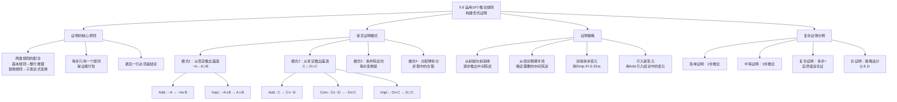

**相关笔记：** [[9.7 自然演绎系统]] | [[9.9 简化的真值表方法]]

> [!abstract] 概览
> 本节系统展示如何==综合运用全部19条推论规则==（9条基本论证形式 + 10条替换规则）构造形式证明。核心知识点包括：
> - **基本规则与替换规则的配合使用**：基本规则用于从整行推出新行，替换规则用于变换子表达式
> - **常见证明模式**：从否定推出蕴涵（$\sim A \therefore A \supset B$）、从肯定推出蕴涵（$C \therefore D \supset C$）等
> - **证明策略设计**：从前提向前演绎、从结论倒溯寻找、消除多余变元、引入新变元
> - **复杂证明的完整示例**：包括多前提、多步骤的自然语言论证形式化证明

---

## 一、知识结构总览

---

## 二、核心思想与证明技巧

> [!tip] 核心思想
> 运用19条规则构建形式证明的关键在于==两类规则的灵活配合==：==替换规则==负责"变换形式"——将陈述从一种逻辑形式转换为另一种等价形式（如将蕴涵变为析取、将合取变为析取等）；==基本论证规则==负责"推进推理"——从已有的整行陈述推出新的整行陈述。成功的证明策略需要在这两类规则之间找到合适的切换时机。

### 两类规则的配合使用

> [!example] 基本配合示例
> 论证：$A \supset B, C \supset \sim B \therefore A \supset \sim C$
>
> | 行号 | 陈述 | 理由 | 规则类型 |
> |:-----|:-----|:-----|:---------|
> | 1 | $A \supset B$ | 前提 | — |
> | 2 | $C \supset \sim B$ | 前提 | — |
> | 3 | $\sim\sim B \supset \sim C$ | 2, Trans. | 替换规则（变换子表达式） |
> | 4 | $B \supset \sim C$ | 3, D.N. | 替换规则（变换子表达式） |
> | 5 | $A \supset \sim C$ | 1, 4, H.S. | 基本规则（整行推理） |
>
> **分析：** 第3-4行用替换规则将第2行的形式逐步变换为与第1行可以"对接"的形式；第5行用基本规则完成最后的推理。

### 常见证明模式

#### 模式1：从否定推出蕴涵

> [!def] 证明模式：$\sim A \therefore A \supset B$
> 已知某陈述 $A$ 为假，证明 $A$ 蕴涵任何陈述 $B$。
>
> | 行号 | 陈述 | 理由 |
> |:-----|:-----|:-----|
> | 1 | $\sim A$ | 前提 |
> | 2 | $\sim A \lor B$ | 1, Add. |
> | 3 | $A \supset B$ | 2, Impl. |
>
> **直觉：** 一个假陈述实质蕴涵任何陈述。附加律引入 $B$，实质蕴涵律将析取转化为蕴涵。

#### 模式2：从肯定推出蕴涵

> [!def] 证明模式：$C \therefore D \supset C$
> 已知某陈述 $C$ 为真，证明任何陈述 $D$ 都蕴涵 $C$。
>
> | 行号 | 陈述 | 理由 |
> |:-----|:-----|:-----|
> | 1 | $C$ | 前提 |
> | 2 | $C \lor \sim D$ | 1, Add. |
> | 3 | $\sim D \lor C$ | 2, Com. |
> | 4 | $D \supset C$ | 3, Impl. |
>
> **直觉：** 一个真陈述被任何陈述实质蕴涵。关键技巧：==添加的是 $\sim D$ 而非 $D$==，因为 $\sim D \lor C$ 通过Impl.转化为 $D \supset C$，而 $C \lor D$ 通过Impl.转化为 $\sim C \supset D$（不是我们想要的）。

#### 模式3：分配律拆分

> [!def] 证明模式：$\sim B \lor (C \cdot D) \therefore B \supset C$
> 从析取陈述中提取所需的合取支。
>
> | 行号 | 陈述 | 理由 |
> |:-----|:-----|:-----|
> | 1 | $\sim B \lor (C \cdot D)$ | 前提 |
> | 2 | $(\sim B \lor C) \cdot (\sim B \lor D)$ | 1, Dist. |
> | 3 | $\sim B \lor C$ | 2, Simp. |
> | 4 | $B \supset C$ | 3, Impl. |
>
> **直觉：** 分配律将析取中的合取"拆开"为合取中的析取，然后用简化律提取所需的析取支，最后用实质蕴涵律转化为蕴涵形式。

### 证明策略设计

> [!tip] 证明策略的四步法
> 1. **分析结论**：结论中有哪些命题变元？它们以什么逻辑形式出现（蕴涵、析取、合取、否定）？
> 2. **定位变元**：这些变元在前提中如何出现？是否需要变换形式？
> 3. **设计路径**：从前提到结论需要经过哪些中间步骤？哪些替换规则可以"搭桥"？
> 4. **执行证明**：按照设计的路径，逐步应用规则，每步只用一个规则

### 复杂证明完整示例

> [!example] 复杂证明示例
> 论证：
> - (P1) $(R \lor S) \supset (T \cdot U)$
> - (P2) $\sim R \supset (V \supset \sim V)$
> - (P3) $\sim T$
> - $\therefore \sim V$
>
> **策略分析：** 结论 $\sim V$ 只出现在前提2中，被嵌套在长复合陈述内。要得到 $\sim V$，需要先得到 $V \supset \sim V$，然后通过Impl.和Taut.得到 $\sim V$。要得到 $V \supset \sim V$，需要 $\sim R$（通过M.P.），要得到 $\sim R$ 需要 $\sim(R \lor S)$（通过M.T.），要得到 $\sim(R \lor S)$ 需要 $\sim(T \cdot U)$（通过M.T.），而 $\sim(T \cdot U)$ 可以从 $\sim T$ 通过Add.和De M.得到。
>
> | 行号 | 陈述 | 理由 |
> |:-----|:-----|:-----|
> | 1 | $(R \lor S) \supset (T \cdot U)$ | 前提 |
> | 2 | $\sim R \supset (V \supset \sim V)$ | 前提 |
> | 3 | $\sim T$ | 前提 |
> | 4 | $\sim T \lor \sim U$ | 3, Add. |
> | 5 | $\sim(T \cdot U)$ | 4, De M. |
> | 6 | $\sim(R \lor S)$ | 1, 5, M.T. |
> | 7 | $\sim R \cdot \sim S$ | 6, De M. |
> | 8 | $\sim R$ | 7, Simp. |
> | 9 | $V \supset \sim V$ | 2, 8, M.P. |
> | 10 | $\sim V \lor \sim V$ | 9, Impl. |
> | 11 | $\sim V$ | 10, Taut. Q.E.D. |
>
> **分析：**
> - 第4-5行：从 $\sim T$ 出发，用附加律和De Morgan律构造 $\sim(T \cdot U)$
> - 第6行：用否定后件式（基本规则）从第1行和第5行推出 $\sim(R \lor S)$
> - 第7-8行：用De Morgan律和简化律提取 $\sim R$
> - 第9行：用肯定前件式（基本规则）从第2行和第8行推出 $V \supset \sim V$
> - 第10-11行：用Impl.和Taut.从 $V \supset \sim V$ 提取 $\sim V$
>
> Q.E.D.（Quod erat demonstrandum，拉丁语"证毕"）是传统上在证明结尾的标记。

---

## 三、补充理解与易混淆点

### 补充理解

> [!info] 补充1：证明中的规则选择策略
> **来源：** Kalish, D. & Montague, R. (1964). *Logic: Techniques of Formal Reasoning*. Harcourt, Brace & World.
>
> Kalish和Montague在《逻辑：形式推理的技术》中系统总结了形式证明中的规则选择策略，提出了==目标导向==（goal-directed）的证明方法：
>
> 1. **结论分析优先**：在开始证明之前，先仔细分析结论的逻辑结构。结论是蕴涵陈述？合取陈述？析取陈述？否定陈述？不同类型的结论暗示了不同的证明策略。
>
> 2. **"消除-引入"二分法**：
>    - **消除策略**：如果某个命题变元出现在前提中但不出现在结论中，考虑如何"消除"它。可用技巧包括简化律、假言三段论、分配律+简化律等
>    - **引入策略**：如果某个命题变元出现在结论中但不出现在前提中，考虑如何"引入"它。主要工具是附加律(Add.)
>
> 3. **形式匹配原则**：当两个陈述需要通过基本规则结合时（如H.S.需要 $p \supset q$ 和 $q \supset r$），确保它们的形式匹配。如果不匹配，先用替换规则调整形式。
>
> 4. **逆推法**：从结论出发倒推——结论 $A \supset B$ 可以从什么得到？可能需要 $A \supset C$ 和 $C \supset B$（H.S.），或者 $\sim A \lor B$（Impl.的逆用）。然后继续追问这些中间陈述从何而来。
>
> 这些策略的核心思想是：==证明不是盲目的试错，而是有计划的搜索==。

> [!info] 补充2：形式化方法在计算机科学中的应用
> **来源：** Huth, M. & Ryan, M. (2004). *Logic in Computer Science*. Cambridge University Press.
>
> 形式证明方法在计算机科学中有广泛而深远的应用：
>
> 1. **硬件验证**：用形式证明验证电路设计的正确性。例如，证明一个处理器的指令集实现与其规格说明一致。这需要构造复杂的形式证明，类似于我们在这里学习的证明技术。
>
> 2. **软件验证**：用形式方法证明程序满足其规格说明。例如，证明排序算法确实能将数组排序，证明并发程序不会死锁。
>
> 3. **类型系统**：编程语言的类型系统本质上是形式演绎系统。Hindley-Milner类型系统中的类型推断可以看作是一种形式证明——证明程序具有某种类型。
>
> 4. **安全协议验证**：用形式方法验证加密协议的安全性。例如，证明Needham-Schroeder协议确实能保证通信双方的身份认证。
>
> 5. **自动定理证明**：基于19条推论规则（及其扩展），计算机科学家开发了自动定理证明器（如SAT求解器、SMT求解器），它们可以在某些情况下自动构造形式证明。虽然一般的形式证明构造不是能行的，但在特定领域中，自动证明技术已经非常成熟。
>
> 这些应用表明，==形式逻辑不仅是哲学和数学的工具，更是现代计算机科学和工程的基础==。

### 易混淆点

> [!warning] 误区：基本规则和替换规则可以随意混用
> ❌ **错误理解：** 在任何步骤中，基本规则和替换规则可以互换使用，没有区别。
> ✅ **正确理解：** 基本规则和替换规则有不同的应用场景和限制。==替换规则用于"变换形式"==（将陈述从一种逻辑形式转换为另一种），==基本规则用于"推进推理"==（从已有陈述推出新陈述）。在构造证明时，通常先用替换规则调整形式，再用基本规则完成推理。
> **辨析：** 典型的证明模式是"替换-推理-替换-推理..."的交替进行。例如：
> - 先用Trans.将 $C \supset \sim B$ 变换为 $\sim\sim B \supset \sim C$（替换）
> - 再用D.N.将 $\sim\sim B$ 变换为 $B$（替换）
> - 最后用H.S.从 $A \supset B$ 和 $B \supset \sim C$ 推出 $A \supset \sim C$（基本推理）
>
> 如果混淆了两类规则的用途，可能会在不恰当的时候使用基本规则（如试图用Simp.提取子表达式），导致无效推理。

> [!warning] 误区：替换规则在子表达式上的应用没有边界
> ❌ **错误理解：** 替换规则可以应用于陈述中的任何部分，没有限制。
> ✅ **正确理解：** 替换规则可以应用于子表达式，但==替换必须严格基于某条替换规则的等价形式==，且替换后整个陈述的真值不变。替换的"自由度"在于位置（可以替换任何位置的子表达式），而不在于内容（必须严格等价）。
> **辨析：** 考虑陈述 $(A \supset B) \lor (C \supset D)$：
> - 可以用Impl.将 $A \supset B$ 替换为 $\sim A \lor B$，得到 $(\sim A \lor B) \lor (C \supset D)$ —— 合法
> - 可以用Trans.将 $C \supset D$ 替换为 $\sim D \supset \sim C$，得到 $(A \supset B) \lor (\sim D \supset \sim C)$ —— 合法
> - 可以同时替换两个析取支 —— 合法
> - 不可以将 $A \supset B$ 替换为 $B \supset A$ —— 不合法（逆命题不等于原命题）
> - 不可以将 $A \supset B$ 替换为 $A \cdot B$ —— 不合法（蕴涵不等于合取）

---

## 四、习题精选

> [!todo] 习题概览
> | 题号 | 核心考点 | 难度 |
> |:-----|:---------|:-----|
> | 1 | 综合运用多种规则完成证明 | ⭐⭐ |
> | 2 | 从否定/肯定推出蕴涵的证明模式 | ⭐⭐ |
> | 3 | 复杂多步证明 | ⭐⭐⭐ |

### 题1：综合运用多种规则

> [!problem] 题目
> 为以下论证构造一个有效性的形式证明：
> - (P1) $(D \cdot E) \supset F$
> - (P2) $(D \supset F) \supset G$
> - $\therefore E \supset G$

> [!faq]- 解答
> **[策略分析]：** 结论 $E \supset G$ 中，$G$ 出现在前提2的后件中，$E$ 出现在前提1的前件的合取中。如果能将前提1中的 $(D \cdot E)$ "重组"为以 $E$ 开头的蕴涵链，就可以用H.S.连接前提2。
>
> | 行号 | 陈述 | 理由 |
> |:-----|:-----|:-----|
> | 1 | $(D \cdot E) \supset F$ | 前提 |
> | 2 | $(D \supset F) \supset G$ | 前提 |
> | 3 | $(E \cdot D) \supset F$ | 1, Com. |
> | 4 | $E \supset (D \supset F)$ | 3, Exp. |
> | 5 | $E \supset G$ | 4, 2, H.S. |
>
> **分析：**
> - 第3行：用交换律(Com.)将 $(D \cdot E)$ 替换为 $(E \cdot D)$（替换子表达式）
> - 第4行：用输出律(Exp.)将 $(E \cdot D) \supset F$ 替换为 $E \supset (D \supset F)$（替换整行）
> - 第5行：用假言三段论(H.S.)从第4行和第2行推出结论（基本规则）
>
> $\blacksquare$

### 题2：从否定推出蕴涵

> [!problem] 题目
> 为以下论证构造形式证明：
> - (P1) $\sim A \supset A$
> - $\therefore A$

> [!faq]- 解答
> **[策略分析]：** 只有一个前提，需要从中提取结论 $A$。将条件陈述转化为析取陈述，利用双重否定律和重言律提取 $A$。
>
> | 行号 | 陈述 | 理由 |
> |:-----|:-----|:-----|
> | 1 | $\sim A \supset A$ | 前提 |
> | 2 | $\sim\sim A \lor A$ | 1, Impl. |
> | 3 | $A \lor A$ | 2, D.N. |
> | 4 | $A$ | 3, Taut. |
>
> **分析：**
> - 第2行：用Impl.将 $\sim A \supset A$ 转化为 $\sim\sim A \lor A$
> - 第3行：用D.N.将 $\sim\sim A$ 替换为 $A$
> - 第4行：用Taut.将 $A \lor A$ 化简为 $A$
>
> $\blacksquare$

### 题3：复杂多步证明

> [!problem] 题目
> 为以下论证构造一个有效性的形式证明：
> - (P1) $A \supset \sim B$
> - (P2) $\sim(C \cdot \sim A)$
> - $\therefore C \supset \sim B$

> [!faq]- 解答
> **[策略分析]：** 结论 $C \supset \sim B$ 包含前提1中的 $\sim B$ 和前提2中的 $C$。如果能将前提2转化为 $C \supset A$，则可以通过H.S.从 $C \supset A$ 和 $A \supset \sim B$ 得到 $C \supset \sim B$。
>
> | 行号 | 陈述 | 理由 |
> |:-----|:-----|:-----|
> | 1 | $A \supset \sim B$ | 前提 |
> | 2 | $\sim(C \cdot \sim A)$ | 前提 |
> | 3 | $\sim C \lor \sim\sim A$ | 2, De M. |
> | 4 | $\sim C \lor A$ | 3, D.N. |
> | 5 | $C \supset A$ | 4, Impl. |
> | 6 | $C \supset \sim B$ | 5, 1, H.S. |
>
> **分析：**
> - 第3行：用De Morgan律将 $\sim(C \cdot \sim A)$ 转化为析取形式
> - 第4行：用D.N.简化双重否定
> - 第5行：用Impl.将析取转化为蕴涵
> - 第6行：用H.S.连接第5行和第1行
>
> **替代证明路径：** 第3行之后，也可以保留析取形式，用不同的顺序应用D.N.和Impl.，最终得到相同结论。这说明了形式证明的路径可能不唯一。
>
> $\blacksquare$

> [!tip] 解题思路提示
> 构造形式证明的实用检查清单：
> 1. **列出所有前提和结论**，明确需要连接的命题变元
> 2. **检查结论类型**——蕴涵？合取？析取？否定？不同类型暗示不同策略
> 3. **识别"桥梁"变元**——在前提和结论中都出现的变元，它们是推理的"连接点"
> 4. **检查形式匹配**——需要结合的陈述是否形式匹配？如果不匹配，用替换规则调整
> 5. **注意"多余"变元**——前提中出现但结论中不出现的变元需要被消除
> 6. **注意"缺失"变元**——结论中出现但前提中不出现的变元需要被引入（通常用Add.）
> 7. **验证每一步**——确保每步只使用一个规则，且规则应用正确

---

## 五、视频学习指南

> [!info] 视频资源
> | 资源 | 链接 | 对应内容 | 备注 |
> |:-----|:-----|:---------|:-----|
> | Wireless Philosophy: Natural Deduction Proofs | [链接](https://www.youtube.com/playlist?list=PLtDyWVKRDCGJpJOZqPbMb1bL1GgY6YxG) | 自然演绎证明构造 | 英文，配合动画讲解 |
> | Kevin deLaplante: Proof Strategies | [链接](https://www.youtube.com/watch?v=0bO0R1VDMWg) | 证明策略 | 英文，系统讲解 |
> | The Logic Lab: Proof Exercises | [链接](https://www.logiclab.be/) | 交互式证明练习 | 在线练习平台 |

---

## 六、教材原文

> [!quote] 教材原文
> **来源：** 逻辑学导论 第15版，第9章第8节
>
> **两类规则的配合：**
> 现在我们手中的推理规则变成了19个，而不再是原来的9个，这使构建形式证明的任务在某种意义上变得更为复杂。当然，目标仍然保持不变，但是在证明的过程中涉及了对一个更大的智力工具箱的检查。我们设计的导向结论的完整逻辑链，现在可能包括得到基本有效论证形式或得到逻辑等价式之辩护的步骤。任何给定的证明都可能包含这两类规则。二者之间的平衡和顺序的选择只取决于我们完成证明之策略的逻辑需要。
>
> **常见证明模式：**
> 从~A推出A⊃B：如果已知~A为真，则A必定为假。一个假陈述实质蕴涵任何陈述。所以，如果我们知道~A，则无论B断言的是什么，A⊃B一定为真。在这个例子中，~A是给定的前提，我们只需要加上所需的B，然后运用实质蕴涵律即可。
>
> 从C推出D⊃C：D在结论中出现，但是在前提中没有出现，所以我们必须想办法在证明中将D引入。我们可以简单添加D，但是这不会成功，因为添加D之后获得了一个析取陈述，在交换了其析取支之后，运用实质蕴涵律，则可以用一个条件陈述~D⊃C来替换前述交换了析取支之后获得的析取陈述，而我们得到的这个条件陈述显然不是我们所要找的结论。我们想要得到的是D⊃C，为了得到这个结果，我们必须首先添加~D而不是D。
>
> **复杂证明的策略：**
> 通过仔细审查论证，我们试图表明做行动计划的必要性，以及设计这种计划的方法。结论中包含了第一个前提中的~B和第二个前提中的C。如何能达到这一结论呢？第一个前提是一个以~B为后件的条件陈述，而~B也是结论的后件。第二个前提包含对第一个前提中前件的否定~A。如果我们能将第二个前提转化为C⊃A，则我们能通过假言三段论得到所需的结论。
>
> **Q.E.D.：**
> 传统的做法是在证明的结尾写上Q.E.D.，它是拉丁表达式Quod erat demonstrandum的首字母缩写，意思是证毕。

---

## 参见 Wiki

- [[有效性]] — 论证有效性的定义，形式证明用于证明有效性
- [[逻辑学/concepts/逻辑等价]] — 逻辑等价的定义，替换规则的理论基础
- [[9.7 自然演绎系统]] — 19条规则的完备性、冗余性和能行性
- [[9.6 扩展推论规则：替换规则]] — 10条替换规则的详细说明
- [[9.9 简化的真值表方法]] — 与形式证明互补的判定方法

#学习/逻辑学/命题逻辑Ⅱ
