**相关笔记：** [[8.7 根据真值表验证论证：完备的真值表方法]] | [[9.10 不相容性]]

> [!abstract] 概览
> 本节介绍==简化的真值表方法==（Simplified Truth Table Technique, STTT），也称==归谬法==（Reductio ad Absurdum），是一种比完备真值表方法（CTTM）更高效的论证有效性判定方法。核心知识点包括：
> - **STTT的基本原理**：试图构造一个使前提皆真而结论为假的真值指派——如果成功则论证无效，如果失败则论证有效
> - **强制赋值与非强制赋值**：由逻辑结构决定的真值指派 vs 需要尝试所有可能的真值指派
> - **四步程序**：步骤1（选择序列）→ 步骤2（C-序列或P-序列）→ 步骤3（强制赋值）→ 步骤4（验证有效性）
> - **判定准则I-V**：指导高效构造简化真值表的五条准则

---

## 一、知识结构总览

```mermaid
graph TB
    A["9.9 简化的真值表方法<br/>STTT / 归谬法"] --> B["基本原理"]
    A --> C["核心概念"]
    A --> D["四步程序"]
    A --> E["判定准则I-V"]
    A --> F["有效性判定"]

    B --> B1["核心思想：反例搜索<br/>试图使前提皆真结论为假"]
    B --> B2["与CTTM的关系<br/>CTTM穷举验证，STTT反例搜索"]
    B --> B3["效率优势<br/>1行 vs 16行/32行/64行"]

    C --> C1["强制赋值<br/>Forced Assignment<br/>由逻辑结构唯一决定"]
    C --> C2["非强制赋值<br/>Non-forced Assignment<br/>需要尝试多种可能"]
    C --> C3["引导列<br/>Guide Columns<br/>记录简单陈述的真值"]

    D --> D1["步骤1：选择序列<br/>C-序列 vs P-序列"]
    D --> D2["步骤2C：使结论为假"]
    D --> D3["步骤2P：使所有前提为真"]
    D --> D4["步骤3C：尽量使更多前提为真"]
    D --> D5["步骤3P：使结论为假"]
    D --> D6["步骤4：验证有效性"]

    D1 --> D1a["C-序列：结论为假的方式<br/>不多于前提为真的方式"]
    D1 --> D1b["P-序列：存在前提为真的方式<br/>少于结论为假的方式"]

    E --> E1["准则I：优先强制赋值"]
    E --> E2["准则II：先简单后复合"]
    E --> E3["准则III：非强制赋值策略"]
    E --> E4["准则IV：左边优先"]
    E --> E5["准则V：按TT/TF/FT/FF顺序"]

    F --> F1["无效：找到一行<br/>前提皆真且结论为假"]
    F --> F2["有效：所有行中<br/>不存在前提皆真结论为假"]
    F --> F3["有效情形a：每种假结论<br/>都有至少一个假前提"]
    F --> F4["有效情形b：所有真前提<br/>中结论都为真"]
    F --> F5["有效情形c：结论不可能假<br/>且/或前提不可能真"]
```

---

## 二、核心思想与证明技巧

> [!tip] 核心思想
> STTT的核心思想是==反例搜索==（counterexample search）：不穷举所有真值组合（如CTTM那样），而是==有针对性地搜索==是否存在一种真值指派使得前提皆真而结论为假。如果找到这样的指派，论证就是无效的（反例存在）；如果穷尽所有可能性都找不到，论证就是有效的（反例不存在）。这种方法本质上是==归谬法==（Reductio ad Absurdum）在真值表判定中的应用。

### STTT与CTTM的对比

| 特征 | CTTM（完备真值表） | STTT（简化真值表） |
|:-----|:-------------------|:-------------------|
| 方法 | 穷举所有真值组合 | 有针对性地搜索反例 |
| 行数 | $2^n$（n为命题变元数） | 通常1-3行 |
| 方向 | 穷举验证 | 反例搜索 |
| 能行性 | 完全能行（机械构造） | 完全能行（机械构造） |
| 效率 | 低（指数增长） | 高（通常只需几行） |
| 适用场景 | 简单论证（变元少） | 复杂论证（变元多） |

### 强制赋值与非强制赋值

> [!def] 强制赋值
> **强制赋值**（Forced Assignment）是指由以下三个因素共同决定、没有选择余地的真值指派：
> 1. 简单陈述和复合陈述的==真值函项特性==（如合取为真要求两个合取支都为真）
> 2. 我们的==目标==（使结论为假或使前提为真）
> 3. ==已经设定的真值指派==（已赋值的变元约束后续赋值）

**强制赋值的典型情形：**

| 目标 | 复合陈述 | 强制赋值 | 原因 |
|:-----|:---------|:---------|:-----|
> 使其为假 | $D \supset H$ | $D = T, H = F$ | 条件陈述仅在前件真后件假时为假 |
| 使其为真 | $E \cdot F$ | $E = T, F = T$ | 合取陈述仅当两合取支都真时为真 |
| 使其为假 | $G \lor J$ | $G = F, J = F$ | 析取陈述仅当两析取支都假时为假 |
| 使其为真 | $R \supset M$（已知 $M = F$） | $R = F$ | 后件为假时，条件陈述仅当前件为假时为真 |
| 使其为真 | $\sim G$ | $G = F$ | 否定陈述与被否定陈述真值相反 |

> [!def] 非强制赋值
> **非强制赋值**（Non-forced Assignment）是指存在多种选择余地的真值指派。例如：
> - 使 $K \cdot N$ 为假：有三种方式（$T \cdot F$、$F \cdot T$、$F \cdot F$），需要逐一尝试
> - 使 $Q \lor R$ 为真：有三种方式（$T \cdot T$、$T \cdot F$、$F \cdot T$），需要逐一尝试

### STTT四步程序

#### 步骤1：选择序列

> [!def] 步骤1：确定C-序列还是P-序列
> 比较使结论为假的方式数与使前提为真的方式数：
> - 如果==没有前提为真的方式少于结论为假的方式==，执行==C-序列==（步骤2C、3C、4）
> - 如果==存在前提为真的方式少于结论为假的方式==，执行==P-序列==（步骤2P、3P、4）

**选择依据：** 选择行数更少的序列，以最小化工作量。

#### 步骤2C：使结论为假

为结论中的简单陈述指派真值以使结论为假。如果有多种方式使结论为假，为每种方式构建一个简化真值表行。

#### 步骤2P：使所有前提为真

从使最少方式为真的前提开始，指派真值给前提中的简单陈述以使所有前提为真。

#### 步骤3C：尽量使更多前提为真

对每一种使结论为假的真值指派，通过设置强制的真值指派，尽力使所有前提为真。

#### 步骤3P：使结论为假

对每一种使所有前提为真的真值指派，通过设置强制的真值指派，尽力使结论为假。

#### 步骤4：验证有效性

- **无效：** 如果某一行中所有前提皆真且结论为假，==立即停止==——论证无效
- **有效：** 以下三种情形之一即可证明有效：
  - (a) 对于所有为假的结论，至少有一个前提为假
  - (b) 所有前提为真的情形中，结论都为真
  - (c) 结论不可能为假，且/或前提不可能为真

### 判定准则I-V

> [!def] 五条判定准则
> **准则I：** 如果可能，首先给结论或某个前提设定强制的真值指派
>
> **准则II：** 在给复杂的复合前提设置强制赋值之前，先为前提中的简单陈述或简单陈述的否定设置强制赋值
>
> **准则III：** 如果不存在（或不再有）强制赋值，就给结论设定非强制赋值，使结论在每种可能情形下都为假；或以最少的方式给前提设置非强制赋值
>
> **准则IV：** 如果给两个或多个前提设置真值指派都是同等强制的或同等非强制的，先给==左边==的陈述进行赋值
>
> **准则V：** 在构造多行简化真值表时，仅利用能得到目标真值的真值组合，并按完备真值表中的顺序（TT、TF、FT、FF）构造

### 完整示例

> [!example] 示例1：结论为简单陈述（有效论证）
> 论证：$F \supset G, F \therefore G$
>
> | $F$ | $G$ | $F \supset G$ | , | $F$ | $\therefore$ | $G$ |
> |:---:|:---:|:---:|:---:|:---:|:---:|:---:|
> | $T$ | $F$ | $F$ | | $T$ | | $F$ |
>
> **分析：** 结论 $G$ 为假（步骤2C）。为使前提2为真，$F$ 必须为真（步骤3C）。但 $F = T$ 且 $G = F$ 使得前提1 $F \supset G$ 为假。因此，不存在使所有前提为真且结论为假的真值指派——==论证有效==。

> [!example] 示例2：结论为条件陈述（无效论证）
> 论证：$(B \supset W) \cdot (G \supset \sim S), (\sim B \cdot \sim G) \supset (C \cdot P), \sim W, P \therefore C \supset \sim G$
>
> **分析：** 结论 $C \supset \sim G$ 为假，强制 $C = T, G = T$（步骤2C）。根据准则II，先处理简单陈述的否定：$\sim W$ 为真 $\Rightarrow W = F$；$P$ 为真。这些强制赋值使得前提2为真（因为 $C \cdot P = T \cdot T = T$）。对于前提1，$B \supset W$ 中 $W = F$，要使之为真需要 $B = F$；$G \supset \sim S$ 中 $G = T$，要使之为真需要 $\sim S = T$ 即 $S = F$。所有前提为真且结论为假——==论证无效==。

> [!example] 示例3：结论为合取陈述（有效论证，多行）
> 论证：$M \lor N, (M \lor N) \supset O, (M \lor N) \supset P \therefore O \cdot P$
>
> 结论 $O \cdot P$ 为假有三种方式：$O=T,P=F$；$O=F,P=T$；$O=F,P=F$。
>
> **第1行（$O=T, P=F$）：** 前提3中 $P=F$，需要 $M \lor N = F$，即 $M=F, N=F$。但 $M=F, N=F$ 使前提1 $M \lor N$ 为假。前提不可能皆真。
>
> **第2行（$O=F, P=T$）：** 前提2中 $O=F$，需要 $M \lor N = F$，即 $M=F, N=F$。但 $M=F, N=F$ 使前提1为假。前提不可能皆真。
>
> **第3行（$O=F, P=F$）：** 前提2中 $O=F$，需要 $M \lor N = F$，即 $M=F, N=F$。但 $M=F, N=F$ 使前提1为假。前提不可能皆真。
>
> 三种方式都使至少一个前提为假——==论证有效==。

---

## 三、补充理解与易混淆点

### 补充理解

> [!info] 补充1：归谬法在数学证明中的历史
> **来源：** Szabo, A. (1964). *The Transformation of Mathematics into Deductive Science*. Journal of Symbolic Logic.
>
> 归谬法（Reductio ad Absurdum，拉丁语"归结为荒谬"）是西方数学和逻辑中最古老、最强大的证明方法之一。其历史可以追溯到：
>
> - **古希腊时期**：归谬法被广泛应用于欧几里得《几何原本》中。例如，证明"存在无穷多个素数"就使用了归谬法——假设素数只有有限个，推出矛盾。
> - **芝诺悖论**（约公元前5世纪）：芝诺（Zeno of Elea）使用归谬法论证运动是不可能的——假设运动存在，推出矛盾。
> - **亚里士多德**（公元前4世纪）：在《前分析篇》中系统讨论了归谬法在逻辑推理中的应用。
>
> STTT本质上是归谬法在命题逻辑中的==算法化==应用：
> - 假设论证无效（即存在前提皆真而结论为假的情形）
> - 试图构造这样的真值指派
> - 如果导致矛盾（某个前提被迫为假），则论证有效
> - 如果成功构造，则论证确实无效
>
> 理解STTT的归谬法本质，有助于将其与更广泛的数学证明方法联系起来——归谬法不仅用于命题逻辑，还广泛应用于数学的各个分支。

> [!info] 补充2：真值表方法的计算复杂性
> **来源：** Cook, S.A. (1971). *The Complexity of Theorem-Proving Procedures*. Proceedings of STOC.
>
> Stephen Cook在1971年的开创性论文中证明了==布尔可满足性问题（SAT）==是NP完全的。这一结果与真值表方法有着直接的关系：
>
> - **CTTM的计算复杂度**：对于有 $n$ 个命题变元的论证，完备真值表有 $2^n$ 行。这意味着CTTM的时间复杂度是 $O(2^n)$——==指数时间==。当 $n$ 较大时（如 $n = 20$，$2^{20} = 1,048,576$），CTTM在实际中变得不可行。
>
> - **STTT的计算复杂度**：STTT在最坏情况下仍然可能是指数时间的（因为可能需要尝试所有真值组合），但在实践中通常远比CTTM高效。STTT的效率取决于强制赋值能在多大程度上缩小搜索空间。
>
> - **SAT求解器**：现代SAT求解器（如DPLL算法、CDCL算法）本质上是STTT的智能化扩展。它们使用==回溯搜索==、==单元传播==（类似于强制赋值）和==学习机制==来高效地搜索反例。
>
> Cook的NP完全性理论告诉我们：==不存在已知的多项式时间算法来判定命题逻辑论证的有效性==（假设 $P \neq NP$）。这意味着无论是CTTM还是STTT，在最坏情况下都需要指数时间。但STTT（及其现代变体SAT求解器）在实际中通常比CTTM高效得多。

### 易混淆点

> [!warning] 误区：STTT和CTTM只是效率不同，结果相同
> ❌ **错误理解：** STTT只是CTTM的"简化版"，两者做的事情完全一样，只是STTT更快。
> ✅ **正确理解：** STTT和CTTM虽然都能判定论证的有效性，但它们的==方法论完全不同==。CTTM是==穷举验证==——检查所有真值组合，确认不存在反例；STTT是==反例搜索==——有针对性地搜索是否存在反例。这种差异不仅是效率上的，更是思维方法上的。
> **辨析：**
> - CTTM的回答是："我检查了所有可能性，没有发现反例，所以论证有效。"
> - STTT的回答是："我试图构造反例，但每次尝试都失败了（导致矛盾），所以论证有效。"
> - STTT的归谬法思维在数学证明中更为常见和自然——"假设结论不成立，推出矛盾"
> - 在实践中，STTT通常只需要1-3行，而CTTM可能需要16、32甚至64行

> [!warning] 误区：强制赋值和非强制赋值的区别不重要
> ❌ **错误理解：** 在STTT中，所有真值指派都是一样的，不需要区分强制赋值和非强制赋值。
> ✅ **正确理解：** ==区分强制赋值和非强制赋值是STTT高效性的关键==。强制赋值由逻辑结构唯一决定，不需要尝试其他可能性；非强制赋值有多种选择，需要逐一尝试。正确识别哪些赋值是强制的，可以大大减少需要尝试的真值组合数量。
> **辨析：**
> - **强制赋值**：使 $D \supset H$ 为假 $\Rightarrow$ 必须且只能 $D = T, H = F$。没有其他选择。
> - **非强制赋值**：使 $K \cdot N$ 为假 $\Rightarrow$ 有三种选择（$T \cdot F$、$F \cdot T$、$F \cdot F$），需要逐一尝试。
> - 如果错误地将强制赋值当作非强制赋值（认为有多种选择），会浪费时间去尝试不可能的情况
> - 如果错误地将非强制赋值当作强制赋值（只尝试一种选择就停止），可能会遗漏真正的反例，导致错误的结论
> - ==准则I和准则II的设计目的就是最大化强制赋值的使用，最小化非强制赋值的尝试==

---

## 四、习题精选

> [!todo] 习题概览
> | 题号 | 核心考点 | 难度 |
> |:-----|:---------|:-----|
> | 1 | 用STTT判定简单论证的有效性 | ⭐ |
> | 2 | 用STTT判定需要多行的论证 | ⭐⭐ |
> | 3 | 选择C-序列或P-序列并完成判定 | ⭐⭐⭐ |

### 题1：用STTT判定简单论证

> [!problem] 题目
> 用STTT方法判定以下论证的有效性：
> - (P1) $D \supset G$
> - (P2) $G \supset H$
> - $\therefore D \supset H$

> [!faq]- 解答
> **[步骤1]** 选择序列：结论 $D \supset H$ 为假只有一种方式（$D = T, H = F$）。没有前提为真的方式更少。执行C-序列。
>
> **[步骤2C]** 使结论为假：$D \supset H$ 为假 $\Rightarrow$ $D = T, H = F$。
>
> **[步骤3C]** 尽量使前提为真：
> - 前提1：$D \supset G$，已知 $D = T$，要使之为真需要 $G = T$
> - 前提2：$G \supset H$，已知 $G = T, H = F$，所以 $G \supset H = F$
>
> **[步骤4]** 验证：前提2为假，不可能所有前提皆真且结论为假。
>
> | $D$ | $G$ | $H$ | $D \supset G$ | , | $G \supset H$ | $\therefore$ | $D \supset H$ |
> |:---:|:---:|:---:|:---:|:---:|:---:|:---:|:---:|
> | $T$ | $T$ | $F$ | $T$ | | $F$ | | $F$ |
>
> **结论：** ==论证有效==。使结论为假的唯一真值指派（$D=T, H=F$）迫使前提2为假。
>
> $\blacksquare$

### 题2：用STTT判定需要多行的论证

> [!problem] 题目
> 用STTT方法判定以下论证的有效性：
> - (P1) $M \lor N$
> - (P2) $(M \lor N) \supset O$
> - (P3) $(M \lor N) \supset P$
> - $\therefore O \cdot P$

> [!faq]- 解答
> **[步骤1]** 选择序列：结论 $O \cdot P$ 为假有三种方式（$T \cdot F, F \cdot T, F \cdot F$）。没有前提为真的方式少于三种。执行C-序列。
>
> **[步骤2C]** 使结论为假：需要尝试三种真值组合。
>
> **第1行（$O = T, P = F$）：**
> - 前提3：$(M \lor N) \supset P$，$P = F$，要使之为真需要 $M \lor N = F$，即 $M = F, N = F$
> - 前提1：$M \lor N = F \lor F = F$ —— 前提1为假
> - 前提不可能皆真
>
> **第2行（$O = F, P = T$）：**
> - 前提2：$(M \lor N) \supset O$，$O = F$，要使之为真需要 $M \lor N = F$，即 $M = F, N = F$
> - 前提1：$M \lor N = F \lor F = F$ —— 前提1为假
> - 前提不可能皆真
>
> **第3行（$O = F, P = F$）：**
> - 前提2：$(M \lor N) \supset O$，$O = F$，要使之为真需要 $M \lor N = F$，即 $M = F, N = F$
> - 前提1：$M \lor N = F \lor F = F$ —— 前提1为假
> - 前提不可能皆真
>
> **[步骤4]** 验证：三种使结论为假的真值组合都使前提1为假。
>
> **结论：** ==论证有效==。穷尽所有使结论为假的真值组合，每种都至少使一个前提为假。
>
> $\blacksquare$

### 题3：选择C-序列或P-序列

> [!problem] 题目
> 用STTT方法判定以下论证的有效性：
> - (P1) $J \lor K$
> - (P2) $\sim J$
> - (P3) $G \supset H$
> - (P4) $G$
> - $\therefore H \cdot K$

> [!faq]- 解答
> **[步骤1]** 选择序列：结论 $H \cdot K$ 为假有三种方式。但前提2 $\sim J$ 为真只有一种方式（$J = F$），前提4 $G$ 为真也只有一种方式（$G = T$）。==存在前提为真的方式少于结论为假的方式==，执行==P-序列==。
>
> **[步骤2P]** 使所有前提为真：
> - 前提2：$\sim J$ 为真 $\Rightarrow$ $J = F$（强制赋值）
> - 前提4：$G$ 为真 $\Rightarrow$ $G = T$（强制赋值）
> - 前提1：$J \lor K$，$J = F$，要使之为真需要 $K = T$（强制赋值）
> - 前提3：$G \supset H$，$G = T$，要使之为真需要 $H = T$（强制赋值）
>
> **[步骤3P]** 使结论为假：结论 $H \cdot K$，但 $H = T, K = T$，所以 $H \cdot K = T$。==结论不可能为假==。
>
> **[步骤4]** 验证：使所有前提为真的唯一真值指派（$J = F, G = T, K = T, H = T$）也使结论为真。
>
> | $J$ | $K$ | $G$ | $H$ | $J \lor K$ | , | $\sim J$ | , | $G \supset H$ | , | $G$ | $\therefore$ | $H \cdot K$ |
> |:---:|:---:|:---:|:---:|:---:|:---:|:---:|:---:|:---:|:---:|:---:|:---:|:---:|
> | $F$ | $T$ | $T$ | $T$ | $T$ | | $T$ | | $T$ | | $T$ | | $T$ |
>
> **结论：** ==论证有效==。P-序列只需一行就完成了判定，比C-序列（需要三行）更高效。
>
> $\blacksquare$

> [!tip] 解题思路提示
> STTT方法的使用流程：
> 1. **步骤1最关键**——正确选择C-序列或P-序列可以大幅减少工作量。比较使结论为假的方式数和使每个前提为真的方式数
> 2. **优先使用强制赋值**——准则I和准则II确保我们优先处理确定性最高的赋值
> 3. **注意一致性**——同一个命题变元在论证中的所有出现必须赋相同的真值
> 4. **多行时逐行处理**——对于非强制赋值，每次只处理一行，完成后再处理下一行
> 5. **及时停止**——一旦在某一行中发现前提皆真且结论为假，立即停止（论证无效）
> 6. **穷尽所有可能性**——要证明论证有效，必须穷尽所有使结论为假的真值组合

---

## 五、视频学习指南

> [!info] 视频资源
> | 资源 | 链接 | 对应内容 | 备注 |
> |:-----|:-----|:---------|:-----|
> | Wireless Philosophy: Truth Tables | [链接](https://www.youtube.com/playlist?list=PLtDyWVKRDCGK2z8wXFcBcJnF7eXwV3mP) | 真值表方法 | 英文，包含简化真值表 |
> | Kevin deLaplante: Short-Circuit Truth Tables | [链接](https://www.youtube.com/watch?v=IVT3kPbE_3E) | 简化真值表 | 英文，系统讲解 |
> | The Logic Lab: Truth Table Exercises | [链接](https://www.logiclab.be/) | 交互式真值表练习 | 在线练习平台 |

---

## 六、教材原文

> [!quote] 教材原文
> **来源：** 逻辑学导论 第15版，第9章第9节
>
> **STTT的动机：**
> 对于一个非有效的论证来说，当然不存在一个有效的形式证明。然而，如果我们没有发现一个有效的形式证明，这并不证明一个论证就是无效的，也无法得出这样的证明不能被构造。它可能仅仅意味着，我们尚没有进行足够的尝试。未找到一个有效性的形式证明，不能够证明一个论证就是无效的。那么，如何证明一个给定的论证是无效的呢？
>
> **STTT的基本原理：**
> STTT的动机是，既然我们仅需要检查结论为假的那些情形（或者所有前提为真的情形），那么仅针对结论为假的情形（或者所有前提为真的情形）建立的简化真值表就会更为高效得多。
>
> **无效性与有效性：**
> 无效性：通过证明一个论证可能前提皆真而结论为假，这样的简化真值表就证明了一个论证是无效的。有效性：通过证明一个论证不可能出现前提皆真而结论为假，这样的简化真值表就证明了一个论证是有效的。
>
> **强制赋值的定义：**
> 我们把强制的真值指派定义为一个简单或复合陈述的真值指派，它需要满足：(i)简单陈述和复合陈述的真值函项特性，(ii)我们的目标，以及/或者(iii)已经设定的真值指派。
>
> **四步程序总结：**
> 步骤1：确定是否前提为真要比结论为假的方式更少。步骤2：或者(C)使得结论为假，或(P)使得所有前提为真。步骤3：或者(C)尽量使得更多的前提为真，或(P)使得结论为假。步骤4：验证有效性。

---

## 参见 Wiki

- [[真值表]] — 真值表的构造方法与语义基础
- [[有效性]] — 论证有效性的定义，STTT用于判定有效性
- [[重言式与矛盾式]] — 重言式和矛盾式的定义，与STTT判定密切相关
- [[8.7 根据真值表验证论证：完备的真值表方法]] — CTTM方法，STTT的对比参照
- [[9.10 不相容性]] — STTT在不相容性判定中的应用
- [[间接证明|归谬法]] — 归谬法的完整概念页，STTT的哲学基础
- [[间接证明]] — 间接证明（归谬法）的完整概念页

#学习/逻辑学/命题逻辑Ⅱ
