**相关笔记：** [[8.10 逻辑等价]] | [[10.1 对量化的呼唤|10.1 谓词逻辑概览]]

> [!abstract] 概览
> 第9章是命题逻辑的核心应用篇章，系统引入了形式证明（自然演绎）方法。全章从形式证明的基本概念出发（[[9.1 有效性的形式证明]]），引入9条基本推论规则（[[9.2 基本的有效论证形式]]），通过示例与策略讲解逐步深入（[[9.3 有效性形式证明示例]]、[[9.4 有效性形式证明的构造]]、[[9.5 构造更复杂的形式证明]]），然后扩展至10条替换规则（[[9.6 扩展推论规则：替换规则]]），讨论19条规则的完备性与冗余性（[[9.7 自然演绎系统]]），展示综合运用（[[9.8 运用19个推论规则构建形式证明]]），再介绍简化真值表方法作为补充验证工具（[[9.9 简化的真值表方法]]），最后讨论不相容性（[[9.10 不相容性]]）、条件证明（[[9.11 条件证明]]）、间接证明（[[9.12 间接证明]]），并以可靠性论证与笃证性论证的辨别收束全章（[[9.13 可靠性论证与笃证性论证的辨别]]）。

---

## 一、全章知识框架

```mermaid
graph TB
    CH["第09章 命题逻辑Ⅱ：演绎方法"]

    CH --> A["形式证明基础<br/>9.1-9.5"]
    CH --> B["扩展规则与系统<br/>9.6-9.9"]
    CH --> C["高级证明技术<br/>9.10-9.13"]

    A --> A1["9.1 形式证明概念"]
    A --> A2["9.2 九条基本规则"]
    A --> A3["9.3 证明示例"]
    A --> A4["9.4 证明构造策略"]
    A --> A5["9.5 复杂证明"]

    B --> B1["9.6 十条替换规则"]
    B --> B2["9.7 自然演绎系统"]
    B --> B3["9.8 综合运用"]
    B --> B4["9.9 简化真值表"]

    C --> C1["9.10 不相容性"]
    C --> C2["9.11 条件证明CP"]
    C --> C3["9.12 间接证明IP"]
    C --> C4["9.13 可靠性vs笃证性"]

    A1 --> A1a["自然演绎<br/>Gentzen系统"]
    A1 --> A1b["推论规则定义"]
    A1 --> A1c["代入例"]
    A1 --> A1d["陈述列+理由列"]

    A2 --> A2a["MP·MT·HS·CD"]
    A2 --> A2b["Simp·Add·Conj·Com·Abs"]

    B1 --> B1a["De M·Com·Assoc·Dist"]
    B1 --> B1b["DN·Trans·Impl·Equiv"]
    B1 --> B1c["Exp·Taut"]
    B1 --> B1d["关键区别：替换规则<br/>可应用于子表达式"]

    B2 --> B2a["完备性：所有有效论证<br/>都能被证明"]
    B2 --> B2b["冗余性：某些规则<br/>可从其他规则推出"]
    B2 --> B2c["能行性：存在机械<br/>程序验证证明"]

    C2 --> C2a["假设前件→推导后件→消去"]
    C2 --> C2b["嵌套CP"]
    C2 --> C2c["证明重言式"]

    C3 --> C3a["假设结论否定→推导矛盾"]
    C3 --> C3b["IP可从CP推出（冗余）"]
    C3 --> C3c["IP vs CP选择策略"]
```



---

## 二、核心知识点汇总

### 2.1 十九条推论规则完整表

> [!tip] 规则分类记忆
> ==9条基本论证规则==用于从整行推出新行；==10条替换规则==用于在子表达式层面做等价替换。两类规则配合使用，构成完整的自然演绎系统。

**9条基本论证规则（只能应用于整行）：**

| 编号 | 名称 | 缩写 | 形式 | 直觉 |
|:----:|:-----|:----:|:-----|:-----|
| 1 | 肯定前件式 | M.P. | $p \supset q,\; p,\; \therefore q$ | 肯定前件→肯定后件 |
| 2 | 否定后件式 | M.T. | $p \supset q,\; \sim q,\; \therefore \sim p$ | 否定后件→否定前件 |
| 3 | 假言三段论 | H.S. | $p \supset q,\; q \supset r,\; \therefore p \supset r$ | 蕴涵的传递性 |
| 4 | 析取三段论 | D.S. | $p \lor q,\; \sim p,\; \therefore q$ | 否定一支→肯定另一支 |
| 5 | 构造性二难式 | C.D. | $(p \supset q) \cdot (r \supset s),\; p \lor r,\; \therefore q \lor s$ | 两条路都通 |
| 6 | 简化律 | Simp. | $p \cdot q,\; \therefore p$ | 从合取中取出一个合取支 |
| 7 | 合取律 | Conj. | $p,\; q,\; \therefore p \cdot q$ | 将两个真陈述合取 |
| 8 | 附加律 | Add. | $p,\; \therefore p \lor q$ | 附加一个析取支 |
| 9 | 交换律 | Com. | $p \cdot q,\; \therefore q \cdot p$ | 交换合取支/析取支顺序 |

**10条替换规则（可应用于子表达式）：**

| 编号 | 名称 | 缩写 | 形式 |
|:----:|:-----|:----:|:-----|
| 10 | De Morgan律 | De M. | $\sim(p \lor q) \equiv \sim p \cdot \sim q$；$\sim(p \cdot q) \equiv \sim p \lor \sim q$ |
| 11 | 交换律 | Com. | $p \cdot q \equiv q \cdot p$；$p \lor q \equiv q \lor p$ |
| 12 | 结合律 | Assoc. | $p \cdot (q \cdot r) \equiv (p \cdot q) \cdot r$；$p \lor (q \lor r) \equiv (p \lor q) \lor r$ |
| 13 | 分配律 | Dist. | $p \cdot (q \lor r) \equiv (p \cdot q) \lor (p \cdot r)$；$p \lor (q \cdot r) \equiv (p \lor q) \cdot (p \lor r)$ |
| 14 | 双重否定律 | D.N. | $p \equiv \sim\sim p$ |
| 15 | 易位律 | Trans. | $p \supset q \equiv \sim q \supset \sim p$ |
| 16 | 实质蕴涵律 | Impl. | $p \supset q \equiv \sim p \lor q$ |
| 17 | 实质等值律 | Equiv. | $p \equiv q \equiv (p \supset q) \cdot (q \supset p) \equiv (p \cdot q) \lor (\sim p \cdot \sim q)$ |
| 18 | 输出律 | Exp. | $(p \cdot q) \supset r \equiv p \supset (q \supset r)$ |
| 19 | 重言律 | Taut. | $p \equiv p \lor p$；$p \equiv p \cdot p$ |

### 2.2 基本规则 vs 替换规则的关键区别

| 维度 | 基本论证规则（1-9） | 替换规则（10-19） |
|:-----|:-------------------|:------------------|
| 逻辑性质 | 有效论证形式 | 逻辑等价式（重言双条件） |
| 应用范围 | ==只能应用于整行== | 可应用于==整行或子表达式== |
| 推理方向 | 单向（从前提推出结论） | ==双向==（等价替换） |
| 典型用途 | 从已知行推出新行 | 变换已有行的形式 |

> [!warning] 常见错误
> 不能从 $(A \cdot B) \supset C$ 中用简化律推出 $A$，因为 $A \cdot B$ 不是该行的整个陈述，而是蕴涵前件的一部分。简化律只能应用于"整行就是合取陈述"的情况。

### 2.3 条件证明（CP）与间接证明（IP）

> [!tip] CP与IP的核心思想
> - **CP**：要证明 $p \supset q$，==假设 $p$，推导 $q$，然后消去假设==得到 $p \supset q$
> - **IP**：要证明 $q$，==假设 $\sim q$，推导矛盾，然后消去假设==得到 $q$
> - IP 可以从 CP 推导出来，因此 IP 是冗余的，但使用 IP 更方便

| 维度 | 条件证明 CP | 间接证明 IP |
|:-----|:-----------|:-----------|
| 目标 | 证明条件陈述 $p \supset q$ | 证明任意陈述 $q$ |
| 假设 | 假设前件 $p$ | 假设结论的否定 $\sim q$ |
| 推导目标 | 推导后件 $q$ | 推导矛盾 $r \cdot \sim r$ |
| 消去 | 得到 $p \supset q$ | 得到 $q$ |
| 辖域 | 假设内推导的陈述不能在辖域外使用 | 同左 |
| 嵌套 | 支持嵌套（多重条件证明） | 支持嵌套 |
| 冗余性 | 基本规则（不可从其他规则推出） | 可从CP推出（冗余） |

### 2.4 简化真值表方法（STTT）

| 步骤 | 操作 |
|:----:|:-----|
| 1 | 假设论证无效（前提全T，结论F） |
| 2 | 从结论F出发，==强制赋值==相关变元 |
| 3 | 将赋值传播到前提，检查是否一致 |
| 4 | 若所有前提都能为T → 论证==无效==；若某前提必须为F → 论证==有效== |

### 2.5 不相容性与有效性

> [!def] 核心定理
> 如果一组前提是==不相容的==（不可能同时为真），那么==任何结论==都可以从这组前提中有效地推出。这就是 **爆炸原理**（Ex Contradictione Quodlibet）。

### 2.6 可靠性 vs 有效性 vs 笃证性

| 类型 | 定义 | 要求 |
|:-----|:-----|:-----|
| **有效** | 不可能前提真结论假 | 仅形式要求 |
| **可靠** | 有效 + 所有前提实际为真 | 形式 + 实质要求 |
| **笃证性** | 前提相容 + 结论为偶真陈述 | 前提相容 + 结论非重言非矛盾 |

---

## 三、学习脉络

全章的学习遵循一条清晰的递进路径：

```
形式证明概念（什么是自然演绎，为什么需要形式证明）
    ↓
九条基本规则（MP/MT/HS/DS/CD/Simp/Add/Conj/Com）
    ↓
证明示例与构造策略（从简单到复杂，正推与倒推）
    ↓
十条替换规则（De M/Com/Assoc/Dist/DN/Trans/Impl/Equiv/Exp/Taut）
    ↓
自然演绎系统（19条规则的完备性、冗余性、能行性）
    ↓
综合运用（两类规则配合使用）
    ↓
简化真值表方法（补充验证工具）
    ↓
不相容性（爆炸原理）
    ↓
条件证明CP（假设-推导-消去）
    ↓
间接证明IP（归谬法）
    ↓
可靠性论证与笃证性论证的辨别
```

> [!tip] 学习建议
> - **9.1-9.5** 是"基础层"：掌握9条基本规则和证明构造策略，==务必熟记每条规则的符号形式==
> - **9.6-9.9** 是"扩展层"：掌握10条替换规则和两类规则的区别，==务必理解"替换规则可应用于子表达式"==
> - **9.10-9.13** 是"高级层"：掌握CP和IP技术，==务必理解假设辖域的限制和嵌套证明的方法==

---

## 四、跨章关联

### 4.1 第9章与第8章的关系

| 维度 | 第8章（命题逻辑Ⅰ） | 第9章（命题逻辑Ⅱ） |
|:-----|:-------------------|:-------------------|
| 核心方法 | ==真值表方法==（语义方法） | ==形式证明方法==（语法方法） |
| 判定方式 | 穷举所有真值指派 | 构造有效推论序列 |
| 优势 | 机械、直观 | 适用于任意多变量的论证 |
| 局限 | 变元增多时指数爆炸 | 需要洞察力和策略 |

> [!info] 互补关系
> 真值表方法和形式证明方法是命题逻辑中两种互补的有效性判定方法。真值表是语义方法（基于真值指派），形式证明是语法方法（基于推论规则）。完备性定理保证：一个论证是有效的（语义），当且仅当它可以被形式证明（语法）。

### 4.2 具体关联映射

| 第9章概念 | 关联章节 | 关联说明 |
|:----------|:---------|:---------|
| 9条基本规则 | [[8.8 一些常见的论证形式]] | MP/MT/HS/DS在第8章已通过真值表验证为有效 |
| 10条替换规则 | [[8.10 逻辑等价]] | 替换规则的理论基础是第8章的逻辑等价关系 |
| De Morgan律 | [[8.10 逻辑等价]] | 第8章用真值表验证，第9章用作替换规则 |
| 实质蕴涵律 | [[8.4 条件陈述与实质蕴涵]] | 第8章定义了蕴涵的三种等价形式 |
| 形式证明 | [[8.7 根据真值表验证论证：完备的真值表方法|8.7 根据真值表验证论证]] | 形式证明是真值表方法的替代方案 |
| CP/IP | [[8.9 陈述形式与实质等值]] | CP的辩护依赖于论证有效⟺条件陈述为重言式 |
| 不相容性 | [[8.9 陈述形式与实质等值]] | 矛盾式（第8章）与不相容命题集（第9章）的关联 |
| 可靠性 | [[8.6 "无效"和"有效"的精确含义]] | 有效性（第8章定义）+ 前提为真 = 可靠性（第9章） |

---

## 五、复习题

### 题1：综合运用基本规则与替换规则构造形式证明

> [!problem] 题目
> 给定以下论证：
>
> 前提1：$(A \supset B) \cdot (C \supset D)$
> 前提2：$\sim B$
> 前提3：$C$
> $\therefore \sim A \cdot D$
>
> (a) 使用19条推论规则构造该论证的有效性形式证明。
> (b) 说明每一步使用了哪条规则。

> [!faq]- 解答
> **形式证明：**
>
> | 行号 | 陈述 | 理由 |
> |:----:|:-----|:-----|
> | 1 | $(A \supset B) \cdot (C \supset D)$ | 前提 |
> | 2 | $\sim B$ | 前提 |
> | 3 | $C$ | 前提 |
> | 4 | $A \supset B$ | 1, Simp. |
> | 5 | $C \supset D$ | 1, Simp. |
> | 6 | $\sim A$ | 4, 2, M.T. |
> | 7 | $D$ | 5, 3, M.P. |
> | 8 | $\sim A \cdot D$ | 6, 7, Conj. |
>
> **分析：**
> - 第4-5行：用简化律从合取陈述中分别取出两个合取支
> - 第6行：用否定后件式（MT），从 $A \supset B$ 和 $\sim B$ 推出 $\sim A$
> - 第7行：用肯定前件式（MP），从 $C \supset D$ 和 $C$ 推出 $D$
> - 第8行：用合取律将 $\sim A$ 和 $D$ 合取
>
> 该证明使用了4条不同的规则（Simp./M.T./M.P./Conj.），共4步推论。
>
> $\blacksquare$

### 题2：使用条件证明证明论证有效性

> [!problem] 题目
> 给定以下论证：
>
> 前提1：$(A \lor B) \supset (C \cdot D)$
> 前提2：$(D \lor E) \supset F$
> $\therefore A \supset F$
>
> (a) 使用条件证明（CP）证明该论证有效。
> (b) 标注假设的辖域线。

> [!faq]- 解答
> **条件证明：**
>
> | 行号 | 陈述 | 理由 |
> |:----:|:-----|:-----|
> | 1 | $(A \lor B) \supset (C \cdot D)$ | 前提 |
> | 2 | $(D \lor E) \supset F$ | 前提 |
> | 3 | $\mid A$ | 假设，A.C.P. |
> | 4 | $\mid A \lor B$ | 3, Add. |
> | 5 | $\mid C \cdot D$ | 1, 4, M.P. |
> | 6 | $\mid D \cdot C$ | 5, Com. |
> | 7 | $\mid D$ | 6, Simp. |
> | 8 | $\mid D \lor E$ | 7, Add. |
> | 9 | $\mid F$ | 2, 8, M.P. |
> | 10 | $A \supset F$ | 3-9, C.P. |
>
> **分析：**
> - 第3行：假设结论 $A \supset F$ 的前件 $A$（用垂直辖域线标记）
> - 第4-9行：在假设辖域内，从 $A$ 出发逐步推导出 $F$
> - 第10行：消去假设，得到条件陈述 $A \supset F$
>
> 该CP证明仅需7步推论，而仅用19条基本规则需要约20行。
>
> $\blacksquare$

> [!tip] 解题思路提示
> 1. 当结论是条件陈述时，优先考虑使用CP
> 2. CP的关键是==假设前件后，观察需要推导什么==
> 3. 从假设出发，尝试用附加律（Add.）"激活"前提中的析取/蕴涵结构
> 4. 如果结论不是条件陈述，先考虑等价变换（如 $\sim A \lor F \equiv A \supset F$）

---

## 六、笔记索引

| 节号 | 笔记标题 | 核心主题 | 关键概念 |
|:----:|:---------|:---------|:---------|
| 9.1 | [[9.1 有效性的形式证明]] | 形式证明的基本概念 | 自然演绎；推论规则；代入例；陈述列+理由列 |
| 9.2 | [[9.2 基本的有效论证形式]] | 九条基本推论规则 | MP/MT/HS/DS/CD/Simp/Add/Conj/Com |
| 9.3 | [[9.3 有效性形式证明示例]] | 证明示例解读 | 逐步解读证明；行号引用规范；向前链与向后链 |
| 9.4 | [[9.4 有效性形式证明的构造]] | 证明构造策略 | 从结论倒推；从前提出发正推；双向夹击法 |
| 9.5 | [[9.5 构造更复杂的形式证明]] | 复杂证明 | 多步证明；自然语言符号化；反向回溯策略 |
| 9.6 | [[9.6 扩展推论规则：替换规则]] | 十条替换规则 | De M/Com/Assoc/Dist/DN/Trans/Impl/Equiv/Exp/Taut；子表达式替换 |
| 9.7 | [[9.7 自然演绎系统]] | 系统性质 | 完备性；冗余性；能行性 |
| 9.8 | [[9.8 运用19个推论规则构建形式证明]] | 综合运用 | 两类规则配合；常见证明模式；四步法 |
| 9.9 | [[9.9 简化的真值表方法]] | STTT方法 | 强制赋值vs非强制赋值；判定准则I-V；C序列vs P序列 |
| 9.10 | [[9.10 不相容性]] | 不相容命题集 | 爆炸原理；不相容性与有效性；判定方法 |
| 9.11 | [[9.11 条件证明]] | CP规则 | 假设-推导-消去；辖域线；嵌套CP；证明重言式 |
| 9.12 | [[9.12 间接证明]] | IP/RAA规则 | 假设否定→推导矛盾；IP冗余性；IP vs CP |
| 9.13 | [[9.13 可靠性论证与笃证性论证的辨别]] | 论证评估 | 可靠性=有效+前提真；笃证性；三步评估法 |

---

## 参见 Wiki

- [[有效性]] — 有效性的定义、判定方法与三大思想法则
- [[逻辑学/concepts/逻辑等价]] — 逻辑等价关系，替换规则的理论基础
- [[假言三段论]] — 假言三段论的形式化与验证
- [[析取三段论]] — 析取三段论的形式化与验证
- [[真值表]] — 真值表方法与STTT简化方法
- [[重言式与矛盾式]] — 陈述形式分类与重言式证明
- [[实质蕴涵]] — 实质蕴涵的定义与等价形式
- [[论证]] — 论证的结构与评估标准

#学习/逻辑学/第09章/章节汇总
