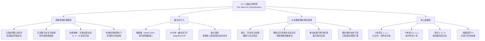

**相关笔记：** [[9.7 自然演绎系统]] | [[10.2 单称命题]]

> [!abstract] 概览
> 本节阐述从==命题逻辑==到==谓词逻辑==的跨越动机，揭示命题逻辑的根本局限性，并引入==量化==（quantification）这一核心概念。核心知识点包括：
> - **命题逻辑的局限**：无法处理"所有""有些"等量化表达，也无法揭示非复合命题的内部逻辑结构
> - **量化的引入**：由==弗雷格==（Gottlob Frege）在19世纪末首创，被称为逻辑史上最深刻的技术进步
> - **量化理论的功能**：将非复合命题翻译为复合陈述，从而利用已有的推论规则进行演绎
> - **个体变元**（$x, y, z$）：作为占位符，指示个体常元可以填入的位置
> - **谓词**（predicate）：描述个体所具有的属性或个体之间的关系
> - **命题逻辑是基础**：量化不会修改已有的推论规则，而是在更广泛的范围内使用它们

---

## 一、知识结构总览

---

## 二、核心思想与证明技巧

> [!tip] 核心思想
> 命题逻辑只能处理==复合陈述==（由简单陈述通过"且""或""如果...则"等联结词组合而成），但许多有效论证的有效性并不依赖于陈述之间的真值函项关系，而是依赖于==非复合陈述的内部逻辑结构==。量化理论通过引入==个体变元==、==谓词==和==量词==，使我们能够揭示这种内部结构，从而将大量此前无法分析的有效论证纳入形式逻辑的框架之中。

### 命题逻辑的局限性

> [!def] 命题逻辑的处理范围
> ==命题逻辑==（propositional logic）只能处理那些==有效性完全基于简单陈述真值函项性地结合为复合陈述的方式==的论证。运用基本的==有效论证形式==和==替换规则==，我们能在这种类型的论证中区分有效论证和无效论证。

命题逻辑的核心工具——真值表、形式证明、简化真值表方法——都是围绕复合陈述的真值函项结构设计的。当一个论证中的所有命题都是非复合的（即简单命题），这些工具就失去了着力点。

**经典案例：苏格拉底三段论**

> [!example] 苏格拉底论证——命题逻辑的困境
> 考察如下经典论证：
>
> 所有人都是有死的。
>
> 苏格拉底是人。
>
> 因此，苏格拉底是有死的。
>
> 这个论证显然是有效的。但如果使用命题逻辑的符号化方法，只能将其表示为：
>
> $A$
>
> $H$
>
> $\therefore M$
>
> 在命题逻辑的分析框架中，该论证显然是==无效的==——因为从两个互不相关的前提 $A$ 和 $H$，无法推出 $M$。

**问题出在哪里？**

困难源于：这一显然有效的论证，其有效性基于其==前提的内在逻辑结构==，而这种内在逻辑结构无法通过命题逻辑的符号化系统加以揭示。具体来说：

1. "所有人都是有死的"这一前提，其内部结构是"对于所有 $x$，如果 $x$ 是人，则 $x$ 是有死的"——这是一个量化陈述
2. "苏格拉底是人"这一前提，其内部结构是"苏格拉底具有属性'人'"——这是一个单称命题
3. 结论"苏格拉底是有死的"的内部结构是"苏格拉底具有属性'有死的'"——这也是一个单称命题

有效性恰恰在于：从"对所有 $x$，若 $x$ 是人则 $x$ 有死"和"苏格拉底是人"，可以推出"苏格拉底有死"。但命题逻辑将这三个陈述分别当作不可再分的整体 $A$、$H$、$M$，完全丢失了这一内部结构信息。

### 量化理论的功能

> [!def] 量化理论
> ==量化理论==（quantification theory）提供了一套方法，使我们能够==描述和符号化非复合陈述的内部结构==，进而展现它们的内部逻辑关系。量化使我们能将非复合的前提翻译为复合陈述（而不丢失其含义），从而可以使用基本论证形式和替换规则来做推论，证明有效性或无效性。

量化理论的工作流程可以概括为三个阶段：

1. **分析阶段**：将自然语言中的非复合陈述拆解为其内部结构（个体、属性、量词）
2. **翻译阶段**：用谓词逻辑的符号系统将内部结构符号化，得到复合形式的表达式
3. **推理阶段**：利用已有的推论规则（19条规则不变）进行演绎推理
4. **还原阶段**：将推理结果还原为自然语言的非复合陈述

### 弗雷格的贡献

> [!def] 戈特洛布-弗雷格（Gottlob Frege, 1848-1925）
> ==弗雷格==是德国逻辑学家和数学家，==现代逻辑的奠基人==。他在1879年发表的《概念文字》（*Begriffsschrift*）中首次系统地引入了==量词==（quantifier）的概念，这一贡献被称为==逻辑史上最为深刻的技术进步==。

弗雷格的量化理论彻底改变了逻辑学的面貌。在他之前，逻辑学（从亚里士多德到布尔）虽然取得了巨大成就，但都无法精确处理涉及"所有"和"有些"的推理。弗雷格的量词概念使得这类推理第一次获得了完全精确的形式化处理。

### 个体变元与谓词的初步引入

> [!def] 个体变元（Individual Variable）
> ==个体变元==是用小写字母（通常从 $x, y, z$ 开始）表示的符号，它是一个==占位符==，用来指示个体常元（如 $a, b, c$，指代特定个体）可以填入的位置。个体变元本身不指代任何特定对象。

> [!def] 谓词（Predicate）
> ==谓词==是用大写字母表示的符号，用来描述个体所具有的==属性==（如 $Fx$ 表示"$x$ 具有属性 $F$"）或个体之间的==关系==（如 $Rxy$ 表示"$x$ 与 $y$ 之间具有关系 $R$"）。

这些概念将在后续节中详细展开。本节的关键在于理解：==命题逻辑之所以无法处理苏格拉底论证，正是因为它缺乏个体变元、谓词和量词这些分析非复合陈述内部结构的工具==。

### 命题逻辑与谓词逻辑的关系

> [!tip] 重要关系
> 前面构建起来的演绎方法（19条推论规则）仍然是基础的，==量词无论如何都不会修改这些推论规则==。之前所讨论的内容可以被称为==命题逻辑==。我们现在进一步运用某些附加符号以更广泛地，即在==谓词逻辑==中使用这些推论规则。谓词逻辑是命题逻辑的==扩展==而非替代。

这一关系可以用一个类比来理解：命题逻辑就像一台只能处理整数运算的计算器，而谓词逻辑则是在此基础上增加了分数、小数运算功能的新计算器。原有的整数运算功能完全保留，只是能力更强了。

---

## 三、补充理解与易混淆点

### 补充理解

> [!info] 补充1：弗雷格对量词理论的贡献
> **来源：** Frege, G. (1879). *Begriffsschrift, eine der arithmetischen nachgebildete Formelsprache des reinen Denkens*. Halle.
>
> 弗雷格在1879年发表的《概念文字》（*Begriffsschrift*，全称"一种模仿算术的形式语言，用于纯粹思维"）是==现代逻辑的开山之作==。在这部著作中，弗雷格做出了多项革命性贡献：
>
> 1. **量词的发明**：弗雷格首次引入了全称量词 $\forall$ 的概念（他使用的是一种特殊的图形符号），使得"所有""每一个"这类量化表达第一次获得了精确的逻辑刻画。这是逻辑史上==最深刻的技术进步==
>
> 2. **命题函项的概念**：弗雷格区分了"含有变元的表达式"和"命题"，前者（如 $Fx$）不是命题，因为它没有确定的真值；只有当变元被赋予特定值或被量词约束后，才成为命题
>
> 3. **函数-argument 分析**：弗雷格将数学中的函数概念引入逻辑学，将谓词视为函数（映射：个体 $\to$ 真值），个体视为函数的自变量（argument）。这一分析框架至今仍是谓词逻辑的标准理解方式
>
> 4. **形式系统的建立**：弗雷格不仅提供了符号系统，还建立了一个完整的公理化演绎系统，包括公理和推理规则，为后来的形式化工作奠定了基础
>
> 弗雷格的工作在当时并未立即获得广泛认可，但后来被罗素（Russell）和怀特海（Whitehead）在《数学原理》（*Principia Mathematica*，1910-1913）中发扬光大，最终成为现代逻辑的标准框架。

> [!info] 补充2：一阶逻辑的表达力与局限性
> **来源：** Barwise, J. & Etchemendy, J. (1999). *Language, Proof and Logic*. CSLI Publications.
>
> 一阶逻辑（即本节所引入的谓词逻辑）是逻辑学中最重要的系统之一。Barwise和Etchemendy在其经典教材中详细讨论了一阶逻辑的==表达力==（expressive power）与==局限性==：
>
> **一阶逻辑的表达力：**
> - 可以精确表达涉及"所有"和"有些"的推理（如苏格拉底三段论）
> - 可以处理关系推理（如"如果 $a$ 爱 $b$，且 $b$ 爱 $c$，则 $a$ 爱某个爱 $c$ 的人"）
> - 可以表达数学中的大多数命题（算术、代数、分析中的定理都可以在一阶逻辑中形式化）
> - 是数学基础研究（如集合论、模型论）的标准语言
>
> **一阶逻辑的局限性：**
> - ==不能直接表达二阶量化==：一阶逻辑只允许对个体变元进行量化，不能对谓词变元进行量化。例如，"苏格拉底具有的所有属性都是有价值的"需要对属性进行量化，这超出了谓词逻辑的范围
> - ==不能表达某些数学概念==：如"有限"（finiteness）、"可数"（countability）、"良基"（well-foundedness）等概念无法在一阶逻辑中精确表达
> - ==紧致性定理的限制==：一阶逻辑满足紧致性定理，这意味着一阶理论如果有一组无限模型，则也必须有任意大的有限模型——这限制了它刻画"有限结构"的能力
>
> 尽管有这些局限性，一阶逻辑仍然是==表达力和简洁性之间最优平衡==的逻辑系统，这也是为什么它成为现代逻辑学、计算机科学和语言学中广泛使用的标准形式语言。

### 易混淆点

> [!warning] 误区：个体变元 = 个体常项
> ❌ **错误理解：** 个体变元 $x, y, z$ 和个体常项 $a, b, c$ 都是用来指代个体的符号，它们没有本质区别。
> ✅ **正确理解：** 个体变元和个体常项有==根本性的区别==。==个体变元==（$x, y, z$）是==占位符==，它本身不指代任何特定对象，只是标记一个"空位"，等待被某个个体常项填入。==个体常项==（$a, b, c$）是==个体的名称==，在特定上下文中指代一个特定的个体（如 $s$ 指代苏格拉底）。
> **辨析：**
> - 个体变元类似于代数中的变量 $x$（"设 $x$ 为任意实数"中的 $x$ 不指代任何特定数）
> - 个体常项类似于代数中的常数 $\pi$ 或 $e$（它们指代特定的值）
> - 个体变元可以出现在量词的管辖范围内（如 $\forall x Fx$），而个体常项不能被量词约束
> - 在命题函项 $Fx$ 中，$x$ 是变元，$Fx$ 不是命题；当用常项 $s$ 代入 $x$ 得到 $Fs$ 时，$Fs$ 才是命题

> [!warning] 误区：命题逻辑的局限 = 命题逻辑无用
> ❌ **错误理解：** 既然命题逻辑无法处理苏格拉底论证这样的有效推理，那么命题逻辑就是有缺陷的、应该被谓词逻辑取代的。
> ✅ **正确理解：** 命题逻辑的局限不等于命题逻辑无用。==命题逻辑是谓词逻辑的基础==，谓词逻辑是命题逻辑的==扩展==而非替代。命题逻辑在以下方面仍然不可或缺：
> **辨析：**
> - 命题逻辑的19条推论规则在谓词逻辑中==完全保留==，没有任何修改
> - 许多有效论证的有效性确实完全基于真值函项关系，命题逻辑足以处理它们
> - 命题逻辑提供了一个更简洁、更容易掌握的分析框架，适合处理不需要量化分析的推理
> - 谓词逻辑的演绎证明中，大量步骤实际上就是在使用命题逻辑的规则
> - 类比：整数运算是分数运算的基础，虽然整数运算不能处理分数，但不能说整数运算"无用"

---

## 四、习题精选

> [!todo] 习题概览
> | 题号 | 核心考点 | 难度 |
> |:-----|:---------|:-----|
> | 1 | 识别命题逻辑无法处理的量化表达 | ⭐⭐ |
> | 2 | 分析论证有效性的来源 | ⭐⭐⭐ |

### 题1：识别命题逻辑无法处理的量化表达

> [!problem] 题目
> 以下论证中哪些是命题逻辑无法处理但谓词逻辑可以处理的？请说明理由。
>
> (a) 如果天下雨，则地面湿。天下雨。因此，地面湿。
>
> (b) 所有学生都通过了考试。张三是学生。因此，张三通过了考试。
>
> (c) 要么小明去，要么小红去。小明不去。因此，小红去。

> [!faq]- 解答
> **[步骤1]** 分析论证 (a)：
> - 符号化：$R \supset W, R \therefore W$（其中 $R$ = "天下雨"，$W$ = "地面湿"）
> - 这是一个==肯定前件式==（Modus Ponens），其有效性完全基于命题之间的真值函项关系
> - ==命题逻辑完全可以处理==，因为有效性不依赖于前提的内部结构
>
> **[步骤2]** 分析论证 (b)：
> - 如果用命题逻辑符号化：$A, B \therefore C$（$A$ = "所有学生都通过了考试"，$B$ = "张三是学生"，$C$ = "张三通过了考试"）
> - 从 $A$ 和 $B$ 推不出 $C$，论证显得无效
> - 但实际上该论证是有效的——有效性依赖于"所有学生都通过了考试"的内部结构："对于所有 $x$，如果 $x$ 是学生，则 $x$ 通过了考试"
> - ==命题逻辑无法处理==，==谓词逻辑可以处理==
>
> **[步骤3]** 分析论证 (c)：
> - 符号化：$M \lor H, \sim M \therefore H$（其中 $M$ = "小明去"，$H$ = "小红去"）
> - 这是一个==析取三段论==（Disjunctive Syllogism），有效性基于真值函项关系
> - ==命题逻辑完全可以处理==
>
> **结论：** 只有论证 (b) 是命题逻辑无法处理但谓词逻辑可以处理的，因为它包含量化表达"所有"，其有效性依赖于非复合命题的内部逻辑结构。

> [!tip] 解题思路提示
> 判断一个论证是否需要谓词逻辑来处理，关键看两点：
> 1. **前提中是否包含量化词**（"所有""有些""每个""没有任何"等）——如果有，很可能需要谓词逻辑
> 2. **命题逻辑的符号化是否丢失了关键信息**——如果将论证符号化为简单命题后，原本有效的论证变得"无效"，说明有效性来源于被丢失的内部结构，需要谓词逻辑来揭示

### 题2：分析论证有效性的来源

> [!problem] 题目
> 以下论证在命题逻辑的符号化下是无效的，但实际上是有效的。请分析其有效性的来源，并说明谓词逻辑如何能够揭示这种有效性。
>
> 前提1：所有哲学家都是逻辑学家。
> 前提2：亚里士多德是哲学家。
> 结论：亚里士多德是逻辑学家。

> [!faq]- 解答
> **[步骤1]** 命题逻辑的符号化：
> - 设 $P$ = "所有哲学家都是逻辑学家"，$Q$ = "亚里士多德是哲学家"，$R$ = "亚里士多德是逻辑学家"
> - 论证形式：$P, Q \therefore R$
> - 在命题逻辑中，从两个互不相关的前提推不出第三个命题，该论证形式是==无效的==
>
> **[步骤2]** 分析有效性的真正来源：
> - 前提1的内部结构："对于所有 $x$，如果 $x$ 是哲学家，则 $x$ 是逻辑学家"
> - 前提2的内部结构："亚里士多德是哲学家"
> - 结论的内部结构："亚里士多德是逻辑学家"
> - 有效性在于：从"所有满足条件 $F$ 的东西都满足条件 $G$"和"某个特定对象 $a$ 满足条件 $F$"，可以推出"$a$ 满足条件 $G$"
> - 这正是==全称例示==（Universal Instantiation）的推理模式
>
> **[步骤3]** 谓词逻辑的符号化（预告）：
> - 设 $Px$ = "$x$ 是哲学家"，$Lx$ = "$x$ 是逻辑学家"，$a$ = 亚里士多德
> - 前提1：$(x)(Px \supset Lx)$
> - 前提2：$Pa$
> - 结论：$La$
> - 从 $(x)(Px \supset Lx)$ 和 $Pa$，通过全称例示得到 $Pa \supset La$，再通过肯定前件式从 $Pa \supset La$ 和 $Pa$ 得到 $La$
> - ==谓词逻辑成功揭示了该论证的有效性==
>
> $\blacksquare$

---

## 五、视频学习指南

> [!info] 视频资源
> | 资源 | 链接 | 对应内容 | 备注 |
> |:-----|:-----|:---------|:-----|
> | Wireless Philosophy: Predicate Logic | [链接](https://www.youtube.com/watch?v=KJHJY9T3VNk) | 谓词逻辑概述 | 英文，入门级 |
> | Michael Genesereth: Introduction to Logic | [链接](https://www.youtube.com/playlist?list=PLgJhDNE2yX8i1F7Gm_6D1f8WIOXxmzYH) | 量化理论入门 | 英文，斯坦福课程 |
> | Frederic Schuller: Logic of Propositions and Predicates | [链接](https://www.youtube.com/watch?v=V49i_LM8B0E) | 从命题逻辑到谓词逻辑 | 英文，较深入 |

---

## 六、教材原文

> [!quote] 教材原文
> **来源：** 逻辑学导论 第15版，第10章第1节
>
> 许多有效演绎论证的有效性无法通过前两章给出的逻辑技术来检验，因此必须增强分析工具。我们通过量化来做到这一点，这是由伟大的德国逻辑学家和现代逻辑的奠基人戈特洛布-弗雷格（1848-1925）在19世纪末首次引入的。弗雷格对量化的发现，被称为逻辑历史上最为深刻的技术进步。
>
> 为了理解量化是如何增强了逻辑分析的力度，我们须首先认识到我们已经具有的这些方法的局限性。前面的章节已经表明我们可以有效地检验演绎论证，但只是某种特殊类型的论证，这些论证的有效性完全基于简单陈述真值函项性地结合为复合陈述的方式。
>
> 即使面对一个由简单命题构成的论证，这些技术都还不够，它们无法达到推理过程中的关键要素。再考察如下这个古老的论证：所有人都是有死的。苏格拉底是人。因此，苏格拉底是有死的。显然这个论证是有效的，但是使用目前为止引入的方法，只能将其符号化为：A, H ∴ M。在这种分析中，该论证显然是无效的。哪里出了问题呢？困难来源于如下事实，即这一显然有效的论证，其有效性基于其前提的内在逻辑结构，而这种内在逻辑结构无法通过我们目前建立的符号化陈述的系统加以揭示。
>
> 量化使我们能将非复合的前提翻译为复合陈述，而不丢失其含义。这样翻译之后，我们就能使用基本论证形式和替换规则来做推论，证明有效性或无效性。
>
> 前面构建起来的演绎方法仍然是基础的，量词无论如何都不会修改这些推论规则。之前所讨论的内容可以被称为命题逻辑。我们现在进一步运用某些附加符号以更广泛地，即在谓词逻辑中使用这些推论规则。

---

## 参见 Wiki

- [[有效性]] — 论证有效性的定义，命题逻辑和谓词逻辑分别从不同角度揭示有效性
- [[自然演绎]] — 19条推论规则构成的自然演绎系统，在谓词逻辑中完全保留
- [[命题]] — 命题的定义，命题逻辑将命题视为不可再分的整体
- [[真值函项性]] — 真值函项性的定义，命题逻辑的分析基础
- [[实质蕴涵]] — 实质蕴涵的定义，在谓词逻辑中全称量化与蕴涵密切相关
- [[9.7 自然演绎系统]] — 命题逻辑中自然演绎系统的总结，谓词逻辑的起点

#学习/逻辑学/谓词逻辑
