**相关笔记：** [[10.1 对量化的呼唤]] | [[10.3 全称量词与存在量词]]

> [!abstract] 概览
> 本节介绍谓词逻辑中最基本的非复合陈述——==单称命题==（singular proposition），并建立谓词逻辑的==符号化约定==。核心知识点包括：
> - **单称命题**：断言某特定个体具有某种特定属性的命题
> - **个体常元**（$a, b, c, \ldots, w$）：指代特定个体的符号，如同个体的"专名"
> - **谓述符号**（$F, G, H, \ldots$）：符号化个体可能具有的属性
> - **符号化约定**：$Fa$ 表示"个体 $a$ 具有属性 $F$"，谓述符号在左，个体常元在右
> - **命题函项**（propositional function）：如 $Fx$，含有个体变元，本身不是命题，但代入个体常元后成为命题
> - **简单谓述**：有一些真代入例和假代入例的命题函项，每个代入例都是单称肯定命题
> - **属性谓词**（一元谓词）vs **关系谓词**（多元谓词）

---

## 一、知识结构总览

```mermaid
graph TB
    A["10.2 单称命题<br/>Singular Propositions"] --> B["单称命题的概念"]
    A --> C["符号化系统"]
    A --> D["命题函项"]
    A --> E["属性谓词与关系谓词"]

    B --> B1["肯定的单称命题<br/>断言特定个体具有特定属性"]
    B --> B2["主项：指称特定个体<br/>（如'苏格拉底'）"]
    B --> B3["谓项：指谓个体具有的属性<br/>（如'人''有死的'）"]
    B --> B4["'个体'不限于人<br/>可指事物、国家、城市等"]

    C --> C1["个体常元 a-w<br/>小写字母，指代特定个体"]
    C --> C2["谓述符号 F,G,H...<br/>大写字母，表示属性"]
    C --> C3["符号化约定<br/>谓述符号在左，个体常元在右"]
    C --> C4["示例：Hs = 苏格拉底是人<br/>Ms = 苏格拉底是有死的"]

    D --> D1["命题函项 Fx<br/>含变元，非命题"]
    D --> D2["代入个体常元→命题<br/>如 Fx 代入 s 得到 Fs"]
    D --> D3["有真代入例和假代入例<br/>如 Hs 为真，Hc 为假"]
    D --> D4["简单谓述<br/>每个代入例都是单称肯定命题"]

    E --> E1["属性谓词（一元）<br/>Fx：x 具有属性 F"]
    E --> E2["关系谓词（二元）<br/>Lxy：x 爱 y"]
    E --> E3["关系谓词（多元）<br/>Rxyz：x 在 y 和 z 之间"]
    E --> E4["关系谓词的顺序有意义<br/>Lab ≠ Lba"]
```

---

## 二、核心思想与证明技巧

> [!tip] 核心思想
> 单称命题是谓词逻辑的==基本构件==。通过区分==个体常元==（指代特定个体）和==谓述符号==（表示属性），我们能够精确地符号化"某特定个体具有某特定属性"这类最基本的非复合陈述。进一步地，通过引入==个体变元==，我们可以抽象出单称命题的共同模式，形成==命题函项==——它是连接单称命题与量化陈述的桥梁。

### 单称命题的定义

> [!def] 单称命题（Singular Proposition）
> 一个==肯定的单称命题==断言的是，一个==特定个体==具有某种==特定属性==。在传统逻辑中，主项指称某特定个体，谓项指谓该个体所具有的某种属性。

**示例分析：**

以"苏格拉底是人"为例：
- **主项**："苏格拉底"——指称特定个体
- **谓项**："人"——指谓该个体所具有的属性

同一主项可以出现在不同的单称命题中：
- "苏格拉底是有死的"（真）
- "苏格拉底是胖的"（假）
- "苏格拉底是聪明的"（真）
- "苏格拉底是漂亮的"（假）

同一谓项也可以出现在不同的单称命题中：
- "亚里士多德是人"（真）
- "巴西是人"（假）
- "芝加哥是人"（假）
- "奥基夫是人"（真）

> [!tip] 关于"个体"的说明
> 谓词逻辑中的"个体"不仅可以指人，还可以指==事物==，如国家、书、城市，实际上可以指谓像"重的"这样能被有意义地断言为其属性的任何事物。谓项可以是形容词（"有死的"）、名词（"人"）或动词（"写作"），在本章中这些区分并不重要。

### 符号化系统

> [!def] 个体常元（Individual Constant）
> ==个体常元==是从 $a$ 到 $w$ 的小写字母，用来==指谓特定个体==。在它们出现的任何特定上下文中，每个字母都指称一个特定的个体。通常用个体名称的第一个字母作为其个体常元。

> [!def] 谓述符号（Predicate Symbol）
> ==谓述符号==是大写字母，用来==符号化个体可能具有的属性==。同样遵循便利原则，用属性名称的第一个字母作为谓述符号。

**符号化约定表：**

| 个体 | 个体常元 | 属性 | 谓述符号 | 单称命题 | 符号化 |
|:-----|:---------|:-----|:---------|:---------|:-------|
| 苏格拉底 | $s$ | 是人 | $H$ | 苏格拉底是人 | $Hs$ |
| 亚里士多德 | $a$ | 是人 | $H$ | 亚里士多德是人 | $Ha$ |
| 巴西 | $b$ | 是人 | $H$ | 巴西是人 | $Hb$ |
| 芝加哥 | $c$ | 是人 | $H$ | 芝加哥是人 | $Hc$ |
| 苏格拉底 | $s$ | 有死的 | $M$ | 苏格拉底是有死的 | $Ms$ |
| 苏格拉底 | $s$ | 胖的 | $F$ | 苏格拉底是胖的 | $Fs$ |
| 苏格拉底 | $s$ | 聪明的 | $W$ | 苏格拉底是聪明的 | $Ws$ |

**符号化规则：** 将属性符号（谓述符号）直接写在个体符号（个体常元）的左边，表征被命名的个体具有规定的属性。例如 $Hs$：首先写谓述符号 $H$，然后紧跟个体常元 $s$。

### 命题函项

> [!def] 命题函项（Propositional Function）
> ==命题函项==是一个满足以下两个条件的表达式：
> 1. 含有一个谓述符号和个体变元
> 2. 当一个个体常元代入个体变元时，它就变成一个命题

命题函项是理解量化的关键概念。以 $Hx$ 为例：

- $Hx$ 本身==不是命题==——它没有确定的真值，因为 $x$ 是一个未指定的占位符
- 当用个体常元 $s$（苏格拉底）代入 $x$ 时，得到 $Hs$（"苏格拉底是人"），这是一个==命题==，其真值为真
- 当用个体常元 $c$（芝加哥）代入 $x$ 时，得到 $Hc$（"芝加哥是人"），这也是一个==命题==，其真值为假

> [!def] 简单谓述（Simple Predication）
> ==简单谓述==是一个==有一些真代入例和假代入例==的命题函项，并且每个代入例都是一个==单称肯定命题==。如 $Hx$、$Mx$、$Bx$、$Fx$、$Wx$ 等都是简单谓述。

> [!tip] 命题函项与命题的关系
> 命题函项可以看作是"命题的模板"或"命题的蓝图"。它本身不是命题（没有确定的真值），但通过==代入==（用个体常元替换变元）或==量化==（在前面加量词），可以将其转化为命题。这是谓词逻辑中生成命题的两种基本方式：
> 1. **例举方法**：用个体常元代入个体变元，如 $Hx \to Hs$
> 2. **概括方法**：在命题函项前面放一个全称量词或存在量词，如 $Hx \to (x)Hx$ 或 $Hx \to (\exists x)Hx$

### 属性谓词与关系谓词

> [!def] 属性谓词（Attribute Predicate / 一元谓词）
> ==属性谓词==（也称==一元谓词==）是只涉及==一个个体==的谓词，描述该个体所具有的属性。形式为 $Fx$，其中 $F$ 是谓述符号，$x$ 是个体变元。

> [!def] 关系谓词（Relational Predicate / 多元谓词）
> ==关系谓词==（也称==多元谓词==）是涉及==两个或更多个体==的谓词，描述个体之间的关系。形式为 $Rxy$（二元）、$Rxyz$（三元）等。

**关系谓词的示例：**

| 自然语言表达 | 符号化 | 说明 |
|:-------------|:-------|:-----|
| $a$ 爱 $b$ | $Lab$ | 二元关系谓词 |
| $b$ 爱 $a$ | $Lba$ | 顺序不同，含义不同 |
| $a$ 比 $b$ 高 | $Hab$ | 二元关系谓词 |
| $a$ 在 $b$ 和 $c$ 之间 | $Tabc$ | 三元关系谓词 |

> [!warning] 关系谓词的顺序
> 关系谓词中个体常元的==顺序是有意义的==。$Lab$（$a$ 爱 $b$）和 $Lba$（$b$ 爱 $a$）是不同的命题，它们可以有不同的真值。这一点与数学中的关系类似：$3 > 2$ 为真，但 $2 > 3$ 为假。

---

## 三、补充理解与易混淆点

### 补充理解

> [!info] 补充1：亚里士多德主谓逻辑与现代谓词逻辑的关系
> **来源：** Lukasiewicz, J. (1957). *Aristotle's Syllogistic from the Standpoint of Modern Formal Logic*. Clarendon Press.
>
> 亚里士多德（Aristotle, 384-322 BC）在《前分析篇》中建立了人类历史上第一个系统的逻辑理论——==三段论逻辑==（syllogistic），其核心就是==主谓分析==（subject-predicate analysis）。卢卡西维奇（Lukasiewicz）在其经典研究中详细比较了亚里士多德的主谓逻辑与现代谓词逻辑：
>
> **亚里士多德的主谓逻辑：**
> - 基本形式：主项 + 谓项（如"所有人都是有死的"）
> - 只处理==一元谓词==（属性），不处理关系
> - 四种基本命题形式：A（全称肯定）、E（全称否定）、I（特称肯定）、O（特称否定）
> - 推理规则基于三段论的格与式
>
> **现代谓词逻辑的扩展：**
> - 保留了主谓分析的基本框架（$Fa$ 表示 $a$ 具有属性 $F$）
> - 引入了==关系谓词==（$Rab$ 表示 $a$ 与 $b$ 之间有关系 $R$），这是亚里士多德逻辑完全无法处理的
> - 引入了==量词==的精确形式化（弗雷格的贡献），使量化推理获得了严格的数学处理
> - 引入了==个体变元==和==命题函项==的概念，提供了更灵活的表达能力
>
> **关键区别：**
> - 亚里士多德逻辑本质上是一种==一元谓词逻辑==（monadic predicate logic），而现代谓词逻辑是==包含多元谓词的完整系统==
> - 亚里士多德逻辑中的"所有 S 都是 P"在现代谓词逻辑中表示为 $(x)(Sx \supset Px)$，这一翻译揭示了亚里士多德逻辑是现代谓词逻辑的一个==真子集==
> - 关系推理（如"如果 $a > b$ 且 $b > c$，则 $a > c$"）在亚里士多德逻辑中完全无法表达，但在现代谓词逻辑中可以轻松处理

> [!info] 补充2：关系谓词在数学中的广泛应用
> **来源：** Tarski, A. (1941). *Introduction to Logic and to the Methodology of Deductive Sciences*. Oxford University Press.
>
> 阿尔弗雷德-塔斯基（Alfred Tarski）在其经典教材中强调了==关系谓词==在数学推理中的核心地位。事实上，数学中绝大多数重要概念都是用关系谓词来表达的：
>
> **数学中的关系谓词示例：**
>
> | 数学概念 | 关系谓词表达 | 说明 |
> |:---------|:-------------|:-----|
> | 等于 | $x = y$ | 二元关系，自反、对称、传递 |
> | 小于 | $x < y$ | 二元关系，反对称、传递 |
> | 整除 | $x \mid y$ | 二元关系，$x$ 整除 $y$ |
> | 属于 | $x \in y$ | 二元关系，$x$ 是集合 $y$ 的元素 |
> | 函数 | $f(x) = y$ | 三元关系，$f$ 在 $x$ 处的值为 $y$ |
> | 同余 | $x \equiv y \pmod{n}$ | 三元关系 |
> | 介于 | $B(x, y, z)$ | 三元关系，$y$ 在 $x$ 和 $z$ 之间 |
>
> 塔斯基指出，==数学推理的本质就是关系推理==。例如，证明"如果 $a < b$ 且 $b < c$，则 $a < c$"需要利用"小于"关系的传递性——这完全依赖于关系谓词 $<$ 的性质，而非属性谓词。
>
> 这一事实进一步说明了为什么亚里士多德的主谓逻辑（只处理一元谓词）不足以处理数学推理，而现代谓词逻辑（包含多元关系谓词）能够成为数学的形式化基础。

### 易混淆点

> [!warning] 误区：属性谓词 = 关系谓词
> ❌ **错误理解：** 属性谓词 $Fx$ 和关系谓词 $Rxy$ 没有本质区别，都是描述个体的特征。
> ✅ **正确理解：** 属性谓词和关系谓词有==根本性的区别==。==属性谓词==（一元谓词）描述的是==单个个体==所具有的性质，如 $Fx$ 表示"$x$ 是胖的"。==关系谓词==（多元谓词）描述的是==两个或多个个体之间==的关系，如 $Lxy$ 表示"$x$ 爱 $y$"。
> **辨析：**
> - 属性谓词只有一个"空位"（一个变元），如 $Fx$、$Gx$、$Hx$
> - 关系谓词有两个或更多"空位"（多个变元），如 $Lxy$（二元）、$Rxyz$（三元）
> - "苏格拉底是聪明的"用属性谓词 $Ws$ 表示——只涉及一个个体苏格拉底
> - "苏格拉底爱亚里士多德"用关系谓词 $Lsa$ 表示——涉及两个个体之间的关系
> - 属性谓词可以看作关系谓词的特例（一元关系），但逻辑上将它们区分开更为清晰

> [!warning] 误区：关系谓词的顺序无关紧要
> ❌ **错误理解：** $Lab$ 和 $Lba$ 表达的是同一个意思，只是写法不同。
> ✅ **正确理解：** 关系谓词中个体常元的==顺序是有意义的==，$Lab$ 和 $Lba$ 是==不同的命题==，它们可以有不同的真值。
> **辨析：**
> - $Lab$ 表示"$a$ 爱 $b$"，$Lba$ 表示"$b$ 爱 $a$"——这是两个完全不同的命题
> - 爱是一种不对称关系：$a$ 爱 $b$ 不蕴含 $b$ 爱 $a$
> - 某些关系是对称的（如"等于"：$a = b$ 蕴含 $b = a$），但即使对于对称关系，$Rab$ 和 $Rba$ 在形式上仍然是不同的表达式（只是它们总是具有相同的真值）
> - 类比：数学中 $3 - 2 \neq 2 - 3$，减法中操作数的顺序有意义；而 $3 + 2 = 2 + 3$，加法中操作数的顺序不影响结果，但 $3 + 2$ 和 $2 + 3$ 仍然是不同的表达式

---

## 四、习题精选

> [!todo] 习题概览
> | 题号 | 核心考点 | 难度 |
> |:-----|:---------|:-----|
> | 1 | 将自然语言单称命题符号化 | ⭐⭐ |
> | 2 | 区分命题与命题函项 | ⭐⭐ |
> | 3 | 关系谓词的符号化 | ⭐⭐⭐ |

### 题1：将自然语言单称命题符号化

> [!problem] 题目
> 使用以下符号化约定，将下列自然语言命题符号化为谓词逻辑表达式：
>
> 个体常元：$a$ = 亚里士多德，$b$ = 巴西，$c$ = 芝加哥，$s$ = 苏格拉底
>
> 谓述符号：$H$ = 是人，$M$ = 是有死的，$F$ = 是胖的，$W$ = 是聪明的，$B$ = 是美丽的
>
> (a) 亚里士多德是聪明的。
> (b) 巴西不是人。
> (c) 芝加哥是有死的。
> (d) 苏格拉底是聪明的且有死的。
> (e) 芝加哥既不是人也不是美丽的。

> [!faq]- 解答
> **[步骤1]** 逐题分析：
>
> (a) 亚里士多德是聪明的。
> - 个体：亚里士多德（$a$），属性：聪明的（$W$）
> - 符号化：$Wa$
>
> (b) 巴西不是人。
> - 个体：巴西（$b$），属性：是人（$H$），否定
> - 符号化：$\sim Hb$
>
> (c) 芝加哥是有死的。
> - 个体：芝加哥（$c$），属性：有死的（$M$）
> - 符号化：$Mc$
>
> (d) 苏格拉底是聪明的且有死的。
> - 两个属性的合取：聪明的（$W$）且有死的（$M$）
> - 符号化：$Ws \cdot Ms$
>
> (e) 芝加哥既不是人也不是美丽的。
> - 两个属性的否定的合取：不是人（$\sim H$）且不是美丽的（$\sim B$）
> - 符号化：$\sim Hc \cdot \sim Bc$
>
> $\blacksquare$

### 题2：区分命题与命题函项

> [!problem] 题目
> 判断以下表达式哪些是命题，哪些是命题函项，并说明理由。
>
> (a) $Hs$（苏格拉底是人）
> (b) $Hx$（$x$ 是人）
> (c) $Ms \cdot Ws$（苏格拉底是有死的且聪明的）
> (d) $Fx \cdot Gx$（$x$ 是胖的且 $x$ 是聪明的）
> (e) $\sim Hb$（巴西不是人）

> [!faq]- 解答
> **[步骤1]** 逐题分析：
>
> (a) $Hs$——==命题==。所有变元位置都被个体常元 $s$ 填满，有确定的真值（真）。
>
> (b) $Hx$——==命题函项==。含有未量化的个体变元 $x$，没有确定的真值。当用不同的个体常元代入 $x$ 时，可以得到不同的命题（$Hs$ 为真，$Hc$ 为假）。
>
> (c) $Ms \cdot Ws$——==命题==。所有变元位置都被个体常元 $s$ 填满，有确定的真值（真且真 = 真）。
>
> (d) $Fx \cdot Gx$——==命题函项==。含有未量化的个体变元 $x$，没有确定的真值。代入不同的个体常元会得到不同的结果。
>
> (e) $\sim Hb$——==命题==。所有变元位置都被个体常元 $b$ 填满，有确定的真值（巴西不是人 = 真）。
>
> **判断规则：** 如果表达式中所有变元位置都被个体常元填满（没有自由变元），则是命题；如果存在未被常元填满或量词约束的变元（自由变元），则是命题函项。
>
> $\blacksquare$

### 题3：关系谓词的符号化

> [!problem] 题目
> 使用以下符号化约定，将下列自然语言命题符号化为谓词逻辑表达式：
>
> 个体常元：$a$ = 亚里士多德，$s$ = 苏格拉底，$p$ = 柏拉图
>
> 谓述符号：$L$ = 爱，$T$ = 教导，$H$ = 是人
>
> (a) 苏格拉底爱柏拉图。
> (b) 柏拉图爱苏格拉底。
> (c) 亚里士多德教导柏拉图。
> (d) 苏格拉底是柏拉图的老师。（提示：用"教导"关系）
> (e) 苏格拉底爱柏拉图，但柏拉图不爱苏格拉底。

> [!faq]- 解答
> **[步骤1]** 逐题分析：
>
> (a) 苏格拉底爱柏拉图。
> - 关系：$L$（爱），第一个个体：苏格拉底（$s$），第二个个体：柏拉图（$p$）
> - 符号化：$Lsp$
>
> (b) 柏拉图爱苏格拉底。
> - 关系：$L$（爱），第一个个体：柏拉图（$p$），第二个个体：苏格拉底（$s$）
> - 符号化：$Lps$
> - 注意：$Lps \neq Lsp$，顺序不同，含义不同
>
> (c) 亚里士多德教导柏拉图。
> - 关系：$T$（教导），第一个个体：亚里士多德（$a$），第二个个体：柏拉图（$p$）
> - 符号化：$Tap$
>
> (d) 苏格拉底是柏拉图的老师。
> - "是...的老师"即"教导"，关系：$T$，第一个个体：苏格拉底（$s$），第二个个体：柏拉图（$p$）
> - 符号化：$Tsp$
>
> (e) 苏格拉底爱柏拉图，但柏拉图不爱苏格拉底。
> - 两个关系命题的合取，第二个带否定
> - 符号化：$Lsp \cdot \sim Lps$
>
> $\blacksquare$

> [!tip] 解题思路提示
> 符号化单称命题的三步法：
> 1. **识别个体**：找出命题中提到的特定个体，确定其个体常元
> 2. **识别属性或关系**：确定谓词是一元的（属性）还是多元的（关系），选择合适的谓述符号
> 3. **注意顺序**：对于关系谓词，仔细确定个体在关系中的顺序——$Lab$（$a$ 爱 $b$）和 $Lba$（$b$ 爱 $a$）是不同的命题

---

## 五、视频学习指南

> [!info] 视频资源
> | 资源 | 链接 | 对应内容 | 备注 |
> |:-----|:-----|:---------|:-----|
> | Wireless Philosophy: Predicates and Quantifiers | [链接](https://www.youtube.com/watch?v=KJHJY9T3VNk) | 谓词与量词基础 | 英文，入门级 |
> | Kevin Houston: Predicate Logic Introduction | [链接](https://www.youtube.com/watch?v=CSKvydBug9M) | 单称命题与符号化 | 英文，配合实例 |
> | MIT OCW: Paradox and Infinity | [链接](https://www.youtube.com/playlist?list=PLUl4u3cNGP60hI9ATjSFgLZpbNJ7myAg6) | 谓词逻辑基础 | 英文，MIT开放课程 |

---

## 六、教材原文

> [!quote] 教材原文
> **来源：** 逻辑学导论 第15版，第10章第2节
>
> 我们从最简单的非复合陈述开始，例如上例中的第二个前提"苏格拉底是人"。这种类型的陈述传统上叫作单称命题。一个肯定的单称命题断言的是，一个特定个体具有某种特定属性。在上述例子中，日常语法和传统逻辑都一致地把"苏格拉底"划为主项，把"人"划为谓项。主项指称某特定个体，谓项指谓该个体所具有的某种属性。
>
> 该符号系统中的"个体"不仅可以用来指人，还可以指事物，譬如，国家、书、城市，实际上可以指谓像人或重的这样能被有意义地断言为其属性的任何事物。
>
> 我们将用从a到w的小写字母来指谓个体。这些符号是个体常元。在它们出现的任何特定上下文，每个字母在该上下文中都指称一个特定的个体。大写字母被用作谓述符号，以符号化个体可能具有的属性。
>
> 通过在一个个体常元的左边写一个谓述符号，现在单称命题可以被符号化了。我们采取这样一个约定：把属性符号直接写在个体符号的左边，表征被命名的个体具有规定的属性这样一个单称命题。
>
> 表达式Hx被称为命题函项，它可以被定义成这样一个表达式：(1)含有一个谓述符号和个体变元；(2)当一个个体常元代入个体变元时，它就变成一个命题。所以，虽然命题函项能通过代入而成为一个命题，但其自身并不是一个命题。
>
> 一个简单谓述是一个有一些真代入例和假代入例的命题函项，并且每个代入例都是一个单称肯定命题。

---

## 参见 Wiki

- [[有效性]] — 论证有效性的定义，单称命题是构建有效论证的基本元素
- [[自然演绎]] — 19条推论规则，在谓词逻辑中完全保留
- [[直言命题]] — 传统逻辑中的主谓命题，与现代单称命题的对比
- [[命题]] — 命题的定义，单称命题是一种特殊类型的命题
- [[10.1 对量化的呼唤]] — 命题逻辑的局限性，引出对单称命题分析的需求
- [[10.3 全称量词与存在量词]] — 从单称命题到量化陈述的进一步发展

#学习/逻辑学/谓词逻辑
