**相关笔记：** [[10.2 单称命题]] | [[10.4 传统主谓命题]]

> [!abstract] 概览
> 本节系统介绍谓词逻辑的两大核心量词——==全称量词== $\forall$ 和==存在量词== $\exists$，并建立量化陈述的符号化方法。核心知识点包括：
> - **全称量词** $(x)$：表示"给定任何 $x$"或"对所有 $x$"，将命题函项转化为全称命题
> - **存在量词** $(\exists x)$：表示"至少存在这样一个 $x$"，将命题函项转化为存在命题
> - **量化陈述的符号化**：全称量词与蕴涵的关系、存在量词与合取的关系
> - **自由变元 vs 约束变元**：区分被量词绑定的变元和未被绑定的变元
> - **量化否定等价式**：四个逻辑真的双条件陈述，揭示全称量词与存在量词的相互关系
> - **量化对当方阵**：全称量化与存在量化之间的反对、下反对、矛盾和差等关系

---

## 一、知识结构总览

```mermaid
graph TB
    A["10.3 全称量词与存在量词<br/>Universal & Existential Quantifiers"] --> B["全称量词 (x)"]
    A --> C["存在量词 (∃x)"]
    A --> D["自由变元与约束变元"]
    A --> E["量化否定等价式"]
    A --> F["量化对当方阵"]

    B --> B1["含义：给定任何x<br/>对所有x"]
    B --> B2["符号化：(x)Mx<br/>所有事物都是有死的"]
    B --> B3["真值条件：所有代入例<br/>都为真"]
    B --> B4["与蕴涵的关系<br/>全称命题用⊃"]

    C --> C1["含义：至少存在一个x<br/>存在某个x"]
    C --> C2["符号化：(∃x)Bx<br/>有的事物是美丽的"]
    C --> C3["真值条件：至少有一个<br/>代入例为真"]
    C --> C4["与合取的关系<br/>存在命题用·"]

    D --> D1["约束变元<br/>被量词绑定的变元"]
    D --> D2["自由变元<br/>未被量词绑定的变元"]
    D --> D3["同一变元可同时<br/>自由出现和约束出现"]

    E --> E1["∼(x)φx ≡ (∃x)∼φx<br/>否定全称=存在否定"]
    E --> E2["∼(∃x)φx ≡ (x)∼φx<br/>否定存在=全称否定"]
    E --> E3["(x)φx ≡ ∼(∃x)∼φx<br/>全称=不存在否定"]
    E --> E4["(∃x)φx ≡ ∼(x)∼φx<br/>存在=不全称否定"]

    F --> F1["顶端：反对关系<br/>可同假不可同真"]
    F --> F2["底端：下反对关系<br/>可同真不可同假"]
    F --> F3["对角线：矛盾关系<br/>一真一必假"]
    F --> F4["每侧：差等关系<br/>上真则下必真"]
```

---

## 二、核心思想与证明技巧

> [!tip] 核心思想
> 量词是谓词逻辑的灵魂。==全称量词== $(x)$ 和==存在量词== $(\exists x)$ 提供了两种将==命题函项==转化为==命题==的方法——通过==量化==（概括）而非==代入==（例举）。四个==量化否定等价式==揭示了全称量词和存在量词之间的深刻对称关系：否定一个全称命题等价于断言存在一个反例；否定一个存在命题等价于断言所有个体都不满足条件。这一对称性是谓词逻辑中最优美、最重要的结果之一。

### 全称量词

> [!def] 全称量词（Universal Quantifier）
> ==全称量词==用符号 $(x)$ 表示（也写作 $\forall x$），意为"给定任何 $x$"或"对所有 $x$"。将全称量词放在命题函项前面，就得到一个==全称命题==（universal proposition）。

**从自然语言到符号化的推导过程：**

以"每个事物都是有死的"为例：

| 步骤 | 自然语言表达 | 说明 |
|:-----|:-------------|:-----|
| 1 | 每个事物都是有死的 | 原始表达 |
| 2 | 给定任一个体事物，它都是有死的 | 引入"给定任一"的表述 |
| 3 | 给定任何 $x$，$x$ 是有死的 | 用个体变元 $x$ 替代代词"它"及其先行词"事物" |
| 4 | 给定任何 $x$，$Mx$ | 用谓述符号 $M$ 替代"是有死的" |
| 5 | $(x)Mx$ | 用全称量词 $(x)$ 替代"给定任何 $x$" |

**真值条件：** 一个命题函项的全称量化式 $(x)Mx$ 为真，==当且仅当==它的==所有代入例都为真==。这正是"普遍性"的意义之所在。

> [!tip] 全称量词与蕴涵的关系
> 当全称命题涉及条件限制时（如"所有人都是有死的"而非"所有事物都是有死的"），需要使用==蕴涵== $\supset$ 来连接条件：
> - "所有人都是有死的" = "对于所有 $x$，如果 $x$ 是人，则 $x$ 是有死的"
> - 符号化：$(x)(Hx \supset Mx)$
>
> 这里使用蕴涵而非合取是关键：$(x)(Hx \supset Mx)$ 说的是"凡是人的东西都是有死的"，而 $(x)(Hx \cdot Mx)$ 说的是"所有东西都是人且都是有死的"——后者明显是错误的。==全称量化对应蕴涵==，这是一个必须牢记的规则。

### 存在量词

> [!def] 存在量词（Existential Quantifier）
> ==存在量词==用符号 $(\exists x)$ 表示（也写作 $\exists x$），意为"至少存在这样一个 $x$"或"存在某个 $x$"。将存在量词放在命题函项前面，就得到一个==存在命题==（existential proposition）。

**从自然语言到符号化的推导过程：**

以"有些事物是漂亮的"为例：

| 步骤 | 自然语言表达 | 说明 |
|:-----|:-------------|:-----|
| 1 | 有些事物是漂亮的 | 原始表达 |
| 2 | 至少存在这样一个事物，它是漂亮的 | 引入"至少存在"的表述 |
| 3 | 至少存在这样一个 $x$，它是漂亮的 | 用个体变元 $x$ 替代代词 |
| 4 | 至少存在这样一个 $x$，$Bx$ | 用谓述符号 $B$ 替代"是漂亮的" |
| 5 | $(\exists x)Bx$ | 用存在量词 $(\exists x)$ 替代"至少存在这样一个 $x$" |

**真值条件：** 一个命题函项的存在量化式 $(\exists x)Bx$ 为真，==当且仅当==它==至少有一个真代入例==。

> [!tip] 存在量词与合取的关系
> 当存在命题涉及条件限制时（如"有些人是有死的"），需要使用==合取== $\cdot$ 来连接条件：
> - "有些人是有死的" = "存在至少一个 $x$，$x$ 是人且 $x$ 是有死的"
> - 符号化：$(\exists x)(Hx \cdot Mx)$
>
> 这里使用合取而非蕴涵是关键：$(\exists x)(Hx \cdot Mx)$ 说的是"存在至少一个东西，它既是人又是有死的"，而 $(\exists x)(Hx \supset Mx)$ 说的是"存在至少一个东西，如果它是人则它是有死的"——后者几乎总是真的（因为对于任何非人的东西，$Hx \supset Mx$ 都为真）。==存在量化对应合取==，这与全称量化对应蕴涵形成对照。

### 自由变元与约束变元

> [!def] 约束变元（Bound Variable）
> ==约束变元==是被==量词绑定==的变元。在 $(x)Fx$ 中，$x$ 出现在全称量词 $(x)$ 的管辖范围内，因此是约束变元。在 $(\exists x)Gx$ 中，$x$ 出现在存在量词 $(\exists x)$ 的管辖范围内，因此也是约束变元。

> [!def] 自由变元（Free Variable）
> ==自由变元==是==未被任何量词绑定==的变元。在表达式 $Fx$ 中，$x$ 没有被任何量词约束，因此是自由变元。含有自由变元的表达式是==命题函项==而非命题。

**关键区分：**

| 表达式 | 变元状态 | 是命题吗？ |
|:-------|:---------|:-----------|
| $Fx$ | $x$ 是自由变元 | 否（命题函项） |
| $(x)Fx$ | $x$ 是约束变元 | 是（全称命题） |
| $(\exists x)Fx$ | $x$ 是约束变元 | 是（存在命题） |
| $Fx \cdot Gy$ | $x, y$ 都是自由变元 | 否（命题函项） |
| $(x)Fx \cdot Gy$ | $x$ 约束，$y$ 自由 | 否（仍含自由变元 $y$） |

> [!tip] 命题生成的两种方式（总结）
> 从命题函项生成命题有两种方式：
> 1. **例举方法**（ instantiation）：用个体常元代入个体变元，如 $Fx \to Fa$
> 2. **概括方法**（generalization / quantification）：在命题函项前面放一个全称量词或存在量词，如 $Fx \to (x)Fx$ 或 $Fx \to (\exists x)Fx$

### 量化否定等价式

> [!def] 量化否定等价式（Quantifier Negation Equivalences）
> ==量化否定等价式==是四个==逻辑真的双条件陈述==，揭示了全称量词和存在量词之间的相互关系。用 $\varphi x$ 代表任何一个简单谓词，这四个等价式为：

$$\sim(x)\varphi x \equiv (\exists x)\sim\varphi x$$

$$\sim(\exists x)\varphi x \equiv (x)\sim\varphi x$$

$$(x)\varphi x \equiv \sim(\exists x)\sim\varphi x$$

$$(\exists x)\varphi x \equiv \sim(x)\sim\varphi x$$

**逐一解释：**

**第一式：** $\sim(x)\varphi x \equiv (\exists x)\sim\varphi x$

> "并非所有 $x$ 都是 $\varphi$" 等价于 "存在至少一个 $x$ 不是 $\varphi$"
>
> 例：$\sim(x)Mx \equiv (\exists x)\sim Mx$——"并非所有事物都是有死的" 等价于 "有些事物不是有死的"

**第二式：** $\sim(\exists x)\varphi x \equiv (x)\sim\varphi x$

> "不存在 $x$ 是 $\varphi$" 等价于 "所有 $x$ 都不是 $\varphi$"
>
> 例：$\sim(\exists x)Px \equiv (x)\sim Px$——"没有任何事物是完美的" 等价于 "所有事物都是不完美的"

**第三式：** $(x)\varphi x \equiv \sim(\exists x)\sim\varphi x$

> "所有 $x$ 都是 $\varphi$" 等价于 "不存在 $x$ 不是 $\varphi$"
>
> 例：$(x)Mx \equiv \sim(\exists x)\sim Mx$——"所有事物都是有死的" 等价于 "不存在任何不是有死的事物"

**第四式：** $(\exists x)\varphi x \equiv \sim(x)\sim\varphi x$

> "存在 $x$ 是 $\varphi$" 等价于 "并非所有 $x$ 都不是 $\varphi$"
>
> 例：$(\exists x)Mx \equiv \sim(x)\sim Mx$——"有些事物是有死的" 等价于 "并非所有事物都不是有死的"

> [!tip] 量化否定等价式的记忆技巧
> 这四个等价式的核心规律可以概括为两条规则：
> 1. **否定穿过量词时，量词要"翻转"**：$\sim\forall \to \exists\sim$，$\sim\exists \to \forall\sim$
> 2. **连续两次翻转回到原点**：$\sim\forall\sim \to \exists$，$\sim\exists\sim \to \forall$
>
> 直觉理解：说"不是所有人都及格了"（$\sim\forall$），就等于说"有人没及格"（$\exists\sim$）——否定全称等于存在否定。说"没有人及格"（$\sim\exists$），就等于说"所有人都没及格"（$\forall\sim$）——否定存在等于全称否定。

### 量化对当方阵

> [!def] 量化对当方阵（Quantification Square of Opposition）
> 假定至少存在一个个体，全称量化和存在量化之间的关系可以用==对当方阵==来描述。方阵的四个角分别是：

$$
\begin{matrix}
(x)\varphi x & \text{（所有 } x \text{ 都是 } \varphi\text{）} & \text{与} & (x)\sim\varphi x & \text{（所有 } x \text{ 都不是 } \varphi\text{）} \\
(\exists x)\varphi x & \text{（有些 } x \text{ 是 } \varphi\text{）} & \text{与} & (\exists x)\sim\varphi x & \text{（有些 } x \text{ 不是 } \varphi\text{）}
\end{matrix}
$$

**方阵中的四种关系：**

| 关系 | 位置 | 规则 | 示例 |
|:-----|:-----|:-----|:-----|
| ==反对关系== | 顶端两个命题 | 可同假，不可同真 | $(x)Mx$ 与 $(x)\sim Mx$ |
| ==下反对关系== | 底端两个命题 | 可同真，不可同假 | $(\exists x)Mx$ 与 $(\exists x)\sim Mx$ |
| ==矛盾关系== | 对角线两端 | 一真一必假，一假一必真 | $(x)Mx$ 与 $(\exists x)\sim Mx$ |
| ==差等关系== | 每侧上下 | 上真则下必真 | $(x)Mx \to (\exists x)Mx$ |

> [!warning] 存在含义假定
> 上述对当方阵中的某些关系（特别是差等关系"上真则下必真"）依赖于==至少存在一个个体的假定==。如果论域为空（没有任何个体），则 $(x)Mx$ 为真（空真），但 $(\exists x)Mx$ 为假（不存在任何满足条件的个体），此时差等关系不成立。本章余下部分假定至少存在一个个体。

---

## 三、补充理解与易混淆点

### 补充理解

> [!info] 补充1：量词否定等价式的哲学意义
> **来源：** Quine, W.V.O. (1948). *On What There Is*. Review of Metaphysics, 2(5), 21-38.
>
> 威拉德-范-奥曼-奎因（W.V.O. Quine）在其著名论文《论何物存在》（*On What There Is*）中深入探讨了量词否定等价式的哲学意涵。奎因的核心论点是：==存在量词 $\exists$ 是我们谈论"何物存在"的唯一合法手段==。
>
> **奎因的本体论承诺标准：**
> - 一个理论的本体论承诺（即它声称存在什么）完全由该理论中==存在量词所约束的变元==的取值范围决定
> - 要判断一个理论承诺了什么存在，只需问："根据这个理论，什么必须是真的？"——然后看哪些东西必须落入存在量词的管辖范围
>
> **量化否定等价式的哲学意义：**
>
> 1. **"不存在"的意义**：$\sim(\exists x)\varphi x \equiv (x)\sim\varphi x$ 告诉我们，说"不存在具有属性 $\varphi$ 的东西"等同于说"所有东西都不具有属性 $\varphi$"。"不存在"不是一种神秘的状态，而是全称否定的简写
>
> 2. **否定存在的意义**：$\sim(\exists x)\varphi x \equiv (x)\sim\varphi x$ 进一步意味着，否定某物存在（"飞马不存在"）不是说"飞马"这个对象具有"不存在"的属性，而是说"对于所有 $x$，$x$ 不是飞马"——==否定存在是全称否定，而非对某个"非存在对象"的谓述==
>
> 3. **本体论的节俭性**：奎因主张我们不应不必要地增加本体论承诺。量化否定等价式支持这一原则：说"不存在独角兽" $(\sim(\exists x)Ux)$ 不需要假设"独角兽"以某种方式"存在"，只需说"所有东西都不是独角兽" $((x)\sim Ux)$
>
> 奎因的这一分析深刻影响了20世纪分析哲学中关于本体论的讨论，被称为==奎因标准==（Quine's Criterion of Ontological Commitment）。

> [!info] 补充2：自由变元与约束变元的区别在编程语言中的体现
> **来源：** Church, A. (1940). *A Formulation of the Simple Theory of Types*. Journal of Symbolic Logic, 5(2), 56-68.
>
> 阿隆佐-丘奇（Alonzo Church）在发展 $\lambda$-演算（lambda calculus）和类型论的过程中，深入研究了变元的绑定机制。自由变元与约束变元的区分不仅是逻辑学中的核心概念，也是==计算机科学中程序设计语言理论==的基础：
>
> **逻辑学中的对应：**
>
> | 逻辑学概念 | 编程语言对应 | 示例 |
> |:-----------|:-------------|:-----|
> | 自由变元 | 自由变量 / 全局变量 | 函数中引用的外部变量 |
> | 约束变元 | 绑定变量 / 局部变量 | 函数参数、循环变量 |
> | 量词 | 变量绑定构造 | $\forall x$ 类似 for-all 循环 |
> | 命题函项 | 函数（带参数的表达式） | $Fx$ 类似 `f(x)` |
> | 命题 | 常量表达式（可求值） | $Fa$ 类似 `f(a)` |
>
> **具体类比：**
>
> - 在逻辑中，$(x)(Fx \supset Gx)$ 中的 $x$ 是约束变元，类似于编程中 `for x in domain: if F(x) then G(x)` 里的循环变量 $x$——它的作用域被 `for` 限定
> - 在逻辑中，$Fx \cdot Gy$ 中的 $x$ 和 $y$ 是自由变元，类似于编程中引用了未定义的变量——这个表达式无法求值，除非 $x$ 和 $y$ 被赋予具体的值
> - 在逻辑中，$(x)Fx \cdot Gy$ 中 $x$ 是约束的但 $y$ 是自由的，类似于 `for x in domain: F(x)` 与 `G(y)` 的合取——前者可以执行，但后者仍然需要一个 $y$ 的值
>
> 丘奇的 $\lambda$-演算为这一对应关系提供了精确的数学框架：$\lambda x.M$ 中的 $x$ 是约束变元，$M$ 中未被 $\lambda$ 绑定的变元是自由变元。这一框架后来成为 LISP、Haskell、Python 等编程语言中匿名函数（lambda 表达式）的理论基础。

### 易混淆点

> [!warning] 误区：全称量词用合取，存在量词用蕴涵
> ❌ **错误理解：** "所有人都是有死的"应该符号化为 $(x)(Hx \cdot Mx)$，"有些人是有死的"应该符号化为 $(\exists x)(Hx \supset Mx)$。
> ✅ **正确理解：** ==全称量词搭配蕴涵 $\supset$==，==存在量词搭配合取 $\cdot$==。"所有人都是有死的"正确符号化为 $(x)(Hx \supset Mx)$，"有些人是有死的"正确符号化为 $(\exists x)(Hx \cdot Mx)$。
> **辨析：**
> - $(x)(Hx \supset Mx)$ 说的是"对于任何东西，如果它是人，则它是有死的"——这正是"所有人都是有死的"的含义
> - $(x)(Hx \cdot Mx)$ 说的是"对于任何东西，它既是人又是有死的"——这意味着所有东西都是人，明显错误
> - $(\exists x)(Hx \cdot Mx)$ 说的是"存在至少一个东西，它既是人又是有死的"——这正是"有些人是有死的"的含义
> - $(\exists x)(Hx \supset Mx)$ 说的是"存在至少一个东西，如果它是人则它是有死的"——对于任何非人的东西（如一块石头），$Hx \supset Mx$ 为真（因为前件为假），所以这个命题几乎总是平凡地为真，完全不是"有些人是有死的"的意思
>
> **记忆口诀：** "全称用蕴涵（$\forall \to \supset$），存在用合取（$\exists \to \cdot$）"

> [!warning] 误区：自由变元 = 约束变元
> ❌ **错误理解：** 变元就是变元，无论是否被量词约束，都是一样的。
> ✅ **正确理解：** ==自由变元==和==约束变元==有本质区别。自由变元是"真正的变量"——它是一个占位符，等待被赋值，含有自由变元的表达式不是命题。约束变元是"被量词绑定的哑变量"——它类似于积分中的哑变量 $\int_0^1 f(x)dx$ 中的 $x$，其具体名称不重要，$(x)Fx$ 和 $(y)Fy$ 表达的是同一个命题。
> **辨析：**
> - **自由变元**出现在命题函项中，使命题函项成为"待填充的模板"。$Fx$ 中的 $x$ 是自由的——代入不同的常元得到不同的命题
> - **约束变元**出现在量化命题中，被量词"捕获"。$(x)Fx$ 中的 $x$ 是约束的——它的作用类似于"对于每一个东西"中的"东西"这个词，是一个语法上的占位符，不影响命题的含义
> - **同一变元可以同时自由出现和约束出现**：在 $(x)Fx \cdot Gx$ 中，第一个 $x$ 是约束的（被 $(x)$ 绑定），第二个 $x$ 是自由的（不在任何量词的管辖范围内）。这个表达式仍然含有自由变元，因此不是命题
> - **换名规则**：约束变元可以统一替换为另一个变元而不改变命题的含义。$(x)Fx \equiv (y)Fy$，但 $Fx \not\equiv Fy$（后者有不同的自由变元）

---

## 四、习题精选

> [!todo] 习题概览
> | 题号 | 核心考点 | 难度 |
> |:-----|:---------|:-----|
> | 1 | 将量化陈述符号化为谓词逻辑表达式 | ⭐⭐ |
> | 2 | 运用量化否定等价式进行等价变换 | ⭐⭐⭐ |
> | 3 | 综合运用：对当方阵中的关系判断 | ⭐⭐⭐ |

### 题1：将量化陈述符号化

> [!problem] 题目
> 使用以下符号化约定，将下列自然语言命题符号化为谓词逻辑表达式：
>
> 个体变元：$x$
>
> 谓述符号：$H$ = 是人，$M$ = 是有死的，$B$ = 是美丽的，$P$ = 是完美的，$S$ = 是学生
>
> (a) 所有人都是有死的。
> (b) 有些人是有死的。
> (c) 没有人是完美的。
> (d) 有些事物不是有死的。
> (e) 所有事物都是不完美的。
> (f) 有些学生是美丽的。

> [!faq]- 解答
> **[步骤1]** 逐题分析：
>
> (a) 所有人都是有死的。
> - 全称命题，涉及条件限制"人"，使用蕴涵
> - 符号化：$(x)(Hx \supset Mx)$
>
> (b) 有些人是有死的。
> - 存在命题，涉及条件限制"人"，使用合取
> - 符号化：$(\exists x)(Hx \cdot Mx)$
>
> (c) 没有人是完美的。
> - "没有" = "不存在"，否定存在
> - 符号化：$\sim(\exists x)(Hx \cdot Px)$
> - 等价形式：$(x)(Hx \supset \sim Px)$（所有人都是不完美的）
>
> (d) 有些事物不是有死的。
> - 存在命题，否定属性
> - 符号化：$(\exists x)\sim Mx$
>
> (e) 所有事物都是不完美的。
> - 全称命题，无条件限制
> - 符号化：$(x)\sim Px$
>
> (f) 有些学生是美丽的。
> - 存在命题，涉及条件限制"学生"，使用合取
> - 符号化：$(\exists x)(Sx \cdot Bx)$
>
> $\blacksquare$

### 题2：运用量化否定等价式进行等价变换

> [!problem] 题目
> 使用量化否定等价式，将下列表达式转化为等价但量词前面没有否定符的形式：
>
> (a) $\sim(x)(Hx \supset Mx)$
> (b) $\sim(\exists x)(Sx \cdot Bx)$
> (c) $\sim(x)\sim Px$
> (d) $\sim(\exists x)\sim Mx$

> [!faq]- 解答
> **[步骤1]** 逐题分析：
>
> (a) $\sim(x)(Hx \supset Mx)$
> - 应用第一式：$\sim(x)\varphi x \equiv (\exists x)\sim\varphi x$
> - 令 $\varphi x = (Hx \supset Mx)$
> - 结果：$(\exists x)\sim(Hx \supset Mx)$
> - 进一步化简：$\sim(Hx \supset Mx) \equiv \sim(\sim Hx \lor Mx) \equiv Hx \cdot \sim Mx$
> - 最终等价形式：$(\exists x)(Hx \cdot \sim Mx)$
> - 含义："存在至少一个人不是有死的"——这正是"并非所有人都是有死的"的含义
>
> (b) $\sim(\exists x)(Sx \cdot Bx)$
> - 应用第二式：$\sim(\exists x)\varphi x \equiv (x)\sim\varphi x$
> - 令 $\varphi x = (Sx \cdot Bx)$
> - 结果：$(x)\sim(Sx \cdot Bx)$
> - 进一步化简：$\sim(Sx \cdot Bx) \equiv \sim Sx \lor \sim Bx \equiv Sx \supset \sim Bx$
> - 最终等价形式：$(x)(Sx \supset \sim Bx)$
> - 含义："所有学生都不是美丽的"——这正是"不存在美丽的学生"的含义
>
> (c) $\sim(x)\sim Px$
> - 应用第一式：$\sim(x)\varphi x \equiv (\exists x)\sim\varphi x$
> - 令 $\varphi x = \sim Px$
> - 结果：$(\exists x)\sim(\sim Px)$
> - 进一步化简：$\sim(\sim Px) \equiv Px$
> - 最终等价形式：$(\exists x)Px$
> - 含义："存在完美的事物"——这正是"并非所有事物都是不完美的"的含义
>
> (d) $\sim(\exists x)\sim Mx$
> - 应用第二式：$\sim(\exists x)\varphi x \equiv (x)\sim\varphi x$
> - 令 $\varphi x = \sim Mx$
> - 结果：$(x)\sim(\sim Mx)$
> - 进一步化简：$\sim(\sim Mx) \equiv Mx$
> - 最终等价形式：$(x)Mx$
> - 含义："所有事物都是有死的"——这正是"不存在不是有死的事物"的含义
>
> $\blacksquare$

### 题3：综合运用——对当方阵中的关系判断

> [!problem] 题目
> 设 $\varphi x$ 为任意简单谓词，并假定至少存在一个个体。判断以下命题对之间的关系（反对、下反对、矛盾、差等），并说明理由。
>
> (a) $(x)\varphi x$ 与 $(\exists x)\sim\varphi x$
> (b) $(\exists x)\varphi x$ 与 $(\exists x)\sim\varphi x$
> (c) $(x)\sim\varphi x$ 与 $(\exists x)\varphi x$
> (d) $(x)\varphi x$ 与 $(\exists x)\varphi x$

> [!faq]- 解答
> **[步骤1]** 逐题分析：
>
> (a) $(x)\varphi x$ 与 $(\exists x)\sim\varphi x$
> - 根据量化否定等价式第一式：$\sim(x)\varphi x \equiv (\exists x)\sim\varphi x$
> - 因此 $(\exists x)\sim\varphi x$ 正是 $(x)\varphi x$ 的否定
> - ==矛盾关系==：一个为真则另一个必为假，反之亦然
>
> (b) $(\exists x)\varphi x$ 与 $(\exists x)\sim\varphi x$
> - 这两个命题可以同时为真：如果有些个体满足 $\varphi$，有些不满足，则两者皆真
> - 它们不能同时为假：如果 $(\exists x)\varphi x$ 为假，则 $(x)\sim\varphi x$ 为真，从而 $(\exists x)\sim\varphi x$ 为真
> - ==下反对关系==：可同真，不可同假
>
> (c) $(x)\sim\varphi x$ 与 $(\exists x)\varphi x$
> - 根据量化否定等价式第二式：$\sim(\exists x)\varphi x \equiv (x)\sim\varphi x$
> - 因此 $(x)\sim\varphi x$ 正是 $(\exists x)\varphi x$ 的否定
> - ==矛盾关系==：一个为真则另一个必为假，反之亦然
>
> (d) $(x)\varphi x$ 与 $(\exists x)\varphi x$
> - 如果 $(x)\varphi x$ 为真（所有个体都满足 $\varphi$），且至少存在一个个体，则 $(\exists x)\varphi x$ 也为真
> - 但 $(\exists x)\varphi x$ 为真时，$(x)\varphi x$ 不一定为真（可能只有部分个体满足 $\varphi$）
> - ==差等关系==：上真则下必真，下真时上不一定真
>
> $\blacksquare$

> [!tip] 解题思路提示
> 符号化量化陈述的四步法：
> 1. **确定量化类型**：是"所有"（全称）还是"有些/存在"（存在）？
> 2. **选择联结词**：全称用蕴涵 $\supset$，存在用合取 $\cdot$——这是最容易出错的地方
> 3. **处理否定**：注意否定词的位置。"没有" = $\sim\exists$，"不都是" = $\sim\forall$
> 4. **利用等价式化简**：如果量词前有否定符，可以用量化否定等价式将其移入量词之后，使表达式更清晰

---

## 五、视频学习指南

> [!info] 视频资源
> | 资源 | 链接 | 对应内容 | 备注 |
> |:-----|:-----|:---------|:-----|
> | Wireless Philosophy: Quantifiers | [链接](https://www.youtube.com/watch?v=KJHJY9T3VNk) | 全称量词与存在量词 | 英文，入门级 |
> | The Logic of Quantified Statements | [链接](https://www.youtube.com/watch?v=KJHJY9T3VNk) | 量化否定等价式 | 英文，配合动画 |
> | MIT OCW: Mathematics for Computer Science | [链接](https://www.youtube.com/playlist?list=PLB7540DEDD482705B) | 谓词逻辑与量化 | 英文，MIT课程 |

---

## 六、教材原文

> [!quote] 教材原文
> **来源：** 逻辑学导论 第15版，第10章第3节
>
> **全称量词：**
> "每个事物都是有死的"，可以将其表达为"所有事物都是有死的"，或者"给定任一个体事物，它都是有死的"。用字母x，即个体变元，代替代词"它"及其先行词，我们可以把第一个普遍命题重写为："给定任何x，x是有死的。"用谓述符号，我们也可以写成："给定任何x，Mx。"短语"给定任何x"习惯上用符号"(x)"表示，称为全称量词。上述第一个普遍命题可以完全符号化为：(x)Mx。
>
> **存在量词：**
> "有些事物是漂亮的"，也可以表达成："至少存在这样一个事物，它是漂亮的。"用个体变元x代替代词"它"及其先行词，我们可以把这种普遍命题重写为："至少存在这样一个x，它是漂亮的。"短语"至少存在这样一个x"习惯上用符号"(∃x)"表示，称为存在量词。第二种普遍命题可以完全符号化为：(∃x)Bx。
>
> **量化的两种方式：**
> 命题可以用例举方法从命题函项生成，即通过用个体常元代入个体变元，或者可以用概括方法生成，即在命题函项的前面放一个全称量词或存在量词。
>
> **真值条件：**
> 一个命题函项的全称量化式(x)Mx为真，当且仅当，它的所有代入例都为真。一个命题函项的存在量化式(∃x)Mx为真，当且仅当，它至少有一个真代入例。
>
> **量化否定等价式：**
> (x)Mx被(∃x)～Mx否定。"每个事物都是有死的"正好表示了"不存在任何不是有死的事物"所表示的东西。(x)～Mx被(∃x)Mx否定。"每个事物都不是有死的"正好表示了"不存在任何有死的事物"所表示的东西。
>
> **对当方阵：**
> 顶端的两个命题是反对关系；就是说，它们可以同时为假，但不能同时为真。底端的两个命题是下反对关系；就是说，它们可以同时为真，但不能同时为假。对角线相反两端的命题是矛盾关系；它们中一个为真，则另一个必定为假。在方阵的每侧，下面命题的真被它正上方命题的真蕴涵。

---

## 参见 Wiki

- [[有效性]] — 论证有效性的定义，量化理论扩展了有效性的判定范围
- [[自然演绎]] — 19条推论规则，在谓词逻辑中完全保留并扩展使用
- [[逻辑学/concepts/逻辑等价]] — 逻辑等价的定义，量化否定等价式是谓词逻辑中的基本等价式
- [[传统对当方阵]] — 传统逻辑中的对当方阵，与量化对当方阵的对比
- [[10.2 单称命题]] — 单称命题的符号化，是量化陈述的基础
- [[10.4 传统主谓命题]] — 传统A、E、I、O命题的量化符号化
- [[命题]] — 命题的定义，量化将命题函项转化为命题

#学习/逻辑学/谓词逻辑
