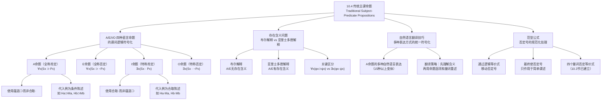

**相关笔记：** [[10.3 全称量词与存在量词]] | [[10.5 有效性证明]]

> [!abstract] 概览
> 本节运用存在量词和全称量词，将传统逻辑中的四种直言命题（A/E/I/O）精确地符号化为谓词逻辑表达式。核心知识点包括：
> - **A命题（全称肯定）**：所有S是P，符号化为 $\forall x(Sx \supset Px)$，使用==实质蕴涵==而非合取
> - **E命题（全称否定）**：所有S不是P，符号化为 $\forall x(Sx \supset \sim Px)$
> - **I命题（特称肯定）**：有些S是P，符号化为 $\exists x(Sx \cdot Px)$，使用==合取==而非蕴涵
> - **O命题（特称否定）**：有些S不是P，符号化为 $\exists x(Sx \cdot \sim Px)$
> - **存在含义问题**：A/E命题在布尔解释下==无存在含义==，I/O命题==有存在含义==
> - **范型公式**：否定号只作用于简单谓述的公式，便于逻辑操作

---

## 一、知识结构总览

---

## 二、核心思想与证明技巧

> [!tip] 核心思想
> 将传统逻辑的四种直言命题（A/E/I/O）翻译为谓词逻辑符号，揭示了自然语言表面相似性之下的==深层逻辑结构差异==。A命题和I命题虽然在自然语言中仅差"所有"和"有些"二字，但它们对应的命题函项完全不同——一个含有蕴涵号 $\supset$，另一个含有合取号 $\cdot$。这一差异是理解==存在含义问题==的关键。

### A命题的符号化：全称肯定

> [!def] A命题（全称肯定，Universal Affirmative）
> 标准形式："所有S是P"。以"所有人是有死的"为例，逐步翻译过程如下：
>
> 1. **自然语言重述**：给定不管任何事物，如果它是人，它是有死的。
> 2. **引入个体变元**：给定任何 $x$，如果 $x$ 是人，那么 $x$ 是有死的。
> 3. **引入实质蕴涵**：给定任何 $x$，$x$ 是人 $\supset$ $x$ 是有死的。
> 4. **命题函项 + 全称量词**：$(x)(Hx \supset Mx)$

**关键理解：** A命题是以条件陈述为代入例的命题函项的全称量化式。命题函项 $Hx \supset Mx$ 的代入例是 $Ha \supset Ma$、$Hb \supset Mb$、$Hc \supset Mc$ 等——它们都是条件陈述，而非合取陈述。

> [!example] 示例：A命题的多种自然语言表达
> 以下自然语言句子虽然表述不同，但都应符号化为同一个A命题 $(x)(Hx \supset Mx)$：
> - "H是M"
> - "一个H就是一个M"
> - "每个H是M"
> - "没有H不是M"
> - "如果任何事物是H，那么它是M"
> - "没有什么是H但不是M"
> - "没什么是H，除非它是M"

### E命题的符号化：全称否定

> [!def] E命题（全称否定，Universal Negative）
> 标准形式："所有S不是P"。以"所有人都不是有死的"为例：
>
> 1. **自然语言重述**：如果任何事物是人，则它不是有死的。
> 2. **引入个体变元**：对任何给定的事物 $x$，如果 $x$ 是人，则 $x$ 不是有死的。
> 3. **符号化**：$(x)(Hx \supset \sim Mx)$

**等价表述：** "没有是M的H"、"没有什么既是H又是M"、"H从不是M"都符号化为同一个E命题。

### I命题的符号化：特称肯定

> [!def] I命题（特称肯定，Particular Affirmative）
> 标准形式："有些S是P"。以"有些人是有死的"为例：
>
> 1. **自然语言重述**：至少有一个是人且有死的事物。
> 2. **引入个体变元**：至少有这样一个 $x$，$x$ 是人并且 $x$ 是有死的。
> 3. **符号化**：$(\exists x)(Hx \cdot Mx)$

**关键理解：** I命题使用==合取== $\cdot$ 而非蕴涵 $\supset$。这是因为"有些S是P"断言的是存在一个事物同时具有S和P两个属性，而非一个条件关系。

### O命题的符号化：特称否定

> [!def] O命题（特称否定，Particular Negative）
> 标准形式："有些S不是P"。以"有些人不是有死的"为例：
>
> 1. **自然语言重述**：至少存在一个是人但不是有死的事物。
> 2. **引入个体变元**：至少存在这样一个 $x$，$x$ 是人并且 $x$ 不是有死的。
> 3. **符号化**：$(\exists x)(Hx \cdot \sim Mx)$

### 四种命题的符号化总结

| 命题类型 | 标准形式 | 符号化 | 联结词 | 量词 |
|:---------|:---------|:-------|:-------|:-----|
| A（全称肯定） | 所有S是P | $\forall x(Sx \supset Px)$ | 蕴涵 $\supset$ | 全称 $\forall$ |
| E（全称否定） | 所有S不是P | $\forall x(Sx \supset \sim Px)$ | 蕴涵 + 否定 $\supset \sim$ | 全称 $\forall$ |
| I（特称肯定） | 有些S是P | $\exists x(Sx \cdot Px)$ | 合取 $\cdot$ | 存在 $\exists$ |
| O（特称否定） | 有些S不是P | $\exists x(Sx \cdot \sim Px)$ | 合取 + 否定 $\cdot \sim$ | 存在 $\exists$ |

### 存在含义问题

> [!warning] 核心问题：A命题为真时，I命题却可能为假
> 考虑命题函项" $x$ 是人首马身的怪物"，简写为 $Cx$。因为不存在人首马身的怪物，$Cx$ 的每个代入例都为假。
>
> - A命题 $(x)(Cx \supset Bx)$ 为**真**：因为 $Cx \supset Bx$ 的每个代入例都是前件为假的条件陈述，而前件为假的条件陈述必定为真
> - I命题 $(\exists x)(Cx \cdot Bx)$ 为**假**：因为 $Cx \cdot Bx$ 的每个代入例都是第一个合取支为假的合取陈述，全部为假
>
> 因此，==有可能一个A命题是真的，而与之对应的I命题却是假的==。同理，E命题为真时O命题也可能为假。

**关键结论：**

- **A命题和E命题**并不断言或假定任何事物存在，它们仅断言条件关系：如果有某件事，则有另外一件事
- **I命题和O命题**假定某物存在，它们断言存在具有特定属性的事物
- ==存在量词是区别的关键==：I/O命题中的存在量词断言了事物的存在，而A/E命题中的全称量词并不如此

> [!info] 布尔解释 vs 亚里士多德解释
> - **布尔解释（现代逻辑）**：A/E命题无存在含义——"所有人是有死的"并不蕴涵"存在人"
> - **亚里士多德解释（传统逻辑）**：A/E命题有存在含义——"所有人是有死的"预设了人的存在
> - 现代谓词逻辑采用布尔解释，这使得逻辑系统更加严谨，避免了从无存在含义的命题推出存在断言的错误

### 范型公式

> [!def] 范型公式（Normal Form）
> **否定号只作用于简单谓述**的公式称为范型公式。通过运用量词否定等价式（10.3节）、德·摩根律、双重否定律和实质蕴涵定义，可以将任何公式转化为范型公式。

**转换示例：**

$$\sim(\exists x)(Fx \cdot \sim Gx)$$

**第一步**（量词否定等价式）：

$$(x)\sim(Fx \cdot \sim Gx)$$

**第二步**（德·摩根律）：

$$(x)(\sim Fx \lor \sim\sim Gx)$$

**第三步**（双重否定律）：

$$(x)(\sim Fx \lor Gx)$$

**第四步**（实质蕴涵定义）：

$$(x)(Fx \supset Gx)$$

---

## 三、补充理解与易混淆点

### 补充理解

> [!info] 补充1：存在含义在现代逻辑中的处理
> **来源：** Strawson, P.F. (1952). *Introduction to Logical Theory*. Methuen.
>
> P.F. 斯特劳森（P.F. Strawson）在其经典著作中提出了对存在含义问题的深刻哲学分析。斯特劳森区分了==语句（sentence）==和==命题（statement/使用）==：
>
> 1. **语句的预设（presupposition）**：语句"当今法国国王是秃子"预设了"当今法国国王存在"。如果预设不满足（法国已无国王），该语句既不真也不假——它==缺乏真值==（truth-value gap），而非简单地取假值
> 2. **布尔解释的局限**：在布尔解释下，"所有当今法国国王是秃子" $(x)(Kx \supset Bx)$ 为真（因为不存在当今法国国王，条件陈述的前件总为假）。但斯特劳森认为，日常语言使用者不会认为这句话为真——他们会说这句话的预设不成立
> 3. **对谓词逻辑的影响**：斯特劳森的分析表明，谓词逻辑对A/E命题的布尔解释虽然逻辑上自洽，但==偏离了自然语言的直觉用法==。这一张力推动了后来自由逻辑（free logic）等非经典逻辑系统的发展
>
> 斯特劳森的核心洞见是：==自然语言中的主谓语句通常预设主项指称的对象存在==，而现代谓词逻辑通过使用条件陈述来避免这一预设，从而获得更大的普遍性和逻辑严谨性。

> [!info] 补充2：谓词逻辑对传统三段论的精确化
> **来源：** Copi, I.M. (1954). *Symbolic Logic*. Macmillan.
>
> 传统三段论理论（亚里士多德创立）使用A/E/I/O四种命题及其对当方阵、换位、换质等规则来评估论证的有效性。柯匹（I.M. Copi）在《符号逻辑》中展示了谓词逻辑如何==精确化和超越==传统三段论理论：
>
> 1. **三段论的谓词逻辑表示**：经典三段论"所有人是有死的；所有希腊人是人；因此所有希腊人是有死的"可以精确表示为：
>    $$(x)(Hx \supset Mx), \quad (x)(Gx \supset Hx) \quad \therefore (x)(Gx \supset Mx)$$
>    其有效性可以通过量化规则（UI、UG等）严格证明
>
> 2. **传统理论的局限**：传统三段论理论无法处理含有关系谓词的论证（如"每个人都爱某个人"）、含有多个量词的论证（如"每个学生都有某个老师"），也无法处理单称命题（如"苏格拉底是有死的"）与其他命题的混合推理
>
> 3. **谓词逻辑的优势**：谓词逻辑将三段论作为特例包含在内，同时能够处理传统理论无法涵盖的大量论证形式。它提供了一个==统一、精确、可扩展==的逻辑框架
>
> 4. **存在含义的澄清**：谓词逻辑通过区分全称量化和存在量化，精确地揭示了传统对当方阵中哪些推理是有效的、哪些是无效的。例如，在布尔解释下，从A命题推出I命题（差等关系）是无效的——这一结论在传统理论中是无法得出的

### 易混淆点

> [!warning] 误区：A命题用合取(·)而非蕴涵(⊃)
> ❌ **错误理解：** "所有S是P"符号化为 $\forall x(Sx \cdot Px)$——意思是"对所有 $x$，$x$ 既是S又是P"。
> ✅ **正确理解：** "所有S是P"符号化为 $\forall x(Sx \supset Px)$——意思是"对所有 $x$，如果 $x$ 是S，那么 $x$ 是P"。
>
> **辨析：** 如果使用合取 $\forall x(Sx \cdot Px)$，则该命题断言宇宙中**每一个事物**都既是S又是P，这显然不是"所有S是P"的含义。例如，"所有人是有死的"并不要求宇宙中每个事物都是人且有死的——它只要求：**凡是人的事物，都是有死的**。这正是蕴涵 $\supset$ 所表达的条件关系。
>
> **反例验证：** 设 $a$ 是一张桌子（不是人也不是有死的），则：
> - $\forall x(Hx \supset Mx)$ 中，$Ha \supset Ma$ 为真（前件为假的条件陈述为真）——符合直觉
> - $\forall x(Hx \cdot Mx)$ 中，$Ha \cdot Ma$ 为假（桌子既不是人也不是有死的）——导致整个全称命题为假，违反直觉

> [!warning] 误区：I命题用蕴涵(⊃)而非合取(·)
> ❌ **错误理解：** "有些S是P"符号化为 $\exists x(Sx \supset Px)$。
> ✅ **正确理解：** "有些S是P"符号化为 $\exists x(Sx \cdot Px)$。
>
> **辨析：** $\exists x(Sx \supset Px)$ 是一个非常平庸的命题——它几乎总是为真。因为 $Sx \supset Px$ 在 $x$ 不是S时自动为真（前件为假），所以只要宇宙中存在任何一个不是S的事物，$\exists x(Sx \supset Px)$ 就为真。例如，$\exists x(Cx \supset Bx)$（"至少存在一个事物，如果它是人首马身的怪物，那么它是漂亮的"）在假定宇宙中至少存在一个个体的情况下几乎总是为真，因为它可以由任何不是人首马身的怪物的事物来满足。
>
> 而 $\exists x(Sx \cdot Px)$ 则真正断言了==存在一个同时具有S和P属性的事物==，这才是"有些S是P"的正确含义。

---

## 四、习题精选

> [!todo] 习题概览
> | 题号 | 来源 | 核心考点 | 难度 |
> |:-----|:-----|:---------|:-----|
> | 1 | 教材A组改编 | A/E/I/O命题的符号化 | ⭐ |
> | 2 | 教材C组改编 | 范型公式的转换 | ⭐⭐ |
> | 3 | 自编 | 存在含义问题的理解 | ⭐⭐⭐ |

### 题1：A/E/I/O命题的符号化

> [!problem] 题目
> 用所提示的缩写，将以下每个句子翻译成量词和命题函项的逻辑符号，使每个公式都以量词而不是否定号开头。
>
> (a) 没有畜生是没有一点同情心的。（$Bx$: $x$ 是畜生；$Px$: $x$ 是有同情心的）
>
> (b) 记者在场。（$Rx$: $x$ 是记者；$Px$: $x$ 在场）
>
> (c) 外交家并非都富有。（$Dx$: $x$ 是外交家；$Rx$: $x$ 富有）
>
> (d) 只有拿到执业资格证书的内科医师才能负责医疗。（$Lx$: $x$ 是拿到执业资格证书的内科医师；$Cx$: $x$ 能负责医疗）

> [!faq]- 解答
> **[步骤1]** 分析 (a) "没有畜生是没有一点同情心的"：
> - "没有S不P"等价于"所有S是P"，即A命题
> - 符号化：$(x)(Bx \supset Px)$
>
> **[步骤2]** 分析 (b) "记者在场"：
> - "记者在场"意味着"至少有一个记者在场"，即I命题
> - 符号化：$(\exists x)(Rx \cdot Px)$
>
> **[步骤3]** 分析 (c) "外交家并非都富有"：
> - "并非都"即"不是所有"，等价于"有些不"，即O命题
> - 符号化：$(\exists x)(Dx \cdot \sim Rx)$
>
> **[步骤4]** 分析 (d) "只有拿到执业资格证书的内科医师才能负责医疗"：
> - "只有S才P"等价于"所有P是S"，即A命题
> - 符号化：$(x)(Cx \supset Lx)$
>
> $\blacksquare$

> [!tip] 解题思路提示
> 翻译自然语言为谓词逻辑的关键步骤：
> 1. **识别命题类型**：判断是A/E/I/O中的哪一种
> 2. **确定联结词**：A/E用蕴涵 $\supset$，I/O用合取 $\cdot$
> 3. **确定量词**：A/E用全称 $\forall$，I/O用存在 $\exists$
> 4. **处理否定**：如果句子以否定开头（如"没有..."、"并非..."），先转换为肯定形式的等价命题，再符号化
> 5. **注意"只有"**："只有S才P" = "所有P是S"（$\forall x(Px \supset Sx)$），主项和谓项的位置会交换

### 题2：范型公式的转换

> [!problem] 题目
> 给下面的每个公式找一个与之逻辑等价的范型公式（否定号只作用于简单谓述）。
>
> (a) $\sim(x)(Ax \supset Bx)$
>
> (b) $\sim(\exists x)(Gx \cdot \sim Hx)$

> [!faq]- 解答
> **[步骤1]** 转换 (a) $\sim(x)(Ax \supset Bx)$：
> - 量词否定等价式：$\sim(x)\phi x \equiv (\exists x)\sim\phi x$
> - 第一步：$(\exists x)\sim(Ax \supset Bx)$
> - 实质蕴涵定义：$Ax \supset Bx \equiv \sim Ax \lor Bx$，所以 $\sim(Ax \supset Bx) \equiv \sim(\sim Ax \lor Bx)$
> - 第二步：$(\exists x)\sim(\sim Ax \lor Bx)$
> - 德·摩根律：$\sim(\sim Ax \lor Bx) \equiv Ax \cdot \sim Bx$
> - 第三步（范型公式）：$(\exists x)(Ax \cdot \sim Bx)$
>
> **[步骤2]** 转换 (b) $\sim(\exists x)(Gx \cdot \sim Hx)$：
> - 量词否定等价式：$\sim(\exists x)\phi x \equiv (x)\sim\phi x$
> - 第一步：$(x)\sim(Gx \cdot \sim Hx)$
> - 德·摩根律：$\sim(Gx \cdot \sim Hx) \equiv \sim Gx \lor \sim\sim Hx$
> - 第二步：$(x)(\sim Gx \lor \sim\sim Hx)$
> - 双重否定律：$\sim\sim Hx \equiv Hx$
> - 第三步：$(x)(\sim Gx \lor Hx)$
> - 实质蕴涵定义：$\sim Gx \lor Hx \equiv Gx \supset Hx$
> - 第四步（范型公式）：$(x)(Gx \supset Hx)$
>
> $\blacksquare$

### 题3：存在含义问题

> [!problem] 题目
> 判断以下推理是否有效，并说明理由。
>
> (a) 从"所有独角兽都是白色的"推出"有些独角兽是白色的"。
>
> (b) 从"所有独角兽都是白色的"推出"如果任何事物是独角兽，那么它是白色的"。

> [!faq]- 解答
> **[步骤1]** 分析 (a)：
> - "所有独角兽都是白色的"：$(x)(Ux \supset Wx)$
> - "有些独角兽是白色的"：$(\exists x)(Ux \cdot Wx)$
> - 在布尔解释下，$(x)(Ux \supset Wx)$ 为真（因为不存在独角兽，条件陈述的前件总为假），但 $(\exists x)(Ux \cdot Wx)$ 为假（因为不存在独角兽，合取陈述没有真代入例）
> - 因此，==该推理无效==。从一个不假定事物存在的全称命题不能推出断言事物存在的特称命题
>
> **[步骤2]** 分析 (b)：
> - "所有独角兽都是白色的"：$(x)(Ux \supset Wx)$
> - "如果任何事物是独角兽，那么它是白色的"：$(x)(Ux \supset Wx)$
> - 两个命题的符号化完全相同
> - 因此，==该推理有效==（实际上是同一命题的两种表述）
>
> **[步骤3]** 关键总结：
> - A命题 $\to$ I命题：**无效**（存在含义问题）
> - A命题 $\to$ 条件陈述形式：**有效**（逻辑等价）
> - 这揭示了A命题和I命题之间不仅是量词的不同，更是==命题函项结构的不同==（$\supset$ vs $\cdot$）
>
> $\blacksquare$

---

## 五、视频学习指南

> [!info] 视频资源
> | 资源 | 链接 | 对应内容 | 备注 |
> |:-----|:-----|:---------|:-----|
> | Wireless Philosophy: Categorical Propositions | [链接](https://www.youtube.com/watch?v=-le7VwGMYsg) | A/E/I/O四种直言命题 | 英文，配合动画讲解 |
> | Kevin deLaplante: Square of Opposition | [链接](https://www.youtube.com/watch?v=dlK_MlRuH70) | 对当方阵与存在含义 | 英文，适合入门 |
> | Michael Genesereth: Symbolic Logic | [链接](https://www.youtube.com/playlist?list=PLgJhD2E7fQMx2Ji8K8q0sQOw3s8cF7yK) | 谓词逻辑符号化 | 英文，斯坦福大学课程 |

---

## 六、教材原文

> [!quote] 教材原文
> **来源：** 逻辑学导论 第15版，第10章第4节
>
> **A命题的量化：**
> A命题"所有人都是有死的"断言，如果任何东西是人，则它是有死的。换句话说，对任何给定的东西x，如果x是人，则x是有死的。用马蹄符代替"如果那么"，则我们得到：给定任何x，x是人⊃x是有死的。用命题函项和量词表示，则为：(x)[Hx⊃Mx]。
>
> **E命题的量化：**
> E命题"所有人都不是有死的"断言，如果任何事物是人，则它不是有死的。用命题函项和量词表示，则为：(x)[Hx⊃～Mx]。
>
> **I命题的量化：**
> I命题"有些人是有死的"断言，至少有一个是人且有死的事物。用命题函项和量词表示，则为：(∃x)[Hx·Mx]。
>
> **O命题的量化：**
> O命题"有些人不是有死的"断言，至少存在一个是人但不是有死的事物。用命题函项和量词表示，则为：(∃x)[Hx·～Mx]。
>
> **存在含义问题：**
> A命题和E命题并不断言或假定任何事物存在，它们仅断言情况是这样的：如果有某件事，则有另外一件事。但I命题和O命题却假定某物存在，它们断言情形是这样的：有这件事并且有另一件事。I命题和O命题中的存在量词是区别的关键所在。从一个并不断言或假定任何事物存在的命题推出某物的存在，这显然是错误的。
>
> **范型公式：**
> 我们把否定号只作用于其简单谓述的公式称为范型公式。通过替换逻辑等价的表述式，可以移动否定号，使它们最终不再作用于复合表达式，而只作用于简单谓述。

---

## 参见 Wiki

- [[有效性]] -- 论证有效性的概念，是理解量化证明的基础
- [[直言命题]] -- 传统逻辑中A/E/I/O四种命题的完整概念页
- [[A_E_I_O 四种命题]] -- 四种直言命题的详细分类与性质
- [[10.3 全称量词与存在量词]] -- 量词否定等价式的建立，是本节符号化的基础
- [[10.5 有效性证明]] -- 运用本节符号化结果构造量化证明
- [[存在含义]] -- 存在含义问题的完整概念页
- [[传统对当方阵|对当方阵]] -- A/E/I/O之间的逻辑关系

#学习/逻辑学/谓词逻辑
