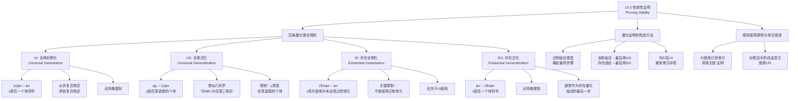

**相关笔记：** [[10.4 传统主谓命题]] | [[10.6 无效性证明]]

> [!abstract] 概览
> 本节为谓词逻辑的论证有效性证明引入==四条量化推论规则==，使自然演绎系统从命题逻辑扩展到谓词逻辑。核心知识点包括：
> - **全称实例化（UI）**：从全称量化式推出任一代入例，$(x)\phi x \therefore \phi\nu$
> - **存在泛化（EG）**：从任一代入例推出存在量化式，$\phi\nu \therefore (\exists x)\phi x$
> - **全称泛化（UG）**：从任意选取个体的代入例推出全称量化式，$\phi y \therefore (x)\phi x$
> - **存在实例化（EI）**：从存在量化式推出新常元的代入例，$(\exists x)\phi x \therefore \phi\nu$（$\nu$须为语境中未出现过的常元）
> - 四条规则与命题逻辑19条规则的==配合使用==，构造完整的谓词逻辑形式证明

---

## 一、知识结构总览



---

## 二、核心思想与证明技巧

> [!tip] 核心思想
> 谓词逻辑的形式证明是在命题逻辑19条推论规则的基础上，增加四条量化规则来实现的。量化规则的核心功能是==在非复合陈述（量化命题）和复合陈述（命题函项的代入例）之间建立桥梁==。UI和UG处理全称量化，EI和EG处理存在量化。构造量化证明的关键策略是：==先识别结论的量化类型，再倒推确定最终步骤和中间步骤==。

### 规则1：全称实例化（UI）

> [!def] 全称实例化（Universal Instantiation, U.I.）
> 从一个命题函项的==全称量化式==，可以推出它的==任一代入例==。
>
> **形式：**
> $$\frac{(x)\phi x}{\therefore \phi\nu} \quad (\nu \text{ 是任一个体符号})$$
>
> **直觉理解：** 如果一个命题函项的所有代入例都为真（全称量化式的含义），那么它的任何一个特定的代入例也必然为真。

**功能说明：** UI使我们能够从非复合陈述（如 $(x)(Hx \supset Mx)$）得到复合陈述（如 $Hs \supset Ms$），从而可以对其运用命题逻辑的推论规则（如肯定前件式）。

> [!example] 示例：UI的基本使用
> 论证："所有人是有死的。苏格拉底是人。所以苏格拉底是有死的。"
>
> | 行号 | 陈述 | 理由 |
> |:-----|:-----|:-----|
> | 1 | $(x)(Hx \supset Mx)$ | 前提 |
> | 2 | $Hs$ | 前提 |
> | $\therefore$ | $Ms$ |  |
> | 3 | $Hs \supset Ms$ | 1, U.I. |
> | 4 | $Ms$ | 3, 2, M.P. |

### 规则2：全称泛化（UG）

> [!def] 全称泛化（Universal Generalization, U.G.）
> 从一个命题函项关于==任意选取的个体==的代入例，可以推出该命题函项的==全称量化式==。
>
> **形式：**
> $$\frac{\phi y}{\therefore (x)\phi x} \quad (y \text{ 指称"一任意选取的个体"})$$
>
> **直觉理解：** 类似于几何学中"令ABC是一个任意选取的三角形"的证明策略——如果我们能证明某个性质对任意选取的个体 $y$ 成立，那么该性质对所有个体都成立。

**关键概念——"任意选取的个体" $y$：**

- $y$ 是一个特殊的个体符号，类似于几何学中的"任意三角形ABC"
- 对 $y$ 所做的唯一假定是它是一个个体词，没有其他特殊假定
- $y$ 通常通过UI引入证明中
- 只有当个体符号是"任意选取的"时，才允许使用UG

> [!example] 示例：UI + UG 的配合使用
> 论证："所有人是有死的。所有希腊人都是人。因此所有希腊人都是有死的。"
>
> | 行号 | 陈述 | 理由 |
> |:-----|:-----|:-----|
> | 1 | $(x)(Hx \supset Mx)$ | 前提 |
> | 2 | $(x)(Gx \supset Hx)$ | 前提 |
> | $\therefore$ | $(x)(Gx \supset Mx)$ |  |
> | 3 | $Hy \supset My$ | 1, U.I. |
> | 4 | $Gy \supset Hy$ | 2, U.I. |
> | 5 | $Gy \supset My$ | 4, 3, H.S. |
> | 6 | $(x)(Gx \supset Mx)$ | 5, U.G. |

**证明思路解析：**
1. 使用UI将两个全称前提实例化为关于任意个体 $y$ 的条件陈述
2. 使用假言三段论（H.S.）得到 $Gy \supset My$
3. 由于 $y$ 是任意选取的个体，使用UG将结论泛化为全称量化式

### 规则3：存在实例化（EI）

> [!def] 存在实例化（Existential Instantiation, E.I.）
> 从一个命题函项的==存在量化式==，可以推出关于==在其语境中先前没有出现过的任一个体常元==（除 $y$ 之外）的代入例。
>
> **形式：**
> $$\frac{(\exists x)\phi x}{\therefore \phi\nu} \quad (\nu \text{ 是在语境中先前没有出现过的个体常元，除 } y \text{ 之外})$$
>
> **直觉理解：** 如果至少存在一个具有属性 $\phi$ 的个体，我们可以给这个（或这些）个体中的某一个取一个新名字 $\nu$，然后谈论 $\phi\nu$。关键在于：$\nu$ 必须是一个**新名字**，不能与证明中已经使用的名字相同。

**使用限制的动机：** 如果不限制 $\nu$ 必须是新名字，就可能将两个不同的存在命题实例化为同一个个体常元，从而得出无效结论。

> [!warning] EI限制的必要性：一个无效"证明"的反例
> 论证："有些短吻鳄被关在笼子里。有些鸟被关在笼子里。因此有些短吻鳄是鸟。"——这显然是无效的。
>
> 如果不遵守EI的限制，可以构造如下错误的"证明"：
>
> | 行号 | 陈述 | 理由 |
> |:-----|:-----|:-----|
> | 1 | $(\exists x)(Ax \cdot Cx)$ | 前提 |
> | 2 | $(\exists x)(Bx \cdot Cx)$ | 前提 |
> | $\therefore$ | $(\exists x)(Ax \cdot Bx)$ |  |
> | 3 | $Aa \cdot Ca$ | 1, E.I. |
> | 4 | $Ba \cdot Ca$ | 2, E.I. (**错!**) |
> | 5 | $Aa$ | 3, Simp. |
> | 6 | $Ba$ | 4, Simp. |
> | 7 | $Aa \cdot Ba$ | 5, 6, Conj. |
> | 8 | $(\exists x)(Ax \cdot Bx)$ | 7, E.G. |
>
> **错误在第4行**：$a$ 在第3行已经被用来指称一只关在笼子里的短吻鳄，不能在第4行再次用来指称一只关在笼子里的鸟。被关在笼子里的短吻鳄和被关在笼子里的鸟可能是完全不同的个体。

### 规则4：存在泛化（EG）

> [!def] 存在泛化（Existential Generalization, E.G.）
> 从一个命题函项的==任一为真的代入例==，可以推出该命题函项的==存在量化式==。
>
> **形式：**
> $$\frac{\phi\nu}{\therefore (\exists x)\phi x} \quad (\nu \text{ 是任一个体符号})$$
>
> **直觉理解：** 如果某个特定的个体 $\nu$ 具有属性 $\phi$，那么至少存在一个具有属性 $\phi$ 的个体。

**功能说明：** EG通常作为存在量化结论的==最后一步==。当我们通过推理得到了某个特定个体的属性陈述后，使用EG将其推广为存在量化式。

> [!example] 示例：四条规则的完整配合
> 论证："所有罪犯都是邪恶的。有些人是罪犯。因此有些人是邪恶的。"
>
> | 行号 | 陈述 | 理由 |
> |:-----|:-----|:-----|
> | 1 | $(x)(Cx \supset Vx)$ | 前提 |
> | 2 | $(\exists x)(Hx \cdot Cx)$ | 前提 |
> | $\therefore$ | $(\exists x)(Hx \cdot Vx)$ |  |
> | 3 | $Ha \cdot Ca$ | 2, E.I. |
> | 4 | $Ca \supset Va$ | 1, U.I. |
> | 5 | $Ca \cdot Ha$ | 3, Com. |
> | 6 | $Ca$ | 5, Simp. |
> | 7 | $Va$ | 4, 6, M.P. |
> | 8 | $Ha$ | 3, Simp. |
> | 9 | $Ha \cdot Va$ | 8, 7, Conj. |
> | 10 | $(\exists x)(Hx \cdot Vx)$ | 9, E.G. |

### 四条量化规则总结

| 规则 | 缩写 | 形式 | 功能 | 限制 |
|:-----|:-----|:-----|:-----|:-----|
| 全称实例化 | UI | $(x)\phi x \therefore \phi\nu$ | 从全称到特例 | 无特殊限制 |
| 全称泛化 | UG | $\phi y \therefore (x)\phi x$ | 从任意特例到全称 | $y$ 须是任意选取的个体 |
| 存在实例化 | EI | $(\exists x)\phi x \therefore \phi\nu$ | 从存在到新常元代入例 | $\nu$ 须为语境中未出现过的常元 |
| 存在泛化 | EG | $\phi\nu \therefore (\exists x)\phi x$ | 从特例到存在 | 无特殊限制 |

### 量化证明的构造策略

> [!tip] 证明构造技巧
> 构造量化证明的一般策略：
>
> 1. **识别结论类型**：
>    - 结论是全称量化式（$(x)\phi x$）→ 最后一步用 **UG**
>    - 结论是存在量化式（$(\exists x)\phi x$）→ 最后一步用 **EG**
>
> 2. **确定实例化策略**：
>    - 需要使用存在前提时 → 用 **EI**（注意：必须使用新常元）
>    - 需要使用全称前提时 → 用 **UI**
>    - ==关键原则：先EI后UI==，这样可以对两者使用同一个个体常元
>
> 3. **中间推理**：
>    - 实例化后，运用命题逻辑的19条规则进行推理
>    - UI将非复合陈述转化为复合陈述，使命题逻辑规则得以应用
>
> 4. **最终泛化**：
>    - 根据结论类型，使用UG或EG完成证明

---

## 三、补充理解与易混淆点

### 补充理解

> [!info] 补充1：量化规则的使用限制及其哲学动机
> **来源：** Kalish, D. & Montague, R. (1964). *Logic: Techniques of Formal Reasoning*. Harcourt.
>
> 卡利什（Kalish）和蒙塔古（Montague）在其形式逻辑教材中，对量化规则的使用限制提供了深入的哲学分析。他们的核心观点是：==量化规则的限制并非任意的技术性规定，而是反映了量词的深层逻辑语义==。
>
> 1. **EI限制的语义基础**：存在量化式 $(\exists x)\phi x$ 断言"至少存在一个具有属性 $\phi$ 的个体"，但==没有告诉我们这个个体是谁==。当我们实例化时，我们引入一个新名字来指称这个未知的个体。如果重用已有名字，就等于==断言这个已知个体就是那个未知个体==，这是没有根据的。因此，EI要求使用新常元，本质上是==尊重存在量化式所传达的信息的有限性==
>
> 2. **UG限制的语义基础**：全称泛化要求我们证明的个体是"任意选取的"——即除了它是论域中的一个个体之外，没有对它做任何特殊假定。如果我们对 $y$ 做了特殊假定（例如在条件证明中假设 $Fy$），那么 $y$ 就不再是"任意的"，对它使用UG就==超出了已证明的范围==
>
> 3. **"任意性"的哲学意义**：UG中"任意选取的个体"概念与数学中"不失一般性"（without loss of generality）的证明策略一脉相承。它体现了==从特殊到一般的推理合法性条件==：只有当特殊性的来源被完全消除时，从特殊到一般的推理才是有效的

> [!info] 补充2：自然演绎系统从命题逻辑到谓词逻辑的扩展
> **来源：** Copi, I.M., Cohen, C. & McMahon, K. *Introduction to Logic*, 15th ed.
>
> 自然演绎系统（Natural Deduction System）是由根岑（Gerhard Gentzen, 1935）和雅斯可夫斯基（Stanislaw Jaskowski, 1934）独立提出的逻辑证明系统。柯匹等人指出，从命题逻辑到谓词逻辑的扩展是==自然演绎系统最核心的发展==：
>
> 1. **命题逻辑的局限**：命题逻辑的19条推论规则只能处理命题之间的逻辑关系，无法分析命题的内部结构。例如，"所有人是有死的；苏格拉底是人；所以苏格拉底是有死的"在命题逻辑中只能表示为 $p, q \therefore r$，无法证明其有效性
>
> 2. **量化规则的桥梁作用**：四条量化规则的核心功能是在==非复合陈述==（如 $(x)(Hx \supset Mx)$）和==复合陈述==（如 $Hs \supset Ms$）之间建立桥梁。UI和EI负责"拆开"量化式，UG和EG负责"组装"量化式。这使得命题逻辑的19条规则可以在量化命题的内部结构上发挥作用
>
> 3. **系统的保守性**：谓词逻辑的自然演绎系统是命题逻辑系统的==保守扩展==——命题逻辑的所有有效论证在谓词逻辑中仍然有效，所有命题逻辑的推论规则在谓词逻辑中仍然可用。新增加的四条量化规则只是增加了处理量化命题的能力，而不改变原有规则的行为
>
> 4. **可靠性与完全性**：一个理想的自然演绎系统应该满足：可靠性（soundness）——所有可证明的论证都是有效的；完全性（completeness）——所有有效的论证都是可证明的。对于一阶谓词逻辑，哥德尔（Kurt Godel, 1930）证明了完全性定理，表明自然演绎系统（在正确表述的情况下）能够证明所有有效的谓词逻辑论证

### 易混淆点

> [!warning] 误区：UI和EI的使用限制相同
> ❌ **错误理解：** UI和EI都可以自由地实例化为任何个体符号。
> ✅ **正确理解：** UI可以实例化为==任何个体符号==（包括证明中已经出现的常元），但EI只能实例化为==语境中先前没有出现过的个体常元==（除 $y$ 之外）。
>
> **辨析：**
> - **UI** $(x)(Hx \supset Mx) \therefore Hs \supset Ms$：合法——全称量化式断言所有个体都满足条件，因此对任何特定个体（包括已命名的 $s$）都成立
> - **EI** $(\exists x)(Hx \cdot Cx) \therefore Ha \cdot Ca$：合法——$a$ 是新名字，用来指称那个存在的个体
> - **EI** $(\exists x)(Hx \cdot Cx) \therefore Hs \cdot Cs$：如果 $s$ 已在证明中出现，则==可能不合法==——我们不能假定已知的 $s$ 就是那个存在的个体
>
> **实践原则：** 在任何要同时使用EI和UI的证明中，==应该总是先使用EI==，这样就可以对两者使用同一个新常元（如 $a$），然后用UI实例化为同一个 $a$。

> [!warning] 误区：UG可以用于任何自由变元
> ❌ **错误理解：** 只要证明中出现 $\phi y$，就可以使用UG推出 $(x)\phi x$。
> ✅ **正确理解：** UG只能用于==任意选取的个体== $y$。如果 $y$ 出现在某个假设中（如条件证明的前提中），则 $y$ 不再是"任意的"，不能对它使用UG。
>
> **辨析：**
> - **合法的UG**：$y$ 仅通过UI引入，没有其他假定
>   ```
>   1. (x)(Hx ⊃ Mx)     前提
>   2. Hy ⊃ My           1, U.I.
>   3. (x)(Hx ⊃ Mx)      2, U.G.  ✓
>   ```
> - **不合法的UG**：$y$ 出现在假设中
>   ```
>   1. (x)(Fx ⊃ Gx)     前提
>   2. | Fy               假设（CP）
>   3. | Gy               1, U.I., 2, M.P.
>   4. Fy ⊃ Gy           2-3, C.P.
>   5. (x)(Fx ⊃ Gx)      4, U.G.  ✓（对第4行用UG是合法的，
>                                  因为y在第4行中不在假设中）
>   ```
>
> **关键判断标准：** 在使用UG时，检查该行是否依赖于某个包含自由变元 $y$ 的假设。如果依赖，则不能对该行使用UG。

---

## 四、习题精选

> [!todo] 习题概览
> | 题号 | 来源 | 核心考点 | 难度 |
> |:-----|:-----|:---------|:-----|
> | 1 | 教材A组例题 | UI + EI + EG 的配合使用 | ⭐⭐ |
> | 2 | 教材B组改编 | 全称结论的证明（UI + UG） | ⭐⭐ |
> | 3 | 自编 | 综合量化证明 | ⭐⭐⭐ |

### 题1：存在结论的量化证明

> [!problem] 题目
> 为以下论证构造一个有效形式证明：
>
> $$(x)(Ax \supset \sim Bx)$$
> $$(\exists x)(Cx \cdot Ax)$$
> $$\therefore (\exists x)(Cx \cdot \sim Bx)$$

> [!faq]- 解答
> **证明思路：** 结论是存在量化式，最后一步用EG。需要先对存在前提用EI，对全称前提用UI，然后进行中间推理。
>
> **关键原则：先EI后UI，使用同一个常元 $a$。**
>
> | 行号 | 陈述 | 理由 |
> |:-----|:-----|:-----|
> | 1 | $(x)(Ax \supset \sim Bx)$ | 前提 |
> | 2 | $(\exists x)(Cx \cdot Ax)$ | 前提 |
> | $\therefore$ | $(\exists x)(Cx \cdot \sim Bx)$ |  |
> | 3 | $Ca \cdot Aa$ | 2, E.I. |
> | 4 | $Aa \supset \sim Ba$ | 1, U.I. |
> | 5 | $Aa$ | 3, Simp. |
> | 6 | $\sim Ba$ | 4, 5, M.P. |
> | 7 | $Ca$ | 3, Simp. |
> | 8 | $Ca \cdot \sim Ba$ | 7, 6, Conj. |
> | 9 | $(\exists x)(Cx \cdot \sim Bx)$ | 8, E.G. |
>
> $\blacksquare$

> [!tip] 解题思路提示
> 存在结论的证明模板：
> 1. 对存在前提使用EI，引入新常元 $a$
> 2. 对全称前提使用UI，实例化为同一个 $a$
> 3. 运用命题逻辑规则（Simp.、M.P.、Conj.等）进行中间推理
> 4. 最后用EG将结果推广为存在量化式

### 题2：全称结论的量化证明

> [!problem] 题目
> 用所给符号，为以下论证构造一个有效形式证明：
>
> "没有赌徒是幸福的。有些理想主义者是幸福的。因此，有些理想主义者不是赌徒。"
> ($Gx$: $x$ 是赌徒；$Hx$: $x$ 是幸福的；$Ix$: $x$ 是理想主义者)

> [!faq]- 解答
> **证明思路：** 首先将自然语言符号化，然后构造形式证明。
>
> 符号化：
> - "没有赌徒是幸福的" = "所有赌徒都不是幸福的" = $(x)(Gx \supset \sim Hx)$
> - "有些理想主义者是幸福的" = $(\exists x)(Ix \cdot Hx)$
> - "有些理想主义者不是赌徒" = $(\exists x)(Ix \cdot \sim Gx)$
>
> | 行号 | 陈述 | 理由 |
> |:-----|:-----|:-----|
> | 1 | $(x)(Gx \supset \sim Hx)$ | 前提 |
> | 2 | $(\exists x)(Ix \cdot Hx)$ | 前提 |
> | $\therefore$ | $(\exists x)(Ix \cdot \sim Gx)$ |  |
> | 3 | $Ia \cdot Ha$ | 2, E.I. |
> | 4 | $Ga \supset \sim Ha$ | 1, U.I. |
> | 5 | $Ha$ | 3, Simp. |
> | 6 | $\sim\sim Ha$ | 5, D.N. |
> | 7 | $\sim Ga$ | 4, 6, M.T. |
> | 8 | $Ia$ | 3, Simp. |
> | 9 | $Ia \cdot \sim Ga$ | 8, 7, Conj. |
> | 10 | $(\exists x)(Ix \cdot \sim Gx)$ | 9, E.G. |
>
> $\blacksquare$

### 题3：综合量化证明

> [!problem] 题目
> 为以下论证构造一个有效形式证明：
>
> "所有小丑都是流氓。没有流氓是幸运的。因此，没有小丑是幸运的。"
> ($Jx$: $x$ 是小丑；$Kx$: $x$ 是流氓；$Lx$: $x$ 是幸运的)

> [!faq]- 解答
> **证明思路：** 结论是全称否定命题"没有小丑是幸运的" = $(x)(Jx \supset \sim Lx)$，最后一步用UG。这个证明不需要EI（因为没有存在前提），只需要UI和UG。
>
> 符号化：
> - "所有小丑都是流氓" = $(x)(Jx \supset Kx)$
> - "没有流氓是幸运的" = $(x)(Kx \supset \sim Lx)$
> - "没有小丑是幸运的" = $(x)(Jx \supset \sim Lx)$
>
> | 行号 | 陈述 | 理由 |
> |:-----|:-----|:-----|
> | 1 | $(x)(Jx \supset Kx)$ | 前提 |
> | 2 | $(x)(Kx \supset \sim Lx)$ | 前提 |
> | $\therefore$ | $(x)(Jx \supset \sim Lx)$ |  |
> | 3 | $Jy \supset Ky$ | 1, U.I. |
> | 4 | $Ky \supset \sim Ly$ | 2, U.I. |
> | 5 | $Jy \supset \sim Ly$ | 3, 4, H.S. |
> | 6 | $(x)(Jx \supset \sim Lx)$ | 5, U.G. |
>
> $\blacksquare$

> [!tip] 解题思路提示
> 全称结论的证明模板（无存在前提时）：
> 1. 对所有全称前提使用UI，实例化为任意选取的个体 $y$
> 2. 运用命题逻辑规则（H.S.、M.P.等）进行中间推理
> 3. 最后用UG将结果泛化为全称量化式
>
> **注意：** 当证明中同时有全称前提和存在前提时，务必先EI后UI，使用同一个新常元。当只有全称前提时，直接使用 $y$ 即可。

---

## 五、视频学习指南

> [!info] 视频资源
> | 资源 | 链接 | 对应内容 | 备注 |
> |:-----|:-----|:---------|:-----|
> | Wireless Philosophy: Natural Deduction | [链接](https://www.youtube.com/watch?v=H0m2ImxG2kE) | 自然演绎系统概述 | 英文，配合动画讲解 |
> | Kevin deLaplante: Predicate Logic Proofs | [链接](https://www.youtube.com/watch?v=UHkMaY5mQgk) | 谓词逻辑证明技巧 | 英文，适合入门 |
> | Bryan Pendleton: Logic I | [链接](https://www.youtube.com/playlist?list=PL4C8BCA5E364E85CE) | 量化规则详解 | 英文，McGill大学课程 |

---

## 六、教材原文

> [!quote] 教材原文
> **来源：** 逻辑学导论 第15版，第10章第5节
>
> **全称实例化（U.I.）：**
> 一个命题函项的任一代入例都可以有效地从其全称量化式推得。形式为：(x)φx ∴ ν（ν是任一个体符号）。
>
> **全称泛化（U.G.）：**
> 从一个命题函项关于任意选取的个体名称的代入例，可以有效地推出该命题函项的全称量化式。形式为：y ∴ (x)φx（y指称"一任意选取的个体"）。类似于几何学者使用"令ABC是一个任意选取的三角形"的证明策略。
>
> **存在实例化（E.I.）：**
> 从一个命题函项的存在量化式，可以推得关于在其语境中早先没有出现过的任一个体常元（除y之外）的代入例。形式为：(∃x)φx ∴ ν（ν是任一在语境中先前没有出现过的个体，除y之外）。
>
> **存在泛化（E.G.）：**
> 从一个命题函项的任一为真的代入例，可以有效地推出该命题函项的存在量化式。形式为：ν ∴ (∃x)φx（ν是任一个体符号）。
>
> **E.I.的使用限制：**
> 由E.I.从一个命题函项的存在量化式推出的代入例，只能含有一个在语境中早先没出现过的个体符号（除y之外）。在任何要使用E.I.和U.I.的证明中，应该总是先使用E.I.。
>
> **量化规则的功能：**
> 规则U.I.用来从非复合陈述得出复合陈述，先前的推论规则无法施于非复合陈述，但可以施于复合陈述以得出想要的结论。因此，量化规则增加了我们的逻辑工具，使得我们能够证明本质地涉及非复合（概括的）命题的论证的有效性。

---

## 参见 Wiki

- [[有效性]] -- 论证有效性的定义与判定标准
- [[自然演绎]] -- 自然演绎系统的完整概念页
- [[推论规则]] -- 命题逻辑19条推论规则与量化4条规则的完整列表
- [[10.4 传统主谓命题]] -- A/E/I/O命题的符号化，是本节证明的前提
- [[10.6 无效性证明]] -- 谓词逻辑中证明论证无效的方法
- [[推论规则|全称实例化]] -- UI规则的完整概念页
- [[推论规则|存在实例化]] -- EI规则的完整概念页
- [[推论规则|全称泛化]] -- UG规则的完整概念页
- [[推论规则|存在泛化]] -- EG规则的完整概念页

#学习/逻辑学/谓词逻辑
