**相关笔记：** [[10.5 有效性证明]] | [[10.7 非三段论推论]]

> [!abstract] 概览
> 本节介绍谓词逻辑中论证==无效性证明==的方法，核心是==解释方法==（interpretation method），即通过构造==反模型==（countermodel）来证明论证无效。核心知识点包括：
> - **解释方法的基本原理**：如果一个论证在某个非空论域中前提为真而结论为假，则该论证无效
> - **有限模型方法**：将量化命题转化为真值函项命题，通过真值指派证明无效
> - **一元模型、二元模型与三元模型**：逐步扩大论域，直到找到反例或穷尽可能性
> - **逻辑类比**（logical analogy）：通过构造结构相同但明显无效的日常论证来反驳
> - **无效性证明与有效性证明的互补关系**：前者构造反例，后者构造推论序列

---

## 一、知识结构总览

```mermaid
graph TB
    A["10.6 无效性证明"] --> B["基本原理"]
    A --> C["逻辑类比法"]
    A --> D["解释方法（核心）"]
    A --> E["程序步骤"]
    A --> F["与有效性证明的关系"]

    B --> B1["核心思想：构造反例<br/>找到一个论域使前提真结论假"]
    B --> B2["理论基础<br/>全称量词=合取，存在量词=析取"]
    B --> B3["一般假定：至少存在一个个体"]

    C --> C1["构造结构相同的日常论证"]
    C --> C2["使新论证前提真结论假"]
    C --> C3["局限性：并非总是容易构造"]

    D --> D1["一元模型（1个个体a）"]
    D --> D2["二元模型（2个个体a,b）"]
    D --> D3["三元模型（3个个体a,b,c）"]
    D --> D4["一般n元模型"]

    D1 --> D1a["(x)Fx 等价于 Fa"]
    D1 --> D1b["(∃x)Fx 等价于 Fa"]

    D2 --> D2a["(x)Fx 等价于 Fa·Fb"]
    D2 --> D2b["(∃x)Fx 等价于 Fa∨Fb"]

    D3 --> D3a["(x)Fx 等价于 Fa·Fb·Fc"]
    D3 --> D3b["(∃x)Fx 等价于 Fa∨Fb∨Fc"]

    E --> E1["第1步：构造一元模型"]
    E --> E2["第2步：转化为等价真值函项论证"]
    E --> E3["第3步：真值指派证明无效"]
    E --> E4["第4步：若失败则扩大模型"]

    F --> F1["有效性证明：构造推论序列<br/>使用19+4条规则"]
    F --> F2["无效性证明：构造反例<br/>描述论域+真值指派"]
    F --> F3["互补关系<br/>一个论证要么有效要么无效"]
```

---

## 二、核心思想与证明技巧

> [!tip] 核心思想
> 谓词逻辑中无效性证明的核心思想是==解释方法==（interpretation method）：通过描述一个==非空的可能域==（论域/domain of discourse）和其中个体的属性赋值，使得论证的==所有前提为真而结论为假==。如果能找到这样的解释（即==反模型==），就证明了该论证是无效的。这种方法本质上是==逻辑类比==（logical analogy）的形式化推广。

### 逻辑类比方法

> [!def] 逻辑类比（Logical Analogy）
> **逻辑类比**是一种直观的反驳方法：构造一个与原论证具有相同逻辑形式、但前提明显为真而结论明显为假的论证。如果类比论证无效，则原论证也无效。
>
> **示例：**
> - 原论证："所有保守派都是行政机关的反对者；有些代表是行政机关的反对者；因此，有些代表是保守派。"
> - 逻辑类比："所有猫都是动物；有些狗是动物；因此，有些狗是猫。"
> - 类比论证前提为真、结论为假，因此原论证无效。
>
> **局限性：** 逻辑类比并非总是容易构造，因此需要更系统的方法——解释方法。

### 解释方法的理论基础

解释方法的核心在于全称量词和存在量词的语义定义。如果论域中恰好有 $n$ 个个体，则：

| 量化形式 | 一元模型 ($n=1$) | 二元模型 ($n=2$) | 三元模型 ($n=3$) |
|:---------|:-----------------|:-----------------|:-----------------|
| $(x)\phi x$ | $\phi a$ | $\phi a \cdot \phi b$ | $\phi a \cdot \phi b \cdot \phi c$ |
| $(\exists x)\phi x$ | $\phi a$ | $\phi a \lor \phi b$ | $\phi a \lor \phi b \lor \phi c$ |

> [!def] 关键定理
> 一个涉及量词的论证==有效==，当且仅当，==不管存在多少个体==（至少一个）它都是有效的。因此，如果存在一个==至少含有一个个体的可能域==，使得论证的前提为真而结论为假，则该论证==无效==。

### 完整示例：一元模型即可证明无效

> [!example] 示例1：雇佣兵论证（一元模型）
> **论证：** "所有雇佣兵都是不可靠的。没有游击队员是雇佣兵。因此，没有游击队员是不可靠的。"
>
> **符号化：**
> - (P1) $(x)(Mx \supset Ux)$
> - (P2) $(x)(Gx \supset \sim Mx)$
> - $\therefore (x)(Gx \supset \sim Ux)$
>
> **一元模型（个体 $a$）：**
> - (P1) 等价于 $Ma \supset Ua$
> - (P2) 等价于 $Ga \supset \sim Ma$
> - 结论等价于 $Ga \supset \sim Ua$
>
> **真值指派：** $Ga = T$, $Ua = T$, $Ma = F$
>
> **验证：**
> - P1: $F \supset T = T$ ✓
> - P2: $T \supset \sim F = T \supset T = T$ ✓
> - 结论: $T \supset \sim T = T \supset F = F$ ✓
>
> 前提皆真、结论为假——==论证无效==。
>
> **直观理解：** 模型中只有一个个体 $a$，它是游击队员且不可靠，但不是雇佣兵。P1为真（因为没有雇佣兵，条件语句空虚为真），P2为真（游击队员不是雇佣兵），但结论为假（游击队员是不可靠的）。

> [!example] 示例2：需要二元模型才能证明无效
> **论证：** "所有牧羊犬都是可爱的。有些牧羊犬是看门狗。因此，所有看门狗都是可爱的。"
>
> **符号化：**
> - (P1) $(x)(Cx \supset Ax)$
> - (P2) $(\exists x)(Cx \cdot Wx)$
> - $\therefore (x)(Wx \supset Ax)$
>
> **一元模型（个体 $a$）：**
> - P1: $Ca \supset Aa$
> - P2: $Ca \cdot Wa$
> - 结论: $Wa \supset Aa$
>
> 由P2得 $Ca = T, Wa = T$，由P1得 $Aa = T$，结论 $T \supset T = T$。一元模型中论证有效。
>
> **二元模型（个体 $a, b$）：**
> - P1: $(Ca \supset Aa) \cdot (Cb \supset Ab)$
> - P2: $(Ca \cdot Wa) \lor (Cb \cdot Wb)$
> - 结论: $(Wa \supset Aa) \cdot (Wb \supset Ab)$
>
> **真值指派：** $Ca = T, Aa = T, Wa = T, Wb = T, Cb = F, Ab = F$
>
> **验证：**
> - P1: $(T \supset T) \cdot (F \supset F) = T \cdot T = T$ ✓
> - P2: $(T \cdot T) \lor (F \cdot T) = T \lor F = T$ ✓
> - 结论: $(T \supset T) \cdot (T \supset F) = T \cdot F = F$ ✓
>
> 前提皆真、结论为假——==论证无效==。
>
> **直观理解：** 个体 $a$ 是可爱的牧羊犬兼看门狗，个体 $b$ 是不可爱的看门狗但不是牧羊犬。所有牧羊犬都可爱（只有 $a$ 是），有些牧羊犬是看门狗（$a$ 是），但并非所有看门狗都可爱（$b$ 不是）。

### 证明无效性的程序步骤

> [!def] 解释方法的四步程序
> **第1步：** 构造一个只含有一个个体 $a$ 的一元模型。将原论证中的每个量化命题转化为关于 $a$ 的代入例——全称量化变为代入例本身，存在量化也变为代入例本身。
>
> **第2步：** 对简单分支陈述进行真值指派，试图使所有前提为真而结论为假。
>
> **第3步：** 如果成功，论证无效，证明完成。如果失败，构造含有个体 $a$ 和 $b$ 的二元模型。将新的代入例与原来的代入例"结合"——全称量化用合取（$\cdot$）结合，存在量化用析取（$\lor$）结合。
>
> **第4步：** 对二元模型重复真值指派。如果仍失败，构造三元模型（$a, b, c$）。本书中没有习题需要超过三个元素的模型。

> [!warning] 重要提示
> 在将量化命题转化为真值函项命题的过程中，==并没有用到四个量化规则==（UI、UG、EI、EG）。这种逻辑等价直接由全称量词和存在量词的==语义定义==推出，而非由推论规则推出。这一点必须牢记，以免混淆两种不同的方法。

---

## 三、补充理解与易混淆点

### 补充理解

> [!info] 补充1：解释方法的实操策略——从一元模型到多元模型的逐步扩大
> **来源：** forall x: Calgary — An Introduction to Formal Logic. (2023). *Chapter 33: Using Interpretations*. Open Logic Project. https://forallx.openlogicproject.org/html/Ch33.html
>
> 解释方法的核心操作可以总结为一个==逐步扩大==的策略：从最小的论域开始尝试，如果无法构造反例，再逐步扩大。
>
> **实操四步法：**
> 1. **确定目标**：明确需要使哪些前提为真、结论为假
> 2. **选择最小论域**：从一元论域 $D = \{a\}$ 开始——论域越小，需要处理的真值指派越少
> 3. **分配真值**：为论域中的每个个体指定谓词的真假，使前提为真、结论为假
> 4. **逐步扩大**：如果一元模型无法满足条件，扩大到二元 $D = \{a, b\}$，再尝试三元
>
> **关键技巧：**
> - 当结论是==全称命题== $\forall x \phi(x)$ 时，只需在论域中找到==一个==使 $\phi(x)$ 为假的个体
> - 当结论是==存在命题== $\exists x \phi(x)$ 时，需要确保论域中==所有==个体都使 $\phi(x)$ 为假
> - 当前提和结论都包含==关系谓词==时，通常需要至少二元论域
> - 当论证包含==嵌套量词== $\forall x \exists y$ 时，论域大小取决于量词的交互结构
>
> 这一策略的优势在于：==一元模型只需要检查1个个体，二元模型需要检查2个，三元需要检查3个==，计算量线性增长而非指数增长。

> [!info] 补充2：解释方法的三个核心等价关系
> **来源：** Philosophy Institute. (2023). *Techniques for Proving Invalidity in Quantified Arguments*. https://philosophy.institute/logic/proving-invalidity-quantified-arguments/
>
> 解释方法不仅能证明论证无效，还能揭示三个重要的逻辑等价关系。理解这些等价关系有助于我们更灵活地运用解释方法：
>
> **等价关系1：无效性 ⟺ 可满足性**
> - 论证 $P_1, P_2, \ldots, P_n \therefore C$ 是无效的
> - ⟺ $P_1, P_2, \ldots, P_n, \sim C$ 是==可满足的==（存在一个解释使它们同时为真）
> - 这意味着：证明无效性 = 找到一个使"前提+结论否定"同时为真的解释
>
> **等价关系2：非蕴涵 ⟺ 联合可满足**
> - $P_1, P_2, \ldots, P_n \not\models C$（前提不蕴涵结论）
> - ⟺ $P_1, P_2, \ldots, P_n, \sim C$ 是==联合可满足的==
> - 这意味着：反模型同时证明了"不蕴涵"和"联合可满足"
>
> **等价关系3：非等价 ⟺ 真值不同**
> - 两个陈述 $\mathcal{A}$ 和 $\mathcal{B}$ 不是逻辑等价的
> - ⟺ 存在一个解释使 $\mathcal{A}$ 为真而 $\mathcal{B}$ 为假（或反之）
> - 例如：$\forall x S(x)$ 和 $\exists x S(x)$ 不等价——只需构造一个论域 $\{a, b\}$，使 $S(a)$ 为真而 $S(b)$ 为假
>
> **实践意义：** 这三个等价关系意味着==解释方法是一种"一石三鸟"的工具==——一个反模型可以同时证明无效性、非蕴涵和联合可满足性。

### 易混淆点

> [!warning] 误区：无效性证明和有效性证明使用相同的方法
> ❌ **错误理解：** 无效性证明只是有效性证明的"反向操作"，两者使用的基本方法相同，只是方向不同。
>
> ✅ **正确理解：** 无效性证明和有效性证明的==方法完全不同==，它们属于两个不同的逻辑传统：
>
> | 特征 | 有效性证明 | 无效性证明 |
> |:-----|:-----------|:-----------|
> | **方法** | 构造推论序列（形式证明） | 构造反例（反模型） |
> | **工具** | 19条推论规则 + 4条量化规则 | 论域描述 + 真值指派 |
> | **逻辑基础** | 推论规则的保真性 | 量词的语义定义 |
> | **成功标准** | 从前提推出结论 | 找到前提真结论假的解释 |
> | **思维方向** | 演绎推理（从一般到特殊） | 语义构造（设计反例情境） |
> | **是否用到量化规则** | 是（UI, UG, EI, EG） | 否 |
>
> **辨析：**
> - 有效性证明回答的问题是："能否从前提==必然地==推出结论？"——使用的是==句法==（syntactic）方法
> - 无效性证明回答的问题是："是否存在==一种情境==使得前提真而结论假？"——使用的是==语义==（semantic）方法
> - 两者在逻辑上是互补的：一个论证要么有效要么无效，但证明方法截然不同
> - ==不能用量化规则来证明无效性==，也不能用解释方法来证明有效性（除非穷尽所有可能的解释，而这在谓词逻辑中通常不可能）

> [!warning] 误区：解释方法只能用于一元谓词论证
> ❌ **错误理解：** 解释方法只适用于只包含一元谓词（属性谓词）的简单论证，对于包含关系谓词或多重量化的复杂论证无能为力。
>
> ✅ **正确理解：** 解释方法==适用于所有谓词逻辑论证==，包括包含关系谓词、嵌套量词的复杂论证。关键区别在于论域的选择和真值指派的复杂度。
>
> **辨析：**
> - **一元谓词论证**：一元论域 $D = \{a\}$ 通常就够，只需为每个谓词指定"真"或"假"
> - **关系谓词论证**：需要至少二元论域 $D = \{a, b\}$，并且需要为==有序对==指定真值（如 $R(a,b)$ 为真，$R(b,a)$ 为假）
> - **嵌套量词论证**：如 $\forall x \exists y L(x,y) \therefore \exists y \forall x L(x,y)$，需要选择论域使得"每个人都爱某个人"为真但"存在一个人被所有人爱"为假——例如论域 = "当前处于国内伴侣关系的加拿大公民"，$L(x,y)$ = "$x$ 与 $y$ 处于伴侣关系"（来源：forall x: Calgary, Ch.33）
> - ==论域的选择完全自由==——可以是数字、人名、城市、抽象对象，只要非空即可
> - **关键约束只有一个：论域必须非空==（至少存在一个个体）

---

## 四、习题精选

> [!todo] 习题概览
> | 题号 | 核心考点 | 难度 |
> |:-----|:---------|:-----|
> | 1 | 用解释方法（一元模型）证明论证无效 | ⭐⭐ |
> | 2 | 用解释方法（二元模型）证明论证无效 | ⭐⭐⭐ |

### 题1：用一元模型证明论证无效

> [!problem] 题目
> 用解释方法证明以下论证无效：
> - (P1) $(\exists x)(Ax \cdot Bx)$
> - (P2) $(\exists x)(Cx \cdot Bx)$
> - $\therefore (x)(Cx \supset \sim Ax)$

> [!faq]- 解答
> **第1步：** 构造一元模型（个体 $a$），写出逻辑等价的真值函项论证：
> - (P1) $Aa \cdot Ba$
> - (P2) $Ca \cdot Ba$
> - $\therefore Ca \supset \sim Aa$
>
> **第2步：** 进行真值指派，使前提为真、结论为假：
>
> | $Aa$ | $Ba$ | $Ca$ | $Aa \cdot Ba$ | , | $Ca \cdot Ba$ | $\therefore$ | $Ca \supset \sim Aa$ |
> |:---:|:---:|:---:|:---:|:---:|:---:|:---:|:---:|
> | $T$ | $T$ | $T$ | $T$ | | $T$ | | $F$ |
>
> **验证：**
> - P1: $T \cdot T = T$ ✓
> - P2: $T \cdot T = T$ ✓
> - 结论: $T \supset \sim T = T \supset F = F$ ✓
>
> **结论：** 前提皆真、结论为假——==论证无效==。一元模型即可完成证明。
>
> **直观理解：** 个体 $a$ 同时具有 $A$、$B$、$C$ 三种属性。P1为真（$a$ 既是 $A$ 又是 $B$），P2为真（$a$ 既是 $C$ 又是 $B$），但结论为假（$a$ 是 $C$ 但并非非 $A$，即 $a$ 同时是 $C$ 和 $A$）。
>
> $\blacksquare$

### 题2：用二元模型证明论证无效

> [!problem] 题目
> 用解释方法证明以下论证无效：
> - (P1) $(x)(Cx \supset Ax)$
> - (P2) $(\exists x)(Cx \cdot Wx)$
> - $\therefore (x)(Wx \supset Ax)$
>
> （这是教材中的牧羊犬论证）

> [!faq]- 解答
> **第1步：** 先尝试一元模型（个体 $a$）：
> - P1: $Ca \supset Aa$
> - P2: $Ca \cdot Wa$
> - 结论: $Wa \supset Aa$
>
> 由P2得 $Ca = T, Wa = T$，由P1得 $Aa = T$，结论 $T \supset T = T$。一元模型中论证有效，无法证明无效。
>
> **第2步：** 构造二元模型（个体 $a, b$）：
> - P1: $(Ca \supset Aa) \cdot (Cb \supset Ab)$
> - P2: $(Ca \cdot Wa) \lor (Cb \cdot Wb)$
> - 结论: $(Wa \supset Aa) \cdot (Wb \supset Ab)$
>
> **第3步：** 进行真值指派：
>
> | $Ca$ | $Aa$ | $Wa$ | $Cb$ | $Ab$ | $Wb$ | P1 | P2 | 结论 |
> |:---:|:---:|:---:|:---:|:---:|:---:|:---:|:---:|:---:|
> | $T$ | $T$ | $T$ | $F$ | $F$ | $T$ | $T$ | $T$ | $F$ |
>
> **验证：**
> - P1: $(T \supset T) \cdot (F \supset F) = T \cdot T = T$ ✓
> - P2: $(T \cdot T) \lor (F \cdot T) = T \lor F = T$ ✓
> - 结论: $(T \supset T) \cdot (T \supset F) = T \cdot F = F$ ✓
>
> **结论：** 前提皆真、结论为假——==论证无效==。需要二元模型才能证明。
>
> $\blacksquare$

> [!tip] 解题思路提示
> 解释方法的使用流程：
> 1. **从一元模型开始**——这是最简单的情况，需要处理的真值指派最少
> 2. **全称量化用合取结合**——增加新个体时，全称量化的代入例用"$\cdot$"连接
> 3. **存在量化用析取结合**——增加新个体时，存在量化的代入例用"$\lor$"连接
> 4. **一元模型失败再扩大**——如果一元模型中论证有效，再尝试二元模型
> 5. **不需要超过三元模型**——本书习题中不需要超过三个元素的模型
> 6. **记住：不使用量化规则**——解释方法基于量词的语义定义，而非推论规则

---

## 五、视频学习指南

> [!info] 视频资源
> | 资源 | 链接 | 对应内容 | 备注 |
> |:-----|:-----|:---------|:-----|
> | Wireless Philosophy: Predicate Logic | [链接](https://www.youtube.com/playlist?list=PLtDyWVKRDCG2g5iKVE9tSsS2vA7nJwFK) | 谓词逻辑基础 | 英文，包含量化理论 |
> | Kevin deLaplante: Proving Invalidity | [链接](https://www.youtube.com/watch?v=KX7sCLxLqGM) | 无效性证明方法 | 英文，系统讲解 |
> | Michael Genesereth: Symbolic Logic | [链接](https://www.youtube.com/playlist?list=PL9B09C7C031792A5F) | 符号逻辑课程 | 英文，斯坦福大学 |

---

## 六、教材原文

> [!quote] 教材原文
> **来源：** 逻辑学导论 第15版，第10章第6节
>
> **解释方法的基本原理：**
> 如果恰好存在一个个体或两个个体或三个个体......那么，至少存在一个个体这个一般假定就得到了满足。如果做了任何这样一个关于个体的确切数量的假定，就有一个关于普遍命题与单称命题的真值函项复合式的等价式。
>
> **有效性与模型的关系：**
> 一个涉及量词的论证有效，当且仅当，不管存在多少个体它都是有效的——假定至少存在一个个体的话。因此，如果存在一个至少含有一个个体的可能域或模型，它使得某论证相对该模型来说，其前提为真而结论为假，那么，这样一个涉及量词的论证就被证明为无效。
>
> **量化规则与解释方法的区别：**
> 需要再次强调：在从一个涉及普遍命题的论证转化为一个真值函项论证（相对于某特定模型，它逻辑等价于给定论证）的过程中，并没有用到我们的那四个量化规则。相反，真值函项论证的每个陈述，逻辑地等价于给定论证中与之对应的普遍命题。这种逻辑等价可以由本节中早些时候所阐述的那些双条件陈述来解释。相对于所讨论的那个模型，它们的逻辑真可以从全称量词和存在量词的定义推出。
>
> **程序总结：**
> 证明一个含有普遍命题的论证无效的程序如下。首先，考察一个只含有一个个体a的一元模型。然后，写出该论证相对于此模型的逻辑等价真值函项论证。如果对它的简单分支陈述进行真值指派可以证明该真值函项论证无效，那么这就足以证明原论证无效。如果不能做到这一点，就接着考察一个含有两个个体a和b的二元模型......本书中没有哪个习题要求一个含有超过三个元素的模型。

---

## 参见 Wiki

- [[有效性]] -- 论证有效性的定义，无效性证明是有效性的反面
- [[自然演绎]] -- 有效性证明使用的推论规则体系，与解释方法互补
- [[10.5 有效性证明]] -- 使用量化规则构造形式证明的方法
- [[10.7 非三段论推论]] -- 解释方法在更复杂论证中的应用
- [[可靠性]] -- 有效性与真实性的关系
- [[9.9 简化的真值表方法]] -- 命题逻辑中的无效性证明方法，解释方法的前身

#学习/逻辑学/谓词逻辑
