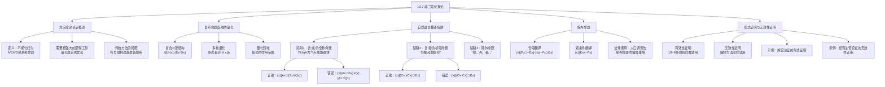

**相关笔记：** [[10.6 无效性证明]] | [[9.8 运用19个推论规则构建形式证明]]

> [!abstract] 概览
> 本节介绍==非三段论推论==（nonsyllogistic inferences），即超越传统直言三段论形式的更复杂论证。核心知识点包括：
> - **非三段论论证的定义**：不能化归为标准形式直言三段论的论证，需要更强大的逻辑工具
> - **复杂命题函项的量化**：量化具有更复杂内部结构的命题函项（如含合取、析取、实质等值的命题函项）
> - **自然语言翻译的陷阱**：三种容易误导的表达方式——含"或"的全称命题、含"和"的析取命题、==除外命题==
> - **除外命题的两种翻译方式**：合取翻译 vs 双条件翻译
> - **形式证明与无效性证明的扩展**：19+4条规则和解释方法同样适用于非三段论论证

---

## 一、知识结构总览

---

## 二、核心思想与证明技巧

> [!tip] 核心思想
> 非三段论推论的核心思想是：==传统直言三段论的A/E/I/O形式具有内在局限性==，许多有效论证无法被正确分析为标准三段论形式。量化理论通过允许量化==具有复杂内部结构==的命题函项，突破了这一局限。关键在于：==不能机械地翻译自然语言，必须先理解语义，再用命题函项和量词进行符号化==。

### 非三段论论证的动机

> [!def] 非三段论论证
> **非三段论论证**（nonsyllogistic argument）是指不能化归为标准形式直言三段论的论证。传统三段论中，每个命题都可以分析为单称命题或A、E、I、O四种直言命题之一。非三段论论证则包含更复杂的命题结构。
>
> **传统方法的局限：** 当我们强迫复杂论证受A和I等形式束缚时，会==遮蔽==命题之间的逻辑联系，导致原本有效的论证在符号化后变成无效的。

### 完整示例：旅馆论证

> [!example] 示例1：旅馆论证——传统符号化的失败
> **论证：**
> - (P1) 旅馆都是既贵又令人压抑的。
> - (P2) 有些旅馆简陋。
> - 因此，有些贵的东西简陋。
>
> **不恰当的符号化（受A/I形式束缚）：**
> 设 $Hx$: $x$是旅馆，$Bx$: $x$既贵又令人压抑，$Sx$: $x$简陋，$Ex$: $x$贵。
> - (P1) $(x)(Hx \supset Bx)$
> - (P2) $(\exists x)(Hx \cdot Sx)$
> - $\therefore (\exists x)(Ex \cdot Sx)$
>
> 这个符号化是==无效的==！因为 $Bx$（既贵又令人压抑）和 $Ex$（贵）之间的逻辑联系被遮蔽了。从 $Hx \supset Bx$ 无法推出 $Hx \supset Ex$。
>
> **恰当的符号化（揭示内部结构）：**
> 设 $Hx$: $x$是旅馆，$Ex$: $x$贵，$Dx$: $x$令人压抑，$Sx$: $x$简陋。
> - 1. $(x)[Hx \supset (Ex \cdot Dx)]$
> - 2. $(\exists x)(Hx \cdot Sx)$
> - $\therefore (\exists x)(Ex \cdot Sx)$
>
> **形式证明：**
> 3. $Ha \cdot Sa$ — 2, EI（假设 $a$ 是某个简陋的旅馆）
> 4. $Ha$ — 3, Simp
> 5. $Sa$ — 3, Simp
> 6. $Ha \supset (Ea \cdot Da)$ — 1, UI
> 7. $Ea \cdot Da$ — 4, 6, M.P.
> 8. $Ea$ — 7, Simp
> 9. $Ea \cdot Sa$ — 5, 8, Conj
> 10. $(\exists x)(Ex \cdot Sx)$ — 9, EG
>
> ==论证有效==。通过揭示 $Bx$ 的内部结构（$Ex \cdot Dx$），我们恢复了被遮蔽的逻辑联系。

### 自然语言翻译的三种陷阱

#### 陷阱1：含"或"的全称命题

> [!warning] 翻译陷阱1
> **命题：** "所有运动员力气大或跑得快。"
>
> ❌ **错误翻译：** $(x)(Ax \supset Sx) \lor (x)(Ax \supset Qx)$
> 这意味着"或者所有运动员力气大，或者所有运动员跑得快"——完全不同的含义。
>
> ✅ **正确翻译：** $(x)[Ax \supset (Sx \lor Qx)]$
> 这意味着"每个运动员都至少具有力气大或跑得快中的一种属性"。
>
> **关键区别：** "或"在命题内部（谓词内部）vs "或"在命题之间。前者是每个个体都满足析取，后者是整个命题的析取。

#### 陷阱2：含"和"的析取命题

> [!warning] 翻译陷阱2
> **命题：** "牡蛎和蚌好吃。"
>
> ❌ **错误翻译：** $(x)[(Ox \cdot Cx) \supset Dx]$
> 这意味着"任何既是牡蛎又是蚌的东西好吃"——但没有任何东西既是牡蛎又是蚌。
>
> ✅ **正确翻译：** $(x)[(Ox \lor Cx) \supset Dx]$
> 这意味着"任何或者是牡蛎或者是蚌的东西好吃"——即牡蛎好吃并且蚌好吃。
>
> **关键区别：** 自然语言中的"和"有时表达的是==逻辑析取==（$\lor$），而非逻辑合取（$\cdot$）。"牡蛎和蚌好吃"的意思是"牡蛎好吃并且蚌好吃"，即"如果是牡蛎或蚌，则好吃"。

#### 陷阱3：除外命题

> [!def] 除外命题（Exceptive Proposition）
> **除外命题**是一种特殊形式的命题，如"除以前的获胜者外，都符合条件"。它有两种等价的翻译方式：
>
> **方式一：合取翻译**
> $$(x)(Px \supset \sim Ex) \cdot (x)(\sim Px \supset Ex)$$
> 即："以前的获胜者不符合条件" 并且 "非以前的获胜者都符合条件"。
>
> **方式二：双条件翻译（更简洁）**
> $$(x)(Ex \equiv \sim Px)$$
> 即："一个人符合条件，当且仅当，这个人不是以前的获胜者。"
>
> 一般来说，除外命题可以最方便地看作==量化了的双条件陈述==。

### 除外命题的法律案例

> [!example] 示例2：人口调查法中的除外命题
> **法规条文：** "除为了在几个州中分配国会代表的席位而确定人口数量以外，[商业]部长在执行这项权利的有关规定时，有权批准使用'抽样'统计方法，如果他认为这是可行的话。"
>
> **争议：** 普查局认为这段话批准在某些情境中使用抽样，但在席位分配情境中"悬而未决"。众议院认为这段话==禁止==在席位分配中使用抽样。
>
> **法庭的类比推理：**
> "考察这样一个指令：'除我祖母的结婚礼服外，把我衣橱里的东西都送到洗衣店去。'......如果该接受者把结婚礼服送到洗衣店去，并且随后争辩说把这留给他做决定，那么她会气恼。"
>
> **法庭裁定：** 众议院的见解正确。除外命题应理解为两个命题的合取：
> 1. 在分配席位的情境中，使用抽样法==不允许==
> 2. 在所有其他情境中，可以==任意==使用抽样法
>
> **启示：** 除外形式的争议性语句必须在其==情境==中来理解。不能简单地将其视为"悬而未决"。

### 非三段论论证的无效性证明

> [!example] 示例3：经理主管论证的无效性证明
> **论证：**
> - (P1) 经理和主管或者是有能力的员工，或者是所有者的亲属。
> - (P2) 敢抱怨的人必定或者是主管，或者是所有者的亲属。
> - (P3) 唯有经理和工头是有能力的员工。
> - (P4) 某人敢抱怨。
> - 因此，某个主管是所有者的亲属。
>
> **符号化：**
> - (P1) $(x)[(Mx \lor Sx) \supset (Cx \lor Rx)]$
> - (P2) $(x)[Dx \supset (Sx \lor Rx)]$
> - (P3) $(x)(Mx \equiv Cx)$
> - (P4) $(\exists x)Dx$
> - $\therefore (\exists x)(Sx \cdot Rx)$
>
> **一元模型（个体 $a$）：**
> - P1: $(Ma \lor Sa) \supset (Ca \lor Ra)$
> - P2: $Da \supset (Sa \lor Ra)$
> - P3: $Ma \equiv Ca$
> - P4: $Da$
> - 结论: $Sa \cdot Ra$
>
> **真值指派：** $Ca = T, Da = T, Ma = T, Ra = T, Sa = F$
>
> **验证：**
> - P1: $(T \lor F) \supset (T \lor T) = T \supset T = T$ ✓
> - P2: $T \supset (F \lor T) = T \supset T = T$ ✓
> - P3: $T \equiv T = T$ ✓
> - P4: $T$ ✓
> - 结论: $F \cdot T = F$ ✓
>
> 前提皆真、结论为假——==论证无效==。

---

## 三、补充理解与易混淆点

### 补充理解

> [!info] 补充1：多重量化与自然语言中的歧义
> **来源：** Russell, B. (1905). *On Denoting*. Mind, 14, 479-493.
>
> 伯特兰-罗素（Bertrand Russell）在1905年的经典论文《论指称》中深入分析了==限定描述语==（definite descriptions）和多重量化结构在自然语言中引起的歧义问题。这一分析与本节的主题密切相关。
>
> **罗素的例子：** "每个人都爱一个人"可以有两种截然不同的理解：
> - $(\forall x)(\exists y) Lxy$ — "对于每个人，都存在某个他爱的人"（每个人爱的可能是不同的人）
> - $(\exists y)(\forall x) Lxy$ — "存在一个人，所有人都爱他"（所有人都爱同一个人）
>
> 这两种理解的真值条件完全不同。第一种几乎总是真的（每个人至少爱一个人），第二种几乎总是假的（不存在所有人都爱的人）。
>
> **与量词顺序的关系：**
> - $\forall x \exists y$ 和 $\exists y \forall x$ 的==量词顺序不可交换==，这是谓词逻辑中最重要的事实之一
> - 在自然语言中，这种歧义被语法结构所掩盖，但在逻辑符号化中必须明确区分
> - 本节中讨论的非三段论论证，当涉及多重量化时，必须特别注意量词的顺序和辖域
>
> 罗素的分析表明：==自然语言的表面语法经常误导我们对逻辑结构的判断==，这正是本节强调"必须先理解语义，再进行符号化"的原因。

> [!info] 补充2：关系逻辑在计算机科学中的应用
> **来源：** Huth, M. & Ryan, M. (2004). *Logic in Computer Science: Modelling and Reasoning about Systems*. Cambridge University Press.
>
> 本节讨论的非三段论推论——特别是包含关系谓词和多重量化的论证——在计算机科学中有广泛而重要的应用：
>
> - **程序验证（Program Verification）：** 程序的正确性证明需要使用多重量化。例如，"对于所有输入 $x$，存在一个输出 $y$，使得程序的计算结果等于 $f(x)$"可以表示为 $\forall x \exists y (y = f(x))$。
>
> - **数据库查询（Database Query）：** SQL查询语言本质上是关系逻辑的应用。例如，"找出所有选修了至少一门课程的学生"涉及 $\exists$ 量化，而"找出选修了所有课程的学生"涉及 $\forall$ 量化。
>
> - **类型系统（Type Systems）：** 编程语言的类型系统使用多重量化来表达类型多态。例如，Haskell中的 $\forall a. [a] \rightarrow [a]$ 表示"对于所有类型 $a$，从 $a$ 的列表到 $a$ 的列表的函数"。
>
> - **安全协议分析（Security Protocol Analysis）：** 分析安全协议时需要表达"对于所有可能的攻击者，存在某种防御策略"——这涉及 $\forall \exists$ 量化模式。
>
> 理解非三段论推论中的量化结构，是掌握这些计算机科学应用的基础。==谓词逻辑不仅是哲学和数学的工具，更是现代计算机科学的理论基石==。

### 易混淆点

> [!warning] 误区：量词顺序可以随意交换
> ❌ **错误理解：** $\forall x \exists y \phi(x, y)$ 和 $\exists y \forall x \phi(x, y)$ 表达相同的含义，量词的顺序无关紧要。
>
> ✅ **正确理解：** ==量词顺序绝对不可交换==。$\forall x \exists y$ 和 $\exists y \forall x$ 表达的含义截然不同，前者比后者==弱得多==。
>
> **辨析：**
>
> | 形式 | 含义 | 直观理解 |
> |:-----|:-----|:---------|
> | $\forall x \exists y \phi(x,y)$ | 对每个 $x$，存在某个 $y$（可能依赖于 $x$）使得 $\phi(x,y)$ 成立 | 每个人都有自己爱的人（爱的对象因人而异） |
> | $\exists y \forall x \phi(x,y)$ | 存在某个 $y$（不依赖于 $x$），使得对所有 $x$，$\phi(x,y)$ 成立 | 存在一个人，所有人都爱他（爱的对象是同一个人） |
>
> **逻辑关系：** $\exists y \forall x \phi(x,y)$ ==蕴含== $\forall x \exists y \phi(x,y)$，但反之不成立。
>
> - 如果存在一个所有人都爱的人，那么当然每个人都有自己爱的人
> - 但每个人都有自己爱的人，并不意味着存在一个所有人都爱的人
>
> **在形式证明中的影响：**
> - 从 $\exists y \forall x \phi(x,y)$ 推出 $\forall x \exists y \phi(x,y)$ 是有效的
> - 从 $\forall x \exists y \phi(x,y)$ 推出 $\exists y \forall x \phi(x,y)$ 是==无效的==
> - 在构造形式证明时，量词的顺序决定了EI和UI的应用顺序，必须严格遵守

> [!warning] 误区：非三段论论证需要新的推论规则
> ❌ **错误理解：** 非三段论论证比三段论论证更复杂，因此需要学习新的推论规则才能处理。
>
> ✅ **正确理解：** ==19条推论规则 + 4条量化规则已经完全足够==处理非三段论论证。非三段论论证之所以"非三段论"，不是因为需要更多的规则，而是因为==命题函项的内部结构更复杂==。
>
> **辨析：**
> - 三段论论证的命题函项形式：$\phi x \supset \psi x$、$\phi x \supset \sim\psi x$、$\phi x \cdot \psi x$、$\phi x \cdot \sim\psi x$
> - 非三段论论证的命题函项形式：可以包含任意的真值函项复合结构，如 $Hx \supset (Ex \cdot Dx)$、$(Mx \lor Sx) \supset (Cx \lor Rx)$ 等
> - 量化规则（UI、UG、EI、EG）的操作对象是==量词==，与命题函项的内部结构无关
> - 19条推论规则操作的是==真值函项连接词==（$\supset, \cdot, \lor, \equiv, \sim$），与是否被量化无关
> - 因此，只要能正确地将自然语言翻译为逻辑符号，就可以使用已有的规则完成证明
>
> **关键在于翻译，而非规则。** 本节的核心难点不是学习新规则，而是学会正确地分析复杂命题的内部逻辑结构。

---

## 四、习题精选

> [!todo] 习题概览
> | 题号 | 核心考点 | 难度 |
> |:-----|:---------|:-----|
> | 1 | 将自然语言命题翻译为逻辑符号（含"和"的析取） | ⭐⭐ |
> | 2 | 构造包含复杂命题函项的形式证明 | ⭐⭐⭐ |

### 题1：自然语言翻译

> [!problem] 题目
> 将下列命题翻译为逻辑符号表达式：
>
> "苹果和橘子好吃并且有营养。"
>
> （缩写提示：$Ax$: $x$是苹果，$Ox$: $x$是橘子，$Dx$: $x$好吃，$Nx$: $x$有营养）

> [!faq]- 解答
> **语义分析：** 这个命题的含义是——如果任一事物是苹果或者是橘子，那么它既好吃又有营养。注意自然语言中的"和"在这里表达的是==逻辑析取==（$\lor$），而非合取。
>
> **符号化：**
> $$(x)[(Ax \lor Ox) \supset (Dx \cdot Nx)]$$
>
> **验证：**
> - 对于一个苹果（$Aa = T, Oa = F$）：$(T \lor F) \supset (Da \cdot Na) = T \supset (Da \cdot Na)$，要求 $Da \cdot Na = T$，即苹果好吃且有营养 ✓
> - 对于一个橘子（$Ab = F, Ob = T$）：$(F \lor T) \supset (Db \cdot Nb) = T \supset (Db \cdot Nb)$，要求 $Db \cdot Nb = T$，即橘子好吃且有营养 ✓
> - 对于既不是苹果也不是橘子的东西（$Ac = F, Oc = F$）：$(F \lor F) \supset (Dc \cdot Nc) = F \supset (Dc \cdot Nc) = T$（空虚为真）✓
>
> **常见错误：**
> - ❌ $(x)[(Ax \cdot Ox) \supset (Dx \cdot Nx)]$ — 这意味着"既是苹果又是橘子的东西好吃且有营养"，但没有任何东西既是苹果又是橘子
> - ❌ $(x)(Ax \supset Dx \cdot Nx) \cdot (x)(Ox \supset Dx \cdot Nx)$ — 虽然逻辑上等价，但不符合"单一非复合普遍命题"的形式
>
> $\blacksquare$

### 题2：构造形式证明

> [!problem] 题目
> 为下列论证构造有效性的形式证明：
>
> - (P1) $(x)[(Ax \lor Bx) \supset (Cx \cdot Dx)]$
> - $\therefore (x)(Bx \supset Cx)$

> [!faq]- 解答
> **证明：**
>
> | 行号 | 陈述 | 理由 |
> |:----:|:-----|:-----|
> | 1 | $(x)[(Ax \lor Bx) \supset (Cx \cdot Dx)]$ | 前提 |
> | | | |
> | 2 | $(Ay \lor By) \supset (Cy \cdot Dy)$ | 1, UI（$y$为任意个体） |
> | 3 | $\sim(Ay \lor By) \lor (Cy \cdot Dy)$ | 2, Impl |
> | 4 | $(\sim Ay \cdot \sim By) \lor (Cy \cdot Dy)$ | 3, De M |
> | 5 | $(\sim Ay \lor Cy) \cdot (\sim Ay \lor Dy) \cdot (\sim By \lor Cy) \cdot (\sim By \lor Dy)$ | 4, Dist（分配律） |
> | 6 | $\sim By \lor Cy$ | 5, Simp |
> | 7 | $By \supset Cy$ | 6, Impl |
> | 8 | $(x)(Bx \supset Cx)$ | 7, UG |
>
> **更简洁的证明（使用条件证明）：**
>
> | 行号 | 陈述 | 理由 |
> |:----:|:-----|:-----|
> | 1 | $(x)[(Ax \lor Bx) \supset (Cx \cdot Dx)]$ | 前提 |
> | | | |
> | 2 | $\mid (Ay \lor By) \supset (Cy \cdot Dy)$ | 1, UI |
> | 3 | $\mid \mid By$ | 假设（CP） |
> | 4 | $\mid \mid Ay \lor By$ | 3, Add |
> | 5 | $\mid \mid Cy \cdot Dy$ | 2, 4, M.P. |
> | 6 | $\mid \mid Cy$ | 5, Simp |
> | 7 | $\mid By \supset Cy$ | 3-6, CP |
> | 8 | $(x)(Bx \supset Cx)$ | 7, UG |
>
> ==论证有效==。
>
> **直观理解：** 如果任何是 $A$ 或 $B$ 的东西都是 $C$ 且 $D$，那么特别地，任何是 $B$ 的东西（不管它是不是 $A$）都是 $C$。因为 $B$ 蕴含 $A \lor B$，而 $A \lor B$ 蕴含 $C \cdot D$，所以 $B$ 蕴含 $C$。
>
> $\blacksquare$

> [!tip] 解题思路提示
> 非三段论论证的解题策略：
> 1. **先理解语义，再符号化**——不要机械地按照语法结构翻译，要理解命题的实际含义
> 2. **注意"和"与"或"的陷阱**——自然语言中的"和"有时表达析取，"或"有时在全称命题内部
> 3. **识别除外命题**——看到"除...外"时，优先考虑双条件翻译 $(x)(Ex \equiv \sim Px)$
> 4. **善用已有的19+4条规则**——不需要新规则，关键是正确翻译后的灵活运用
> 5. **条件证明（CP）是利器**——对于结论为条件陈述的论证，CP通常比直接证明更简洁
> 6. **分配律（Dist）在量化论证中非常有用**——它可以将复杂的析取/合取结构拆解为更简单的部分

---

## 五、视频学习指南

> [!info] 视频资源
> | 资源 | 链接 | 对应内容 | 备注 |
> |:-----|:-----|:---------|:-----|
> | Wireless Philosophy: Predicate Logic | [链接](https://www.youtube.com/playlist?list=PLtDyWVKRDCG2g5iKVE9tSsS2vA7nJwFK) | 谓词逻辑进阶 | 英文，包含量化理论 |
> | Greg Restall: Logical Methods | [链接](https://www.youtube.com/watch?v=V49i_LM8B0E) | 自然演绎与量化规则 | 英文，系统讲解 |
> | Huth & Ryan: Logic in CS | [链接](https://www.youtube.com/playlist?list=PLbMVogVj5nJTdleu07bD-kW6sU1iBvT9S) | 计算机科学中的逻辑 | 英文，关系逻辑应用 |

---

## 六、教材原文

> [!quote] 教材原文
> **来源：** 逻辑学导论 第15版，第10章第7节
>
> **非三段论论证的定义：**
> 前两节讨论的所有论证都具有传统上叫作直言三段论的形式。它们由两个前提和一个结论组成，每个前提和结论都可以分析成一个单称命题或A、E、I、O中的某一种。现在我们转向评价更复杂一些的论证。评价这些论证并不需要比此前已经给出的更多的逻辑工具。这些论证称为非三段论论证，这就是说，它们不能化归为标准形式的直言三段论。因此，评价它们就需要一种比传统上检验直言三段论所使用的更有力的逻辑。
>
> **翻译的原则：**
> 在对经量化更复杂的命题函项而得到的普遍命题进行符号化时，必须小心不要被日常语言的表述方式误导。我们不能依照任何形式的或机械的规则来把自然语言翻译为逻辑符号。在每种情形下，必须理解自然语言语句的意义，然后用命题函项和量词术语加以符号化。
>
> **除外命题的两种翻译：**
> 如"除以前的获胜者外，都符合条件"这样的命题，可以被处理成两个普遍命题的合取......但这个同样的除外命题也可以翻译成一个非复合的普遍命题，这个命题是一个含有实质等值符"≡"的命题函项的全称量化式......一般来说，除外命题可以最方便地看作量化了的双条件陈述。
>
> **法律案例的启示：**
> 一个除外形式的争议性语句必须在其情境中来理解。
>
> **方法论的统一：**
> 正如扩展表足以在非三段论论证中判定有效性一样，证明三段论无效的（在10.6节所解释的）方法，即通过描述非空的可能域或模型，也足以证明当前这种非三段论论证的无效性。

---

## 参见 Wiki

- [[有效性]] -- 论证有效性的定义，非三段论论证同样需要判定有效性
- [[自然演绎]] -- 形式证明使用的推论规则体系，19+4条规则适用于所有论证
- [[推论规则]] -- 19条基本推论规则的完整列表
- [[10.5 有效性证明]] -- 量化规则（UI、UG、EI、EG）的详细说明
- [[10.6 无效性证明]] -- 解释方法，同样适用于非三段论论证
- [[9.8 运用19个推论规则构建形式证明]] -- 19条推论规则的系统介绍
- [[直言三段论]] -- 传统三段论形式，非三段论论证的对比参照
- [[实质蕴涵]] -- 实质蕴涵的定义，在翻译条件陈述时使用

#学习/逻辑学/谓词逻辑
