**相关笔记：** [[9.7 自然演绎系统]] | [[11.1 归纳与演绎再探]]

> [!abstract] 概览
> 第10章是命题逻辑到谓词逻辑的关键跨越，系统引入量化理论，使形式逻辑的分析能力从复合陈述扩展到非复合陈述的内部结构。全章从命题逻辑的局限性出发（[[10.1 对量化的呼唤]]），引入个体常元、谓词和命题函项等基本概念（[[10.2 单称命题]]），定义全称量词 $\forall$ 和存在量词 $\exists$（[[10.3 全称量词与存在量词]]），将传统A/E/I/O命题精确符号化（[[10.4 传统主谓命题]]），引入四条量化推论规则UI/UG/EI/EG构造有效性证明（[[10.5 有效性证明]]），介绍解释方法证明无效性（[[10.6 无效性证明]]），最后讨论超越三段论形式的非三段论推论（[[10.7 非三段论推论]]）。

---

## 一、全章知识框架

```mermaid
graph TB
    CH["第10章 谓词逻辑：量化理论"]

    CH --> A["基础概念<br/>10.1-10.2"]
    CH --> B["量化理论核心<br/>10.3-10.4"]
    CH --> C["证明方法<br/>10.5-10.6"]
    CH --> D["扩展应用<br/>10.7"]

    A --> A1["10.1 对量化的呼唤"]
    A --> A2["10.2 单称命题"]

    A1 --> A1a["命题逻辑的局限<br/>苏格拉底论证"]
    A1 --> A1b["弗雷格的贡献<br/>1879年《概念文字》"]
    A1 --> A1c["量化理论的功能<br/>揭示非复合命题内部结构"]

    A2 --> A2a["个体常元 a-w"]
    A2 --> A2b["谓述符号 F,G,H..."]
    A2 --> A2c["命题函项 Fx"]
    A2 --> A2d["属性谓词 vs 关系谓词"]

    B --> B1["10.3 全称量词与存在量词"]
    B --> B2["10.4 传统主谓命题"]

    B1 --> B1a["全称量词 (x)<br/>∀x(Sx⊃Px)"]
    B1 --> B1b["存在量词 (∃x)<br/>∃x(Sx·Px)"]
    B1 --> B1c["自由变元 vs 约束变元"]
    B1 --> B1d["量化否定等价式<br/>∼∀≡∃∼"]
    B1 --> B1e["量化对当方阵"]

    B2 --> B2a["A/E/I/O 符号化"]
    B2 --> B2b["存在含义问题<br/>布尔解释"]
    B2 --> B2c["范型公式"]

    C --> C1["10.5 有效性证明"]
    C --> C2["10.6 无效性证明"]

    C1 --> C1a["UI: 全称实例化"]
    C1 --> C1b["UG: 全称泛化"]
    C1 --> C1c["EI: 存在实例化"]
    C1 --> C1d["EG: 存在泛化"]
    C1 --> C1e["先EI后UI策略"]

    C2 --> C2a["解释方法<br/>构造反模型"]
    C2 --> C2b["一元/二元/三元模型"]
    C2 --> C2c["逻辑类比"]

    D --> D1["10.7 非三段论推论"]
    D1 --> D1a["复杂命题函项的量化"]
    D1 --> D1b["翻译陷阱<br/>含'或'的全称/含'和'的析取"]
    D1 --> D1c["除外命题<br/>合取翻译 vs 双条件翻译"]
```



---

## 二、核心知识点汇总

### 2.1 四条量化推论规则完整表

> [!tip] 规则分类记忆
> ==UI和UG==处理全称量化（"拆开"和"组装"全称量化式），==EI和EG==处理存在量化（"拆开"和"组装"存在量化式）。四条规则与命题逻辑的19条规则配合使用，构成完整的谓词逻辑自然演绎系统。

| 规则 | 缩写 | 形式 | 功能 | 关键限制 |
|:-----|:-----|:-----|:-----|:---------|
| 全称实例化 | UI | $(x)\phi x \;\therefore\; \phi\nu$ | 从全称量化式推出任一代入例 | 无特殊限制 |
| 全称泛化 | UG | $\phi y \;\therefore\; (x)\phi x$ | 从任意选取个体的代入例推出全称量化式 | $y$ 须是任意选取的个体（不能出现在假设中） |
| 存在实例化 | EI | $(\exists x)\phi x \;\therefore\; \phi\nu$ | 从存在量化式推出新常元的代入例 | $\nu$ 须为语境中==未出现过的==个体常元 |
| 存在泛化 | EG | $\phi\nu \;\therefore\; (\exists x)\phi x$ | 从任一代入例推出存在量化式 | 无特殊限制 |

> [!warning] 核心策略：先EI后UI
> 在任何要同时使用EI和UI的证明中，应==总是先使用EI==，这样可以对两者使用同一个新常元，避免常元冲突导致无效"证明"。

### 2.2 A/E/I/O命题的谓词逻辑符号化

| 命题类型 | 标准形式 | 符号化 | 联结词 | 量词 |
|:---------|:---------|:-------|:-------|:-----|
| A（全称肯定） | 所有S是P | $\forall x(Sx \supset Px)$ | 蕴涵 $\supset$ | 全称 $\forall$ |
| E（全称否定） | 所有S不是P | $\forall x(Sx \supset \sim Px)$ | 蕴涵 + 否定 | 全称 $\forall$ |
| I（特称肯定） | 有些S是P | $\exists x(Sx \cdot Px)$ | 合取 $\cdot$ | 存在 $\exists$ |
| O（特称否定） | 有些S不是P | $\exists x(Sx \cdot \sim Px)$ | 合取 + 否定 | 存在 $\exists$ |

> [!tip] 记忆口诀
> ==全称用蕴涵（$\forall \to \supset$），存在用合取（$\exists \to \cdot$）==。A命题用 $\supset$ 而非 $\cdot$，因为"所有S是P"只要求"凡是S的东西都是P"，不要求宇宙中每个东西都是S。I命题用 $\cdot$ 而非 $\supset$，因为"有些S是P"断言存在同时具有S和P属性的事物。

### 2.3 量词否定等价式

$$\sim(x)\varphi x \equiv (\exists x)\sim\varphi x$$

$$\sim(\exists x)\varphi x \equiv (x)\sim\varphi x$$

$$(x)\varphi x \equiv \sim(\exists x)\sim\varphi x$$

$$(\exists x)\varphi x \equiv \sim(x)\sim\varphi x$$

> [!tip] 记忆技巧
> 否定穿过量词时，量词要"翻转"：$\sim\forall \to \exists\sim$，$\sim\exists \to \forall\sim$。连续两次翻转回到原点：$\sim\forall\sim \to \exists$，$\sim\exists\sim \to \forall$。直觉理解：说"不是所有人都及格了"（$\sim\forall$），就等于说"有人没及格"（$\exists\sim$）。

### 2.4 量化证明策略

| 结论类型 | 最后一步 | 实例化策略 | 典型模板 |
|:---------|:---------|:-----------|:---------|
| 全称 $(x)\phi x$ | UG | UI（使用任意个体 $y$） | UI $\to$ 命题逻辑推理 $\to$ UG |
| 存在 $(\exists x)\phi x$ | EG | 先EI后UI（使用新常元 $a$） | EI $\to$ UI $\to$ 命题逻辑推理 $\to$ EG |

### 2.5 无效性证明：解释方法

| 步骤 | 操作 |
|:----:|:-----|
| 1 | 构造一元模型（个体 $a$），将量化命题转化为代入例 |
| 2 | 真值指派，尝试使前提全T、结论F |
| 3 | 若成功 $\to$ 论证==无效==；若失败 $\to$ 扩大为二元模型 |
| 4 | 二元模型中全称用 $\cdot$ 结合、存在用 $\lor$ 结合 |
| 5 | 本书习题不需要超过三元模型 |

> [!warning] 重要区分
> 无效性证明（解释方法）==不使用==四条量化规则（UI/UG/EI/EG），它基于量词的语义定义而非推论规则。

### 2.6 非三段论推论的翻译陷阱

| 陷阱 | 自然语言示例 | 错误翻译 | 正确翻译 |
|:-----|:-------------|:---------|:---------|
| 含"或"的全称 | 所有A力气大或跑得快 | $(x)(Ax \supset Sx) \lor (x)(Ax \supset Qx)$ | $(x)[Ax \supset (Sx \lor Qx)]$ |
| 含"和"的析取 | 牡蛎和蚌好吃 | $(x)[(Ox \cdot Cx) \supset Dx]$ | $(x)[(Ox \lor Cx) \supset Dx]$ |
| 除外命题 | 除以前的获胜者外，都符合条件 | 单一条件陈述 | $(x)(Ex \equiv \sim Px)$ |

---

## 三、学习脉络

全章的学习遵循一条清晰的递进路径：

```
命题逻辑的局限（苏格拉底论证在命题逻辑中显得无效）
    ↓
单称命题与符号化（个体常元、谓述符号、命题函项）
    ↓
全称量词与存在量词（∀x、∃x、自由变元vs约束变元）
    ↓
量化否定等价式（∼∀≡∃∼、∼∃≡∀∼）
    ↓
A/E/I/O命题的量化符号化（全称用蕴涵、存在用合取）
    ↓
存在含义问题（布尔解释：A/E无存在含义）
    ↓
四条量化规则（UI/UG/EI/EG）+ 有效性证明
    ↓
解释方法 + 无效性证明（构造反模型）
    ↓
非三段论推论（复杂命题函项、翻译陷阱、除外命题）
```

> [!tip] 学习建议
> - **10.1-10.2** 是"动机层"：理解为什么需要谓词逻辑，掌握基本符号化约定
> - **10.3-10.4** 是"核心层"：==务必牢记"全称用蕴涵、存在用合取"==，掌握四个量化否定等价式
> - **10.5-10.6** 是"方法层"：四条量化规则是重点，==务必理解EI的限制（新常元）和先EI后UI的策略==
> - **10.7** 是"应用层"：不需要新规则，关键是正确翻译复杂命题的内部结构

---

## 四、跨章关联

### 4.1 第10章与第9章的关系

| 维度 | 第9章（命题逻辑II） | 第10章（谓词逻辑） |
|:-----|:-------------------|:-------------------|
| 核心方法 | 19条推论规则（自然演绎） | 19条规则 + 4条量化规则 |
| 分析对象 | 复合陈述的真值函项结构 | 非复合陈述的内部逻辑结构 |
| 推理工具 | 形式证明、STTT、CP、IP | 量化证明、解释方法 |
| 表达能力 | 无法处理"所有""有些" | 可以处理量化表达 |

> [!info] 扩展关系
> 谓词逻辑是命题逻辑的==扩展==而非替代。命题逻辑的19条推论规则在谓词逻辑中==完全保留==，没有任何修改。四条量化规则的核心功能是在非复合陈述（量化命题）和复合陈述（代入例）之间建立桥梁，使命题逻辑的规则可以在量化命题的内部结构上发挥作用。

### 4.2 具体关联映射

| 第10章概念 | 关联章节 | 关联说明 |
|:----------|:---------|:---------|
| 命题逻辑的局限 | [[8.6 "无效"和"有效"的精确含义]] | 命题逻辑的有效性定义基于真值函项关系 |
| 19条推论规则 | [[9.2 基本的有效论证形式]]、[[9.6 扩展推论规则：替换规则]] | 在谓词逻辑中完全保留 |
| 条件证明CP | [[9.11 条件证明]] | CP在量化证明中同样适用，可与UG/EI配合 |
| 间接证明IP | [[9.12 间接证明]] | IP在量化证明中同样适用 |
| A/E/I/O命题 | [[5.3 四种直言命题]] | 传统直言命题的谓词逻辑精确化 |
| 存在含义 | [[5.7 存在含义与直言命题的解释]] | 布尔解释在谓词逻辑中的体现 |
| 对当方阵 | [[5.5 传统对当方阵]] | 量化对当方阵与传统对当方阵的对比 |
| 三段论 | [[6.1 直言三段论的标准形式]] | 三段论是谓词逻辑的特例 |
| 文恩图 | [[5.8 直言命题的符号系统与图解]] | 文恩图与量化符号化的互补关系 |

---

## 五、复习题

### 题1：综合量化证明

> [!problem] 题目
> 为以下论证构造一个有效形式证明：
>
> "所有法官都是律师。有些法官是民选的。因此，有些律师是民选的。"
>
> ($Jx$: $x$ 是法官；$Lx$: $x$ 是律师；$Ex$: $x$ 是民选的)

> [!faq]- 解答
> **符号化：**
> - 前提1：$(x)(Jx \supset Lx)$
> - 前提2：$(\exists x)(Jx \cdot Ex)$
> - 结论：$(\exists x)(Lx \cdot Ex)$
>
> **形式证明：**
>
> | 行号 | 陈述 | 理由 |
> |:----:|:-----|:-----|
> | 1 | $(x)(Jx \supset Lx)$ | 前提 |
> | 2 | $(\exists x)(Jx \cdot Ex)$ | 前提 |
> | $\therefore$ | $(\exists x)(Lx \cdot Ex)$ |  |
> | 3 | $Ja \cdot Ea$ | 2, E.I. |
> | 4 | $Ja \supset La$ | 1, U.I. |
> | 5 | $Ja$ | 3, Simp. |
> | 6 | $La$ | 4, 5, M.P. |
> | 7 | $Ea$ | 3, Simp. |
> | 8 | $La \cdot Ea$ | 6, 7, Conj. |
> | 9 | $(\exists x)(Lx \cdot Ex)$ | 8, E.G. |
>
> **分析：**
> - 第3行：先对存在前提使用EI，引入新常元 $a$（==先EI后UI==）
> - 第4行：对全称前提使用UI，实例化为同一个 $a$
> - 第5-7行：用简化律取出合取支
> - 第6行：用肯定前件式从 $Ja \supset La$ 和 $Ja$ 推出 $La$
> - 第8-9行：合取后用EG推广为存在量化式
>
> $\blacksquare$

### 题2：用解释方法证明无效性

> [!problem] 题目
> 用解释方法证明以下论证无效：
>
> - (P1) $(x)(Ax \supset Bx)$
> - (P2) $(\exists x)(Cx \cdot Bx)$
> - $\therefore (\exists x)(Ax \cdot Cx)$

> [!faq]- 解答
> **第1步：** 构造一元模型（个体 $a$），写出逻辑等价的真值函项论证：
> - (P1) $Aa \supset Ba$
> - (P2) $Ca \cdot Ba$
> - $\therefore Aa \cdot Ca$
>
> **第2步：** 进行真值指派，使前提为真、结论为假：
>
> | $Aa$ | $Ba$ | $Ca$ | $Aa \supset Ba$ | , | $Ca \cdot Ba$ | $\therefore$ | $Aa \cdot Ca$ |
> |:---:|:---:|:---:|:---:|:---:|:---:|:---:|:---:|
> | $F$ | $T$ | $T$ | $T$ | | $T$ | | $F$ |
>
> **验证：**
> - P1: $F \supset T = T$ ✓
> - P2: $T \cdot T = T$ ✓
> - 结论: $F \cdot T = F$ ✓
>
> 前提皆真、结论为假——==论证无效==。
>
> **直观理解：** 个体 $a$ 不是 $A$ 但是 $B$，且 $a$ 是 $C$。P1为真（不是 $A$ 的东西自动满足 $A \supset B$），P2为真（$a$ 既是 $C$ 又是 $B$），但结论为假（$a$ 不是 $A$，所以 $A \cdot C$ 为假）。
>
> $\blacksquare$

> [!tip] 解题思路提示
> 1. 量化证明的关键是==先识别结论类型==（全称 $\to$ UG收尾，存在 $\to$ EG收尾），再倒推中间步骤
> 2. 解释方法==从一元模型开始==，全称量化用合取结合、存在量化用析取结合
> 3. 解释方法==不使用==量化规则（UI/UG/EI/EG），它基于量词的语义定义

---

## 六、笔记索引

| 节号 | 笔记标题 | 核心主题 | 关键概念 |
|:----:|:---------|:---------|:---------|
| 10.1 | [[10.1 对量化的呼唤]] | 从命题逻辑到谓词逻辑的跨越动机 | 命题逻辑的局限；弗雷格；个体变元；谓词；量化理论的功能 |
| 10.2 | [[10.2 单称命题]] | 谓词逻辑的基本构件 | 个体常元；谓述符号；命题函项；简单谓述；属性谓词vs关系谓词 |
| 10.3 | [[10.3 全称量词与存在量词]] | 两大核心量词 | 全称量词 $(x)$；存在量词 $(\exists x)$；自由变元vs约束变元；量化否定等价式；量化对当方阵 |
| 10.4 | [[10.4 传统主谓命题]] | A/E/I/O的量化符号化 | 全称用蕴涵 $\supset$；存在用合取 $\cdot$；存在含义问题；布尔解释；范型公式 |
| 10.5 | [[10.5 有效性证明]] | 四条量化推论规则 | UI/UG/EI/EG；先EI后UI策略；量化证明构造 |
| 10.6 | [[10.6 无效性证明]] | 解释方法 | 反模型构造；一元/二元/三元模型；逻辑类比；量化规则与语义方法的区别 |
| 10.7 | [[10.7 非三段论推论]] | 超越三段论的复杂论证 | 复杂命题函项量化；翻译陷阱（含"或"的全称/含"和"的析取/除外命题）；旅馆论证 |

---

## 参见 Wiki

- [[有效性]]、[[自然演绎]]、[[推论规则]]、[[直言命题]]、[[A_E_I_O 四种命题]]

#学习/逻辑学/第10章/章节汇总
