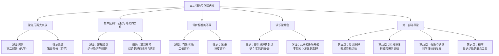

**相关笔记：** [[11.2 类比论证]] | [[12.1 原因与结果|12.1 因果联系与密尔方法]] | [[1.1 什么是逻辑学|1.5 逻辑学基本概念]]

> [!abstract] 概览
> 本节是全书第三部分"归纳逻辑"的导论，系统回顾了==归纳推理==与==演绎推理==的根本区别，为后续类比推理、因果推理和概率理论的学习奠定基础。核心知识点包括：
> - **归纳与演绎的根本区别**：演绎论证断言结论从前提中==确定地==得出，归纳论证的前提对结论的支持是==或然的==
> - **"有效/无效"不适用于归纳论证**：归纳论证只能用"强/弱"来刻画，不能用演绎的"有效/无效"来评价
> - **演绎的确定性 vs 归纳的或然性**：有效演绎论证中前提真则结论==必定==为真；归纳论证中前提真只使结论==可能==为真
> - **归纳推理的认识论基础**：归纳为推理提供==起点或基础==，演绎只能从已知命题推导新命题，不能发现关于世界的"实际的事情"
> - **本书第三部分的总体框架**：第11章类比推理、第12章因果推理、第13章假说与确证、第14章概率

---

## 一、知识结构总览

---

## 二、核心思想

> [!tip] 核心思想
> 归纳推理和演绎推理是论证的两大基本类型，它们的根本区别在于==前提与结论之间的关系==。演绎论证断言结论从前提中==逻辑必然地==得出——如果论证有效且前提为真，则结论==必定==为真。归纳论证则不做出确定性断言，其前提对结论的支持是==或然的==（probable）——前提为真只使结论==可能==为真，而非必定为真。因此，"有效"与"无效"这两个术语==根本不适用==于归纳论证，归纳论证只能用"强"与"弱"来刻画。

### 归纳推理的认识论基础

> [!def] 归纳推理的认识论地位
> ==归纳推理==为与我们息息相关的推理提供==起点或基础==。我们通过推理来确立日常生活中的真理、了解有关社会的事实以及理解自然界。演绎在使得我们从已知的（或假定的）命题前进到由那些前提导出的其他命题方面是有力的，但在==找寻推理必须由以开始的真理==方面，演绎是不充分的。
>
> 用大卫·休谟的术语来说，演绎推理处理的是观念之间的关系（relations of ideas），而归纳推理处理的是"实际的事情"（matters of fact）。关于实际的事情的知识，我们==必须依靠归纳==来确立。

### 演绎的确定性

> [!def] 演绎论证的确定性特征
> 一个==演绎论证==（deductive argument）断言结论从前提中==确定地==得出。这一断言是恰当的，因为任何演绎论证，如果它是好的，其结论只是揭示前提已经==隐含==的东西。有效演绎中前提与结论之间的关系是一种==逻辑必然==（logical necessity）。
>
> **形式化表达：** 如果论证是有效的（valid），并且前提 $P_1, P_2, \ldots, P_n$ 都是真的，那么结论 $C$ ==必定==是真的：
> $$P_1, P_2, \ldots, P_n \models C$$
>
> 这意味着：在所有使前提为真的逻辑可能世界中，结论也为真。

### 归纳的或然性

> [!def] 归纳论证的或然性特征
> 在==归纳论证==（inductive argument）中，前提与结论之间的关系==不是逻辑必然==，也没有确定性断言。==有效与无效这两个术语根本不适用==。归纳论证中，前提为真只使结论==或然为真==（probable）。
>
> **形式化表达：** 如果前提 $P_1, P_2, \ldots, P_n$ 都是真的，那么结论 $C$ ==可能==为真，但不必然为真：
> $$P_1, P_2, \ldots, P_n \Rightarrow C \quad \text{(概率 } p < 1 \text{)}$$
>
> 这意味着：在使前提为真的逻辑可能世界中，==只有一部分==（比例为 $p$）世界使结论也为真。

> [!example] 示例：演绎确定性 vs 归纳或然性
> **演绎论证（确定性）：**
> - 前提1：$p \lor q$（或者 $p$ 或者 $q$ 为真）
> - 前提2：$\sim p$（$p$ 为假）
> - 结论：$q$（$q$ 为真）
> - 分析：如果前提为真，结论==必定==为真。这是排中律和析取三段论的必然推论，具有==逻辑确定性==。
>
> **归纳论证（或然性）：**
> - 前提：大量医学研究表明，吸烟与肺癌发病率之间存在显著的统计学关联
> - 结论：吸烟是导致癌症的一个原因
> - 分析：前提为真使结论==极可能==为真，但并非==逻辑必然==。正如教材所指出的，一位医学专家甚至声称："没有人能够证明吸烟导致癌症，或者说任何事情导致任何事情。"——这里"证明"一词被严格理解为演绎证明。这一归纳结论虽然非常有力，但==不满足演绎确定性的标准==。

### 两个论证家族的对比

| 特征 | 演绎论证 | 归纳论证 |
|:-----|:---------|:---------|
| **前提与结论的关系** | 逻辑必然（conclusive） | 或然支持（probable） |
| **结论是否隐含在前提中** | 是——结论只揭示前提已隐含的东西 | 否——结论超越前提所含信息 |
| **评价术语** | 有效（valid）/ 无效（invalid） | 强（strong）/ 弱（weak） |
| **前提真+论证好 → 结论** | ==必定==为真 | ==可能==为真 |
| **认识论角色** | 从已知推导未知 | 为推理提供起点和基础 |
| **适用领域** | 数学、逻辑等形式推理 | 科学研究、日常推理、经验知识 |
| **典型例子** | 三段论、命题逻辑推论 | 统计概括、因果推理、类比论证 |

---

## 三、补充理解与易混淆点

### 补充理解

> [!info] 补充1：归纳逻辑的概率支持理论
> **来源：** Stanford Encyclopedia of Philosophy. (2024). *Inductive Logic*. https://plato.stanford.edu/archives/fall2024/entries/logic-inductive/
>
> 斯坦福哲学百科全书的"归纳逻辑"条目深入阐述了归纳推理的概率特征。在现代归纳逻辑中，前提对结论的支持程度可以用==条件概率==来精确刻画：
>
> $$P(C \mid P_1 \cdot P_2 \cdot \ldots \cdot P_n) = r$$
>
> 其中 $r$ 表示前提为真时结论为真的概率（$0 < r \leq 1$）。
>
> - 当 $r = 1$ 时，前提对结论提供==完全支持==——这实际上就是演绎有效的情形
> - 当 $0 < r < 1$ 时，前提对结论提供==部分支持==——这是典型的归纳推理
> - 归纳逻辑的核心问题是：如何==合理地确定== $r$ 的值？
>
> 这一概率框架揭示了演绎与归纳之间的==连续性关系==：演绎可以被视为归纳的==极限情形==（当支持度达到100%时），而非完全不同的推理类型。然而，Copi在本节中强调的是两者的==根本区别==——在实践层面，演绎论证和归纳论证的==评价标准和使用场景==截然不同。
>
> 该条目还介绍了==贝叶斯确证理论==（Bayesian Confirmation Theory），这是当代归纳逻辑的主流方法，通过贝叶斯定理将先验概率与证据似然性结合，计算后验概率，从而量化归纳推理的强度。

> [!info] 补充2：演绎与归纳的心理标准 vs 逻辑标准
> **来源：** Internet Encyclopedia of Philosophy. *Deductive and Inductive Arguments*. https://iep.utm.edu/deductive-inductive-arguments/
>
> 关于如何区分演绎论证和归纳论证，哲学界存在两种主要标准：
>
> **（1）心理标准（意图标准）：**
> - 如果论证者==意图==使结论从前提中必然地得出，则该论证是演绎的
> - 如果论证者==意图==使前提仅为结论提供或然性支持，则该论证是归纳的
> - 问题：论证者的意图往往是==不明确的==，难以判断
>
> **（2）逻辑标准（形式标准）：**
> - 如果论证具有==有效==的逻辑形式，则它是演绎的
> - 如果论证的逻辑形式==不保证==结论从前提中必然得出，则它是归纳的
> - 问题：某些论证的逻辑形式可能==模棱两可==
>
> **Copi的立场：** Copi在本节中采用的是一种==混合标准==——既关注论证的逻辑形式（前提与结论之间的实际关系），也关注论证者所做的==断言类型==（确定性断言 vs 或然性断言）。他特别强调：演绎论证==断言==结论确定地得出，而归纳论证==不做出==确定性断言。这种区分在分析日常论证时尤其重要。

### 易混淆点

> [!warning] 误区：归纳论证就是"不严格的演绎论证"
> ❌ **错误理解：** 归纳论证只是演绎论证的"弱化版本"或"不严格形式"，如果给归纳论证添加更多前提，它最终可以变成演绎论证。归纳论证之所以"不确定"，只是因为我们掌握的信息不够充分。
>
> ✅ **正确理解：** 归纳论证和演绎论证是==两个根本不同的论证家族==，它们在前提与结论的关系上有本质区别：
>
> **辨析：**
> - ==演绎论证==的结论==隐含在前提中==——结论只是揭示前提已经包含的信息。如果前提为真且论证有效，结论==不可能==为假。演绎推理是==分析性的==（analytic）。
> - ==归纳论证==的结论==超越前提所含信息==——结论断定了前提中尚未包含的新内容。即使前提全部为真，结论==仍然可能==为假。归纳推理是==扩展性的==（ampliative）。
> - 添加更多前提==不能==将一个真正的归纳论证变成演绎论证，因为归纳论证的本质特征就是结论==超越了前提的蕴涵范围==
> - 这不是"信息不充分"的问题，而是==推理方向==的根本差异：演绎是从一般到特殊（或从前提集到其逻辑后承），归纳是从已观察到未观察、从特殊到一般、从已知到未知

> [!warning] 误区："有效/无效"可以用来评价归纳论证
> ❌ **错误理解：** 一个归纳论证如果前提为真而结论为假，那么它就是"无效的"（invalid）。反之，如果前提为真且结论也为真，它就是"有效的"。
>
> ✅ **正确理解：** "有效"（valid）和"无效"（invalid）这两个术语==只适用于演绎论证==，==根本不适用于归纳论证==。归纳论证使用"强"（strong）和"弱"（weak）来评价。
>
> **辨析：**
>
> | 评价维度 | 演绎论证 | 归纳论证 |
> |:---------|:---------|:---------|
> | **核心评价术语** | 有效 / 无效 | 强 / 弱 |
> | **"好"的论证** | 有效 + 前提真实 = ==可靠==（sound） | 强 + 前提真实 = ==有说服力==（cogent） |
> | **前提真结论假** | → 论证==无效==（不可能发生） | → 论证==弱==（可能发生） |
> | **前提真结论真** | → 可能有效也可能无效 | → 可能强也可能弱 |
> | **评价标准** | 结论是否从前提中==必然==得出 | 前提是否为结论提供==高概率==支持 |
>
> - 说一个归纳论证"无效"是==范畴错误==——就像说一首诗"不合法"一样，用错了评价框架
> - 即使是最强的归纳论证，其结论==仍然可能为假==——这正是归纳推理的本质特征
> - Copi强调：归纳论证"有时候确实是非常强的，并且完全值得我们对之抱以信心"，但强归纳论证的结论仍然不具有演绎论证那样的==确定性==

---

## 四、习题精选

> [!todo] 习题概览
> | 题号 | 核心考点 | 难度 |
> |:-----|:---------|:-----|
> | 1 | 区分演绎论证与归纳论证 | ⭐⭐ |
> | 2 | 判断归纳论证的强度 | ⭐⭐⭐ |

### 题1：区分演绎论证与归纳论证

> [!problem] 题目
> 判断以下论证是演绎论证还是归纳论证，并说明理由：
>
> (a) 所有哺乳动物都有脊椎。鲸是哺乳动物。因此，鲸有脊椎。
>
> (b) 我过去三次在这家餐厅用餐都食物中毒了。因此，我下次在这里用餐很可能也会食物中毒。
>
> (c) 如果下雨，地面就会湿。地面没有湿。因此，没有下雨。

> [!faq]- 解答
> **(a) 演绎论证。**
> - 理由：这是一个经典的全称三段论（Barbara式）。结论"鲸有脊椎"已经==隐含在前提中==——如果所有哺乳动物都有脊椎，而鲸是哺乳动物，那么鲸必然有脊椎。前提与结论之间的关系是==逻辑必然==的。
> - 形式化：$\forall x(Mx \supset Vx), Mw \therefore Vw$——有效。
>
> **(b) 归纳论证。**
> - 理由：结论"下次也会食物中毒"==超越了前提所含信息==。过去三次的经验并不能==保证==下一次的结果。前提为真只使结论==可能==为真（虽然概率可能很高）。论证者没有断言结论必然为真，而是断言其==很可能==为真。
> - 即使这家餐厅已经改进了卫生条件，前提仍然为真，但结论可能为假。
>
> **(c) 演绎论证。**
> - 理由：这是命题逻辑中的==否定后件式==（Modus Tollens）。如果 $R \supset W$ 为真且 $\sim W$ 为真，则 $\sim R$ ==必定==为真。结论从前提中==逻辑必然地==得出。
> - 形式化：$R \supset W, \sim W \therefore \sim R$——有效。
>
> $\blacksquare$

### 题2：判断归纳论证的强度

> [!problem] 题目
> 以下归纳论证中，哪个更强？请说明理由。
>
> 论证A：我在这家店买过一件衣服，质量很好。因此，我在这家店买的下一件衣服质量也会很好。
>
> 论证B：我在这家店买过十件衣服，质量都很好，而且这些衣服涵盖了不同的品牌、款式和价格区间。因此，我在这家店买的下一件衣服质量也会很好。

> [!faq]- 解答
> **论证B更强。** 理由如下：
>
> 归纳论证的强度取决于前提对结论的==支持程度==，而支持程度受多种因素影响：
>
> 1. **样本量**：论证A只有1个样本，论证B有10个样本。较大的样本量提供更强的归纳支持。
> 2. **多样性**：论证B中的10件衣服"涵盖了不同的品牌、款式和价格区间"，这意味着结论不依赖于某个特定类别的特殊性，而是基于更广泛的证据基础。==样本的多样性==增强了归纳论证的强度。
> 3. **结论的审慎性**：两个论证的结论相同（"下一件衣服质量也会很好"），但论证B的前提基础更坚实。
>
> 然而，需要注意的是，即使论证B比论证A强得多，它仍然是一个==归纳论证==——结论并非逻辑必然地得出。这家店可能更换了供货商，或者下一件衣服恰好是瑕疵品。归纳论证==永远保留着结论为假的可能性==。
>
> $\blacksquare$

> [!tip] 解题思路提示
> 区分演绎与归纳的关键方法：
> 1. **"隐含测试"**：问自己——结论是否已经隐含在前提中？如果是，很可能是演绎论证
> 2. **"反例测试"**：问自己——能否想象一个情境使前提全部为真而结论为假？如果==不可能==，则是演绎论证；如果==可以==，则是归纳论证
> 3. **"断言测试"**：注意论证者使用的断言类型——"必定"、"必然"、"因此"倾向于演绎；"可能"、"很可能"、"大概"倾向于归纳
> 4. **"信息超越测试"**：结论是否断定了前提中未包含的新信息？如果是，则是归纳论证

---

## 五、视频学习指南

> [!info] 视频资源
> | 资源 | 链接 | 对应内容 | 备注 |
> |:-----|:-----|:---------|:-----|
> | Wireless Philosophy: Inductive Reasoning | [链接](https://www.youtube.com/watch?v=GE8DK2InxOE) | 归纳推理基础概念 | 英文，5分钟入门 |
> | Wireless Philosophy: Deductive Reasoning | [链接](https://www.youtube.com/watch?v=GE8DK2InxOE) | 演绎推理基础概念 | 英文，与归纳推理对比 |
> | Kevin deLaplante: Critical Thinking | [链接](https://www.youtube.com/playlist?list=PL0C5C7F1E2A7A0E7D) | 批判性思维课程 | 英文，含归纳演绎区分 |

---

## 六、教材原文

> [!quote] 教材原文
> **来源：** 逻辑学导论 第15版，第11章第1节
>
> **归纳与演绎的根本区别：**
> 由以确立实际的事情的归纳论证与本书第二部分所关注的演绎论证有着根本性的不同。论证的这两个家族的一个本质性差别在于这两个巨大家族当中前提与结论之间的关系。一个演绎论证，断言结论从它们的前提中确定地得出。这一断言是恰当的，因为任何演绎论证，如果它是好的，其结论只是揭示前提已经隐含的东西。有效演绎中前提与结论之间的关系是一种逻辑必然。在每一个演绎论证当中，如果它是有效的并且它的前提是真的，那么它的结论必定是真的。
>
> **归纳论证的特征：**
> 在本章及后面几章所关注的归纳论证当中，前提与结论之间的关系不是那种逻辑必然，也没有那种确定性断言。有效与无效这两个术语根本不适用。但这并不意味着归纳论证总是弱的，有时候它们确实是非常强的，并且完全值得我们对之抱以信心。
>
> **归纳的认识论基础：**
> 因此，归纳为与我们息息相关的推理提供起点或者基础。我们通过推理来确立日常生活中的真理，了解有关社会的事实，以及理解自然界。演绎在使得我们从已知的（或者假定的）命题前进到由那些前提导出的其他命题方面当然是有力的，但是在找寻我们的推理必须由以开始的真理方面，演绎是不充分的。
>
> **第三部分总体框架：**
> 本章首先考察旨在形成特称结论的基于类比的论证，下一章考察旨在形成超越特称的普遍可适用因果律的论证。第13章考察假说及其确证在发展科学理论中的运用，第14章分析归纳结论通常得以表达的概念工具——概率。

---

## 参见 Wiki

- [[演绎论证|演绎推理]] -- 演绎论证的基本概念和有效性的定义
- [[归纳论证|归纳推理]] -- 归纳论证的基本概念和强度的评价
- [[有效性-vs-可靠性|有效性与可靠性]] -- 演绎论证的两个核心评价维度
- [[11.2 类比论证]] -- 最常见的归纳论证类型
- [[1.1 什么是逻辑学|1.5 逻辑学基本概念]] -- 全书开篇对归纳与演绎的初步介绍
- [[归纳逻辑|概率]] -- 归纳结论的概念工具（第14章）
- [[休谟问题]] -- 休谟对归纳推理合理性的哲学挑战

#学习/逻辑学/类比推理
