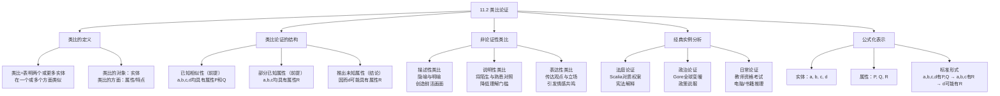

**相关笔记：** [[11.1 归纳与演绎再探]] | [[12.1 原因与结果|12.1 因果联系与密尔方法]] | [[10.6 无效性证明]]

> [!abstract] 概览
> 本节系统介绍了==类比论证==（analogical argument）——最常见的归纳论证类型。核心知识点包括：
> - **类比的定义**：在两个或更多实体之间表明它们在一个或多个方面类似
> - **类比论证的基本结构**：从已知实体间的相似性推出未知实体的相似性（$a,b,c$ 有 $P,Q$ 且 $a,b,c$ 有 $R$ → $d$ 可能有 $R$）
> - **非论证性类比的三种用途**：==描述==（隐喻/明喻）、==说明==（将陌生事物与熟悉事物对照）、==表达观点==
> - **法庭论证实例**：Scalia大法官在对质权案中的经典类比——"因证据可靠而摒弃对质，如同因被告有罪而摒弃陪审团审判"
> - **政治论证实例**：Al Gore关于全球变暖的类比——"星球发烧了，就像宝宝发烧要去看医生"
> - **类比论证的公式化表示**：将日常类比论证转化为标准逻辑形式以便分析和评价

---

## 一、知识结构总览

---

## 二、核心思想

> [!tip] 核心思想
> ==类比论证==是最常见的归纳论证类型。它的核心推理模式是：已知若干实体在某些方面==相似==，并且其中一些实体还具有某个==额外的属性==，从而推出另一个实体也==可能==具有该额外属性。类比论证是==扩展性推理==（ampliative reasoning）——结论超越了前提所含信息，因此只能用==概率==来刻画，不能用"有效/无效"来评价。

### 类比的定义

> [!def] 类比（Analogy）
> 在两个或更多的==实体==（entities）之间进行==类比==，就是表明它们在一个或多个==方面==（respects）类似。
>
> - **实体**：被比较的对象，可以是人、事物、事件、制度等
> - **方面**（属性/特点）：实体所具有的特征、性质或关系
>
> 例如："地球和火星都围绕太阳旋转"——这里比较的实体是地球和火星，类似的方面是"围绕太阳旋转"。

### 类比论证的基本结构

> [!def] 类比论证的结构
> 类比论证的基本推理模式如下：
>
> 1. 实体 $a, b, c, d$ 均具有属性 $P$ 和 $Q$（==已知相似性==）
> 2. 实体 $a, b, c$ 均具有属性 $R$（==部分已知属性==）
> 3. 因而，实体 $d$ ==可能==具有属性 $R$（==结论==）
>
> **关键洞察：** 属性 $P$ 和 $Q$ 是所有被比较实体的==共同点==（出现在前提中），属性 $R$ 是==已知实体==（$a, b, c$）具有但==目标实体==（$d$）是否具有尚待推断的属性。类比论证的本质就是：==因为 $d$ 在其他方面与 $a, b, c$ 相似，所以 $d$ 可能也在 $R$ 这一方面与它们相似==。
>
> **注意：** 类比论证中的实体数量和属性数量不必恰好是四个实体和三个属性。例如，教材中关于行星有人居住的论证涉及==六个实体==（当时的行星）和==八个方面==的类比。

> [!example] 示例1：日常类比论证——购买汽车
> **论证：** 我正打算买的一辆新的小汽车将会非常令人满意，因为与之同样品牌和型号的我的旧车长久以来给了我非常满意的服务。
>
> **结构分析：**
> - 实体：旧车（$a$）、新车（$d$）
> - 已知相似性（$P, Q$）：均为小汽车（$P$）、均为同样品牌和型号（$Q$）
> - 已知实体的额外属性（$R$）：旧车给我好的服务（$a$ 有 $R$）
> - 结论：新车也会给我好的服务（$d$ 可能有 $R$）
>
> **评价：** 这个类比论证==强度一般==。虽然品牌和型号相同增加了新车性能良好的概率，但新旧车之间可能存在重要差异（生产批次不同、使用年限不同、零部件老化程度不同），这些==反类比==（disanalogy）削弱了论证的强度。

> [!example] 示例2：教师资格考试类比论证
> **论证：** 教师应当参加资格考试，因为律师、会计师、精算师、医生、建筑师等专业人士都需要参加并通过考试以证明其专业素质。
>
> **结构分析：**
> - 实体：律师（$a$）、会计师（$b$）、精算师（$c$）、医生（$d$）、建筑师（$e$）、教师（$f$）
> - 已知相似性（$P, Q$）：均为大学毕业生（$P$）、均从事专业服务（$Q$）
> - 已知实体的额外属性（$R$）：$a, b, c, d, e$ 均须参加资格考试（均有 $R$）
> - 结论：教师（$f$）也应当参加资格考试（$f$ 可能有 $R$）
>
> **评价：** 这是一个==相对较强==的类比论证。多个不同专业领域的广泛类比增加了结论的可信度。但仍然存在可能的==反类比==：不同专业对资格认证的需求程度可能不同，教师的工作性质可能与律师、医生有本质差异。

> [!example] 示例3：行星有人居住论证（历史案例）
> **论证：** 在我们居住的地球和其他行星之间，我们可以观察到大量相似——均围绕太阳旋转、均从太阳获得光、均围绕轴自转、有些有卫星、运动均受万有引力定律支配。根据所有这些相似，认为这些行星可能与我们地球一样有生命存在，这不是不合理的。
>
> **结构分析：**
> - 实体：地球（$a$）、土星（$b$）、木星（$c$）、火星（$d$）、金星（$e$）、水星（$f$）
> - 已知相似性（$P_1, P_2, \ldots, P_8$）：围绕太阳旋转、获得太阳光、自转、有卫星、受万有引力支配等八个方面
> - 已知实体的额外属性（$R$）：地球有生命（$a$ 有 $R$）
> - 结论：其他行星也可能有生命（$b, c, d, e, f$ 可能有 $R$）
>
> **评价：** 教材指出这是一个"结论==极可能为假==的论证"。虽然类比点很多，但这些相似方面（轨道运动、引力等）与"是否有生命"之间的==相关性==很弱。现代科学表明，行星是否有生命取决于温度、大气成分、液态水等条件，而非轨道参数。这个案例说明：==类比点的数量多不等于论证强度高==——类比点与结论之间的==相关性==才是关键。

### 非论证性类比

类比在语言中有多种用途，并非所有类比都是论证。教材区分了三种主要的非论证性类比用法：

> [!def] 非论证性类比的三种类型
> **1. 描述性类比（Descriptive Analogy）——隐喻与明喻**
> 用于创造鲜活的画面，增强语言的表现力。
> - 例："反对移民的美国人就像是反对自身砖块的房子。"——用"反对自己的房子"这一荒谬画面来描述反对移民的自相矛盾
> - 例："他深坠爱河。当她说话时，他仿佛听到了悦耳的铃声，仿佛她是一辆正在倒车的垃圾车。"——用幽默的反差制造效果
>
> **2. 说明性类比（Explanatory Analogy）**
> 将读者可能不熟悉的某种东西，与读者更为熟悉的、与之具有一定相似之处的另一种东西进行对照，使之更容易理解。
> - 例：MIT基因组研究中心主任Eric Lander将人类基因组计划比作==门捷列夫的周期表==——正如周期表使化学元素的数据变得连贯，基因组计划也将使上万基因从少量遗传组件的组合中得到理解
>
> **3. 表达性类比（Expressive Analogy）**
> 用于传达观点、立场或情感，常见于政治和社会评论中。
> - 例："谈论基督教而不谈论原罪，如同讨论园艺而不讨论种子一样。"——表达原罪对于基督教的不可或缺性

> [!warning] 重要区分
> ==论证性类比==和==非论证性类比==的核心区别在于：论证性类比旨在==支持某个结论==（从已知相似性推出未知相似性），而非论证性类比旨在==描述、说明或表达==（不包含推理结构）。在实际文本中，两者有时不容易区分，需要根据上下文判断作者的==意图==。

### 法庭论证实例：Scalia对质权案

> [!example] 示例4：Scalia大法官的对质权类比（Crawford v. Washington, 2004）
> **案件背景：** 美国宪法第六修正案赋予刑事被告"与不利于自己的证人对质"的权利。问题是：是否可以在被告的审判中使用来自某个无法出席交互询问的证人的证据，即便主审法官认为证据是可靠的？
>
> **Scalia的类比论证：**
> - 实体：摒弃对质权（$a$）、摒弃陪审团审判（$b$）
> - 已知相似性（$P, Q$）：均为宪法第六修正案保障的权利（$P$）、均旨在保护被告的程序权利（$Q$）
> - 已知实体的额外属性（$R$）：因被告"明显有罪"而摒弃陪审团审判是==不可接受的==（$b$ 有 $R$）
> - 结论：因证据"明显可靠"而摒弃对质权同样是==不可接受的==（$a$ 可能有 $R$）
>
> **论证原文：** "认可被一个法官视为可靠的陈述是与对质权完全相悖的。由于证据是明显可靠的就摒弃对质，类似于由于被告是明显有罪的就摒弃由陪审团进行的审讯。这不是修正案第6条所规定的。"
>
> **评价：** 这是一个==非常有力的==类比论证。它揭示了两种情境的==结构相似性==：都是因为某个"明显"的理由而绕过宪法保障的程序权利。Scalia通过这个类比有效地说明了：==程序权利的价值不取决于特定案件中该权利是否"必要"==——正如不能因被告有罪就取消陪审团审判，也不能因证据可靠就取消对质权。

### 政治论证实例：Gore全球变暖类比

> [!example] 示例5：Al Gore的全球变暖类比（2007年国会演讲）
> **论证背景：** 前总统候选人Al Gore在国会中就全球变暖问题发言，针对那些认为他夸大危险的人进行反驳。
>
> **Gore的类比论证：**
> - 实体：星球发烧（$a$）、宝宝发烧（$b$）
> - 已知相似性（$P, Q$）：都是"发烧"（温度异常升高）（$P$）、都需要认真对待（$Q$）
> - 已知实体的额外属性（$R$）：宝宝发烧了你会去看医生并采取行动（$b$ 有 $R$）
> - 结论：星球发烧了我们也应当采取行动（$a$ 可能有 $R$）
>
> **论证原文：** "这个星球发烧了。如果你宝宝发烧了，你会去看医生。如果医生说你需进行介入治疗，你不会说'我在一部科幻小说中读到这不成问题'。你会采取行动。"
>
> **评价：** 这是一个==修辞效果强==但==逻辑强度中等==的类比论证。它的优势在于将抽象的全球变暖问题转化为人们有切身体验的"宝宝发烧"情境，极具感染力。但作为逻辑论证，它存在一些弱点：星球和宝宝是==非常不同的实体==，"发烧"的机制、后果和应对方式都有本质差异；而且"去看医生"与"采取气候行动"之间的类比并不精确。

### 类比论证的公式化表示

> [!def] 类比论证的标准公式
> 令 $a, b, c, d$ 表示实体，$P, Q, R$ 表示属性或"方面"，一个类比论证可以表示成下述标准形式：
>
> $$\begin{aligned}
> &\text{前提1：} a, b, c, d \text{ 均具有属性 } P \text{ 和 } Q \\
> &\text{前提2：} a, b, c \text{ 均具有属性 } R \\
> &\text{结论：因而 } d \text{ 可能具有属性 } R
> \end{aligned}$$
>
> **公式化表示的价值：**
> - ==识别结构==：将日常语言中的类比论证转化为标准形式，有助于清晰识别论证的各个组成部分
> - ==评价论证==：标准形式使我们能够系统地检查类比点的数量、相关性和反类比
> - ==比较论证==：不同类比论证的标准形式可以并排比较，评估其相对强度
>
> **注意事项：**
> - 实体数量不必恰好是四个，属性数量不必恰好是三个
> - 标准形式中的"可能"体现了类比论证的==归纳性质==——结论是或然的，而非必然的
> - 在识别和评价类比论证时，将之表示成这种形式是==很有帮助的==（教材原文用语）

---

## 三、补充理解与易混淆点

### 补充理解

> [!info] 补充1：类比论证的评价标准——从相关性到结构映射
> **来源：** Stanford Encyclopedia of Philosophy. (2025). *Analogy and Analogical Reasoning*. https://plato.stanford.edu/archives/fall2025/entries/reasoning-analogy/
>
> 斯坦福哲学百科全书的"类比与类比推理"条目系统梳理了评价类比论证的多种理论，其中最具影响力的是以下两种：
>
> **（1）Hesse的"材料标准"理论（1966）：**
> Mary Hesse提出，评价类比论证需要关注三个要素：
> - ==水平关系==（horizontal relations）：源领域（source domain）和目标领域（target domain）中各属性之间的==因果或结构关系==
> - ==垂直关系==（vertical relations）：属性与底层理论之间的==解释关系==
> - ==关键反类比==（critical disanalogies）：源领域和目标领域之间==削弱推理==的差异
>
> Hesse的核心观点是：只有当源领域和目标领域之间的相似性==不仅仅是表面特征==，而是反映了==共同的因果结构或规律==时，类比论证才是有力的。
>
> **（2）Gentner的"结构映射理论"（Structure-Mapping Theory, 1983）：**
> 认知科学家Dedre Gentner提出，类比推理的本质是==关系结构的映射==：
> - 人们倾向于映射==关系==（relations）而非==表面属性==（surface attributes）
> - 例如，"原子结构类似于太阳系"——映射的是"中心-外围"的==关系结构==，而非"大小"或"颜色"等表面属性
> - 类比论证的强度取决于==映射的系统性==——即被映射的关系是否形成一个==连贯的网络==
>
> **对Copi教材的补充：** Copi在本节中主要介绍了类比论证的==基本结构==，尚未深入讨论评价标准（这将在后续小节中展开）。上述理论为我们提供了评价类比论证强度的==精细工具==，超越了简单的"类比点多=论证强"的直觉判断。

> [!info] 补充2：类比论证在法律推理中的核心地位
> **来源：** Stanford Encyclopedia of Philosophy. *Precedent and Analogy in Legal Reasoning*. https://plato.stanford.edu/entries/legal-reas-prec/
>
> 类比论证在法律推理中占据==核心地位==，尤其是在==普通法==（common law）传统中。法律推理中的类比论证遵循以下模式：
>
> **法律类比的推理模式：**
> 1. **识别先例**（precedent）：找到一个在相关方面与当前案件==相似的==已决案件
> 2. **提取规则**：从先例中提取指导性规则或原则
> 3. **类比适用**：将该规则通过类比==适用于==当前案件
> 4. **区分反类比**（distinguishing）：如果当前案件与先例存在==关键差异==，则可以拒绝类比
>
> **Copi教材中的Scalia案例正是这一模式的典范：**
> - 先例：不能因被告有罪而取消陪审团审判（已确立的宪法原则）
> - 类比：因证据可靠而取消对质权，在结构上类似于因被告有罪而取消陪审团审判
> - 适用：因此，也不能因证据可靠而取消对质权
>
> 法律类比的特殊性在于：它不仅是==说服工具==，还是==制度性约束==——法官有义务遵循先例（stare decisis），这使得法律类比论证具有==规范力量==，而不仅仅是认知力量。

### 易混淆点

> [!warning] 误区：类比点越多，类比论证就越强
> ❌ **错误理解：** 一个类比论证列出的相似点越多，论证就越有力。因此，只要尽可能多地列举两个实体之间的相似之处，就能构建一个强有力的类比论证。
>
> ✅ **正确理解：** 类比论证的强度取决于类比点的==相关性==（relevance），而非==数量==。与结论==无关==的相似点再多，也不能增强论证。
>
> **辨析：**
>
> | 特征 | 相关类比点 | 无关类比点 |
> |:-----|:-----------|:-----------|
> | **定义** | 与结论所涉属性有==因果或逻辑联系==的相似点 | 与结论所涉属性==没有实质性联系==的相似点 |
> | **对论证的影响** | 增强论证强度 | ==不增强==论证强度 |
> | **示例** | 两辆车使用相同发动机（→性能可能相似） | 两辆车颜色相同（→与性能无关） |
>
> - 教材中行星有人居住的论证就是典型案例：虽然列出了==八个==相似方面，但这些方面（轨道运动、引力等）与"是否有生命"之间==缺乏因果联系==，因此论证仍然很弱
> - 反之，Scalia的对质权类比只用了==一个==核心类比点（因"明显"理由绕过程序权利），但因为该类比点与结论之间有==极强的结构相关性==，论证非常有力
> - ==评价类比论证时，首先要问的不是"有多少个相似点"，而是"这些相似点与结论是否相关"==

> [!warning] 误区：所有类比都是论证
> ❌ **错误理解：** 只要文本中出现了"像"、"如同"、"类似于"等类比性语言，就一定是在进行类比论证。区分论证性类比和非论证性类比是不必要的。
>
> ✅ **正确理解：** 类比在语言中有==多种用途==，只有当类比被用来==支持某个结论==时，它才是论证性类比。教材明确区分了三种非论证性类比：
>
> **辨析：**
>
> | 类型 | 目的 | 是否包含推理 | 判断标志 |
> |:-----|:-----|:------------|:---------|
> | **论证性类比** | 支持某个结论 | 是——从已知推出未知 | 有"因此"、"所以"、"应当"等结论性语言 |
> | **描述性类比** | 创造鲜活画面 | 否——纯粹修辞 | 隐喻、明喻、文学修辞 |
> | **说明性类比** | 帮助理解陌生事物 | 否——解释工具 | "类似于"、"可以比作" |
> | **表达性类比** | 传达观点立场 | 可能——但重点在表达 | 政治评论、社论、演讲 |
>
> - **实际判断方法：** 问自己——"作者是否在试图==说服我接受某个结论==？"如果是，则是论证性类比；如果作者只是在==描述、解释或表达==，则是非论证性类比
> - 教材中的练习题正是训练这一区分能力：例如，"她如此依赖他，就像她是一个大肠杆菌菌落"是==描述性类比==（幽默修辞），而"教师应当参加资格考试，因为律师和医生都需要"是==论证性类比==（支持结论）
> - 有些案例确实==不容易区分==，需要根据上下文和作者的意图综合判断

---

## 四、习题精选

> [!todo] 习题概览
> | 题号 | 核心考点 | 难度 |
> |:-----|:---------|:-----|
> | 1 | 区分论证性类比与非论证性类比 | ⭐⭐ |
> | 2 | 将类比论证转化为标准公式形式 | ⭐⭐⭐ |

### 题1：区分论证性类比与非论证性类比

> [!problem] 题目
> 判断以下段落中的类比是论证性类比还是非论证性类比。如果是论证性类比，请指出其结论；如果是非论证性类比，请说明其用途（描述/说明/表达）。
>
> (a) "我不是反对犹太人，我反对的是犹太复国主义"，这等于说"我不是反对美国人，我所认为的是美国不应当存在"。——Benjamin Netanyahu
>
> (b) 谈论基督教而不谈论原罪，如同讨论园艺而不讨论种子一样。——The Rev. Lord Soper
>
> (c) 儿童去上学如同儿童去医生那里看病。医生看到孩子难看的脸，想到的是他的药将如何的有效；而儿童满脑子所想的是，药物将是如何的难吃、如何的苦。他们按照自己的思路去想，均不能切中要害。——John Holt

> [!faq]- 解答
> **(a) 论证性类比。**
> - **结论：** "我不是反对犹太人，我反对的是犹太复国主义"这种说法是==自相矛盾且不可接受的==。
> - **分析：** Netanyahu通过类比来==反驳==一种立场。他将"反对犹太复国主义但声称不反犹太人"类比为"不反美国人但认为美国不应当存在"。后者显然是自相矛盾的（如果认为一个国家不应当存在，实际上就是反对该国人民），因此前者也是自相矛盾的。这是一个有力的论证性类比。
>
> **(b) 表达性类比（兼有说明性功能）。**
> - **分析：** Soper用"讨论园艺而不讨论种子"来类比"谈论基督教而不谈论原罪"。这个类比的主要目的是==表达观点==——原罪对于基督教就像种子对于园艺一样是==不可或缺的基础==。它也具有一定的==说明功能==，帮助读者理解原罪在基督教教义中的基础地位。但它的核心目的是表达一种==神学立场==，而非支持一个可验证的结论。
>
> **(c) 论证性类比。**
> - **结论：** 学校的教育方式是==有缺陷的==——教育者和受教育者的视角存在根本性错位。
> - **分析：** Holt将儿童上学类比为儿童看病，指出两个情境中的共同问题：==医生/教师关注的是自己的专业目标==（药物有效/教学进度），而==儿童关注的是自己的主观体验==（药物难吃/学校不快乐）。这个类比论证的结论是：现行教育制度存在根本性的==视角错位问题==。这是一个论证性类比，因为它用类比来==支持对教育制度的批判==。
>
> $\blacksquare$

### 题2：将类比论证转化为标准公式形式

> [!problem] 题目
> 将以下类比论证转化为Copi的标准公式形式（$a, b, c, d$ 均有 $P, Q$；$a, b, c$ 有 $R$；因而 $d$ 可能有 $R$），并指出其中的实体和属性。
>
> **论证：** "我们不是为将来做投资，而是把钱浪费在荒唐的奢侈品、财务腐败以及敌对的石油资源丰富国家，污染我们的大气，提高贸易逆差。就像把一辆悍马开进商场。"——Eric Buckvar

> [!faq]- 解答
> **实体识别：**
> - $a$：把悍马开进商场（已知情境——明显荒谬的行为）
> - $d$：当前的能源消费模式（目标情境——被批判的行为）
>
> **属性识别：**
> - $P$：消耗大量资源（悍马消耗大量燃油 / 当前模式消耗大量石油）
> - $Q$：在不当场所进行（悍马开进商场是场所不当 / 大量消费石油在资源有限的地球上是不当的）
> - $R$：荒谬的、不可接受的行为
>
> **标准公式形式：**
> $$\begin{aligned}
> &\text{前提1：把悍马开进商场（}a\text{）和当前的能源消费模式（}d\text{）均具有属性：} \\
> &\quad\quad P\text{（消耗大量资源）和 } Q\text{（在不当场所进行）} \\
> &\text{前提2：把悍马开进商场（}a\text{）具有属性 } R\text{（荒谬的、不可接受的）} \\
> &\text{结论：因而当前的能源消费模式（}d\text{）也可能具有属性 } R\text{（荒谬的、不可接受的）}
> \end{aligned}$$
>
> **评价：** 这是一个==修辞效果强==的类比论证，用生动的画面（悍马开进商场）来传达当前能源消费模式的荒谬性。但从逻辑角度看，这个类比论证==强度一般==——悍马和能源消费之间的相似性主要停留在"浪费资源"这一抽象层面，而两者在具体机制、规模和后果上存在==显著差异==。
>
> $\blacksquare$

> [!tip] 解题思路提示
> 类比论证的分析流程：
> 1. **识别实体**：找出被比较的对象——谁是"源领域"，谁是"目标领域"？
> 2. **识别相似性**：作者声称两个实体在哪些方面相似？这些就是属性 $P, Q, \ldots$
> 3. **识别结论属性**：作者想要推出的那个额外属性是什么？这就是属性 $R$
> 4. **区分论证/非论证**：作者是否在用类比来支持某个结论？还是仅仅在描述/说明/表达？
> 5. **评价强度**：相似性与结论之间的相关性如何？是否存在重要的反类比？
> 6. **公式化**：将分析结果写成标准形式，便于系统评价

---

## 五、视频学习指南

> [!info] 视频资源
> | 资源 | 链接 | 对应内容 | 备注 |
> |:-----|:-----|:---------|:-----|
> | Wireless Philosophy: Analogical Arguments | [链接](https://www.youtube.com/watch?v=GOl5yW2sVd4) | 类比论证基础 | 英文，5分钟入门 |
> | HKU Philosophy: Analogical Arguments | [链接](https://philosophy.hku.hk/think/arg/analogy.php) | 类比论证结构与评价 | 英文，含互动练习 |
> | Five Forms of Reasoning: Analogy | [链接](https://www.youtube.com/watch?v=GuQ285uPGKs) | 类比推理概述 | 英文，批判性思维系列 |

---

## 六、教材原文

> [!quote] 教材原文
> **来源：** 逻辑学导论 第15版，第11章第2节
>
> **类比论证的定义：**
> 在两个或更多的实体之间进行类比，就是表明它们在一个或多个方面类似。这一定义说明了什么是类比，但是仍然没有刻画什么是类比论证。
>
> **类比论证的结构分析：**
> 被认为类似的两个实体是两辆小汽车。这里存在三点类比，两个实体被认为在三个方面彼此相似：第一，均为小汽车；第二，均为同样品牌和型号；第三，均给我好的服务。然而，类比的这三点在论证中并不起相同的作用。前两点出现在前提中，而第三点既出现在前提中又出现在结论中。所给论证可以描述为：其前提断定，第一，两个事物在两个方面类似，第二，其中一个事物具有另外一个特点，从而推出另一个事物也具有这个特点这一结论。
>
> **类比论证的公式化表示：**
> 令a、b、c、d表示实体，P、Q、R表示属性或"方面"，一个类比论证可以表示成下述形式：
> a、b、c、d均具有属性P和Q。
> a、b、c均具有属性R。
> 因而d可能具有属性R。
> 在识别并且特别是评价类比论证时，将之表示成这种形式是很有帮助的。
>
> **Scalia对质权案：**
> 认可被一个法官视为可靠的陈述是与对质权完全相悖的。由于证据是明显可靠的就摒弃对质，类似于由于被告是明显有罪的就摒弃由陪审团进行的审讯。这不是修正案第6条所规定的。
>
> **非论证性类比：**
> 类比在描述和说明中的使用不同于在论证中的使用，尽管在某些案例中不容易区分属于哪种用法。但是，无论是类比的论证性使用还是其他使用，类比都不难定义。
>
> **类比论证的归纳性质：**
> 这些论证和那些我们关于电脑和书籍等的日常推论都不是证明性地有效的。它们的结论没有被断言是从它们的前提逻辑必然地得出的，并且它们明显不是确定地得出的。类比论证不能按有效或无效来划分，只能用概率来刻画。

---

## 参见 Wiki

- [[11.1 归纳与演绎再探]] -- 归纳与演绎的根本区别，类比论证的归纳性质
- [[类比推理]] -- 类比推理的更广泛概念
- [[归纳论证|归纳推理]] -- 类比论证所属的推理类型
- [[类比推理|逻辑类比]] -- 10.6节中用于证明无效性的逻辑类比方法，与本节的类比论证是不同概念
- [[因果联系|因果推理]] -- 第12章内容，另一种重要的归纳论证类型
- [[归纳逻辑|概率]] -- 第14章内容，刻画归纳论证强度的概念工具
- [[类比推理|法律推理]] -- 类比论证在法律领域的特殊应用

#学习/逻辑学/类比推理
