**相关笔记：** [[11.2 类比论证]] | [[11.4 通过逻辑类推进行的反驳]]

> [!abstract] 概览
> 本节是第11章的==核心内容==，系统阐述了评价类比论证强度的==六大标准==，这是整个类比推理章节最重要的知识体系。核心知识点包括：
> - **标准1：实体数量** — 前提中的实例越多，论证越强，但存在==边际递减效应==
> - **标准2：前提中实例的多样性** — 前提实例之间差异越大，论证越强（消解潜在差异）
> - **标准3：相似方面的数量** — 前提实例与结论实例共有的相似方面越多，论证越强
> - **标准4：相关性** — ==因果联系==是评价类比论证的==关键==，单个高相关因素胜过大量不相关因素
> - **标准5：差异性** — 前提实例与结论实例之间的差异==削弱==论证，是反驳类比论证的主要武器
> - **标准6：结论所做的断言** — 结论越==适度==，论证越强；结论越大胆，前提负担越重
> - 六大标准之间的内在关联：差异性与多样性形成对比，实体数量与相关性存在深层联系

---

## 一、知识结构总览

```mermaid
graph TB
    A["11.3 类比论证的评价"] --> B["六大评价标准"]
    A --> C["因果联系：评价的核心"]
    A --> D["标准间的内在关联"]
    A --> E["加强论证的方法"]
    A --> F["削弱论证的方法"]

    B --> B1["标准1：实体数量<br/>实例越多→越强（边际递减）"]
    B --> B2["标准2：前提实例的多样性<br/>实例间差异越大→越强"]
    B --> B3["标准3：相似方面的数量<br/>共有方面越多→越强"]
    B --> B4["标准4：相关性<br/>因果联系是关键"]
    B --> B5["标准5：差异性<br/>前提与结论间的差异→削弱"]
    B --> B6["标准6：结论所做的断言<br/>结论越适度→越强"]

    C --> C1["从原因到结果的类比"]
    C --> C2["从结果到原因的类比"]
    C --> C3["同一原因的不同结果"]
    C --> C4["经验地发现因果联系<br/>归纳逻辑的核心关切"]

    D --> D1["差异 vs. 多样性<br/>两者方向相反，对象不同"]
    D --> D2["实体数量与相关性<br/>数量增加→多样性增加→差异消解"]
    D --> D3["所有标准最终归结于相关性"]

    E --> E1["增加实体数量"]
    E --> E2["增加前提实例的多样性"]
    E --> E3["增加相似方面"]
    E --> E4["确保因果联系"]
    E --> E5["使结论更适度"]
    E --> E6["补充更强大的前提"]

    F --> F1["指出差异性（主要武器）"]
    F --> F2["使结论更大胆"]
    F --> F3["揭示前提证据的缺陷"]
```

---

## 二、核心思想

> [!tip] 核心思想
> 类比论证是==归纳论证==的一种，其结论并非演绎必然，而是具有不同程度的==概率==。本节提出的==六大评价标准==为我们提供了一套系统化的工具，用于判断一个类比论证的结论相对于前提而言有多大的可靠性。这六大标准并非彼此独立，而是围绕一个核心概念——==相关性==（尤其是==因果联系==）——形成有机整体。掌握这六大标准，就掌握了评价所有类比论证的"度量衡"。

### 类比论证评价的总体框架

> [!def] 类比论证评价的基本立场
> 没有一个类比论证是演绎有效的——类比论证的结论永远只具有某种程度的概率。某些类比论证得出的结论==极有可能==为真，而另一些则==非常弱==。一个类比论证较好还是较差，取决于其结论根据所提出的前提能被断定的==概率度==。
>
> 评价类比论证的方法是做出==相对判断==：通过比较论证在不同条件下的强度变化，识别出影响论证强度的关键因素。

### 标准1：实体数量

> [!def] 实体数量（Number of Entities）
> ==实体数量==是指类比论证前提中所涉及的==实例个数==。每个实例可看成是一个附加实体。一般规则是：==实体数越大，论证越强==。
>
> **教材示例（鞋子）：** 如果你过去对特定种类鞋子的经历仅限于穿过的一双，新购买的类似鞋子出现意想不到的缺陷会使你失望但不会惊奇。但如果==多次购买==了那类鞋子且都满意，你可以有理由认为下一次购买也会一样好。
>
> **教材示例（金色猎犬）：** 与机敏、温顺的金色猎犬愉快相处的6次经历，使人们相信下一只金色猎犬同样机敏温顺。但前提中6个经历的论证的结论在可靠性上==并非==前提中2个经历的论证的3倍。

> [!warning] 边际递减效应
> 实体数与结论成真的概率之间==没有简单的比例关系==。增加实体数是重要的，但存在==边际递减==：随着实体数的增加，每个新增实例所提供的"新信息"越来越少，因为它可能提供的差别更可能已被先前的实例所覆盖。因此，新增实例对于保护结论免遭差异性破坏的作用==逐渐降低==。

### 标准2：前提中实例的多样性

> [!def] 前提中实例的多样性（Variety Among the Premise Instances）
> ==前提中实例的多样性==是指前提中各个实例之间在相关方面上的==差异程度==。前提中涉及的实例越不相似（即越多样），论证越强。
>
> **教材示例（鞋子）：** 如果先前购买的合脚鞋子既有大商店的又有专卖店的，既有纽约制造的又有加利福尼亚制造的，既有邮寄销售的又有商店直接销售的，那么可以更有信心地认为鞋子合脚的原因在于==鞋子本身==，而不是售货员的服务。
>
> **教材示例（金色猎犬）：** 如果先前的金色猎犬既有公的也有母的，既有从小领养的幼犬也有从保护动物协会得来的成年犬，可以更加相信正是==犬的品种==（而非性别、年龄或来源）是它们先前令人愉快相处的原因。

> [!tip] 多样性的深层逻辑
> 多样性之所以能加强论证，是因为它能够==消解潜在的差异性==。前提中的实例之间变化越大，批评者越不可能在前提中的实例与结论中的实例之间找到使论证减弱的差异。换言之，多样性使得我们能够排除"偶然因素"的干扰，确认真正起作用的是我们关注的那个共同因素。

### 标准3：相似方面的数量

> [!def] 相似方面的数量（Number of Respects of Analogy）
> ==相似方面的数量==是指前提中的实例与结论中的实例之间==共有的相似方面==的个数。共有方面越多，结论中的实例具有目标属性的概率越大。
>
> **教材示例：** 也许鞋子属于同一类型、具有同样价格、由同样种类的皮革制成；也许猎犬是同样品种、在同样年龄由同一个饲养人饲养。这些相似方面的存在增加了结论中实例具有目标属性的概率。
>
> **注意：** 与实体数量一样，结论与识别出的类似方面的数量之间==不存在简单的数值比例关系==。

### 标准4：相关性

> [!def] 相关性（Relevance）
> ==相关性==是六大标准中==最重要的==一个。它关注的是：前提中的实例与结论中的实例在共有相似方面的==种类==——这些相似方面是否与结论所涉及的属性存在==因果联系==。
>
> **核心判断规则：**
> - 当相似方面==相关==时（如鞋子的样式、价格、材料），它们增加论证的力度
> - ==单个高相关因素==对论证的贡献比==一堆不相关的类似==更大
> - 如果新鞋子与以前的鞋子一样在某个星期二购买——这是与合脚==没有关系==的类似
> - 如果新鞋子与以前一样由==同一个厂商==生产——这是==相当重要==的相关类似

> [!example] 因果联系的三种形式
> 类比论证中的因果联系可以表现为三种形式：
>
> **形式1：从原因到结果**
> - 已知 $A$ 导致 $B$，观察到 $c$ 具有 $A$，因此预测 $c$ 也将具有 $B$
> - 例：已知该厂商的鞋子工艺好（原因），以前的鞋子合脚（结果）；新鞋也是该厂商的（原因），因此预测新鞋也合脚（结果）
>
> **形式2：从结果到原因**
> - 已知 $A$ 和 $B$ 都是 $C$ 的结果，观察到 $c$ 具有 $B$，因此推断 $c$ 也具有 $A$
> - 例：医生注意到病人出现症状 $B$，能够精确预测另外的症状 $A$——不是因为 $B$ 是 $A$ 的原因，而是因为身体的某个紊乱 $C$ 造成了它们的共同出现
>
> **形式3：同一原因的不同结果**
> - $A$ 和 $B$ 都是 $C$ 的结果，$A$ 和 $B$ 之间没有直接的因果关系，但它们通过共同原因 $C$ 相关联
> - 例：产品的颜色往往与功能无关，但如果该颜色是某个独特制造商生产过程的属性，它可以作为论证的相关方面来使用

> [!tip] 因果联系——评价类比论证的关键
> 因果联系是评价类比论证的==关键==。确定因果联系之所以重要，是因为：
> - 在类比论证中，我们本质上是在说："因为 $a_1, a_2, \ldots, a_n$ 都具有属性 $P_1, P_2, \ldots, P_k$ 并且都具有属性 $Q$，所以 $c$（也具有 $P_1, P_2, \ldots, P_k$）很可能也具有 $Q$。"
> - 这个推理要成立，$P_1, P_2, \ldots, P_k$ 与 $Q$ 之间必须存在某种==因果联系==——即 $P$ 是 $Q$ 的原因、结果，或者它们是同一原因的不同结果
> - 因果联系只能通过==观察和实验==经验地发现——这正是归纳逻辑的核心关切

### 标准5：差异性

> [!def] 差异性（Disanalogies）
> ==差异性==（也称"差异"或"不相似"）是指==结论中的实例与前提中的实例之间的不同点==。差异使类比论证==减弱==，是==反对类比论证的主要武器==。
>
> **教材示例（鞋子）：** 如果想购买的鞋子看上去像以前穿的，但事实上==更便宜==并且由==不同的厂家==生产，这些差异使我们有理由对它能否合脚产生怀疑。
>
> **教材示例（股票基金）：** 投资者根据基金成功的"走势记录"购买股票基金，推理先前的购买使资本得益，下一次也将如此。但如果获悉==操盘该基金的人刚刚被替换==，我们面临一个==实质上的差异==，它降低了论证的强度。

> [!example] 差异性在司法论证中的应用
> 司法中普遍使用类比：某个（或某些）早先的案子通常作为手头案件的==判例==提供给法庭。这里的论证本质上是类比论证。
>
> **反驳策略：** 对方辩护律师将努力把本案与以前的案子==区别开来==——即努力表明，由于本案中的事实与以前案子的事实之间存在某个==关键差别==，以前的案件不是本案的恰当判例。
>
> **效果：** 如果差异较大，并且差异确实是==关键性的==（即与结论相关的），它能够成功地==推翻==所提出的类比论证。该类比被认为是"==牵强的=="或者"==行不通的=="。

### 标准6：结论所做的断言

> [!def] 结论所做的断言（Modesty of the Conclusion）
> ==结论所做的断言==是指结论相对于前提而言的==适度程度==。每个论证均断言其前提给出了接受结论的理由，论证断言得越多，支持该断言的负担也就越重。
>
> **教材示例（汽车油耗）：**
> - 如果朋友的新车每加仑行驶30英里，得出"我购买同样品牌和型号的车，==至少==能行驶20英里"——该结论==适度==，可靠性十分大
> - 如果结论十分大胆："我将==至少==行驶29英里"——该结论受证据支持的程度==较低==
>
> **核心规则：** ==断言越适度，加于前提的负担越轻，论证越强；断言越大胆，前提的负担越重，论证也就越弱==。

> [!tip] 加强与削弱类比论证的方法总结
> **加强类比论证的方法：**
> 1. 减少结论所断言的内容（使结论更适度）
> 2. 用额外的或更强大的前提给予结论更多支持
>
> **削弱类比论证的方法：**
> 1. 使结论变得更大胆（而前提保持不变）
> 2. 揭示支持结论的证据存在较大缺陷
> 3. 指出前提实例与结论实例之间的==差异性==（最常用、最有力的武器）

### 差异性 vs. 多样性：一个关键区分

> [!warning] 必须避免的混淆：差异性与多样性
> ==差异性==使类比论证==弱化==，而==前提中的差别（多样性）==使类比论证==加强==——这两者方向相反，且作用对象不同：
>
> | 特征 | 差异性（削弱论证） | 前提中的多样性（加强论证） |
> |:-----|:-------------------|:---------------------------|
> | **发生位置** | 前提实例 ==与== 结论实例 ==之间== | 前提实例 ==之间== |
> | **效果** | 削弱论证 | 加强论证 |
> | **反驳方式** | "结论中的实例与早先的实例情况不一样" | "该类比有广泛效力，在多种情况下都行得通" |
> | **与相关性的关系** | 表明前提实例和结论实例在某些==相关方面==存在不同 | 表明我们原以为相关的其他因素事实上==毫不相干== |
>
> **教材示例（吉姆·库玛尔）：** 吉姆进入一所大学成为大一学生，来自同一高中的另外十个学生已经在该大学成功完成学业。
> - 如果这十个学生在某个与大学学习有关的方面上都类似，但==与吉姆不同==——这是一个==差异性==，会削弱论证
> - 如果这十个学生在经济背景、家庭关系、宗教背景等方面==相互不同==——这是==前提中的多样性==，会加强论证，因为这些不同使潜在的不相似得以消解

### 实体数量与相关性的深层联系

> [!info] 实体数量为何能加强论证——多样性的中介作用
> 实体数量之所以能加强论证，不仅仅是因为"更多的证据"，更深层的原因在于：==实例数越多，它们之间的差别也就可能越多==。
>
> 这意味着增加实体数之所以是人们所希望的，是因为它间接地增加了==前提实例的多样性==，而多样性能够消解潜在的差异性。但是，随着实体数的增加，每一个增加的实例其影响在==降低==——因为它所可能提供的差别更可能由先前的实例所提供，对保护结论免遭差异性破坏起不到或几乎起不到作用。
>
> 这就是为什么实体数量与结论概率之间==没有简单的比例关系==的根本原因。

---

## 三、补充理解与易混淆点

### 补充理解

> [!info] 补充1：类比论证评价标准的学术体系——从亚里士多德到当代
> **来源：** Stanford Encyclopedia of Philosophy. (2025). *Analogy and Analogical Reasoning*. https://plato.stanford.edu/archives/spr2025/entries/reasoning-analogy/
>
> 类比论证的评价标准有着悠久的学术传统。亚里士多德最早提出了四条有影响力的评价原则，这些原则构成了后世"常识模型"的核心：
>
> 1. **相似性的数量**：两个领域之间的相似性越多，类比越强
> 2. **相似性的本质**：好的类比源于==共同的潜在原因或一般规律==
> 3. **差异性的影响**：差异性越多，类比越弱
> 4. **结论的力度**：结论越弱（越适度），类比越可信
>
> 当代哲学家Bartha在2013年的系统性研究中进一步提出了六条评价准则（Hesse-Gentner准则），其中特别强调了：
> - ==涉及因果关系的类比==比不涉及因果关系的类比更有说服力
> - ==结构类比==（基于共同关系结构而非共同表面属性）比基于表面相似性的类比更强
>
> 这些学术观点与Copi教材中的六大标准高度一致，尤其是对==因果联系==的核心地位的强调。

> [!info] 补充2：类比论证的形式结构与评价准则的系统化表述
> **来源：** Knachel, M. *Fundamental Methods of Logic*. University of Wisconsin-Milwaukee. LibreTexts. https://human.libretexts.org/Bookshelves/Philosophy/Fundamental_Methods_of_Logic_(Knachel)/05%3A_Inductive_Logic_I_-_Analogical_and_Causal_Arguments/5.02%3A_Arguments_from_Analogy
>
> 类比论证的标准形式可以表示为：
> $$a_1, a_2, \ldots, a_n \text{ 和 } c \text{ 都具有 } P_1, P_2, \ldots, P_k$$
> $$a_1, a_2, \ldots, a_n \text{ 都具有 } Q$$
> $$\therefore c \text{ 也具有 } Q$$
>
> 其中 $a_1, a_2, \ldots, a_n$ 是前提中的实例（analogues），$c$ 是结论中的实例，$P_1, P_2, \ldots, P_k$ 是共有属性，$Q$ 是目标属性。
>
> 基于这一形式结构，Knachel提出了与Copi教材一致的六大评价准则，并特别指出：
> - 评价类比论证本质上是做出==相对判断==——比较论证在不同条件下的强度变化
> - 不可能给出结论的==精确概率==，但可以判断一个论证比另一个更强或更弱
> - ==相关性==（relevance）是所有准则中最重要的——"相似方面必须与所 drawn 的结论相关"
> - 相关性通常由==被怀疑的因果联系或决定性效应==来确定
>
> 这一系统化表述帮助我们理解：六大标准并非任意罗列，而是围绕"如何使 $c$ 具有 $Q$ 的概率最大化"这一核心问题，从不同角度提出的评价维度。

### 易混淆点

> [!warning] 误区：相似方面的数量越多，论证就越强——数量可以替代相关性
> ❌ **错误理解：** 只要前提实例与结论实例之间的相似方面足够多，即使这些相似方面与结论属性之间没有因果联系，论证也是强的。数量可以弥补相关性的不足。
>
> ✅ **正确理解：** ==单个高相关因素对论证的贡献比一堆不相关的类似更大==。相似方面的数量确实能加强论证，但前提是这些相似方面必须与结论属性==相关==。如果所有相似方面都与结论无关，那么无论数量多少，论证仍然很弱。
>
> **辨析：**
> - 新鞋子与以前的鞋子一样在某个==星期二==购买——这是一个相似方面，但与合脚==无关==
> - 新鞋子与以前的鞋子一样由==同一个厂商==生产——这是一个相似方面，且与合脚==高度相关==
> - 一个高相关的相似方面 > 十个不相关的相似方面
> - ==相关性是六大标准中最重要的==，其他标准最终都归结于相关性问题

> [!warning] 误区：差异性和多样性是同一回事，都会削弱论证
> ❌ **错误理解：** "差异性"和"前提中的多样性"都指的是实例之间的不同点，它们对论证的影响是一样的——都会削弱论证。
>
> ✅ **正确理解：** 差异性和多样性虽然都涉及"不同点"，但它们是==两个完全不同的概念==，对论证的影响==截然相反==：
>
> | | 差异性（Disanalogy） | 前提中的多样性（Variety） |
> |:--|:---------------------|:--------------------------|
> | **不同点发生在哪里？** | 前提实例 ==与== 结论实例 ==之间== | 前提实例 ==之间== |
> | **对论证的影响** | ==削弱== | ==加强== |
> | **直觉理解** | "这次的情况和以前不一样，所以结论不可靠" | "这个规律在各种不同情况下都成立，所以更可信" |
> | **与相关性的关系** | 揭示了前提实例和结论实例在相关方面的不同 | 揭示了其他因素与结论属性不相关 |
>
> **辨析：**
> - 当批评者提出==差异性==时，他说的是："结论中的实例与早先的实例所处情况不一样，那样的结论得不到保证"
> - 当我们指出==前提中的多样性==时，我们说的是："该类比有广泛的效力，它在这些实例和那些实例中都行得通，因而前提中实例所不相同的那些方面与结论所涉及的东西不相关"
> - 简言之：==差异发生在前提与结论之间→削弱；差别发生在前提内部→加强==

---

## 四、习题精选

> [!todo] 习题概览
> | 题号 | 核心考点 | 难度 |
> |:-----|:---------|:-----|
> | 1 | 运用六大标准分析附加前提对论证强度的影响 | ⭐⭐⭐ |
> | 2 | 综合运用六大标准评价一个完整的类比论证 | ⭐⭐⭐⭐ |

### 题1：运用六大标准分析附加前提

> [!problem] 题目
> 以下是一个类比论证：
>
> "一个投资者在过去5年中的每年12月，购买100股石油股票。在每一次购买中，该股票一年上涨了大约百分之十五；并且，股票按她购买价格的百分之八支付给她股息。今年12月她决定再买100股石油股票，她的推理是，她新购买的股票经过几年将升值，她将可能获得适当的收益。"
>
> 请判断以下每个附加前提的加入会使论证结论的可能性==更大==还是==更小==？指出所涉及的评价标准，并说明该标准是如何应用的。
>
> (a) 假定她以前所购买的是东部石油公司的股票，今年也打算购买东部公司的股票。
> (b) 假定她在过去的15年里的每年12月购买石油股票，而不是仅仅在5年里的每年12月购买。
> (c) 假定她以前所购买的石油股票上涨了百分之三十，而不是百分之十五。
> (d) 假定她以前所购买的石油股票有外国公司的，也有东部石油公司、南部石油公司和西部石油公司的。
> (e) 假定她了解到欧佩克决定了每个月而不是每六个月开一次会。
> (f) 假定她发现了烟草股票刚提高了股息分红。

> [!faq]- 解答
> **(a) 可能性更大。**
> - **评价标准：** 标准3——==相似方面的数量==
> - **分析：** 该变化提供了一个附加相似方面（都是东部石油公司的股票），在这个方面结论中的情形与前提的情形一样。相似方面增加，论证加强。
>
> **(b) 可能性更大。**
> - **评价标准：** 标准1——==实体数量==
> - **分析：** 随着这个变化，前提中的实体数从5个增加到15个。实体数增加，论证加强。
>
> **(c) 可能性更大。**
> - **评价标准：** 标准6——==结论所做的断言==
> - **分析：** 注意：这里变化的是前提中的数据（涨幅从15%变为30%），而结论保持不变（"将升值，获得适当收益"）。相对于新的前提数据，原来的结论变得更加==适度==了——前提显示涨幅高达30%，而结论只断言"适当收益"。结论相对前提而言越适度，论证越强。
>
> **(d) 可能性更大。**
> - **评价标准：** 标准2——==前提中实例的多样性==
> - **分析：** 随着这个变化，前提中的实例涵盖了外国公司、东部、南部、西部等不同来源的石油股票。这显然建立了前提中实例的差异性（多样性），使论证更强。
>
> **(e) 可能性更小。**
> - **评价标准：** 标准5——==差异性==
> - **分析：** 欧佩克（石油输出国组织）开会频率的变化意味着石油市场的政策环境发生了改变。结论中的实例（今年的购买）和前提中的实例（过去5年的购买）之间产生了一个==实质性的差异==——市场环境不同了。差异削弱论证。
>
> **(f) 无关。**
> - **评价标准：** 标准4——==相关性==
> - **分析：** 烟草公司的分红与石油公司的盈利或其股票价格之间，不可能有任何关联。该附加前提与论证结论==不相关==，因此既不加强也不削弱论证。
>
> $\blacksquare$

### 题2：综合评价一个完整的类比论证

> [!problem] 题目
> 以下是一个类比论证：
>
> "过去六年的每个秋天，布朗博士访问纽约时均住进皇后宾馆，她对那里的服务感到相当满意。今年秋天她访问纽约，将再次住进皇后宾馆，她自信地预计自己能够再次享受那里的服务。"
>
> 请运用六大评价标准，分析以下变化对论证强度的影响：
>
> (a) 假定她以前住进皇后宾馆的时候，她两次住的是单人间，两次是双人间，两次是套间。
> (b) 假定今年春天皇后宾馆由一个新经理来管理。
> (c) 假定她以前每次来旅行时均住的是套间，这次她也预订了一个套间。
> (d) 假定在过去的六年里她每年三次住进皇后宾馆。

> [!faq]- 解答
> **(a) 论证加强。**
> - **评价标准：** 标准2——==前提中实例的多样性==
> - **分析：** 她以前住过单人间、双人间和套间，说明她对皇后宾馆的满意体验不局限于某一种房型。这增加了前提实例之间的多样性，使得"房型"这个因素被排除为偶然因素，加强了对"皇后宾馆的服务本身很好"这一结论的信心。
>
> **(b) 论证削弱。**
> - **评价标准：** 标准5——==差异性==
> - **分析：** 新经理上任意味着宾馆的管理和服务可能发生重大变化。这是一个发生在前提实例（过去六年的住宿）与结论实例（今年秋天的住宿）之间的==关键差异==，与"服务质量"直接相关。差异削弱论证。
>
> **(c) 论证加强。**
> - **评价标准：** 标准3——==相似方面的数量==
> - **分析：** 这次她也预订了套间，与以前每次都住套间形成了一个附加的相似方面。前提实例与结论实例在房型上完全一致，相似方面增加，论证加强。
>
> **(d) 论证加强。**
> - **评价标准：** 标准1——==实体数量==
> - **分析：** 从每年一次（6个实例）增加到每年三次（18个实例），实体数量大幅增加。更多的正面经验为结论提供了更强的支持。
>
> $\blacksquare$

> [!tip] 解题思路提示
> 运用六大标准评价类比论证的流程：
> 1. **识别论证结构**——明确哪些是前提实例（analogues），哪个是结论实例，目标属性是什么
> 2. **逐一检查六大标准**——对于每个变化，问自己："这个变化影响的是哪个标准？"
> 3. **区分差异性与多样性**——关键问题：不同点发生在==前提与结论之间==（差异性→削弱）还是==前提内部==（多样性→加强）？
> 4. **判断相关性**——这个相似方面（或差异）是否与结论属性存在==因果联系==？
> 5. **注意结论的相对适度性**——有时前提变了但结论没变，此时要判断结论相对于新前提是否变得更适度或更大胆
> 6. **记住：不相关的信息不影响论证强度**——如烟草股分红对石油股论证无影响

---

## 五、视频学习指南

> [!info] 视频资源
> | 资源 | 链接 | 对应内容 | 备注 |
> |:-----|:-----|:---------|:-----|
> | Wireless Philosophy: Analogical Arguments | [链接](https://www.youtube.com/watch?v=ROtKmIkMhHc) | 类比论证的基本结构与评价 | 英文，5分钟概览 |
> | Kevin deLaplante: Critical Thinking | [链接](https://www.youtube.com/playlist?list=PLtDyWVKRDCG3YxPtiJFsA0s2KlPM-nJ2) | 批判性思维系列，含类比推理 | 英文，系统讲解 |
> | Stanford Encyclopedia: Analogy | [链接](https://plato.stanford.edu/archives/spr2025/entries/reasoning-analogy/) | 类比推理的学术综述 | 英文参考读物 |

---

## 六、教材原文

> [!quote] 教材原文
> **来源：** 逻辑学导论 第15版，第11章第3节
>
> **评价标准概述：**
> 某些类比论证比其他类比论证更有说服力。尽管没有一个类比论证是演绎有效的，但是某些这样的论证得出的结论是极有可能真的，而另一些论证确实非常弱。一个类比论证较好还是较差，取决于其结论根据所提出的前提能被断定的概率度。
>
> **相关性——关键标准：**
> 与共有相同方面的数量同样重要的是，前提中的实例与结论中的实例在共有相似方面的种类。如果新鞋子与以前的鞋子一样，是在某个星期二购买的，这是一个与合脚没有关系的类似；但是，如果新的鞋子与先前购买的鞋子一样，由同样的厂商生产，这自然相当重要。当相似方面是相关的时候，相似方面便增加论证的力度，并且，单个高相关因素对论证的贡献比一堆不相关的类似更大。
>
> 至于哪些属性确实与论证结论的可靠性相关，人们有时意见不一致。但相关性本身的意义则不存在争论。当一个属性与另外一个相关联的时候，即当它们之间存在某种因果联系的时候，它们之间存在相关，那就是为什么确定因果联系在类比论证中是关键的原因。
>
> **差异性与多样性的对比：**
> 差异使类比论证减弱，因而，它们往往被用来攻击一个类比论证。正如批评者所认为的，我们试图表明，结论中的情形在关键方面上不同于早先发生的情形，因而在先前情形中正确的东西不大可能在后面的情形中也正确。
>
> 必须避免的一个混淆是：差异使类比论证弱化的原理，与前提中的差别使这样的论证得以加强的原理形成对比。对于前者，差异发生在前提中的实例与结论中的实例之间；对于后者，差别仅仅发生在前提的实例之间。
>
> **结论所做的断言：**
> 每个论证均断言其前提给出了接受结论的理由。容易看到，论证断言得越多，支持该断言的负担也就越重。断言越适度，加于前提的负担越轻，论证越强；断言越大胆，前提的负担越重，论证也就越弱。

---

## 参见 Wiki

- [[11.2 类比论证]] -- 类比论证的基本结构与形式，是本节评价标准的应用对象
- [[11.4 通过逻辑类推进行的反驳]] -- 运用类比进行反驳的方法，与本节的差异性标准密切相关
- [[因果联系]] -- 类比论证评价的核心概念，相关性标准的基础
- [[归纳逻辑]] -- 类比论证属于归纳推理，归纳逻辑为其提供理论框架
- [[8.5 论证形式与运用逻辑类推进行的反驳]] -- 命题逻辑中的逻辑类推反驳方法
- [[类比推理|实体]] -- 类比论证中前提实例与结论实例的统称

#学习/逻辑学/类比推理
