**相关笔记：** [[11.3 类比论证的评价]] | [[8.5 论证形式与运用逻辑类推进行的反驳|8.5 条件陈述与运用逻辑类推进行的反驳]] | [[11.2 类比论证]]

> [!abstract] 概览
> 本节介绍==通过逻辑类推进行的反驳==（refutation by logical analogy）这一重要的论证批判技术，核心是通过构造一个与目标论证具有相同逻辑形式、但结论明显荒谬或不可接受的论证来揭示原论证的缺陷。核心知识点包括：
> - **逻辑类推反驳的基本原理**：论证的有效性取决于其形式，若能构造一个同形式但前提真、结论假的论证，则原论证无效
> - **演绎情况下的反驳**：同形式论证若前提真而结论假，则原论证必然无效
> - **归纳情况下的反驳**：同形式论证若导致荒谬结论，则原论证的结论同样值得怀疑
> - **提示性短语**：如"你不如说……"、"同样的论证可以……"等标志性语言
> - **反驳失败的条件**：当反驳性类比与目标论证之间存在重要差异，且这些差异反而==强化==了目标论证时，反驳会适得其反
> - **经典案例**：《爱丽丝漫游奇境记》中的帽匠反驳、斯卡利亚大法官的"choate"类比、全球变暖/吸烟类比等

---

## 一、知识结构总览

```mermaid
graph TB
    A["11.4 通过逻辑类推进行的反驳"] --> B["基本原理"]
    A --> C["演绎情况"]
    A --> D["归纳情况"]
    A --> E["提示性短语"]
    A --> F["反驳失败的条件"]
    A --> G["经典案例"]

    B --> B1["核心思想：论证的有效性取决于形式"]
    B --> B2["同形式论证共享有效性/无效性"]
    B --> B3["构造反例：前提真 + 结论假"]

    C --> C1["反驳性类比：前提真、结论假"]
    C --> C2["同形式 → 原论证也无效"]
    C --> C3["与6.2节直言三段论检验原理一致"]

    D --> D1["反驳性类比：结论荒谬/不可接受"]
    D --> D2["同形式 → 原论证结论可疑"]
    D --> D3["归纳论证无严格有效性标准<br/>反驳力度取决于类比强度"]

    E --> E1["'你不如说……'"]
    E --> E2["'同样的论证可以……'"]
    E --> E3["有时无需提示性语言"]

    F --> F1["反驳性类比与目标论证有重要差异"]
    F --> F2["差异强化了目标论证"]
    F --> F3["反驳适得其反"]

    G --> G1["爱丽丝漫游奇境记<br/>（Carroll）"]
    G --> G2["斯卡利亚大法官<br/>'choate'类比"]
    G --> G3["全球变暖/吸烟类比<br/>（Tierney vs Stern）"]
    G --> G4["学校吉祥物名字<br/>（Jeff Weaver）"]
    G --> G5["月球水/火星钻石类比"]
    G --> G6["禁止异族通婚法令类比"]
```

---

## 二、核心思想

> [!tip] 核心思想
> 通过逻辑类推进行的反驳（refutation by logical analogy）是一种强大的论证批判技术。其核心原理是：==论证的有效性取决于其逻辑形式，而非其内容==。因此，如果我们能构造一个与目标论证具有==相同逻辑形式==、但==前提明显为真而结论明显为假==（或荒谬、不可接受）的论证，那么目标论证的有效性就受到了严重质疑。正如教材所言："从逻辑的观点来看，论证的形式与论证的内容不同，==形式是论证的最重要的方面==。"

### 演绎情况下的逻辑类推反驳

> [!def] 演绎情况下的反驳原理
> 在演绎论证中，反驳性类比的构造标准是严格的：
>
> - **反驳性类比**：构造一个与目标论证具有==相同逻辑形式==的论证，使其==前提为真而结论为假==
> - **反驳效力**：由于反驳性类比是==无效的==（前提真、结论假是有效论证唯一不可能出现的真值组合），且与目标论证同形式，因此==目标论证也是无效的==
> - **理论基础**：这一原理与6.2节中检验直言三段论的原理一致，也与8.4节中反复强调的逻辑形式的基础一致
>
> **形式化表达：** 若论证 $A$ 与论证 $B$ 具有相同形式，且 $B$ 的前提为真、结论为假，则 $A$ 无效。

> [!example] 经典案例：《爱丽丝漫游奇境记》中的反驳
> 爱丽丝说："凡是我说的就是我想的——那是一回事。"
>
> 帽匠用逻辑类推反驳：
> - "如果真是这样，那你也可以说'凡是我吃的东西我都能看见'和'凡是我看见的东西我都能吃'也是一回事了！"
>
> 三月兔补充反驳：
> - "既然如此，'凡是我的东西我都喜欢'和'凡是我喜欢的东西都是我的'也是一样的意思喽？"
>
> 睡鼠继续反驳：
> - "如此说来，'我睡觉时总是在呼吸'和'我呼吸的时候总是在睡觉'这两句话不也没差吗？"
>
> **分析：** 爱丽丝的论证形式是"所有 $A$ 都是 $B$，所以所有 $B$ 都是 $A$"——这是一个无效的换位推理。帽匠、三月兔和睡鼠各自构造了同形式但结论明显荒谬的论证，成功地揭示了爱丽丝推理的无效性。

### 归纳情况下的逻辑类推反驳

> [!def] 归纳情况下的反驳原理
> 在归纳论证中，逻辑类推反驳同样有力，但标准有所不同：
>
> - **反驳性类比**：构造一个与目标论证具有==类似形式==的归纳论证，使其结论==明显有缺陷、荒谬或不可接受==
> - **反驳效力**：由于归纳论证不宣称确定性，反驳性类比不能像演绎情况那样"一击致命"，但能==严重削弱==目标论证的可信度
> - **关键区别**：归纳论证本质上不同于演绎论证——"前提给结论所提供的支持程度不同"。但所有论证，无论是归纳的还是演绎的，都具有同样基本的形式或模式
>
> **形式化表达：** 若归纳论证 $A$ 与论证 $B$ 具有类似形式，且 $B$ 的结论明显不可接受，则 $A$ 的结论同样值得怀疑。

> [!example] 经典案例：禁止异族通婚法令类比
> **目标论证：** 《纽约时报》社论称基于种族的学校分配体制是公平的，因为它"适用于所有种族的学生"并且"没有有利于或者不利于任何特定种群"。
>
> **反驳性类比：** "同样的论证当然也可以被用来为禁止异族通婚法令做辩护，因为该法令既禁止黑种人与白种人结婚，也禁止白种人与黑种人结婚。"
>
> **分析：** 两个论证具有相同的形式——"某政策平等地适用于所有群体，因此该政策是公平的"。但禁止异族通婚法令现在已被公认为不可接受，因此目标论证的结论也值得怀疑。这个反驳有力地抨击了"没有不利于任何特定种群"这一断言作为公平性标准的充分性。

> [!example] 经典案例：斯卡利亚大法官的"choate"类比
> 斯卡利亚大法官认为，我们永远都不应使用"choate"一词。他写道：
>
> "没有诸如choate这样的词。==choate之于inchoate，正如sult之于insult==。"
>
> **分析：** 这是一个精妙的逻辑类推反驳。"inchoate"（不完整的、初期的）中的"in-"是否定前缀，去掉"in-"得到"choate"并不意味着存在这个词——正如"insult"（侮辱）中的"in-"不是否定前缀，去掉"in-"得到"sult"毫无意义。通过构造一个结构完全相同但结论明显荒谬的类比，斯卡利亚有力地反驳了"choate"是一个合法词汇的主张。

> [!example] 经典案例：月球水/火星钻石类比
> 一位科学家回应了月球上有"大量"水的说法：
>
> "除了威廉·马歇尔之外，没有人声称拥有'大量的水'或'大量的月球水'。近期登月任务的首席科学家将目标火山口描述为'可能比智利的阿塔卡马沙漠更湿润'。这就如同==火星人以南非的矿山为探测目标，观察到一颗钻石，然后宣称'地球上有很多钻石'==。"
>
> **分析：** 反驳性类比揭示了目标论证的逻辑缺陷——将极其稀少的现象夸大为"大量"存在。类比的形式是"观察到极少量X，就宣称X大量存在"，而火星钻石的类比使这一推理的荒谬性一目了然。

### 提示性短语

> [!def] 提示性短语
> 逻辑类推反驳常常以一些==提示性短语==（cue phrases）作为标识，表明说话者正在构造一个反驳性类比：
>
> | 提示性短语 | 使用场景 |
> |:-----------|:---------|
> | "你不如说……" | 直接引出反驳性类比 |
> | "同样的论证可以……" | 表明两个论证具有相同形式 |
> | "那么人们也可以合理地说……" | 学术语境中的反驳 |
> | "这就如同……" | 科学论证中的类比反驳 |
>
> **注意：** 在类比性反驳很明显的地方，可能==不需要任何提示性的语言==。例如，前密西西比州州长柯克·福迪斯争辩说"美国是一个基督教国家"因为"基督教是主要宗教"，记者迈克尔·金斯利直接以反问回击："本国妇女占大多数，这能够使我们得出我国是女性国家吗？"

### 反驳失败的条件

> [!warning] 反驳失败：当差异强化目标论证
> 当反驳性类比与目标论证之间存在==重要的差异==，而这些差异==倾向于强化==目标论证时，反驳就会==适得其反==。
>
> **经典案例：全球变暖/吸烟类比**
>
> 约翰·蒂尔尼质疑立即大规模应对气候变化的明智性，认为结果不确定且远在将来。评论家雷·斯特恩以逻辑类推反驳：
>
> "那就像告诉一个吸烟的人不要担心，因为他是否会患上癌症还并不确定，另外，到那时候一种治疗方法可能已经被发现了。"
>
> **反驳为何失败：**
> - 戒烟==不会有经济损失==（甚至还有经济收益）
> - 而减少矿物燃料使用的产业变革==很可能代价非常高==
> - 这个重要差异==强化了蒂尔尼的论证==——因为应对气候变化的代价远高于戒烟的代价
> - 斯特恩先生（其关于全球变暖的立场可能是很对的）通过间接地引起对==气候变化的代价==的注意而==削弱了他的原因==
>
> **教训：** 构造反驳性类比时，必须确保类比与目标论证之间没有==关键性的相关差异==，否则反驳不仅无效，还可能帮助对手。

---

## 三、补充理解与易混淆点

### 补充理解

> [!info] 补充1：逻辑类推反驳的构造方法——从演绎到归纳的完整操作流程
> **来源：** Lander University Philosophy Department. *Refutation by Means of Devising a Logical Analogy*. https://philosophy.lander.edu/logic/syll_analogy.html
>
> 构造逻辑类推反驳有一个系统化的操作流程，尤其在演绎情况下可以精确执行：
>
> **演绎反驳的三步构造法：**
> 1. **设定假结论**：首先构造一个==明显为假的结论==。例如"有些狗不是动物"
> 2. **代入前提框架**：将假结论中的词项代入原论证的前提框架中，确定需要什么样的中项才能使前提为真
> 3. **选择中项**：选择一个使所有前提==明显为真==的中项。例如用"猫"作为中项，得到"有些动物是猫；没有狗是猫；所以有些狗不是动物"
>
> **关键原理：**
> - 如果一个三段论是无效的，那么==任何同形式的三段论都是无效的==
> - 如果一个三段论是有效的，那么==任何同形式的三段论都是有效的==
> - 因此，==不可能==通过逻辑类推反驳一个==有效==的论证——如果反驳成功，说明原论证本来就是无效的
>
> **归纳反驳的操作要点：**
> - 归纳论证没有精确的逻辑形式概念，因此我们要求反驳性论证具有==类似==（而非严格相同）的形式
> - 反驳性论证与目标论证之间的==类比越强==，反驳就越有决定性
> - 归纳反驳不能像演绎反驳那样"一击致命"，但仍然可以==非常有效==

> [!info] 补充2：逻辑类推反驳在中西逻辑传统中的对应
> **来源：** 哲学中国网. *辩论术、归谬法与逻辑学——论墨家的归谬推理*. http://philosophychina.cssn.cn/xzwj/szywj/201507/t20150720_2735545.shtml
>
> 逻辑类推反驳并非西方逻辑学的独创。在中国古代==墨家逻辑==中，有一种极为相似的推理技术——"推"（归谬式类比推论）：
>
> **《小取》的定义：**
> "推也者，以其所不取之，同於其所取者，予之也。"
>
> **含义：** 我提出一个论证，证明==对方所不赞成的论点==跟==对方所赞成的论点==是属于同类，把这个论证给予对方。如果对方把不赞成改为赞成，就被我说服了；如果对方仍坚持不赞成，就==陷于自相矛盾==。
>
> **与逻辑类推反驳的对应关系：**
>
> | 墨家"推" | 西方逻辑类推反驳 |
> |:---------|:-----------------|
> | "所取"（对方赞成的论点） | 目标论证 |
> | "所不取"（对方不赞成的论点） | 反驳性类比（结论荒谬） |
> | "同於其所取者"（同类） | 相同/类似的逻辑形式 |
> | "予之"（给予对方） | 提出反驳 |
> | 陷于自相矛盾 | 揭示论证无效 |
>
> **规则：** 《小取》总结的归谬法规则是"以类取，以类予"和"有诸己不非诸人，无诸己不求诸人"——即证明和反驳都应根据事物类同和类异的原则，自己接受的标准不能用来否定别人。
>
> 这说明逻辑类推反驳是一种==跨文化的普遍逻辑技术==，在不同的逻辑传统中独立发展出了高度相似的推理方法。

### 易混淆点

> [!warning] 误区：逻辑类推反驳适用于所有类型的论证
> ❌ **错误理解：** 逻辑类推反驳可以用来反驳任何论证，无论是演绎的还是归纳的，只要构造一个同形式的荒谬论证即可。
>
> ✅ **正确理解：** 逻辑类推反驳对==演绎论证==和==归纳论证==都适用，但反驳的标准和效力不同：
>
> | 特征 | 演绎情况 | 归纳情况 |
> |:-----|:---------|:---------|
> | **反驳标准** | 前提真 + 结论假 | 结论荒谬/不可接受 |
> | **形式要求** | 严格相同的逻辑形式 | 类似（而非严格相同）的形式 |
> | **反驳效力** | 决定性的（一击致命） | 有力的但非决定性的 |
> | **能否反驳有效论证** | ❌ 不可能 | 不适用（归纳无有效/无效之分） |
> | **失败风险** | 较低（形式严格匹配即可） | 较高（类比可能存在关键差异） |
>
> **辨析：**
> - 在演绎情况下，如果目标论证是==有效的==，则==不可能==构造出成功的反驳性类比——因为有效论证不可能有同形式但前提真结论假的论证
> - 在归纳情况下，反驳性类比的力度取决于==类比的强度==——如果反驳性类比与目标论证之间存在关键差异，反驳可能失败
> - ==不能==用逻辑类推反驳来"证明"一个论证是无效的——它只是揭示论证形式上的缺陷，最终的判断仍需独立验证

> [!warning] 误区：反驳性类比只要形式相同就一定成功
> ❌ **错误理解：** 只要反驳性类比与目标论证具有相同的形式，反驳就一定成功，不需要考虑内容上的差异。
>
> ✅ **正确理解：** 反驳性类比的成功不仅要求==形式上的相似==，还要求==没有关键性的相关差异==。如果反驳性类比与目标论证之间存在重要差异，且这些差异==强化了==目标论证，反驳就会==适得其反==。
>
> **辨析：**
> - **成功的反驳**：帽匠反驳爱丽丝——"凡是我吃的都能看见"与"凡是我说的就是我想的"形式相同，且没有关键差异 → 反驳成功
> - **失败的反驳**：斯特恩用吸烟类比反驳蒂尔尼的气候怀疑论——形式类似，但==戒烟无经济损失 vs 应对气候变化代价高昂==这一关键差异==强化了蒂尔尼的论证== → 反驳失败
> - **关键教训**：构造反驳性类比时，必须仔细检查类比与目标论证之间是否存在==削弱类比力度==的差异。如果存在，要么修改类比以消除差异，要么放弃这种反驳策略
> - ==形式相同是必要条件，但不是充分条件==——还需要确保内容上没有破坏类比的相关差异

---

## 四、习题精选

> [!todo] 习题概览
> | 题号 | 核心考点 | 难度 |
> |:-----|:---------|:-----|
> | 1 | 识别反驳性类比并判断形式是否相同 | ⭐⭐ |
> | 2 | 分析反驳失败的原因——关键差异 | ⭐⭐⭐ |

### 题1：识别反驳性类比并判断形式一致性

> [!problem] 题目
> 以下论证试图通过逻辑类推进行反驳。请找出被反驳的论证和反驳性类比，并判断它们是否确实具有同样的论证形式：
>
> 美国木材供应量几十年来一直在增加，今天国家森林拥有的木材量是1920年的4倍。加图研究所自然资源研究中心主任杰瑞·泰勒问道："我们并没有在使木材耗竭，那么我们为什么如此为循环利用纸张担心呢？""纸张是一种农业产品，它是由特别为纸张生产而长成的树木所制造的。通过循环利用纸张来保存树木的行为，就如同通过减少玉米消费来保存玉米秆的行为一样。"
>
> ——John Tierney, "Recycling Is Garbage," *The New York Times Magazine*, 30 June 1996

> [!faq]- 解答
> **被反驳的论证：** 我们应该循环利用纸张以保存树木。
>
> **反驳性类比：** 通过循环利用纸张来保存树木的行为，就如同通过减少玉米消费来保存玉米秆的行为一样。
>
> **形式分析：**
> - 被反驳论证的隐含形式："X是由Y生产的，我们应该减少X的消费以保存Y"
> - 反驳性类比的形式："纸张是由树木生产的，减少纸张消费以保存树木 ←→ 玉米是由玉米秆生产的，减少玉米消费以保存玉米秆"
>
> **判断：** 两个论证具有==相同的形式==。反驳性类比的结论（减少玉米消费来保存玉米秆）是==荒谬的==——因为玉米秆是玉米的副产品，减少玉米消费并不会"拯救"玉米秆，反而会减少玉米秆的产生。同理，纸张生产用的树木是专门种植的，减少纸张消费并不会拯救自然森林中的树木。
>
> **结论：** 反驳性类比与目标论证==形式一致==，且反驳性类比的结论明显荒谬，因此==反驳是成功的==。
>
> $\blacksquare$

### 题2：分析反驳失败的原因

> [!problem] 题目
> 在教材的全球变暖/吸烟类比案例中，评论家雷·斯特恩试图用"吸烟/戒烟"的类比来反驳约翰·蒂尔尼对立即大规模应对气候变化的质疑。请分析这个反驳为何失败，并说明从中可以得出什么教训。

> [!faq]- 解答
> **目标论证（蒂尔尼）：** 不应立即大规模应对气候变化，因为结果不确定且远在将来，可能发现技术性速效对策。
>
> **反驳性类比（斯特恩）：** 这就像告诉吸烟者不要担心癌症，因为不确定是否会患癌，而且到时候可能已有治疗方法。
>
> **反驳失败的原因：**
>
> 反驳性类比与目标论证之间存在一个==关键性的相关差异==：
>
> | 比较维度 | 戒烟（类比） | 应对气候变化（目标） |
> |:---------|:------------|:---------------------|
> | **经济代价** | 无损失，甚至有收益 | 可能代价非常高 |
> | **行动成本** | 极低（停止一个行为） | 极高（产业系统性变革） |
> | **对经济的影响** | 正面（省钱） | 负面（减少矿物燃料使用） |
>
> 这个差异==强化了蒂尔尼的论证==：如果连零成本的戒烟都因为不确定性而值得犹豫，那么代价高昂的气候行动就更值得谨慎考虑了。
>
> **教训：**
> 1. 构造反驳性类比时，必须确保类比与目标论证之间==没有关键性的相关差异==
> 2. 如果差异==有利于==目标论证，反驳会==适得其反==
> 3. 反驳者的立场（斯特恩关于全球变暖的看法可能是对的）与反驳方法的==有效性==是两个独立的问题
> 4. ==好的结论 ≠ 好的论证==——即使全球变暖确实需要应对，斯特恩使用的这个特定反驳仍然是有缺陷的
>
> $\blacksquare$

> [!tip] 解题思路提示
> 分析逻辑类推反驳的步骤：
> 1. **识别目标论证**：明确被反驳的论证是什么，其前提和结论分别是什么
> 2. **识别反驳性类比**：明确反驳者提出的类比论证是什么
> 3. **比较逻辑形式**：判断两个论证是否具有相同（或类似）的逻辑形式
> 4. **评估反驳效力**：在演绎情况下，检查反驳性类比是否前提真、结论假；在归纳情况下，检查反驳性类比的结论是否荒谬/不可接受
> 5. **检查关键差异**：如果反驳似乎不成功，寻找反驳性类比与目标论证之间的关键差异，判断这些差异是削弱还是强化了目标论证
> 6. **得出结论**：综合以上分析，判断反驳是否成功

---

## 五、视频学习指南

> [!info] 视频资源
> | 资源 | 链接 | 对应内容 | 备注 |
> |:-----|:-----|:---------|:-----|
> | Pima Community College: Refutation by Analogy | [链接](https://pimaopen.pressbooks.pub/intrologic/chapter/5-3-refutation-by-analogy/) | 逻辑类推反驳的演绎与归纳情况 | 英文，含多个现实案例 |
> | Lander University: Logical Analogy | [链接](https://philosophy.lander.edu/logic/syll_analogy.html) | 演绎情况下反驳性类比的构造方法 | 英文，系统讲解三步构造法 |
> | Wireless Philosophy: Analogical Arguments | [链接](https://www.youtube.com/playlist?list=PLtDyWVKRDCG2g5iKVE9tSsS2vA7nJwFK) | 类比论证与反驳 | 英文，包含量化理论 |

---

## 六、教材原文

> [!quote] 教材原文
> **来源：** 逻辑学导论 第15版，第11章第4节
>
> **逻辑类推反驳的基本原理：**
> 从逻辑的观点来看，论证的形式与论证的内容不同，形式是论证的最重要的方面。因而，我们往往通过表明另外一个被认为是错误的论证与给定的论证有相同的逻辑形式，而证明该论证是不牢靠的。
>
> **演绎情况：**
> 在演绎情况下，对一给定论证进行反驳性的类比是这样的：其形式与给定论证一样，但反驳用的类比，其前提真而结论假。由于用来反驳的类比是无效的，因而遭攻击的论证也是无效的——因为它具有相同的形式。
>
> **归纳情况：**
> 在归纳论证情况下，我们目前所考虑的是逻辑类推的反驳技术，它同样可以是有力的。在科学、政治或经济中的论证并不宣称是演绎的，它们会受到这样的反驳：它们与其他的论证具有十分类似的结构，而这些其他的论证的结论是错误的，或者被普遍地认为是不可能的。归纳论证本质上不同于演绎论证，差别在于前提给结论所提供的支持程度不同。但是所有的论证，无论是归纳的还是演绎的，具有同样基本的形式或模式。
>
> **反驳失败的条件：**
> 当所宣称的反驳性论证与目标论证之间有十分重要的差异，而这些差异倾向于强化受攻击的那个论证，那么粗心地试图用类比来反驳一个论证就会适得其反。
>
> **反驳的效力总结：**
> 通过设计得很好的类比来进行反驳，可以是十分有力的。如果作为一个反驳性类比而被提出来的论证是明显令人讨厌、糟糕的，而该论证确实与受攻击的那个论证具有相同的形式，那么那个目标论证必然就受到了严重的损害。

---

## 参见 Wiki

- [[11.2 类比论证]] -- 类比论证的基本结构，逻辑类推反驳是对类比论证的批判性应用
- [[11.3 类比论证的评价]] -- 评价类比论证的六个标准，与逻辑类推反驳的效力评估密切相关
- [[8.5 论证形式与运用逻辑类推进行的反驳|8.5 条件陈述与运用逻辑类推进行的反驳]] -- 命题逻辑中逻辑类推反驳的初步介绍
- [[6.2 三段论论证的形式性质]] -- 直言三段论的形式有效性原理，是演绎反驳的理论基础
- [[10.6 无效性证明]] -- 谓词逻辑中的无效性证明方法，与逻辑类推反驳互补
- [[逻辑形式]] -- 论证形式的概念，是逻辑类推反驳的核心理论依据
- [[有效性]] -- 论证有效性的定义，逻辑类推反驳旨在揭示论证缺乏有效性

#学习/逻辑学/类比推理
