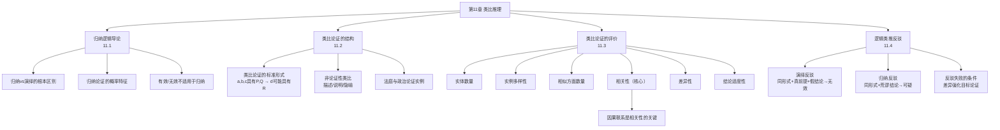

**相关笔记：** [[10.7 非三段论推论]] | [[12.1 因果联系与密尔方法]]

> [!abstract] 概览
> 第11章是本书从演绎逻辑转向归纳逻辑的过渡章节，聚焦于==类比论证==这一最常用的归纳推理形式。全章首先重新审视归纳与演绎的根本区别（[[11.1 归纳与演绎再探]]），系统定义类比论证的结构与类型（[[11.2 类比论证]]），提出评价类比论证的六大标准（[[11.3 类比论证的评价]]），最后介绍通过逻辑类推进行反驳的技巧（[[11.4 通过逻辑类推进行的反驳]]）。类比论证虽然不像演绎论证那样具有确定性，但它是法律论证、科学推理和日常论证中最基本、最有力的工具之一。

---

## 一、全章知识框架

## 二、各节核心要点

### 11.1 归纳与演绎再探

| 维度 | 演绎论证 | 归纳论证 |
|:-----|:---------|:---------|
| 结论特征 | ==确定性==（前提真→结论必真） | ==概率性==（前提真→结论可能真） |
| 评价术语 | 有效/无效 | 强/弱 |
| 信息流向 | 结论不超出前提信息 | 结论超出前提信息 |
| 典型形式 | 三段论、命题逻辑证明 | 类比、因果推理、统计推理 |

> [!tip] 关键区分
> "有效/无效"是演绎论证的专属术语，==不能==用于评价归纳论证。归纳论证用"强/弱"来评价。

### 11.2 类比论证

**标准形式**：
$$a, b, c \text{ 具有 } P, Q$$
$$a, b, c \text{ 具有 } R$$
$$\therefore d \text{ 可能具有 } R$$

- **类比的非论证用法**：描述性类比（"她的眼睛像星星"）、说明性类比（"原子结构类似太阳系"）、表达性类比
- **论证性类比**：从已知的相似性推出未知的相似性

### 11.3 类比论证的评价（==全章核心==）

六大评价标准（按重要性排序）：

| # | 标准 | 作用 | 要点 |
|:-:|:-----|:-----|:-----|
| 1 | ==相关性== | 最重要 | 共有属性与结论属性之间有因果联系 |
| 2 | ==差异性== | 削弱 | 前提实例与结论实例之间的不相似之处 |
| 3 | ==结论适度性== | 调节 | 结论越谨慎，论证越强 |
| 4 | ==相似方面数== | 增强 | 共有属性越多越好 |
| 5 | ==实例多样性== | 增强 | 前提实例越多样越好（消除潜在差异） |
| 6 | ==实体数量== | 增强（递减） | 实例越多越好，但边际递减 |

> [!warning] 核心洞见
> 相关性是六大标准中==最关键==的。一个高度相关的单一因素比大量不相关的因素更有说服力。因果联系是相关性的基础。

### 11.4 通过逻辑类推进行的反驳

**核心策略**：构造一个与目标论证具有==相同逻辑形式==但结论明显不可接受的类比论证。

- **演绎反驳**：如果反驳性论证的前提为真而结论为假，且形式相同→目标论证无效
- **归纳反驳**：如果反驳性论证导致荒谬结论→目标论证的结论值得怀疑
- **反驳失败**：当反驳性类比与目标论证之间存在==重要差异==，且这些差异实际上强化了目标论证时

## 三、跨章节关联

| 关联方向 | 关联内容 |
|:---------|:---------|
| ←第1章 | [[演绎论证]] vs [[归纳论证]] 的根本区别（1.5节） |
| ←第8章 | 逻辑类推反驳在条件陈述中的应用（8.5节） |
| ←第10章 | 形式有效性概念与类比论证概率性的对比 |
| →第12章 | 因果联系是类比论证相关性的基础（密尔方法） |
| →第13章 | 科学假说与类比推理的关系 |
| →第14章 | 概率与归纳强度的量化 |

## 四、待创建Wiki概念页

以下概念在第11章中首次出现，将在后续ingest阶段创建独立Wiki页面：

- 类比论证（核心概念）
- 类比推理
- 因果联系
- 逻辑形式
- 归纳强度

---

> [!quote] 章节总结
> 类比论证是归纳推理中最基本的形式。评价类比论证需要综合考虑六大标准，其中相关性（因果联系）最为关键。通过逻辑类推进行反驳是检验论证形式有效性的有力工具，但反驳本身也可能因差异而失败。
