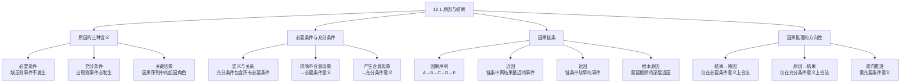

**相关笔记：** [[12.2 因果律与自然齐一性]] | [[12.3 简单枚举归纳法]]

> [!abstract] 概览
> 本节系统辨析了"原因"一词的==多种含义==，这是进行因果推理的前提。核心知识点包括：
> - **原因的三种含义**：作为==必要条件==、作为==充分条件==、作为==关键因素==（INUS条件）
> - **必要条件与充分条件的关系**：一个事件的充分条件包含该事件的所有必要条件
> - **排除不合意现象 vs 产生合意现象**：不同实践目标下"原因"一词的不同用法
> - **因果链条**：远因与近因的区分，以及"根本原因"的概念
> - **因果推理的方向性**：仅在必要条件意义上可从结果推原因，仅在充分条件意义上可从原因推结果

---

## 一、知识结构总览

---

## 二、核心思想

> [!tip] 核心思想
> "原因"一词在日常语言和科学中有==多种不同的含义==，如果不加区分地使用，就会导致推理错误。Copi在本节中系统辨析了原因的三种主要含义：==必要条件==、==充分条件==和==关键因素==。理解这三种含义及其相互关系，是正确进行因果推理的基础。

### 必要条件与充分条件

> [!def] 必要条件（Necessary Condition）
> 一个特定事件发生的==必要条件==是指，在缺乏它的情况下，该事件==不能发生==。用符号表示：如果事件 $E$ 发生，那么必要条件 $N$ 必定已经出现，即 $E \supset N$。
>
> **经典例子：** 有氧气是燃烧发生的必要条件。如果燃烧发生了，那么氧气必定已经出现，因为在没有氧气的情况下，燃烧是不可能的。

> [!def] 充分条件（Sufficient Condition）
> 一个事件发生的==充分条件==是，它出现的情况下事件==必定发生==。用符号表示：如果充分条件 $S$ 出现，那么事件 $E$ 必定发生，即 $S \supset E$。
>
> **经典例子：** 对几乎每一种物质而言，存在某个温度范围，在有氧气的情况下该温度范围是该物质燃烧的充分条件。有氧气是燃烧的必要条件，但不是充分条件——因为有氧气时可以不发生燃烧。

> [!def] 必要条件与充分条件的关系
> 一个事件的发生可能有==多个必要条件==，并且所有这些必要条件必定==包含在该事件的充分条件里==。也就是说，充分条件是所有必要条件的联合（conjunction）。
>
> 用符号表示：若 $N_1, N_2, \ldots, N_k$ 是事件 $E$ 的全部必要条件，则 $N_1 \cdot N_2 \cdot \ldots \cdot N_k$ 就是 $E$ 的充分条件。

### 原因的三种含义

> [!def] 原因的第一种含义——必要条件
> 当手头上的问题是要==排除一些不合意的现象==时，"原因"一词更多地是在"必要条件"的意义上被使用。为了排除某个现象，人们只要找到该现象存在的某个必要条件，然后排除掉该条件。
>
> **例子：** 何种病毒或细菌是某种特定疾病的原因？医生通过施用一种消灭那些细菌的药物治愈该疾病。细菌被认为是该疾病的原因，因为它们是该疾病的一个==必要条件==——如果没有它们便不会有该疾病。

> [!def] 原因的第二种含义——充分条件
> 当我们感兴趣的是==产生某个合意的现象==时，"原因"一词更多地是在"充分条件"的意义上被使用。
>
> **例子：** 冶金家的目标是发现什么使金属合金具有更大的强度。当找到了具有所希望结果的一个热处理和冷处理相复合的特定过程时，我们就说这样的过程是合金强度增高的==原因==（充分条件意义上的原因）。

> [!def] 原因的第三种含义——关键因素
> "原因"一词的第三种含义是：在通常盛行的条件之下，对某事件的发生或不发生==造成影响的事件或行为==。这种含义与Mackie的==INUS条件==概念密切相关——即"不充分但非冗余的、不必要但充分条件的一部分"（Insufficient but Non-redundant part of an Unnecessary but Sufficient condition）。
>
> **例子1：** 说"吸烟导致肺癌"是正确的，尽管吸烟持续很长时间但结果并没有患上癌症（不是充分条件），并且许多癌症是在完全没有吸烟的情况下得的（不是必要条件）。但吸烟在肺癌的发展中如此频繁地发挥作用，以至于我们正确地称其为"原因"。
>
> **例子2：** 保险公司派遣调查员弄清一场神秘火灾的原因。调查员报告"火灾是由空气中的氧气所致"——虽然在必要条件意义上是对的，但调查员的工作将很可能不保。保险公司试图发现的是在通常条件下对火灾的发生造成==影响==的事件或行为，即关键因素。

> [!example] 辛辛那提事件——关键因素含义的典型应用
> 2003年11月，在俄亥俄州辛辛那提市，一个强烈拒捕的魁梧男人在被警察打至屈服之后很快就死亡了。验尸官主张这是一次"杀人"，并注明："如果没有这场扭打的话，琼斯先生不会及时地在那个精确时刻死亡，因此，那场扭打就是他死亡的==主要原因==。"
>
> 这里"主要原因"是在关键因素的意义上使用的——扭打不是死亡的必要条件（人可以因其他原因死亡），也不是充分条件（扭打不一定导致死亡），但在这场因果链条中，扭打是离死亡最近的、造成影响的关键事件。

### 因果链条：远因与近因

> [!def] 因果链条与远因/近因
> 当存在一个==因果序列==——事件的链条，其中 $A$ 引起 $B$，$B$ 引起 $C$，$C$ 引起 $D$，$D$ 引起 $E$——此时我们将结果 $E$ 称为任意一个那些先行事件的结果。
>
> - ==近因==（proximate cause）：在事件的链条中离结果最近的事件。例如死亡 $E$ 的近因是扭打 $D$。
> - ==远因==（remote cause）：链条中较早的事件。例如逮捕 $B$、违法 $A$ 都是远因。$A$ 比 $B$ 遥远，$B$ 比 $C$ 遥远，如此等等。
> - ==根本原因==（root cause）：需要根除的深层远因。

> [!example] 教育与健康——远因的典型例子
> 16岁以前离开学校的人死于心脏病的可能性比大学毕业生高5倍（大学毕业生一年中死于心脏病的死亡率是3.5%，少于八年正规学校教育的人死亡率是20%）。但是大学教育不是良好健康的近因，无知也不是疾病的近因。落后的教育是因果链条中的一个环节——它往往造成对疾病过程不充分的理解，因而促进更好的医疗结果所需的生活方式的改变难以做出。
>
> 因此，==极广泛地对教育产生影响的贫困==，是健康欠佳的"根本原因"之一——当然不是它的近因，但是是一个需要根除的远因。

### 因果推理的方向性

> [!def] 因果推理的三种方向
> - **从结果推原因**：仅在==必要条件==含义上合法。如果 $E$ 发生了，那么它的某个必要条件 $N$ 必定已经出现。
> - **从原因推结果**：仅在==充分条件==含义上合法。如果充分条件 $S$ 出现了，那么事件 $E$ 必定发生。
> - **双向推理**（既从原因到结果，又从结果到原因）："原因"一词必定是在==充要条件==的意义上被使用。在这种用法中，原因被认为是事件的充分条件，而那个充分条件被认为是它所有必要条件的联合。

---

## 三、补充理解与易混淆点

### 补充理解

> [!info] 补充1：必要条件与充分条件的逻辑关系——斯坦福哲学百科全书
> **来源：** Stanford Encyclopedia of Philosophy. (2013). *Necessary and Sufficient Conditions*. https://plato.stanford.edu/archives/win2013/entries/necessary-sufficient/
>
> 斯坦福哲学百科全书对必要条件与充分条件的关系给出了精确的逻辑刻画，并揭示了两者之间的==可相互定义性==：
>
> **核心等价关系：**
> - $A$ 是 $B$ 的充分条件 $\equiv$ $\sim A$ 是 $\sim B$ 的必要条件
> - $B$ 是 $A$ 的必要条件 $\equiv$ $\sim B$ 是 $\sim A$ 的充分条件
>
> 用符号表示：
> $$A \text{ 是 } B \text{ 的充分条件} \iff \sim A \text{ 是 } \sim B \text{ 的必要条件}$$
> $$B \text{ 是 } A \text{ 的必要条件} \iff \sim B \text{ 是 } \sim A \text{ 的充分条件}$$
>
> **实践意义：**
> - 当我们说"有氧气是燃烧的必要条件"时，等价于说"没有氧气是不燃烧的充分条件"
> - 当我们说"达到燃点是燃烧的充分条件（在有氧气时）"时，等价于说"未达到燃点是不燃烧的必要条件"
> - 这种可相互定义性意味着：==理解了必要条件就自动理解了充分条件，反之亦然==

> [!info] 补充2：INUS条件——Mackie的因果理论
> **来源：** Stanford Encyclopedia of Philosophy. (2022). *Probabilistic Causation*. https://plato.stanford.edu/archives/fall2022/entries/causation-probabilistic/
>
> 哲学家John Mackie提出了==INUS条件==的概念，精确地刻画了Copi所说的"关键因素"这一含义：
>
> **INUS条件的定义：**
> 一个INUS条件是某个效果的==不充分但非冗余的==（Insufficient but Non-redundant）、==不必要但充分条件的一部分==（part of an Unnecessary but Sufficient condition）。
>
> **经典例子——短路与房屋火灾：**
> - 短路本身不足以引起房屋火灾（需要同时存在易燃材料、氧气等）→ "不充分"
> - 短路在导致这场火灾的充分条件组合中不是冗余的（如果当时没有短路，这场火灾就不会发生）→ "非冗余"
> - 短路不是房屋火灾的必要条件（火灾可以由其他原因引起）→ "不必要"
> - 但短路是某个充分条件组合的一部分（短路 + 易燃材料 + 氧气 = 火灾）→ "充分条件的一部分"
>
> **与Copi三种含义的对应：**
> - INUS条件精确对应Copi的==第三种含义==（关键因素）
> - 吸烟导致肺癌、扭打导致死亡等例子都可以用INUS条件来精确分析
> - ==INUS条件是日常和科学因果归因中最常用的"原因"含义==

### 易混淆点

> [!warning] 误区：必要条件和充分条件是同一回事
> ❌ **错误理解：** 必要条件和充分条件只是同一个概念的两个名字，知道其中一个就等于知道了另一个。如果 $A$ 是 $B$ 的原因，那么 $A$ 既是 $B$ 的必要条件又是充分条件。
>
> ✅ **正确理解：** 必要条件和充分条件是==两个截然不同的概念==，它们描述的是因果关系的两个不同方向：
>
> | 特征 | 必要条件 | 充分条件 |
> |:-----|:---------|:---------|
> | **定义** | 缺乏它，事件不发生 | 出现它，事件必发生 |
> | **逻辑形式** | $E \supset N$（有果必有因） | $S \supset E$（有因必有果） |
> | **推理方向** | 从结果→原因 | 从原因→结果 |
> | **典型应用** | 排除不合意现象 | 产生合意现象 |
> | **氧气与燃烧** | 氧气是燃烧的必要条件 | 氧气不是燃烧的充分条件 |
>
> **辨析：**
> - 有氧气不一定燃烧（不是充分条件），但燃烧一定有氧气（是必要条件）
> - 一个事件可以有==多个必要条件==，但通常我们关注的是那个可以操作的
> - 一个充分条件通常==包含多个必要条件的联合==
> - ==只有充要条件==（necessary and sufficient condition）才同时满足两个方向

> [!warning] 误区：因果链条中离结果越近的原因越重要
> ❌ **错误理解：** 在因果链条 $A \to B \to C \to D \to E$ 中，近因 $D$ 一定比远因 $A$ 更重要、更值得干预。
>
> ✅ **正确理解：** 近因和远因的==重要性取决于实践目标==。有时候远因（尤其是根本原因）比近因更值得干预，因为消除远因可以从根源上解决问题。
>
> **辨析：**
> - **近因的优势**：更容易识别和验证，与结果之间的因果联系更直接
> - **远因的优势**：消除远因可以从根源上阻断整个因果链条，防止类似事件再次发生
> - **Copi的例子**：贫困→教育落后→健康知识不足→不良生活方式→心脏病。近因是不良生活方式，但==根本原因是贫困==——要真正降低心脏病死亡率，需要从根除贫困入手
> - **实践启示**：好的因果分析应该同时识别近因和远因，并根据==可操作性==和==干预效果==选择干预目标
> - ==不能因为某个原因是远因就忽视它==，也不能因为某个原因是近因就认为它是最重要的

---

## 四、习题精选

> [!todo] 习题概览
> | 题号 | 核心考点 | 难度 |
> |:-----|:---------|:-----|
> | 1 | 区分必要条件与充分条件 | ⭐⭐ |
> | 2 | 识别因果推理中"原因"的含义 | ⭐⭐⭐ |

### 题1：区分必要条件与充分条件

> [!problem] 题目
> 判断以下各陈述中"原因"一词是在必要条件、充分条件还是关键因素的意义上使用的，并说明理由：
>
> (a) "缺水是这盆花枯萎的原因。"
> (b) "这种新型肥料是番茄产量翻倍的原因。"
> (c) "吸烟是导致肺癌的原因之一。"

> [!faq]- 解答
> **(a) "缺水是这盆花枯萎的原因。"**
> - **含义：** ==必要条件==意义上的原因。
> - **理由：** 水是植物存活的必要条件。缺乏水（必要条件），植物就会枯萎。这里的目标是==排除不合意现象==（枯萎），因此找到并消除必要条件的缺失（补水）即可解决问题。
>
> **(b) "这种新型肥料是番茄产量翻倍的原因。"**
> - **含义：** ==充分条件==意义上的原因。
> - **理由：** 使用这种肥料后，番茄产量翻倍。这里的目标是==产生合意现象==（提高产量），肥料的使用是产量翻倍的充分条件（在给定其他种植条件的情况下）。
>
> **(c) "吸烟是导致肺癌的原因之一。"**
> - **含义：** ==关键因素==（INUS条件）意义上的原因。
> - **理由：** 吸烟不是肺癌的必要条件（不吸烟也可能得肺癌），也不是充分条件（吸烟不一定得肺癌）。但吸烟在肺癌的发展中频繁地发挥作用，是在通常条件下影响肺癌发生的关键因素。"之一"这个词也暗示了它只是多个因素中的一个。
>
> $\blacksquare$

### 题2：因果推理的方向性

> [!problem] 题目
> 以下推理是否正确？如果不正确，请指出错误所在：
>
> "既然燃烧发生了，而氧气是燃烧的必要条件，所以有氧气是燃烧的充分条件。因此，只要有氧气，就一定会发生燃烧。"

> [!faq]- 解答
> **这个推理是不正确的。**
>
> **错误分析：**
> 1. 前提"氧气是燃烧的必要条件"是正确的——没有氧气就没有燃烧。
> 2. 但从"氧气是必要条件"推出"氧气是充分条件"是==无效的推理==。必要条件和充分条件是两个不同的概念，不能相互推出。
> 3. 结论"只要有氧气，就一定会发生燃烧"显然为假——有氧气时可以不发生燃烧（例如室温下的铁块有氧气包围但不会燃烧）。
>
> **正确理解：**
> - 氧气是燃烧的==必要条件==：$燃烧 \supset 有氧气$
> - 氧气不是燃烧的==充分条件==：$有氧气 \not\supset 燃烧$
> - 燃烧的充分条件是所有必要条件的联合：$有氧气 \cdot 达到燃点 \cdot 有可燃物 \cdot \ldots \supset 燃烧$
>
> $\blacksquare$

> [!tip] 解题思路提示
> 区分"原因"三种含义的技巧：
> 1. **看实践目标**：排除不合意现象→必要条件；产生合意现象→充分条件；解释事件发生→关键因素
> 2. **检验必要条件**：问"没有它，事件还能发生吗？"如果能→不是必要条件
> 3. **检验充分条件**：问"有了它，事件一定发生吗？"如果不一定→不是充分条件
> 4. **如果既不是必要条件也不是充分条件**，但确实对事件有影响→关键因素（INUS条件）
> 5. **因果推理方向**：从结果推原因→必要条件；从原因推结果→充分条件；双向推理→充要条件

---

## 五、视频学习指南

> [!info] 视频资源
> | 资源 | 链接 | 对应内容 | 备注 |
> |:-----|:-----|:---------|:-----|
> | Wireless Philosophy: Causation | [链接](https://www.youtube.com/playlist?list=PLtDyWVKRDCG2g5iKVE9tSsS2vA7nJwFK) | 因果关系基础 | 英文，涵盖因果推理 |
> | Crash Course Philosophy: Inductive Reasoning | [链接](https://www.youtube.com/watch?v=GEAbI1Wj-TY) | 归纳推理概述 | 英文，适合入门 |
> | Kevin deLaplante: Critical Thinking | [链接](https://www.youtube.com/watch?v=5m77MzLvKb4) | 批判性思维中的因果分析 | 英文，系统讲解 |

---

## 六、教材原文

> [!quote] 教材原文
> **来源：** 逻辑学导论 第15版，第12章第1节
>
> **原因的三种含义：**
> "原因"这个词（关于某个事件）有时是在"那个事件的必要条件"的意义上使用，而有时是在"那个事件的充分条件"的意义上使用。当手头上的问题是要排除一些不合意的现象时，它更多地是在"必要条件"的意义上被使用。然而，"原因"这个词也被普遍地用作充分条件的意义，特别是当我们感兴趣的是产生某个合意的现象，而不是排除一些不合意的现象的时候。
>
> **关键因素的含义：**
> 与充分条件密切相关的是"原因"一词的另外一种意义——当一给定现象倾向于在特定结果的产生中扮演起因的角色。这就指出了"原因"这个术语的另外一种通常用法：作为某个现象发生过程中的一个关键因素。保险公司试图发现的是，在通常盛行的那些条件已经发生的情况之下，对火灾的发生或者不发生造成影响的事件或行为是什么。
>
> **因果链条与远因近因：**
> 当存在一个因果序列——事件的链条，其中A引起B，B引起C，C引起D，D引起E——此时，我们将结果E称为任意一个那些先行事件的结果。我们把E的远因和近因进行区分。近因是在事件的链条中离它最近的事件。
>
> **因果推理的方向性：**
> 仅当在原因的必要条件含义上，我们才能合法地从结果中推出原因。并且，仅当在原因的充分条件含义上，我们才能从原因中推出结果。当推论是既从原因到结果，又从结果到原因时，"原因"这个词必定是在充要条件的意义上被使用的。不存在符合该词所有不同（并且合理的）用法的单个原因定义。

---

## 参见 Wiki

- [[因果联系]] -- 因果关系的基本概念，本节是因果联系的语义分析
- [[归纳逻辑]] -- 因果推理属于归纳逻辑的核心内容
- [[休谟问题]] -- 休谟对因果关系的经典质疑，下一节将详细讨论
- [[演绎论证]] -- 因果推理与演绎推理的区别
- [[归纳论证]] -- 因果推理是一种重要的归纳论证形式
- [[12.2 因果律与自然齐一性]] -- 因果律的定义与自然齐一性原理
- [[12.3 简单枚举归纳法]] -- 通过枚举示例建立因果联系的方法

#学习/逻辑学/因果推理
