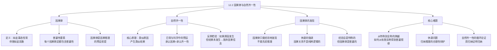

**相关笔记：** [[12.1 原因与结果]] | [[12.3 简单枚举归纳法]]

> [!abstract] 概览
> 本节探讨因果推理的哲学基础——==因果律==与==自然齐一性==原理，并引出了经典的==休谟问题==（归纳问题）。核心知识点包括：
> - **因果律的定义**：如此这般的事态恒常地伴随着特定种类的现象
> - **自然齐一性原理**：类似原因产生类似结果，这是因果推理的预设前提
> - **因果律的普遍性要素**：每个关于因果联系的断定都包含普遍性的关键要素
> - **因果律的经验发现**：因果律只能经验地（后验地）发现，不能由先验推理得到
> - **从特称到全称的跨越难题**：如何从有限的观察实例得到普遍的因果律

---

## 一、知识结构总览

---

## 二、核心思想

> [!tip] 核心思想
> 因果推理之所以可能，是因为我们预设了==自然齐一性==原理——类似原因产生类似结果。每一个关于因果联系的断定都包含==普遍性==的关键要素，即存在一条因果律：如此这般的事态恒常地伴随着特定种类的现象。然而，因果律只能通过==经验==来发现，而我们的经验总是有限的、特称的，这就产生了如何从有限经验跨越到普遍因果律的==根本难题==——这就是经典的休谟问题。

### 因果律的定义

> [!def] 因果律（Causal Law）
> ==因果律==是断定如此这般的一个事态==恒常地==伴随着一个特定种类的现象，而无论该事态发生于何时何地的普遍命题。
>
> 用符号表示：对于所有 $x$，如果 $x$ 是事态 $C$ 的一个实例，那么 $x$ 也伴随着现象 $P$ 的一个实例。即：
> $$(x)(Cx \supset Px)$$
>
> **关键特征：** 因果律是一个==全称命题==，它断言的是一种普遍的、无例外的伴随关系，而非仅仅在特定时间、特定地点的偶然关联。

### 自然齐一性原理

> [!def] 自然齐一性（Uniformity of Nature）
> ==自然齐一性==原理是因果推理的基本预设：==类似原因产生类似结果==。我们承认某个特定事态是某个特定结果的原因，仅当我们同意该类型的任意其他事态（如果伴随的事态是充分类似的）将引起与先前结果同类型的另一个结果。
>
> **核心含义：**
> - 产生某个结果的一个原因，其每一次出现都是==普遍因果律==的一个实例或者事例
> - 如果能够表明在另外的情形下，假定的原因发生之后假定的结果==并没有发生==，我们将放弃认为一个是另一个的原因的信念
> - 自然齐一性意味着：==因果律在时间上和空间上是普遍有效的==

> [!example] 自然齐一性的日常应用
> 每次我们将蓝色石蕊试纸浸入酸中，试纸都变红。我们之所以相信"将蓝色石蕊试纸浸入酸中会导致试纸变红"是一条因果律，正是因为我们预设了自然齐一性——如果这个因果律是真的，那么==无论何时何地==，只要将蓝色石蕊试纸浸入酸中，试纸都会变红。
>
> 如果有一天我们发现某次将蓝色石蕊试纸浸入某种酸中但试纸没有变红，我们就会==放弃或修正==这条因果律——这说明自然齐一性原理也包含了==可证伪性==的要求。

### 因果律的普遍性要素

> [!def] 因果律的普遍性要素
> 因为每个关于一特定事态是一特定现象原因的断定，都意味着存在某种因果律，每一个关于因果联系的断定==包含了普遍性的一个关键要素==。
>
> 这意味着：
> - 当我们说"这次扭打导致了琼斯先生的死亡"时，我们不仅仅是在描述一个==偶然事件==，而是在暗示存在一条普遍的因果律
> - 这条因果律是：在类似条件下，类似的扭打会导致类似的死亡
> - ==没有普遍性要素的因果断定是不完整的==——它只是一个孤立的事件描述，而非真正的因果推理

### 因果律的经验发现与休谟问题

> [!def] 因果律只能经验地发现
> 因果关系==不是纯粹逻辑的或纯粹演绎的==；正如大卫·休谟所强调的，它==不能被任何先验的推理发现==。因果律只能==经验地或后验地==（即诉诸经验）发现。
>
> **休谟问题的核心困境：**
> - 我们的经验总是与==特定事态、特定现象==以及它们的特定次序有关
> - 我们可能观察到事态 $C$ 的一些实例，并且每一个实例都伴随有现象 $P$ 的一个实例
> - 但我们未来能够经历的仅仅是 $C$ 在这个世界上的==某些实例==
> - 我们的观察因此也仅能展示给我们 $P$ 伴随着 $C$ 的==某些事例==
> - 然而，我们的目标是建立一个==普遍的==因果关系
>
> **核心问题：** 我们如何能够从经验到的普遍命题的==特例==，得到 $C$ 在==所有情况下==都伴随有 $P$？在说 $C$ 引起 $P$ 的时候就包含了这样的问题。

> [!example] 休谟问题的直观展示
> 假设我们观察到以下特称命题：
> - $C_1$ 伴随 $P_1$（第一次将石蕊试纸浸入酸中，试纸变红）
> - $C_2$ 伴随 $P_2$（第二次将石蕊试纸浸入酸中，试纸变红）
> - $C_3$ 伴随 $P_3$（第三次将石蕊试纸浸入酸中，试纸变红）
> - ...
> - $C_n$ 伴随 $P_n$（第 $n$ 次将石蕊试纸浸入酸中，试纸变红）
>
> 我们想得出的结论是全称命题：$(x)(Cx \supset Px)$（所有将蓝色石蕊试纸浸入酸中的情况都会变红）。
>
> 但从有限个特称命题到全称命题的跨越，==逻辑上不是必然有效的==——无论我们观察了多少个实例，第 $n+1$ 个实例都有可能不遵循这个模式。这就是休谟问题的核心。

---

## 三、补充理解与易混淆点

### 补充理解

> [!info] 补充1：休谟的归纳问题——从自然齐一性到循环论证
> **来源：** Internet Encyclopedia of Philosophy. *The Problem of Induction*. https://iep.utm.edu/problem-of-induction/
>
> 休谟对归纳推理的质疑是哲学史上最深刻的问题之一。IEP的文章详细阐述了休谟的论证结构：
>
> **休谟的三步论证：**
> 1. **所有关于事实的推理都建立在因果关系之上**——我们超出记忆和感官证据的唯一方式就是通过因果推理
> 2. **因果关系的知识只能通过经验获得**——我们不能先验地知道哪些事件是哪些事件的原因
> 3. **经验本身依赖于自然齐一性原理**——从过去的经验推断未来，需要预设"未来将类似于过去"
>
> **循环论证的困境：**
> - 我们如何证明自然齐一性原理？只能通过==诉诸过去的经验==（过去未来确实类似于过去）
> - 但用过去的经验来证明"未来将类似于过去"，==本身就是一个归纳推理==
> - 而我们正在试图证明的恰恰是==归纳推理的合理性==
> - 因此，==用归纳来证明归纳是循环的==
>
> **休谟的结论：** 我们对自然齐一性的信念不是理性的产物，而是==习惯和心理联想==的产物——我们总是观察到 $C$ 伴随 $P$，久而久之就形成了" $C$ 将伴随 $P$"的心理期望。

> [!info] 补充2：归纳问题的经典表述与大英百科全书视角
> **来源：** Encyclopaedia Britannica. *Problem of Induction*. https://www.britannica.com/topic/problem-of-induction#ref924489
>
> 大英百科全书对归纳问题给出了经典表述，并区分了两种主要变体：
>
> **归纳问题的两种变体：**
> 1. **诉诸自然齐一性**：所有归纳推理都依赖于"未来将类似于过去"这一前提，但这个前提本身无法被理性地证明——它既不是逻辑真理（未来可以不同于过去），也不能被经验证明（用经验证明它本身就是归纳推理）
> 2. **诉诸因果必然联系**：我们观察到事件A总是跟随事件B，但我们从未观察到A和B之间的"必然联系"——我们观察到的只是==恒常伴随==（constant conjunction），而非必然连接
>
> **Copi在本节中的处理方式：**
> - Copi指出因果律只能==经验地发现==，这直接呼应了休谟的第一点
> - Copi强调因果断定包含==普遍性要素==，这呼应了归纳问题的核心困境
> - Copi将在后续小节中介绍==密尔五法==等更系统的归纳方法，作为对简单枚举归纳法的改进

### 易混淆点

> [!warning] 误区：因果律是逻辑真理，可以像数学定理一样先验地证明
> ❌ **错误理解：** 因果律就像"所有三角形内角和等于180度"一样，是可以通过逻辑推理先验地证明的普遍真理。只要我们理解了"原因"和"结果"的概念，就能推出因果律。
>
> ✅ **正确理解：** 因果律==不是纯粹逻辑的或纯粹演绎的==，它不能被任何先验的推理发现。因果律只能==经验地或后验地==（即诉诸经验）发现。
>
> **辨析：**
>
> | 特征 | 逻辑真理（如数学定理） | 因果律（如"酸使石蕊变红"） |
> |:-----|:----------------------|:--------------------------|
> | **发现方式** | 先验推理 | 后验经验 |
> | **证明方法** | 演绎证明 | 归纳概括 |
> | **确定性** | 必然的（不可能为假） | 概然的（可能被反例推翻） |
> | **依赖经验** | 不依赖 | 完全依赖 |
> | **可修正性** | 不可修正 | 可被新经验修正 |
>
> - 休谟的深刻洞见正在于此：==因果关系不在概念之中，而在经验之中==
> - 我们不能仅凭分析"原因"和"结果"这两个概念就得出任何具体的因果律
> - 每一条具体的因果律（如"吸烟导致肺癌"）都需要通过==观察和实验==来建立

> [!warning] 误区：观察到足够多的实例后，因果律就变成了确定无误的真理
> ❌ **错误理解：** 只要我们观察到的确证实例足够多（比如1000次、10000次），因果律就变成了确定无误的真理，不再需要担心反例。
>
> ✅ **正确理解：** ==无论观察到多少个确证实例，因果律始终是概然的，而非必然的==。一个反例就足以推翻一条被上千个实例支持的因果律。
>
> **辨析：**
> - 从逻辑上看，从 $n$ 个特称命题（$C_1$ 伴随 $P_1$，...，$C_n$ 伴随 $P_n$）到全称命题 $(x)(Cx \supset Px)$ 的推理==永远不是演绎有效的==
> - 无论 $n$ 多大，第 $n+1$ 个实例都有可能是一个==反例==——即 $C_{n+1}$ 发生了但 $P_{n+1}$ 没有发生
> - 历史上的教训：欧洲人观察了数千年的"所有天鹅都是白色的"，直到在澳大利亚发现了==黑天鹅==，这条"因果律"就被推翻了
> - Copi在本节末尾提出的问题——"我们如何能够从经验到的普遍命题的特例，得到 $C$ 在所有情况下都伴随有 $P$？"——正是要强调这一根本困难
> - ==归纳推理的力量在于概率，而非确定性==——确证实例越多，因果律为真的概率越高，但永远达不到100%的确定性

---

## 四、习题精选

> [!todo] 习题概览
> | 题号 | 核心考点 | 难度 |
> |:-----|:---------|:-----|
> | 1 | 理解因果律的普遍性要素 | ⭐⭐ |
> | 2 | 分析休谟问题的结构 | ⭐⭐⭐ |

### 题1：因果律的普遍性要素

> [!problem] 题目
> 以下两个陈述中，哪一个表达了因果律？哪一个只是对偶然事件的描述？请说明理由。
>
> (a) "昨天我吃了海鲜之后肚子疼了。"
> (b) "吃了不新鲜的海鲜会导致食物中毒。"

> [!faq]- 解答
> **(a) "昨天我吃了海鲜之后肚子疼了。"**
> - 这只是一个对==偶然事件==的描述，不是因果律。
> - 它只报告了一个特定时间、特定地点发生的特定事件序列，没有做出任何普遍性断言。
> - 它没有断言"每次吃海鲜都会肚子疼"，也没有断言"吃海鲜是肚子疼的原因"。
> - 这只是一个==特称命题==，不包含普遍性要素。
>
> **(b) "吃了不新鲜的海鲜会导致食物中毒。"**
> - 这是一个==因果律==的表达。
> - 它断言了一种普遍的因果关系：无论何时何地，吃了不新鲜的海鲜都会导致食物中毒。
> - 它包含==普遍性要素==——适用于所有不新鲜海鲜和所有食用者。
> - 这是一个==全称命题==，可以被新的经验证据确证或推翻。
>
> **关键区别：** 因果律的核心特征是==普遍性==——它断言的是一种不受时间、地点限制的恒常伴随关系。
>
> $\blacksquare$

### 题2：休谟问题的分析

> [!problem] 题目
> 假设一位科学家做了1000次实验，每次将某种化学物质X加入溶液Y中，溶液都变成了蓝色。科学家据此得出结论："将X加入Y中会导致溶液变蓝。"请用休谟问题的框架分析这个推理的合理性。

> [!faq]- 解答
> **休谟框架下的分析：**
>
> **1. 观察到的特称命题：**
> - $C_1$ 伴随 $P_1$（第1次实验：加入X，溶液变蓝）
> - $C_2$ 伴随 $P_2$（第2次实验：加入X，溶液变蓝）
> - ...
> - $C_{1000}$ 伴随 $P_{1000}$（第1000次实验：加入X，溶液变蓝）
>
> **2. 科学家想得出的全称命题：**
> - $(x)(Cx \supset Px)$（所有将X加入Y中的情况都会使溶液变蓝）
>
> **3. 休谟问题的挑战：**
> - 从1000个特称命题到全称命题的推理==不是演绎有效的==
> - 第1001次实验有可能是一个==反例==——加入X但溶液没有变蓝
> - 我们无法先验地排除这种可能性
>
> **4. 这个推理依赖的预设：**
> - ==自然齐一性原理==：未来将类似于过去，未观察到的实例将类似于已观察到的实例
> - 但这个原理本身无法被理性地证明——用过去的成功经验来证明它本身就是归纳推理，陷入==循环论证==
>
> **5. 结论：**
> - 科学家的推理是==归纳推理==，具有合理性但不是确定无疑的
> - 1000次确证实例使结论的==概率非常高==，但不能达到100%的确定性
> - 科学家的结论是一个==高度可信的假说==，而非绝对真理
> - 如果未来出现反例，这条"因果律"将被==修正或推翻==
>
> $\blacksquare$

> [!tip] 解题思路提示
> 理解因果律与自然齐一性的关键：
> 1. **因果律 = 全称命题**：它断言的是普遍的、无例外的伴随关系
> 2. **自然齐一性是预设前提**：所有因果推理都预设了"类似原因产生类似结果"
> 3. **因果律只能经验发现**：不能通过逻辑推理先验地得出具体的因果律
> 4. **归纳推理的概然性**：无论有多少确证实例，因果律始终是概然的，而非必然的
> 5. **休谟问题的核心**：如何从有限的特称经验跨越到普遍的全称因果律？这个问题至今仍是哲学争论的焦点

---

## 五、视频学习指南

> [!info] 视频资源
> | 资源 | 链接 | 对应内容 | 备注 |
> |:-----|:-----|:---------|:-----|
> | Wireless Philosophy: Hume on Induction | [链接](https://www.youtube.com/watch?v=ZT9mz102G3c) | 休谟的归纳问题 | 英文，清晰讲解 |
> | Crash Course Philosophy: Hume | [链接](https://www.youtube.com/watch?v=LzMT_IbAeH4) | 休谟的因果理论 | 英文，适合入门 |
> | Philosophy Tube: Problem of Induction | [链接](https://www.youtube.com/watch?v=GOa9L2n4rVY) | 归纳问题详解 | 英文，深入分析 |

---

## 六、教材原文

> [!quote] 教材原文
> **来源：** 逻辑学导论 第15版，第12章第2节
>
> **因果律与自然齐一性：**
> 无论是在日常生活中，还是在科学中，"原因"一词的每一种用法都包含或预设了下述学说：原因和结果齐一地相连。我们承认某个特定事态是某个特定结果的原因，仅当我们同意该类型的任意其他事态（如果伴随的事态是充分类似的）将引起与先前结果同类型的另一个结果。换句话说，类似原因产生类似结果。
>
> **因果律的普遍性要素：**
> 因为每个关于一特定事态是一特定现象原因的断定，都意味着存在某种因果律，每一个关于因果联系的断定包含了普遍性的一个关键要素。所谓的因果律，就是断定如此这般的一个事态恒常地伴随有一个特定种类的现象，而无论该事态发生于何时何地。
>
> **因果律的经验发现：**
> 我们如何能够知道这样的普遍真理呢？因果关系不是纯粹逻辑的或纯粹演绎的；正如大卫·休谟所强调的，它不能被任何先验的推理发现。因果律只能经验地或后验地（即诉诸经验）发现。但是我们的经验总是与特定事态、特定现象以及它们的特定次序有关。我们如何能够从经验到的普遍命题的特例，得到C在所有情况下都伴随有P？在说C引起P的时候就包含了这样的问题。

---

## 参见 Wiki

- [[因果联系]] -- 因果关系的基本概念，因果律是因果联系的普遍化表达
- [[归纳逻辑]] -- 因果律的发现依赖于归纳推理
- [[休谟问题]] -- 休谟对归纳推理合理性的经典质疑，本节的核心哲学问题
- [[演绎论证]] -- 与归纳论证对比，演绎推理是必然的，归纳推理是概然的
- [[归纳论证]] -- 因果律的建立是一种归纳论证
- [[12.1 原因与结果]] -- 原因的三种含义，因果律的语义基础
- [[12.3 简单枚举归纳法]] -- 从特称到全称的具体归纳方法

#学习/逻辑学/因果推理
