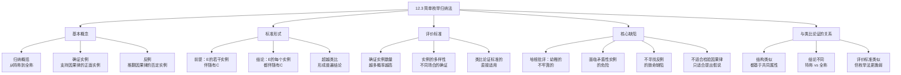

**相关笔记：** [[12.1 原因与结果]] | [[12.2 因果律与自然齐一性]]

> [!abstract] 概览
> 本节介绍==简单枚举归纳法==——从特定经验事实中得到普遍命题的基本归纳方法。核心知识点包括：
> - **归纳概括**：从特称命题到全称命题的推理过程，超越类比论证形成普遍结论
> - **简单枚举归纳法的标准形式**：现象 $E$ 的若干实例伴随有事态 $C$，因而 $E$ 的每个实例都伴随有 $C$
> - **确证实例**：伴随着事态 $C$ 的现象 $E$ 的实例，数量越多结论概率越高
> - **简单枚举法的缺陷**（培根批评）：幼稚的、不牢靠的、面临矛盾性实例危险
> - **反例推翻规则**：任何一个否定性实例都足以推翻被断言的因果律
> - **简单枚举法 vs 类比论证**：结构类似但结论的普遍性程度不同

---

## 一、知识结构总览

---

## 二、核心思想

> [!tip] 核心思想
> ==简单枚举归纳法==是从特定经验事实中得到普遍命题的最基本的归纳方法。当我们观察到现象 $E$ 的若干实例都伴随有事态 $C$ 时，我们推断 $E$ 的==每一个==实例都伴随有 $C$。这种方法在提出因果假说方面成果丰硕，但正如培根所批评的，它是==幼稚的、不牢靠的==，面临着被反例推翻的危险，因此根本不适合于==检验==因果律。

### 归纳概括

> [!def] 归纳概括（Inductive Generalization）
> ==归纳概括==是从特定经验事实中得到==普遍命题==的过程。当我们断定 $C$ 在所有情况下都伴随有 $P$——也就是说，当我们断言一个普遍因果关系的时候——我们就已经==超越了类比==。
>
> **与类比论证的区别：**
> - **类比论证**：从已知实例推出==下一个==特定实例的结论（特称→特称）
> - **归纳概括**：从已知实例推出==所有==实例的结论（特称→全称）
>
> **例子：** 假定我们将蓝色石蕊试纸浸入酸中变红，做了三次或十次，总是有相同的结果。
> - **类比论证的结论**：下一张（第四张或第十一张）被浸入酸中的石蕊试纸将会变红
> - **归纳概括的结论**：每一张蓝色石蕊试纸被浸入酸中后都将会变红

### 简单枚举归纳法的标准形式

> [!def] 简单枚举归纳法（Simple Enumerative Induction）
> ==简单枚举归纳法==的标准形式如下：
>
> 现象 $E$ 的实例1伴随有事态 $C$。
> 现象 $E$ 的实例2伴随有事态 $C$。
> 现象 $E$ 的实例3伴随有事态 $C$。
> $\vdots$
> 因而，现象 $E$ 的每个实例都伴随有事态 $C$。
>
> 用符号表示：
> $$C_1 \cdot P_1$$
> $$C_2 \cdot P_2$$
> $$C_3 \cdot P_3$$
> $$\vdots$$
> $$\therefore (x)(Cx \supset Px)$$
>
> **核心特征：** 简单枚举归纳法非常类似于类比论证，所不同的只是它形成的结论==更为普遍==。

### 确证实例

> [!def] 确证实例（Confirming Instance）
> 伴随着事态 $C$ 的、现象 $E$ 的不同实例或场合，被称作断定 $C$ 引起 $E$ 的因果律的==确证实例==。
>
> **评价规则：** 在其他事情均等同的情况下，==确证实例数量越多==，因果律为真的概率越高。用于类比论证的第一个标准（实例数量）可直接应用于简单枚举归纳法论证。
>
> **注意：** 确证实例只能==提高==因果律的概率，不能==证明==因果律为真。无论有多少确证实例，一个反例就足以推翻因果律。

> [!example] 历史中的简单枚举归纳法——卡那芬伯爵的演讲
> 1678年，卡那芬伯爵在英国上议院用枚举法谴责针对丹比伯爵的掠夺公权法案：
>
> "大人们，从不少的英国历史中我了解到像这样的检举的危害以及检举人的悲惨命运......艾塞克斯伯爵被瓦尔特·罗利爵士检举，大人们，你们很清楚瓦尔特·罗利爵士后来怎么样了。培根大法官检举了瓦尔特·罗利爵士......白金汉公爵检举了培根大法官......斯特拉福德伯爵检举了白金汉公爵......哈里·范爵士检举了斯特拉福德伯爵......海德大臣检举了哈里·范爵士......托马斯·奥斯本爵士检举了海德大臣。现在，丹比伯爵将结果如何呢？"
>
> 这个论证列举了六个确证实例来支持"恶意指控导致随后垮台"这一因果律。然而，尽管在修辞学上是有力的，它并没有提供一个==可信赖的论证==——这些实例的本性阻碍了它们区别开真正的因果律的确证事例和仅仅是历史的偶然事件。

### 简单枚举法的缺陷——培根的批评

> [!def] 培根对简单枚举归纳法的批评
> 400年前，弗兰西斯·培根爵士在《学术的进展》（1605）中清楚地确定了简单枚举归纳法的缺陷：
>
> > "由简单枚举所进行的归纳是==幼稚的==；其结论是==不牢靠的==，面临着来自==矛盾性实例==的危险；并且其结论的达成所基于的事实通常都太少了，还仅仅是现有的事实。"
>
> **简单枚举法的三个核心缺陷：**
> 1. **幼稚性**：不加批判地接受观察到的模式，不深入探究因果机制
> 2. **不牢靠性**：结论随时可能被新的反例推翻
> 3. **事实基础薄弱**：所基于的事实通常太少，且仅限于已有的事实

### 反例推翻规则

> [!def] 反例（Counterexample）
> 任何断言的因果律都会被一个==否定性实例==推翻，因为任何一个反例都表明，被当作"规律"提出来的东西不是真正普遍的。==例外反证了该规则==。
>
> **反例的两种形式：**
> 1. **有因无果**：发现了所断言的原因 $C$，但并没有伴随所断言的结果 $E$（$C$ 发生而 $E$ 没有发生）
> 2. **有果无因**：结果 $E$ 发生了，但所断言的原因 $C$ 没有发生（$E$ 发生而 $C$ 没有发生）
>
> **关键限制：** 在一个简单枚举归纳法论证中，这两种情况中的任何一种都是==无效的==（即无法被处理）；在这样的论证中唯一合法的前提是，断言的原因和断言的结果==都出现==的实例报告。

> [!example] 反例推翻因果律的例子
> - **"所有天鹅都是白色的"**：在欧洲观察了数千只白天鹅后，人们用简单枚举归纳法得出"所有天鹅都是白色的"。但1697年在澳大利亚发现了==黑天鹅==——这是一个反例（有果无因的反例：是天鹅但不是白色的），直接推翻了这条"因果律"。
> - **"掠夺公权法案的提出者都会遭受类似的命运"**：如果历史上存在某个掠夺公权法案的提出者==没有遭受==类似命运的情况，这就是一个反例，推翻了卡那芬伯爵所断言的因果律。

### 简单枚举法的根本局限

> [!def] 简单枚举法的适用范围
> 尽管简单枚举归纳法在==提出因果律==的过程中成果丰硕并且具有价值，但它==根本不适合于检验因果律==。
>
> **核心原因：** 如果我们排他地局限于简单枚举归纳法论证，就会产生一个严重的缺陷——我们将==不会去寻找==，因而甚至不大可能去==注意==那些可能被发现的否定性或反证性实例。
>
> **简单枚举法的正确定位：**
> - **适合**：==提出==因果假说——当我们观察到恒常的伴随关系时，自然地形成一个因果假说
> - **不适合**：==检验==因果假说——检验需要主动寻找反例，而简单枚举法只关注正面实例
> - **需要补充**：为了检验因果律，必须依赖其他类型的归纳论证（如密尔五法）

---

## 三、补充理解与易混淆点

### 补充理解

> [!info] 补充1：简单枚举归纳法与科学归纳法的区别
> **来源：** Internet Encyclopedia of Philosophy. *The Problem of Induction*. https://iep.utm.edu/problem-of-induction/
>
> IEP的文章在讨论归纳问题时，间接揭示了简单枚举归纳法与更成熟的科学归纳方法之间的根本区别：
>
> **简单枚举归纳法 vs 科学归纳法：**
>
> | 特征 | 简单枚举归纳法 | 科学归纳法 |
> |:-----|:-------------|:-----------|
> | **推理基础** | 仅凭实例的数量 | 基于因果机制的理解 |
> | **前提类型** | $C$ 和 $E$ 共同出现的正面实例 | $C$ 和 $E$ 之间的因果联系分析 |
> | **对反例的态度** | 忽视反例（只关注正面实例） | 主动寻找反例来检验假说 |
> | **结论强度** | 概然性较低 | 概然性较高 |
> | **典型例子** | "太阳每天从东方升起" | "石蕊试纸在酸中变红"（经过受控实验验证） |
>
> **关键区别：** 科学归纳法不仅列举正面实例，还==深入探究因果机制==，通过受控实验排除其他可能的解释，从而得出更可靠的结论。简单枚举归纳法则停留在表面模式上，不深入分析因果机制。
>
> **Copi的立场：** Copi在本节末尾明确指出，简单枚举法"根本不适合于检验因果律"，暗示需要更系统的方法（即后续将介绍的密尔五法）来弥补这一缺陷。

> [!info] 补充2：枚举归纳法在科学中的角色——从假说到检验
> **来源：** CLRN. *What is Induction in Science?*. https://www.clrn.org/what-is-induction-in-science/
>
> CLRN的文章详细讨论了枚举归纳法在科学实践中的实际角色，帮助我们理解Copi所说的"成果丰硕但根本不适合检验"这一论断：
>
> **枚举归纳法的双重角色：**
> 1. **假说生成器**（Hypothesis Generator）：枚举归纳法是科学发现的重要起点。当科学家观察到反复出现的模式时，枚举归纳法帮助他们==形成初步假说==
> 2. **需要严格检验**：形成的假说必须经过==受控实验==和==统计检验==的严格审查，而非停留在枚举层面
>
> **从枚举到科学的进步：**
> - **阶段1（枚举）**：观察到蓝色石蕊试纸在酸中多次变红 → 初步假说："石蕊试纸在酸中变红"
> - **阶段2（实验设计）**：设计受控实验，排除温度、浓度、光照等干扰变量
> - **阶段3（假说检验）**：在不同条件下重复实验，主动寻找可能使假说失败的情况
> - **阶段4（理论整合）**：将经过检验的假说整合到更广泛的化学理论中
>
> **枚举归纳法的力量与局限：**
> - ==力量==：它是科学发现的起点，帮助我们从杂乱的经验观察中识别出有规律的模式
> - ==局限==：它不能区分真正的因果律和偶然的关联——两个变量可能恒常伴随，但并非因果关系（如"冰淇淋销量增加"与"溺水事故增加"恒常伴随，但两者都是"气温升高"的结果，而非互为因果）

### 易混淆点

> [!warning] 误区：简单枚举归纳法和类比论证是同一种推理
> ❌ **错误理解：** 简单枚举归纳法和类比论证完全相同，只是名字不同。它们都是从已知实例推出未知实例的推理方法。
>
> ✅ **正确理解：** 简单枚举归纳法和类比论证==结构类似但有本质区别==——核心区别在于结论的==普遍性程度==不同。
>
> **辨析：**
>
> | 特征 | 类比论证 | 简单枚举归纳法 |
> |:-----|:---------|:-------------|
> | **前提** | $E$ 的若干实例伴随有 $C$ | $E$ 的若干实例伴随有 $C$ |
> | **结论类型** | ==特称命题==（关于下一个实例） | ==全称命题==（关于所有实例） |
> | **结论形式** | "下一个 $E$ 将伴随有 $C$" | "每个 $E$ 都伴随有 $C$" |
> | **推理跨度** | 从已知到==一个==未知 | 从已知到==所有==未知 |
> | **被推翻的条件** | 下一个实例不伴随 $C$ | 任何一个实例不伴随 $C$ |
> | **脆弱性** | 较低（只涉及一个实例） | ==极高==（涉及所有实例） |
>
> - **类比论证**：就像根据前3天的天气预测明天的天气——即使预测错了，也只是错一天
> - **简单枚举归纳法**：就像根据前3天的天气断言"每天都是这种天气"——一旦某天天气不同，整个结论就被推翻
> - ==简单枚举归纳法的结论比类比论证的结论脆弱得多==，因为它做出了更强的断言

> [!warning] 误区：确证实例越多，因果律就越接近绝对真理
> ❌ **错误理解：** 只要我们积累足够多的确证实例，因果律就越来越接近绝对真理。1000个确证实例比100个更接近真理，100万个就几乎等于绝对真理了。
>
> ✅ **正确理解：** 确证实例的数量确实==提高了结论的概率==，但这个提高==不是线性的==，而且概率==永远不可能达到100%==。更重要的是，简单枚举归纳法存在==系统性偏差==——它只关注正面实例，忽视反面实例。
>
> **辨析：**
> - **概率提高有上限**：从1个到10个确证实例，概率提高显著；从1000个到1001个，概率提高微乎其微
> - **系统性偏差**：简单枚举法==只计数正面实例==，不主动寻找反面实例。这意味着即使有大量确证实例，也可能存在我们==没有注意到==的反例
> - **培根的批评**：简单枚举法"结论的达成所基于的事实通常都太少了，还仅仅是现有的事实"——关键不在于数量，而在于==没有主动寻找反例==
> - **黑天鹅效应**：欧洲人观察了数百万只白天鹅，但一只黑天鹅就推翻了"所有天鹅都是白色的"
> - **正确做法**：要建立可靠的因果律，不能仅靠积累确证实例，而必须==主动设计实验来寻找反例==——这正是密尔五法等更高级归纳方法的价值所在

---

## 四、习题精选

> [!todo] 习题概览
> | 题号 | 核心考点 | 难度 |
> |:-----|:---------|:-----|
> | 1 | 识别简单枚举归纳法的结构 | ⭐⭐ |
> | 2 | 分析简单枚举法的缺陷与反例 | ⭐⭐⭐ |

### 题1：识别简单枚举归纳法

> [!problem] 题目
> 以下论证中哪些是简单枚举归纳法？哪些是类比论证？请区分并说明理由。
>
> (a) "我在这家餐厅吃过三次饭，每次菜品都很美味。因此，下次来这家餐厅吃饭，菜品也会很美味。"
> (b) "我在这家餐厅吃过三次饭，每次菜品都很美味。因此，这家餐厅的菜品总是很美味。"
> (c) "我在这家餐厅吃过三次饭，每次菜品都很美味。因此，这家餐厅在任何时候的菜品都很美味。"

> [!faq]- 解答
> **(a) 类比论证**
> - **结论：** "下次来这家餐厅吃饭，菜品也会很美味"——这是一个关于==下一个特定实例==的特称命题
> - **理由：** 从已知的3个实例推出下一个实例，属于类比推理
>
> **(b) 简单枚举归纳法**
> - **结论：** "这家餐厅的菜品总是很美味"——这是一个关于==所有实例==的全称命题
> - **理由：** 从已知的3个实例推出所有情况，属于归纳概括
>
> **(c) 简单枚举归纳法（更强的版本）**
> - **结论：** "这家餐厅在任何时候的菜品都很美味"——这是一个==更普遍==的全称命题，不仅涵盖所有菜品，还涵盖所有时间
> - **理由：** 同样是归纳概括，但结论的普遍性程度比(b)更高，因此也==更脆弱==
>
> **关键区别：** (a)的结论是特称的（只涉及下一次），(b)和(c)的结论是全称的（涉及所有情况）。(b)和(c)的区别在于结论的普遍性范围不同——(c)比(b)做出了更强的断言，因此也更容易被反例推翻。
>
> $\blacksquare$

### 题2：分析简单枚举法的缺陷

> [!problem] 题目
> 一位营养学家做了以下论证："我调查了100位每天喝红酒的人，他们的心血管健康状况都优于平均水平。因此，每天喝红酒会导致心血管健康改善。"请用培根的批评框架分析这个论证的缺陷，并说明什么样的反例可以推翻它。

> [!faq]- 解答
> **培根批评框架下的分析：**
>
> **1. 幼稚性：**
> - 该论证只是简单地计数正面实例（100位喝红酒的人心血管健康），没有深入探究==因果机制==
> - 没有考虑==混淆变量==：喝红酒的人可能同时有更高的收入、更好的饮食习惯、更多的运动等
> - 没有设计==受控实验==来排除其他可能的解释
>
> **2. 不牢靠性：**
> - 该论证面临着被==矛盾性实例==推翻的危险
> - 100个正面实例不能保证第101个实例也是正面的
> - 结论"每天喝红酒会导致心血管健康改善"是一个全称命题，一个反例就足以推翻
>
> **3. 事实基础薄弱：**
> - 100个实例看似不少，但相对于全球数以亿计的饮酒者来说，样本量远远不够
> - 而且这些实例仅限于"现有的事实"——调查对象可能来自特定地区、特定社会阶层
>
> **可以推翻该论证的反例：**
> 1. **有因无果型反例**：发现每天喝红酒但心血管健康==不佳==的人——说明喝红酒不是心血管健康的充分条件
> 2. **有果无因型反例**：发现心血管健康==很好==但从不喝红酒的人——说明喝红酒不是心血管健康的必要条件
> 3. **混淆变量型反例**：发现喝红酒的人之所以心血管健康，实际上是因为其他因素（如地中海饮食、规律运动），而非红酒本身
>
> **结论：** 这个简单枚举归纳法论证可以作为一个==初步假说==（"红酒可能与心血管健康有关"），但远远不足以作为一条==因果律==。要检验这条假说，需要设计受控实验，主动寻找反例。
>
> $\blacksquare$

> [!tip] 解题思路提示
> 分析简单枚举归纳法的技巧：
> 1. **识别结构**：前提是若干正面实例，结论是全称命题——这就是简单枚举归纳法
> 2. **区分类比与枚举**：看结论是特称（下一个实例）还是全称（所有实例）
> 3. **应用培根三要素**：幼稚性（是否探究因果机制？）、不牢靠性（是否可能被反例推翻？）、事实基础（样本是否足够多样？）
> 4. **构造反例**：从"有因无果"和"有果无因"两个方向寻找可能的反例
> 5. **定位适用范围**：简单枚举法适合提出假说，不适合检验假说——检验需要更系统的方法

---

## 五、视频学习指南

> [!info] 视频资源
> | 资源 | 链接 | 对应内容 | 备注 |
> |:-----|:-----|:---------|:-----|
> | Wireless Philosophy: Inductive Reasoning | [链接](https://www.youtube.com/watch?v=GEAbI1Wj-TY) | 归纳推理概述 | 英文，涵盖枚举归纳法 |
> | Crash Course Philosophy: Inductive Reasoning | [链接](https://www.youtube.com/watch?v=GEAbI1Wj-TY) | 归纳推理基础 | 英文，适合入门 |
> | Kevin deLaplante: Inductive Arguments | [链接](https://www.youtube.com/watch?v=5m77MzLvKb4) | 归纳论证的评价 | 英文，系统讲解 |

---

## 六、教材原文

> [!quote] 教材原文
> **来源：** 逻辑学导论 第15版，第12章第3节
>
> **归纳概括的定义：**
> 从特定经验事实中得到普遍命题的过程被称作归纳概括。当一个论证的前提报告了两个属性（或事态，或现象）共同发生的若干实例，由类比我们可能推得，一个属性的某个特定实例将也会展示另一个属性。而由归纳概括，我们可能推得，一个属性的每一个实例都将也是另一个属性的实例。
>
> **简单枚举归纳法的标准形式：**
> 现象E的实例1伴随有事态C。现象E的实例2伴随有事态C。现象E的实例3伴随有事态C。因而，现象E的每个实例都伴随有事态C。就是一种简单枚举归纳法。简单枚举归纳法非常类似于类比论证，所不同的只是它形成的结论更为普遍。
>
> **确证实例与评价标准：**
> 伴随着事态C的、现象E的不同实例或场合，往往被称作断定C引起E的因果律的确证实例。在其他事情均等同的情况下，确证实例数量越多，因果律为真的概率越高。
>
> **培根的批评：**
> 由简单枚举所进行的归纳是幼稚的；其结论是不牢靠的，面临着来自矛盾性实例的危险；并且其结论的达成所基于的事实通常都太少了，还仅仅是现有的事实。
>
> **简单枚举法的局限：**
> 如果我们排他地局限于简单枚举归纳法论证，就会产生一个严重的缺陷：我们将不会去寻找，因而甚至不大可能去注意那些可能被发现的否定性或反证性实例。正因为这一点，尽管简单枚举归纳法在提出因果律的过程中成果丰硕并且具有价值，但它根本不适合于检验因果律。

---

## 参见 Wiki

- [[因果联系]] -- 因果关系的基本概念，简单枚举法用于建立因果联系
- [[归纳逻辑]] -- 简单枚举归纳法是归纳逻辑的基本方法之一
- [[休谟问题]] -- 休谟对归纳推理合理性的质疑，简单枚举法的哲学困境
- [[类比推理]] -- 简单枚举归纳法与类比论证结构类似但结论更普遍
- [[演绎论证]] -- 与归纳论证对比，演绎推理是必然的，简单枚举归纳法是概然的
- [[归纳论证]] -- 简单枚举归纳法是一种基本的归纳论证形式
- [[12.1 原因与结果]] -- 原因的三种含义，简单枚举法用于建立因果联系
- [[12.2 因果律与自然齐一性]] -- 因果律的定义，简单枚举法试图建立的正是因果律

#学习/逻辑学/因果推理
