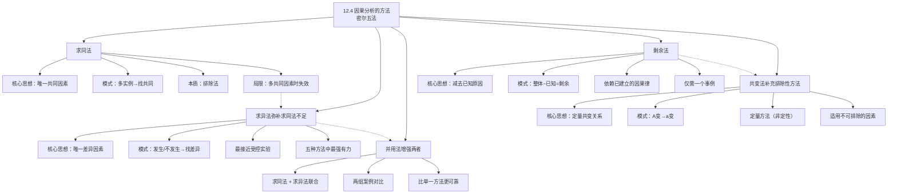

**相关笔记：** [[12.3 简单枚举归纳法]] | [[12.1 原因与结果|12.1 因果联系]] | [[11.2 类比论证]]

> [!abstract] 概览
> 本节系统介绍==密尔五法==（Mill's Methods）——因果分析的五种经典归纳方法，由约翰·斯图亚特·密尔在《逻辑学体系》（1843）中首次系统阐述。这五种方法是科学探究中寻找因果律的通用工具，至今仍是生物学、社会科学和物理科学中因果推理的核心方法论。五种方法包括：
> - **==求同法==**（Method of Agreement）：在现象发生的多个实例中寻找唯一共同因素
> - **==求异法==**（Method of Difference）：比较现象发生与不发生的实例，找出唯一差异因素
> - **==求同求异并用法==**（Joint Method of Agreement and Difference）：联合运用求同法与求异法以增强结论
> - **==剩余法==**（Method of Residues）：从已知原因中减去已解释的部分，剩余部分归因于剩余原因
> - **==共变法==**（Method of Concomitant Variation）：通过现象间的定量共变关系推断因果联系

---

## 一、知识结构总览

---

## 二、五种因果分析方法详解

> [!tip] 核心思想
> 密尔五法的共同目标是从观察到的现象中==识别因果联系==。前四种方法本质上是==排除性==的——通过排除某些可能的原因来支持其他因果假说。==共变法==则是==定量==的，它允许我们利用现象间变化的程度作为因果证据。这五种方法构成了归纳推理中最系统的因果分析工具集，是科学探究因果律的通用方法论基础。

### 1. 求同法（Method of Agreement）

> [!def] 求同法
> **求同法**是密尔的第一种归纳方法。其核心原理是：如果被研究的现象的两个或更多实例==只有一个共同的事态==，那么这个事态——所有实例仅在该事态上相契合——就是给定现象的==原因（或结果）==。
>
> **密尔原文：**
> "如果被研究的现象的两个或更多的实例只有一个共同的事态，那么，这个事态——所有实例仅在该事态上相契合——就是给定现象的原因（或结果）。"
>
> **形式模式：**
> $$\text{事态 } A, B, C, D \text{ 与现象 } w, x, y, z \text{ 一起发生}$$
> $$\text{事态 } A, E, F, G \text{ 与现象 } w, t, u, v \text{ 一起发生}$$
> $$\therefore A \text{ 是 } w \text{ 的原因（或结果）}$$
>
> **推理结构：**
> - 前提1：在第一组事态 $\{A, B, C, D\}$ 下，现象 $w$ 发生
> - 前提2：在第二组事态 $\{A, E, F, G\}$ 下，现象 $w$ 再次发生
> - 两组事态中唯一的共同因素是 $A$
> - 结论：$A$ 是 $w$ 的原因（或结果）

> [!example] 示例1：饮水氟化与蛀牙率降低
> 在寻找某些城市蛀牙率异常低的原因时，研究者发现这些城市有一个共同事态：==供水中的含氟量非常高==。为确证这一因果联系，纽约州纽堡市和金斯顿市（哈德逊河沿岸两个类似大小的城市）在20世纪40年代接受了严密研究：纽堡市的水被加了氟，金斯顿市的水没有加氟。结果显示纽堡市的孩子们到14岁时蛀牙减少了70%，而两个城市在患癌率、先天缺陷率或心脏病率上都没有任何差别。

> [!example] 示例2：岛叶损伤与戒烟
> 2007年《科学》杂志报道：在少数其大脑特定区域（==岛叶==）遭受损害的人当中，其吸烟的欲望==立刻消失==。数据分析表明，岛叶受损后轻松戒烟的可能性比大脑任何其他地方受伤后轻松戒烟的可能性高136倍。研究者由此推断岛叶中的某种物质是烟瘾的一个关键因素。

> [!example] 示例3：学生宿舍食物中毒调查
> 想象某学生宿舍发生一连串消化不良事件。探究的第一个策略是：所有得病的人吃了什么？某些病人吃但不是所有患者都吃的食物不可能是原因。只有当我们发现==所有病例都契合的事态==（可能是某种共同食物、受感染的器具、或有毒的污水），才找到了解决问题的途径。

**求同法的优势与局限：**

| 特征 | 说明 |
|:-----|:-----|
| **优势** | 能有效缩小原因候选范围；广泛适用于流行病学、地质学、分子遗传学等领域 |
| **优势** | 本质上是排除法——在现象未出现的某些情况下出现的事态不可能是原因 |
| **局限** | 当所有实例的共同事态==不止一个==时，无法评价多个候选原因 |
| **局限** | 很少能如此方便地整理数据，使确定所有情况共同的一个事态成为可能 |
| **局限** | 缺乏一致性可以帮助确定什么==不是==原因，但本身不足以确定原因 |

---

### 2. 求异法（Method of Difference）

> [!def] 求异法
> **求异法**是密尔五种方法中==最有力的==一种。其核心原理是：如果一个实例下被考察的现象发生了，在另一个实例下该现象没有发生，两个实例下的事态==除了一个事态不同外其他均相同==，该事态就是该现象的结果或原因，或者为原因的一个不可缺少的部分。
>
> **密尔原文：**
> "如果在一个实例下一个考察的现象发生了，在另外一个实例下该现象没有发生，两个实例下的事态除了一个事态不同外（该事态仅发生在前一个实例中）其他均相同，该事态（只有它使两个实例产生差别）是该现象的结果或原因，或者为原因的一个不可缺少的部分。"
>
> **形式模式：**
> $$\text{事态 } A, B, C, D \text{ 与现象 } w, x, y, z \text{ 一起发生}$$
> $$\text{事态 } B, C, D \text{ 与现象 } x, y, z \text{ 一起发生（无 } w \text{）}$$
> $$\therefore A \text{ 是 } w \text{ 的原因（或结果），或 } w \text{ 原因中不可缺少的部分}$$
>
> **推理结构：**
> - 前提1：事态 $\{A, B, C, D\}$ 下，现象 $w$ 发生
> - 前提2：事态 $\{B, C, D\}$ 下（无 $A$），现象 $w$ 不发生
> - 两组事态的唯一差异是 $A$ 的有无
> - 结论：$A$ 是 $w$ 的原因或结果，或原因中不可缺少的部分

> [!example] 示例1：黄热病蚊子实验（Walter Reed, 1900）
> 美国军医瓦尔特·里德（Walter Reed）、詹姆斯·卡罗尔和杰西·拉齐尔在1900年进行了确证黄热病真正原因的实验。他们建造了一个杜绝蚊子出入的小房子，用金属丝蚊帐将房间分为两个空间，向其中一个空间释放15只叮咬过黄热病病人的蚊子。一个没有免疫力的志愿者进入有蚊子的房间，被7只蚊子叮咬，四天后得了黄热病。另外两个没有免疫力的人在没有蚊子的空间里睡了13个晚上，没有任何不适。
>
> 在另一个无蚊子的房子里，他们放置了黄热病病人的衣物、床上用品和被排泄物污染的器具，让没有免疫力的人住在里面，严格隔离以免遭蚊子叮咬。这些实验中的人==没有一个感染上黄热病==。这确凿地证明了：==蚊子传播是黄热病的原因==，而非接触病人或其物品。

> [!example] 示例2：基因剔除小鼠与炎症研究
> 北卡罗来纳大学教堂山分校的病理学家繁殖了缺乏巨噬细胞炎性蛋白-1$\alpha$（MIP-1$\alpha$）基因的"基因剔除小鼠"，然后将它们和正常老鼠都感染上会引起流行性感冒的病毒。正常老鼠患上严重的炎症，但缺乏MIP-1$\alpha$基因的老鼠只有轻微的炎症。唯一的关键差别是==MIP-1$\alpha$基因的有无==，由此确定该基因是产生炎症的关键因素。

> [!example] 示例3：睾丸素与雄性好斗行为
> 将物种中的睾丸素之源去除后，好斗程度暴跌；事后注入合成的睾丸素使好斗性恢复。==睾丸素造成了关键的差别==——但研究者谨慎地声明，睾丸素是雄性好斗原因中"一个不可缺少的部分"，而非唯一原因。

**求异法的优势与局限：**

| 特征 | 说明 |
|:-----|:-----|
| **优势** | ==五种方法中最强有力的==，最接近受控实验 |
| **优势** | 可以精确识别单一因素的效果 |
| **优势** | 广泛适用于医学、生物学、社会科学等几乎所有类型的科学研究 |
| **局限** | 要求两组实例==仅在一个事态上不同==，在实践中极难满足 |
| **局限** | 有时无法在人体上进行实验（如基因剔除实验只能在动物身上进行） |
| **注意** | 结论可能是"原因中不可缺少的部分"，而非充分原因 |

---

### 3. 求同求异并用法（Joint Method of Agreement and Difference）

> [!def] 求同求异并用法
> **求同求异并用法**是将求同法和求异法在同一个研究中==联合运用==的方法。密尔认为它是一个独立的方法，但最好理解为两种方法的联合使用。由于两种方法各自对结论提供了概率支持，它们的联合运用给结论提供了==较高的概率==。
>
> **形式模式：**
> $$\text{事态 } A, B, C \text{ 与现象 } x, y, z \text{ 一起发生}$$
> $$\text{事态 } A, B, C \text{ 与现象 } x, y, z \text{ 一起发生}$$
> $$\text{事态 } A, D, E \text{ 与现象 } x, t, w \text{ 一起发生}$$
> $$\text{事态 } B, C \text{ 与现象 } y, z \text{ 一起发生（无 } x \text{）}$$
> $$\therefore A \text{ 是 } x \text{ 的原因（或结果），或原因中不可缺少的部分}$$
>
> **推理结构：**
> - **求同部分**（前三行）：在现象 $x$ 发生的多个实例中，事态 $A$ 是共同因素
> - **求异部分**（第四行）：在现象 $x$ 不发生的实例中，事态 $A$ 也不存在
> - 结论：$A$ 是 $x$ 的原因或部分原因

> [!example] 示例1：甲肝疫苗的发现
> 甲型肝炎疫苗在纽约橘子郡齐亚斯·乔伊尔村的哈瑞迪犹太教社区中进行测试。该社区近70%的人在19岁前就感染甲肝。研究者招募了1037名未受感染的儿童，一半（519名）注射了新疫苗，另一半（518名）进行虚假注射。
>
> **求同法应用：** 在所有获得免疫的年轻居民中，只有一个相关事态是共同的——==所有免疫者都接受了新疫苗==。
>
> **求异法应用：** 免疫者与未免疫者在其他每个方面均基本类似，唯一差别是==是否注射了疫苗==。
>
> 结果：注射疫苗的儿童中没有一例甲肝，虚假注射组中有25名儿童感染。求同求异并用法的联合运用使这一结论极为可靠，被称为"一个重大突破"。

> [!example] 示例2：双臂实验设计
> 医学研究中常见的"双臂"实验是并用法的标准应用：一组接受新治疗，另一组不接受；此后在第二阶段进行跨界交叉——对原来未接受治疗的人进行治疗，对原来接受治疗的人不施行治疗。求同法确认治疗与效果之间的关联，求异法排除其他因素的干扰。

**并用法的优势：**

| 特征 | 说明 |
|:-----|:-----|
| **优势** | 比求同法或求异法==单独使用更可靠== |
| **优势** | 两种方法互相补充，互相验证 |
| **优势** | 是现代"随机对照试验"（RCT）的方法论基础 |
| **应用** | 广泛用于药物测试、疫苗开发、公共卫生研究 |

---

### 4. 剩余法（Method of Residues）

> [!def] 剩余法
> **剩余法**关注的是"剩余物"。其核心原理是：从任意一个现象中==减去==以前归纳中被认为是特定先行事件结果的那部分，那么该现象==剩余的部分==为剩余的先行事件的结果。
>
> **密尔原文：**
> "从任意一个现象中减去以前归纳中被认为是特定先行事件结果的那部分，那么该现象剩余的部分为剩余的先行事件的结果。"
>
> **形式模式：**
> $$\text{事态 } A, B, C \text{ 与现象 } x, y, z \text{ 一起发生}$$
> $$\text{已知 } B \text{ 是 } y \text{ 的原因}$$
> $$\text{已知 } C \text{ 是 } z \text{ 的原因}$$
> $$\therefore A \text{ 是 } x \text{ 的原因}$$
>
> **推理结构：**
> - 前提1：事态 $\{A, B, C\}$ 共同产生了现象 $\{x, y, z\}$
> - 前提2：已知 $B$ 导致 $y$，$C$ 导致 $z$
> - 结论：剩余的现象 $x$ 必定由剩余的事态 $A$ 导致

> [!example] 示例1：海王星的发现
> 1821年，巴黎的布瓦发表了天王星的运动数据表。他发现根据1800年以后的观察数据计算出的轨道与根据天王星刚被发现时的数据计算的轨道不一致。到1844年，差值总计达到2分钟弧度。由于所有其他已知行星的运动与计算结果一致，天王星中的差值引发了巨大讨论。
>
> 1845年，年轻的勒维耶（Le Verrier）着手解决这个问题。他检查了布瓦的计算，发现基本正确，于是推断：==天王星轨道的异常摄动必定由一颗未知行星的引力造成==。1846年9月，他写信给柏林的迦勒（Galle），请求在天空的特定区域寻找新行星。9月23日，迦勒在不到一小时的时间里就找到了这颗新行星——后来被命名为==海王星==，在预测位置的1度范围内被发现。
>
> 这里，天王星运动的大部分已被理解，但出现了一个"剩余物"——对计算值的某种摄动。这个剩余物被归因于一个额外的"先行事件"——一颗未发现的行星。

> [!example] 示例2：货车称重的日常类比
> 已知空车的重量。为了确定货物的重量，称出货与车的总重量，然后减去空车重量。用密尔的话来说：已知的"先行事件"是空车重量——它必须从磅秤读数中减去；读数与已知先行事件之间的差异，其原因应归因于剩余的"先行事件"，即货物本身。

**剩余法的独特特征：**

| 特征 | 说明 |
|:-----|:-----|
| **独特性** | ==仅需对一个事例的考察==，而其他方法要求至少两个事例 |
| **依赖性** | ==依赖预先建立的因果律==——必须已知部分原因与结果的关系 |
| **性质** | 仍是归纳法而非演绎法，结论仅是或然的 |
| **优势** | 在大多数原因已知的情境下极为有力 |
| **应用** | 天文学、化学分析、物理学中的精密测量 |

---

### 5. 共变法（Method of Concomitant Variation）

> [!def] 共变法
> **共变法**是密尔五种方法中唯一的==定量==方法。其核心原理是：无论什么现象，每当另外一个现象以某种特定方式发生变化时，它也以某种方式发生变化，那么它或者是那个现象的一个原因，或者是一个结果，或者通过某因果事实与之相关联。
>
> **密尔原文：**
> "无论什么现象，每当另外一个现象以某种特定方式发生变化时，它也以任何方式发生变化，那么，它或者是那个现象的一个原因，或者是一个结果，或者通过某因果事实与之相关联。"
>
> **形式模式：**
> $$\text{事态 } A \text{ 与现象 } x \text{ 一起发生}$$
> $$\text{事态 } A^+ \text{（} A \text{ 增加）与现象 } x^+ \text{（} x \text{ 增加）一起发生}$$
> $$\text{事态 } A^- \text{（} A \text{ 减少）与现象 } x^- \text{（} x \text{ 减少）一起发生}$$
> $$\therefore A \text{ 与 } x \text{ 因果地联结在一起}$$
>
> **推理结构：**
> - 前提1：当 $A$ 处于正常水平时，$x$ 处于正常水平
> - 前提2：当 $A$ 增加时，$x$ 也增加（正相关）或减少（负相关）
> - 前提3：当 $A$ 减少时，$x$ 也减少（正相关）或增加（负相关）
> - 结论：$A$ 与 $x$ 之间存在因果联系

> [!example] 示例1：吃鱼与心脏病发作频率
> 一项大规模研究考察了心脏病发作的频率与吃鱼习惯之间的关系。归纳出来的结论是惊人的：一周吃一餐鱼，心脏病发作的危险==降低了50%==；一个月只吃两餐鱼，心脏病发作的危险==降低了30%==。在患心脏病和食用鱼之间存在显著的==共同变化==（dose-response relationship）。

> [!example] 示例2：肥料用量与庄稼收成
> 农民通过对一块土地的不同部分施以==不同数量的肥料==，然后注意在肥料用量与土地产量之间的共同变化，来确定施肥与庄稼收成之间的因果联系。这是共变法在农业科学中的经典应用。

> [!example] 示例3：子女性别与离婚率
> 对美国人口普查局资料的分析显示，自20世纪40年代以来，在每一个十年里，子女全部是女孩的父母比子女全部是男孩的父母离婚更频繁。仅有一个女孩的父母比仅有一个男孩的父母离婚可能性高6%，两个女孩高8%，三个女孩高10%，四个女孩高13%。这种==共变模式==清楚地揭示了因果联系的存在。

> [!example] 示例4：石油供应与价格
> 经济学中的经典共变关系：在无管制的市场中，某种货物（如原油）供应量增加，将导致其价格相应降低。当国际紧张局势威胁要减少原油供应量时，石油价格就几乎总是上升。这是==反方向共变==（inverse concomitant variation）的典型例子。

**共变法的独特特征：**

| 特征 | 说明 |
|:-----|:-----|
| **独特性** | ==归纳推理的定量方法==，前四种方法本质上是定性的 |
| **适用性** | 适用于==不可能排除某因素==的情境（如不能排除人的饮食） |
| **预设** | 预设存在某种==测量或估计==现象变化程度的方法 |
| **方向性** | 允许==直接共变==（同向变化）和==反方向共变==（反向变化） |
| **注意** | 一些共同变化可能完全是==偶然的==，必须谨慎区分 |

> [!warning] 重要提示
> 共变法中必须区分==真正的因果共变==与==偶然的相关==。教材中举了一个经典例子：在英国乡村筑巢的鹳的数量与出生婴儿的数量之间存在高度相关——鹳越多，婴儿越多。但这并非因果关系。真正的原因链条是：高出生率 → 更多新婚夫妇 → 更多新建房屋 → 鹳喜欢在新烟囱旁筑巢。密尔本人也预见到了这一点，他说这些现象可能是"通过某个因果事实……而连接起来的"。

---

### 五种方法的比较总结

| 方法 | 核心策略 | 所需实例数 | 性质 | 相对强度 |
|:-----|:---------|:-----------|:-----|:---------|
| ==求同法== | 找唯一共同因素 | $\geq 2$ | 排除性/定性 | 较弱 |
| ==求异法== | 找唯一差异因素 | 2（配对） | 排除性/定性 | ==最强== |
| ==求同求异并用法== | 共同因素 + 差异因素 | $\geq 3$ | 排除性/定性 | 较强 |
| ==剩余法== | 减去已知原因 | 1 | 依赖已知因果律 | 中等 |
| ==共变法== | 观察定量变化 | $\geq 3$ | 定量 | 较强 |

---

## 三、补充理解与易混淆点

### 补充理解

> [!info] 补充1：密尔五法在科学方法中的地位与历史背景
> **来源：** Stanford Encyclopedia of Philosophy. (2024). *Scientific Method*. https://plato.stanford.edu/archives/fall2024/entries/scientific-method/
>
> 密尔五法并非凭空产生，而是有着深厚的思想史渊源：
>
> **历史脉络：**
> - **古代萌芽：** 亚里士多德已初步认识到通过观察和排除来寻找原因的方法
> - **近代奠基：** 弗兰西斯·培根在《新工具》（1620）中对排除归纳法进行了初步概括
> - **系统化：** 约翰·斯图亚特·密尔在《逻辑学体系》（1843）中给出了五种方法的精确公式化
> - **现代发展：** 密尔五法成为现代受控实验、随机对照试验（RCT）的方法论基础
>
> **在科学方法中的位置：**
> - 密尔五法属于科学方法中==假设检验==（hypothesis testing）的核心工具
> - 求异法是==受控实验==（controlled experiment）的逻辑基础
> - 求同求异并用法是==随机对照试验==（randomized controlled trial）的理论前身
> - 共变法是==统计学因果推断==（statistical causal inference）的先驱
>
> **关键认识：** 密尔五法不是过时的19世纪产物，而是当代科学因果推理的底层逻辑。现代科学论文中声称使用的"方法论"，本质上仍是密尔方法的一种或组合。

> [!info] 补充2：密尔五法的逻辑结构与局限性分析
> **来源：** Internet Encyclopedia of Philosophy. *John Stuart Mill (1806-1873): Logic*. https://iep.utm.edu/mill-log/
>
> 深入理解密尔五法的逻辑本质，有助于正确运用这些方法：
>
> **逻辑本质：**
> - 密尔五法本质上是==增强的排除归纳法==（enhanced eliminative induction）
> - 每种方法都依赖于==因果律的一般假定==——"每一事件都有原因"
> - 五种方法的结论都是==或然的==（probable），而非必然的——它们产生归纳结论，不能从前提中有效演绎出来
>
> **共同局限性：**
> 1. **多因果性问题：** 当一个现象有多个原因时，单一方法可能无法识别所有原因
> 2. **因果方向问题：** 方法本身不能确定因果方向（A→B 还是 B→A）
> 3. **混淆变量问题：** 未被观察到的第三方因素可能同时影响"原因"和"结果"
> 4. **交互效应问题：** 多个因素可能产生交互作用，单独考察每个因素会遗漏这种效应
>
> **现代补救措施：**
> - ==随机化==（randomization）：通过随机分配实验对象来控制混淆变量
> - ==双盲设计==（double-blind design）：消除实验者和被试者的期望偏差
> - ==重复实验==（replication）：通过多次独立实验来验证结论的可靠性
> - ==统计控制==（statistical control）：使用多元回归等方法控制多个变量

### 易混淆点

> [!warning] 误区：求同法与求异法只是观察角度不同，本质上是一样的
> ❌ **错误理解：** 求同法和求异法只是同一方法的两种表述方式，它们在逻辑强度和适用范围上没有本质区别。
>
> ✅ **正确理解：** 求同法和求异法在逻辑结构和论证强度上有==本质区别==：
>
> | 特征 | 求同法 | 求异法 |
> |:-----|:-------|:-------|
> | **核心操作** | 找共同因素 | 找差异因素 |
> | **比较方式** | 现象发生的多个实例之间比较 | 现象发生与不发生的实例之间比较 |
> | **排除策略** | 排除在现象未发生时也出现的事态 | 排除在现象发生与不发生时都出现的事态 |
> | **论证强度** | 较弱——可能存在多个共同因素 | ==最强==——最接近受控实验 |
> | **可识别的原因类型** | 必要条件 | 充分条件或必要条件的一部分 |
>
> **关键辨析：**
> - 求同法回答的问题是："现象发生时，什么是==始终存在==的？"——适合识别==必要条件==
> - 求异法回答的问题是："什么因素的出现/消失==导致了==现象的出现/消失？"——适合识别==充分条件或部分原因==
> - 在实践中，求异法之所以更强，是因为它==主动制造差异==（如实验中的干预），而求同法只是==被动观察==共同点

> [!warning] 误区：共变法中的相关关系等同于因果关系
> ❌ **错误理解：** 只要两个现象之间存在共变关系（相关关系），就可以直接断定它们之间存在因果关系。
>
> ✅ **正确理解：** 共变法只是因果推断的==起点==，相关关系不等于因果关系。必须警惕以下陷阱：
>
> **三种伪因果模式：**
> 1. **偶然相关（spurious correlation）：** 两个变量碰巧一起变化，但无因果联系。例如：冰淇淋销量与溺水事故数量正相关——真正的共同原因是==气温升高==
> 2. **反向因果（reverse causation）：** A的变化伴随B的变化，但实际是B导致A而非A导致B。例如：一个国家的警察数量与犯罪率正相关——但并非更多警察导致更多犯罪，而是更多犯罪导致部署更多警察
> 3. **第三变量混淆（confounding variable）：** C同时导致A和B，使A和B之间呈现虚假的共变关系。例如教材中的鹳与婴儿的例子——真正的共同原因是==新建房屋数量==
>
> **正确使用共变法的原则：**
> - 共变关系是因果联系的==必要但不充分==的证据
> - 必须结合==求异法==（通过受控实验排除其他因素）来加强结论
> - 必须考虑==时间顺序==——原因必须先于结果
> - 必须尝试构建==因果机制==（mechanism）来解释为什么A会导致B
> - 密尔本人也指出，共变的现象可能是"通过某因果事实而连接起来的"——即可能存在共同的隐藏原因

---

## 四、习题精选

> [!todo] 习题概览
> | 题号 | 核心考点 | 难度 |
> |:-----|:---------|:-----|
> | 1 | 识别求同法的应用并分析其局限 | ⭐⭐ |
> | 2 | 识别求异法的应用并评价其强度 | ⭐⭐⭐ |
> | 3 | 分析求同求异并用法的联合运用 | ⭐⭐⭐ |
> | 4 | 用剩余法分析科学发现 | ⭐⭐⭐ |
> | 5 | 识别共变法并区分相关与因果 | ⭐⭐⭐ |

### 题1：分析求同法的应用

> [!problem] 题目
> 疾病控制与预防中心确认，引起某地区甲型肝炎大面积暴发的原因是宾夕法尼亚西部一家名为"奇奇"的墨西哥菜连锁餐厅免费提供的受污染的青洋葱。从墨西哥运来的洋葱被加上冰块后储藏在大水桶中多达五天，即使只有几串洋葱被感染，病毒也会通过冰水迅速传播到所有洋葱。这次暴发致死3人，致病575人。请分析此例中求同法是如何应用的，并讨论其缺陷。

> [!faq]- 解答
> **求同法的应用：**
> - 被研究现象：甲型肝炎大面积暴发
> - 多个实例中唯一共同的事态：所有患者都在"奇奇"餐厅用餐，且都食用了免费提供的青洋葱
> - 结论：受污染的青洋葱是甲型肝炎暴发的原因
>
> **求同法的模式：**
> - 实例1：顾客A在奇奇餐厅用餐（事态包括：墨西哥菜、青洋葱、沙司……）→ 患甲肝
> - 实例2：顾客B在奇奇餐厅用餐（事态包括：墨西哥菜、青洋葱、其他菜品……）→ 患甲肝
> - 实例3：顾客C在奇奇餐厅用餐（事态包括：墨西哥菜、青洋葱、不同饮品……）→ 患甲肝
> - 唯一共同事态：==青洋葱==
>
> **缺陷分析：**
> 1. 是否所有患者都确实食用了青洋葱？可能存在未食用洋葱但仍患病的案例
> 2. 是否存在其他共同事态？例如所有患者可能都饮用了同一水源
> 3. 求同法只能确定必要条件，不能确定充分条件——可能有其他因素共同作用
> 4. 后续需要用求异法（对比未患病者与患病者的差异）来加强结论
>
> $\blacksquare$

### 题2：分析求异法的应用

> [!problem] 题目
> 墨尔本大学的德里克·丹顿博士为证明盐摄入量与高血压之间的因果关系，挑选了一群处于自然状态、具有正常血压的加蓬黑猩猩，将它们分成两组。逐渐给其中一半黑猩猩的饮食增加盐量，持续20个月。结果实验组血压从正常的110/70升高到150/90，而对照组血压没有升高。将额外的盐撤走6个月后，实验组血压恢复到实验前水平。请分析此例中求异法的应用，并评价其强度。

> [!faq]- 解答
> **求异法的应用：**
> - **现象发生组**（实验组）：事态 = {正常饮食 + 额外加盐} → 血压升高
> - **现象不发生组**（对照组）：事态 = {正常饮食，无额外加盐} → 血压正常
> - 两组的唯一差异：==额外加盐的有无==
> - 结论：盐摄入量的增加是血压升高的原因
>
> **求异法的模式：**
> $$\text{事态 } \{A(\text{盐}), B(\text{正常饮食}), C(\text{自然环境}), D(\text{同物种})\} \rightarrow \text{现象 } w(\text{高血压})$$
> $$\text{事态 } \{B, C, D\} \rightarrow \text{无 } w$$
> $$\therefore A \text{ 是 } w \text{ 的原因}$$
>
> **强度评价：**
> - **强项：** 选择了与人类生物学上十分接近的黑猩猩；两组动物的生活方式没有其他改变；可逆性（撤盐后血压恢复）进一步支持了因果结论
> - **弱项：** 动物实验结果不一定完全适用于人类；可能存在未被观察到的混淆变量
> - **总体评价：** 这是一个==相当强的求异法应用==，因为研究者成功地控制了几乎所有其他变量
>
> $\blacksquare$

### 题3：分析求同求异并用法的应用

> [!problem] 题目
> 在甲肝疫苗测试中，研究者在一个甲肝高发社区招募了1037名未感染儿童，519名注射疫苗，518名注射安慰剂。结果疫苗组无一例甲肝，安慰剂组有25人感染。请分析求同法和求异法是如何联合运用的，并说明联合使用的特殊效力。

> [!faq]- 解答
> **求同法部分：**
> - 在所有获得免疫的儿童中，唯一共同事态是：==接受了新疫苗注射==
> - 模式：疫苗 + 各种不同背景 → 免疫；疫苗 + 各种不同背景 → 免疫；……
> - 求同法结论：疫苗可能是免疫的原因
>
> **求异法部分：**
> - 免疫组与感染组在其他方面均类似（同一社区、类似年龄、类似暴露风险），唯一差异是：==是否注射了疫苗==
> - 模式：{疫苗, 其他相同条件} → 免疫；{无疫苗, 其他相同条件} → 部分感染
> - 求异法结论：疫苗是免疫的原因
>
> **联合使用的特殊效力：**
> - 求同法单独使用时，可能存在其他共同因素（如免疫组儿童碰巧都有更好的营养）
> - 求异法单独使用时，两组之间可能存在未被注意的差异
> - ==联合使用时==，求同法排除了"疫苗组有其他共同因素"的可能性（因为疫苗组儿童来自不同家庭），求异法排除了"两组之间存在其他差异"的可能性
> - 两种方法互相补充，使结论的概率==显著高于==任何一种方法单独使用时的概率
>
> $\blacksquare$

### 题4：用剩余法分析科学发现

> [!problem] 题目
> 太空科学家发现，两艘出航非常遥远的宇宙飞船（先锋10号和11号）的轨道出现了无法解释的摄动——某种将飞船拉向太阳的神秘力量。将所有其他已知作用于飞船上的力的效果加起来后，仍然剩下无法说明的某种东西。请用剩余法的模式分析这一发现。

> [!faq]- 解答
> **剩余法的应用：**
> - 被研究现象：宇宙飞船轨道的总摄动（设为 $x + y + z$）
> - 已知原因及其效果：
>   - 太阳引力 → 可计算的引力效应 $y$
>   - 行星引力摄动 → 可计算的摄动效应 $z$
>   - 其他已知力 → 可计算的效果
> - 将所有已知效果从总摄动中减去后，仍有==剩余物== $x$ 无法解释
> - 结论：存在一个==未知的先行事件==（某种未知现象）导致了剩余的摄动
>
> **剩余法模式：**
> $$\text{事态 } \{A(\text{未知力}), B(\text{太阳引力}), C(\text{行星引力})\} \rightarrow \{x, y, z\}$$
> $$\text{已知 } B \rightarrow y, \quad C \rightarrow z$$
> $$\therefore A \rightarrow x$$
>
> **分析：** 这是一个典型的剩余法应用——研究者已经理解了现象的大部分（已知力的效果），通过减去已知部分，发现了"剩余物"，从而推断存在一个尚未认识的原因。物理学家兴奋地称之为"新物理学"。
>
> $\blacksquare$

### 题5：识别共变法并区分相关与因果

> [!problem] 题目
> 研究发现，在英国乡村筑巢的鹳的数量与这些乡村中出生婴儿的数量之间存在高度正相关——鹳越多，婴儿越多。这是否意味着鹳导致婴儿出生？请用共变法的框架分析，并说明为什么不能直接从共变关系推出因果关系。

> [!faq]- 解答
> **共变法的表面应用：**
> - 当鹳的数量增加时，婴儿出生数量也增加
> - 当鹳的数量减少时，婴儿出生数量也减少
> - 表面结论：鹳的数量与婴儿出生数量因果相连
>
> **为什么不能直接推出因果关系：**
> 这是一个典型的==偶然相关==（spurious correlation）案例。真正的因果链条是：
> $$\text{高出生率} \rightarrow \text{更多新婚夫妇} \rightarrow \text{更多新建房屋} \rightarrow \text{鹳喜欢在新烟囱旁筑巢}$$
>
> 鹳的数量和婴儿数量之间存在==虚假的共变关系==——它们都由第三个因素（新建房屋数量/高出生率）驱动，但彼此之间没有直接因果关系。
>
> **密尔本人的预见：** 密尔在共变法的表述中已经指出，共变的现象可能是"通过某因果事实而连接起来的"——即可能存在共同的隐藏原因，而非直接因果。
>
> **教训：** 使用共变法时，必须：
> 1. 检查是否存在==第三方共同原因==
> 2. 尝试构建==因果机制==来解释A如何导致B
> 3. 结合==求异法==（通过受控实验排除其他因素）来验证
> 4. 考虑==时间顺序==——原因必须先于结果
>
> $\blacksquare$

> [!tip] 解题思路提示
> 分析密尔五法的应用时，遵循以下步骤：
> 1. **确定被研究现象**——明确要寻找原因的结果是什么
> 2. **识别事态（先行事件）**——列出每个实例中出现的所有相关条件
> 3. **匹配方法模式**——判断使用的是哪种方法（共同/差异/剩余/共变）
> 4. **写出形式模式**——用大写字母表示事态、小写字母表示现象，写出推理结构
> 5. **评价论证强度**——考虑该方法在此情境下的优势和局限
> 6. **提出改进建议**——思考如何用其他密尔方法来加强结论

---

## 五、视频学习指南

> [!info] 视频资源
> | 资源 | 链接 | 对应内容 | 备注 |
> |:-----|:-----|:---------|:-----|
> | Wireless Philosophy: Mill's Methods | [链接](https://www.youtube.com/watch?v=V_EJpC6KgIY) | 密尔五法概述 | 英文，简明扼要 |
> | Kevin deLaplante: Causal Reasoning | [链接](https://www.youtube.com/watch?v=sMFdHv1x0Bo) | 因果推理方法 | 英文，系统讲解 |
> | Crash Course Philosophy: Inductive Reasoning | [链接](https://www.youtube.com/watch?v=GEAbGEBM2QM) | 归纳推理基础 | 英文，包含密尔方法介绍 |

---

## 六、教材原文

> [!quote] 教材原文
> **来源：** 逻辑学导论 第15版，第12章第4节
>
> **密尔五法的经典公式化：**
> 所有核心归纳方法的经典公式化是在19世纪由约翰·斯图亚特·密尔在《逻辑学体系》(1843)中给出的。他对这些方法的系统解释使得逻辑学家们把这些方法称为归纳推理的密尔方法。这些技术本身——通常被区分出五种来——当然不是由他发明的，它们也不应该被认为仅仅是19世纪的一个思想产物。恰恰相反，这些方法是科学研究的通用工具。
>
> **求同法：**
> 如果被研究的现象的两个或更多的实例只有一个共同的事态，那么，这个事态——所有实例仅在该事态上相契合——就是给定现象的原因（或结果）。
>
> **求异法：**
> 如果在一个实例下一个考察的现象发生了，在另外一个实例下该现象没有发生，两个实例下的事态除了一个事态不同外（该事态仅发生在前一个实例中）其他均相同，该事态（只有它使两个实例产生差别）是该现象的结果或原因，或者为原因的一个不可缺少的部分。
>
> **剩余法：**
> 从任意一个现象中减去以前归纳中被认为是特定先行事件结果的那部分，那么该现象剩余的部分为剩余的先行事件的结果。
>
> **共变法：**
> 无论什么现象，每当另外一个现象以某种特定方式发生变化时，它也以任何方式发生变化，那么，它或者是那个现象的一个原因，或者是一个结果，或者通过某因果事实与之相关联。
>
> **五种方法概览：**
> 1. 求同法。某个因素或事态在被考察现象的所有场合中是共同的，它可能是该现象的原因（或结果）。
> 2. 求异法。某个因素或事态的出现与不出现，区分了被考察现象发生的所有情形与该现象不发生的那些情形，该因素或事态可能是该现象的原因或部分原因。
> 3. 求同求异并用法。尽管可能不是一个独立的方法，在同样的研究中，同时使用求同法和求异法为归纳出的结论提供高概率。
> 4. 剩余法。已知被考察现象的某个部分是充分理解的先行事态的结果，此时，我们能够推论：该现象的剩余部分是剩余先行事态的结果。
> 5. 共变法。当一个现象的变化与另外一个现象的变化高度相关时，其中一个现象可能是另外一个现象的原因，或者它们可能作为第三个因素的产物而关联起来——这第三个因素引起了它们俩。
>
> 这些经常被称为密尔方法的归纳方法，在科学家对因果规律的探究之中使用最为普遍。

---

## 参见 Wiki

- [[因果联系]] -- 因果联系的定义与类型，密尔五法的逻辑基础
- [[归纳逻辑]] -- 归纳推理的一般理论框架
- [[类比推理]] -- 类比论证作为另一种归纳推理方法，与密尔五法互补
- [[12.3 简单枚举归纳法|12.3 简单枚举归纳法]] -- 密尔五法的前身，简单枚举归纳法及其局限
- [[12.1 原因与结果|12.1 因果联系]] -- 因果联系的基本概念，为密尔五法提供理论基础

#学习/逻辑学/因果推理
