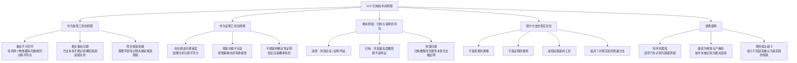

**相关笔记：** [[12.1 原因与结果|12.1 因果联系与密尔方法]] | [[12.4 因果分析的方法|12.4 密尔五法]] | [[11.1 归纳与演绎再探]] | [[13.1 科学说明|13.1 假说与科学方法]]

> [!abstract] 概览
> 本节系统审视了==密尔方法==（Mill's Methods）作为科学发现工具和证明工具的双重局限，揭示归纳推理在因果探究中的真实地位。核心知识点包括：
> - **密尔方法作为发现工具的局限**：不能确定"仅有一个事态相同"或"仅一个事态不同"——任何两个物体都有很多相同点和不同点
> - **相关事态问题**：密尔方法预设我们已知道哪些因素是"相关的"，但方法本身不能告诉我们这一点
> - **隐含假说依赖**：使用密尔方法前必须先确定哪些因素是"相关的"，这需要背景知识和假说
> - **塞麦尔维斯案例**：产褥热的真正原因（医生不洗手）在很长时间内未被识别，因为没人认为脏手是相关因素
> - **观察不完全**：即使观察精确也可能不完整、具有欺骗性
> - **密尔方法作为证明工具的局限**：由于依赖在先假说且不能考虑所有事态，不能提供确定性证明
> - **归纳vs演绎**：归纳技术的结论总是概率性的，不能达到演绎的确定性

---

## 一、知识结构总览

---

## 二、核心思想与论证结构

> [!tip] 核心思想
> 密尔过高评价了归纳方法的威力——他相信这些方法既是"发现因果关系的工具"，又是"证明因果联系的准则"。本节论证了这两点主张都不能成立：密尔方法==不是发现的通路==，也==不是证明的规则==。它们的真正力量在于==检验假说==，而假说的形成依赖于背景知识和科学洞察力。归纳推理的结论==充其量是高度概然的，绝不是笃证的==。

### 密尔方法作为发现工具的局限

#### 事态不可穷尽问题

密尔在阐述其方法时，假定人们可以确定"==仅有一个事态相同=="的场合或者"==除了一个事态外其余的每个事态都相同=="的其他场合。但这一假定从字面上看是无法成立的：

> [!def] 事态不可穷尽
> - **任何两个物体**无论它们看上去多么不同，均具有==许多相同的事态==
> - **没有两个事物**可以只在一个方面不同——一个事物离北方更远，一个事物离太阳更近，如此等等
> - 我们==不能检查所有可能的事态==，以确定它们是否只在一个方面存在差别

因此，科学家在应用这些技术时心中所想的不是"所有事态"，而是==相关事态==的集合——是否仅有一个共同的相关事态，还是除了一个其他所有相关事态都是共同的。

#### 相关事态问题

> [!def] 相关事态问题（The Problem of Relevant Circumstances）
> 哪些是相关事态呢？==仅用密尔方法本身我们不能知道哪些因素是相关的==。要使用这些方法，我们必须关注这些方法将要应用的语境，此时我们心中已经对因果因素做出了一些分析。

这意味着密尔方法==不能独立运作==——它必须依赖在先的因果假说，而假说的形成需要背景知识、科学洞察力和想象力。

> [!example] 科学的酒鬼（The Scientific Drunkard）
> 漫画《科学的酒鬼》生动地示例了这个困难：
> - 第一个晚上：喝的是==苏格兰威士忌==和==汽水== → 喝醉了
> - 第二个晚上：喝的是==波旁威士忌==和==汽水== → 喝醉了
> - 接下来的晚上：==白兰地酒==和==汽水== → 喝醉了
> - 然后：==朗姆酒==和==汽水== → 喝醉了
> - 再然后：==杜松子酒==和==汽水== → 喝醉了
>
> 他喝醉的原因是什么呢？一次又一次地喝醉之后，他发誓再也不碰==汽水==了！
>
> **分析：** 这个酒鬼确实在应用==求同法==的时候遵守了规则——他正确地识别出所有场合下的共同因素是"汽水"。但是他这么做是没用的，因为在那些先行事态中==真正相关的因素没有得到确定==，因而那些因素没有得到利用。假如==酒精==已经被确定为是所有场合下的共同因素之一，那就有可能非常迅速地将汽水排除出去——使用的是==求异法==。

> [!example] 黄热病与蚊子
> 我们之前讨论的、与==求异法==相关的寻找黄热病原因的研究，确证了以下结论：黄热病是由受感染的==蚊子的叮咬==而传播的。我们现在知道了那一点，正如我们现在知道使人醉的是酒精而非汽水。
>
> **但是**黄热病实验需要==洞察力和想象力==，也需要==勇气==；黄热病是由蚊子传播的这个观念起初被认为是==愚蠢的==，或者是==荒唐的==，或者==根本没有被想到过==。
>
> **关键教训：** 现实世界中的事态并没有贴上"有关的"或"无关的"标签。对把蚊子叮咬作为原因的检验需要一些==前期整理的可能相关因素==，然后归纳方法才可能应用于这些因素。当我们手边有了这样前期的分析之后，可以表明这些方法是十分有帮助的——但是如果背景知识中没有一些假说的话，这些方法本身作为科学发现的工具==并不充分==。

### 密尔方法作为证明工具的局限

#### 隐含假说依赖

> [!def] 隐含假说依赖
> 由于我们着手应用这些方法总是根据一些关于因果因素的==在先假说==，并且由于我们==不能考虑所有的事态==，所以我们的注意力将限定在那些被认为是正在考虑的、可能的原因上。但是关于应该研究哪些事态这个判断==可能被证明是错误的==。

> [!example] 塞麦尔维斯与产褥热（Semmelweis and Childbed Fever）
> 在很长一段时间里，医学家甚至没有把==脏手==看作传染的可能媒介，因而不可能将脏手确定为疾病的原因。内科医生没有洗手（因为他们不明白传染病是如何传播的）导致了==数世纪以来的无数苦难和无数死亡==，尤其是产褥热带来的后果。
>
> - 产褥热细菌携带在医生的手上，由一个母亲传染到另一个母亲
> - 直到19世纪中叶，匈牙利内科医生==伊戈奈克·塞麦尔维斯==（Ignaz Semmelweis）给出了那个灾难性因果联系的证明
> - 当研究者没能将在他们面前的事态分解成恰当的元素——这些元素==不能提前被知晓==——的时候，研究就会陷入困境
>
> 由于应用这些方法所预设的分析可能是错误的或不充分的，基于这些分析的推论可能同样是错误的。归纳的这种对==隐含假说的依赖==，表明归纳技术本身不能如密尔所希望的那样提供因果证明。

#### 观察不完全问题

> [!def] 观察不完全
> 归纳方法的应用总是依赖于==观察到的相关性==，并且即使观察已经十分精确，这样的观察也可能是不完全的，因而==具有欺骗性==。观察的数量越大，我们观察到的关联是真正因果律的明示的可能性就越大——但是无论那个数量有多大，我们==不能从那些已观察到的事例中确定地推出因果联系==。

### 归纳与演绎的根本鸿沟

> [!def] 归纳vs演绎：确定性之差
> 这些局限再一次说明了==归纳和演绎之间存在的鸿沟==：
> - 一个有效的==演绎推理==构成一个==证明==，或==笃证==（demonstration）
> - 每一个==归纳推理==充其量是==高度概然的==（highly probable），==绝不是==笃证的
>
> 因此，密尔关于他的准则是"==证明的方法=="的断言，以及它们是"==全部发现的方法=="的断言，==都必须被拒绝==。

### 密尔方法的真实定位

> [!success] 密尔方法的真正力量
> 尽管密尔方法不能起到密尔所声称的全部作用，但它们在科学中仍然处于中心地位并且十分有力：
>
> 1. **本质上是排除性方法**：归纳五法所能让我们确定的是——如果对先行事态的某个特定分析是正确的，那么这些因素中的一个因素不可能是（或必定是）被研究现象的原因（或部分原因）
> 2. **演绎的有效性**：这可能是演绎出来的，并且这个演绎可能是有效的，但是那个论证的==可靠性==（soundness）总是取决于==假定的先行分析的正确性==
> 3. **检验假说的工具**：归纳方法是极好的，但是仅当它们试图证实（或证伪）的假说确实正确地识别出因果相关事态的时候，这些方法才能产生可靠的结果
> 4. **对照实验的逻辑基础**：这些归纳技术的主张合起来描述了==对照实验==（controlled experiment）的普遍方法，这是在所有现代科学中的一个普遍的和不可缺少的工具

> [!quote] 核心结论
> "它们不是发现的通路，也不是证明的规则。它们是==检验假说的工具==。"

---

## 三、补充理解与易混淆点

### 补充理解

> [!info] 补充1：密尔方法预设的两个关键假定
> **来源：** University of Hong Kong, Philosophy Department. (2023). *Mill's Methods*. https://philosophy.hku.hk/think/sci/mill.php
>
> 密尔方法的运作依赖两个关键预设，而这两个预设恰恰是方法本身无法满足的：
>
> **预设1：候选原因列表已知**
> - 密尔方法==预设我们已有一个候选原因列表==可供考虑
> - 但方法本身==不告诉我们如何得出这样的列表==
> - 在现实中，这依赖于我们的知识或对可能原因的==有根据的猜测==
> - 例如：在黄热病案例中，"蚊子叮咬"必须首先被列入候选原因列表，然后密尔方法才能发挥作用
>
> **预设2：唯一原因假定**
> - 密尔方法还预设：在所考虑的因素中，==只有一个因素是结果的唯一原因==
> - 但这一假定==并不总是成立==——一个结果可能有多个独立的原因（==原因多元性==问题）
> - 有时原因之间还会相互影响（==效果混合==问题），使得情况更加复杂
>
> **实践意义：** 这两个预设意味着密尔方法==不能独立运作==——它们需要与科学直觉、背景理论和创造性假说形成配合。

> [!info] 补充2：密尔方法与对照实验——从归纳准则到科学工具
> **来源：** Stanford Encyclopedia of Philosophy. (2014). *Experiment in Biology*. https://plato.stanford.edu/archives/spr2014/entries/biology-experiment/
>
> 密尔方法虽然不能作为独立的发现工具或证明工具，但它们描述了==现代对照实验==的逻辑结构：
>
> **密尔方法→对照实验的对应关系：**
>
> | 密尔方法 | 对照实验设计 | 核心逻辑 |
> |:---------|:------------|:---------|
> | 求同法 | 多案例比较研究 | 在不同条件下寻找共同因素 |
> | 求异法 | 随机对照试验（RCT） | 控制组与实验组的唯一差异 |
> | 求同求异并用法 | 多组对照设计 | 结合求同和求异的逻辑 |
> | 共变法 | 剂量-反应研究 | 系统变化一个因素观察效应变化 |
> | 剩余法 | 多因素回归分析 | 控制已知因素后考察剩余效应 |
>
> **关键洞察：** 因果推理方法"可能也有局限，它们通常被限制在唯一目标是建立因果相关性关系的情境中"（Stanford Encyclopedia of Philosophy）。这意味着密尔方法的价值在于==检验已提出的因果假说==，而非==从零开始发现因果关系==。

> [!info] 补充3：休谟问题与归纳的哲学困境
> **来源：** Stanford Encyclopedia of Philosophy. (2025). *The Problem of Induction*. https://plato.stanford.edu/archives/sum2025/entries/induction-problem/
>
> 本节所讨论的归纳技术的局限，其哲学根源可以追溯到==休谟问题==（The Problem of Induction）：
>
> **休谟的核心论证：**
> - 归纳推理依赖于"==未来将符合过去=="这一假定（自然齐一性原理）
> - 但这一假定本身只能通过归纳来证明——这构成了==循环论证==
> - 因此，归纳推理的合理性==无法被演绎地证明==，也无法被非循环地归纳证明
>
> **与本节的关联：**
> - 密尔方法作为"证明的准则"的失败，正是休谟问题的一个具体体现
> - 即使密尔方法被完美地应用，其结论仍然==不能达到演绎的确定性==
> - 这不是密尔方法本身的缺陷，而是==所有归纳推理的本性==——归纳推理"充其量是高度概然的，绝不是笃证的"
>
> **科学回应：** 现代科学哲学通过==假说-演绎法==（Hypothetico-Deductive Method）来应对这一困境：科学家提出假说，从中演绎出可检验的预测，然后通过实验检验。密尔方法在这一框架中扮演的是==检验工具==的角色，而非证明工具。

> [!info] 补充4：塞麦尔维斯案例的深层逻辑分析
> **来源：** Scholl, R. (2013). *Causal inference, mechanisms, and the Semmelweis case*. Philosophy of Science, 80(5). https://philsci-archive.pitt.edu/9556/1/scholl-shps-2013.pdf
>
> 塞麦尔维斯案例不仅仅是一个历史故事，它揭示了归纳推理的深层逻辑结构：
>
> **案例时间线：**
> 1. 19世纪中叶，维也纳总医院第一产科（由医学生和医生接生）的产褥热死亡率高达==10%以上==
> 2. 第二产科（由助产士接生）的死亡率仅为==2-3%==
> 3. 塞麦尔维斯系统排除了"拥挤程度"、"饮食"、"通风"等各种假说
> 4. 关键转折：他的同事科莱奇卡（Kolletschka）在尸检时被手术刀割伤后死于类似症状
> 5. 塞麦尔维斯推断：==尸体上的"尸体颗粒"通过医生的手传播==给产妇
> 6. 实施漂白水洗手后，死亡率骤降至==1%以下==
>
> **逻辑教训：**
> - 在塞麦尔维斯之前，没有人将"脏手"列为==候选原因==——密尔方法无法帮助识别这个因素
> - 塞麦尔维斯的成功依赖于==创造性洞察==（从同事的死亡中类比推断），而非机械地应用密尔方法
> - 即使在证明阶段，他的发现也遭到了当时医学界的==强烈抵制==——因为"医生的手可能携带疾病"这一假说与当时的医学教条相矛盾
>
> **现代回响：** 这一案例在当代科学哲学中被反复讨论，因为它完美地展示了"==假说形成需要科学洞察力，而不仅仅是方法论的机械应用=="这一核心论点。

### 易混淆点

> [!warning] 误区：密尔方法是独立的科学发现工具
> ❌ **错误理解：** 只要严格按照密尔方法的规则操作，就能从观察数据中自动发现因果关系。密尔方法是"全部发现的方法"。
>
> ✅ **正确理解：** 密尔方法==不能独立运作==。它们需要：
> - 一个==预先确定的候选原因列表==
> - 关于哪些因素是"相关的"的==在先判断==
> - 足够的==背景知识==和==科学假说==
>
> **辨析：**
> - 密尔方法本质上是==排除性方法==——它们帮助我们从候选列表中排除或确认因素
> - 但==候选列表本身从何而来？== 这需要科学直觉、类比推理、理论推测等非密尔方法的能力
> - 在"科学的酒鬼"案例中，酒鬼正确应用了求同法，但候选列表中缺少了"酒精"这一关键因素
> - 在塞麦尔维斯案例中，"脏手"根本不在当时的候选原因列表中
>
> | 特征 | 密尔的宣称 | 实际情况 |
> |:-----|:----------|:---------|
> | 发现因果关系 | 是"全部发现的方法" | 需要在先假说和背景知识 |
> | 证明因果联系 | 是"证明的方法" | 结论是概率性的，非确定性 |
> | 独立运作 | 可以独立使用 | 必须依赖预设的候选原因列表 |

> [!warning] 误区：归纳推理可以提供与演绎推理同等的确定性
> ❌ **错误理解：** 当归纳推理的样本量足够大、观察足够精确时，归纳结论可以达到与演绎结论同等的确定性。
>
> ✅ **正确理解：** ==无论观察数量多大、观察多么精确==，归纳推理的结论==永远不能达到演绎的确定性==。这是归纳推理的本性所决定的。
>
> **辨析：**
> - **演绎推理**：前提为真 → 结论==必定==为真（确定性保证）
> - **归纳推理**：前提为真 → 结论==可能==为真（概率性保证）
> - 观察数量越大，归纳结论的==概率越高==，但永远不会达到100%的确定性
> - 这不是归纳方法的"缺陷"，而是==归纳与演绎之间存在不可逾越的鸿沟==
> - 密尔称其方法为"证明的方法"（Methods of Proof），这一断言==必须被拒绝==
>
> **与休谟问题的关联：** 这一鸿沟的哲学根源就是==休谟问题==——归纳推理的合理性本身无法被非循环地证明。无论我们收集多少正面事例，"太阳明天会升起"这一命题都不能被确定性地证明。

> [!warning] 误区：对照实验可以完全克服归纳的局限
> ❌ **错误理解：** 现代科学使用的随机对照试验（RCT）等严格实验设计已经克服了密尔方法的局限，可以提供确定性的因果证明。
>
> ✅ **正确理解：** 对照实验确实大大提高了归纳推理的可靠性，但它==仍然不能提供确定性证明==。对照实验是密尔方法的==精细化应用==，而非对归纳局限的根本克服。
>
> **辨析：**
> - 对照实验的逻辑基础仍然是==密尔的求异法==——控制组与实验组的唯一差异
> - 对照实验仍然需要==预先确定候选因素==——实验设计者必须决定控制哪些变量
> - 对照实验仍然面临==观察不完全==的问题——实验结果可能受到未控制的混杂因素影响
> - 对照实验的结论仍然是==概率性的==——统计显著性不等于确定性证明
> - 对照实验的优势在于==系统化和标准化==，而非克服了归纳的根本局限

---

## 四、习题精选

> [!todo] 习题概览
> | 题号 | 核心考点 | 难度 |
> |:-----|:---------|:-----|
> | 1 | 识别归纳推理中的隐含假说 | ⭐⭐ |
> | 2 | 分析密尔方法的应用局限 | ⭐⭐⭐ |

### 题1：识别归纳推理中的隐含假说

> [!problem] 题目
> 一位研究者发现，在经常食用橄榄油的地中海国家，心脏病发病率较低。据此，他得出结论：橄榄油能预防心脏病。请分析这一推理中可能存在的隐含假说，以及密尔方法在此应用中的局限。

> [!faq]- 解答
> **使用的密尔方法：** ==求同法==——在地中海国家（心脏病发病率低）中寻找共同因素（橄榄油）。
>
> **隐含假说分析：**
> 1. **候选原因列表的预设：** 研究者假定橄榄油的食用量是"相关事态"，但可能忽略了其他共同因素：
>    - 地中海饮食中的其他成分（鱼类、蔬果、红酒）
>    - 气候因素（阳光充足→维生素D）
>    - 生活方式因素（更多的户外活动、更慢的生活节奏）
>    - 社会文化因素（更强的家庭和社区联系）
> 2. **唯一原因假定：** 研究者假定橄榄油是心脏病发病率低的==唯一==或==主要==原因，但实际可能是多因素共同作用
> 3. **方向性假定：** 研究者假定"橄榄油→低心脏病发病率"的因果方向，但可能存在反向因果或第三因素
>
> **密尔方法的局限：**
> - 求同法只能识别==共同因素==，但不能确定该因素是否==因果相关==
> - 研究者没有使用==求异法==来排除其他因素——需要一个不吃橄榄油但其他条件相似的对照组
> - ==观察不完全==——仅观察了地中海国家，样本可能不具有代表性
>
> $\blacksquare$

### 题2：分析密尔方法的应用局限

> [!problem] 题目
> 在塞麦尔维斯发现产褥热原因之前，医学界提出了多种假说来解释产褥热的高死亡率，包括"瘴气理论"（认为空气中的有害物质是原因）。请运用本节所学的知识，分析为什么密尔方法不能帮助当时的医学界发现产褥热的真正原因。

> [!faq]- 解答
> **密尔方法失败的原因分析：**
>
> **1. 候选原因列表不完整（相关事态问题）：**
> - 当时的医学界将"瘴气"、"拥挤"、"饮食"等列入候选原因
> - 但==脏手==根本不在候选原因列表中——没有人认为医生的手可能是疾病的传播媒介
> - 密尔方法只能在==已有的候选列表==中操作，无法帮助识别==缺失的候选因素==
>
> **2. 在先假说的误导（隐含假说依赖）：**
> - 当时的医学教条认为疾病通过"瘴气"传播
> - 这一==在先假说==将研究者的注意力引向了错误的方向
> - 塞麦尔维斯的成功恰恰在于他==突破了当时的在先假说==，提出了一个全新的候选因素
>
> **3. 求异法的应用受限于分析框架：**
> - 第一产科和第二产科的死亡率差异确实可以用求异法来分析
> - 但研究者将注意力集中在"空气"、"拥挤"等他们认为相关的因素上
> - 真正的差异——==医生进行尸检后不洗手直接接生==——被忽略了
>
> **4. 观察不完全问题：**
> - 即使观察精确（死亡率数据是准确的），但==观察的框架不完整==
> - 研究者观察了他们==认为重要==的事态，而忽略了真正关键的事态
>
> **结论：** 塞麦尔维斯的发现需要==创造性洞察==（从同事科莱奇卡的死亡中类比推断），而非机械地应用密尔方法。这一案例完美地展示了密尔方法作为"发现工具"的局限性。
>
> $\blacksquare$

> [!tip] 解题思路提示
> 分析密尔方法局限的通用框架：
> 1. **检查候选原因列表**——是否遗漏了可能的关键因素？
> 2. **识别隐含假说**——研究者预设了哪些"显而易见"但实际上可能有问题的假定？
> 3. **评估唯一原因假定**——结果是否可能有多个原因？
> 4. **考虑观察不完全**——是否有未控制的混杂变量？
> 5. **区分发现与证明**——密尔方法在此是用于发现因果关系还是检验已有假说？

---

## 五、视频学习指南

> [!info] 视频资源
> | 资源 | 链接 | 对应内容 | 备注 |
> |:-----|:-----|:---------|:-----|
> | Wireless Philosophy: Mill's Methods | [链接](https://www.youtube.com/watch?v=V2F7qS1b4Yg) | 密尔五法概述 | 英文，简明讲解 |
> | Crash Course Philosophy: Inductive Reasoning | [链接](https://www.youtube.com/watch?v=GEAbB0FJNCQ) | 归纳推理与局限 | 英文，适合入门 |
> | Semmelweis Documentary | [链接](https://www.youtube.com/watch?v=sJwITiZ7dJk) | 塞麦尔维斯案例 | 英文，历史纪录片 |

---

## 六、教材原文

> [!quote] 教材原文
> **来源：** 逻辑学导论 第15版，第12章第5节
>
> **密尔方法作为发现工具的局限：**
> 一个实质性困难源于以下事实：在密尔对这些方法的阐述中，他假定人们可以确定"仅有一个事态相同的"场合或者"除了一个事态外其余的每个事态都相同"的其他场合。但是不能从字面上理解这些表述：任何两个物体无论它们看上去多么不同，它们均具有许多相同的事态；没有两个事物可以只在一个方面不同——一个事物离北方更远，一个事物离太阳更近，如此等等。我们甚至也不能检查所有可能的事态，以确定它们是否只在一个方面存在差别。科学家在应用这些技术时心中所想的不是所有事态，而是相关事态的集合。
>
> **相关事态问题：**
> 哪些是相关事态呢？仅用这些方法我们不能知道哪些因素是相关的。要使用这些方法，我们必须关注这些方法将要应用的语境，此时我们心中已经对因果因素做出了一些分析。
>
> **隐含假说依赖与塞麦尔维斯案例：**
> 由于我们着手应用这些方法总是根据一些关于因果因素的在先假说，正如上面已经提到的，并且由于我们不能考虑所有的事态，所以我们的注意力将限定在那些被认为是正在考虑的、可能的原因上。但是关于应该研究哪些事态这个判断可能被证明是错误的。在很长一段时间里，医学家甚至没有把脏手看作传染的可能媒介，因而不可能将脏手确定为疾病的原因。
>
> **归纳与演绎的鸿沟：**
> 一个有效的演绎推理构成一个证明，或笃证；但是每一个归纳推理充其量是高度概然的，绝不是笃证的。因而，密尔关于他的准则是"证明的方法"的断言，以及它们是"全部发现的方法"的断言，都必须被拒绝。
>
> **密尔方法的真正力量：**
> 它们不是发现的通路，也不是证明的规则。它们是检验假说的工具。这些归纳技术的主张合起来描述了对照实验的普遍方法，这是在所有现代科学中的一个普遍的和不可缺少的工具。

---

## 参见 Wiki

- [[因果联系]] -- 因果关系的概念分析，密尔方法的理论基础
- [[归纳逻辑]] -- 归纳推理的一般理论，密尔方法属于归纳逻辑的核心内容
- [[休谟问题]] -- 归纳推理合理性的哲学挑战，本节局限的深层根源
- [[类比推理]] -- 形成因果假说的重要方法，弥补密尔方法在"发现"阶段的不足
- [[12.1 原因与结果|12.1 因果联系与密尔方法]] -- 密尔五法的基本原理
- [[12.4 因果分析的方法|12.4 密尔五法]] -- 求同法、求异法等方法的具体阐述
- [[11.1 归纳与演绎再探]] -- 归纳与演绎的根本区别，本节论证的哲学基础
- [[13.1 科学说明|13.1 假说与科学方法]] -- 假说-演绎法，密尔方法在科学方法中的定位

#学习/逻辑学/因果推理
