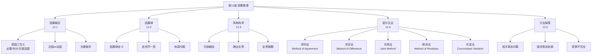

**相关笔记：** [[11.4 通过逻辑类推进行的反驳]] | [[13.1 科学说明|13.1 假说与科学方法]]

> [!abstract] 概览
> 第12章是归纳逻辑的核心章节，系统阐述了因果推理的理论基础与方法论工具。全章从原因与结果的基本概念出发（[[12.1 原因与结果]]），阐述因果律与自然齐一性原理（[[12.2 因果律与自然齐一性]]），介绍简单枚举归纳法（[[12.3 简单枚举归纳法]]），重点讲解==密尔五法==（[[12.4 因果分析的方法]]），最后反思归纳技术的局限（[[12.5 归纳技术的局限]]）。密尔五法（求同法、求异法、求同求异并用法、剩余法、共变法）是全章的核心内容，也是科学因果分析的基本工具。

---

## 一、全章知识框架

## 二、各节核心要点

### 12.1 原因与结果

**原因的三种含义**：

| 含义 | 定义 | 示例 |
|:-----|:-----|:-----|
| ==必要条件== | 无A则无B（$\sim A \supset \sim B$） | 氧气是燃烧的必要条件 |
| ==充分条件== | 有A则有B（$A \supset B$） | 被蚊子叮咬是黄热病的充分条件 |
| ==关键因素（INUS）== | A是B发生的充分条件组中不可少的组成部分 | 酒精是醉酒的关键因素 |

> [!tip] 充要条件
> 当A既是B的必要条件又是充分条件时，A是B的==充要条件==（$A \equiv B$）。

### 12.2 因果律与自然齐一性

- **因果律**：如此事态恒常伴随如此现象（全称命题形式）
- **自然齐一性**：类似原因产生类似结果——归纳推理的哲学基础
- **休谟问题**：因果律本身无法被演绎或归纳证明，只能诉诸心理习惯

### 12.3 简单枚举归纳法

**标准形式**：
$$\text{实例}_1 \text{ 是 } S \text{ 且是 } P$$
$$\text{实例}_2 \text{ 是 } S \text{ 且是 } P$$
$$\vdots$$
$$\text{实例}_n \text{ 是 } S \text{ 且是 } P$$
$$\therefore \text{ 所有 } S \text{ 都是 } P$$

> [!warning] 培根的批评
> 简单枚举法是==幼稚的、不牢靠的==，面临"黑天鹅"式反例推翻的危险。科学归纳法（密尔五法）通过因果分析提供了更可靠的推理基础。

### 12.4 密尔五法（==全章核心==）

| 方法 | 核心思想 | 形式模式 | 优势 | 局限 |
|:-----|:---------|:---------|:-----|:-----|
| ==求同法== | 共同因素即原因 | $ABCD \to w, AEFG \to w \therefore A \to w$ | 缩小候选范围 | 多个共同因素时失效 |
| ==求异法== | 唯一差异即原因 | $ABCD \to w, BCD \to \sim w \therefore A \to w$ | 最强方法，接近实验 | 需两例仅一因素不同 |
| ==并用法== | 求同+求异结合 | 两组案例对比 | 比单一方法更可靠 | 仍依赖在先假说 |
| ==剩余法== | 排除已知原因 | $ABC \to abc, A \to a, B \to b \therefore C \to c$ | 已知大部分原因时有效 | 需先确定其他因果 |
| ==共变法== | 变化相关即因果 | $A_1 \to a_1, A_2 \to a_2 \therefore A \leftrightarrow a$ | 可量化因果强度 | 相关≠因果 |

### 12.5 归纳技术的局限

- **"科学的酒鬼"问题**：错误识别相关事态（汽水→醉酒，实际是酒精）
- **塞麦尔维斯案例**：脏手是产褥热的原因，但长期未被识别为"相关因素"
- **核心局限**：密尔方法依赖在先假说来确定哪些因素是"相关的"，不能独立发现因果联系

## 三、跨章节关联

| 关联方向 | 关联内容 |
|:---------|:---------|
| ←第11章 | [[类比推理]]的评价标准中"相关性"依赖因果联系 |
| ←第11章 | [[休谟问题]]是因果律合理性的哲学基础 |
| →第13章 | 密尔五法为科学假说的检验提供方法论工具 |
| →第14章 | 概率理论为归纳强度提供量化基础 |

## 四、待创建Wiki概念页

- 密尔五法（核心概念，Ch12独有）
- 必要条件与充分条件（跨章节概念）
- 自然齐一性（哲学概念）

---

> [!quote] 章节总结
> 密尔五法是因果分析的基本工具，其中求异法最为强大。但所有归纳技术都依赖在先假说来确定相关事态，因此不能独立发现因果联系。密尔五法的真正价值在于==检验假说==而非发现假说。
