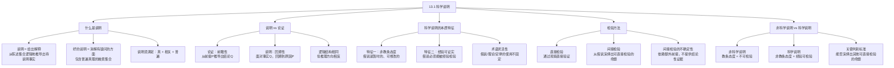

**相关笔记：** [[13.2 科学探究：假说与确证]] | [[因果联系]] | [[归纳逻辑]] | [[演绎论证]] | [[归纳论证]]

> [!abstract] 概览
> 本节探讨科学说明的本质及其与非科学说明的根本区别。核心知识点包括：
> - **说明与论证的区别**：说明是==回溯性==的（从已知事实追溯到原因），论证是==前瞻性==的（从前提推导出结论）
> - **科学说明的两个本质特征**：(1)==非教条态度==——假说都是暂时的、可修改的；(2)==经验可证实==——假说必须能够被经验检验
> - **间接检验**：从假说演绎出可直接检验的命题，通过检验后者来间接检验前者
> - **可证伪性**：一个科学假说==不能被彻底证实==，但==可以被彻底证伪==
> - **"假说""理论""定律"的术语使用**：这些术语的使用不是一成不变的，真正的科学家始终保持非教条态度
> - **非科学说明与科学说明的区别**：教条态度 vs. 非教条态度；不可检验 vs. 经验可检验

---

## 一、知识结构总览

---

## 二、核心思想

> [!tip] 核心思想
> 科学说明的本质是从一组==普遍真理==（理论/假说）中==逻辑地推导==出待说明的事实。科学说明区别于非科学说明的两个根本特征是：==非教条态度==（假说始终是暂时的、可修改的）和==经验可证实性==（假说必须能够被经验检验）。此外，科学假说具有==可证伪性==——我们永远不能彻底证实一个假说，但可以彻底证伪它。

### 说明与论证的区别

> [!def] 说明（Explanation）与论证（Argument）
> **说明**和**论证**具有相同的逻辑结构（都涉及从一组陈述推导出另一组陈述），但==推理方向相反==：
>
> - **论证**是==前瞻性==的：从前提 $P$ 推导出结论 $Q$，即"由 $P$ 得 $Q$"
> - **说明**是==回溯性==的：面对已知事实 $Q$，追溯导致它的原因 $P$，即"由 $P$ 说明 $Q$"
>
> **示例：**
> - 论证："如果胰岛素缺乏，那么血液中糖分过多。此人胰岛素缺乏。因此，此人血液中糖分过多。"
> - 说明："此人血液中糖分过多（已知事实 $Q$）。这是因为此人胰岛素缺乏（原因 $P$）。胰岛素缺乏说明了糖尿病。"

### 科学说明的两个本质特征

> [!def] 科学说明的本质特征
> 科学说明区别于非科学说明的两个根本特征：
>
> **特征一：非教条态度**
> - 科学中的假说始终是==暂时的==，在证据面前可以被修改甚至拒斥
> - 非科学的说明被==教条地==提出，其解释被认为是绝对真的而不能改进
> - 示例：中世纪学者拒绝用伽利略的望远镜观测木星卫星，因为亚里士多德著作中未提及
>
> **特征二：经验可证实**
> - 科学假说必须能够被经验检验——能够从中演绎出可直接检验的命题
> - 非科学信念的坚持不依赖证据，可能基于"每个人都知道"或"上天启示"
> - 真正的科学是==经验的==（empirical）

> [!example] 示例：牛顿万有引力定律
> 牛顿的万有引力定律："宇宙中每个质点以一个力吸引另外一个质点。该力正比于质点质量的乘积，反比于它们间距离的平方。"
>
> 这一定律是科学说明的典范：
> - 它是==普遍的==（适用于宇宙中所有质点）
> - 它是==可检验的==（可以从中推导出关于行星运动、潮汐等现象的预测）
> - 它是==非教条的==（后来被爱因斯坦的广义相对论改进和超越）
>
> 注意：牛顿的发现被称为"定律"，爱因斯坦的改进被称为"理论"——术语的使用不是一成不变的。

### 间接检验与可证伪性

> [!def] 间接检验（Indirect Test）
> ==间接检验==是从待检验的假说（普遍性命题）==演绎==出其他能够被直接检验的命题，然后通过检验后者来间接检验前者。
>
> **逻辑结构：**
> - 假说 $H$ + 额外前提 $A$ $\vdash$ 可直接检验的命题 $O$
> - 如果 $O$ 为假，则 $H$ 非常可能是假的（==证伪==）
> - 如果 $O$ 为真，则 $H$ 得到间接确证，但不是结论性证据
>
> **示例：** 如果我对上班迟到的解释是交通事故（假说 $H$），老板可以借助于警察的事故报告（可直接检验的命题 $O$）来间接检验我的解释。

> [!def] 可证伪性（Falsifiability）
> ==可证伪性==是指一个科学假说==不能被彻底证实==，但==可以被彻底证伪==：
>
> - **证实方面**：支持性证据永远不可能是完全的——我们永远不可能收集到所有证据，因此确定性是无法达到的
> - **证伪方面**：如果证据无可争议地表明基于假说的预言是假的，我们就有完全的信心拒斥该假说
>
> 这一观点与卡尔·波普尔（Karl Popper）的==证伪主义==（falsificationism）密切相关：科学假说的本质特征不在于可证实性，而在于==可证伪性==——它必须"冒着被反驳的风险"做出预测。

### 术语的使用

> [!info] "假说""理论""定律"的术语灵活性
> 在科学中，"假说""理论""定律"这三个术语的使用==不是一成不变的==：
> - 牛顿的发现今天仍被称为"引力==定律=="
> - 爱因斯坦改进并超越牛顿的发现，但被称为"相对==论=="
> - 在日常话语中，"理论"常指一种预感或看法，但科学家对这个词的用法不同
> - "量子理论""细胞理论""疾病的细菌理论"都是得到确认的事实
> - "进化论"同样是既定事实——因它"只是一种理论"而质疑进化，是语义误解的结果
>
> **核心原则：** 无论使用什么术语，真正的科学家的态度不是教条的。科学中所有普遍命题在本质上都是==假说==，永远不具有绝对的确定性。

---

## 三、补充理解与易混淆点

### 补充理解

> [!info] 补充1：演绎律则模型（D-N模型）——科学说明的经典分析框架
> **来源：** Stanford Encyclopedia of Philosophy. (2024). *Scientific Explanation*. https://plato.stanford.edu/archives/fall2024/entries/scientific-explanation/
>
> 亨普尔（Carl Hempel）和奥本海姆（Paul Oppenheim）于1948年提出的==演绎律则模型==（Deductive-Nomological Model，简称D-N模型）是分析科学说明的经典框架。该模型将科学说明的结构形式化为：
>
> **说明项（Explanans）** → 演绎推导 → **被说明项（Explanandum）**
>
> 其中说明项必须满足以下条件：
> 1. **演绎条件**：被说明项必须是说明项的逻辑演绎结果
> 2. **律则条件**：说明项中必须至少包含一个==自然定律==（law of nature）
> 3. **经验内容条件**：说明项必须具有经验内容，能够被检验
> 4. **真理条件**：说明项中的所有陈述必须为真
>
> **与Copi教材的对应关系：**
> - Copi所说的"从一组陈述中逻辑地推导出待说明事实"对应D-N模型的==演绎条件==
> - Copi所说的"说明须包含普遍真理"对应D-N模型的==律则条件==
> - Copi所说的"经验可证实"对应D-N模型的==经验内容条件==
>
> D-N模型虽然面临诸多批评（如对称性问题、因果方向问题），但它为理解科学说明的逻辑结构提供了一个清晰的形式化起点。

> [!info] 补充2：波普尔证伪主义——可证伪性作为科学与非科学的划界标准
> **来源：** Stanford Encyclopedia of Philosophy. (2024). *Karl Popper*. https://plato.stanford.edu/archives/fall2024/entries/popper/
>
> 卡尔·波普尔（Karl Popper）的==证伪主义==（Falsificationism）为Copi教材中"可证伪性"的讨论提供了更深入的哲学背景。波普尔的核心论点是：
>
> **科学与非科学的划界标准不是可证实性，而是可证伪性。**
>
> - 一个理论如果是==科学的==，它必须做出==大胆的、精确的预测==，这些预测在原则上可以被经验观察所反驳
> - 一个理论如果==兼容于所有可能的观察==（如某些精神分析理论），它就是==非科学的==
> - 科学理论永远不能被"证实"为真，只能被暂时"==确证=="（corroboration）——即迄今为止经受住了检验
> - 当一个理论的预测被经验观察反驳时，该理论就被==证伪==（falsified），必须被修改或拒斥
>
> **与Copi教材的对应：**
> - Copi说"我们不能彻底证实一个假说，但可以彻底证伪一个假说"——这正是波普尔证伪主义的核心主张
> - Copi说"科学假说至少在原则上是可错的"——对应波普尔的"可证伪性"概念
> - 波普尔进一步指出：科学进步的本质是"==猜想与反驳=="（conjectures and refutations）——提出大胆假说，然后严格检验

### 易混淆点

> [!warning] 误区：说明和论证是同一种推理
> ❌ **错误理解：** 说明和论证没有本质区别，都是"从一组陈述推导出另一组陈述"，因此可以等同看待。
>
> ✅ **正确理解：** 说明和论证虽然具有==相同的逻辑结构==，但==推理方向完全相反==：
>
> | 特征 | 论证 | 说明 |
> |:-----|:-----|:-----|
> | **推理方向** | 前瞻性（forward） | 回溯性（backward） |
> | **出发点** | 前提 $P$（已知为真） | 事实 $Q$（已知为真） |
> | **目标** | 推导出结论 $Q$ | 追溯到原因 $P$ |
> | **时间指向** | 从已知预测未知 | 从已知解释已知 |
> | **逻辑形式** | $P \vdash Q$ | $P$ 说明 $Q$ |
>
> **辨析：**
> - 在论证中，我们问："如果 $P$ 为真，$Q$ 是否必然为真？"
> - 在说明中，我们问："$Q$ 为真，是什么导致了 $Q$？"
> - 论证关注的是==逻辑有效性==（validity），说明关注的是==解释的充分性==（explanatory adequacy）
> - 一个好的说明不仅需要逻辑推导正确，还需要说明项是==真的、相关的、普遍的==

> [!warning] 误区：科学说明就是"得到证实的假说"
> ❌ **错误理解：** 一个假说一旦被"证实"了，就不再是假说而变成了"真理"，科学说明就是用这些已证实的真理来解释事实。
>
> ✅ **正确理解：** 在科学中，==所有普遍命题在本质上都是假说==，永远不具有绝对的确定性。科学说明使用的是"得到高度确证的假说"，而非"绝对真理"。
>
> **辨析：**
> - Copi明确指出："科学中所有普遍命题在本质上都是假说，永远不具有绝对的确定性"
> - 即使支持性证据非常强，仍会保留一些疑问——我们永远不可能收集到所有证据
> - 牛顿的"定律"被爱因斯坦的"理论"超越——曾经被认为"绝对正确"的理论也可能被修改
> - ==科学说明的力量不在于确定性，而在于可检验性和可修改性==
> - "假说""理论""定律"的术语差异反映的是历史习惯和接受程度，而非真理性等级

---

## 四、习题精选

> [!todo] 习题概览
> | 题号 | 核心考点 | 难度 |
> |:-----|:---------|:-----|
> | 1 | 区分说明与论证 | ⭐⭐ |
> | 2 | 判断科学说明与非科学说明 | ⭐⭐⭐ |

### 题1：区分说明与论证

> [!problem] 题目
> 以下两个推理在逻辑结构上相同，但一个是论证，一个是说明。请指出哪个是论证、哪个是说明，并说明理由。
>
> **推理A：** "如果某地区饮用水被污染，那么该地区居民患肠胃疾病的比例会上升。某地区饮用水被污染了。因此，该地区居民患肠胃疾病的比例会上升。"
>
> **推理B：** "某地区居民患肠胃疾病的比例上升了。这是因为该地区饮用水被污染了——如果饮用水被污染，那么居民患肠胃疾病的比例会上升，而该地区饮用水确实被污染了。"

> [!faq]- 解答
> **推理A是论证，推理B是说明。**
>
> **推理A（论证）：**
> - 推理方向：==前瞻性==——从前提（饮用水被污染）推导出结论（肠胃疾病比例上升）
> - 出发点：前提 $P$（已知条件）
> - 目标：证明结论 $Q$ 的真实性
> - 我们不知道肠胃疾病比例是否真的上升了，但我们通过逻辑推导预测它会上升
>
> **推理B（说明）：**
> - 推理方向：==回溯性==——从已知事实（肠胃疾病比例上升）追溯到原因（饮用水被污染）
> - 出发点：事实 $Q$（已经观察到的事实）
> - 目标：解释为什么 $Q$ 会发生
> - 我们已经知道肠胃疾病比例上升了，我们试图找出导致这一现象的原因
>
> **关键区别：** 两者使用的前提相同、逻辑结构相同，但==推理方向相反==。在论证中，$Q$ 是待证明的未知结论；在说明中，$Q$ 是已知事实，$P$ 是待寻找的原因。
>
> $\blacksquare$

### 题2：判断科学说明与非科学说明

> [!problem] 题目
> 以下两个说明性陈述，请判断哪个是科学说明、哪个是非科学说明，并运用本节所学的两个判别标准进行分析。
>
> **说明X：** "行星沿规则轨道运动，是因为行星上居住着'智慧生物'，它们推动行星沿轨道运行。"
>
> **说明Y：** "行星沿规则轨道运动，是因为万有引力定律的作用——每个天体都受到其他天体的引力吸引，引力的大小与质量成正比、与距离的平方成反比。"

> [!faq]- 解答
> **说明X是非科学说明，说明Y是科学说明。**
>
> **按两个判别标准分析：**
>
> | 判别标准 | 说明X（非科学） | 说明Y（科学） |
> |:---------|:----------------|:--------------|
> | **非教条态度** | 教条地提出，不接受修改 | 非教条的，可被修改（如广义相对论改进了牛顿引力） |
> | **经验可证实** | 不能从中演绎出其他可直接检验的命题 | 可以从中演绎出大量可检验的预测（如行星位置、潮汐等） |
>
> **详细分析：**
>
> 说明X的问题：
> - 它被教条地提出——"智慧生物推动行星"这一说法不接受修改
> - 它不能演绎出其他可直接检验的命题——我们无法预测这些"智慧生物"的任何其他可观测行为
> - 虽然它能"解释"行星确实在轨道上运动这一事实（用它来解释的那个事实），但这只是==回溯性地==使用待说明事实本身作为"证据"
>
> 说明Y的优势：
> - 牛顿万有引力定律是非教条的——它已被爱因斯坦的广义相对论改进
> - 从万有引力定律可以演绎出大量可直接检验的命题：行星位置、彗星轨道、潮汐现象、卫星运动等
> - 这些演绎出的命题==不是==陈述待说明事实的命题本身，而是==新的、独立的==可检验预测
>
> $\blacksquare$

> [!tip] 解题思路提示
> 区分科学说明与非科学说明的两个核心判别标准：
> 1. **态度标准**：说明是否以非教条态度提出？假说是否被认为是暂时的、可修改的？
> 2. **可检验标准**：能否从假说中演绎出==其他==可直接检验的命题（而非仅仅回溯性地"解释"已知事实）？
>
> 特别注意：非科学说明也可能有"证据"支持（即用它来解释的那个事实本身），但它不能产生==新的、独立的==可检验预测。这是科学说明与非科学说明的==关键区别==。

---

## 五、视频学习指南

> [!info] 视频资源
> | 资源 | 链接 | 对应内容 | 备注 |
> |:-----|:-----|:---------|:-----|
> | Wireless Philosophy: Scientific Reasoning | [链接](https://www.youtube.com/playlist?list=PLtDyWVKRDCG2g5iKVE9tSsS2vA7nJwFK) | 科学推理基础 | 英文，含科学说明相关内容 |
> | Crash Course: Philosophy of Science | [链接](https://www.youtube.com/watch?v=LTwA26rFJqM) | 科学哲学概论 | 英文，涵盖科学说明与假说 |
> | SEP: Scientific Explanation | [链接](https://plato.stanford.edu/archives/fall2024/entries/scientific-explanation/) | 演绎律则模型(D-N模型)详解 | 英文学术参考，深度阅读 |

---

## 六、教材原文

> [!quote] 教材原文
> **来源：** 逻辑学导论 第15版，第13章第1节
>
> **说明与论证的区别：**
> 当我们说"由P得Q"，那表达的可能是一个说明，也可能是一个论证。当我们是由前提P推导出结论Q时，这就表达了一个论证。当面对事实Q，我们的推理由那个事实进行回溯，以发现导致它的境况，这就表达了一个说明。
>
> **科学说明的两个本质特征：**
> 有两个主要的区别。第一个区别是态度上的区别。一个非科学的说明是被教条地提出的，它给出的解释被认为是绝对真的而不能改进。与之相反，一个严肃的科学家的态度是非教条的；每个提出的说明都是暂时的；假说被认为很可能是真的，但在证据面前可以被修改。
>
> 第二个区别涉及接受正在谈论的解释所基于的基础。在科学中，一个假说仅仅在存在好的证据的条件下才值得接受。一个非科学信念之被坚持，可能不依赖有利于它的证据的事情之上......这样的断言没有可靠的检验，但是在真正的科学中，对真理的断言可以得到检验，这样的检验在于经验。因而我们说真正的科学是经验的。
>
> **可证伪性：**
> 说一个假说是可检验的至少意味着某些基于该假说的预言可以证实或者证伪这个假说......即使当支持性证据非常强的时候，仍会保留一些疑问，确定性是无法达到的。然而，在否定性方面，如果证据无可争议地表明基于该假说的预言是假的，我们就完全有信心认为该假说必须拒斥。尽管我们不能彻底证实一个假说，但我们可以彻底证伪一个假说。
>
> **间接检验：**
> 一个间接的检验从待检验的命题（如我遭遇到一次交通事故），演绎出其他某个能够被直接检验的命题（如我提交了一个事故报告）。如果那个演绎出来的命题是假的，包含这个命题的说明非常有可能是假的。如果演绎出来的命题是真的，它提供了该说明为真且被间接确证的证据，但不是结论性证据。
>
> **科学说明的最本质特征：**
> 一个给定现象的任何一个科学说明能够演绎出可直接检验的命题，而不是陈述待说明事实的命题。这就是当我们说一个说明是经验可证实时所要表达的意思。这样的可证实性是科学说明的最本质的特征。

---

## 参见 Wiki

- [[因果联系]] -- 科学说明的核心目标之一是发现因果联系，即普遍真理
- [[归纳逻辑]] -- 科学说明中的假说形成和确证依赖于归纳推理
- [[演绎论证]] -- 科学说明中的间接检验使用演绎推理：从假说演绎出可检验的命题
- [[归纳论证]] -- 科学假说的确证依赖于归纳论证——从有限的检验实例推广到普遍命题
- [[休谟问题]] -- 休谟对因果推理的质疑直接影响科学说明的确定性问题
- [[密尔五法]] -- 密尔五法是科学探究中建立因果联系的经典归纳方法
- [[13.2 科学探究：假说与确证]] -- 科学探究的具体步骤和方法

#学习/逻辑学/科学与假说
