**相关笔记：** [[13.1 科学说明]] | [[因果联系]] | [[归纳逻辑]] | [[密尔五法]] | [[演绎论证]] | [[归纳论证]]

> [!abstract] 概览
> 本节系统阐述科学探究的七个步骤，展示科学家如何从发现问题到形成假说、检验假说并最终应用理论。核心知识点包括：
> - **科学探究的7个步骤**：确定问题 → 构建初步假说 → 收集额外事实 → 形成说明性假说 → 推导进一步结果 → 对推论进行检验 → 应用该理论
> - **经典案例**：埃拉托色尼测量地球周长、大爆炸理论与COBE卫星、广义相对论与1919年日全食、弦理论与LHC、达尔文进化论与洛索斯蜥蜴实验
> - **假说-演绎法**：从假说演绎出可检验的预测，通过检验预测来确证或证伪假说
> - **普朗克名言**："实验是科学给大自然提出的一个问题；而测量是对大自然的回答的记录"
> - **理论与实践的统一**：好的实践必须由好的理论引导，好的理论必须通过经验检验

---

## 一、知识结构总览

```mermaid
graph TB
    A["13.2 科学探究：假说与确证"] --> B["科学探究的7个步骤"]
    A --> C["假说-演绎法"]
    A --> D["经典案例"]
    A --> E["理论与实践的关系"]

    B --> B1["A. 确定问题"]
    B --> B2["B. 构建初步假说"]
    B --> B3["C. 收集额外事实"]
    B --> B4["D. 形成说明性假说"]
    B --> B5["E. 推导进一步结果"]
    B --> B6["F. 对推论进行检验"]
    B --> B7["G. 应用该理论"]

    B1 --> B1a["问题 = 没有可接受说明的事实"]
    B1 --> B1b["问题是科学探究的触发器"]

    B2 --> B2a["试探性说明<br/>指导证据收集"]
    B2 --> B2b["示例：达尔文读马尔萨斯<br/>获得自然选择灵感"]

    B3 --> B3a["初步假说引导寻找相关事实"]
    B3 --> B3b["步骤B和C紧密关联、相互启发"]

    B4 --> B4a["将谜题片段组装成有意义的整体"]
    B4 --> B4b["创造性过程：需要想象+知识"]

    B5 --> B5a["好的假说不仅说明原初事实<br/>还预测其他事实"]
    B5 --> B5b["示例：大爆炸理论预测<br/>背景辐射中的不规则性"]

    B6 --> B6a["预测的准确性是评价假说的关键"]
    B6 --> B6b["可构造实验 vs. 须等待自然条件"]

    B7 --> B7a["说明现象 → 控制现象"]
    B7 --> B7b["理论与实践是同一事业的两面"]

    C --> C1["假说H + 额外前提A<br/>演绎出可检验命题O"]
    C --> C2["O为真 → 假说得到确证<br/>O为假 → 假说被证伪"]

    D --> D1["埃拉托色尼：地球周长"]
    D --> D2["大爆炸：COBE卫星"]
    D --> D3["广义相对论：1919日全食"]
    D --> D4["弦理论：LHC"]
    D --> D5["进化论：洛索斯蜥蜴实验"]
```

---

## 二、核心思想

> [!tip] 核心思想
> 科学探究是一个系统的、多阶段的过程，从==确定问题==出发，经过==构建假说==、==收集证据==、==形成说明性假说==，到==推导可检验的预测==并进行==经验检验==，最终==应用理论==来理解和控制自然现象。这一过程的核心方法是==假说-演绎法==（hypothetico-deductive method）：从假说演绎出可检验的预测，通过检验预测来确证或证伪假说。

### 科学探究的七个步骤

> [!def] 科学探究的七个步骤
> Copi将科学研究的过程概括为七个步骤（或阶段）：
>
> **A. 确定问题（Identify the Problem）**
> - 科学研究始于问题——一个或一组当时没有可接受说明的事实
> - 问题可以表示为"何以说明这一现象？"或"起因是什么？"
> - 示例：埃拉托色尼知道地球是球体，但不知道它的尺寸——他的问题是确定地球的周长
> - 约翰·杜威强调：反思性思考是==问题求解活动==，问题的识别是科学的触发器
>
> **B. 构建初步假说（Formulate a Preliminary Hypothesis）**
> - 在完整解答被找到之前，需要建立某种==试探性==的理论
> - 初步假说的功能：指导收集何种证据、到哪里寻找证据
> - 示例：达尔文读马尔萨斯《人口学原理》后，获得"自然选择"的灵感
> - ==理论纲要是根本性的==——没有它，研究者无法确定从事实全体中挑选哪些事实
>
> **C. 收集额外事实（Collect Additional Facts）**
> - 初步假说用于==引导==寻找相关事实
> - 步骤B和步骤C不是完全分离的——它们紧密关联、相互启发
> - 新发现的事实可能导致对初步假说的调整，调整又引向新的发现
>
> **D. 形成说明性假说（Formulate an Explanatory Hypothesis）**
> - 将所有获得的"谜题片段"组装成一个==有意义的整体==
> - 成功的说明性假说能够==解释所有资料==（原初事实 + 额外事实）
> - 这是一个==创造性的过程==，需要想象力和知识
> - 示例：埃拉托色尼通过几何学将太阳角度和城市距离整合，计算出地球周长
>
> **E. 推导进一步结果（Deduce Further Consequences）**
> - 好的说明性假说不仅说明原初事实，还==预测其他事实==
> - 如果假说引出的额外事实被证实，假说得到有力确证
> - 示例：大爆炸理论预测宇宙早期膨胀中存在结构不规则性
>
> **F. 对推论进行检验（Test the Implications）**
> - 评价假说的关键是==预测的准确性==
> - 检验方式：构造实验（如基因剔除小鼠）或等待自然条件（如日全食）
> - 普朗克名言："实验是科学给大自然提出的一个问题；而测量是对大自然的回答的记录"
>
> **G. 应用该理论（Apply the Theory）**
> - 目的不仅是说明现象，还要==控制现象==为人类所用
> - 示例：牛顿和爱因斯坦的理论指导太空探索；基因理论应用于临床医学
> - 康德："理论上可能是对的，但在实践中不起作用"是没有意义的

### 假说-演绎法

> [!def] 假说-演绎法（Hypothetico-Deductive Method）
> ==假说-演绎法==是科学探究的核心方法论，其逻辑结构为：
>
> $$H \wedge A \vdash O$$
>
> 其中：
> - $H$ = 被检验的假说（hypothesis）
> - $A$ = 额外前提（auxiliary assumptions）
> - $O$ = 可观察的预测（observable prediction / test implication）
>
> **检验逻辑：**
> - 如果 $O$ 为真（预测被证实）→ $H$ 得到==确证==（confirmation），但不是结论性证明
> - 如果 $O$ 为假（预测被证伪）→ $H$ 非常可能是假的，应当被==拒斥或修改==（falsification）
>
> **关键特征：**
> - 假说-演绎法是==演绎的==（从假说到预测是演绎推理）
> - 但假说的==形成==和==确证==涉及==归纳==（从有限的检验实例推广到普遍命题）
> - 因此，科学方法是==演绎与归纳的结合==

### 经典案例

> [!example] 案例1：埃拉托色尼测量地球周长（步骤A-D的完整展示）
> **背景：** 公元前3世纪，亚历山大里亚图书馆馆长埃拉托色尼已知地球是球体，但不知道其尺寸。
>
> **步骤A（确定问题）：** 地球的周长是多少？
>
> **步骤B（构建初步假说）：** 如果地球是球体，太阳光线在不同纬度将以不同角度照射。几何学可以帮助计算地球的尺寸。
>
> **步骤C（收集额外事实）：**
> - 在塞恩城（今阿斯旺），每年特定日期正午，阳光直接射入深水井（太阳在正头顶）
> - 在同一时间的亚历山大里亚，太阳光线偏离垂直方向约 $7°$ 角
> - 塞恩城与亚历山大里亚之间的距离已知
>
> **步骤D（形成说明性假说）：** $7°$ 约为圆周角 $360°$ 的五十分之一，因此地球周长约为两城距离的50倍。
>
> **结果：** 埃拉托色尼计算出地球周长为"250,000希腊里"，误差不超过5%。

> [!example] 案例2：大爆炸理论与COBE卫星（步骤E-F的完整展示）
> **步骤E（推导进一步结果）：** 大爆炸理论认为宇宙始于一个大爆炸事件。如果该理论正确，早期的宇宙火球应是平稳均匀的，但目前的宇宙展现了大量结构。因此，在宇宙背景辐射中应当存在==不规则性==（反映早期结构的种子）。
>
> **步骤F（对推论进行检验）：**
> - 为探测预测的辐射不规则性，设计了==宇宙背景探测者（COBE）==卫星
> - COBE卫星确实探测到了预测的不规则性
> - 这为大爆炸假说提供了==非常重要的确证性证据==
>
> **关键逻辑：** 如果大爆炸理论为假，背景辐射中不一定存在这种不规则性。预测被证实，大大增强了假说的可信度。

> [!example] 案例3：广义相对论与1919年日全食（自然条件下的检验）
> **假说：** 爱因斯坦提出引力不是一种力，而是时空连续区中由于质量而产生的==弯曲场==。
>
> **预测：** 光线经过太阳附近时会发生==弯曲==，偏折量可以精确计算。
>
> **检验：** 所需光线只有在==日全食==时才能观测。1919年日全食期间：
> - 亚瑟·爱丁顿爵士驻扎在非洲西海岸附近的小岛
> - 另一组科学家前往巴西
> - 两支队伍精确测量了毕星团中亮星的视位置
> - 测量结果清楚表明光线确实发生了偏折，且偏折量与爱因斯坦的==预测值一致==
>
> **结论：** 广义相对论得到了==非常牢固的确证==。

> [!example] 案例4：达尔文进化论与洛索斯蜥蜴实验（受控实验检验进化论）
> **问题：** 进化论的预测很难被前瞻性地检验，因为自然选择需要许多世代。
>
> **实验设计（Jonathan Losos, 2006）：**
> - 在巴哈马群岛的几座小岛上引入捕食者
> - 预测：自然选择将使长腿蜥蜴（更善于逃跑）数量增长
> - **第一轮预测被确证：** 长腿蜥蜴在数量上占优势
> - **进一步预测：** 蜥蜴为躲避捕食爬进树木，短腿蜥蜴更适应，自然选择将发生逆转
> - **第二轮预测被确证：** 六个月后短腿蜥蜴占优势
>
> **意义：** ==进化第一次受到操纵并且故意进行逆转==，证明了进化生物学可以进行受控的、可复制的实验检验。

> [!example] 案例5：弦理论与LHC（尚未确证的理论）
> **弦理论**试图统一自然界的四种基本力（电磁力、强核力、弱核力、重力）和所有已知粒子，将量子力学和广义相对论统一在一起。
>
> **可检验的预测：**
> - 新种类粒子的存在
> - 高能粒子碰撞将产生小黑洞
>
> **检验工具：** 大型强子对撞机（LHC）——位于瑞士日内瓦的巨大粒子加速器
>
> **当前状态：** 弦理论在理论上有很多可取之处，但仍==未得到确证==，等待经验证据。

---

## 三、补充理解与易混淆点

### 补充理解

> [!info] 补充1：假说-演绎法的哲学基础与历史发展
> **来源：** Stanford Encyclopedia of Philosophy. (2022). *Scientific Method*. https://plato.stanford.edu/archives/win2022/entries/scientific-method/
>
> 假说-演绎法（Hypothetico-Deductive Method, H-D方法）是科学哲学中关于科学推理的核心模型之一，其历史可以追溯到：
>
> **历史脉络：**
> - **19世纪：** 惠威尔（William Whewell）提出科学发现包含"猜想"（colligation of facts）和"验证"（verification）两个阶段
> - **20世纪初：** 亨普尔（Carl Hempel）将假说-演绎法形式化，提出假说的确证条件：如果假说 $H$ 加上辅助前提 $A$ 演绎出可观察预测 $O$，且 $O$ 被证实，则 $H$ 得到确证
> - **20世纪中叶：** 波普尔（Karl Popper）强调假说-演绎法的==证伪==功能：$O$ 被证伪时，$H$ 必须被拒斥
> - **20世纪后半叶：** 假说-演绎模型面临"==确证悖论=="（raven paradox）等挑战，引发关于确证逻辑的深入讨论
>
> **与Copi教材的对应：**
> - Copi的步骤E（推导进一步结果）和步骤F（对推论进行检验）正是假说-演绎法的核心操作
> - Copi强调"预测被证实提供确证但不提供结论性证明"——这与亨普尔和波普尔的观点一致
> - Copi的七个步骤可以看作假说-演绎法的==扩展版本==，增加了问题识别、假说形成等前导步骤

> [!info] 补充2：科学探究中的受控实验与自然实验——从爱丁顿到洛索斯
> **来源：** Britannica. (2024). *Hypothetico-Deductive Method*. https://www.britannica.com/science/hypothetico-deductive-method
>
> 科学探究中的检验方式可以分为两大类，Copi教材中的案例完美展示了这两种方式：
>
> **类型一：受控实验（Controlled Experiment）**
> - 研究者主动构造检验所需的条件
> - 示例：洛索斯蜥蜴实验——主动引入捕食者，创造自然选择的条件
> - 示例：基因剔除小鼠——主动去除特定基因，检验蛋白质缺失假说
> - 优势：可以精确控制变量，结果更具说服力
> - 局限：并非所有假说都能构造受控实验（如天文学、地质学）
>
> **类型二：自然实验/观测检验（Natural Experiment / Observational Test）**
> - 研究者无法构造条件，必须等待或寻找自然界中出现的合适条件
> - 示例：爱丁顿1919年日全食——必须等待日全食这一自然现象
> - 示例：COBE卫星——利用宇宙背景辐射这一自然存在的信号
> - 优势：可以检验无法在实验室中复现的现象
> - 局限：变量控制较弱，可能存在干扰因素
>
> **假说-演绎法的统一框架：**
> 无论哪种检验方式，假说-演绎法的逻辑结构是相同的：
> $$H \wedge A \vdash O \quad \text{（演绎出预测）}$$
> $$O \text{ 被证实} \rightarrow H \text{ 得到确证} \quad \text{（归纳确证）}$$
> $$O \text{ 被证伪} \rightarrow H \text{ 被拒斥} \quad \text{（演绎证伪）}$$

### 易混淆点

> [!warning] 误区：科学探究的七个步骤是严格线性、不可回溯的
> ❌ **错误理解：** 科学探究的七个步骤（A→B→C→D→E→F→G）必须严格按照顺序执行，一旦完成某一步就不能回溯到前面的步骤。
>
> ✅ **正确理解：** 虽然七个步骤有一个大致的先后顺序，但实际的科学探究是==高度迭代和回溯的==。Copi明确指出："步骤2和步骤3当然不是完全分离的；在实际的科学活动中，它们紧密关联、相互启发。"
>
> **辨析：**
>
> | 特征 | 线性模型（错误） | 迭代模型（正确） |
> |:-----|:----------------|:----------------|
> | **步骤关系** | 严格单向，不可回溯 | 灵活双向，可反复迭代 |
> | **假说与证据** | 先确定假说，再收集证据 | 假说引导证据收集，证据反过来修改假说 |
> | **检验结果** | 检验通过即完成 | 检验失败则回溯修改假说，重新检验 |
> | **实际案例** | — | 爱丁顿测量结果与预测"一致"后，广义相对论仍继续接受更多检验 |
>
> - 在步骤B（构建初步假说）和步骤C（收集额外事实）之间，存在==持续的反馈循环==
> - 在步骤F（检验）中，如果预测被证伪，研究者需要==回溯到步骤D甚至步骤B==修改假说
> - 弦理论目前处于步骤E-F阶段——已做出预测，但尚未获得确证性证据，可能需要修改理论
> - ==科学探究更像是一个螺旋上升的过程==，而非一条直线

> [!warning] 误区：预测被证实就证明了假说为真
> ❌ **错误理解：** 如果从假说演绎出的预测被经验证实了，那么假说就被"证明"为真了，可以当作确定的知识来接受。
>
> ✅ **正确理解：** 预测被证实只是为假说提供了==确证性证据==（confirmatory evidence），但==不提供结论性证明==。假说-演绎法的确证逻辑是归纳的，而非演绎的。
>
> **辨析：**
>
> | 方面 | 证伪（预测为假） | 确证（预测为真） |
> |:-----|:----------------|:----------------|
> | **逻辑性质** | ==演绎的==（否定后件律：$H \wedge A \vdash O$，$O$ 为假，故 $H \wedge A$ 为假） | ==归纳的==（肯定后件不成立：$O$ 为真不能演绎推出 $H$ 为真） |
> | **确定性** | 可以==确定地==拒斥假说 | 只能==暂时地==支持假说 |
> | **Copi的表述** | "我们就完全有信心认为该假说必须拒斥" | "它提供了该说明为真且被间接确证的证据，但不是结论性证据" |
>
> **为什么确证不是证明？** 因为存在==其他可能的假说==也能演绎出相同的预测。预测为真只说明假说"通过了这一轮考验"，但不排除其他假说也能通过。
>
> - 广义相对论的预测被爱丁顿证实了，但这不排除未来可能有更好的理论（事实上，广义相对论本身也面临暗物质、暗能量等挑战）
> - 大爆炸理论的预测被COBE卫星证实了，但这不排除其他宇宙学理论也可能做出类似预测
> - ==科学中不存在"最终证明"，只有"迄今为止最好的说明"==

---

## 四、习题精选

> [!todo] 习题概览
> | 题号 | 核心考点 | 难度 |
> |:-----|:---------|:-----|
> | 1 | 用七个步骤分析科学探究案例 | ⭐⭐⭐ |
> | 2 | 假说-演绎法的逻辑结构分析 | ⭐⭐⭐ |

### 题1：用七个步骤分析科学探究案例

> [!problem] 题目
> 以下是一个简化的科学探究案例。请用Copi的七个步骤（A-G）逐一分析该探究过程。
>
> **案例：** 19世纪，匈牙利医生塞麦尔维斯（Ignaz Semmelweis）在维也纳总医院工作。他注意到第一产科病房的产妇死亡率（约10%）远高于第二产科病房（约4%）。经过仔细观察，他发现第一产科病房的医学生在解剖尸体后直接为产妇接生，而第二产科病房的助产士不参与解剖。他提出假说："尸体上的'尸体颗粒'通过医学生的手传播，引起了致命的感染。"他要求医学生在接生前用含氯石灰水（漂白水）洗手。实施这一措施后，第一产科病房的死亡率骤降至约1%。

> [!faq]- 解答
> **A. 确定问题：** 为什么第一产科病房的产妇死亡率远高于第二产科病房？（约10% vs. 约4%）
>
> **B. 构建初步假说：** 两个病房之间的某些差异导致了死亡率的不同。可能的因素包括：人员构成（医学生 vs. 助产士）、工作流程、卫生条件等。
>
> **C. 收集额外事实：**
> - 第一产科病房的医学生参与解剖尸体后直接接生
> - 第二产科病房的助产士不参与解剖
> - 死亡产妇的症状一致（产褥热）
> - 医学生的手上带有解剖后未清洗的残留物
>
> **D. 形成说明性假说：** 尸体上的"尸体颗粒"（后来被确认为细菌）通过医学生的手传播到产妇体内，引起了致命的产褥热感染。
>
> **E. 推导进一步结果：** 如果该假说正确，那么消除医学生手上的"尸体颗粒"（例如用消毒液洗手）应该能显著降低第一产科病房的产妇死亡率。
>
> **F. 对推论进行检验：** 塞麦尔维斯要求医学生在接生前用含氯石灰水洗手。实施后，第一产科病房的死亡率从约10%骤降至约1%。预测被证实，假说得到有力确证。
>
> **G. 应用该理论：** 洗手消毒成为现代医学的基本操作规范，拯救了无数生命。
>
> $\blacksquare$

### 题2：假说-演绎法的逻辑结构分析

> [!problem] 题目
> 以下是一个假说-演绎推理。请分析其逻辑结构，指出假说 $H$、额外前提 $A$、可检验预测 $O$ 分别是什么，并说明如果 $O$ 被证实或被证伪，分别对假说产生什么影响。
>
> **推理：** "如果广义相对论正确（假说），那么光线经过大质量天体附近时会发生弯曲（额外前提/预测推导）。1919年日全食期间，爱丁顿观测到星光经过太阳附近时确实发生了弯曲，且偏折量与预测值一致（检验结果）。"

> [!faq]- 解答
> **逻辑结构分析：**
>
> - **假说 $H$：** 广义相对论——引力是时空弯曲场，而非牛顿意义上的力
> - **额外前提 $A$：** 光线沿时空测地线传播；太阳具有巨大质量；日全食时可以观测到经过太阳附近的星光
> - **可检验预测 $O$：** 星光经过太阳附近时将发生弯曲，偏折量为 $1.75$ 角秒（广义相对论的预测值）
>
> **假说-演绎结构：**
> $$H \wedge A \vdash O$$
> "广义相对论为真 + 光线沿测地线传播 + 太阳质量巨大 + 日全食可观测 $\vdash$ 星光偏折 $1.75$ 角秒"
>
> **如果 $O$ 被证实（如爱丁顿的观测结果）：**
> - 假说得到==有力确证==，但不是结论性证明
> - 原因：肯定后件（$O$ 为真）不能演绎推出 $H$ 为真——可能存在其他理论也能预测相同的结果
> - 实际意义：广义相对论的可信度大大增强，科学界开始认真对待这一理论
>
> **如果 $O$ 被证伪（如观测到偏折量为0或与预测值严重不符）：**
> - 根据否定后件律（Modus Tollens）：$H \wedge A \vdash O$，$O$ 为假，故 $H \wedge A$ 为假
> - 假说 $H$ 或额外前提 $A$ 中至少有一个为假
> - 需要进一步分析：是广义相对论本身有误，还是额外前提（如测量方法、大气折射修正等）有问题
> - 如果排除额外前提的问题，假说 $H$ 将被==拒斥或修改==
>
> $\blacksquare$

> [!tip] 解题思路提示
> 分析假说-演绎法时的关键步骤：
> 1. **识别假说 $H$**：被检验的核心主张是什么？
> 2. **识别额外前提 $A$**：从假说到预测需要哪些辅助假设？（如测量工具的可靠性、背景条件的稳定性等）
> 3. **识别可检验预测 $O$**：假说做出了什么具体的、可观察的预测？
> 4. **分析确证/证伪的逻辑**：
>    - $O$ 为真 → 确证（归纳的，非结论性的）
>    - $O$ 为假 → 证伪（演绎的，但需要排除额外前提的问题）
> 5. **记住Copi的核心观点**：间接检验"总是依赖某些额外前提"，因此"间接检验绝不是确定的"

---

## 五、视频学习指南

> [!info] 视频资源
> | 资源 | 链接 | 对应内容 | 备注 |
> |:-----|:-----|:---------|:-----|
> | Wireless Philosophy: Scientific Reasoning | [链接](https://www.youtube.com/playlist?list=PLtDyWVKRDCG2g5iKVE9tSsS2vA7nJwFK) | 科学推理与假说检验 | 英文，系统讲解 |
> | Crash Course: History of Scientific Method | [链接](https://www.youtube.com/watch?v=LTwA26rFJqM) | 科学方法的历史发展 | 英文，涵盖假说-演绎法 |
> | SEP: Scientific Method | [链接](https://plato.stanford.edu/archives/win2022/entries/scientific-method/) | 假说-演绎法的哲学分析 | 英文学术参考，深度阅读 |
> | Britannica: Hypothetico-Deductive Method | [链接](https://www.britannica.com/science/hypothetico-deductive-method) | 假说-演绎法百科条目 | 英文，简明概述 |

---

## 六、教材原文

> [!quote] 教材原文
> **来源：** 逻辑学导论 第15版，第13章第2节
>
> **科学探究始于问题：**
> 科学研究始于问题。一个问题可以表示成一个或一组当时没有可接受的说明的事实......正如约翰·杜威和许多其他现代哲学家所不断强调的，反思性的思考——无论是在社会学中、医学中、法律的实施中、物理学中或是在其他任何领域中——是问题求解活动。问题的识别是接踵而来的科学的触发器。
>
> **初步假说的必要性：**
> 世界上存在太多的可能相关的事实、太多的数据，以至于科学家不能将它们全部收集起来。最细心和全面的研究者也必须选择某些待深入研究的事实并且放弃不相关的其他事实......不管初步假说是如何不完全或试探性，任何严格探究在开始的时候都需要它。
>
> **说明性假说的创造性：**
> 不存在找到某个完善理论的机械方法。成功的说明性假说的实际发现或发明是一个创造性的过程，这个过程需要想象，也需要知识。这就是为什么那些做出重要科学发现的人会受到如此广泛的尊敬和如此多的赞赏。
>
> **假说-演绎法的核心：**
> 一个真正富于成果的好的说明性假说不仅会说明激发研究开始的原初事实，而且会解释许多其他的事实。它有可能涉及较早甚至没有被注意到的事实。如果假说所引出的额外事实被证实，将使假说得到有力确证（当然，不能被确定地证明）。
>
> **普朗克名言：**
> 实验是科学给大自然提出的一个问题；而测量是对大自然的回答的记录。
>
> **间接检验的不确定性：**
> 间接检验绝不是确定的。它总是依赖某些额外前提......缺乏该记录不能证明我的说明是假的。并且，某个附加前提即使是真的，它并不给说明赋予确定性——尽管演绎出的结论得到成功检验确实加固了它的前提。
>
> **理论与实践的统一：**
> 在任何领域，好的实践必须由好的理论引导。好的理论必须通过经验证实检验。理论和实践不是两个领域，它们是每一项真正科学事业的同等重要的方面。

---

## 参见 Wiki

- [[因果联系]] -- 科学探究的核心目标之一是发现因果联系，说明性假说通常涉及因果关系
- [[归纳逻辑]] -- 假说的形成和确证依赖于归纳推理，科学探究本质上是归纳的
- [[密尔五法]] -- 密尔五法是科学探究中建立因果联系的归纳方法，与假说-演绎法互补
- [[演绎论证]] -- 假说-演绎法中从假说到预测的推理是演绎的
- [[归纳论证]] -- 假说-演绎法中从检验结果到假说确证的推理是归纳的
- [[休谟问题]] -- 休谟对归纳推理的质疑直接影响科学假说确证的确定性问题
- [[13.1 科学说明]] -- 科学说明的本质特征（非教条态度、经验可证实）是科学探究的基础

#学习/逻辑学/科学与假说
