**相关笔记：** [[13.2 科学探究：假说与确证|13.2 科学方法：假说的确证]] | [[13.4 作为假说的分类]]

> [!abstract] 概览
> 本节探讨当多个科学假说都能解释同一现象时，如何选择最优假说。在假说满足==相关性和可检验性==的基础上，Copi提出了三个核心评价标准。核心知识点包括：
> - **与先前确立假说的协调性**：新假说应与已确证的理论一致，除非它是革命性理论；海王星发现与爱因斯坦相对论是正反两面的经典案例
> - **预测力/新颖性**：好的假说不仅能解释已知事实，还能预测新事实；爱因斯坦广义相对论预测光线弯曲是典型案例
> - **简单性**：在同等解释力下，更简单的假说更可取（奥卡姆剃刀）；哥白尼日心说取代托勒密地心说
> - **科学革命**：新旧理论冲突时的处理原则——旧理论不会轻易被抛弃，除非新假说能提供同等甚至更好的解释
> - **伽利略发现木星卫星**：科学史上运用上述标准进行理论选择的经典案例

---

## 一、知识结构总览

```mermaid
graph TB
    A["13.3 对竞争性科学说明的评价"] --> B["前提：相关性与可检验性"]
    A --> C["标准1：与先前确立假说的协调性"]
    A --> D["标准2：预测力"]
    A --> E["标准3：简单性"]
    A --> F["科学革命的机制"]
    A --> G["经典案例：伽利略与哥白尼学说"]

    B --> B1["所有备选假说必须相关"]
    B --> B2["所有备选假说必须可检验"]

    C --> C1["科学目标是说明性假说系统"]
    C --> C2["新假说应与已确证假说一致"]
    C --> C3["正面案例：海王星的发现"]
    C --> C4["反面案例：爱因斯坦相对论<br/>与镭原子衰变"]

    D --> D1["预测力 = 解释力"]
    D --> D2["统一性：牛顿统一伽利略与开普勒"]
    D --> D3["预测新颖事实：爱因斯坦光线弯曲"]
    D --> D4["证伪性：假说必须可证伪"]
    D --> D5["判决性实验"]

    E --> E1["哥白尼 vs 托勒密"]
    E --> E2["更少的本轮 → 更简单"]
    E --> E3["简单性难以公式化"]

    F --> F1["旧理论不会被轻易抛弃"]
    F --> F2["爱因斯坦：修正而非抛弃牛顿"]
    F --> F3["物质守恒 → 质能守恒"]
    F --> F4["上诉的最终法庭是经验"]

    G --> G1["1610年1月：伽利略观察月球"]
    G --> G2["发现木星卫星"]
    G --> G3["确证哥白尼日心说"]
    G --> G4["特设性假说的失败"]
```

---

## 二、核心思想与评价标准

> [!tip] 核心思想
> 当多个假说都能解释同一现象时，科学家需要在==竞争性假说==（competing hypotheses）之间做出选择。Copi提出了三个递进的评价标准：==协调性==（coherence with established theories）、==预测力==（predictive power）和==简单性==（simplicity）。这三个标准并非孤立使用，而是综合考量。当新旧理论发生冲突时，==经验==始终是最终的上诉法庭。

### 标准1：与先前确立假说的协调性

> [!def] 与先前确立假说的协调性
> ==协调性==（coherence）要求新假说应与已经被广泛确证的科学理论保持一致。科学的目标是建立一个==内在一致的说明性假说系统==，新假说被允许进入该系统的前提是它不与已确证的假说相矛盾。
>
> **正面案例——海王星的发现（1846年）：**
> - 天王星轨道出现偏差，科学家提出假说："某个当时还未知的其他行星的质量造成了这一偏差"
> - 该假说与当时天文学理论的主要部分==完美吻合==
> - 寻找这个神秘天体直接导致了海王星的发现
> - 这是一个==渐进式扩充==的典型例子：通过增加一个新假说来容纳新事实，同时保持理论系统的一致性

> [!warning] 革命性理论的例外
> 科学知识并不总是以有序的方式通过逐个增加新假说来发展。==革命性理论==（revolutionary theories）有时会直接取代旧理论，而非与它们协调一致：
>
> | 革命性理论 | 被动摇的旧原则 | 结果 |
> |:----------|:-------------|:-----|
> | 爱因斯坦相对论 | 牛顿引力理论中的许多原有概念 | 旧概念被修正而非完全抛弃 |
> | 镭原子自发衰变 | 物质既不能被创造也不能被消灭 | 旧原则被吸收进更广泛的质能守恒原则 |
>
> **关键原则：** 除非在革命性理论动摇了长期确立的原则的情况下，一个可接受的新假说的第一标准是它保留已有的一致性。爱因斯坦自己始终坚持，他的工作是对牛顿工作的==修正而非抛弃==。

> [!important] 旧理论的"韧性"
> 一个理论之所以被建立，是因为它显示出能够解释大量数据的能力。它不能被某些新假说轻易废弃，除非新假说：
> 1. 对同样的事实能够提供与旧假说==同样甚至更好的解释==
> 2. 还能解释==其他已知事实==
>
> 当新旧理论都获得广泛确证时，"年岁"就不再相关了，==我们必须求助于可观察的事实在竞争者之间进行选择==。上诉的最终法庭总是==经验==。

### 标准2：预测力

> [!def] 预测力（Predictive Power）
> ==预测力==是指一个假说不仅能够==解释==已知事实，还能==预测==尚未观察到的新事实的能力。如果一个事实可以从给定假说中==演绎==出来，我们就说该事实被该假说说明了，并且我们也能够说该事实被该假说==预测==了。假说预测力越大，它对我们理解相关现象的贡献越大。
>
> **经典案例——牛顿万有引力理论的统一性：**
> - 伽利略建立了落体定律——说明靠近地球表面的物体行为
> - 开普勒建立了行星运动定律——说明太阳系中遥远天体的行为
> - 这两种解释是==相互分离==的
> - 牛顿的万有引力理论和三大运动定律==统一==了两者，说明了所有伽利略和开普勒说明的现象以及更多事实
> - 牛顿理论具有==巨大的预测力==

> [!example] 判决性实验（Crucial Experiment）
> 当两个竞争性假说都能完全解释某个事实集、都是可检验的、并且都与已有理论协调时，可以建立==判决性实验==来做出选择：
>
> **爱因斯坦广义相对论 vs 牛顿引力理论：**
> - 根据牛顿理论：光线经过太阳附近==不会==偏折（或偏折量极小）
> - 根据爱因斯坦理论：光线经过太阳附近==会==发生可测量的偏折
> - 1919年5月29日的==日全食==提供了理想条件
> - 照片证明爱因斯坦是对的——光线确实发生了偏折
> - 爱因斯坦一夜之间成为世界范围内的轰动人物
>
> **判决性实验的逻辑结构：**
> - 如果假说 $H_1$ 为真，在条件 $C$ 下结果 $O$ 将发生
> - 如果假说 $H_2$ 为真，在条件 $C$ 下结果 $O$ 将==不==发生
> - 观察到 $O$ → $H_2$ 被否证，$H_1$ 得到确证
> - 观察不到 $O$ → $H_1$ 被否证，$H_2$ 得到确证

> [!warning] 可证伪性（Falsifiability）
> 预测力标准也有==负面作用==：如果假说的预测并没有发生，或者与已得到很好证实的观察不一致，那么这个假说就被==证伪==，必须被摈弃。
>
> 一个有意义的科学假说必须至少是==可证伪的==（falsifiable）——我们必须知道什么观察结果会表明它是错的。如果并没有一组可观察的结果可以导致我们推断出这个假说是错误的，我们就可能严重怀疑这个假说究竟有没有任何预测力了。

### 标准3：简单性

> [!def] 简单性（Simplicity）
> 当两个竞争性假说与已有理论符合得同样好，并且具有大致相当的预测力时，我们支持==更简单的==那个。这一原则通常被称为==奥卡姆剃刀==（Occam's Razor）——"如无必要，勿增实体"。
>
> **经典案例——哥白尼 vs 托勒密：**
> - 托勒密地心说和哥白尼日心说都与早先的理论符合良好
> - 两者都同样好地预测天体运动
> - 两个假说都依赖于==本轮==（epicycles）——较大轨道上的较小圆周运动——来解释天文观察
> - 但哥白尼系统依赖的本轮==更少==，因而==更简单==
> - 这个较大的简单性是后来的天文学家接受该理论的主要原因
>
> **但简单性是难以捉摸的：**
> - 只有在非常罕见的情况下，一个竞争性理论才包含较少数量的某种令人烦恼的实体（如本轮）
> - 两个理论可能在不同方面各有简单之处：一个理论可能依赖较少的实体，另一个可能依赖更简单的数学方程
> - 甚至"自然性"也可能具有欺骗性——许多人更"自然"地相信地球是不动的
> - ==简单性是一个难以公式化的标准，并且不总是易于应用==

### 当代物理学的未决冲突

> [!info] 广义相对论 vs 量子力学
> 当代物理学正面临一个严重冲突：
>
> | 理论 | 核心主张 | 推论 |
> |:-----|:--------|:-----|
> | 广义相对论 | 描述引力以及引力如何形成空间和时间 | 某些塌陷的大质量恒星将形成"黑洞"，从中逃脱是不可能的 |
> | 量子力学 | 描述微观世界的物理规律 | 信息不会永远消失，即使掉到黑洞里也是如此 |
>
> 这两个推论==直接矛盾==：或者存在某个目前还未被理解的时空性质能够解释信息的保存，或者在物理学中存在某种错误。两个理论必定至少有一个需要修正，但目前==无法设计实验==在它们之间做出选择。
>
> 面对这样的冲突，科学家仍然诉诸三个标准：哪一个更简单？哪一个与已有假说更协调？哪一个具有更强的预测力？

---

## 三、补充理解与易混淆点

### 补充理解

> [!info] 补充1：理论选择的标准——从库恩到当代
> **来源：** Stanford Encyclopedia of Philosophy. (2024). *Simplicity*. https://plato.stanford.edu/archives/fall2024/entries/simplicity/
>
> Thomas Kuhn在1977年的经典论文中首次系统阐述了==理论美德==（theoretical virtues）的概念，此后这些标准在科学哲学中扮演了重要角色。当代关于理论选择标准的讨论涉及一个核心争议：这些标准究竟是==认识论的==（epistemic，即指示理论正确性的标志），还是==实用的==（pragmatic，即只关乎理论的方便使用）？
>
> **Copi提出的三个标准在当代科学哲学中的对应：**
>
> | Copi的标准 | 当代术语 | 核心含义 |
> |:----------|:--------|:--------|
> | 与先前确立假说的协调性 | ==外部一致性==（external coherence） | 理论与已确立的科学知识整体相协调 |
> | 预测力 | ==新颖预测==（novel predictive success） | 理论能做出令人惊讶的正确预测 |
> | 简单性 | ==简约性==（parsimony） | 更少的假设、更少的实体 |
>
> **简约性的两种基本含义：**
> - ==句法简单性==（syntactic simplicity）：假设的数量和复杂度
> - ==本体论简单性==（ontological simplicity）：所假设的实体种类的数量
> - 例如，哥白尼系统比托勒密系统更简单，主要体现在==本体论简单性==上——它需要更少的本轮（更少的假设实体）

> [!info] 补充2：简单性的度量——Thagard的比率方法
> **来源：** Internet Encyclopedia of Philosophy. *Simplicity in the Philosophy of Science*. https://iep.utm.edu/simplici/
>
> Paul Thagard（1988）提出了一个量化简单性的方案：将简单性理解为==理论所解释的事实数量==与==该理论所需的辅助假设数量==之间的比率。
>
> $$\text{简单性} = \frac{\text{被解释的事实数量}}{\text{所需的辅助假设数量}}$$
>
> 其中，==辅助假设==（auxiliary assumption）是指不属于原始理论、但为了使理论能够解释某些事实而额外引入的陈述。
>
> **这一方案的启示：**
> - 一个理论如果需要大量==特设性假说==（ad hoc hypotheses）来解释事实，它就不简单
> - 伽利略的批评者提出的"月球表面充满不可见的神圣水晶物质"就是典型的特设性假说——它仅仅为了拯救旧理论而存在，不产生任何新的可检验预测
> - 好的理论应当以==尽可能少的假设==解释==尽可能多的事实==

> [!info] 补充3：科学理论的不可通约性
> **来源：** Stanford Encyclopedia of Philosophy. *The Incommensurability of Scientific Theories*. https://plato.stanford.edu/entries/incommensurability/
>
> Kuhn在《科学革命的结构》（1962）中提出了一个更激进的观点：革命前后的科学传统可能是==不可通约的==（incommensurable），即牛顿范式与爱因斯坦范式之间的差异如此根本，以至于它们的支持者可能"总是在某种程度上各说各话"。
>
> **这与Copi的讨论的关系：**
> - Copi承认革命性理论会破坏旧概念，但他强调==经验==是最终的上诉法庭
> - Kuhn则认为，在范式转换期间，单纯诉诸经验可能不够——不同范式的支持者可能对"什么是事实"本身就有不同理解
> - 1919年的日食观测之所以能成为判决性实验，正是因为==光线偏折的观察结果==是两个范式都能接受的公共经验事实
> - 这说明Copi的三个标准在==实践中==确实有效，即使Kuhn指出了理论选择的复杂性

### 易混淆点

> [!warning] 误区：协调性意味着新假说永远不能挑战旧理论
> ❌ **错误理解：** 协调性标准意味着新假说必须与所有已有理论完全一致，任何不一致的新假说都应被拒绝。
>
> ✅ **正确理解：** 协调性是==默认标准==，但并非绝对约束。科学史表明，==革命性理论==有时会直接取代旧理论。关键区别在于：
>
> | 情形 | 处理方式 | 案例 |
> |:-----|:--------|:-----|
> | 常规科学 | 新假说应与已有理论协调 | 海王星的发现 |
> | 科学革命 | 新假说可以挑战旧理论，但必须提供==更好的解释== | 爱因斯坦相对论 |
>
> **判断原则：** 新假说要取代旧理论，必须满足两个条件：
> 1. 对旧理论能解释的事实提供==同等或更好的解释==
> 2. 还能解释旧理论==无法解释的事实==（即具有更大的预测力）
>
> 爱因斯坦相对论之所以被接受，正是因为它不仅解释了牛顿力学能解释的一切，还预测了牛顿力学无法预测的现象（光线弯曲、时间膨胀等）。

> [!warning] 误区：预测力等同于预言未来
> ❌ **错误理解：** 预测力是指假说能预言未来将要发生的事件，因此只有关于未来的假说才有预测力。
>
> ✅ **正确理解：** 在科学哲学中，"预测"（prediction）的含义比日常用法更广泛。一个假说如果能==演绎出==某个当时尚未被观察到的事实——无论这个事实是过去发生的、现在存在的还是将来发生的——我们就说该假说具有预测力。
>
> **辨析：**
> - 牛顿理论"预测"了海王星的存在——这是对==当时尚未观察到==的事物的预测
> - 爱因斯坦理论"预测"了光线弯曲——这是对==尚未被测量==的现象的预测
> - 达尔文的进化论"预测"了某些==过渡性化石==的存在——这是对==过去==的预测
> - ==预测力的本质是"推导出尚未被观察到的结果"==，而非"预言未来"

> [!warning] 误区：更简单的理论一定更正确
> ❌ **错误理解：** 简单性标准意味着更简单的理论总是更接近真理，因此我们应该总是选择最简单的假说。
>
> ✅ **正确理解：** 简单性只是一个==辅助标准==（tiebreaker），只有在其他标准（协调性、预测力）==大致相当==时才起决定性作用。
>
> **辨析：**
> - 哥白尼理论最终被接受，==不仅仅==因为它更简单，更因为它能解释更大范围的事实，并且从中演绎出的预测得到了确证
> - 如果一个简单的理论与观察数据矛盾，而一个复杂的理论与数据一致，那么==复杂的理论更可取==
> - 简单性是一个==难以捉摸的==概念——两个理论可能在不同方面各有简单之处
> - Copi明确指出："简单性是一个难以公式化的标准，并且不总是易于应用"

---

## 四、习题精选

> [!todo] 习题概览
> | 题号 | 核心考点 | 难度 |
> |:-----|:---------|:-----|
> | 1 | 运用三个标准评价竞争性假说 | ⭐⭐ |
> | 2 | 分析判决性实验的逻辑结构 | ⭐⭐⭐ |

### 题1：运用评价标准分析竞争性假说

> [!problem] 题目
> 假设有两个假说试图解释某种新发现的疾病：
> - **假说A**：该疾病由一种新型病毒引起，该病毒通过空气传播
> - **假说B**：该疾病由一种已知的细菌变异株引起，该细菌通过水源传播
>
> 已知以下信息：
> - 假说A与当前病毒学理论一致，但需要假设一种全新的病毒
> - 假说B与已知的细菌学理论一致，但需要假设该细菌发生了罕见的变异
> - 假说A预测：在患者居住的密闭空间中能检测到该病毒
> - 假说B预测：在患者饮用水的样本中能检测到该细菌
>
> 请用Copi的三个标准分析这两个假说，并说明你会如何设计一个判决性实验。

> [!faq]- 解答
> **标准1——协调性：**
> - 假说A：需要假设一种==全新==的病毒，与现有病毒学理论虽然不矛盾，但需要大量新的辅助假设
> - 假说B：基于==已知==细菌的变异，与现有细菌学理论高度一致
> - **协调性方面，假说B略优**
>
> **标准2——预测力：**
> - 假说A预测在密闭空间检测到病毒——这是==可检验的==
> - 假说B预测在饮用水样本中检测到细菌——这也是==可检验的==
> - 两者都具有预测力，但需要看哪个预测更==新颖==（即是否预测了已知理论无法预期的事实）
> - **预测力方面，两者大致相当**
>
> **标准3——简单性：**
> - 假说A需要假设全新的病毒种类——==本体论上更复杂==
> - 假说B只需要假设已知细菌的变异——==本体论上更简单==
> - **简单性方面，假说B略优**
>
> **判决性实验设计：**
> - 同时检测患者居住空间的空气样本和饮用水样本
> - 如果在空气中检测到新病毒但水中没有该细菌 → 假说A被确证，假说B被否证
> - 如果在水中检测到变异细菌但空气中没有该病毒 → 假说B被确证，假说A被否证
> - 如果两者都检测到或都检测不到 → 需要重新审视假说或考虑其他因素
>
> $\blacksquare$

### 题2：分析伽利略案例中的标准运用

> [!problem] 题目
> 在伽利略发现木星卫星的案例中，请分析：
> 1. 伽利略的批评者提出的"月球表面充满不可见的神圣水晶物质"这一假说，违反了Copi三个标准中的哪一个？
> 2. 伽利略的观察如何运用了"判决性实验"的逻辑？

> [!faq]- 解答
> **问题1：批评者的假说违反了哪个标准？**
>
> 批评者的"神圣水晶物质"假说主要违反了以下标准：
>
> - **预测力（最严重）**：该假说是一个典型的==特设性假说==（ad hoc hypothesis）——它仅仅为了拯救"月球是完美球体"的旧理论而存在，不产生任何新的可检验预测。它声称水晶物质"通过望远镜是观察不到的"，这意味着没有任何观察结果能否证它。一个不可证伪的假说实际上没有任何预测力。
>
> - **简单性**：该假说引入了一个全新的、不可观察的实体（"神圣水晶物质"），增加了不必要的本体论负担，违反了奥卡姆剃刀原则。
>
> - **协调性**：该假说虽然与当时的天体神学一致，但与伽利略的==经验观察==直接矛盾。协调性不仅要求与理论一致，也要求与可靠的经验证据一致。
>
> **问题2：伽利略观察中的判决性实验逻辑**
>
> 伽利略对木星"恒星"的连续观察构成了一种"准判决性实验"：
>
> - **旧假说**（这些天体是恒星）：如果它们是恒星，那么木星的运动应当遵循已计算的天文学轨迹
> - **新假说**（它们是绕木星运行的卫星）：如果它们是卫星，那么它们相对于木星的位置会发生变化
> - **关键观察**：1月8日，三颗"恒星"全部出现在木星的西侧——这与1月7日的观察（两颗在东、一颗在西）==直接矛盾==
> - 如果它们是恒星且木星按预期轨迹运动，这种位置变化==不可能==发生
> - 因此，旧假说被否证，伽利略得出结论："有三颗星星环绕木星运动"
>
> $\blacksquare$

> [!tip] 解题思路提示
> 评价竞争性假说时的分析框架：
> 1. **先检查相关性和可检验性**——这是前提条件，不满足则直接排除
> 2. **再检查协调性**——新假说是否与已确证的理论一致？是否有革命性理由挑战旧理论？
> 3. **然后检查预测力**——假说能否预测新事实？是否可证伪？能否设计判决性实验？
> 4. **最后考虑简单性**——在其他标准大致相当时，更简单的假说更可取
> 5. **记住：经验是最终法庭**——当理论争论无法通过逻辑解决时，诉诸可观察的事实

---

## 五、视频学习指南

> [!info] 视频资源
> | 资源 | 链接 | 对应内容 | 备注 |
> |:-----|:-----|:---------|:-----|
> | Wireless Philosophy: Scientific Reasoning | [链接](https://www.youtube.com/playlist?list=PLtDyWVKRDCG0MzG3VDkQIoOQo3x6lEIm) | 科学推理与假说评价 | 英文，包含理论选择 |
> | Crash Course: History of Science | [链接](https://www.youtube.com/playlist?list=PL8dPuuaLjXtMJCvwS4cQV4zrA2s1bYQ1x) | 科学史中的理论革命 | 英文，涵盖哥白尼到爱因斯坦 |
> | Karl Popper: Falsifiability | [链接](https://www.youtube.com/watch?v=-X8Xfl0JdTQ) | 可证伪性原则 | 英文，Popper的核心思想 |

---

## 六、教材原文

> [!quote] 教材原文
> **来源：** 逻辑学导论 第15版，第13章第3节
>
> **评价竞争性假说的三个标准：**
> 假定所有备选假说都是相关的并且是可检验的。我们应当采用什么标准从备选假说选择出最好的那个呢？存在比相关性和可检验性更进一步的标准，我们可以用这些标准对可接受的假说进行确证。在评判竞争性科学假说的优点时，使用最普遍的三个标准是：1.与先前确立假说的协调性；2.预测力；3.简单性。
>
> **科学进步的本质：**
> 随着其理论给出更为广泛的说明以及对我们所遭遇的世界做出更恰当的解释，科学得以进步。当不协调产生的时候，一个假说的年岁较长不能自动证明它是正确的。如果旧的观点已经得到广泛的确证，假设会支持旧的观点。如果新的竞争性观点同样获得广泛的确证，年岁或先后就不再相关了。我们必须求助于可观察的事实在竞争者之间进行选择。上诉的最终法庭总是经验。
>
> **简单性的局限性：**
> 但是"简单性"是一个难以捉摸的概念。只有在非常罕见的情况下，一个竞争性理论包含较少数量的某种令人烦恼的实体。两个理论中的每一个都有可能在不同方面比另外一个简单。一个理论可能依赖于比较少的实体数量，而另一个理论可能依赖于比较简单的数学方程。甚至"自然性"也可能被证明是欺骗人的。这里的教训是：简单性是一个难以公式化的标准，并且不总是易于应用。
>
> **伽利略的结论：**
> 望远镜中，似乎有三颗其他人此时无法看见的星星环绕木星运动。围绕着木星，其方式如同金星和水星围绕太阳一样。
>
> **哥白尼学说的最终成功：**
> 哥白尼的太阳系学说最终的成功并不仅仅源于它更大的简单性，而是源于由于它能够解释更大范围的事实，以及源于那些从理论中演绎出来的很快得到毫无疑问地确证的非凡预测。

---

## 参见 Wiki

- [[因果联系]] -- 科学假说中的因果推理，评价假说需要分析因果联系
- [[归纳逻辑]] -- 科学假说的确证本质上是一个归纳过程
- [[密尔五法]] -- 因果分析的方法，是构建科学假说的重要工具
- [[类比推理]] -- 科学类比在假说构建中的作用
- [[演绎论证]] -- 从假说中演绎出可检验的预测
- [[归纳论证]] -- 从观察数据中归纳出假说
- [[13.2 科学探究：假说与确证|13.2 科学方法：假说的确证]] -- 假说确证的七个步骤，本节评价标准的前提
- [[13.4 作为假说的分类]] -- 分类本身也包含假说，假说的普遍性

#学习/逻辑学/科学与假说
