**相关笔记：** [[13.2 科学探究：假说与确证|13.2 科学方法：假说的确证]] | [[13.3 对竞争性科学说明的评价]]

> [!abstract] 概览
> 本节论证了一个核心论点：==分类本身就是假说==。认为假说仅对物理学、化学等"发达科学"重要，而在植物学、历史学等"描述性科学"中不起作用的观点是错误的。核心知识点包括：
> - **描述包含假说**：纯粹的描述是不可能的，每一次描述都隐含着分类，而每一次分类都隐含着假说
> - **历史学中的假说**：历史学家像侦探一样，从记录和痕迹推断过去事件的本质
> - **分类的两个基本动机**：实践动机（便于查找和管理）与理论动机（增进理解和发现因果律）
> - **自然分类 vs 人为分类**：基于重要特征（与大量其他属性有因果联系）的分类是"自然的"，基于表面特征的是"人为的"
> - **分类层级系统**：界→门→纲→目→科→属→种，分类方案随着科学进步而不断修正
> - **进化论对分类的影响**：达尔文使分类从人为走向自然，分类反映了进化关系

---

## 一、知识结构总览

```mermaid
graph TB
    A["13.4 作为假说的分类"] --> B["核心论点：分类即假说"]
    A --> C["历史学中的假说"]
    A --> D["生物学中的分类"]
    A --> E["分类的两个基本动机"]
    A --> F["自然分类 vs 人为分类"]
    A --> G["分类的假说性本质"]

    B --> B1["描述 = 分类 = 假说"]
    B --> B2["纯粹描述是不可能的"]
    B --> B3["假说是科学探究中<br/>无所不在的方法"]

    C --> C1["历史学家犹如侦探"]
    C --> C2["从记录和痕迹推断过去"]
    C --> C3["证据不足是主要困难"]
    C --> C4["历史学家的选择性描述<br/>隐含假说"]

    D --> D1["分类和描述是同一过程"]
    D --> D2["描述某物具有属性<br/>= 将其归入某类"]
    D --> D3["分类层级：界→门→纲→目→科→属→种"]
    D --> D4["分类学是生物学的<br/>重要分支学科"]

    E --> E1["实践动机：便于管理"]
    E --> E2["理论动机：增进理解<br/>发现因果律"]

    F --> F1["人为分类：基于表面特征<br/>如'危险的'vs'无害的'"]
    F --> F2["自然分类：基于重要特征<br/>与大量其他属性有因果联系"]
    F --> F3["重要特征 = 能作为线索<br/>发现其他特征的特征"]

    G --> G1["分类方案的选择没有真假之分"]
    G --> G2["但有好坏之分：能否促进<br/>科学定律和说明性假说的形成"]
    G --> G3["分类方案会随着研究深入<br/>而被修正或替换"]
    G --> G4["进化论使分类从人为走向自然"]
```

---

## 二、核心思想与分类的假说性

> [!tip] 核心思想
> 本节的核心论点是：==分类本身就是假说==（classification is itself hypothetical）。认为假说仅对物理学、化学等"发达科学"重要，而在植物学、历史学等所谓"描述性科学"中不起作用的观点是==错误的==。事实上，描述本身建立在假说之上——每一次描述都隐含着分类，而每一次分类都隐含着关于哪些特征是重要的假说。因此，==假说是科学探究中无所不在的方法==。

### 描述、分类与假说的同一性

> [!def] 描述 = 分类 = 假说
> Copi通过一系列等价关系论证了三者的同一性：
>
> **第一步：分类和描述是同一过程**
> - 将某动物描述成"食肉类" = 将它分类为食肉动物
> - 将某动物归类为"爬行类" = 将它描述成爬行动物
> - 某物体被描述成具有某个属性 = 将之归类于具有该属性的对象类中的一个成员
>
> **第二步：分类隐含假说**
> - 科学家选择一个分类方案而非另一个，是基于==什么特征是重要的==这一假说
> - 什么特征是重要的，取决于这些特征与==因果律和说明性假说==的关系
> - 由于我们事先并不知道所有因果联系，分类方案的选择必然是==假说性的==
>
> **第三步：结论**
> - 描述 → 分类 → 假说
> - ==纯粹的描述是不可能的==，每一次描述都包含假说
> - 假说是科学探究中==无所不在==的方法

### 历史学中的假说

> [!def] 历史学家的假说性工作
> 历史学家的工作本质上是假说性的，即使那些声称只做"纯粹描述"的历史学家也不例外。
>
> **三种历史学家的观点：**
>
> | 类型 | 核心主张 | 假说的作用 |
> |:-----|:--------|:----------|
> | 目的论者 | 某个更大的宗教或自然目的说明了历史的整个进程 | 假说 = 存在宇宙设计 |
> | 规律论者 | 历史研究揭示某些历史规律，能说明过去并预测未来 | 假说 = 存在历史规律 |
> | 编年史派 | 历史学家的任务只是将过去编入编年史，精确描述事件 | 似乎不需要假说？ |
>
> **编年史派的困境：**
> - 过去本身==根本不可用==于纯粹的描述
> - 真正可用的是对过去的==记录和痕迹==：政府档案馆、英雄史诗、历史学家的作品、考古挖掘的人造物品等
> - 历史学家必须从大量事实==推断==出他们力图描述的过去事件的本质
> - ==没有假说的话，他们根本做不到==
> - 不是所有的假说都是全称的，有些是==特称的==——历史学家利用特称假说使现有资料转换成对所讨论事件的解释的证据

> [!example] 历史学家犹如侦探
> Copi用一个生动的类比说明历史学家的方法论：
>
> | 特征 | 侦探 | 历史学家 |
> |:-----|:-----|:--------|
> | **目标** | 推断过去发生的犯罪事件 | 推断过去发生的历史事件 |
> | **材料** | 犯罪现场的痕迹、证人证词 | 档案记录、考古发现、文献 |
> | **方法** | 从线索推断事件经过 | 从记录和痕迹推断历史真相 |
> | **困难** | 证据不足，可能有假线索 | 证据不足，记录可能被歪曲 |
> | **工具** | 假说 | 假说 |
>
> **共同困难：**
> - 证据不足——大多数证据已经被战争或自然灾害破坏
> - 假的或误导性线索——现存"记录"对过去可能是无意的歪曲
> - 好的侦探和好的历史学家都必须使用==科学方法==
> - 即使将自己限于纯粹描述的历史学家，也必须使用假说来工作——他们==不知不觉地就是理论家==

### 分类在生物学中的系统化

> [!def] 生物分类的层级系统
> 科学的分类不仅将客体划分成不同的群体，而且将每个群体进一步划分成次一级的群体，如此等等。生物学中的经典分类层级为：
>
> **界（Kingdom）→ 门（Phylum）→ 纲（Class）→ 目（Order）→ 科（Family）→ 属（Genus）→ 种（Species）**
>
> **分类的普遍性：**
> - 分类几乎是==万能工具==，几乎满足所有需要
> - 原始人需要将有毒的与可食用的、危险的与安全的进行分类
> - 农民仔细分类蔬菜，但将不感兴趣的花统称为"杂草"
> - 卖花人细致分类花卉，但可能将农民的庄稼统称为"农产品"
> - ==分类的细致程度取决于分类者的目的和兴趣==

### 分类的基本动机

> [!def] 分类的两个基本动机
> 使我们对事物进行分类有两个基本动机：
>
> **1. 实践动机（Practical Motive）**
> - 在包含数千册书的图书馆里，如果不根据某种分类系统排列，就难以找到书
> - 处理的物体数量越大，越有必要分类
> - 应用场景：博物馆、图书馆、大型百货公司
> - 图书管理员根据主题内容分类，装订商根据纸张和镶边材质分类，收藏者根据出版日期分类，发货人根据重量和大小分类
>
> **2. 理论动机（Theoretical Motive）**
> - 科学家的目的是获得==知识==——不只是关于特定事实的知识，更是关于==普遍定律==和==因果相互关系==的知识
> - 从科学观点看，一个分类方案比另一个好，在于它在==提出科学定律==的过程中更富于成效，在==形成说明性假说==的过程中更有帮助
> - 对物体进行分类的理论动机是增加关于这些物体的知识，达到对它们的属性、相似性、差别以及相互关系的==深刻洞察==的愿望

### 自然分类 vs 人为分类

> [!def] 自然分类与人为分类
> 这是本节最重要的概念区分：
>
> **人为分类（Artificial Classification）：**
> - 基于狭隘的==实际目的==或==表面特征==
> - 例如：将动物分为"危险的"和"无害的"，或"飞行的"和"游泳的"
> - 问题：响尾蛇和野猪归为一类，草蛇和家猪归为另一类；蝙蝠和鸟归为一类，鲸和鱼归为另一类
> - 但蛇和野猪==很不相同==，鲸和蝙蝠==十分相似==——这种分类无法增进真正的理解
>
> **自然分类（Natural Classification）：**
> - 基于==重要特征==——即与许多其他属性有==因果连接关系==的特征
> - 例如：根据是否热血、是否胎生来分类
> - 当一个属性与许多其他属性有因果连接关系时，它能服务于制定更大数量的==因果律==以及形成更为普遍的==说明性假说==
> - ==最好的分类方案是基于所要分类的物体的最重要特征==
>
> **重要特征的判定标准：**
> - 如果一个特征能够作为==线索==，以发现其他特征，它便是重要的特征
> - 我们事先并不知道最重要特征是什么，因为我们并不能事先知道我们想要得到的因果联系是什么
> - 因此，==科学家的分类是假说性的==——分类方案可能将在日后得到改进或被拒斥

> [!example] 进化论对分类的革命性影响
> 达尔文的进化论从根本上改变了生物分类的性质：
>
> | 特征 | 进化论之前 | 进化论之后 |
> |:-----|:----------|:----------|
> | 分类基础 | 表面相似性 | ==共同祖先和进化关系== |
> | 分类性质 | 主要是人为的 | 走向==自然的== |
> | 分类目标 | 便于识别和命名 | 反映==真实的生物关系== |
> | 解释力 | 较弱 | 极强——能解释为什么某些特征共同出现 |
>
> 进化论使分类从人为走向自然，因为它提供了一个==统一的说明性框架==：共同祖先的物种倾向于共享更多特征。这使得基于进化关系的分类方案能够==预测==未观察到的特征相似性，从而具有更强的预测力。

### 历史学中的分类假说

> [!info] 历史学家的选择性描述
> 历史学家也面临与生物学家类似的分类问题：
>
> - 生命过于短暂，不允许对过去事件的细节进行==完备描述==
> - 历史学家必须进行==有选择的描述==，仅仅记录过去的某些特征
> - 选择的基础是什么？历史学家关注==重要的==东西，忽略无意义的
> - 历史学家像生物学家一样，重视那些最广泛地有助于形成==因果律和说明性假说==的因素
>
> **历史学关注焦点的演变：**
> - 早期历史学家：强调==政治和军事==因素
> - 后来转向：==经济学和社会学==属性
> - 现在超越：专注于==文化的及其他==被认为与最大数量其他特征有因果联系的特征
>
> 每一次焦点的转变都包含假说：==哪些特征是真正重要的==。有些假说甚至在对过去进行系统描述之前就需要了。正是分类和描述的这一假说性特征使得我们将假说看成是科学探究中==无所不在==的方法。

---

## 三、补充理解与易混淆点

### 补充理解

> [!info] 补充1：自然种类与人为分类的哲学基础
> **来源：** Stanford Encyclopedia of Philosophy. (2023). *Natural Kinds*. https://plato.stanford.edu/entries/natural-kinds/
>
> 在当代科学哲学中，"自然种类"（natural kinds）的概念与本节讨论的"自然分类"密切相关。自然种类是指这样一组对象：它们的属性倾向于==共同出现==（cluster together），因为某些属性的存在有利于其他属性的出现，或者因为存在==内在机制==和/或==外在环境机制==来保障这些属性的共现。
>
> **自然种类的核心特征：**
> - 自然种类中的成员共享大量属性，不是因为偶然，而是因为==深层的原因==（如共同祖先、共同的微观结构）
> - 自然种类能够支持==归纳推理==——如果我们知道某对象属于某个自然种类，我们就可以推断它具有该种类的典型属性
> - 例如：知道某动物是哺乳类，我们可以推断它是热血的、胎生的、具有特定骨骼结构等
>
> **与Copi的讨论的联系：**
> - Copi所说的"重要特征"（与许多其他属性有因果联系的特征）正是自然种类的==标志==
> - Copi所说的"自然分类"本质上就是基于自然种类的分类
> - 元素周期表是自然分类的经典案例——元素的化学性质由其==原子结构==（深层原因）决定，而非表面特征

> [!info] 补充2：生物分类学的历史演变——从林奈到系统发育
> **来源：** Encyclopaedia Britannica. *Classification since Linnaeus*. https://www.britannica.com/science/taxonomy/Classification-since-Linnaeus
>
> 生物分类学自林奈以来经历了重大演变：
>
> | 时期 | 代表人物 | 分类基础 | 性质 |
> |:-----|:--------|:--------|:-----|
> | 18世纪 | 林奈（Linnaeus） | 形态相似性 | 主要是人为的 |
> | 19世纪 | 达尔文（Darwin） | 共同祖先 | 走向自然的 |
> | 20世纪 | 亨尼希（Hennig） | 系统发育关系 | 严格的自然的 |
> | 21世纪 | 分子系统学 | DNA序列 | 分子层面的自然分类 |
>
> **关键转变：**
> - 当藤壶的生活史被发现后，它们不再被归入软体动物，因为研究表明它们是==节肢动物==
> - 这说明分类方案随着新证据的出现而==不断修正==
> - 正如Copi所指出的："如果后来的研究揭示了与更多因果律和说明性假说相关的其他特征，我们将修正原来的分类方案"
>
> **现代分类学是生物学中一个合法的、重要的并且欣欣向荣的分支学科**——它的早期系统已经因为有了更富有成效的其他方案而被抛弃，而某些像元素周期表这样的分类工具对化学家来说仍然很有价值。

> [!info] 补充3：物种概念的争议
> **来源：** Stanford Encyclopedia of Philosophy. (2023). *Species*. https://plato.stanford.edu/archives/fall2023/entries/species/
>
> 物种是生物分类中最基本的单位，但"什么是物种"这一问题在生物学和哲学中仍然存在争议：
>
> **主要物种概念：**
> - ==生物学物种概念==（Biological Species Concept）：物种是一组能够成功交配并产生可育后代的生物群体
> - ==系统发育物种概念==（Phylogenetic Species Concept）：物种是由独特祖先联系在一起的生物群体
>
> **这一争议与本节的关系：**
> - 物种概念的争议恰恰说明了==分类的假说性==——不同的分类方案反映了关于"什么特征最重要"的不同假说
> - 生物学物种概念强调==生殖隔离==（一种因果联系），系统发育物种概念强调==进化历史==（另一种因果联系）
> - 这两种概念各有优劣，没有一个是"纯粹描述"的——它们都包含关于生物世界深层结构的假说

### 易混淆点

> [!warning] 误区：描述性科学不需要假说
> ❌ **错误理解：** 物理学、化学等"理论科学"需要假说，而植物学、历史学等"描述性科学"只需要客观描述，不需要假说。
>
> ✅ **正确理解：** 这是一个==根本性的误解==。Copi通过两个领域的详细分析证明了：
>
> | 领域 | 表面看法 | 实际情况 |
> |:-----|:--------|:--------|
> | 历史学 | 只是编年史式的描述 | 必须从记录和痕迹==推断==过去，推断需要假说 |
> | 生物学 | 只是分类和描述 | 分类方案的选择基于"什么特征重要"的假说 |
>
> **核心论证逻辑：**
> - 描述 = 分类（将某物描述为X = 将其归入X类）
> - 分类 = 假说（选择分类方案 = 假设某些特征比其他特征更重要）
> - 因此，描述 = 假说
> - ==纯粹的描述是不存在的==
>
> 即使是最"客观"的描述也包含假说——选择描述==哪些特征==、忽略==哪些特征==，本身就包含关于什么重要的假说。

> [!warning] 误区：分类方案有绝对的对错之分
> ❌ **错误理解：** 存在唯一正确的分类方案，科学的目标是找到这个"正确"的分类。
>
> ✅ **正确理解：** 分类方案的选择==没有真假之分==——可以用不同方式、不同观点来描述物体。但分类方案==有好坏之分==：
>
> **好分类的标准：**
> 1. 在提出科学定律的过程中更富于==成效==
> 2. 在形成说明性假说的过程中更有==帮助==
> 3. 基于==重要特征==（与大量其他属性有因果联系的特征）
>
> **Copi的原文：**
> "分类方案的选择没有真假之分。可以用不同方式、不同观点来描述物体。使用的分类系统依赖于分类者的目的和兴趣。"
>
> **但紧接着：**
> "从科学的观点看来，一个分类方案比另外一个要好，一定程度上在于，提出科学定律的过程中更富于成效，以及在形成说明性假说的过程中更有帮助。"
>
> 这意味着：分类方案虽然在某种意义上是==约定俗成的==（conventional），但在科学实践中可以通过其==成效==来评价。

> [!warning] 误区：分类只在科学早期阶段重要
> ❌ **错误理解：** 分类是科学早期阶段的工作，随着科学发展到更高级的理论阶段，分类就不再重要了。
>
> ✅ **正确理解：** Copi明确指出：
>
> "诚然，分类似乎在科学早期或者不那么发达的阶段更为重要，但是，随着科学的发展其重要性并不必然降低。"
>
> **证据：**
> - ==分类学==（taxonomy）是生物学中一个合法的、重要的并且==欣欣向荣==的分支学科
> - 生物学的早期分类系统已经因为有了更富有成效的其他方案而被抛弃——这说明分类在==不断进步==
> - ==元素周期表==这样的分类工具对化学家来说仍然很有价值——这说明即使在高度发达的科学中，分类仍然是核心工具
> - 当代分子系统学（基于DNA序列的分类）是生物学中最活跃的研究领域之一

---

## 四、习题精选

> [!todo] 习题概览
> | 题号 | 核心考点 | 难度 |
> |:-----|:---------|:-----|
> | 1 | 分析分类方案中隐含的假说 | ⭐⭐ |
> | 2 | 区分自然分类与人为分类 | ⭐⭐⭐ |

### 题1：分析分类方案中隐含的假说

> [!problem] 题目
> 一位图书管理员将所有书籍分为"文学类"、"科学类"和"其他类"。一位书店老板则将书籍分为"畅销书"、"常销书"和"滞销书"。一位历史学家将书籍分为"一手史料"、"二手史料"和"参考工具书"。
>
> 请分析：
> 1. 这三种分类方案各自隐含了什么假说？
> 2. 哪种分类方案更可能是"自然的"（即基于重要特征的），为什么？

> [!faq]- 解答
> **问题1：各分类方案隐含的假说**
>
> | 分类方案 | 隐含假说 | 动机类型 |
> |:--------|:--------|:--------|
> | 图书管理员（文学/科学/其他） | 假说：书籍的==主题内容==是读者查找书籍时最重要的特征 | 实践动机——便于读者按主题查找 |
> | 书店老板（畅销/常销/滞销） | 假说：书籍的==市场表现==是管理库存时最重要的特征 | 实践动机——便于管理库存和利润 |
> | 历史学家（一手/二手/参考） | 假说：资料的==信息来源层级==是评估史料可靠性时最重要的特征 | 理论动机——便于评估史料的证据价值 |
>
> **问题2：哪种更可能是"自然的"？**
>
> 历史学家的分类方案更可能是"自然的"，原因如下：
>
> - **因果联系更丰富**：一手史料与许多其他重要属性有因果联系——它更接近事件本身、信息损失更少、偏见模式更可识别等。知道某资料是一手史料，可以推断出关于其可靠性和使用方法的许多其他特征。
> - **理论成效更高**：基于史料来源层级的分类有助于形成关于历史事件的说明性假说，而基于畅销程度的分类无法帮助理解书籍的内容或价值。
> - **重要特征标准**：按照Copi的标准，"一手/二手/参考"的分类基于的特征（信息来源层级）能够作为==线索==发现其他特征（可靠性、偏见、信息完整度等），因此是"重要特征"。
>
> 图书管理员和书店老板的分类方案是==人为的==——它们服务于特定的实践目的，但无法增进对书籍内容或知识结构的深刻理解。
>
> $\blacksquare$

### 题2：区分自然分类与人为分类

> [!problem] 题目
> 以下哪些分类方案是"自然的"，哪些是"人为的"？请根据Copi的标准说明理由。
>
> (a) 将化学元素分为金属、非金属和准金属
> (b) 将动物分为"可爱的"和"不可爱的"
> (c) 将物质按原子序数排列（元素周期表）
> (d) 将国家按国土面积从大到小排列

> [!faq]- 解答
>
> **(a) 金属/非金属/准金属——部分自然的**
> - 这一分类基于化学性质（导电性、反应性等），这些性质与元素的==微观结构==有因果联系
> - 它能够支持归纳推理：知道某元素是金属，可以推断它具有良好的导电性、延展性等
> - 但这一分类比较粗糙，元素周期表提供了更精确的自然分类
> - **评价：偏向自然分类，但不够精确**
>
> **(b) "可爱的"/"不可爱的"——典型的人为分类**
> - "可爱"是一个==主观的、表面的==特征，与动物的其他属性（解剖结构、生理功能、进化关系）没有因果联系
> - 知道某动物"可爱"不能帮助我们推断它的任何其他特征
> - 这一分类无法促进科学定律的形成或说明性假说的构建
> - **评价：典型的人为分类**
>
> **(c) 元素周期表——高度自然的分类**
> - 元素按原子序数排列，原子序数（质子数）决定了元素的==所有化学性质==
> - 这一分类具有==巨大的预测力==：门捷列夫利用周期表预测了当时尚未发现的元素（如镓、锗）的性质
> - 原子序数是一个"重要特征"——它与元素的==所有其他属性==都有因果联系
> - **评价：高度自然的分类，Copi在教材中明确将其作为分类工具仍然有价值的案例**
>
> **(d) 按国土面积排列——典型的人为分类**
> - 国土面积是一个==单一的、表面的==数量特征
> - 知道一个国家的面积大小几乎不能帮助我们推断它的任何其他特征（政治制度、经济水平、文化特征等）
> - 这一分类可能有实践用途（如地理教学），但无法促进关于国家的科学定律的形成
> - **评价：典型的人为分类**
>
> $\blacksquare$

> [!tip] 解题思路提示
> 判断分类是自然的还是人为的，关键看三个问题：
> 1. **因果联系**：分类所依据的特征是否与大量其他属性有因果联系？
> 2. **归纳支持**：知道某对象属于某类，能否帮助我们推断它的其他特征？
> 3. **理论成效**：该分类方案是否能促进科学定律和说明性假说的形成？
>
> 如果三个问题的答案都是"是"，则是自然分类；如果都是"否"，则是人为分类。

---

## 五、视频学习指南

> [!info] 视频资源
> | 资源 | 链接 | 对应内容 | 备注 |
> |:-----|:-----|:---------|:-----|
> | Crash Course: Taxonomy | [链接](https://www.youtube.com/watch?v=F38BmgPcZ_I) | 生物分类学基础 | 英文，涵盖分类层级和林奈系统 |
> | Hank Green: Phylogenetics | [链接](https://www.youtube.com/watch?v=dk1BSzVUPN4) | 系统发育与自然分类 | 英文，讲解进化论对分类的影响 |
> | TED-Ed: History of Scientific Classification | [链接](https://www.youtube.com/watch?v=kKzKVOuI5Gw) | 科学分类简史 | 英文，从亚里士多德到现代 |

---

## 六、教材原文

> [!quote] 教材原文
> **来源：** 逻辑学导论 第15版，第13章第4节
>
> **分类即假说的核心论点：**
> 认为假说仅对物理学、化学这样比较发达的科学重要，而在植物学和历史学这样的所谓描述性科学中则完全不起作用的观点是错误的。事实上，描述本身是建立在假说之上的，或者说描述本身包含假说。假说对于生物学中的不同分类系统，与对于历史学中的诠释或社会科学中的所有知识来说是同等关键的。
>
> **历史学家的假说性工作：**
> 过去的事件没有像该观点使我们相信的那样容易编纂。过去本身根本不可用于这种纯粹的描述。真正可用的是对过去的记录和过去的痕迹。历史学家必须从大量这样的事实推断出他们力图描述的过去事件的本质。没有假说的话，他们根本做不到。
>
> **分类与描述的同一性：**
> 将一给定动物描述成食肉类，即是将它分类为食肉动物；将它归类为爬行类，即是将它描述成爬行动物。某个物体被描述成具有一个给定属性，即是将之归类于具有该属性的对象类中的一个成员。
>
> **分类的理论动机：**
> 从科学的观点看来，一个分类方案比另外一个要好，一定程度上在于，提出科学定律的过程中更富于成效，以及在形成说明性假说的过程中更有帮助。
>
> **重要特征的标准：**
> 如果一个特征能够作为线索，以发现其他特征，它便是重要的特征。当一个属性与许多其他的属性有因果连接关系时，它能够服务于制定更大数量的因果律以及形成更为普遍的说明性假说。因此，某个分类方案是最好的，如果它基于所要分类的物体的最重要特征。我们事先并不知道最重要特征是什么，因为我们并不能事先知道我们想要得到的因果联系是什么。因此，科学家的分类是假说性的。
>
> **假说的无所不在：**
> 正是分类和描述的这一假说性特征使得我们将假说看成是科学探究中无所不在的方法。

---

## 参见 Wiki

- [[因果联系]] -- 分类基于重要特征，而重要特征由因果联系定义
- [[归纳逻辑]] -- 自然分类支持归纳推理——从类别成员资格推断属性
- [[密尔五法]] -- 因果分析的方法，用于发现特征之间的因果联系
- [[类比推理]] -- 分类中的类比——基于相似性将对象归入同一类别
- [[演绎论证]] -- 从分类假说中演绎出可检验的预测
- [[归纳论证]] -- 从观察到的特征相似性归纳出分类假说
- [[13.2 科学探究：假说与确证|13.2 科学方法：假说的确证]] -- 假说确证的七个步骤
- [[13.3 对竞争性科学说明的评价]] -- 评价竞争性分类方案的标准

#学习/逻辑学/科学与假说
