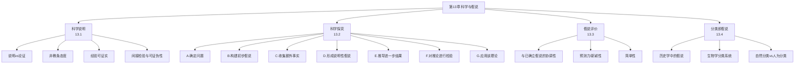

**相关笔记：** [[12.5 归纳技术的局限]] | [[14.1 关于概率的几种观点|14.1 概率的基本概念]]

> [!abstract] 概览
> 第13章探讨科学方法论的核心问题：什么是科学说明？如何获得好的科学说明？如何评价竞争性假说？全章首先界定科学说明的本质特征（[[13.1 科学说明]]），系统阐述科学探究的七个步骤（[[13.2 科学探究：假说与确证]]），提出评价竞争性假说的三大标准（[[13.3 对竞争性科学说明的评价]]），最后揭示分类活动本身也是一种假说性工作（[[13.4 作为假说的分类]]）。本章是归纳逻辑从方法论到科学哲学的桥梁。

---

## 一、全章知识框架

## 二、各节核心要点

### 13.1 科学说明

**说明vs论证**：
- 论证：从前提到结论（==前瞻性==）
- 说明：从事实回溯到原因（==回溯性==）

**科学说明的两个本质特征**：

| 特征 | 内容 |
|:-----|:-----|
| ==非教条态度== | 所有科学命题都是假说，暂时的、可修改的 |
| ==经验可证实== | 假说必须能被经验检验（证实或证伪） |

> [!tip] 可证伪性
> 我们==不能彻底证实==一个假说（证据永远不完全），但==可以彻底证伪==一个假说（一个反例即可）。因此，科学假说至少在原则上是可错的。

### 13.2 科学探究：假说与确证

**科学探究的七个步骤**（==全章核心==）：

| 步骤 | 名称 | 要点 |
|:-----|:-----|:-----|
| A | 确定问题 | 科学始于问题，问题是触发器 |
| B | 构建初步假说 | 试探性说明，指导证据收集 |
| C | 收集额外事实 | 假说引导寻找相关事实 |
| D | 形成说明性假说 | 创造性综合，需要想象和知识 |
| E | 推导进一步结果 | 好假说不仅说明已知事实，还预测新事实 |
| F | 对推论进行检验 | 预测准确性是评价假说的关键 |
| G | 应用该理论 | 理论与实践同等重要 |

**经典实例**：埃拉托色尼测地球、大爆炸/COBE、广义相对论/日全食、弦理论/LHC、进化论/洛索斯蜥蜴

### 13.3 对竞争性科学说明的评价

**三大评价标准**：

| # | 标准 | 要点 | 实例 |
|:-:|:-----|:-----|:-----|
| 1 | ==协调性== | 与已确立假说一致 | 海王星发现 |
| 2 | ==预测力== | 预测新颖事实的能力 | 爱因斯坦预测光线弯曲 |
| 3 | ==简单性== | 同等解释力下更简单更可取 | 奥卡姆剃刀 |

### 13.4 作为假说的分类

- ==分类即假说==：描述本身包含假说
- 历史学：历史学家像侦探，从记录推断过去
- 生物学：分类和描述是同一过程；自然分类vs人为分类
- 进化论使分类从人为走向自然

## 三、跨章节关联

| 关联方向 | 关联内容 |
|:---------|:---------|
| ←第12章 | [[密尔五法]]为假说检验提供因果分析工具 |
| ←第11章 | [[类比推理]]在构建初步假说中的作用 |
| ←第1章 | [[演绎论证]]在间接检验中的角色（从假说演绎出可检验命题） |
| →第14章 | 概率理论为假说的确证程度提供量化基础 |

## 四、待创建Wiki概念页

- 科学说明（核心概念）
- 假说-演绎法（核心方法论）
- 可证伪性（科学哲学概念）
- 科学革命（库恩/拉卡托斯）

---

> [!quote] 章节总结
> 科学说明的本质特征是非教条态度和经验可证实性。科学探究遵循七个步骤，其中假说-演绎法是核心方法论。评价竞争性假说的三大标准是协调性、预测力和简单性。分类本身也是一种假说性工作——"好的侦探和好的历史学家都必须使用科学方法"。
