**相关笔记：** [[14.2 概率演算]]

> [!abstract] 概览
> 本节介绍概率概念在归纳逻辑中的核心地位，以及概率的两种主要解释：==验前解释==（a priori interpretation）和==相对频率解释==（relative frequency interpretation）。核心知识点包括：
> - **概率作为归纳逻辑的核心评价性概念**：皮尔斯认为"概率理论就是定量地研究逻辑的科学"
> - **概率的验前解释**：基于等可能结果中"成功数/可能数"的理性信念程度赋值
> - **概率的相对频率解释**：基于参照类中体现待考察属性的相对频率赋值
> - **两种解释的共同点**：概率是相对于证据的，任何事件不具有内在概率
> - **验前理论可重新诠释为相对频率的"走捷径"估计**：二者在本质上可以统一

---

## 一、知识结构总览

```mermaid
graph TB
    A["14.1 关于概率的几种观点"] --> B["概率的核心地位"]
    A --> C["概率的验前解释"]
    A --> D["概率的相对频率解释"]
    A --> E["两种解释的共同点"]
    A --> F["两种解释的关系"]

    B --> B1["皮尔斯：概率理论=定量研究逻辑的科学"]
    B --> B2["概率是归纳逻辑的核心评价性概念"]
    B --> B3["科学理论及其因果律也仅仅是概然的"]

    C --> C1["核心公式：成功数/可能数"]
    C --> C2["基于理性信念程度"]
    C --> C3["等可能结果的等分原则"]
    C --> C4["无需实验，基于先行条件"]
    C --> C5["示例：掷硬币P=1/2，抽黑桃P=1/4"]

    D --> D1["核心概念：参照类与待考察属性"]
    D --> D2["概率=类中成员体现属性的相对频率"]
    D --> D3["需要实际统计数据"]
    D --> D4["示例：25岁美国妇女再活一年P=0.971"]

    E --> E1["概率相对于证据"]
    E --> E2["任何事件不具有内在概率"]
    E --> E3["不同证据可导致不同概率赋值"]

    F --> F1["验前理论可重新诠释为<br/>相对频率的'走捷径'估计"]
    F --> F2["相对频率理论被认为是更根本的"]
    F --> F3["验前理论在实践中更简单方便"]
```

---

## 二、核心思想

> [!tip] 核心思想
> 概率是整个==归纳逻辑==的核心评价性概念。正如美国哲学家查尔斯·桑德斯·皮尔斯（Charles Sanders Peirce）所说，概率理论"就是定量地研究逻辑的科学"。科学理论及其因果律也仅仅是概然的——即使最好的归纳论证也不具有有效演绎论证所拥有的那种确定性。概率的数值系数（numerical coefficient）在许多情况下可以被赋值，而如何可靠地进行赋值，取决于我们采用哪种概率解释。

### 概率的验前解释

> [!def] 概率的验前理论（A Priori Theory）
> ==概率的验前理论==关心的是，关于某个考虑中的事件，一个理性的人应该相信些什么，并指派 $0$ 到 $1$ 之间的一个数来代表==理性信念的程度==（degree of rational belief）。
>
> **核心公式：**
> $$P = \frac{\text{成功结果数}}{\text{等可能结果总数}}$$
>
> **关键特征：**
> - 完全相信事件会发生 $\Rightarrow$ 赋予数值 $1$
> - 相信事件不可能发生 $\Rightarrow$ 赋予数值 $0$
> - 不能肯定时 $\Rightarrow$ 赋予 $0$ 到 $1$ 之间的某个数
> - 之所以称为"验前"，是因为==在实验之前==就可以赋值——只需考虑先行条件，无需取样

> [!example] 示例1：掷硬币
> 掷一枚均匀硬币，正面朝上的概率是多少？
>
> - 等可能结果：正面朝上、反面朝上 $\Rightarrow$ 总数 = $2$
> - 成功结果：正面朝上 $\Rightarrow$ 数量 = $1$
> - $P(\text{正面}) = \frac{1}{2} = 0.5$
>
> 我们不需要实际掷硬币一千次来得出这个结果——仅凭先行条件（硬币有两面、掷法公平）即可赋值。

> [!example] 示例2：抽黑桃
> 从一副随机洗过的52张牌中，第一张牌为黑桃的概率是多少？
>
> - 等可能结果：52张牌中任意一张 $\Rightarrow$ 总数 = $52$
> - 成功结果：13张黑桃 $\Rightarrow$ 数量 = $13$
> - $P(\text{黑桃}) = \frac{13}{52} = \frac{1}{4}$
>
> 无需实验，仅凭先行条件（每种花色有13张牌、发牌诚实）即可赋值。

### 概率的相对频率解释

> [!def] 概率的相对频率理论（Relative Frequency Theory）
> ==概率的相对频率理论==将概率定义为：在某个==参照类==（reference class）中，成员体现==待考察属性==（attribute in question）的相对频率。
>
> **核心公式：**
> $$P = \frac{\text{参照类中具有该属性的成员数量}}{\text{参照类的成员总数}}$$
>
> **关键特征：**
> - 必须区分==参照类==和==待考察属性==
> - 概率必须依赖事件发生的实际相对频率
> - 需要实际统计数据（如死亡率统计）
> - "理性信念"在这里不是争论点——概率被直接定义为相对频率

> [!example] 示例3：25岁美国妇女的存活概率
> 一个25岁的美国妇女至少将再活一年的概率是 $0.971$。
>
> - **参照类**：25岁的美国妇女
> - **待考察属性**：至少再活一年
> - 只有通过考察这个参照类，确定其中有多少人确实至少又生活了一年，才能知道这个概率
> - $P = \frac{\text{至少再活一年的25岁美国妇女人数}}{\text{25岁美国妇女总数}} = 0.971$

> [!example] 示例4：交通事故概率
> 加利福尼亚州16-24岁男性汽车驾驶员在给定年份发生事故的概率。
>
> - **参照类**：加利福尼亚州16-24岁的男性汽车驾驶员（数量为 $y$）
> - **待考察属性**：在一年中卷入汽车事故（数量为 $x$）
> - $P = \frac{x}{y}$

### 两种解释的共同点：概率相对于证据

> [!tip] 关键共识
> 两种概率解释在以下两个核心主张上完全一致：
>
> 1. **概率是相对于证据的**：被赋予的概率总是相对于可得到的证据而言的
> 2. **任何事件不具有内在概率**：同一事件在不同证据下可以有不同的概率赋值

> [!example] 示例5：同一事件、不同概率
> 两个人正在观看洗牌。由于洗牌者的失误，第一个人偶然看到最上面那张牌是黑色的（但没看到花色）；第二个人什么也没看到。
>
> - **第一个观察者**：知道有26张黑色的牌，其中一半是黑桃 $\Rightarrow P(\text{黑桃}) = \frac{13}{26} = \frac{1}{2}$
> - **第二个观察者**：只知道52张牌中黑桃为13张 $\Rightarrow P(\text{黑桃}) = \frac{13}{52} = \frac{1}{4}$
>
> 两个观察者对同一事件指派了不同的概率，但==没有谁犯错==——每个人都相对于可用证据赋予了正确的概率。即使这张牌翻开后为梅花，两个赋值也都没有错。

### 两种解释的关系

> [!tip] 验前理论作为相对频率的"走捷径"
> 可以将验前理论的概率赋值重新诠释为相对频率的一个"走捷径"（shortcut）估计。例如，硬币正面朝上的概率 $0.5$ 可以通过大量随机抛掷中正面朝上的相对频率来验证——随着抛掷次数增加，相对频率将越来越接近 $0.5$（即==相对频率极限==）。
>
> 鉴于这种可能重新诠释，一些理论家主张==相对频率理论是两者中更为根本的==。然而，在许多情境下，验前理论确实是我们可运用的更简单、更方便的理论。

---

## 三、补充理解与易混淆点

### 补充理解

> [!info] 补充1：概率解释的哲学谱系——从古典到主观主义
> **来源：** Stanford Encyclopedia of Philosophy. (2023). *Interpretations of Probability*. https://plato.stanford.edu/entries/probability-interpret/
>
> 概率解释的哲学讨论远比教材中呈现的两种更为丰富。SEP条目将概率解释分为以下几个主要流派：
>
> | 解释类型 | 代表人物 | 核心思想 |
> |:---------|:---------|:---------|
> | **古典解释** | 拉普拉斯、棣莫弗 | 在无证据或对称平衡证据下，概率在所有等可能结果中均等分配 |
> | **频率解释** | 冯·米塞斯、莱辛巴赫 | 概率是无穷序列中某属性的相对频率极限 |
> | **倾向解释** | 波普尔 | 概率是物理情境产生某种结果的倾向或趋势 |
> | **主观解释** | 德·芬内蒂、萨维奇 | 概率是理性代理人对命题的置信度 |
> | **逻辑解释** | 凯恩斯、卡尔纳普 | 概率是命题间的逻辑关系，度量证据对假说的支持程度 |
>
> 教材中的"验前理论"对应古典解释，"相对频率理论"对应频率解释。值得注意的是，==逻辑解释==与教材中皮尔斯"概率理论就是定量地研究逻辑的科学"这一说法最为契合——它将概率视为证据与假说之间的客观逻辑关系，而非主观信念或物理频率。

> [!info] 补充2：贝叶斯主义如何统一两种解释
> **来源：** Stanford Encyclopedia of Philosophy. (2021). *Interpretations of Probability*. https://plato.stanford.edu/archives/sum2021/entries/probability-interpret/
>
> 现代概率哲学中，==贝叶斯主义==（Bayesianism）提供了一种统一框架来调和验前理论与相对频率理论的对立：
>
> - **主观贝叶斯主义**将概率视为理性代理人的==置信度==（credence），验前概率（prior probability）对应于在观察数据之前基于理性信念的赋值——这与教材中的验前理论高度一致
> - **经验贝叶斯主义**则允许用频率数据来更新先验概率，得到后验概率（posterior probability）——这对应于相对频率理论的角色
> - 通过==贝叶斯定理== $P(H|E) = \frac{P(E|H) \cdot P(H)}{P(E)}$，两种解释可以在同一个数学框架中协调运作
>
> **对教材内容的启示：** 教材中"验前理论可重新诠释为相对频率的走捷径估计"这一观点，在贝叶斯框架下获得了更精确的表达——验前概率是先验信念，而相对频率数据通过似然函数（likelihood）来修正这一信念，最终得到后验概率。

### 易混淆点

> [!warning] 误区：概率是事件自身的固有属性
> ❌ **错误理解：** 每个事件都有一个确定的、内在的概率值，不论我们掌握多少证据，这个概率值都不会改变。比如"明天会下雨"有一个固定的概率，只是我们不知道而已。
>
> ✅ **正确理解：** ==任何事件都不具有内在的或者关于它自身的概率==。概率总是相对于证据的——同一事件在不同证据条件下可以被赋予不同的概率值，且每个赋值相对于其证据而言都是正确的。
>
> **辨析：**
> - 概率不是事件的"内置属性"，而是==证据与事件之间的关系==
> - 改变参照类（相对频率理论）或改变可用知识（验前理论），概率就会变化
> - 两个观察者对同一事件给出不同概率，可能==两人都没有错==
> - 这与确定性（certainty）有本质区别：演绎论证具有确定性，而归纳论证只具有概然性

> [!warning] 误区：验前理论和相对频率理论是互相矛盾的
> ❌ **错误理解：** 验前理论和相对频率理论对概率给出了根本不同的定义，两者互相矛盾，只能选择其一。
>
> ✅ **正确理解：** 两种解释在核心主张上==完全一致==——都承认概率相对于证据，都承认可以为事件进行概率赋值。它们不是对立关系，而是==互补关系==。
>
> **辨析：**
> - **验前理论**适用于：对称条件下的等可能结果（如掷骰子、抽牌），无需实验数据
> - **相对频率理论**适用于：需要实际统计数据的场景（如死亡率、事故率）
> - 验前理论可以被视为相对频率的"走捷径"估计——当抛掷次数趋于无穷时，验前赋值趋近于相对频率极限
> - 一些理论家认为相对频率理论更根本，但验前理论在实践中更简单方便
> - ==两者在概率演算中遵循相同的数学规则==（乘法定理、加法定理等），区别仅在于概率值的来源

---

## 四、习题精选

> [!todo] 习题概览
> | 题号 | 核心考点 | 难度 |
> |:-----|:---------|:-----|
> | 1 | 区分验前解释与相对频率解释 | ⭐⭐ |
> | 2 | 理解概率相对于证据 | ⭐⭐⭐ |

### 题1：区分两种概率解释

> [!problem] 题目
> 以下陈述分别使用了哪种概率解释？请说明理由。
>
> (a) 从一副标准扑克牌中随机抽取一张，抽到红心的概率是 $1/4$。
> (b) 根据保险公司统计，一个40岁男性在未来一年内因心脏病发作而死亡的概率是 $0.003$。
> (c) 一个公平的六面骰子掷出偶数点的概率是 $1/2$。

> [!faq]- 解答
> **(a) 验前解释。**
> - 理由：一副标准扑克牌有52张，其中红心13张。基于先行条件（牌是标准的、抽取是随机的），无需实际实验即可赋值：$P = 13/52 = 1/4$。这符合"成功数/可能数"的验前公式。
>
> **(b) 相对频率解释。**
> - 理由：这个概率值 $0.003$ 只能通过考察参照类（40岁男性）中实际发生心脏病死亡的人数相对于该类总人数的频率来获得。它依赖于实际统计数据，而非等可能结果的先验分析。
>
> **(c) 验前解释。**
> - 理由：公平的六面骰子有6个等可能结果（1、2、3、4、5、6），其中偶数点有3个（2、4、6）。基于先行条件（骰子公平），$P = 3/6 = 1/2$。无需实验即可赋值。
>
> $\blacksquare$

### 题2：概率相对于证据

> [!problem] 题目
> 一个不透明的袋子里有5个红球和3个白球。
>
> (a) 随机摸出一个球，它是红球的概率是多少？
> (b) 如果在摸球之前，有人偷偷看了一眼告诉你"摸出的球不是白色的"，此时摸出红球的概率是多少？
> (c) 这两个概率不同说明了什么？

> [!faq]- 解答
> **(a) $P(\text{红球}) = \frac{5}{8}$**
> - 等可能结果总数：$5 + 3 = 8$
> - 成功结果数（红球）：$5$
> - $P = \frac{5}{8} = 0.625$
>
> **(b) $P(\text{红球} \mid \text{不是白色}) = \frac{5}{5} = 1$**
> - 已知球不是白色的，则可能的球只有红球（5个）
> - 成功结果数（红球）：$5$
> - $P = \frac{5}{5} = 1$（确定事件）
>
> **(c) 说明概率是相对于证据的。**
> - 同一个事件（摸出红球）在不同证据条件下有不同的概率
> - (a)中的证据：只知道袋子里有5红3白
> - (b)中的证据：额外知道球不是白色的
> - 两个概率值相对于各自的证据都是正确的，这印证了"任何事件不具有内在概率"的核心观点
>
> $\blacksquare$

> [!tip] 解题思路提示
> 区分两种概率解释的关键：
> 1. **验前解释**：问自己"能否在不做实验的情况下，仅凭先行条件（对称性、等可能性）赋值？"——如果能，就是验前解释
> 2. **相对频率解释**：问自己"这个概率值是否需要实际统计数据才能得出？"——如果需要，就是相对频率解释
> 3. **概率相对于证据**：当题目给出额外信息时，要意识到概率可能随之改变——这是理解条件概率的基础

---

## 五、视频学习指南

> [!info] 视频资源
> | 资源 | 链接 | 对应内容 | 备注 |
> |:-----|:-----|:---------|:-----|
> | MIT 6.041: Probability Interpretations | [链接](https://www.youtube.com/watch?v=j9QmO6h1z0A) | 概率的三种解释 | 英文，MIT开放课程 |
> | 3Blue1Brown: Probability | [链接](https://www.youtube.com/playlist?list=PLZHQObOWTQDPD3MizzM2xVFitgF8hE_ab) | 概率基础系列 | 英文，可视化讲解 |
> | Wireless Philosophy: Probability | [链接](https://www.youtube.com/playlist?list=PLtDyWVKRDCG3Jl8mPQYV8nR7GpKVlY9l) | 概率哲学基础 | 英文，哲学视角 |

---

## 六、教材原文

> [!quote] 教材原文
> **来源：** 逻辑学导论 第15版，第14章第1节
>
> **概率的核心地位：**
> 概率是整个归纳逻辑的一个核心评价性概念。正如美国哲学家查尔斯·桑德斯·皮尔斯所说，概率理论"就是定量地研究逻辑的科学"。这个理论的数学应用已经远远超出本书所关心的内容，但是以对概率概念的分析和对它的实践应用的简单说明来结束我们对归纳逻辑的讨论是适宜的。
>
> **科学理论的概然性：**
> 科学理论及其包括的因果律也仅仅是概然的。即使最好的归纳论证也不具有有效演绎论证所拥有的那种确定性。我们为理论或者任何种类的假说推论性地指派一定的概率度。
>
> **验前理论的核心方法：**
> 在概率的验前理论中，一个事件的概率以一个分数来表示，其中，分母是等可能结果的总数，分子是将会成功地产生待考察事件的结果数。这样的赋值（"成功数除以可能数"）是理性的、方便的，也是非常有用的。
>
> **相对频率理论的核心方法：**
> 在这个理论中，我们区分了参照类和待考察属性。被赋予的概率是对类中成员体现待考察属性的相对频率的测量。根据这个理论，概率也被表达成分数，分母是这个例子中参照类的成员数量，而分子是类中具有所要求属性的成员数量。
>
> **概率相对于证据：**
> 必须注意的是，在这两个理论中，被赋予的概率是相对于可得到的证据而言的。以这种观点来看，任何事件都不具有内在的或者关于它自身的概率。因此，如果证据集不同，概率可能变化很大。
>
> **两种解释的关系：**
> 可以把验前理论的概率赋值重新诠释成是相对频率的一个"走捷径"的估计。鉴于对于赋值这样的可能重新诠释，一些理论家主张相对频率理论是两个理论中更为根本的。然而，在许多情境下，验前理论确实是我们可运用的更为简单的、更为方便的理论。

---

## 参见 Wiki

- [[归纳逻辑]] -- 概率是归纳逻辑的核心评价性概念
- [[演绎论证]] -- 演绎论证具有确定性，与归纳论证的概然性形成对比
- [[归纳论证]] -- 归纳论证的强度可以用概率来度量
- [[因果联系]] -- 科学理论中的因果律也仅仅是概然的
- [[休谟问题]] -- 休谟对归纳推理的质疑与概率理论密切相关
- [[密尔五法]] -- 密尔五法是归纳推理的方法，其结论具有概然性
- [[科学说明]] -- 科学说明的概率性与概率解释的关系
- [[假说-演绎法]] -- 假说-演绎法中概率用于评估假说的可信度

#学习/逻辑学/概率
