**相关笔记：** [[14.1 关于概率的几种观点]]

> [!abstract] 概览
> 本节介绍==概率演算==（calculus of probability）的两个基本定理：==乘法定理==（计算共同发生的概率）和==加法定理==（计算替代性发生的概率）。核心知识点包括：
> - **乘法定理（独立事件）**：$P(a \cap b) = P(a) \times P(b)$，适用于事件之间互不影响的情况
> - **乘法定理（非独立事件）**：$P(a \cap b) = P(a) \times P(b|a)$，引入==条件概率==的概念
> - **一般乘法定理**：$P(a \cap b \cap c) = P(a) \times P(b|a) \times P(c|a \cap b)$，可推广到任意多个事件
> - **加法定理（互斥事件）**：$P(a \cup b) = P(a) + P(b)$，适用于事件不能同时发生的情况
> - **加法定理（非互斥事件）**：$P(a \cup b) = P(a) + P(b) - P(a \cap b)$，或使用补集法 $1 - P(\text{都不发生})$
> - **综合应用**：双骰赌博中掷骰者赢的概率为 $244/495 \approx 0.493$

---

## 一、知识结构总览

```mermaid
graph TB
    A["14.2 概率演算"] --> B["乘法定理<br/>共同发生的概率"]
    A --> C["加法定理<br/>替代性发生的概率"]
    A --> D["综合应用"]

    B --> B1["独立事件"]
    B --> B2["非独立事件（条件概率）"]
    B --> B3["一般乘法定理"]

    B1 --> B1a["P(a∩b) = P(a)×P(b)"]
    B1 --> B1b["示例：掷两枚硬币均正面"]
    B1 --> B1c["示例：掷两个骰子得12点"]
    B1 --> B1d["推广：P(a∩b∩c) = P(a)×P(b)×P(c)"]

    B2 --> B2a["P(a∩b) = P(a)×P(b|a)"]
    B2 --> B2b["条件概率P(b|a)的定义"]
    B2 --> B2c["示例：抽牌不放回"]

    B3 --> B3a["P(a∩b∩c) = P(a)×P(b|a)×P(c|a∩b)"]
    B3 --> B3b["示例：连续抽三张黑桃不放回"]
    B3 --> B3c["示例：骨髓移植成功概率"]

    C --> C1["互斥事件"]
    C --> C2["非互斥事件"]
    C --> C3["补集法"]

    C1 --> C1a["P(a∪b) = P(a)+P(b)"]
    C1 --> C1b["示例：抽到黑桃或梅花"]

    C2 --> C2a["方法1：分解为互斥事件后相加"]
    C2 --> C2b["方法2：1 - P(都不发生)"]
    C2 --> C2c["示例：掷两次硬币至少一次正面"]

    C3 --> C3a["P(至少一个) = 1 - P(一个都没有)"]
    C3 --> C3b["示例：嘉年华骰子骗局"]

    D --> D1["双骰赌博分析"]
    D --> D2["掷骰者赢的概率 = 244/495 ≈ 0.493"]
    D --> D3["乘法+加法综合运用"]
```

---

## 二、核心思想

> [!tip] 核心思想
> 概率演算是允许根据==组成事件的概率==来计算==复合事件概率==的数学分支。复合事件可以看作一个整体，其部分是作为其成分的单个事件。概率演算的两个基本定理分别回答两类问题：
> - **乘法定理**：组分事件==共同发生==的概率是多少？（"a **并且** b"的概率）
> - **加法定理**：组分事件==替代性发生==的概率是多少？（"a **或者** b"的概率）

### A. 乘法定理——共同发生的概率

#### 独立事件的乘法定理

> [!def] 独立事件（Independent Events）
> 两个事件是==独立事件==，当且仅当一个事件的发生==不影响==另一个事件发生的概率。
>
> **独立事件乘法定理：**
> $$P(a \cap b) = P(a) \times P(b)$$
>
> 其中 $P(a)$ 和 $P(b)$ 是两个事件各自的概率，$P(a \cap b)$ 表示它们共同发生的概率。

> [!example] 示例1：掷两枚硬币均正面朝上
> 将两枚硬币各掷一次，两枚都正面朝上的概率是多少？
>
> - 设 $a$ = 第一枚正面朝上，$P(a) = \frac{1}{2}$
> - 设 $b$ = 第二枚正面朝上，$P(b) = \frac{1}{2}$
> - 两枚硬币互不影响（独立事件）
> - $P(a \cap b) = \frac{1}{2} \times \frac{1}{2} = \frac{1}{4}$
>
> **验证：** 掷两枚硬币共有4种等可能结果：(正,正)、(正,反)、(反,正)、(反,反)，其中"两枚都正面"只有1种，$P = \frac{1}{4}$。一致。

> [!example] 示例2：掷两个骰子得到12点
> 掷两个骰子，得到12点（即两个骰子都为6点）的概率是多少？
>
> - 设 $a$ = 第一个骰子出现6点，$P(a) = \frac{1}{6}$
> - 设 $b$ = 第二个骰子出现6点，$P(b) = \frac{1}{6}$
> - 两个骰子互不影响（独立事件）
> - $P(a \cap b) = \frac{1}{6} \times \frac{1}{6} = \frac{1}{36}$
>
> **验证：** 掷两个骰子共有 $6 \times 6 = 36$ 种等可能结果，其中只有 (6,6) 得到12点，$P = \frac{1}{36}$。一致。

> [!tip] 独立事件乘法定理的一般化
> 乘法定理可以推广到任意多个独立事件。如果从一副洗过的牌中抽出一张牌，==放回==并抽第二次，再放回抽第三次，每次抽出黑桃的概率都是 $\frac{1}{4}$，则三次都抽出黑桃的概率为：
> $$P = \frac{1}{4} \times \frac{1}{4} \times \frac{1}{4} = \frac{1}{64}$$
>
> 一般形式：$P(a_1 \cap a_2 \cap \cdots \cap a_n) = P(a_1) \times P(a_2) \times \cdots \times P(a_n)$

#### 非独立事件的乘法定理（条件概率）

> [!def] 条件概率与非独立事件乘法定理
> 当两个事件==不独立==时（即一个事件的发生影响另一个事件发生的概率），需要引入==条件概率==（conditional probability）的概念。
>
> **条件概率** $P(b|a)$ 表示在事件 $a$ 已经发生的条件下，事件 $b$ 发生的概率。
>
> **非独立事件乘法定理：**
> $$P(a \cap b) = P(a) \times P(b|a)$$
>
> 即：两个事件共同发生的概率 = 第一个事件的概率 $\times$ 在第一个事件发生的条件下第二个事件的概率。

> [!example] 示例3：抽牌不放回——连续抽三张黑桃
> 从一副洗好的52张牌中连续抽三张牌，每次抽完不放回，三张都是黑桃的概率是多少？
>
> **逐步分析：**
> - **第一次抽牌**：52张牌中有13张黑桃
>   - $P(a) = \frac{13}{52} = \frac{1}{4}$
> - **第二次抽牌**（在第一次已抽到黑桃的条件下）：剩下51张牌，其中12张黑桃
>   - $P(b|a) = \frac{12}{51} = \frac{4}{17}$
> - **第三次抽牌**（在前两次都已抽到黑桃的条件下）：剩下50张牌，其中11张黑桃
>   - $P(c|a \cap b) = \frac{11}{50}$
>
> **计算：**
> $$P(a \cap b \cap c) = \frac{13}{52} \times \frac{12}{51} \times \frac{11}{50} = \frac{11}{850}$$
>
> **对比放回情况：** 如果每次放回，$P = \frac{1}{4} \times \frac{1}{4} \times \frac{1}{4} = \frac{1}{64} \approx 0.0156$；不放回时 $P = \frac{11}{850} \approx 0.0129$。不放回的概率更低，因为每次成功抽到黑桃都会降低下次抽到黑桃的机会。

> [!def] 一般乘法定理
> 乘法定理可以推广到任意多个非独立事件：
> $$P(a \cap b \cap c) = P(a) \times P(b|a) \times P(c|a \cap b)$$
>
> 更一般地，对于 $n$ 个事件：
> $$P(a_1 \cap a_2 \cap \cdots \cap a_n) = P(a_1) \times P(a_2|a_1) \times P(a_3|a_1 \cap a_2) \times \cdots \times P(a_n|a_1 \cap a_2 \cap \cdots \cap a_{n-1})$$

> [!example] 示例4：骨髓移植的真实案例
> 一个加利福尼亚少女患慢性白血病，需要匹配的骨髓捐赠者。其父母决定再生一个小孩进行骨髓移植，需要满足以下条件：
>
> | 步骤 | 事件 | 概率 |
> |:-----|:-----|:-----|
> | 1 | 父亲输精管成功接通 | $P_1 = 0.50$ |
> | 2 | 母亲成功怀孕（45岁） | $P_2 = 0.73$ |
> | 3 | 婴儿骨髓与女儿匹配 | $P_3 = 0.25$ |
> | 4 | 化疗和骨髓移植后存活 | $P_4 = 0.70$ |
>
> 所有步骤成功的总概率：
> $$P = 0.50 \times 0.73 \times 0.25 \times 0.70 = 0.063875$$
>
> 即大约 $6.4\%$——概率很低但并非毫无希望。（注：这个真实案例最终获得了圆满成功。）

### B. 加法定理——替代性发生的概率

#### 互斥事件的加法定理

> [!def] 互斥事件（Mutually Exclusive Events）
> 两个事件是==互斥事件==（或不相容事件），当且仅当它们==不能同时发生==——如果其中一个发生，另一个便不能发生。
>
> **互斥事件加法定理：**
> $$P(a \cup b) = P(a) + P(b)$$
>
> 即：两个互斥事件中至少一个发生的概率等于它们各自概率之和。可以推广到任意多个互斥事件。

> [!example] 示例5：抽到黑桃或梅花
> 从一副洗过的牌中，抽到黑桃或梅花的概率是多少？
>
> - $P(\text{黑桃}) = \frac{13}{52} = \frac{1}{4}$
> - $P(\text{梅花}) = \frac{13}{52} = \frac{1}{4}$
> - 黑桃和梅花互斥（一张牌不可能既是黑桃又是梅花）
> - $P(\text{黑桃} \cup \text{梅花}) = \frac{1}{4} + \frac{1}{4} = \frac{1}{2}$

#### 非互斥事件的加法定理

> [!def] 非互斥事件的加法定理
> 当事件==不互斥==时（即它们可以同时发生），不能简单相加，否则会==重复计算==重叠部分。
>
> **非互斥事件加法定理：**
> $$P(a \cup b) = P(a) + P(b) - P(a \cap b)$$
>
> 减去 $P(a \cap b)$ 是为了消除重复计算的部分。

> [!example] 示例6：掷两次硬币至少一次正面（两种方法对比）
> 将一枚硬币掷两次，至少得到一次正面的概率是多少？
>
> 两个组分事件（第一次正面、第二次正面）不互斥——两者可以同时发生。
>
> **方法1：分解为互斥事件后相加**
>
> 满足条件的三种互斥结果：
> - (正,反)：$P = \frac{1}{2} \times \frac{1}{2} = \frac{1}{4}$
> - (反,正)：$P = \frac{1}{2} \times \frac{1}{2} = \frac{1}{4}$
> - (正,正)：$P = \frac{1}{2} \times \frac{1}{2} = \frac{1}{4}$
>
> $$P = \frac{1}{4} + \frac{1}{4} + \frac{1}{4} = \frac{3}{4} = 0.75$$
>
> **方法2：补集法（1减去都不发生的概率）**
>
> 唯一不满足条件的结果是 (反,反)：
> $$P(\text{都不发生}) = \frac{1}{2} \times \frac{1}{2} = \frac{1}{4}$$
> $$P(\text{至少一个正面}) = 1 - \frac{1}{4} = \frac{3}{4} = 0.75$$
>
> 两种方法结果一致。当组分事件较多时，==补集法通常更简便==。

> [!tip] 补集法——计算"至少一个"的利器
> 一个事件发生的概率，等于 $1$ 减去那个事件不发生的概率：
> $$P(\text{至少一个发生}) = 1 - P(\text{一个都不发生})$$
>
> 当替代性事件数量较多时，补集法往往比分解互斥事件法更简便。

> [!example] 示例7：嘉年华骰子骗局
> 掷三个骰子，赌场运营商与你赌一赔一，赌三个骰子中==均不==出现1点。表面上看你有三次机会得到1点，似乎公平。实际上呢？
>
> **用补集法计算玩家赢的概率：**
> - 单个骰子非1点的概率：$P = \frac{5}{6}$
> - 三个骰子均非1点（玩家输）的概率：$P(\text{输}) = \frac{5}{6} \times \frac{5}{6} \times \frac{5}{6} = \frac{125}{216} \approx 0.579$
> - 玩家赢（至少一个1点）的概率：$P(\text{赢}) = 1 - \frac{125}{216} = \frac{91}{216} \approx 0.421$
>
> ==玩家赢的概率只有 42.1%，低于 50%==——这是一个不公平的赌博！粗心的玩家错误地认为三个骰子得到1点是互斥事件，但实际上它们不是（可能两个或三个骰子同时出现1点）。

### C. 综合应用：双骰赌博

> [!example] 示例8：双骰赌博中掷骰者赢的概率
> 双骰赌博（craps）规则：掷两个骰子。
> - 第一次掷出 **7或11** $\Rightarrow$ 掷骰者赢
> - 第一次掷出 **2、3或12** $\Rightarrow$ 掷骰者输
> - 第一次掷出 **4、5、6、8、9或10** $\Rightarrow$ 记住这个点数，继续掷骰子，直到再次掷出该点数（赢）或掷出7（输）
>
> **第一步：计算各点数出现的概率**
>
> 两个骰子共有36种等可能状态：
>
> | 点数 | 组合方式 | 概率 |
> |:----:|:---------|:----:|
> | 2 | (1,1) | $1/36$ |
> | 3 | (1,2),(2,1) | $2/36$ |
> | 4 | (1,3),(2,2),(3,1) | $3/36$ |
> | 5 | (1,4),(2,3),(3,2),(4,1) | $4/36$ |
> | 6 | (1,5),(2,4),(3,3),(4,2),(5,1) | $5/36$ |
> | 7 | (1,6),(2,5),(3,4),(4,3),(5,2),(6,1) | $6/36$ |
> | 8 | (2,6),(3,5),(4,4),(5,3),(6,2) | $5/36$ |
> | 9 | (3,6),(4,5),(5,4),(6,3) | $4/36$ |
> | 10 | (4,6),(5,5),(6,4) | $3/36$ |
> | 11 | (5,6),(6,5) | $2/36$ |
> | 12 | (6,6) | $1/36$ |
>
> **第二步：计算各种赢的方式的概率**
>
> | 赢的方式 | 计算 | 概率 |
> |:---------|:-----|:----:|
> | 第一次掷出7 | $6/36$ | $6/36$ |
> | 第一次掷出11 | $2/36$ | $2/36$ |
> | 先掷4，在7之前再掷4 | $3/36 \times 3/9$ | $1/36$ |
> | 先掷10，在7之前再掷10 | $3/36 \times 3/9$ | $1/36$ |
> | 先掷5，在7之前再掷5 | $4/36 \times 4/10$ | $2/45$ |
> | 先掷9，在7之前再掷9 | $4/36 \times 4/10$ | $2/45$ |
> | 先掷6，在7之前再掷6 | $5/36 \times 5/11$ | $25/396$ |
> | 先掷8，在7之前再掷8 | $5/36 \times 5/11$ | $25/396$ |
>
> **第三步：求和（所有赢的方式互斥）**
>
> $$P(\text{赢}) = \frac{6}{36} + \frac{2}{36} + \frac{1}{36} + \frac{1}{36} + \frac{2}{45} + \frac{2}{45} + \frac{25}{396} + \frac{25}{396} = \frac{244}{495} \approx 0.493$$
>
> **结论：** 掷骰者赢的概率约为 $49.3\%$，==略低于一半==。尽管双骰赌博被普遍认为是公平的，但严格计算表明掷骰者处于轻微劣势。

---

## 三、补充理解与易混淆点

### 补充理解

> [!info] 补充1：乘法规则与条件概率的深层联系
> **来源：** MIT OpenCourseWare. (2024). *Mathematics for Computer Science, Lecture 19: Conditional Probability*. https://ocw-preview.odl.mit.edu/courses/6-1200j-mathematics-for-computer-science-spring-2024/mit6_1200j_s24_lec19.pdf
>
> 乘法规则（product rule）和条件概率之间存在深刻的数学联系，理解这一点有助于灵活运用概率演算：
>
> **核心恒等式：**
> $$P(A \cap B) = P(A|B) \cdot P(B) = P(B|A) \cdot P(A)$$
>
> 这意味着条件概率可以从联合概率反推：
> $$P(B|A) = \frac{P(A \cap B)}{P(A)}$$
>
> **推广到多个事件（链式法则/Chain Rule）：**
> $$P(A_1 \cap A_2 \cap \cdots \cap A_n) = P(A_1) \cdot P(A_2|A_1) \cdot P(A_3|A_1 \cap A_2) \cdots P(A_n|A_1 \cap \cdots \cap A_{n-1})$$
>
> 这正是教材中"一般乘法定理"的精确表达。链式法则的直观理解是：==每一步的概率都以前面所有步骤的结果为条件==，就像一棵概率树的路径——从根到叶的路径概率等于沿途各边概率的乘积。
>
> **实践意义：** 当直接计算某个事件的概率困难时，可以尝试将其分解为条件概率的乘积。例如，计算"连续5天都下雨"的概率，可以分解为：第1天下雨的概率 $\times$ 在第1天下雨条件下第2天下雨的概率 $\times$ ... $\times$ 在前4天都下雨条件下第5天下雨的概率。

> [!info] 补充2：加法规则与容斥原理
> **来源：** Khan Academy. (2024). *Probability and Combinatorics*. https://www.khanacademy.org/math/precalculus/x9e81a4f98389efdf:prob-comb
>
> 非互斥事件的加法定理实际上是更一般的==容斥原理==（Inclusion-Exclusion Principle）在两个事件情况下的特例：
>
> **两个事件的容斥原理：**
> $$P(A \cup B) = P(A) + P(B) - P(A \cap B)$$
>
> **三个事件的容斥原理：**
> $$P(A \cup B \cup C) = P(A) + P(B) + P(C) - P(A \cap B) - P(A \cap C) - P(B \cap C) + P(A \cap B \cap C)$$
>
> **直观理解：** 想象两个相交的圆（韦恩图），$P(A) + P(B)$ 把交集部分计算了两次，所以需要减去一次 $P(A \cap B)$ 来"纠正"。对于三个事件，交集部分被加了三次、减了三次，最核心的三重交集被完全遗漏了，所以需要加回来一次。
>
> **与补集法的关系：** 当事件数量较多时，容斥原理的计算量迅速增长（$2^n - 1$ 项），此时==补集法 $1 - P(\text{都不发生})$ 通常远为简便==。这就是为什么教材在处理嘉年华骰子骗局时选择了补集法。

### 易混淆点

> [!warning] 误区：独立事件与互斥事件是一回事
> ❌ **错误理解：** 独立事件就是互斥事件——如果两个事件互不影响，那它们当然不能同时发生。
>
> ✅ **正确理解：** ==独立事件和互斥事件是两个完全不同的概念==，它们之间甚至存在张力。
>
> **辨析：**
>
> | 特征 | 独立事件 | 互斥事件 |
> |:-----|:---------|:---------|
> | **定义** | 一个事件的发生不影响另一个事件的概率 | 两个事件不能同时发生 |
> | **数学表达** | $P(a \cap b) = P(a) \times P(b)$ | $P(a \cap b) = 0$ |
> | **用于** | 乘法定理 | 加法定理 |
> | **关系** | $P(b|a) = P(b)$ | $P(b|a) = 0$（若 $P(a) > 0$）|
>
> **关键洞察：** 如果两个互斥事件都是可能的（$P(a) > 0$ 且 $P(b) > 0$），那么它们==不可能==是独立事件！因为如果 $a$ 发生了，$b$ 的概率就变成了 $0$（而不是保持原来的 $P(b)$），说明 $a$ 的发生确实影响了 $b$ 的概率。
>
> **示例：** 掷一枚骰子，"掷出1点"和"掷出2点"是互斥的（不能同时发生），但不是独立的——如果已知掷出了1点，那掷出2点的概率就从 $1/6$ 变成了 $0$。

> [!warning] 误区：非互斥事件的概率可以直接相加
> ❌ **错误理解：** 要计算"a或b"的概率，直接把 $P(a)$ 和 $P(b)$ 相加就行了，不管它们是否互斥。
>
> ✅ **正确理解：** 只有==互斥事件==才能直接相加。非互斥事件直接相加会导致==重复计算==重叠部分，从而高估概率。
>
> **辨析：**
> - **互斥事件直接相加：** $P(\text{黑桃或梅花}) = \frac{1}{4} + \frac{1}{4} = \frac{1}{2}$ ✓（正确，因为一张牌不可能既是黑桃又是梅花）
> - **非互斥事件直接相加的错误：** 掷两次硬币，$P(\text{至少一次正面}) \neq \frac{1}{2} + \frac{1}{2} = 1$（错误！概率不可能是 $1$，因为有可能两次都是反面）
> - **正确做法：** $P(\text{至少一次正面}) = \frac{1}{2} + \frac{1}{2} - \frac{1}{4} = \frac{3}{4}$（减去重复计算的"两次都正面"部分）
> - ==补集法是避免此类错误的最佳策略==：$P = 1 - P(\text{两次都反面}) = 1 - \frac{1}{4} = \frac{3}{4}$

---

## 四、习题精选

> [!todo] 习题概览
> | 题号 | 核心考点 | 难度 |
> |:-----|:---------|:-----|
> | 1 | 独立事件乘法定理（放回抽样） | ⭐⭐ |
> | 2 | 非独立事件乘法定理（不放回抽样） | ⭐⭐⭐ |

### 题1：连续抽三张A（放回vs不放回）

> [!problem] 题目
> 从一副牌中连续抽三张牌，在下列两种情况下，得到三张A的概率各为多少？
> (a) 每次抽完牌后在下一次抽牌之前将牌放回去；
> (b) 每次抽出的牌不放回去。

> [!faq]- 解答
> **(a) 放回抽样——独立事件**
>
> 每次抽牌互不影响，使用独立事件乘法定理：
> $$P(a \cap b \cap c) = P(a) \times P(b) \times P(c)$$
>
> - 一副牌52张，其中4张A
> - 每次抽到A的概率：$P = \frac{4}{52} = \frac{1}{13}$
> - 三次都抽到A的概率：$\frac{1}{13} \times \frac{1}{13} \times \frac{1}{13} = \frac{1}{2197}$
>
> **(b) 不放回抽样——非独立事件**
>
> 使用一般乘法定理：
> $$P(a \cap b \cap c) = P(a) \times P(b|a) \times P(c|a \cap b)$$
>
> - 第一次抽到A：$P(a) = \frac{4}{52} = \frac{1}{13}$
> - 在第一次已抽到A的条件下，第二次抽到A：$P(b|a) = \frac{3}{51} = \frac{1}{17}$
> - 在前两次都已抽到A的条件下，第三次抽到A：$P(c|a \cap b) = \frac{2}{50} = \frac{1}{25}$
> - 三次都抽到A的概率：$\frac{1}{13} \times \frac{1}{17} \times \frac{1}{25} = \frac{1}{5525}$
>
> **对比：** 不放回时 $\frac{1}{5525} \approx 0.000181$ 远低于放回时 $\frac{1}{2197} \approx 0.000455$，因为不放回使得前面抽到A会降低后面抽到A的机会。
>
> $\blacksquare$

### 题2：两只瓮中至少抽到一个白球

> [!problem] 题目
> 有两只瓮，第一只瓮里有2个白球和4个黑球，第二只瓮里有3个白球和9个黑球。如果从每只瓮中随机抽出一个球，抽到至少一个白球的概率为多少？

> [!faq]- 解答
> 设 $a$ = 从第一只瓮中抽到白球，$b$ = 从第二只瓮中抽到白球。
>
> - $P(a) = \frac{2}{6} = \frac{1}{3}$，$P(\bar{a}) = \frac{4}{6} = \frac{2}{3}$
> - $P(b) = \frac{3}{12} = \frac{1}{4}$，$P(\bar{b}) = \frac{9}{12} = \frac{3}{4}$
>
> 两只瓮的抽取互不影响（独立事件），但"至少一个白球"不是互斥事件的简单加法。
>
> **方法1：分解为互斥事件后相加**
>
> 三种互斥的满足条件的情况：
> - (1) 第一只瓮白球、第二只瓮黑球：$\frac{2}{6} \times \frac{9}{12} = \frac{1}{4}$
> - (2) 第一只瓮黑球、第二只瓮白球：$\frac{4}{6} \times \frac{3}{12} = \frac{1}{6}$
> - (3) 两只瓮都白球：$\frac{2}{6} \times \frac{3}{12} = \frac{1}{12}$
>
> $$P = \frac{1}{4} + \frac{1}{6} + \frac{1}{12} = \frac{3}{12} + \frac{2}{12} + \frac{1}{12} = \frac{6}{12} = \frac{1}{2}$$
>
> **方法2：补集法**
>
> 不满足条件 = 两只瓮都抽到黑球：
> $$P(\bar{a} \cap \bar{b}) = \frac{4}{6} \times \frac{9}{12} = \frac{1}{2}$$
>
> $$P(\text{至少一个白球}) = 1 - \frac{1}{2} = \frac{1}{2}$$
>
> 两种方法结果一致：$P = \frac{1}{2}$。
>
> $\blacksquare$

> [!tip] 解题思路提示
> 概率演算的解题策略：
> 1. **判断事件关系**：首先确定事件之间是独立还是非独立、互斥还是非互斥
> 2. **共同发生用乘法**：问"a且b"的概率 $\Rightarrow$ 使用乘法定理
> 3. **替代发生用加法**：问"a或b"的概率 $\Rightarrow$ 使用加法定理
> 4. **非互斥时用补集法**：计算"至少一个"时，$1 - P(\text{都不发生})$ 通常最简便
> 5. **放回vs不放回**：放回 $\Rightarrow$ 独立事件（直接乘）；不放回 $\Rightarrow$ 非独立事件（条件概率）
> 6. **综合问题分步走**：将复杂问题分解为多个简单步骤，逐步计算

---

## 五、视频学习指南

> [!info] 视频资源
> | 资源 | 链接 | 对应内容 | 备注 |
> |:-----|:-----|:---------|:-----|
> | Khan Academy: Probability | [链接](https://www.khanacademy.org/math/probability) | 概率基础、乘法规则、加法规则、条件概率 | 英文，系统课程，含练习题 |
> | MIT 6.041: Probabilistic Systems | [链接](https://www.youtube.com/playlist?list=PLUl4u3cNGP60hI9ATjSFgLZpbNJ7myAg6) | 概率系统分析 | 英文，MIT开放课程 |
> | 3Blue1Brown: Bayes Theorem | [链接](https://www.youtube.com/watch?v=HZGCoVF3YvM) | 贝叶斯定理的可视化讲解 | 英文，概率演算的进阶应用 |
> | LibreTexts: Multiplication Rules | [链接](https://stats.libretexts.org/Courses/Citrus_College/Statistics_C1000:_Introduction_to_Statistics/04:_Probability_and_Combinatorics/4.04:_Multiplication_Rules_and_Conditional_Probability) | 乘法规则与条件概率 | 英文，教材式讲解 |

---

## 六、教材原文

> [!quote] 教材原文
> **来源：** 逻辑学导论 第15版，第14章第2节
>
> **概率演算的定义：**
> 概率演算是允许进行这样计算的数学的一个分支。知道我们日常生活中的特定结果的似然度重要；因此，应用概率演算特别有帮助。掌握概率演算的基本定理是逻辑研究最有用的成果之一。
>
> **独立事件乘法定理：**
> 根据独立事件的乘法定理，两个独立事件共同发生的概率等于它们各自概率的乘积。这个公式可以写成：P（a且b）=P(a)×P(b)。
>
> **非独立事件乘法定理：**
> 如果抽出的第一张牌是一张黑桃，那么第二次抽牌过程中总的牌数为51张牌，剩下的黑桃只有12张了；而如果第一次抽出的不是一张黑桃，那么剩下的51张牌中有13张黑桃。如果a和b都发生，第三次抽牌是在只有11张黑桃的50张牌中进行。
>
> **互斥事件加法定理：**
> 当事件是相互排斥的时候，加法定理是直接而简单的：P（a或b）=P(a)+P(b)。这可以一般化到任意多的替代性事件，如果所有替代性事件是相互排斥的，它们中一个或者另一个发生的概率为其所有概率之和。
>
> **非互斥事件的处理：**
> 一个事件发生的概率，就等于1减去那个事件不发生的概率。有时候第一种方法更简单，有时候第二种方法更简单。
>
> **双骰赌博的结论：**
> 掷骰者赢的方式有8种。这些方式都是相互排斥的，所以掷骰者总的赢的概率为能够获胜的各种可以赢的替代性发生方式的概率之和。这个概率为244/495。如果表示成小数，这就是0.493。这表明在双骰赌博中，掷骰者赢的机会小于一半；尽管仅仅是略小于，但仍然是小于0.5。

---

## 参见 Wiki

- [[归纳逻辑]] -- 概率演算是归纳逻辑中量化评估论证强度的工具
- [[演绎论证]] -- 演绎论证具有确定性（概率为1），与概率演算的概然性推理形成对比
- [[归纳论证]] -- 归纳论证的强度可以用概率来量化和计算
- [[因果联系]] -- 因果推理中概率用于评估因果假说的可信度
- [[休谟问题]] -- 休谟对归纳推理的质疑与概率理论密切相关
- [[密尔五法]] -- 密尔五法是归纳推理的方法，其结论可以用概率评估
- [[科学说明]] -- 科学说明中概率用于表达统计规律和概率性说明
- [[假说-演绎法]] -- 假说-演绎法中概率演算用于评估假说与证据的符合程度

#学习/逻辑学/概率
