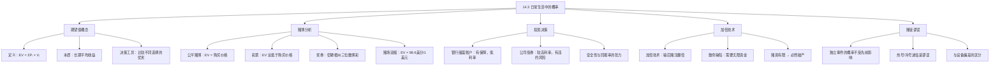

**相关笔记：** [[14.1 关于概率的几种观点|14.1 概率理论]] | [[14.2 概率演算]]

> [!abstract] 概览
> 本节介绍==概率演算==在日常生活、赌博和投资中的实际应用，核心工具是==期望值==（expected value）概念。核心知识点包括：
> - **期望值的定义与计算**：$EV = \sum_{i} P_i \times V_i$，即每个可能结果的收益与其概率之积的总和
> - **公平赌博**：期望值等于购买价格（如抛硬币1赔1）
> - **彩票与奖券**：期望值远低于购买价格（如密歇根州"每天一个三位数"：期望值50美分/1美元）
> - **赌场双骰赌博**：掷骰者赢的概率0.493，期望值98.6美分/1美元
> - **投资决策中的概率思维**：安全性与回报率的权衡、银行利率计算、公司债券风险评估
> - **加倍技术的破产**：为什么"输后加倍"的赌博系统注定失败
> - **赌徒谬误**：独立事件的概率不受先前结果的影响

---

## 一、知识结构总览

---

## 二、核心思想与证明技巧

> [!tip] 核心思想
> 在赌博、投资以及任何涉及不确定性的日常决策中，理性选择的关键工具是==期望值==（expected value）。期望值综合考虑了两个因素：**每个可能结果的概率**和**该结果的收益（或损失）**。通过计算不同选择的期望值，我们可以在==安全性==（safety）和==回报率==（return）之间做出理性的权衡。本节的核心教训是：**几乎所有面向公众的赌博（彩票、赌场）的期望值都低于购买价格**，这意味着从概率角度看，参与者注定是输家。

### 期望值的定义与计算

> [!def] 期望值（Expected Value）
> **期望值**是概率论中衡量赌博或投资价值的核心概念。其定义为：将每个==相互排斥==的可能结果所产生的收益，分别与实现该结果的概率相乘，然后将所有这些乘积==求和==。
>
> **一般公式：**
> $$EV = \sum_{i=1}^{n} P_i \times V_i$$
>
> 其中：
> - $P_i$ = 第 $i$ 个结果发生的概率
> - $V_i$ = 第 $i$ 个结果的收益（payoff）
> - $n$ = 所有可能结果的数量
>
> **关键理解：** 期望值不是"一定会得到的结果"，而是==长期重复的平均结果==。任何单次赌博的实际结果可能与期望值相差甚远，但当试验次数足够多时，平均结果将趋近期望值。

### 公平赌博：期望值等于购买价格

> [!example] 示例1：抛硬币赌博（公平赌博）
> **场景：** 下注1美元，以1赔1的赔率赌一枚公平硬币正面朝上。
>
> **两个可能结果：**
> - 正面朝上：收益 = $2（1美元本金 + 1美元赢得），概率 = $1/2$
> - 反面朝上：收益 = $0（输掉1美元），概率 = $1/2$
>
> **期望值计算：**
> $$EV = \left(\frac{1}{2} \times \$2\right) + \left(\frac{1}{2} \times \$0\right) = \$1 + \$0 = \$1$$
>
> **结论：** 期望值恰好等于购买价格（1美元），因此这是一个==公平赌博==（fair bet）。在这种赌博中，"机会"是均等的，长期来看参与者既不赢也不输。
>
> **核心类比：** 赌博应被看作一次==购买==——下注的钱就是购买价格，买到的"商品"是某个期望值。如果期望值等于购买价格，交易公平；如果期望值低于购买价格，买方吃亏。

### 彩票：期望值远低于购买价格

> [!example] 示例2：抽彩（期望值低于购买价格）
> **场景：** 奖品是一辆价值$20000的汽车，彩票价格为$1。
>
> **情况一：恰好卖出20000张彩票（公平情况）**
> - 中奖概率 = $1/20000$，收益 = $\$20000$
> - 未中奖概率 = $19999/20000$，收益 = $\$0$
> $$EV = \left(\frac{1}{20000} \times \$20000\right) + \left(\frac{19999}{20000} \times \$0\right) = \$1$$
>
> **情况二：卖出40000张彩票（通常情况）**
> - 中奖概率 = $1/40000$，收益 = $\$20000$
> $$EV = \left(\frac{1}{40000} \times \$20000\right) + \left(\frac{39999}{40000} \times \$0\right) = \$0.50$$
>
> **情况三：卖出80000张彩票**
> $$EV = \left(\frac{1}{80000} \times \$20000\right) + \left(\frac{79999}{80000} \times \$0\right) = \$0.25$$
>
> **结论：** 发行彩票的目的是==筹集资金==，只有卖出的钱大于以奖品付出的钱才能筹到资金。因此，==我们购买的任何彩票的期望值必定小于我们为之付出的钱数==。

> [!example] 示例3：密歇根州"每天一个三位数"奖券
> **场景：** 玩家从000到999之间选取一个三位数，1美元单注。选对数字（顺序也正确）获得$500奖励。
>
> - 中奖概率 = $1/1000$（1000个可能数字中恰好1个）
> - 未中奖概率 = $999/1000$
> $$EV = \left(\frac{1}{1000} \times \$500\right) + \left(\frac{999}{1000} \times \$0\right) = \$0.50$$
>
> **结论：** 花1美元购买的期望值仅为50美分，==期望值恰好是购买价格的一半==。密歇根州三分之二以上的公民参与其中，州政府从中获得巨大利润。
>
> **教材原话：** "奖券与抽彩是两个例子，在价格和赌博者购买的期望值之间存在巨大的不相等。"

### 赌场双骰赌博

> [!example] 示例4：赌场双骰赌博（Craps）
> **场景：** 在赌场双骰赌博中，以1赔1的赔率为掷骰子者（shooter）下注。
>
> **已知（由14.2节概率演算计算）：** 掷骰子者赢的概率 = $0.493$
>
> **期望值计算：**
> - 掷骰子者赢：收益 = $\$2$，概率 = $0.493$
> - 掷骰子者输：收益 = $\$0$，概率 = $0.507$
> $$EV = (0.493 \times \$2) + (0.507 \times \$0) = \$0.986$$
>
> **结论：** 每1美元购买的期望值为98.6美分，==赌场拥有约1.4%的优势==。这个优势看似微不足道，但每天在骰桌上有成千上万的下注，赌场的利润异常可观。
>
> **教材金句：** "在博彩兄弟会中，那些经常在双骰赌博中为掷骰子者下注的人被荒谬地称为'正确的赌徒'，然而职业赌徒经常会说：=='所有正确的赌徒死去时都身无分文'==。"

### 投资决策：安全性与回报率的权衡

> [!example] 示例5：银行储蓄账户 vs 公司债券
> **场景：** 有$1000可用于投资，比较两种选择。
>
> **选择A：有保障的银行储蓄账户（5%单利）**
> - 收益 = $\$1000 + (0.05 \times \$1000) = \$1050$
> - 获得收益的概率 = $1$（政府保障，无风险）
> $$EV = (\$1050 \times 1) + (\$0 \times 0) = \$1050$$
>
> **选择B：公司债券（10%利息，有违约风险）**
> - 如果公司履约：收益 = $\$1000 + (0.10 \times \$1000) = \$1100$
> - 如果公司违约：收益 = $\$0$
>
> **情况一：估算公司履约概率为0.99**
> $$EV = (\$1100 \times 0.99) + (\$0 \times 0.01) = \$1089$$
> → 期望值（$1089）> 银行（$1050），公司债券更优
>
> **情况二：重新估算公司履约概率为0.95**
> $$EV = (\$1100 \times 0.95) + (\$0 \times 0.05) = \$1045$$
> → 期望值（$1045）< 银行（$1050），银行账户更优
>
> **核心教训：**
> - ==安全性和收益率一直处于张力状态中==
> - 商业债券支付的利息总是比有保障的银行账户高，因为债券的风险更大
> - 已知的风险越大，利率就要越高，才能吸引投资者
> - ==期望值必须既考虑概率（风险），又要考虑结果（收益）==

### 加倍技术的破产

> [!example] 示例6：加倍技术（Martingale System）为什么注定失败
> **策略描述：** 在一个输赢可能性大致相等、赔率为1赔1的赌博中（如抛硬币），每次输了之后使赌注加倍：
> - 第1次赌 $\$1$，输了
> - 第2次赌 $\$2$，输了
> - 第3次赌 $\$4$，输了
> - 第4次赌 $\$8$，赢了 → 净赢 $\$1$
>
> **表面逻辑：** 反面（或不利结果）持续出现是高度不可能的，最长的序列也必定终止。当它终止时，加倍下注者将总是赢家。
>
> **致命缺陷：**
> 1. 一个不利的序列==可能持续很长==，长到耗尽赌徒有限的赌资
> 2. 为了保证每次都能够持续加倍下注，赌徒一开始就必须具有==无限多的钱==
> 3. ==拥有无限多的钱的人不可能赢==（因为增加无限多的钱在财富意义上是不可能的）
>
> **结论：** 没有一个赌博系统能够逃避概率计算的严酷性。赌场对最高赌注的限定更是直接使加倍方法无法使用。

### 赌徒谬误

> [!def] 赌徒谬误（Gambler's Fallacy）
> **赌徒谬误**是一种常见的概率推理错误：某人假定，由于先前的==独立事件==发生的频率，使得某些未来事件变得更可能发生或更不可能发生。
>
> **典型表现：**
> - 抛硬币连续出现10次正面后，推断下一次"应该"出现反面
> - 某些数字在获奖彩票号码中频繁出现，就认为那些数字是"热点"
>
> **错误根源：** 下一次投掷一枚公平硬币出现正面（或反面）的概率==不会受前面投掷结果的影响==，每一次投掷都是==独立事件==（independent event）。
>
> **与设备偏差的区分：** 如果某个机械装置在长期重复的模式中，产生某种结果比其他结果更为频繁，可能说明设备本身有偏差（如骰子灌铅、轮盘未平衡好）。此时需要区分：
> - **赌徒谬误**：在公平设备上错误地认为概率会"自我修正"
> - **合理推断**：根据累积证据推断设备本身不公平，此时应从验前理论转向==概率的频率理论==

---

## 三、补充理解与易混淆点

### 补充理解

> [!info] 补充1：期望值与期望效用——从描述性到规范性的跨越
> **来源：** Stanford Encyclopedia of Philosophy. (2025). *Decision Theory*. https://plato.stanford.edu/archives/win2025/entries/decision-theory/
>
> 期望值概念是==决策理论==（Decision Theory）的基石。在规范决策理论中，理性决策者应当选择==期望效用==（Expected Utility）最大的选项。期望效用是期望值的推广：
>
> $$EU(A) = \sum_{o \in O} U(o) \times P(o|A)$$
>
> 其中 $U(o)$ 是结果 $o$ 的效用（utility），$P(o|A)$ 是在行动 $A$ 下结果 $o$ 发生的概率。
>
> **期望值 vs 期望效用：**
> - **期望值**假设收益的==货币价值==直接代表其价值
> - **期望效用**引入了==效用函数==，可以捕捉风险厌恶等心理因素
> - 例如：对大多数人而言，失去$1000的痛苦大于赢得$1000的快乐，这意味着效用函数是==凹函数==
>
> **实践意义：** 教材中银行账户 vs 公司债券的比较本质上就是期望效用分析——当公司债券的违约概率从0.99降到0.95时，即使期望值仍然较高，风险厌恶的投资者也可能偏好银行账户。

> [!info] 补充2：赌徒谬误的认知科学解释
> **来源：** Wizard of Odds. *The Truth about Betting Systems*. https://wizardofodds.com/gambling/betting-systems/
>
> 赌徒谬误是==认知偏差==（cognitive bias）的经典案例，其背后有深刻的心理学根源：
>
> **代表性启发式（Representativeness Heuristic）：**
> - 人们倾向于认为小样本应当反映总体特征
> - 如果抛硬币5次都出正面，人们觉得这"不代表"公平硬币的特征，因此预期下一次会"纠正"
> - 但实际上，在公平硬币的假设下，连续5次正面的概率是 $(1/2)^5 = 1/32$，虽然不高但绝非不可能
>
> **赌徒谬误 vs 热手谬误（Hot Hand Fallacy）：**
> - **赌徒谬误**：认为独立事件的概率会"回归均值"（连续正面后预期反面）
> - **热手谬误**：认为连续成功意味着未来更可能成功（篮球运动员"手热"时被认为投篮更准）
> - 这两种谬误看似方向相反，但==根源相同==：都错误地认为独立事件之间存在因果联系
>
> **对加倍技术（Martingale）的量化分析：**
> - 假设赌徒有$N$美元的初始资金，每次从$\$1$开始加倍
> - 连续输 $k$ 次后的总损失为 $\$1 + \$2 + \$4 + \cdots + \$2^{k-1} = \$2^k - 1$
> - 连续输 $k$ 次的概率为 $(1/2)^k$
> - 当 $2^k - 1 > N$ 时，赌徒无法继续加倍，即连续输 $\lfloor \log_2(N+1) \rfloor + 1$ 次就会破产
> - 即使赌徒有$1000$，只需连续输10次（概率约$1/1024$）就会破产

> [!info] 补充3：期望值在金融投资中的实际应用
> **来源：** Investopedia. *Expected Value: Definition, Formula, and Examples*. https://www.investopedia.com/terms/e/expected-value.asp
>
> 期望值在金融领域有广泛的应用，是投资分析的基本工具：
>
> **期望值的金融意义：**
> - 正期望值（$EV > 0$）：策略在长期内预期盈利
> - 负期望值（$EV < 0$）：策略在长期内预期亏损
> - 所有赌场游戏对玩家都是负期望值，这正是赌场盈利的根本原因
>
> **大数定律（Law of Large Numbers）的作用：**
> - 单次赌博的结果高度不确定，但大量重复后平均结果趋近期望值
> - 赌场的优势在于：它不是在玩一次赌博，而是==同时进行成千上万次赌博==
> - 这解释了为什么赌场不怕偶尔有人赢大奖——长期来看，概率站在赌场一边
>
> **教材中的投资比较框架可以推广为：**
> $$EV_{\text{投资}} = \sum_{i} P_i \times R_i$$
> 其中 $R_i$ 是第 $i$ 种情景下的总回报（包括本金），$P_i$ 是该情景的概率
> - 银行账户：$EV = 1.0 \times \$1050 + 0.0 \times \$0 = \$1050$
> - 公司债券（高可靠性）：$EV = 0.99 \times \$1100 + 0.01 \times \$0 = \$1089$
> - 公司债券（低可靠性）：$EV = 0.95 \times \$1100 + 0.05 \times \$0 = \$1045$

### 易混淆点

> [!warning] 误区：期望值就是"最可能的结果"
> ❌ **错误理解：** 期望值就是最有可能实际发生的结果。如果彩票的期望值是50美分，那么我"应该"预期得到50美分。
>
> ✅ **正确理解：** 期望值是==长期重复的平均结果==，而不是单次试验的最可能结果。在密歇根州"每天一个三位数"的例子中：
> - 期望值 = 50美分
> - 但实际结果只有两种：要么赢得$500（概率1/1000），要么赢得$0（概率999/1000）
> - ==50美分永远不会作为实际结果出现==
> - 期望值的意义在于：如果你买了1000张彩票，你的总收益大约是$500
>
> **类比：** 期望值就像一个班级的平均身高——它不代表任何一个具体学生的身高，但能反映整体趋势。

> [!warning] 误区：加倍技术能够"保证"赢钱
> ❌ **错误理解：** 加倍技术（Martingale）是一个聪明的策略，因为不利序列不可能无限持续，所以只要坚持加倍，最终一定能赢回所有损失并额外盈利1个单位。
>
> ✅ **正确理解：** 加倍技术==注定失败==，原因有三：
>
> | 问题 | 详细说明 |
> |:-----|:---------|
> | **赌资有限** | 连续输 $k$ 次需要 $2^k - 1$ 美元。连续输10次需要$1023，连续输20次需要超过$100万 |
> | **赌场限注** | 赌场设定最高赌注上限，使加倍方法在达到赢利点之前就被迫停止 |
> | **期望值不变** | 无论使用什么"系统"，每1美元赌注的期望值仍然是98.6美分（双骰赌博），不会因为加倍而改变 |
>
> **数学证明：** 设赌博的赢面为 $p < 0.5$，赔率为1:1。加倍技术的期望值：
> $$EV = p \times (\text{最终赢得的金额}) - (1-p) \times (\text{最终损失的金额})$$
> 由于每次下注的期望值都是负的，==任何下注策略的期望值都是负的==。不存在能够将负期望值变为正期望值的"系统"。

> [!warning] 误区：设备偏差和赌徒谬误是一回事
> ❌ **错误理解：** 认为轮盘赌某个数字频繁出现就下注该数字，和认为连续出红后下注黑色，犯的是同一种错误。
>
> ✅ **正确理解：** 这是两种完全不同的推理：
>
> | 特征 | 赌徒谬误 | 合理的设备偏差推断 |
> |:-----|:---------|:-----------------|
> | **假设前提** | 设备是公平的 | 设备可能不公平 |
> | **推理方向** | 从公平假设推导出"应该纠正" | 从累积数据推断设备有偏差 |
> | **概率理论** | 验前理论（等可能结果） | 频率理论（相对频率极限） |
> | **是否合理** | 不合理（独立事件无记忆） | 可以合理（如果有充分统计证据） |
>
> **辨析关键：** 当我们有充分证据表明骰子灌铅或轮盘失衡时，根据频率数据调整概率估算是==合理的归纳推理==。赌徒谬误的错误在于：在==没有证据表明设备不公平==的情况下，仅凭短期的随机波动就做出概率会"纠正"的推断。

---

## 四、习题精选

> [!todo] 习题概览
> | 题号 | 核心考点 | 难度 |
> |:-----|:---------|:-----|
> | 1 | 计算彩票期望值（弗吉尼亚抽奖案例） | ⭐⭐ |
> | 2 | 计算赌场"难得的4"的期望值 | ⭐⭐⭐ |

### 题1：弗吉尼亚抽奖的期望值

> [!problem] 题目
> 在1992年弗吉尼亚抽奖中，从44个数字中随机抽出6个数字。赢者只需以任何顺序选对全部6个数字；每张彩票花费$1。6个数字的所有可能组合有7059052个。该年二月的一周，弗吉尼亚抽彩头奖已经累积上升到$2700万。
>
> (a) 在该周里弗吉尼亚抽奖中每张彩票的期望值为多少？
> (b) 一个澳大利亚赌博财团成功购买了500万张彩票，他们花$500万购买的期望值为多少？

> [!faq]- 解答
> **(a) 单张彩票的期望值：**
>
> - 中头奖的概率：$P = 1/7059052$
> - 头奖收益：$V = \$27000000$
> - 未中奖概率：$1 - 1/7059052$
> - 未中奖收益：$\$0$
>
> $$EV = \left(\frac{1}{7059052} \times \$27000000\right) + \left(\frac{7059051}{7059052} \times \$0\right) \approx \$3.83$$
>
> **注意：** 此时期望值（$\approx \$3.83$）> 购买价格（$\$1$），这是一个罕见的==正期望值彩票==！这正是澳大利亚财团决定大量购买的原因。
>
> **(b) 购买500万张彩票的期望值：**
>
> 由于500万 < 7059052（总组合数），每张彩票的期望值相同：
> $$EV_{\text{总}} = 5000000 \times \$3.83 \approx \$19150000$$
>
> 花费$\$5000000$，期望收益$\approx \$19150000$，==期望净盈利约$\$14150000$==。
>
> **教材注：** "是的，澳大利亚人赢了！"
>
> $\blacksquare$

### 题2：赌场"难得的4"的期望值

> [!problem] 题目
> 在赌场双骰赌博中，赌场提供给掷出"难得的"4（即一对2出现）的赔率为6比1。如果一对2在点数7被掷出来之前或者在"易得的"点数4被掷出来之前出现，下注在"难得的"4上就赢了；否则就输了。用$1下注在"难得的"4上的购买期望值为多少？

> [!faq]- 解答
> **第1步：计算掷出"难得的4"（一对2）的概率。**
>
> 掷两枚骰子的总结果数 = $6 \times 6 = 36$。
>
> 掷出"难得的4"（即2+2）的方式数 = $1$。
>
> 掷出"易得的4"（即1+3或3+1）的方式数 = $2$。
>
> 掷出点数7（即1+6, 2+5, 3+4, 4+3, 5+2, 6+1）的方式数 = $6$。
>
> 掷出其他点数的方式数 = $36 - 1 - 2 - 6 = 27$。
>
> **第2步：确定赢的条件。**
>
> 下注"难得的4"赢的条件是：在掷出7或"易得的4"之前，先掷出一对2。
>
> 这需要计算条件概率。在第一掷就决定结果的概率：
> - 第一掷就是一对2（赢）：$1/36$
> - 第一掷就是7（输）：$6/36$
> - 第一掷就是"易得的4"（输）：$2/36$
> - 第一掷是其他数字（继续）：$27/36$
>
> **第3步：计算赢的总概率。**
>
> 设 $p$ 为"难得的4"赢的概率。在第一掷后：
> - 直接赢：$1/36$
> - 直接输：$(6+2)/36 = 8/36$
> - 继续（回到相同状态）：$27/36$
>
> $$p = \frac{1}{36} + \frac{27}{36} \times p$$
> $$p - \frac{27}{36}p = \frac{1}{36}$$
> $$\frac{9}{36}p = \frac{1}{36}$$
> $$p = \frac{1}{9}$$
>
> **第4步：计算期望值。**
>
> 赔率为6比1，即下注$1赢了获得$\$6 + \$1 = \$7$。
>
> $$EV = \left(\frac{1}{9} \times \$7\right) + \left(\frac{8}{9} \times \$0\right) = \frac{7}{9} \approx \$0.778$$
>
> **结论：** 花$1购买的期望值约为77.8美分，赌场优势约为22.2%。这是一个期望值远低于购买价格的赌博。
>
> $\blacksquare$

> [!tip] 解题思路提示
> 期望值问题的解题流程：
> 1. **确定所有可能结果**——列出赌博或投资的所有互斥结果
> 2. **计算每个结果的概率**——使用概率演算的加法和乘法定理
> 3. **确定每个结果的收益**——注意收益是否包含本金
> 4. **代入期望值公式**——$EV = \sum P_i \times V_i$
> 5. **比较期望值与购买价格**——$EV >$ 价格为正期望值，$EV <$ 价格为负期望值
> 6. **注意概率之和为1**——确保所有互斥结果的概率之和恰好等于1

---

## 五、视频学习指南

> [!info] 视频资源
> | 资源 | 链接 | 对应内容 | 备注 |
> |:-----|:-----|:---------|:-----|
> | Khan Academy: Expected Value | [链接](https://www.khanacademy.org/math/statistics-probability/probability-library) | 期望值基础概念 | 英文，系统讲解 |
> | 3Blue1Brown: Probability | [链接](https://www.youtube.com/playlist?list=PLZHQObOWTQDPD3MizzM2xVFitgF8hE_ab) | 概率论可视化 | 英文，高质量动画 |
> | Crash Course: Statistics | [链接](https://www.youtube.com/playlist?list=PL8dPuuaLjXtNM_Y-bUAhblSAdWRnm4btN) | 统计学基础 | 英文，含概率章节 |

---

## 六、教材原文

> [!quote] 教材原文
> **来源：** 逻辑学导论 第15版，第14章第3节
>
> **期望值的定义：**
> 我们将每个可能结果下产生的收益与实现该结果的概率值相乘，所有这些乘积之和，即为该赌博或投资的期望或期望值。
>
> **赌博作为购买：**
> 任何一种赌博（如打1美元的赌，以一赔一的赔率赌一枚硬币正面朝上）均应看成是一次购买，进行打赌的时候，钱便花了出去。下的注便是购买的价格，它购买的是某个期望，或期望值。
>
> **安全性与回报率的张力：**
> 最安全的投资不会是最好的投资，许诺成功后有最大回报的投资同样不是最好的投资。我们不仅在赌博和投资中需要在安全性和最大回报之间进行协调，而且要在教育、择业及生活中其他方面的诸多可能性之间进行协调。
>
> **赌徒谬误：**
> 下一次投掷一枚公平的硬币出现正面（或反面）的概率不会受前面投掷结果的影响，每一次投掷都是独立事件。因此，在投掷一枚硬币时，由于正面朝上已经在一个序列中出现了10次，就推断出下一次将会出现反面，或者由于特定的数字在获奖的彩票号码中频繁出现，就认为那些数字是热点，这些都是愚蠢的错误。某人假定，由于先前的独立事件发生的频率，使得某些未来事件变得更可能发生，或更不可能发生。他据此进行下注或投资。这样他就会犯大错，该错如此常见，以致被冠上"赌徒谬误"这一嘲讽性名字。
>
> **所有正确的赌徒死去时都身无分文：**
> 在博彩兄弟会中，那些经常在双骰赌博中为掷骰子者下注的人被荒谬地称为"正确的赌徒"，然而职业赌徒经常会说："所有正确的赌徒死去时都身无分文。"
>
> **期望值在投资中的意义：**
> 当我们能够确定一给定收益——如果我们能够实现的话——的大致值时，这里描述的计算方法能够使我们确定那些结果在现有证据下需要具有多大的概率，才能证明我们现在的投资是值得的。金融事务中的许多决策以及日常生活中的许多选择，如果是理性的话，都建立在这样的概率估算和作为结果的期望值之上。只要我们对未来下赌注，概率计算就能够应用。

---

## 参见 Wiki

- [[因果联系]] -- 因果推理与概率推理的关系，概率是因果推断的基础工具
- [[归纳逻辑]] -- 概率论是归纳逻辑的量化分支，期望值是归纳决策的核心工具
- [[密尔五法]] -- 密尔的因果分析方法与概率演算共同构成归纳推理的工具箱
- [[科学说明]] -- 科学假说的评价涉及概率估算，期望值思维贯穿科学决策
- [[假说-演绎法]] -- 假说的验证涉及概率计算，期望值帮助评估假说的整体证据支持度
- [[演绎论证]] -- 概率论证属于归纳论证，与演绎论证的确定性形成对比
- [[归纳论证]] -- 概率推理是归纳论证的核心类型，期望值为归纳结论提供量化评估

#学习/逻辑学/概率
