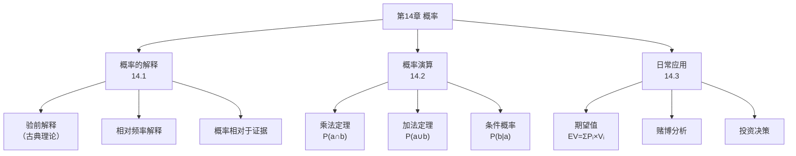

**相关笔记：** [[13.3 对竞争性科学说明的评价]] | [[12.4 因果分析的方法]]

> [!abstract] 概览
> 第14章是全书的终章，为归纳逻辑提供了定量评价工具——概率。全章从概率的哲学解释出发（[[14.1 关于概率的几种观点]]），系统讲解概率演算的基本定理（[[14.2 概率演算]]），最后将概率理论应用于日常决策（[[14.3 日常生活中的概率]]）。概率是归纳逻辑的核心评价性概念，正如皮尔斯所言："概率理论就是定量地研究逻辑的科学。"

---

## 一、全章知识框架

## 二、各节核心要点

### 14.1 关于概率的几种观点

**概率的两种解释**：

| 解释 | 定义 | 公式 | 示例 |
|:-----|:-----|:-----|:-----|
| ==验前解释==（古典理论） | 等可能结果中成功数/可能数 | $P = \frac{\text{成功数}}{\text{可能数}}$ | 掷硬币正面朝上 = 1/2 |
| ==相对频率解释== | 参照类中体现属性的相对频率 | $P = \frac{\text{具有属性的成员数}}{\text{参照类成员总数}}$ | 25岁美国妇女存活率 = 0.971 |

> [!tip] 共同点
> 两种解释都主张：==概率相对于证据==，任何事件不具有内在概率。

### 14.2 概率演算（==全章核心==）

**两大基本定理**：

| 定理 | 适用条件 | 公式 |
|:-----|:---------|:-----|
| ==乘法定理== | 共同发生 | 独立：$P(a \cap b) = P(a) \times P(b)$ |
| | | 非独立：$P(a \cap b) = P(a) \times P(b\|a)$ |
| ==加法定理== | 替代性发生 | 互斥：$P(a \cup b) = P(a) + P(b)$ |
| | | 非互斥：$P(a \cup b) = P(a) + P(b) - P(a \cap b)$ |

**经典实例**：双骰赌博中掷骰者赢的概率 = 244/495 ≈ 0.493

### 14.3 日常生活中的概率

**期望值公式**：
$$EV = \sum_{i} P_i \times V_i$$

| 场景 | 期望值 | 结论 |
|:-----|:-------|:-----|
| 公平抛硬币（1:1） | $1.00 | 期望值 = 价格 |
| 密歇根州三位数奖券 | $0.50 | 期望值 = 价格的50% |
| 赌场双骰赌博 | $0.986 | 期望值 < 价格（赌场优势） |

> [!warning] 赌徒谬误
> "所有正确的赌徒死去时都身无分文"——赌场的优势虽小（~1.4%），但大量下注确保了利润。

## 三、跨章节关联

| 关联方向 | 关联内容 |
|:---------|:---------|
| ←第13章 | [[假说-演绎法]]中假说的确证程度可用概率量化 |
| ←第12章 | [[密尔五法]]的归纳结论是概率性的，概率为其提供量化评价 |
| ←第11章 | [[休谟问题]]：归纳推理的合理性无法被演绎证明，概率理论是其回应之一 |
| ←第1章 | [[演绎论证]]具有确定性，[[归纳论证]]具有概率性——概率是归纳的评价工具 |

## 四、待创建Wiki概念页

- 概率（核心概念，全书终章主题）
- 期望值（决策理论核心概念）
- 条件概率（概率演算核心概念）
- 赌徒谬误（常见推理错误）

---

> [!quote] 全书总结
> 概率理论为归纳逻辑提供了定量评价的基础。从第11章的类比推理，到第12章的密尔五法，到第13章的科学假说，再到第14章的概率演算——归纳逻辑从定性走向定量，构成了完整的推理方法论体系。"概率理论就是定量地研究逻辑的科学。"——C.S.皮尔斯
